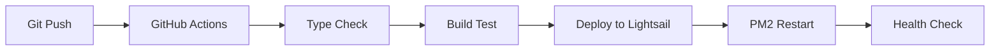

# O4O Platform Architecture

**프로젝트**: O4O Platform - Microservices E-commerce Platform  
**버전**: 2.0  
**최종 업데이트**: 2025-07-02  
**기술 스택**: TypeScript, React 19, Node.js 20, PostgreSQL, AWS Lightsail  

---

## 🏗️ 전체 아키텍처 개요

O4O Platform은 마이크로서비스 아키텍처 기반의 E-commerce 플랫폼으로, 모노레포 구조를 통해 다양한 서비스를 통합 관리합니다.

### 📊 시스템 구성도

```
┌─────────────────────────────────────────────────────────────┐
│                    O4O Platform Ecosystem                   │
├─────────────────────────────────────────────────────────────┤
│  Client Layer                                               │
│  ┌─────────────┐ ┌─────────────┐ ┌─────────────┐          │
│  │ Main Site   │ │ Admin       │ │ Mobile      │          │
│  │ (React 19)  │ │ Dashboard   │ │ (Future)    │          │
│  │ Port: 3000  │ │ (React 18)  │ │             │          │
│  └─────────────┘ └─────────────┘ └─────────────┘          │
├─────────────────────────────────────────────────────────────┤
│  API Gateway / Load Balancer                               │
│  ┌─────────────────────────────────────────────────────────┐│
│  │           Nginx (AWS Lightsail)                         ││
│  │           neture.co.kr                                  ││
│  └─────────────────────────────────────────────────────────┘│
├─────────────────────────────────────────────────────────────┤
│  Service Layer                                              │
│  ┌─────────────┐ ┌─────────────┐ ┌─────────────┐          │
│  │ API Server  │ │ Image       │ │ Future      │          │
│  │ (Express)   │ │ Service     │ │ Services    │          │
│  │ Port: 4000  │ │ (Standalone)│ │             │          │
│  └─────────────┘ └─────────────┘ └─────────────┘          │
├─────────────────────────────────────────────────────────────┤
│  Data Layer                                                 │
│  ┌─────────────┐ ┌─────────────┐ ┌─────────────┐          │
│  │ PostgreSQL  │ │ File        │ │ Redis       │          │
│  │ (Primary)   │ │ Storage     │ │ (Future)    │          │
│  │ Port: 5432  │ │ (AWS)       │ │             │          │
│  └─────────────┘ └─────────────┘ └─────────────┘          │
└─────────────────────────────────────────────────────────────┘
```

---

## 🚀 서비스 아키텍처

### **활성 서비스 (Production Ready)**

#### **1. API Server** (`services/api-server/`)
- **역할**: 핵심 백엔드 API 서버
- **기술스택**: Node.js 20 + Express.js + TypeORM + PostgreSQL
- **포트**: 4000
- **주요기능**:
  - 사용자 인증/인가 (JWT)
  - E-commerce 로직 (상품, 주문, 장바구니)
  - 역할 기반 가격 정책 (CUSTOMER/BUSINESS/AFFILIATE/ADMIN)
  - RESTful API 엔드포인트
- **데이터베이스**: PostgreSQL (20+ 엔티티)

#### **2. Main Site** (`services/main-site/`)
- **역할**: 메인 웹사이트 (고객용)
- **기술스택**: React 19 + Vite + TailwindCSS
- **포트**: 3000
- **배포**: AWS Lightsail (neture.co.kr)
- **주요기능**:
  - 상품 카탈로그 및 검색
  - 장바구니 및 주문 처리
  - 사용자 대시보드
  - 반응형 UI/UX

#### **3. Admin Dashboard** (`services/admin-dashboard/`)
- **역할**: 관리자 대시보드
- **기술스택**: React 18 + Vite + TailwindCSS
- **주요기능**:
  - 사용자/상품/주문 관리
  - 분석 및 리포팅
  - 정책 설정
  - 콘텐츠 관리

#### **4. Shared Library** (`shared/`)
- **역할**: 공통 컴포넌트 라이브러리
- **패키지명**: `@o4o/shared`
- **주요기능**:
  - UI 컴포넌트 (Button, Modal, Table 등)
  - TipTap 에디터 (WordPress 스타일)
  - 테마 시스템 (다크모드 지원)
  - 공통 비즈니스 로직

### **개발 중 서비스**

#### **5. Crowdfunding** (`services/crowdfunding/`)
- **상태**: 프론트엔드만 구현 (백엔드 연동 필요)
- **기술스택**: React 18 + Vite
- **계획**: 크라우드펀딩 플랫폼 기능

#### **6. Image Service** (`src/`)
- **상태**: 독립적 이미지 처리 서비스
- **기술스택**: Node.js + Sharp + WebP
- **기능**: 이미지 최적화, 압축, 포맷 변환
- **권장**: `services/image-service/`로 이동 고려

### **계획 중 서비스**

#### **7. Forum** (`services/forum/`)
- **상태**: 플레이스홀더 (README만 존재)
- **계획**: 커뮤니티 포럼 기능

#### **8. Digital Signage** (`services/signage/`)
- **상태**: 플레이스홀더 (README만 존재)
- **계획**: 디지털 사이니지 콘텐츠 관리

### **레거시 서비스**

#### **9. E-commerce** (`services/ecommerce/`)
- **상태**: 레거시 (main-site로 통합됨)
- **권장**: 완전한 검토 후 제거 고려

---

## 🗄️ 데이터베이스 아키텍처

### **PostgreSQL Schema**

```sql
-- 핵심 엔티티 구조
┌─────────────────┐    ┌─────────────────┐    ┌─────────────────┐
│ User            │    │ Product         │    │ Order           │
├─────────────────┤    ├─────────────────┤    ├─────────────────┤
│ id (PK)         │    │ id (PK)         │    │ id (PK)         │
│ email           │    │ name            │    │ userId (FK)     │
│ password        │    │ retailPrice     │    │ status          │
│ role            │◄──┐│ wholesalePrice  │    │ totalAmount     │
│ createdAt       │   ││ affiliatePrice  │    │ createdAt       │
└─────────────────┘   │└─────────────────┘    └─────────────────┘
                      │
                      │┌─────────────────┐    ┌─────────────────┐
                      ││ Cart            │    │ Category        │
                      │├─────────────────┤    ├─────────────────┤
                      ││ id (PK)         │    │ id (PK)         │
                      │┤ userId (FK)     │    │ name            │
                      ││ createdAt       │    │ description     │
                      │└─────────────────┘    │ parentId (FK)   │
                      │                       └─────────────────┘
                      │
                      │┌─────────────────┐
                      ││ CartItem        │
                      │├─────────────────┤
                      ││ id (PK)         │
                      ││ cartId (FK)     │
                      ││ productId (FK)  │
                      ││ quantity        │
                      │└─────────────────┘
                      └─
```

### **핵심 엔티티**

1. **User**: 사용자 관리 (역할 기반 접근 제어)
2. **Product**: 상품 관리 (다중 가격 정책)
3. **Cart/CartItem**: 장바구니 시스템
4. **Order/OrderItem**: 주문 처리 (ACID 트랜잭션)
5. **Category**: 상품 분류
6. **CustomPost/CustomPostType**: CMS 기능
7. **MediaFile/MediaFolder**: 미디어 관리
8. **Page/Template**: 페이지 빌더
9. **CustomField**: 동적 필드 시스템

### **가격 정책 로직**

```typescript
// Product Entity의 역할 기반 가격 로직
getPriceForUser(userRole: string): number {
  switch (userRole) {
    case 'BUSINESS':   return this.wholesalePrice || this.retailPrice;
    case 'AFFILIATE':  return this.affiliatePrice || this.retailPrice;
    case 'ADMIN':      return this.wholesalePrice || this.retailPrice;
    default:          return this.retailPrice; // CUSTOMER
  }
}
```

---

## 🌐 네트워크 아키텍처

### **Production 배포 구조**

```
Internet
    │
    ▼
┌─────────────────────────────────────┐
│ AWS Lightsail (neture.co.kr)        │
│ IP: 13.125.144.8                    │
├─────────────────────────────────────┤
│ Nginx (Reverse Proxy)               │
│ ├─ / → React App (Port 3000)        │
│ ├─ /api → API Server (Port 4000)    │
│ └─ /admin → Admin Dashboard         │
├─────────────────────────────────────┤
│ PM2 Process Manager                 │
│ ├─ main-site (React App)            │
│ ├─ api-server (Express)             │
│ └─ admin-dashboard                  │
├─────────────────────────────────────┤
│ PostgreSQL Database                 │
│ Port: 5432                          │
│ Database: o4o_platform              │
└─────────────────────────────────────┘
```

### **Development 환경**

```
Local Development
    │
    ▼
┌─────────────────────────────────────┐
│ Localhost                           │
├─────────────────────────────────────┤
│ main-site: http://localhost:3000    │
│ api-server: http://localhost:4000   │
│ admin-dashboard: http://localhost:.. │
├─────────────────────────────────────┤
│ Local PostgreSQL                   │
│ Port: 5432                          │
│ Database: o4o_platform_dev          │
└─────────────────────────────────────┘
```

---

## 🔧 기술 스택 세부사항

### **Frontend Technologies**
- **React 19**: 메인 프론트엔드 프레임워크 (최신)
- **React 18**: 관리자 대시보드 (마이그레이션 예정)
- **Vite**: 빌드 도구 및 개발 서버
- **TailwindCSS 4.x**: 유틸리티 퍼스트 CSS 프레임워크
- **TypeScript 5.8**: 정적 타입 검사
- **React Router 7**: 클라이언트 사이드 라우팅
- **Zustand**: 상태 관리 (경량)
- **React Query**: 서버 상태 관리
- **TipTap**: 리치 텍스트 에디터

### **Backend Technologies**
- **Node.js 20**: 서버 런타임
- **Express.js**: 웹 프레임워크
- **TypeORM**: ORM (Object-Relational Mapping)
- **PostgreSQL 15+**: 메인 데이터베이스
- **JWT**: 인증 토큰
- **bcryptjs**: 패스워드 해싱
- **Multer**: 파일 업로드
- **Sharp**: 이미지 처리
- **Socket.io**: 실시간 통신

### **DevOps & Infrastructure**
- **AWS Lightsail**: 클라우드 호스팅
- **PM2**: 프로세스 관리자
- **Nginx**: 리버스 프록시
- **GitHub Actions**: CI/CD 파이프라인
- **WSL Ubuntu**: 개발 환경 (Docker 미사용)

### **Development Tools**
- **npm Workspaces**: 모노레포 관리
- **ESLint**: 코드 품질 검사
- **Prettier**: 코드 포맷팅
- **Jest**: 유닛 테스트
- **Playwright**: E2E 테스트
- **Volta**: Node.js 버전 관리

---

## 📁 프로젝트 구조

### **루트 레벨 구조**

```
o4o-platform/
├── .archive/                    # 백업 및 충돌 파일 보관
├── .claude/                     # Claude Code 설정
├── .github/workflows/           # GitHub Actions CI/CD
├── docs/                        # 프로젝트 문서
│   ├── setup/                   # 설정 관련 문서
│   ├── deployment/              # 배포 관련 문서
│   └── development/             # 개발 도구 문서
├── logs/                        # 로그 파일들
├── scripts/                     # 자동화 스크립트
├── services/                    # 마이크로서비스들
├── shared/                      # 공통 라이브러리
├── src/                         # 이미지 처리 서비스
├── tests/                       # 테스트 파일
├── ARCHITECTURE.md              # 이 문서
├── CLAUDE.md                    # Claude AI 지침서
├── FRONTEND_GUIDELINES.md       # 프론트엔드 가이드라인
├── README.md                    # 프로젝트 개요
└── package.json                 # 워크스페이스 설정
```

### **Services 디렉토리 구조**

```
services/
├── api-server/                  # 🟢 활성 - 백엔드 API
│   ├── src/
│   │   ├── controllers/         # API 컨트롤러
│   │   ├── entities/            # TypeORM 엔티티
│   │   ├── middleware/          # Express 미들웨어
│   │   ├── routes/              # API 라우트
│   │   └── database/            # DB 연결 설정
│   └── package.json
├── main-site/                   # 🟢 활성 - 메인 웹사이트
│   ├── src/
│   │   ├── components/          # React 컴포넌트
│   │   ├── pages/               # 페이지 컴포넌트
│   │   ├── api/                 # API 클라이언트
│   │   └── assets/              # 정적 자원
│   └── package.json
├── admin-dashboard/             # 🟢 활성 - 관리자 대시보드
├── crowdfunding/                # 🟡 개발중 - 크라우드펀딩
├── ecommerce/                   # 🔴 레거시 - 이커머스
├── forum/                       # ⚪ 계획중 - 포럼
└── signage/                     # ⚪ 계획중 - 사이니지
```

---

## 🔄 개발 워크플로우

### **개발 환경 설정**

```bash
# 1. 프로젝트 클론
git clone https://github.com/Renagang21/o4o-platform.git
cd o4o-platform

# 2. Node.js 20 설정 (Volta 사용)
volta install node@20

# 3. 전체 의존성 설치
npm run install:all

# 4. 로컬 PostgreSQL 설정 (Docker 미사용)
# PostgreSQL 15+ 직접 설치 및 설정

# 5. 환경 변수 설정
cp .env.example .env
# .env 파일 편집

# 6. 데이터베이스 마이그레이션
cd services/api-server
npm run migration:run

# 7. 개발 서버 시작
npm run dev:all  # 모든 서비스 동시 시작
```

### **개발 명령어**

```bash
# 개발 서버
npm run dev:all          # 모든 서비스 동시 시작
npm run dev:api          # API 서버만 (port 4000)
npm run dev:web          # 웹사이트만 (port 3000)
npm run dev:admin        # 관리자 대시보드만

# 빌드
npm run build:all        # 모든 서비스 빌드
npm run build:api        # API 서버 빌드
npm run build:web        # 웹사이트 빌드

# 코드 품질
npm run type-check:all   # TypeScript 타입 체크
npm run lint:all         # ESLint 검사
npm run prettier:all     # 코드 포맷팅

# 테스트
npm run test             # 유닛 테스트
npm run test:integration # 통합 테스트
npm run test:e2e         # E2E 테스트

# 데이터베이스
npm run migration:generate  # 마이그레이션 생성
npm run migration:run       # 마이그레이션 실행
```

### **Git 워크플로우**

```bash
# 1. 기능 브랜치 생성
git checkout -b feature/new-feature

# 2. 개발 및 테스트
npm run dev:all
npm run test
npm run type-check:all

# 3. 커밋
git add .
git commit -m "feat: add new feature"

# 4. 푸시 및 PR
git push origin feature/new-feature
# GitHub에서 Pull Request 생성

# 5. 메인 브랜치 병합 (자동 배포 트리거)
```

---

## 🚀 배포 아키텍처

### **CI/CD 파이프라인**



### **배포 프로세스**

1. **트리거**: `main` 브랜치에 푸시
2. **GitHub Actions**: 자동 빌드 및 배포
3. **SSH 배포**: AWS Lightsail 서버에 코드 전송
4. **빌드**: 프로덕션 빌드 실행
5. **PM2 재시작**: 서비스 재시작
6. **헬스 체크**: 서비스 정상 작동 확인

### **환경별 설정**

- **Development**: 로컬 PostgreSQL, Vite dev 서버
- **Staging**: AWS Lightsail, 프로덕션 빌드
- **Production**: AWS Lightsail, 최적화된 빌드

---

## 🔒 보안 아키텍처

### **인증 및 인가**

```typescript
// JWT 기반 인증 플로우
User Login → JWT Token → Role-based Access Control

// 역할별 권한
CUSTOMER   → 상품 조회, 주문 생성
BUSINESS   → 도매 가격 접근, 대량 주문
AFFILIATE  → 특별 가격 접근, 커미션 관리
ADMIN      → 전체 시스템 관리
```

### **보안 조치**

- **패스워드**: bcrypt 해싱 (12 rounds)
- **Rate Limiting**: 100 requests per 15 minutes
- **CORS**: 적절한 도메인 허용
- **XSS 방지**: DOMPurify 사용
- **CSRF 방지**: JWT 토큰 검증
- **환경 변수**: 민감 정보 분리

---

## 📈 성능 최적화

### **Frontend 최적화**

- **Code Splitting**: React.lazy() 사용
- **Bundle Optimization**: Vite 최적화
- **Image Optimization**: Sharp + WebP
- **Caching**: Browser caching 전략

### **Backend 최적화**

- **Database Connection Pooling**: Min 5, Max 20
- **Query Optimization**: TypeORM query builder
- **Memory Management**: Node.js heap 최적화
- **Response Compression**: gzip 압축

### **Infrastructure 최적화**

- **CDN**: 정적 자원 캐싱
- **Load Balancing**: Nginx 설정
- **PM2 Clustering**: 멀티 프로세스 활용

---

## 📋 유지보수 가이드

### **모니터링**

- **Application Logs**: PM2 logs
- **Error Tracking**: 서버 로그 모니터링
- **Performance**: Health check 스크립트
- **Database**: PostgreSQL 모니터링

### **백업 전략**

- **코드**: Git 버전 관리
- **데이터베이스**: 정기 PostgreSQL 백업
- **설정 파일**: `.archive` 폴더 활용
- **미디어 파일**: AWS 스토리지 백업

### **업데이트 절차**

1. **의존성 업데이트**: 정기적인 패키지 업데이트
2. **보안 패치**: 즉시 적용
3. **기능 업데이트**: 단계적 배포
4. **데이터베이스 스키마**: 마이그레이션 사용

---

## 🔮 로드맵

### **단기 계획 (1-3개월)**

- ✅ React 버전 통일 (React 19)
- ✅ 의존성 버전 표준화
- ✅ TypeScript strict 모드 활성화
- ✅ 이미지 서비스 통합

### **중기 계획 (3-6개월)**

- 🔄 Forum 서비스 개발
- 🔄 Digital Signage 시스템 구축
- 🔄 Mobile App 개발 시작
- 🔄 Redis 캐싱 도입

### **장기 계획 (6-12개월)**

- 🔄 마이크로서비스 확장
- 🔄 Kubernetes 마이그레이션 고려
- 🔄 GraphQL API 도입
- 🔄 실시간 기능 강화

---

## 📞 연락처 및 지원

- **프로젝트 저장소**: https://github.com/Renagang21/o4o-platform
- **문서**: `docs/` 폴더 참조
- **이슈 트래킹**: GitHub Issues
- **개발 가이드**: `CLAUDE.md`, `FRONTEND_GUIDELINES.md`

---

**이 문서는 O4O Platform의 전체 아키텍처를 포괄적으로 설명합니다. 프로젝트에 참여하는 모든 개발자는 이 문서를 숙지하고 아키텍처 원칙을 준수해야 합니다.**

*최종 업데이트: 2025-07-02*