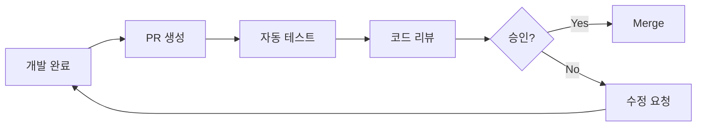

# 🤝 O4O Platform 협업 가이드

## 📖 **개요**
O4O Platform 개발 시 팀원 간 효율적인 협업을 위한 종합 가이드입니다.

## 👥 **팀 구성 및 역할**

### **개발팀 구조**
```
🏢 O4O Platform Development Team
├── 🔧 Backend Developer
│   ├── API Server (Node.js + TypeScript + Express)
│   ├── Database (PostgreSQL + TypeORM)
│   └── Authentication & Authorization
├── ⚛️ Frontend Developer  
│   ├── Main Site (React 19 + Vite)
│   ├── Admin Dashboard (React 18)
│   └── Shared Components Library
├── 🎨 UI/UX Designer
│   ├── Design System
│   ├── User Experience
│   └── Accessibility
└── 🚀 DevOps Engineer
    ├── AWS Lightsail Deployment
    ├── CI/CD Pipeline
    └── Monitoring & Logging
```

### **역할별 책임**
- **Backend**: API 설계, 데이터베이스 모델링, 비즈니스 로직
- **Frontend**: 사용자 인터페이스, 상태 관리, API 연동
- **UI/UX**: 디자인 시스템, 사용자 경험, 접근성
- **DevOps**: 인프라 관리, 배포 자동화, 모니터링

## 🛠️ **개발 워크플로우**

### **1. 브랜치 전략 (Git Flow)**
```
main
├── develop                    # 개발 통합 브랜치
│   ├── feature/user-auth     # 기능 개발 브랜치
│   ├── feature/product-mgmt  # 기능 개발 브랜치
│   └── feature/order-system  # 기능 개발 브랜치
├── release/v2.1.0            # 릴리즈 준비 브랜치
└── hotfix/security-patch     # 긴급 수정 브랜치
```

### **2. 커밋 컨벤션**
```bash
# 커밋 메시지 형식
<type>(<scope>): <description>

# 예시
feat(auth): add JWT refresh token functionality
fix(api): resolve order status update bug
docs(readme): update installation instructions
style(components): improve button component styling
refactor(hooks): optimize useProducts hook performance
test(orders): add comprehensive order hook tests
```

### **3. 코드 리뷰 프로세스**


## 📋 **일일 협업 루틴**

### **🌅 데일리 스탠드업 (09:00)**
- **어제 한 일**: 완료된 작업 공유
- **오늘 할 일**: 계획된 작업 발표
- **블로커**: 막히는 부분 논의
- **의존성**: 다른 팀원 작업 대기 여부

### **🔄 Sprint Planning (격주 월요일)**
- **백로그 정리**: 우선순위 설정
- **작업 분배**: 역할별 태스크 할당
- **추정**: 작업 시간 예측
- **목표 설정**: Sprint 목표 합의

### **🎯 Sprint Retrospective (격주 금요일)**
- **잘된 점**: 성공 사례 공유
- **개선점**: 문제점 및 해결책 논의
- **액션 아이템**: 다음 Sprint 개선 사항

## 🔧 **개발 도구 통일**

### **필수 도구 설치**
```bash
# 1. Node.js 20.x (NVM 사용 권장)
nvm install 20.18.0
nvm use 20.18.0

# 2. Git 설정
git config --global user.name "Your Name"
git config --global user.email "your.email@example.com"
git config --global init.defaultBranch main

# 3. IDE 설정 (Cursor AI 권장, VSCode 호환)
# .cursor/settings.json 및 .vscode/settings.json 동기화
```

### **코드 품질 도구**
- **ESLint**: 코드 스타일 검사
- **Prettier**: 코드 포맷팅
- **TypeScript**: 타입 안전성
- **Vitest**: 테스트 프레임워크
- **Husky**: Git 훅 관리

## 📞 **커뮤니케이션 가이드**

### **채널별 용도**
- **Slack #general**: 전체 공지사항
- **Slack #development**: 기술적 논의
- **Slack #random**: 일상적 소통
- **GitHub Issues**: 버그 리포트, 기능 요청
- **GitHub PRs**: 코드 리뷰, 기술적 토론

### **회의 가이드라인**
- **시간 엄수**: 정시 시작, 정시 종료
- **아젠다 준비**: 사전에 논의 사항 공유
- **결과 기록**: 회의록 작성 및 공유
- **액션 아이템**: 담당자와 기한 명시

## 🎯 **협업 베스트 프랙티스**

### **코드 작성**
```typescript
// ✅ 좋은 예시: 명확한 함수명과 타입
export const getUserOrderHistory = async (
  userId: string,
  options: PaginationOptions = {}
): Promise<ApiResponse<Order[]>> => {
  // 구현...
};

// ❌ 나쁜 예시: 모호한 함수명과 타입
export const getStuff = async (id: any, opts?: any) => {
  // 구현...
};
```

### **PR 작성 가이드**
```markdown
## 🎯 요약
JWT 리프레시 토큰 기능을 추가하여 사용자 세션 관리를 개선했습니다.

## 📝 변경 사항
- [ ] JWT 리프레시 토큰 로직 구현
- [ ] 자동 토큰 갱신 기능 추가
- [ ] 관련 테스트 케이스 작성

## 🧪 테스트 방법
1. 로그인 후 토큰 만료 대기
2. API 호출 시 자동 토큰 갱신 확인
3. 리프레시 토큰 만료 시 재로그인 요구 확인

## 📸 스크린샷
[필요 시 UI 변경사항 스크린샷 첨부]

## 🔗 관련 이슈
Closes #123, Related to #456
```

### **이슈 작성 템플릿**
```markdown
## 🐛 버그 설명
사용자가 주문 생성 시 재고 부족 상품에 대한 오류 메시지가 표시되지 않습니다.

## 🔄 재현 단계
1. 재고가 0인 상품을 장바구니에 추가
2. 결제 페이지로 이동
3. 주문 생성 버튼 클릭

## 🎯 예상 결과
"재고가 부족합니다" 오류 메시지 표시

## 😮 실제 결과
오류 메시지 없이 주문이 실패함

## 🌐 환경 정보
- OS: Windows 11
- Browser: Chrome 120.0
- Node.js: 20.18.0
- Environment: Development
```

## 📚 **지식 공유**

### **기술 문서화**
- **API 명세서**: Swagger/OpenAPI 자동 생성
- **컴포넌트 문서**: Storybook 활용
- **개발 가이드**: README.md 지속 업데이트
- **트러블슈팅**: 문제 해결 사례 기록

### **코드 리뷰 체크리스트**
```markdown
## 📋 리뷰 체크리스트

### 기능성
- [ ] 요구사항 충족 여부
- [ ] 에러 처리 적절성
- [ ] 성능 최적화 고려

### 코드 품질
- [ ] TypeScript 타입 안전성
- [ ] 함수/변수명 명확성
- [ ] 중복 코드 제거
- [ ] 주석 적절성

### 테스트
- [ ] 단위 테스트 포함
- [ ] 테스트 커버리지 충족
- [ ] Edge case 고려

### 보안
- [ ] 인증/인가 처리
- [ ] 민감 정보 노출 방지
- [ ] SQL Injection 방지
```

## 🚀 **배포 협업**

### **배포 책임**
- **개발자**: 기능 구현 및 테스트
- **DevOps**: 인프라 및 배포 자동화
- **QA**: 품질 보증 및 회귀 테스트
- **PM**: 릴리즈 일정 관리

### **배포 체크리스트**
```markdown
## 🚀 배포 전 체크리스트

### 개발 완료
- [ ] 기능 구현 완료
- [ ] 코드 리뷰 통과
- [ ] 테스트 케이스 작성
- [ ] 빌드 성공 확인

### 품질 보증
- [ ] 단위 테스트 통과
- [ ] 통합 테스트 통과
- [ ] E2E 테스트 통과
- [ ] 성능 테스트 통과

### 운영 준비
- [ ] 환경 변수 설정
- [ ] 데이터베이스 마이그레이션
- [ ] 롤백 계획 수립
- [ ] 모니터링 설정
```

## 🔄 **버전 관리 전략**

### **시맨틱 버저닝**
```
MAJOR.MINOR.PATCH

예시: 2.1.3
- MAJOR (2): 하위 호환성 없는 변경
- MINOR (1): 하위 호환성 있는 기능 추가
- PATCH (3): 하위 호환성 있는 버그 수정
```

### **릴리즈 노트 작성**
```markdown
# Release v2.1.0

## 🎉 새로운 기능
- JWT 리프레시 토큰 지원
- 대량 주문 처리 기능
- 실시간 재고 업데이트

## 🐛 버그 수정
- 주문 상태 업데이트 오류 해결
- 장바구니 동기화 문제 수정

## 💥 Breaking Changes
- API 응답 형식 변경 (v2.0.x와 호환되지 않음)
- 사용자 권한 체계 개편

## 📦 의존성 업데이트
- React 19.0.0
- TypeScript 5.8.0
- Node.js 20.18.0
```

## 🛡️ **보안 협업**

### **보안 검토 프로세스**
1. **코드 스캔**: SonarQube, Snyk 활용
2. **의존성 검사**: npm audit, GitHub Dependabot
3. **침투 테스트**: 정기적 보안 감사
4. **보안 교육**: 팀원 보안 인식 제고

### **민감 정보 관리**
- **환경 변수**: .env 파일 사용, Git 추적 제외
- **API 키**: AWS Secrets Manager 활용
- **데이터베이스**: 암호화 전송 및 저장
- **로그**: 민감 정보 마스킹

## 📊 **성과 측정**

### **개발 메트릭**
- **Lead Time**: 아이디어부터 배포까지 시간
- **Deployment Frequency**: 배포 빈도
- **MTTR**: 평균 복구 시간
- **Change Failure Rate**: 변경 실패율

### **코드 품질 메트릭**
- **테스트 커버리지**: 목표 80% 이상
- **코드 복잡도**: Cyclomatic Complexity
- **기술 부채**: SonarQube Technical Debt
- **코드 리뷰**: 참여율 및 품질

## 🎓 **팀원 성장**

### **멘토링 프로그램**
- **시니어-주니어 페어링**: 지식 전수
- **크로스 트레이닝**: 다른 영역 학습
- **테크 토크**: 정기적 기술 공유
- **외부 교육**: 컨퍼런스, 온라인 강의

### **개인 개발 계획**
- **분기별 목표**: 개인별 성장 목표 설정
- **스킬 평가**: 정기적 역량 평가
- **피드백**: 360도 피드백 프로세스
- **커리어 패스**: 개인별 성장 방향 논의

## 🚨 **위기 대응**

### **인시던트 대응 프로세스**
1. **감지**: 모니터링 알림 또는 사용자 신고
2. **평가**: 영향도 및 긴급도 판단
3. **대응**: 임시 조치 및 근본 원인 해결
4. **복구**: 서비스 정상화 확인
5. **회고**: 사후 분석 및 개선 계획

### **커뮤니케이션 계획**
- **내부 알림**: Slack 긴급 채널
- **고객 안내**: 서비스 상태 페이지
- **이해관계자**: 이메일 또는 전화 연락
- **미디어**: 필요 시 언론 대응

## 📋 **체크리스트**

### **새 팀원 온보딩**
- [ ] 개발 환경 설정 완료
- [ ] 프로젝트 구조 이해
- [ ] 코딩 컨벤션 숙지
- [ ] 첫 번째 PR 완료
- [ ] 팀 소개 및 역할 설명

### **프로젝트 시작**
- [ ] 요구사항 정의 완료
- [ ] 기술 스택 결정
- [ ] 프로젝트 구조 설계
- [ ] 개발 환경 구축
- [ ] CI/CD 파이프라인 설정

### **릴리즈 준비**
- [ ] 기능 테스트 완료
- [ ] 성능 테스트 완료
- [ ] 보안 검토 완료
- [ ] 문서 업데이트 완료
- [ ] 배포 계획 승인

---

**💡 이 가이드는 팀의 성장과 함께 지속적으로 업데이트됩니다. 개선 사항이나 문의사항이 있으면 언제든 팀과 공유해주세요!**