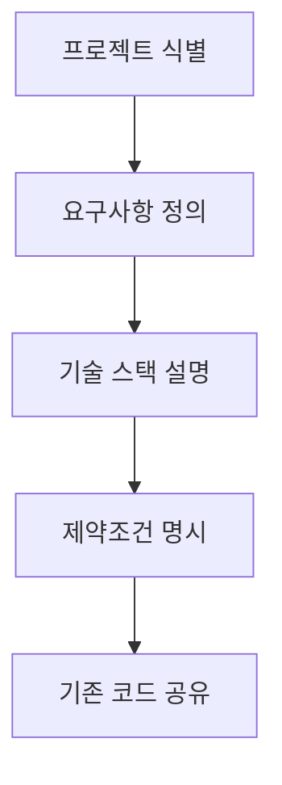
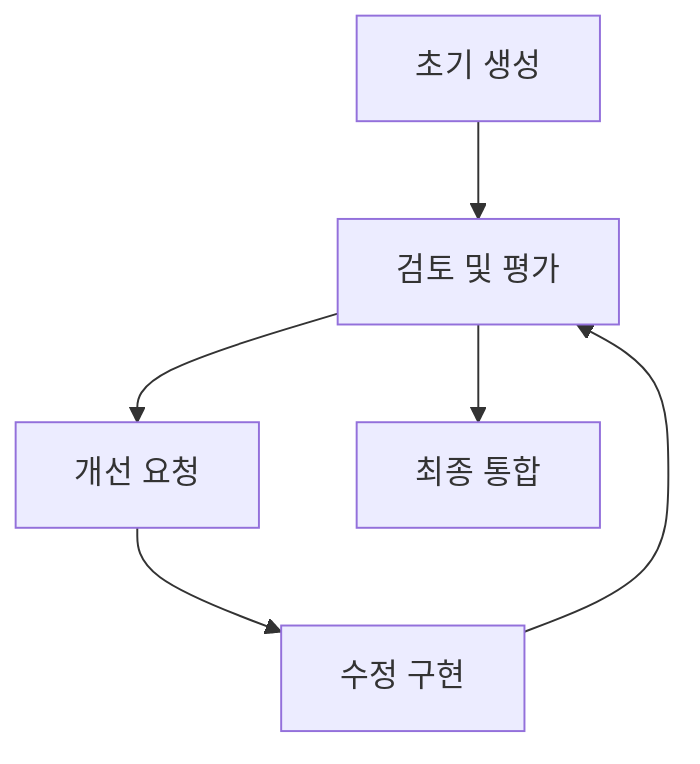
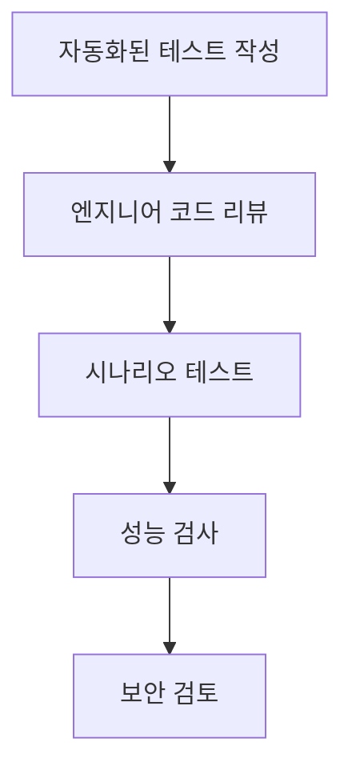
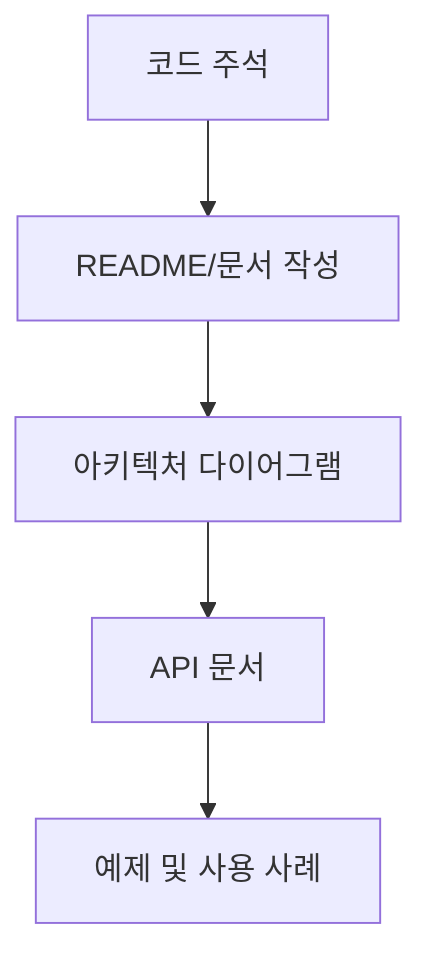

# ChatGPT/Cursor/Claude 등과 협업하는 워크플로우 전략

## 소개

현대 소프트웨어 개발에서 AI 도구들은 단순한 코드 생성기를 넘어 개발 워크플로우의 필수적인 부분이 되었습니다. 이 문서는 ChatGPT, Cursor, Claude와 같은 AI 도구들과 효과적으로", 협업하기 위한 체계적인 전략과 워크플로우를 제공합니다.

## AI 도구 생태계 이해하기

### 주요 AI 개발 도구 비교

| 도구 | 강점 | 적합한 사용 사례 | 제한사항 |
|------|------|-----------------|---------|
| **ChatGPT** | 접근성, 범용성, 다양한 프로그래밍 언어 지원 | 코드 생성, 일반적인 문제 해결, 개념 설명 | 코드베이스 이해 제한, 맥락 제한 |
| **Cursor** | 코드베이스 통합, 실시간 코드 생성, 좋은 타입 추론 | 코드베이스 탐색, 리팩토링, 코드 검색 | 복잡한 추론에 제한적, IDE 종속성 |
| **Claude** | 긴 맥락 이해, 세밀한 추론, 문서화 | 아키텍처 설계, 복잡한 알고리즘 설명, 문서 작성 | 프로그래밍 성능이 일부 제한적 |
| **GitHub Copilot** | 실시간 코드 제안, IDE 통합 | 라인 단위 코딩, 빠른 구현 | 더 넓은 문제 해결 능력 제한 |

### 도구 선택 전략

프로젝트 단계와 작업 유형에 따라 적절한 AI 도구를 선택합니다:

1. **초기 설계 단계**: Claude 또는 ChatGPT - 높은 수준의 아키텍처 논의, 요구사항 분석
2. **코드베이스 탐색**: Cursor - 기존 코드 이해, 패턴 탐색
3. **코드 구현**: GitHub Copilot 또는 Cursor - 실시간 코드 제안
4. **리팩토링**: Cursor - 코드베이스 맥락 기반 개선
5. **문서화**: Claude - 포괄적인 설명 및 문서 생성
6. **디버깅**: ChatGPT 또는 Cursor - 오류 진단 및 해결

## 효과적인 AI 협업 워크플로우

### 1. 프로젝트 준비 및 맥락 설정

**목표**: AI가 프로젝트를 이해하도록 적절한 맥락 제공



**모범 사례**:
- 프로젝트 목적, 대상 사용자, 핵심 기능 요약
- 사용 중인 프레임워크, 라이브러리, 코딩 표준 명시
- 중요한 파일, 클래스, 함수 구조 개요 제공
- 예상 결과에 대한 명확한 설명 제공

**예시 프롬프트**:
```
우리는 React와 Node.js를 사용하는 전자상거래 플랫폼을 개발 중입니다. 
주요 기능은 제품 목록, 장바구니, 결제 처리입니다.
현재 작업 중인 부분은 장바구니 기능으로, Redux를 사용하여 상태를 관리합니다.
코드는 TypeScript로 작성되며, 다음 코드 구조를 따릅니다:
[코드 구조 설명]
```

### 2. 단계적 개발 접근법

**목표**: 큰 작업을 관리 가능한 단계로 나누어 AI의 효과적인 지원 촉진


**모범 사례**:
- 기능 또는 태스크를 더 작은 하위 작업으로 분해
- 각 단계를 완료한 후 피드백 제공 및 AI 방향 조정
- 먼저 간단한 개념 증명(PoC)으로 접근 방식 검증
- 변경 사항을 점진적으로 도입하여 복잡성 관리

**예시 순차적 요청**:
1. "제품을 장바구니에 추가하는 Redux 액션을 설계해 주세요"
2. "이제 장바구니 항목을 렌더링하는 React 컴포넌트를 만들어 주세요"
3. "장바구니에서 제품 수량을 업데이트하는 기능을 추가해 주세요"

### 3. 반복적 개선 루프

**목표**: 지속적인 피드백과 개선을 통한 결과물 최적화



**모범 사례**:
- AI 결과물에 대한 구체적인 피드백 제공
- 특정 향상점 또는 수정사항 식별
- 개선 과정에서 "레이어 접근법" 사용 (한번에 모든 것을 수정하려 하지 않음)
- 각 반복에서 배운 교훈을 문서화하여 향후 프롬프트 개선

**예시 반복 프로세스**:
1. "장바구니 컴포넌트가 좋습니다. 이제 접근성을 개선하고 ARIA 속성을 추가해 주세요."
2. "성능을 최적화하기 위해 React.memo를 사용하여 컴포넌트를 감싸 주세요."
3. "모바일 반응형으로 만들기 위해 미디어 쿼리를 추가해 주세요."

### 4. 테스트 및 검증 전략

**목표**: 품질과 정확성을 보장하기 위한 AI 생성 코드 검증



**모범 사례**:
- AI에게 테스트 작성 요청하여 구현 검증
- 특히 복잡한 로직과 엣지 케이스에 대한 테스트 강조
- 인간 검토를 통한 잠재적 오류 또는 비효율성 식별
- 다양한 조건에서 코드 테스트 (성능, 부하, 보안)

**예시 테스트 요청**:
```
방금 구현한 장바구니 기능에 대한 Jest 테스트를 작성해 주세요.
다음 시나리오를 테스트해야 합니다:
1. 제품 추가
2. 제품 제거
3. 수량 업데이트
4. 중복 제품 추가 처리
```

### 5. 문서화 및 지식 보존

**목표**: 결정 사항, 설계 논리, 구현 세부 정보 기록



**모범 사례**:
- AI에게 의미 있는 코드 주석 작성 요청
- 구현 결정에 대한 근거 문서화
- 아키텍처 개요 및 구성 요소 관계 다이어그램 생성
- 예제와 함께 API 사용 방법 문서화

**예시 문서화 요청**:
```
구현한 장바구니 기능에 대한 README 문서를 작성해 주세요.
다음 내용을 포함해야 합니다:
1. 주요 컴포넌트 설명
2. Redux 상태 구조
3. 주요 함수 및 액션 설명
4. 사용 예제
5. 향후 개선 가능성
```

## 도구별 특화 전략

### ChatGPT 활용 전략

1. **세션 맥락 관리**:
   - 중요한 정보와 결정사항 요약 포함
   - 대화 중간에 맥락 리셋이 필요할 때 명시적으로 언급
   - 길거나 복잡한 요청은 여러 단계로 나누기

2. **코드 생성 최적화**:
   - 명확한 입/출력 예제 제공
   - 원하는 코드 스타일 및 패턴 명시
   - 기존 코드베이스 예제 제공하여 일관성 확보

3. **에러 해결 및 디버깅**:
   - 전체 에러 메시지 및 스택 트레이스 제공
   - 문제 컨텍스트와 이미 시도한 해결책 설명
   - 점진적으로 솔루션 구체화

### Cursor 활용 전략

1. **코드베이스 탐색**:
   - 프로젝트 구조 설명 요청
   - 주요 의존성 및 데이터 흐름 식별
   - 특정 기능 관련 파일 탐색

2. **인텔리전트 편집**:
   - 대규모 리팩토링 단계별 지시
   - 필요한 파일 모두에 일관된 변경사항 적용
   - 기존 코드 스타일 및 패턴 준수

3. **맥락 기반 제안**:
   - 현재 작업 맥락 명확하게 설명
   - 고려되어야 할 특정 제약조건 명시
   - 현재 코드와의 통합 방법 요청

### Claude 활용 전략

1. **복잡한 개념 설명**:
   - 높은 수준의 설계 원칙 및 아키텍처 논의
   - 알고리즘 및 데이터 구조 분석
   - 기술 결정에 대한 장단점 평가

2. **문서 작성**:
   - 포괄적인 시스템 문서화 요청
   - 코드 기반 API 문서 생성
   - 사용자 지침 및 개발자 가이드 작성

3. **맥락 처리 활용**:
   - 대규모 코드 블록 및 문서 분석
   - 복잡한 요구사항 및 사양 해석
   - 여러 파일에 걸친 변경사항 관리

## 다중 도구 통합 워크플로우

### 프로젝트 생명주기에 따른 도구 활용

1. **기획 및 설계 단계**:
   - Claude: 아키텍처 설계 및 기술 스택 논의
   - ChatGPT: 초기 프로토타입 및 개념 검증

2. **개발 단계**:
   - Cursor: 코드베이스 탐색 및 개발
   - GitHub Copilot: 라인 단위 코드 완성
   - ChatGPT: 특정 구현 문제 해결

3. **테스트 및 디버깅**:
   - ChatGPT: 테스트 케이스 생성 및 버그 분석
   - Cursor: 코드베이스 전체 디버깅 및 오류 해결

4. **문서화 및 배포**:
   - Claude: 기술 문서 및 README 작성
   - ChatGPT: 배포 스크립트 및 CI/CD 구성

### 협업 시나리오 예시

**시나리오: 새로운 마이크로서비스 개발**

1. **설계 단계**:
   ```
   Claude에 요청: "사용자 선호도를 처리하는 마이크로서비스 아키텍처를 설계해 주세요. 
   기존 인증 서비스와 통합되어야 하며, MongoDB를 데이터 저장소로 사용합니다."
   ```

2. **초기 구현**:
   ```
   Cursor에서: "방금 설계한 마이크로서비스의 기본 API 엔드포인트와 데이터 모델을 구현해 주세요."
   ```

3. **테스트 작성**:
   ```
   ChatGPT에 요청: "이 사용자 선호도 서비스에 대한 Jest 테스트 스위트를 작성해 주세요. 
   성공 및 오류 사례 모두 테스트해야 합니다."
   ```

4. **문서화**:
   ```
   Claude에 요청: "이 마이크로서비스에 대한 API 문서를 작성해 주세요. 
   각 엔드포인트, 필요한 매개변수, 가능한 응답을 포함해야 합니다."
   ```

## 협업 도전 과제 및 극복 전략

### 일반적인 도전 과제

1. **맥락 손실**:
   - 해결: 주요 정보를 요약하여 새 세션 시작
   - 해결: 중요한 코드 및 결정 사항을 외부 문서에 저장

2. **모델 한계 관리**:
   - 해결: 복잡한 작업을 더 작은 단계로 나누기
   - 해결: 명확한 예제와 제약 조건 제공

3. **코드 품질 및 일관성**:
   - 해결: 스타일 가이드 및 코드 표준 명시적 공유
   - 해결: 생성된 코드에 대한 체계적인 리뷰 프로세스 도입

4. **과도한 의존성 방지**:
   - 해결: 핵심 아키텍처 결정은 인간 개발자가 주도
   - 해결: AI를 조언자로 활용하고 최종 결정은 팀이 내림

## 결론

AI 도구와의 효과적인 협업은 기술적 지식뿐만 아니라 명확한 커뮤니케이션, 전략적 사고, 그리고 체계적인 워크플로우를 필요로 합니다. 이 문서에서 설명된 접근 방식을 통해 개발자는 각 AI 도구의 강점을 활용하여 개발 프로세스를 향상시킬 수 있습니다.

AI 도구를 개발 워크플로우에 통합하는 것은 단순한 기술 도입이 아닌 작업 방식의 진화입니다. 지속적인 실험, 학습, 그리고 워크플로우 개선을 통해 개발자와 AI 도구 간의 협업 잠재력을 최대한 활용할 수 있습니다. 