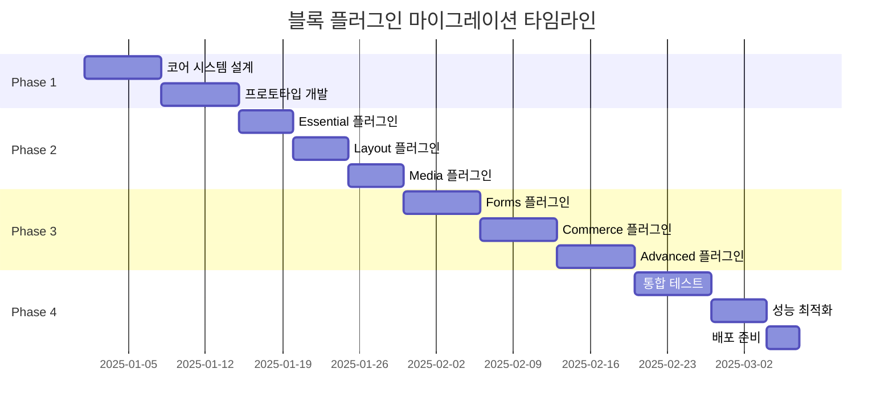

# 🗺️ 블록 플러그인 마이그레이션 로드맵

## 📅 전체 일정 (12주 계획)



## 🎯 Phase 1: 기초 구축 (2주)

### Week 1: 설계 및 준비
**목표**: 플러그인 시스템 아키텍처 확정

#### Tasks
- [ ] 현재 블록 시스템 상세 분석
- [ ] 의존성 그래프 작성
- [ ] 플러그인 인터페이스 설계
- [ ] 공통 컴포넌트 식별
- [ ] 기술 스택 결정

#### Deliverables
- 아키텍처 설계 문서
- 의존성 매트릭스
- 기술 결정 기록

### Week 2: 코어 시스템 개발
**목표**: 플러그인 로더 및 매니저 구현

#### Tasks
- [ ] BlockManager 클래스 구현
- [ ] PluginLoader 클래스 구현
- [ ] 동적 임포트 시스템 구축
- [ ] 플러그인 레지스트리 구현
- [ ] 기본 테스트 작성

#### Deliverables
- @o4o/block-core 패키지
- 단위 테스트 suite
- API 문서

## 🚀 Phase 2: 핵심 플러그인 개발 (3주)

### Week 3-4: Essential Blocks 플러그인
**목표**: 가장 기본적인 블록들을 첫 번째 플러그인으로 분리

#### 포함 블록
- Paragraph (텍스트)
- Heading (제목)
- Image (이미지)
- List (목록)

#### Tasks
- [ ] 블록 코드 마이그레이션
- [ ] 스타일 분리
- [ ] 플러그인 패키징
- [ ] 로컬 테스트
- [ ] 번들 크기 측정

#### Success Metrics
- 번들 크기 < 100KB
- 로드 시간 < 500ms
- 모든 기능 정상 작동

### Week 4-5: Layout & Media 플러그인
**목표**: 레이아웃과 미디어 블록 분리

#### Layout Plugin
- Columns
- Group
- Spacer
- Separator

#### Media Plugin
- Gallery
- Video
- Audio
- Embed

#### Tasks
- [ ] 각 플러그인별 구조 설정
- [ ] 블록 마이그레이션
- [ ] 미디어 처리 최적화
- [ ] Lazy loading 구현
- [ ] 성능 테스트

## 📦 Phase 3: 고급 플러그인 개발 (3주)

### Week 6-7: Interactive Blocks
**목표**: 사용자 상호작용 블록 분리

#### 포함 블록
- Forms
- Buttons
- Search
- Table

#### 특별 고려사항
- 폼 검증 로직 모듈화
- 이벤트 핸들러 최적화
- 접근성 요구사항

### Week 8: Commerce Blocks
**목표**: 전자상거래 관련 블록 분리

#### 포함 블록
- Product Display
- Cart
- Checkout
- Payment

#### 특별 고려사항
- 결제 보안
- 상태 관리
- API 통합

### Week 9: Advanced Blocks
**목표**: 고급 기능 블록 분리

#### 포함 블록
- CPT-ACF Loop
- Shortcode
- Reusable Block
- Dynamic Content

## 🧪 Phase 4: 통합 및 최적화 (2주)

### Week 10: 통합 테스트
**목표**: 전체 시스템 안정성 검증

#### Test Areas
- [ ] 플러그인 간 호환성
- [ ] 동적 로딩 테스트
- [ ] 메모리 누수 체크
- [ ] 브라우저 호환성
- [ ] 성능 벤치마크

### Week 11: 최적화
**목표**: 성능 튜닝 및 최적화

#### Optimization Tasks
- [ ] 번들 크기 최소화
- [ ] 로딩 전략 개선
- [ ] 캐싱 구현
- [ ] CDN 설정
- [ ] 모니터링 설정

## 📊 마이그레이션 체크포인트

### Checkpoint 1: 코어 시스템 (Week 2)
- [ ] 플러그인 로더 작동 확인
- [ ] 동적 임포트 성공
- [ ] 기본 플러그인 등록 가능

### Checkpoint 2: Essential 플러그인 (Week 4)
- [ ] 첫 플러그인 정상 작동
- [ ] 번들 크기 목표 달성
- [ ] 기존 기능 100% 호환

### Checkpoint 3: 전체 마이그레이션 (Week 9)
- [ ] 모든 블록 플러그인화 완료
- [ ] 성능 목표 달성
- [ ] 사용자 테스트 통과

### Final Checkpoint (Week 12)
- [ ] 프로덕션 준비 완료
- [ ] 문서화 완료
- [ ] 배포 파이프라인 구축

## 🚦 리스크 관리

### 예상 리스크 및 대응

| 리스크 | 영향도 | 가능성 | 대응 방안 |
|-------|-------|-------|----------|
| WordPress 업데이트 비호환 | 높음 | 중간 | 버전 잠금, 호환성 레이어 |
| 번들 크기 초과 | 중간 | 높음 | 코드 스플리팅, Tree shaking |
| 성능 저하 | 높음 | 낮음 | 프로파일링, 최적화 |
| 의존성 충돌 | 중간 | 중간 | 격리된 스코프, 버전 관리 |
| 브라우저 호환성 | 낮음 | 낮음 | Polyfill, 점진적 향상 |

## 📈 성공 지표

### 기술적 지표
- **초기 번들 크기**: < 100KB (현재 2.5MB에서 96% 감소)
- **FCP**: < 1.5초 (3G 네트워크)
- **TTI**: < 3초 (3G 네트워크)
- **메모리 사용량**: 50% 감소
- **플러그인 로드 시간**: < 500ms/plugin

### 비즈니스 지표
- **페이지 로드 속도**: 70% 향상
- **사용자 만족도**: 90% 이상
- **개발 생산성**: 30% 향상
- **유지보수 시간**: 40% 감소

## 🔄 점진적 롤아웃 계획

### Stage 1: Alpha (Week 10)
- 내부 테스트 팀 대상
- 10% 트래픽
- A/B 테스트 진행

### Stage 2: Beta (Week 11)
- 선택적 옵트인 사용자
- 25% 트래픽
- 피드백 수집

### Stage 3: GA (Week 12)
- 전체 사용자 대상
- 100% 트래픽
- 레거시 시스템 deprecation

## 📋 마이그레이션 체크리스트

### Pre-Migration
- [ ] 현재 시스템 백업
- [ ] 의존성 문서화
- [ ] 테스트 환경 구축
- [ ] 롤백 계획 수립

### During Migration
- [ ] 단계별 코드 분리
- [ ] 플러그인 패키징
- [ ] 테스트 실행
- [ ] 성능 모니터링

### Post-Migration
- [ ] 성능 검증
- [ ] 사용자 피드백 수집
- [ ] 문서 업데이트
- [ ] 레거시 코드 제거

## 🛠️ 도구 및 리소스

### 개발 도구
- **번들러**: Webpack 5
- **테스트**: Jest, React Testing Library
- **분석**: Webpack Bundle Analyzer
- **모니터링**: Sentry, Google Analytics

### 문서 및 가이드
- [플러그인 개발 가이드](./BLOCK_PLUGIN_IMPLEMENTATION_GUIDE.md)
- [번들 최적화 전략](./BLOCK_BUNDLE_OPTIMIZATION_STRATEGY.md)
- [아키텍처 문서](./BLOCK_PLUGIN_ARCHITECTURE.md)

## 📝 주간 진행 상황 템플릿

```markdown
### Week X Progress Report

**완료된 작업**
- [ ] Task 1
- [ ] Task 2

**진행 중**
- [ ] Task 3
- [ ] Task 4

**차주 계획**
- [ ] Task 5
- [ ] Task 6

**이슈 및 블로커**
- Issue 1: Description
- Issue 2: Description

**메트릭**
- 번들 크기: XXX KB
- 로드 시간: XXX ms
- 테스트 커버리지: XX%
```

## 🎉 마일스톤 및 축하 포인트

### 🏆 Milestone 1: 첫 플러그인 완성
- Essential Blocks 플러그인 배포
- 팀 회식 🍕

### 🏆 Milestone 2: 50% 마이그레이션
- 핵심 플러그인 5개 완성
- 성과 보너스 💰

### 🏆 Milestone 3: 전체 마이그레이션 완료
- 모든 블록 플러그인화
- 프로젝트 완료 파티 🎊

---

*최종 업데이트: 2025년 8월*
*로드맵 버전: 1.0.0*
*프로젝트 관리자: O4O Platform Team*