# 📋 O4O Platform 직접 배포 시스템 기획안

## 🎯 목표
로컬 개발 환경에서 작업한 내용을 **즉시 프로덕션 사이트에 반영**하는 자동화 시스템 구축

## 🏗️ 현재 아키텍처 분석

### 현재 구조
```
로컬 → GitHub → GitHub Actions → 웹서버
(약 5-10분 소요)
```

### 개선된 구조 
```
로컬 → Git Hook → 웹서버 (직접 배포)
(약 1-2분 소요)
```

## 📐 시스템 설계

### 1. 서버 구성
```
웹서버 (admin.neture.co.kr)
├── /var/repos/                    # Git bare 저장소
│   └── o4o-platform.git/
│       └── hooks/
│           └── post-receive       # 자동 배포 스크립트
├── /var/www/
│   ├── admin.neture.co.kr/       # 현재 운영 중인 사이트
│   ├── admin-staging/             # 스테이징 (선택사항)
│   └── admin-backup/              # 백업
└── /var/log/
    └── o4o-deploy.log             # 배포 로그
```

### 2. 배포 플로우

```mermaid
graph LR
    A[로컬 개발] -->|git push production| B[Bare Repo]
    B -->|post-receive hook| C[빌드 시작]
    C --> D[의존성 설치]
    D --> E[패키지 빌드]
    E --> F[앱 빌드]
    F --> G[백업 생성]
    G --> H[파일 교체]
    H --> I[캐시 무효화]
    I --> J[Nginx 재시작]
    J --> K[배포 완료]
```



## 🛠️ 구현 계획

### Phase 1: 기본 자동 배포 (필수)
- [x] Git bare repository 설정
- [x] Post-receive hook 스크립트 작성
- [x] 빌드 및 배포 자동화
- [x] 백업 시스템
- [x] 로그 시스템

### Phase 2: 안정성 강화 (권장)
- [ ] 빌드 실패 시 롤백
- [ ] 헬스 체크
- [ ] 배포 알림 (Slack/Discord)
- [ ] 무중단 배포 (Blue-Green)

### Phase 3: 고급 기능 (선택)
- [ ] 스테이징 환경 자동 배포
- [ ] 브랜치별 배포 환경
- [ ] 배포 승인 시스템
- [ ] 성능 모니터링 통합

## 📝 Post-Receive Hook 스크립트 (개선된 버전)

```bash
#!/bin/bash
# /var/repos/o4o-platform.git/hooks/post-receive

# 설정
WORK_TREE="/var/www/admin.neture.co.kr"
BUILD_DIR="/tmp/o4o-build-$(date +%s)"
BACKUP_DIR="/var/www/admin-backup"
LOG_FILE="/var/log/o4o-deploy.log"
MAX_BACKUPS=3

# 색상 코드
RED='\033[0;31m'
GREEN='\033[0;32m'
YELLOW='\033[1;33m'
NC='\033[0m'

# 로그 함수
log() {
    echo "[$(date '+%Y-%m-%d %H:%M:%S')] $1" | tee -a "$LOG_FILE"
}

# 에러 핸들링
handle_error() {
    log "❌ ERROR: $1"
    log "🔄 Rolling back..."
    
    # 롤백 로직
    if [ -d "$BACKUP_DIR/latest" ]; then
        rm -rf "$WORK_TREE"
        cp -r "$BACKUP_DIR/latest" "$WORK_TREE"
        log "✅ Rollback completed"
    fi
    
    # 정리
    rm -rf "$BUILD_DIR"
    exit 1
}

# 트랩 설정
trap 'handle_error "Unexpected error occurred"' ERR

# 시작
log "🚀 === Deployment Started ==="

# 1. 코드 체크아웃
log "📥 Checking out code..."
git clone /var/repos/o4o-platform.git "$BUILD_DIR"
cd "$BUILD_DIR"

# 현재 커밋 정보
COMMIT=$(git rev-parse HEAD)
COMMIT_MSG=$(git log -1 --pretty=%B)
AUTHOR=$(git log -1 --pretty=%an)
log "📝 Deploying commit: $COMMIT"
log "   Message: $COMMIT_MSG"
log "   Author: $AUTHOR"

# 2. Node.js 버전 확인 및 설정
log "🔧 Setting up Node.js environment..."
export NVM_DIR="$HOME/.nvm"
[ -s "$NVM_DIR/nvm.sh" ] && \. "$NVM_DIR/nvm.sh"
nvm use 22.18.0 || handle_error "Node.js setup failed"

# 3. 의존성 설치
log "📦 Installing dependencies..."
pnpm install --frozen-lockfile || handle_error "Dependency installation failed"

# 4. 패키지 빌드
log "🔨 Building packages..."
pnpm run build:packages || handle_error "Package build failed"

# 5. Admin Dashboard 빌드
log "🏗️ Building Admin Dashboard..."
cd apps/admin-dashboard
NODE_OPTIONS='--max-old-space-size=4096' \
GENERATE_SOURCEMAP=false \
VITE_API_URL=https://api.neture.co.kr \
pnpm run build || handle_error "Admin Dashboard build failed"

# 6. 빌드 검증
if [ ! -d "dist" ] || [ -z "$(ls -A dist)" ]; then
    handle_error "Build verification failed - dist directory is empty"
fi

# 7. 백업 생성
log "💾 Creating backup..."
if [ -d "$WORK_TREE" ]; then
    BACKUP_NAME="backup-$(date +%Y%m%d-%H%M%S)"
    mkdir -p "$BACKUP_DIR"
    cp -r "$WORK_TREE" "$BACKUP_DIR/$BACKUP_NAME"
    ln -sfn "$BACKUP_DIR/$BACKUP_NAME" "$BACKUP_DIR/latest"
    
    # 오래된 백업 삭제
    BACKUP_COUNT=$(ls -1d $BACKUP_DIR/backup-* 2>/dev/null | wc -l)
    if [ $BACKUP_COUNT -gt $MAX_BACKUPS ]; then
        ls -1dt $BACKUP_DIR/backup-* | tail -n +$((MAX_BACKUPS + 1)) | xargs rm -rf
    fi
    log "✅ Backup created: $BACKUP_NAME"
fi

# 8. 원자적 배포 (Atomic Deployment)
log "🔄 Deploying to production..."
NEW_WORK_TREE="${WORK_TREE}.new"
rm -rf "$NEW_WORK_TREE"
cp -r "$BUILD_DIR/apps/admin-dashboard/dist" "$NEW_WORK_TREE"

# 캐시 버스팅 설정
VERSION=$(date +%s)
echo "{\"version\": \"$VERSION\", \"buildTime\": \"$(date)\", \"commit\": \"$COMMIT\"}" > "$NEW_WORK_TREE/version.json"

# 캐시 제어 헤더 (.htaccess)
cat > "$NEW_WORK_TREE/.htaccess" << 'EOF'
<FilesMatch "\.(html)$">
    Header set Cache-Control "no-cache, no-store, must-revalidate"
    Header set Pragma "no-cache"
    Header set Expires 0
</FilesMatch>

<FilesMatch "\.(js|css|png|jpg|jpeg|gif|ico|svg|woff|woff2|ttf|eot)$">
    Header set Cache-Control "public, max-age=31536000, immutable"
</FilesMatch>
EOF

# 원자적 교체
OLD_WORK_TREE="${WORK_TREE}.old"
if [ -d "$WORK_TREE" ]; then
    mv "$WORK_TREE" "$OLD_WORK_TREE"
fi
mv "$NEW_WORK_TREE" "$WORK_TREE"
rm -rf "$OLD_WORK_TREE"

# 9. 권한 설정
log "🔐 Setting permissions..."
chown -R www-data:www-data "$WORK_TREE"
chmod -R 755 "$WORK_TREE"

# 10. Nginx 재시작
log "🔄 Reloading Nginx..."
sudo systemctl reload nginx

# 11. 헬스 체크
log "🏥 Health check..."
sleep 2
HTTP_STATUS=$(curl -s -o /dev/null -w "%{http_code}" https://admin.neture.co.kr)
if [ "$HTTP_STATUS" -eq 200 ]; then
    log "✅ Health check passed"
else
    handle_error "Health check failed - HTTP status: $HTTP_STATUS"
fi

# 12. 정리
log "🧹 Cleaning up..."
rm -rf "$BUILD_DIR"

# 완료
log "✅ === Deployment Completed Successfully ==="
log "🌐 Site: https://admin.neture.co.kr"
log "📊 Version: $VERSION"
log "📝 Commit: $COMMIT"
log "============================================"

# 알림 (선택사항 - Slack/Discord webhook)
# curl -X POST -H 'Content-type: application/json' \
#   --data "{\"text\":\"✅ Deployment successful\\nCommit: $COMMIT_MSG\\nAuthor: $AUTHOR\"}" \
#   YOUR_WEBHOOK_URL
```

## 🚀 배포 명령어

### package.json 추가
```json
{
  "scripts": {
    "deploy": "git add . && git commit -m 'chore: deploy' && git push production main",
    "deploy:staging": "git push production develop:staging",
    "deploy:rollback": "ssh user@admin.neture.co.kr 'cd /var/www && mv admin-backup/latest admin.neture.co.kr'",
    "deploy:log": "ssh user@admin.neture.co.kr 'tail -f /var/log/o4o-deploy.log'",
    "deploy:status": "ssh user@admin.neture.co.kr 'curl -I https://admin.neture.co.kr'"
  }
}
```

## 📊 장단점 분석

### 장점
✅ **즉시 반영**: 1-2분 내 배포 완료
✅ **단순함**: GitHub Actions 없이 직접 배포
✅ **제어 가능**: 로컬에서 완전한 제어
✅ **비용 절감**: GitHub Actions 시간 절약
✅ **백업 자동화**: 롤백 가능

### 단점
⚠️ **보안**: SSH 키 관리 필요
⚠️ **서버 부하**: 웹서버에서 빌드
⚠️ **팀 협업**: 여러 명이 동시 배포 시 충돌 가능

## 🔒 보안 고려사항

1. **SSH 키 관리**
   - 배포 전용 SSH 키 사용
   - 키 정기 교체

2. **권한 분리**
   - 배포 전용 사용자 계정
   - sudo 권한 최소화

3. **로그 및 감사**
   - 모든 배포 기록 저장
   - 실패 시 알림

## 📈 향후 개선 사항

1. **Blue-Green 배포**
   - 무중단 배포 구현
   - A/B 테스팅 지원

2. **CI/CD 파이프라인**
   - 테스트 자동화
   - 코드 품질 검사

3. **모니터링**
   - 실시간 성능 모니터링
   - 에러 추적

## 🎯 구현 우선순위

1. **Phase 1** (필수): 기본 자동 배포 - **1일**
2. **Phase 2** (권장): 안정성 강화 - **2-3일**
3. **Phase 3** (선택): 고급 기능 - **추후**

---

이 시스템을 구축하면 **로컬에서 `git push`만으로 즉시 사이트에 반영**됩니다!