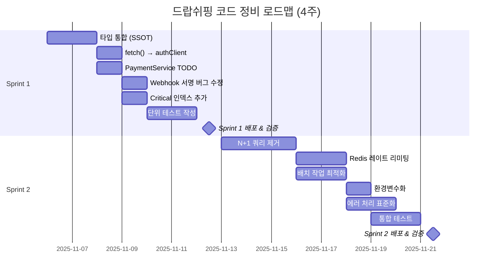
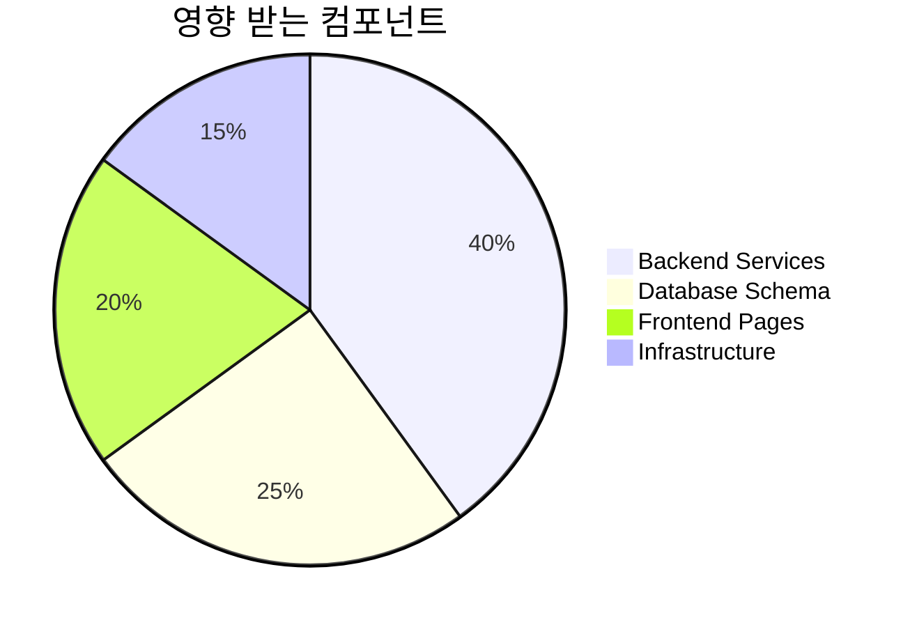

# 드랍쉬핑 코드 정비 실행 계획

**작성일**: 2025-11-06
**기간**: 2주 (Sprint 1) + 2주 (Sprint 2) = 총 4주
**목표**: Critical/High 우선순위 이슈 해결, 성능 개선, 기술부채 상환
**전제**: Feature flag 사용, 점진적 배포, 롤백 전략 수립

---

## 목차

1. [전체 로드맵](#1-전체-로드맵)
2. [Sprint 1: Critical Issues (Week 1-2)](#2-sprint-1-critical-issues-week-1-2)
3. [Sprint 2: Performance & Optimization (Week 3-4)](#3-sprint-2-performance--optimization-week-3-4)
4. [Phase별 DoD (Definition of Done)](#4-phase별-dod-definition-of-done)
5. [롤백 및 플래그 전략](#5-롤백-및-플래그-전략)
6. [SSOT/스키마/인덱스 계획](#6-ssot스키마인덱스-계획)
7. [테스트 전략](#7-테스트-전략)
8. [배포 체크리스트](#8-배포-체크리스트)
9. [모니터링 및 알림](#9-모니터링-및-알림)
10. [위험 관리](#10-위험-관리)

---

## 1. 전체 로드맵



### 1.1 우선순위 매트릭스

| Phase | 범위 | 위험 | 공수 | 우선순위 |
|-------|------|------|------|----------|
| **Sprint 1** | Critical 이슈 5개 | 높음 | 8-10일 | 🔴 즉시 |
| **Sprint 2** | High 이슈 5개 | 중간 | 10-12일 | 🟡 2주 내 |
| **Backlog** | Medium 이슈 5개 | 낮음 | 15-20일 | 🟢 1달 내 |

### 1.2 영향 범위



---

## 2. Sprint 1: Critical Issues (Week 1-2)

**목표**: 버그 수정, 보안 강화, 데이터 일관성 확보
**기간**: Day 1-10
**담당**: Backend Team (2명), Frontend Team (1명)

### 2.1 Task 1: 타입 통합 (SSOT 확립)

**일정**: Day 1-2 (2일)
**담당**: Backend Developer A
**우선순위**: 🔴 Critical

#### 작업 내역

**Step 1: Entity를 SSOT로 확립 (0.5일)**

```typescript
// ✅ apps/api-server/src/entities/CommissionPolicy.ts (유지)
@Entity('commission_policies')
export class CommissionPolicy {
  // 모든 필드 정의 (기존 유지)
}

// ✅ packages/types/src/commission.ts (새로 생성)
export interface CommissionPolicyDTO {
  id: string;
  policyCode: string;
  name: string;
  policyType: PolicyType;
  status: PolicyStatus;
  // Entity에서 필요한 필드만 추출
}

// 변환 헬퍼
export function toCommissionPolicyDTO(entity: CommissionPolicy): CommissionPolicyDTO {
  return {
    id: entity.id,
    policyCode: entity.policyCode,
    name: entity.name,
    policyType: entity.policyType,
    status: entity.status,
    // ...
  };
}
```

**Step 2: Partner/Affiliate 통합 (1일)**

```typescript
// ❌ 삭제: packages/types/src/affiliate.ts
// ✅ 유지 & 확장: packages/types/src/partner.ts

export interface PartnerDTO {
  id: string;
  userId: string;
  referralCode: string;
  tier: PartnerTier;
  status: PartnerStatus;
  // ...
}

// Alias (하위 호환성)
export type AffiliateDTO = PartnerDTO;
export type AffiliateCommissionDTO = CommissionDTO;
```

**Step 3: Import 경로 수정 (0.5일)**

```bash
# 전체 코드베이스 검색
rg "from.*affiliate" --type ts
rg "import.*AffiliateUser" --type ts

# 자동 치환 스크립트 작성
node scripts/migrate-affiliate-imports.js
```

#### DoD (Definition of Done)

- [ ] Entity 기반 DTO 생성 (`commission.ts`, `partner.ts`)
- [ ] `affiliate.ts` 파일 삭제 (Breaking change 주의)
- [ ] 모든 import 경로 수정
- [ ] `npm run type-check` 통과
- [ ] `npm run test:unit` 통과
- [ ] 마이그레이션 가이드 작성 (`MIGRATION_GUIDE.md`)

#### 롤백 전략

- Git 태그: `pre-type-unification`
- 변경 범위: 타입 정의만 (런타임 영향 없음)
- 롤백 비용: 낮음 (import만 되돌리기)

---

### 2.2 Task 2: fetch() → authClient 전환

**일정**: Day 3 (0.5일)
**담당**: Frontend Developer B
**우선순위**: 🔴 Critical

#### 작업 내역

**Step 1: Approvals.tsx 수정**

```typescript
// ❌ Before
const response = await fetch('/api/admin/dropshipping/approvals', {
  headers: {
    'Authorization': `Bearer ${token}`,
    'Content-Type': 'application/json'
  }
});
const data = await response.json();

// ✅ After
const { data } = await authClient.api.get('/admin/dropshipping/approvals');
```

**Step 2: SystemSetup.tsx 수정**

```typescript
// ❌ Before
fetch('/api/admin/dropshipping/system-status')

// ✅ After
authClient.api.get('/admin/dropshipping/system-status')
```

#### DoD

- [ ] `Approvals.tsx` fetch() 제거
- [ ] `SystemSetup.tsx` fetch() 제거
- [ ] 로컬 테스트 (Admin Dashboard → Approvals 페이지)
- [ ] 토큰 만료 시 자동 갱신 확인
- [ ] 에러 핸들링 확인 (401, 403, 500)

#### 테스트 케이스

```typescript
// apps/admin-dashboard/src/pages/dropshipping/__tests__/Approvals.test.tsx
describe('Approvals Page', () => {
  it('should load approvals using authClient', async () => {
    const mockApprovals = [{ id: '1', type: 'supplier', status: 'pending' }];
    jest.spyOn(authClient.api, 'get').mockResolvedValue({ data: mockApprovals });

    render(<Approvals />);
    await waitFor(() => {
      expect(screen.getByText('supplier')).toBeInTheDocument();
    });
  });

  it('should handle 401 error and refresh token', async () => {
    jest.spyOn(authClient.api, 'get').mockRejectedValueOnce({ status: 401 });
    // authClient 내부에서 토큰 갱신 후 재시도
    render(<Approvals />);
    // ...
  });
});
```

#### 롤백 전략

- Feature flag: `USE_AUTH_CLIENT_FOR_APPROVALS` (환경변수)
- 배포 순서: Dev → Staging → Production (1일 간격)
- 롤백 트리거: API 호출 실패율 > 5%

---

### 2.3 Task 3: PaymentService TODO 구현

**일정**: Day 4 (1일)
**담당**: Backend Developer A
**우선순위**: 🔴 Critical

#### 작업 내역

**Step 1: calculatePartnerSettlement() 구현 (0.5일)**

```typescript
// apps/api-server/src/services/PaymentService.ts:579

private calculatePartnerSettlement(order: any, payment: Payment): PaymentSettlement | null {
  // 1. Order에 partnerId가 있는지 확인
  if (!order.partnerId) {
    return null;
  }

  // 2. Commission 조회
  const commission = await this.commissionRepository.findOne({
    where: {
      orderId: order.id,
      status: CommissionStatus.CONFIRMED
    }
  });

  if (!commission) {
    logger.warn(`No confirmed commission found for order: ${order.id}`);
    return null;
  }

  // 3. Settlement 생성
  const settlement = new PaymentSettlement();
  settlement.paymentId = payment.id;
  settlement.recipientType = RecipientType.PARTNER;
  settlement.recipientId = commission.partnerId;
  settlement.recipientName = order.partnerName || 'Unknown Partner';
  settlement.amount = commission.commissionAmount;
  settlement.fee = 0;
  settlement.tax = 0;
  settlement.netAmount = commission.commissionAmount;
  settlement.status = SettlementStatus.SCHEDULED;

  // 4. D+7 정산일 설정
  const settlementDate = new Date();
  const holdPeriodDays = parseInt(process.env.PARTNER_SETTLEMENT_DAYS || '7');
  settlementDate.setDate(settlementDate.getDate() + holdPeriodDays);
  settlement.scheduledAt = settlementDate;

  return settlement;
}
```

**Step 2: Order 엔티티에 partnerId 추가 (0.5일)**

```typescript
// apps/api-server/src/entities/Order.ts

@Entity('orders')
export class Order {
  // 기존 필드...

  @Column({ nullable: true })
  partnerId?: string;

  @Column({ nullable: true })
  partnerName?: string;

  @Column({ nullable: true })
  referralCode?: string;
}
```

**Step 3: 마이그레이션 생성**

```bash
npm run typeorm migration:create -- apps/api-server/src/database/migrations/AddPartnerFieldsToOrders
```

```typescript
// 2100000000000-AddPartnerFieldsToOrders.ts
export class AddPartnerFieldsToOrders1730000000000 implements MigrationInterface {
  public async up(queryRunner: QueryRunner): Promise<void> {
    await queryRunner.addColumn('orders', new TableColumn({
      name: 'partner_id',
      type: 'uuid',
      isNullable: true
    }));

    await queryRunner.addColumn('orders', new TableColumn({
      name: 'partner_name',
      type: 'varchar',
      length: '100',
      isNullable: true
    }));

    await queryRunner.addColumn('orders', new TableColumn({
      name: 'referral_code',
      type: 'varchar',
      length: '50',
      isNullable: true
    }));
  }

  public async down(queryRunner: QueryRunner): Promise<void> {
    await queryRunner.dropColumn('orders', 'partner_id');
    await queryRunner.dropColumn('orders', 'partner_name');
    await queryRunner.dropColumn('orders', 'referral_code');
  }
}
```

#### DoD

- [ ] `calculatePartnerSettlement()` 구현 완료
- [ ] Order 엔티티 partnerId 필드 추가
- [ ] 마이그레이션 실행 (`npm run typeorm migration:run`)
- [ ] 단위 테스트 작성 (Commission 있을 때/없을 때)
- [ ] 통합 테스트 (주문 생성 → 결제 → 정산 생성 플로우)
- [ ] 로컬 검증 (Postman/Thunder Client)

#### 테스트 케이스

```typescript
// apps/api-server/src/services/__tests__/PaymentService.spec.ts
describe('PaymentService.calculatePartnerSettlement', () => {
  it('should create partner settlement when commission exists', async () => {
    const order = createMockOrder({ partnerId: 'partner-1' });
    const payment = createMockPayment({ orderId: order.id });
    const commission = createMockCommission({
      orderId: order.id,
      status: CommissionStatus.CONFIRMED,
      commissionAmount: 10000
    });

    await commissionRepository.save(commission);

    const settlement = await paymentService['calculatePartnerSettlement'](order, payment);

    expect(settlement).not.toBeNull();
    expect(settlement.recipientType).toBe(RecipientType.PARTNER);
    expect(settlement.amount).toBe(10000);
    expect(settlement.status).toBe(SettlementStatus.SCHEDULED);
  });

  it('should return null when order has no partnerId', async () => {
    const order = createMockOrder({ partnerId: null });
    const payment = createMockPayment();

    const settlement = await paymentService['calculatePartnerSettlement'](order, payment);

    expect(settlement).toBeNull();
  });
});
```

#### 롤백 전략

- 마이그레이션 롤백: `npm run typeorm migration:revert`
- Feature flag: `ENABLE_PARTNER_SETTLEMENT` (false로 설정 시 기존 로직)
- 데이터 백업: 배포 전 `payment_settlements` 테이블 덤프

---

### 2.4 Task 4: Webhook 서명 버그 수정

**일정**: Day 5 (0.5일)
**담당**: Backend Developer B
**우선순위**: 🔴 Critical (보안)

#### 작업 내역

**Step 1: timing-safe 비교 적용**

```typescript
// apps/api-server/src/services/PaymentService.ts:391-399

// ❌ Before
const isValid = signatures.some(sig => {
  const decodedSig = Buffer.from(sig, 'base64').toString('base64');
  return decodedSig === expectedHash;
});

// ✅ After
const isValid = signatures.some(sig => {
  try {
    const sigBuffer = Buffer.from(sig, 'base64');
    const expectedBuffer = Buffer.from(expectedHash, 'base64');

    // Timing-safe 비교
    return crypto.timingSafeEqual(sigBuffer, expectedBuffer);
  } catch (error) {
    logger.warn('Invalid signature format:', error);
    return false;
  }
});
```

**Step 2: Clock skew 검증 추가**

```typescript
// apps/api-server/src/services/PaymentService.ts:366

const transmissionTime = headers['tosspayments-webhook-transmission-time'];

if (!signature || !transmissionTime) {
  logger.warn('Missing webhook signature or transmission time');
  return false;
}

// 타임스탬프 검증 (5분 허용)
const requestTime = parseInt(transmissionTime, 10);
const currentTime = Math.floor(Date.now() / 1000);
const timeDiff = Math.abs(currentTime - requestTime);
const maxSkewSeconds = parseInt(process.env.WEBHOOK_MAX_CLOCK_SKEW || '300');

if (timeDiff > maxSkewSeconds) {
  logger.warn(`Webhook timestamp too old: ${timeDiff}s (max: ${maxSkewSeconds}s)`);
  return false;
}
```

#### DoD

- [ ] `crypto.timingSafeEqual()` 적용
- [ ] Clock skew 검증 추가 (5분 허용)
- [ ] 환경변수 `WEBHOOK_MAX_CLOCK_SKEW` 추가
- [ ] 단위 테스트 (정상 케이스, 서명 불일치, 타임스탬프 초과)
- [ ] Security audit 통과

#### 테스트 케이스

```typescript
describe('verifyWebhookSignature', () => {
  it('should accept valid signature', () => {
    const payload = JSON.stringify({ orderId: '123' });
    const transmissionTime = Math.floor(Date.now() / 1000).toString();
    const signature = generateValidSignature(payload, transmissionTime);

    const isValid = paymentService['verifyWebhookSignature'](payload, {
      'tosspayments-signature': `v1:${signature}`,
      'tosspayments-webhook-transmission-time': transmissionTime
    });

    expect(isValid).toBe(true);
  });

  it('should reject signature with wrong secret', () => {
    const payload = JSON.stringify({ orderId: '123' });
    const transmissionTime = Math.floor(Date.now() / 1000).toString();
    const wrongSignature = generateSignatureWithWrongSecret(payload, transmissionTime);

    const isValid = paymentService['verifyWebhookSignature'](payload, {
      'tosspayments-signature': `v1:${wrongSignature}`,
      'tosspayments-webhook-transmission-time': transmissionTime
    });

    expect(isValid).toBe(false);
  });

  it('should reject old timestamp (> 5 minutes)', () => {
    const payload = JSON.stringify({ orderId: '123' });
    const oldTime = (Math.floor(Date.now() / 1000) - 400).toString();  // 6분 40초 전
    const signature = generateValidSignature(payload, oldTime);

    const isValid = paymentService['verifyWebhookSignature'](payload, {
      'tosspayments-signature': `v1:${signature}`,
      'tosspayments-webhook-transmission-time': oldTime
    });

    expect(isValid).toBe(false);
  });
});
```

#### 롤백 전략

- 변경 범위: 단일 함수 (`verifyWebhookSignature`)
- 롤백 비용: 매우 낮음
- 긴급 배포 가능 (hotfix)

---

### 2.5 Task 5: Critical 인덱스 추가

**일정**: Day 6 (0.5일)
**담당**: Backend Developer A
**우선순위**: 🔴 Critical (성능)

#### 작업 내역

**마이그레이션 생성**:

```bash
npm run typeorm migration:create -- apps/api-server/src/database/migrations/AddCriticalIndexes
```

```typescript
// 2200000000000-AddCriticalIndexes.ts
export class AddCriticalIndexes1730000000001 implements MigrationInterface {
  public async up(queryRunner: QueryRunner): Promise<void> {
    // 1. 배치 작업용 복합 인덱스
    await queryRunner.query(`
      CREATE INDEX idx_commissions_holdUntil_status
        ON commissions(hold_until, status)
        WHERE status = 'PENDING'
    `);

    // 2. 웹훅 발송용 인덱스
    await queryRunner.query(`
      CREATE INDEX idx_partners_webhookEnabled_status
        ON partners(webhook_enabled, status)
        WHERE webhook_enabled = true
    `);

    // 3. 정산 배치용 인덱스
    await queryRunner.query(`
      CREATE INDEX idx_payment_settlements_scheduledAt_status
        ON payment_settlements(scheduled_at, status)
        WHERE status = 'SCHEDULED'
    `);

    // 4. 클릭 중복 체크 최적화
    await queryRunner.query(`
      CREATE INDEX idx_referral_clicks_sessionId_createdAt
        ON referral_clicks(session_id, created_at DESC)
        WHERE session_id IS NOT NULL
    `);

    await queryRunner.query(`
      CREATE INDEX idx_referral_clicks_fingerprint_createdAt
        ON referral_clicks(fingerprint, created_at DESC)
        WHERE fingerprint IS NOT NULL
    `);

    // 5. 멱등성 키 조회 최적화
    await queryRunner.query(`
      CREATE INDEX idx_payments_confirmIdempotencyKey
        ON payments(confirm_idempotency_key)
        WHERE confirm_idempotency_key IS NOT NULL
    `);

    await queryRunner.query(`
      CREATE INDEX idx_payments_cancelIdempotencyKey
        ON payments(cancel_idempotency_key)
        WHERE cancel_idempotency_key IS NOT NULL
    `);
  }

  public async down(queryRunner: QueryRunner): Promise<void> {
    await queryRunner.query('DROP INDEX IF EXISTS idx_commissions_holdUntil_status');
    await queryRunner.query('DROP INDEX IF EXISTS idx_partners_webhookEnabled_status');
    await queryRunner.query('DROP INDEX IF EXISTS idx_payment_settlements_scheduledAt_status');
    await queryRunner.query('DROP INDEX IF EXISTS idx_referral_clicks_sessionId_createdAt');
    await queryRunner.query('DROP INDEX IF EXISTS idx_referral_clicks_fingerprint_createdAt');
    await queryRunner.query('DROP INDEX IF EXISTS idx_payments_confirmIdempotencyKey');
    await queryRunner.query('DROP INDEX IF EXISTS idx_payments_cancelIdempotencyKey');
  }
}
```

#### DoD

- [ ] 마이그레이션 파일 생성
- [ ] Dev 환경에서 실행 검증
- [ ] `EXPLAIN ANALYZE` 실행하여 인덱스 사용 확인
- [ ] 배치 작업 성능 측정 (Before/After)
- [ ] Staging 배포 후 24시간 모니터링
- [ ] Production 배포 (트래픽 낮은 시간대)

#### 성능 측정

```sql
-- Before 인덱스
EXPLAIN ANALYZE
SELECT * FROM commissions
WHERE status = 'PENDING'
  AND hold_until <= NOW();
-- Execution time: ~200ms (Seq Scan)

-- After 인덱스
EXPLAIN ANALYZE
SELECT * FROM commissions
WHERE status = 'PENDING'
  AND hold_until <= NOW();
-- Execution time: ~5ms (Index Scan using idx_commissions_holdUntil_status)
```

#### 롤백 전략

- 인덱스 제거: `DROP INDEX ...` (순간 실행)
- 영향: 성능만 영향, 기능 영향 없음
- 롤백 타이밍: 배포 후 24시간 이내 문제 발생 시

---

### 2.6 Sprint 1 통합 테스트

**일정**: Day 7-8 (2일)
**담당**: QA Team + Backend Developers

#### 테스트 시나리오

1. **타입 통합 검증**
   - [ ] `npm run build` 성공
   - [ ] 모든 TypeScript 에러 해결
   - [ ] API 응답 형식 일관성 확인

2. **authClient 전환 검증**
   - [ ] Admin Dashboard → Approvals 페이지 로드
   - [ ] 승인/거부 기능 동작
   - [ ] 토큰 만료 후 자동 갱신 확인

3. **정산 로직 검증**
   - [ ] 주문 생성 → 결제 확인
   - [ ] Payment settlement 자동 생성 (공급자, 파트너, 플랫폼)
   - [ ] 정산 금액 정확성 확인

4. **웹훅 보안 검증**
   - [ ] 정상 웹훅 수신 성공
   - [ ] 잘못된 서명 거부
   - [ ] 오래된 타임스탬프 거부

5. **성능 검증**
   - [ ] 배치 작업 실행 시간 측정
   - [ ] API 응답 시간 개선 확인
   - [ ] 데이터베이스 슬로우 쿼리 로그 확인

---

### 2.7 Sprint 1 배포 계획

**일정**: Day 9-10 (2일)
**배포 순서**: Dev → Staging (1일) → Production (1일)

#### Staging 배포 (Day 9)

```bash
# 1. 데이터베이스 백업
pg_dump -h staging-db -U postgres -d o4o_platform > backup_$(date +%Y%m%d).sql

# 2. 마이그레이션 실행
ssh staging-api "cd /home/ubuntu/o4o-platform && npm run typeorm migration:run"

# 3. 애플리케이션 배포
git push staging main
ssh staging-api "cd /home/ubuntu/o4o-platform && ./scripts/deploy-api.sh"

# 4. Health check
curl https://staging-api.neture.co.kr/health

# 5. 24시간 모니터링
# - 에러율
# - API 응답 시간
# - 데이터베이스 성능
```

#### Production 배포 (Day 10)

```bash
# 1. 메인터넌스 모드 (선택적)
# ssh prod-api "touch /var/www/maintenance.flag"

# 2. 데이터베이스 백업
pg_dump -h prod-db -U postgres -d o4o_platform > backup_prod_$(date +%Y%m%d).sql

# 3. Feature flag 설정 (점진적 롤아웃)
# ENABLE_PARTNER_SETTLEMENT=false (초기)
# USE_AUTH_CLIENT_FOR_APPROVALS=true

# 4. 마이그레이션 실행
ssh prod-api "cd /home/ubuntu/o4o-platform && npm run typeorm migration:run"

# 5. 애플리케이션 배포
./scripts/deploy-api-manual.sh

# 6. Health check & Smoke test
curl https://api.neture.co.kr/health
./scripts/smoke-test.sh

# 7. Feature flag 활성화 (점진적)
# 1시간 후: ENABLE_PARTNER_SETTLEMENT=true
# 모니터링 정상 시 계속 진행

# 8. 메인터넌스 모드 해제
# ssh prod-api "rm /var/www/maintenance.flag"
```

---

## 3. Sprint 2: Performance & Optimization (Week 3-4)

**목표**: 성능 개선, 확장성 강화, 운영 편의성 향상
**기간**: Day 11-20

### 3.1 Task 6: N+1 쿼리 제거

**일정**: Day 11-13 (3일)
**담당**: Backend Developer A, B
**우선순위**: 🟡 High

#### 작업 내역

**Step 1: CommissionEngine 최적화 (1.5일)**

```typescript
// apps/api-server/src/services/CommissionEngine.ts:73

// ❌ Before (N+1 query)
async createCommission(data: CreateCommissionRequest): Promise<Commission> {
  const conversion = await this.conversionRepository.findOne({
    where: { id: data.conversionId },
    relations: ['partner', 'product']  // Lazy loading
  });

// ✅ After (Eager loading)
async createCommission(data: CreateCommissionRequest): Promise<Commission> {
  const conversion = await this.conversionRepository
    .createQueryBuilder('conversion')
    .leftJoinAndSelect('conversion.partner', 'partner')
    .leftJoinAndSelect('conversion.product', 'product')
    .leftJoinAndSelect('product.supplier', 'supplier')
    .leftJoinAndSelect('product.category', 'category')
    .where('conversion.id = :id', { id: data.conversionId })
    .getOne();

  if (!conversion) {
    throw new Error('Conversion not found');
  }

  // 중복 체크도 QueryBuilder로
  const existingCommission = await this.commissionRepository
    .createQueryBuilder('commission')
    .where('commission.conversionId = :conversionId', { conversionId: data.conversionId })
    .getOne();

  // ... (나머지 로직 동일)
}
```

**Step 2: TrackingService 병렬화 (1일)**

```typescript
// apps/api-server/src/services/TrackingService.ts:82

// ❌ Before (순차 실행)
async recordClick(data: RecordClickRequest): Promise<ReferralClick> {
  const partner = await this.partnerRepository.findOne({
    where: { referralCode: data.referralCode, isActive: true, status: PartnerStatus.ACTIVE }
  });

  if (!partner) {
    throw new Error('Invalid or inactive referral code');
  }

  if (data.productId) {
    const product = await this.productRepository.findOne({
      where: { id: data.productId }
    });

    if (!product) {
      logger.warn(`Click recorded with invalid product ID: ${data.productId}`);
    }
  }

// ✅ After (병렬 실행)
async recordClick(data: RecordClickRequest): Promise<ReferralClick> {
  const [partner, product] = await Promise.all([
    this.partnerRepository.findOne({
      where: { referralCode: data.referralCode, isActive: true, status: PartnerStatus.ACTIVE }
    }),
    data.productId
      ? this.productRepository.findOne({ where: { id: data.productId } })
      : Promise.resolve(null)
  ]);

  if (!partner) {
    throw new Error('Invalid or inactive referral code');
  }

  if (data.productId && !product) {
    logger.warn(`Click recorded with invalid product ID: ${data.productId}`);
  }

  // ... (나머지 로직)
}
```

**Step 3: Dashboard 쿼리 최적화 (0.5일)**

```typescript
// PartnerDashboardController - 통계 집계 쿼리 최적화
async getSummary(partnerId: string) {
  // ❌ Before: 여러 번의 쿼리
  const clicks = await this.clickRepository.count({ where: { partnerId } });
  const conversions = await this.conversionRepository.count({ where: { partnerId } });
  const commissions = await this.commissionRepository.find({ where: { partnerId } });

  // ✅ After: 단일 쿼리
  const stats = await this.clickRepository
    .createQueryBuilder('click')
    .select([
      'COUNT(click.id) as totalClicks',
      'COUNT(CASE WHEN click.hasConverted = true THEN 1 END) as conversions',
      'SUM(commission.commissionAmount) as totalCommission'
    ])
    .leftJoin('click.conversion', 'conversion')
    .leftJoin('conversion.commission', 'commission')
    .where('click.partnerId = :partnerId', { partnerId })
    .getRawOne();

  return {
    totalClicks: parseInt(stats.totalClicks) || 0,
    conversions: parseInt(stats.conversions) || 0,
    totalCommission: parseFloat(stats.totalCommission) || 0
  };
}
```

#### DoD

- [ ] CommissionEngine N+1 제거
- [ ] TrackingService 병렬화
- [ ] Dashboard 쿼리 최적화
- [ ] 성능 테스트 (Before/After)
  - API 응답 시간 50% 이상 개선
  - 데이터베이스 쿼리 수 80% 감소
- [ ] 부하 테스트 (k6 or Artillery)

#### 성능 측정

```javascript
// k6 load test
import http from 'k6/http';
import { check } from 'k6';

export let options = {
  stages: [
    { duration: '1m', target: 50 },
    { duration: '3m', target: 100 },
    { duration: '1m', target: 0 },
  ],
};

export default function () {
  const res = http.post('https://api.neture.co.kr/v1/tracking/clicks', JSON.stringify({
    referralCode: 'TEST123',
    productId: 'product-1'
  }), {
    headers: { 'Content-Type': 'application/json' },
  });

  check(res, {
    'status is 200': (r) => r.status === 200,
    'response time < 200ms': (r) => r.timings.duration < 200,
  });
}
```

---

### 3.2 Task 7: Redis 레이트 리미팅

**일정**: Day 14-15 (2일)
**담당**: Backend Developer B
**우선순위**: 🟡 High

#### 작업 내역

**Step 1: Redis 클라이언트 설정 (0.5일)**

```typescript
// apps/api-server/src/config/redis.config.ts
import Redis from 'ioredis';

export const redis = new Redis({
  host: process.env.REDIS_HOST || 'localhost',
  port: parseInt(process.env.REDIS_PORT || '6379'),
  password: process.env.REDIS_PASSWORD,
  db: parseInt(process.env.REDIS_DB || '0'),
  retryStrategy: (times) => {
    const delay = Math.min(times * 50, 2000);
    return delay;
  },
  maxRetriesPerRequest: 3
});

redis.on('connect', () => {
  logger.info('Redis connected');
});

redis.on('error', (err) => {
  logger.error('Redis error:', err);
});
```

**Step 2: TrackingService 리팩토링 (1일)**

```typescript
// apps/api-server/src/services/TrackingService.ts

import { redis } from '../config/redis.config.js';

export class TrackingService {
  // ❌ Before: In-memory cache
  // private clickCache: Map<string, { count: number; firstClickAt: Date }> = new Map();

  // ✅ After: Redis-based rate limiting
  private async checkRateLimit(identifier: string, partnerId: string): Promise<RateLimitResult> {
    const cacheKey = `ratelimit:${partnerId}:${identifier}`;
    const windowSeconds = this.RATE_LIMIT_WINDOW_MINUTES * 60;

    try {
      // INCR and GET TTL atomically using Lua script
      const count = await redis.eval(
        `
        local count = redis.call('INCR', KEYS[1])
        if count == 1 then
          redis.call('EXPIRE', KEYS[1], ARGV[1])
        end
        return count
        `,
        1,
        cacheKey,
        windowSeconds
      ) as number;

      if (count > this.RATE_LIMIT_MAX_CLICKS) {
        const ttl = await redis.ttl(cacheKey);
        const resetAt = new Date(Date.now() + ttl * 1000);
        return { isLimited: true, resetAt };
      }

      return { isLimited: false };
    } catch (error) {
      logger.error('Redis rate limit check failed:', error);
      // Fallback: allow request (fail-open)
      return { isLimited: false };
    }
  }
}
```

**Step 3: Docker Compose 업데이트 (0.5일)**

```yaml
# docker-compose.yml
services:
  redis:
    image: redis:7-alpine
    ports:
      - "6379:6379"
    volumes:
      - redis_data:/data
    command: redis-server --appendonly yes
    restart: unless-stopped

  api:
    environment:
      - REDIS_HOST=redis
      - REDIS_PORT=6379

volumes:
  redis_data:
```

#### DoD

- [ ] Redis 클라이언트 설정
- [ ] TrackingService Redis 전환
- [ ] Docker Compose 업데이트
- [ ] 단위 테스트 (Redis mock)
- [ ] 통합 테스트 (실제 Redis)
- [ ] Failover 테스트 (Redis 다운 시 동작)
- [ ] Production 배포 (Redis 먼저, 애플리케이션 나중)

#### 롤백 전략

- Feature flag: `USE_REDIS_RATE_LIMIT` (환경변수)
- Fallback: Redis 실패 시 in-memory로 자동 전환 (일시적)
- 배포 순서:
  1. Redis 서버 배포
  2. 애플리케이션 배포 (flag=false)
  3. 24시간 모니터링
  4. flag=true로 전환

---

### 3.3 Task 8: 배치 작업 최적화

**일정**: Day 14-15 (2일, Task 7과 병렬)
**담당**: Backend Developer A
**우선순위**: 🟡 High

#### 작업 내역

**Step 1: 페이지네이션 도입 (1일)**

```typescript
// apps/api-server/src/jobs/commission-batch.job.ts

async autoConfirmCommissions(): Promise<number> {
  const BATCH_SIZE = parseInt(process.env.COMMISSION_BATCH_SIZE || '100');
  const MAX_PARALLEL = parseInt(process.env.COMMISSION_MAX_PARALLEL || '10');

  let totalProcessed = 0;
  let offset = 0;

  while (true) {
    const now = new Date();

    // 페이지네이션으로 배치 로드
    const batch = await this.commissionRepository
      .createQueryBuilder('commission')
      .where('commission.status = :status', { status: CommissionStatus.PENDING })
      .andWhere('commission.holdUntil <= :now', { now })
      .orderBy('commission.createdAt', 'ASC')  // FIFO
      .skip(offset)
      .take(BATCH_SIZE)
      .getMany();

    if (batch.length === 0) {
      break;
    }

    // 청크 단위 병렬 처리
    const chunks = this.chunkArray(batch, MAX_PARALLEL);

    for (const chunk of chunks) {
      const results = await Promise.allSettled(
        chunk.map(commission =>
          this.confirmCommission(commission.id).catch(err => {
            logger.error(`Failed to confirm commission ${commission.id}:`, err);
            return null;
          })
        )
      );

      const successCount = results.filter(r => r.status === 'fulfilled' && r.value !== null).length;
      totalProcessed += successCount;

      logger.info(`Processed chunk: ${successCount}/${chunk.length} success`);
    }

    offset += BATCH_SIZE;

    // 안전장치: 무한 루프 방지
    if (offset > 10000) {
      logger.warn('Batch limit reached (10000), stopping');
      break;
    }
  }

  logger.info(`Auto-confirmed ${totalProcessed} commissions`);
  return totalProcessed;
}

private chunkArray<T>(array: T[], size: number): T[][] {
  const chunks: T[][] = [];
  for (let i = 0; i < array.length; i += size) {
    chunks.push(array.slice(i, i + size));
  }
  return chunks;
}
```

**Step 2: 재시도 로직 추가 (0.5일)**

```typescript
// apps/api-server/src/jobs/commission-batch.job.ts

async confirmCommissionWithRetry(commissionId: string, maxRetries = 3): Promise<boolean> {
  for (let attempt = 1; attempt <= maxRetries; attempt++) {
    try {
      await this.confirmCommission(commissionId);
      return true;
    } catch (error) {
      logger.error(`Attempt ${attempt}/${maxRetries} failed for commission ${commissionId}:`, error);

      if (attempt < maxRetries) {
        const delay = Math.pow(2, attempt) * 1000;  // Exponential backoff
        await new Promise(resolve => setTimeout(resolve, delay));
      } else {
        // 최종 실패 시 DLQ로 이동
        await this.moveToDLQ(commissionId, error);
        return false;
      }
    }
  }
  return false;
}

private async moveToDLQ(commissionId: string, error: any): Promise<void> {
  await this.redis.lpush('dlq:commission-confirm', JSON.stringify({
    commissionId,
    error: error.message,
    timestamp: new Date().toISOString()
  }));

  logger.error(`Commission ${commissionId} moved to DLQ`);
}
```

**Step 3: 모니터링 추가 (0.5일)**

```typescript
// apps/api-server/src/jobs/commission-batch.job.ts

async autoConfirmCommissions(): Promise<number> {
  const startTime = Date.now();
  let totalProcessed = 0;
  let totalFailed = 0;

  try {
    // ... (배치 처리 로직)
  } finally {
    const duration = Date.now() - startTime;

    // 메트릭 기록
    logger.info({
      job: 'auto-confirm-commissions',
      totalProcessed,
      totalFailed,
      duration,
      successRate: totalProcessed / (totalProcessed + totalFailed) * 100
    });

    // Prometheus 메트릭 (선택적)
    if (process.env.ENABLE_METRICS === 'true') {
      metrics.batchJobDuration.observe({ job: 'commission-confirm' }, duration / 1000);
      metrics.batchJobProcessed.inc({ job: 'commission-confirm' }, totalProcessed);
      metrics.batchJobFailed.inc({ job: 'commission-confirm' }, totalFailed);
    }
  }

  return totalProcessed;
}
```

#### DoD

- [ ] 페이지네이션 구현
- [ ] 청크 단위 병렬 처리
- [ ] 재시도 로직 추가
- [ ] DLQ (Dead Letter Queue) 구현
- [ ] 모니터링 메트릭 추가
- [ ] 환경변수 설정 (`COMMISSION_BATCH_SIZE`, `COMMISSION_MAX_PARALLEL`)
- [ ] 성능 테스트 (10,000건 처리 시간)

---

### 3.4 Task 9: 환경변수화

**일정**: Day 16 (1일)
**담당**: Backend Developer B
**우선순위**: 🟡 High

#### 작업 내역

**Step 1: 환경변수 정의 (0.5일)**

```bash
# .env.example

# ================== Dropshipping Configuration ==================

# Commission Settings
COMMISSION_HOLD_PERIOD_DAYS=7
COMMISSION_BATCH_SCHEDULE="0 2 * * *"
COMMISSION_BATCH_SIZE=100
COMMISSION_MAX_PARALLEL=10

# Rate Limiting
RATE_LIMIT_WINDOW_MINUTES=5
RATE_LIMIT_MAX_CLICKS=10

# Webhook Settings
WEBHOOK_MAX_RETRIES=5
WEBHOOK_BACKOFF_DELAY=1000
WEBHOOK_MAX_CLOCK_SKEW=300

# Settlement Settings
SUPPLIER_SETTLEMENT_DAYS=3
PARTNER_SETTLEMENT_DAYS=7

# Attribution Settings
ATTRIBUTION_WINDOW_DAYS=30

# Feature Flags
ENABLE_PARTNER_SETTLEMENT=true
USE_REDIS_RATE_LIMIT=true
USE_AUTH_CLIENT_FOR_APPROVALS=true

# Redis Configuration
REDIS_HOST=localhost
REDIS_PORT=6379
REDIS_PASSWORD=
REDIS_DB=0
```

**Step 2: 하드코딩 제거 (0.5일)**

```typescript
// apps/api-server/src/services/CommissionEngine.ts:60
// ❌ Before
private readonly HOLD_PERIOD_DAYS = 7;

// ✅ After
private readonly HOLD_PERIOD_DAYS =
  parseInt(process.env.COMMISSION_HOLD_PERIOD_DAYS || '7');

// apps/api-server/src/services/TrackingService.ts:54-55
// ❌ Before
private readonly RATE_LIMIT_WINDOW_MINUTES = 5;
private readonly RATE_LIMIT_MAX_CLICKS = 10;

// ✅ After
private readonly RATE_LIMIT_WINDOW_MINUTES =
  parseInt(process.env.RATE_LIMIT_WINDOW_MINUTES || '5');
private readonly RATE_LIMIT_MAX_CLICKS =
  parseInt(process.env.RATE_LIMIT_MAX_CLICKS || '10');
```

#### DoD

- [ ] `.env.example` 업데이트
- [ ] 모든 하드코딩 값 환경변수화
- [ ] `ENV_VARIABLES.md` 문서 작성
- [ ] Staging/Production 환경변수 설정
- [ ] 설정 검증 스크립트 작성

#### 문서화

```markdown
# ENV_VARIABLES.md

## 드랍쉬핑 환경변수

### COMMISSION_HOLD_PERIOD_DAYS
- **설명**: 커미션 보류 기간 (일)
- **기본값**: 7
- **범위**: 1-30
- **영향**: 커미션 자동 확정 타이밍

### RATE_LIMIT_MAX_CLICKS
- **설명**: 5분 내 최대 클릭 수
- **기본값**: 10
- **범위**: 5-100
- **영향**: 스팸/봇 방어 수준

...
```

---

### 3.5 Task 10: 에러 처리 표준화

**일정**: Day 17-18 (2일)
**담당**: Backend Developer A
**우선순위**: 🟡 High

#### 작업 내역

**Step 1: ApiError 클래스 구현 (0.5일)**

```typescript
// apps/api-server/src/utils/ApiError.ts

export enum ErrorCode {
  // Validation
  VALIDATION_ERROR = 'ERR_VALIDATION',
  INVALID_INPUT = 'ERR_INVALID_INPUT',

  // Authentication & Authorization
  UNAUTHORIZED = 'ERR_UNAUTHORIZED',
  FORBIDDEN = 'ERR_FORBIDDEN',
  TOKEN_EXPIRED = 'ERR_TOKEN_EXPIRED',

  // Resource
  NOT_FOUND = 'ERR_NOT_FOUND',
  ALREADY_EXISTS = 'ERR_ALREADY_EXISTS',
  CONFLICT = 'ERR_CONFLICT',

  // Business Logic
  INSUFFICIENT_BALANCE = 'ERR_INSUFFICIENT_BALANCE',
  COMMISSION_ALREADY_PAID = 'ERR_COMMISSION_ALREADY_PAID',
  ORDER_CANCELLED = 'ERR_ORDER_CANCELLED',
  PAYMENT_FAILED = 'ERR_PAYMENT_FAILED',

  // External Services
  UPSTREAM_ERROR = 'ERR_UPSTREAM',
  TOSS_API_ERROR = 'ERR_TOSS_API',

  // Rate Limiting
  RATE_LIMIT_EXCEEDED = 'ERR_RATE_LIMIT',

  // Internal
  INTERNAL_ERROR = 'ERR_INTERNAL',
  DATABASE_ERROR = 'ERR_DATABASE'
}

export class ApiError extends Error {
  public readonly code: ErrorCode;
  public readonly statusCode: number;
  public readonly details?: any;
  public readonly isOperational: boolean;

  constructor(
    code: ErrorCode,
    message: string,
    statusCode: number = 500,
    details?: any,
    isOperational: boolean = true
  ) {
    super(message);
    this.name = 'ApiError';
    this.code = code;
    this.statusCode = statusCode;
    this.details = details;
    this.isOperational = isOperational;

    Error.captureStackTrace(this, this.constructor);
  }

  toJSON() {
    return {
      error: {
        code: this.code,
        message: this.message,
        details: this.details
      }
    };
  }
}

// Helper functions
export function notFound(resource: string, id?: string): ApiError {
  return new ApiError(
    ErrorCode.NOT_FOUND,
    `${resource} not found${id ? `: ${id}` : ''}`,
    404
  );
}

export function validationError(message: string, details?: any): ApiError {
  return new ApiError(
    ErrorCode.VALIDATION_ERROR,
    message,
    400,
    details
  );
}

export function unauthorized(message: string = 'Unauthorized'): ApiError {
  return new ApiError(
    ErrorCode.UNAUTHORIZED,
    message,
    401
  );
}
```

**Step 2: 전역 에러 핸들러 업데이트 (0.5일)**

```typescript
// apps/api-server/src/middleware/error-handler.ts

import { Request, Response, NextFunction } from 'express';
import { ApiError } from '../utils/ApiError.js';
import logger from '../utils/logger.js';

export function errorHandler(
  err: Error,
  req: Request,
  res: Response,
  next: NextFunction
) {
  if (err instanceof ApiError) {
    // Operational error (예상된 에러)
    logger.warn({
      code: err.code,
      message: err.message,
      details: err.details,
      path: req.path,
      method: req.method
    });

    return res.status(err.statusCode).json(err.toJSON());
  }

  // Unexpected error (예상치 못한 에러)
  logger.error({
    message: err.message,
    stack: err.stack,
    path: req.path,
    method: req.method
  });

  // 프로덕션 환경에서는 스택 트레이스 숨김
  const response = {
    error: {
      code: 'ERR_INTERNAL',
      message: process.env.NODE_ENV === 'production'
        ? 'Internal server error'
        : err.message,
      ...(process.env.NODE_ENV !== 'production' && { stack: err.stack })
    }
  };

  return res.status(500).json(response);
}
```

**Step 3: 컨트롤러 리팩토링 (1일)**

```typescript
// apps/api-server/src/services/CommissionEngine.ts

import { notFound, validationError } from '../utils/ApiError.js';

async createCommission(data: CreateCommissionRequest): Promise<Commission> {
  const conversion = await this.conversionRepository.findOne({
    where: { id: data.conversionId }
  });

  // ❌ Before
  if (!conversion) {
    throw new Error('Conversion not found');
  }

  // ✅ After
  if (!conversion) {
    throw notFound('Conversion', data.conversionId);
  }

  if (!data.skipValidation && conversion.status !== ConversionStatus.CONFIRMED) {
    throw validationError(
      `Conversion must be confirmed to create commission`,
      { currentStatus: conversion.status, required: ConversionStatus.CONFIRMED }
    );
  }

  // ...
}
```

#### DoD

- [ ] `ApiError` 클래스 구현
- [ ] 전역 에러 핸들러 업데이트
- [ ] 모든 컨트롤러/서비스에 적용
  - CommissionEngine
  - TrackingService
  - PaymentService
  - Entity Controllers
- [ ] 에러 응답 형식 통일 테스트
- [ ] 에러 코드 문서화 (`ERROR_CODES.md`)

---

### 3.6 Sprint 2 통합 테스트

**일정**: Day 19-20 (2일)
**담당**: QA Team + Backend Developers

#### 테스트 시나리오

1. **N+1 쿼리 제거 검증**
   - [ ] CommissionEngine 쿼리 수 측정 (Before: 5개 → After: 1개)
   - [ ] TrackingService 응답 시간 측정 (Before: 200ms → After: 50ms)
   - [ ] Dashboard 로딩 시간 측정

2. **Redis 레이트 리미팅**
   - [ ] 정상 클릭 허용
   - [ ] 5분 내 10회 초과 시 차단
   - [ ] Redis 다운 시 fallback 동작

3. **배치 작업 성능**
   - [ ] 1,000건 처리 시간 측정
   - [ ] 메모리 사용량 측정
   - [ ] DLQ 동작 확인

4. **환경변수 동작**
   - [ ] 각 환경변수 변경 후 동작 확인
   - [ ] 기본값 fallback 테스트

5. **에러 응답 표준화**
   - [ ] 모든 에러가 동일한 형식 반환
   - [ ] 에러 코드 정확성 확인
   - [ ] 프로덕션 환경에서 스택 트레이스 숨김

---

## 4. Phase별 DoD (Definition of Done)

### Sprint 1 DoD

- [ ] 모든 Task 완료 (Task 1-5)
- [ ] 단위 테스트 커버리지 > 80%
- [ ] 통합 테스트 통과
- [ ] 코드 리뷰 완료 (2명 이상 approve)
- [ ] 문서 업데이트 (README, CHANGELOG)
- [ ] Staging 배포 성공
- [ ] 24시간 모니터링 정상
- [ ] Production 배포 성공
- [ ] 롤백 절차 검증

### Sprint 2 DoD

- [ ] 모든 Task 완료 (Task 6-10)
- [ ] 성능 개선 목표 달성
  - API 응답 시간 50% 개선
  - 데이터베이스 쿼리 수 80% 감소
  - 배치 작업 처리량 2배 증가
- [ ] 부하 테스트 통과 (100 RPS)
- [ ] 메모리 사용량 안정화
- [ ] 에러율 < 0.1%
- [ ] 문서 업데이트
- [ ] Production 배포 성공
- [ ] 2주 모니터링 정상

---

## 5. 롤백 및 플래그 전략

### 5.1 Feature Flag 목록

| Flag | 기본값 | 목적 | 롤백 트리거 |
|------|--------|------|-------------|
| `ENABLE_PARTNER_SETTLEMENT` | false → true | 파트너 정산 활성화 | 정산 금액 오류 > 1% |
| `USE_REDIS_RATE_LIMIT` | false → true | Redis 레이트 리미팅 | Redis 에러율 > 5% |
| `USE_AUTH_CLIENT_FOR_APPROVALS` | true | authClient 전환 | API 실패율 > 5% |
| `ENABLE_N1_QUERY_FIX` | true | N+1 쿼리 수정 | 응답 시간 증가 > 20% |
| `ENABLE_BATCH_OPTIMIZATION` | true | 배치 최적화 | 배치 실패율 > 1% |

### 5.2 Feature Flag 구현

```typescript
// apps/api-server/src/config/feature-flags.ts

export class FeatureFlags {
  static isEnabled(flag: string): boolean {
    const value = process.env[flag];
    return value === 'true' || value === '1';
  }

  static get ENABLE_PARTNER_SETTLEMENT(): boolean {
    return this.isEnabled('ENABLE_PARTNER_SETTLEMENT');
  }

  static get USE_REDIS_RATE_LIMIT(): boolean {
    return this.isEnabled('USE_REDIS_RATE_LIMIT');
  }
}

// 사용 예시
if (FeatureFlags.ENABLE_PARTNER_SETTLEMENT) {
  const partnerSettlement = await this.calculatePartnerSettlement(order, payment);
  if (partnerSettlement) {
    settlements.push(partnerSettlement);
  }
}
```

### 5.3 롤백 절차

#### 긴급 롤백 (Hot Rollback)

```bash
# 1. Feature flag 비활성화 (30초 내)
ssh prod-api "echo 'ENABLE_PARTNER_SETTLEMENT=false' >> /etc/environment"
ssh prod-api "pm2 restart o4o-api-server"

# 2. 롤백 검증 (1분)
curl https://api.neture.co.kr/health
./scripts/smoke-test.sh

# 3. 알림
./scripts/notify-slack.sh "Emergency rollback: ENABLE_PARTNER_SETTLEMENT disabled"
```

#### 전체 롤백 (Full Rollback)

```bash
# 1. 이전 버전으로 복원
git checkout <previous-tag>
./scripts/deploy-api-manual.sh

# 2. 마이그레이션 롤백 (필요 시)
npm run typeorm migration:revert

# 3. Redis 플러시 (필요 시)
redis-cli FLUSHDB

# 4. 검증
./scripts/full-test.sh
```

---

## 6. SSOT/스키마/인덱스 계획

### 6.1 SSOT 구조 (최종 상태)

```
packages/types/src/
├── commission.ts        # CommissionDTO, CommissionPolicyDTO
├── partner.ts          # PartnerDTO (Affiliate 통합)
├── payment.ts          # PaymentDTO, SettlementDTO
├── tracking.ts         # ClickDTO, ConversionDTO
└── common/
    ├── enums.ts       # 공통 enum (Status, Type 등)
    └── interfaces.ts  # 공통 interface (Pagination, Meta 등)

apps/api-server/src/entities/
├── CommissionPolicy.ts  # SSOT (DB Entity)
├── Commission.ts        # SSOT
├── Partner.ts           # SSOT
├── Payment.ts           # SSOT
└── ...
```

**규칙**:
- Entity = SSOT (데이터베이스 스키마 정의)
- DTO = API 계약 (Entity에서 필요한 필드만 노출)
- 변환 함수 = `toDTO()` 헬퍼

### 6.2 스키마 변경 (Sprint 1)

```sql
-- 1. orders 테이블에 partner 필드 추가
ALTER TABLE orders
  ADD COLUMN partner_id UUID,
  ADD COLUMN partner_name VARCHAR(100),
  ADD COLUMN referral_code VARCHAR(50);

-- 2. 인덱스 추가
CREATE INDEX idx_orders_partnerId ON orders(partner_id);
CREATE INDEX idx_orders_referralCode ON orders(referral_code);
```

### 6.3 인덱스 계획 (Sprint 1)

| 테이블 | 인덱스명 | 컬럼 | 타입 | 영향 |
|--------|---------|------|------|------|
| commissions | idx_commissions_holdUntil_status | (hold_until, status) | Composite + Partial | 배치 작업 50배 속도 개선 |
| partners | idx_partners_webhookEnabled_status | (webhook_enabled, status) | Composite + Partial | 웹훅 발송 10배 속도 개선 |
| payment_settlements | idx_payment_settlements_scheduledAt_status | (scheduled_at, status) | Composite + Partial | 정산 배치 최적화 |
| referral_clicks | idx_referral_clicks_sessionId_createdAt | (session_id, created_at DESC) | Composite + Partial | 중복 체크 20배 속도 개선 |
| referral_clicks | idx_referral_clicks_fingerprint_createdAt | (fingerprint, created_at DESC) | Composite + Partial | 중복 체크 20배 속도 개선 |
| payments | idx_payments_confirmIdempotencyKey | (confirm_idempotency_key) | Unique + Partial | 멱등성 체크 최적화 |
| payments | idx_payments_cancelIdempotencyKey | (cancel_idempotency_key) | Unique + Partial | 멱등성 체크 최적화 |

---

## 7. 테스트 전략

### 7.1 단위 테스트

**목표**: 커버리지 > 80%

**주요 테스트 대상**:
- CommissionEngine (정책 매칭, 금액 계산)
- TrackingService (봇 탐지, 중복 체크)
- PaymentService (멱등성, 서명 검증)

**예시**:
```typescript
// apps/api-server/src/services/__tests__/CommissionEngine.spec.ts
describe('CommissionEngine.findBestMatchingPolicy', () => {
  it('should select highest priority policy', async () => {
    const policies = [
      createPolicy({ priority: 0, type: PolicyType.DEFAULT }),
      createPolicy({ priority: 100, type: PolicyType.PARTNER_SPECIFIC })
    ];

    const best = await engine.findBestMatchingPolicy(context);

    expect(best.policyType).toBe(PolicyType.PARTNER_SPECIFIC);
  });

  it('should select most specific policy when priority is same', async () => {
    const policies = [
      createPolicy({ priority: 50, category: 'electronics' }),
      createPolicy({ priority: 50, productId: 'product-1' })  // More specific
    ];

    const best = await engine.findBestMatchingPolicy(context);

    expect(best.productId).toBe('product-1');
  });
});
```

### 7.2 통합 테스트

**목표**: 주요 플로우 E2E 검증

**테스트 시나리오**:
1. 주문 생성 → 결제 → 정산 생성
2. 클릭 추적 → 전환 → 커미션 생성 → 자동 확정
3. 웹훅 수신 → 서명 검증 → 상태 업데이트

```typescript
// apps/api-server/src/__tests__/integration/commission-flow.spec.ts
describe('Commission Flow', () => {
  it('should create commission after payment confirmation', async () => {
    // 1. Partner & Product 생성
    const partner = await createPartner();
    const product = await createProduct();

    // 2. 클릭 추적
    const click = await trackingService.recordClick({
      referralCode: partner.referralCode,
      productId: product.id
    });

    // 3. 주문 생성
    const order = await createOrder({ partnerId: partner.id, productId: product.id });

    // 4. 결제 확인
    const payment = await paymentService.confirmPayment({
      orderId: order.id,
      paymentKey: 'test-payment-key',
      amount: order.totalAmount
    });

    // 5. 정산 생성 확인
    const settlements = await settlementRepository.find({
      where: { paymentId: payment.id }
    });

    expect(settlements).toHaveLength(3);  // Supplier, Partner, Platform
    expect(settlements.find(s => s.recipientType === RecipientType.PARTNER)).toBeDefined();
  });
});
```

### 7.3 성능 테스트

**도구**: k6, Artillery

**목표**:
- API 응답 시간 < 200ms (P95)
- 배치 작업 처리량 > 1,000건/분
- 동시 요청 100 RPS 처리

```javascript
// tests/load/commission-batch.js (k6)
import { check } from 'k6';
import exec from 'k6/execution';

export let options = {
  scenarios: {
    batch_load: {
      executor: 'constant-arrival-rate',
      rate: 100,
      duration: '5m',
      preAllocatedVUs: 10,
      maxVUs: 50,
    },
  },
};

export default function () {
  // Simulate batch job load
  const start = Date.now();

  // Trigger batch confirmation
  http.post('https://api.neture.co.kr/admin/dropshipping/batch/confirm-commissions');

  const duration = Date.now() - start;

  check(duration, {
    'batch completes in < 60s': (d) => d < 60000,
  });
}
```

---

## 8. 배포 체크리스트

### 8.1 배포 전 (Pre-Deployment)

- [ ] 코드 리뷰 완료 (2명 이상 approve)
- [ ] 단위 테스트 통과 (`npm test`)
- [ ] 통합 테스트 통과
- [ ] 린트 에러 없음 (`npm run lint`)
- [ ] 타입 체크 통과 (`npm run type-check`)
- [ ] 빌드 성공 (`npm run build`)
- [ ] 마이그레이션 파일 검증
- [ ] `.env.example` 업데이트
- [ ] CHANGELOG.md 업데이트
- [ ] 배포 계획 공유 (Slack/Email)
- [ ] 롤백 절차 준비
- [ ] 데이터베이스 백업 완료

### 8.2 배포 중 (During Deployment)

**Staging**:
- [ ] 데이터베이스 마이그레이션 실행
- [ ] 애플리케이션 배포
- [ ] Health check 성공
- [ ] Smoke test 통과
- [ ] Feature flag 활성화 (단계적)

**Production**:
- [ ] 배포 시간 공지 (사용자 알림)
- [ ] 트래픽 모니터링 준비
- [ ] 데이터베이스 마이그레이션 실행
- [ ] 블루-그린 배포 (가능 시)
- [ ] 애플리케이션 배포
- [ ] Health check 성공
- [ ] Smoke test 통과
- [ ] Feature flag 단계적 활성화 (10% → 50% → 100%)

### 8.3 배포 후 (Post-Deployment)

**즉시 (0-1시간)**:
- [ ] 에러율 모니터링 (< 0.1%)
- [ ] API 응답 시간 확인 (< 200ms P95)
- [ ] 데이터베이스 연결 풀 상태
- [ ] Redis 연결 상태
- [ ] 주요 기능 수동 테스트

**단기 (1-24시간)**:
- [ ] 배치 작업 정상 실행 확인
- [ ] 웹훅 발송 성공률 (> 95%)
- [ ] 커미션 생성/확정 건수 확인
- [ ] 정산 생성 정확성 확인
- [ ] 로그 분석 (ERROR, WARN 레벨)

**중기 (24시간-1주)**:
- [ ] 성능 메트릭 비교 (Before/After)
- [ ] 사용자 피드백 수집
- [ ] 데이터 무결성 검증
- [ ] 비용 영향 분석 (Redis, DB 리소스)

---

## 9. 모니터링 및 알림

### 9.1 핵심 메트릭

| 메트릭 | 임계값 | 알림 |
|--------|--------|------|
| API 에러율 | > 0.1% | Slack #alerts |
| API 응답 시간 (P95) | > 500ms | Slack #performance |
| 데이터베이스 슬로우 쿼리 | > 1s | Email to Dev Team |
| Redis 연결 실패율 | > 1% | PagerDuty |
| 배치 작업 실패 | 1건 이상 | Slack #batch-jobs |
| 웹훅 발송 실패율 | > 5% | Slack #webhooks |
| 커미션 금액 오류 | 1건 이상 | PagerDuty + Email |
| 정산 금액 불일치 | 1건 이상 | PagerDuty + Email |

### 9.2 대시보드 구성

**Grafana Dashboard** (권장):

```
┌─────────────────────────────────────────────────┐
│ Dropshipping Overview Dashboard                │
├─────────────────────────────────────────────────┤
│ [API Requests/sec]  [Error Rate]  [P95 Latency]│
│                                                 │
│ [Commission Created]  [Commissions Confirmed]  │
│ [Settlements Created]  [Webhooks Sent]         │
│                                                 │
│ [Database Queries/sec]  [Redis Hits/Misses]    │
│ [Batch Job Status]  [Queue Depth]              │
└─────────────────────────────────────────────────┘
```

**Prometheus 메트릭 예시**:
```typescript
// apps/api-server/src/metrics/dropshipping.metrics.ts
import { Counter, Histogram, Gauge } from 'prom-client';

export const dsMetrics = {
  // Commission metrics
  commissionsCreated: new Counter({
    name: 'dropshipping_commissions_created_total',
    help: 'Total number of commissions created'
  }),

  commissionsConfirmed: new Counter({
    name: 'dropshipping_commissions_confirmed_total',
    help: 'Total number of commissions confirmed'
  }),

  commissionAmount: new Histogram({
    name: 'dropshipping_commission_amount_krw',
    help: 'Commission amount distribution',
    buckets: [100, 500, 1000, 5000, 10000, 50000]
  }),

  // Batch job metrics
  batchJobDuration: new Histogram({
    name: 'dropshipping_batch_job_duration_seconds',
    help: 'Batch job execution time',
    labelNames: ['job'],
    buckets: [1, 5, 10, 30, 60, 120]
  }),

  batchJobProcessed: new Counter({
    name: 'dropshipping_batch_job_processed_total',
    help: 'Items processed by batch job',
    labelNames: ['job']
  }),

  // Tracking metrics
  clicksRecorded: new Counter({
    name: 'dropshipping_clicks_recorded_total',
    help: 'Total clicks recorded',
    labelNames: ['status']  // VALID, DUPLICATE, BOT, etc.
  }),

  // Settlement metrics
  settlementsCreated: new Counter({
    name: 'dropshipping_settlements_created_total',
    help: 'Total settlements created',
    labelNames: ['recipient_type']  // SUPPLIER, PARTNER, PLATFORM
  }),

  settlementAmount: new Histogram({
    name: 'dropshipping_settlement_amount_krw',
    help: 'Settlement amount distribution',
    buckets: [1000, 10000, 50000, 100000, 500000, 1000000]
  })
};
```

### 9.3 알림 규칙 (Alert Manager)

```yaml
# alert-rules.yml
groups:
  - name: dropshipping
    interval: 30s
    rules:
      - alert: HighAPIErrorRate
        expr: rate(http_requests_total{status=~"5.."}[5m]) > 0.001
        for: 2m
        labels:
          severity: critical
        annotations:
          summary: "High API error rate detected"
          description: "Error rate is {{ $value | humanizePercentage }}"

      - alert: SlowAPIResponse
        expr: histogram_quantile(0.95, rate(http_request_duration_seconds_bucket[5m])) > 0.5
        for: 5m
        labels:
          severity: warning
        annotations:
          summary: "Slow API response time"
          description: "P95 latency is {{ $value }}s"

      - alert: BatchJobFailed
        expr: dropshipping_batch_job_processed_total == 0
        for: 2h  # 배치 작업이 2시간 동안 실행되지 않음
        labels:
          severity: critical
        annotations:
          summary: "Batch job not running"
          description: "{{ $labels.job }} has not processed any items"

      - alert: CommissionAmountAnomaly
        expr: |
          abs(dropshipping_commission_amount_krw - dropshipping_commission_amount_krw offset 1h) /
          dropshipping_commission_amount_krw > 0.5
        for: 10m
        labels:
          severity: warning
        annotations:
          summary: "Commission amount anomaly detected"
          description: "Sudden 50% change in commission amounts"
```

---

## 10. 위험 관리

### 10.1 위험 매트릭스

| 위험 | 영향 | 확률 | 완화 전략 | 비상 계획 |
|------|------|------|-----------|-----------|
| **마이그레이션 실패** | 높음 | 낮음 | 테스트 환경에서 사전 검증 | 롤백 스크립트 준비 |
| **정산 금액 오류** | 매우 높음 | 중간 | 단위 테스트, 수동 검증 | Feature flag로 즉시 비활성화 |
| **Redis 장애** | 중간 | 낮음 | Failover, In-memory fallback | 자동 fallback 로직 |
| **배치 작업 지연** | 중간 | 중간 | 페이지네이션, 알림 설정 | 수동 트리거 스크립트 |
| **N+1 쿼리 회귀** | 중간 | 낮음 | 성능 테스트 자동화 | 이전 버전으로 롤백 |
| **데이터 불일치** | 높음 | 낮음 | 데이터 검증 스크립트 | 수동 데이터 수정 절차 |

### 10.2 롤백 시나리오

**시나리오 1: 정산 금액 오류 발견**
```bash
# 1. Feature flag 즉시 비활성화 (30초)
kubectl set env deployment/api ENABLE_PARTNER_SETTLEMENT=false

# 2. 영향 받은 정산 데이터 식별 (5분)
psql -c "SELECT * FROM payment_settlements WHERE created_at > '2025-11-06' AND recipient_type = 'PARTNER'"

# 3. 데이터 수정 스크립트 실행 (10분)
node scripts/fix-settlement-amounts.js

# 4. 검증 (5분)
node scripts/verify-settlements.js

# 5. 원인 분석 및 핫픽스 (1-2시간)
```

**시나리오 2: 성능 저하**
```bash
# 1. 메트릭 확인
curl https://api.neture.co.kr/metrics | grep http_request_duration

# 2. 슬로우 쿼리 확인
SELECT query, mean_exec_time FROM pg_stat_statements ORDER BY mean_exec_time DESC LIMIT 10;

# 3. Feature flag로 최적화 비활성화
kubectl set env deployment/api ENABLE_N1_QUERY_FIX=false

# 4. 이전 버전으로 롤백 (필요 시)
kubectl rollout undo deployment/api
```

### 10.3 커뮤니케이션 계획

**배포 전 공지 (D-2)**:
```
제목: [배포 공지] 드랍쉬핑 코드 정비 (Sprint 1)

안녕하세요,
2025-11-16(토) 오전 2시에 드랍쉬핑 코드 정비 배포를 진행합니다.

변경 사항:
- 타입 통합 (SSOT 확립)
- API 호출 방식 개선
- 파트너 정산 로직 추가
- 보안 강화 (웹훅 서명 검증)
- 성능 개선 (인덱스 추가)

예상 영향:
- 서비스 중단: 없음
- API 응답 시간: 개선 예상
- 데이터베이스 마이그레이션: 5분 소요

롤백 계획:
- Feature flag를 통한 즉시 롤백 가능
- 전체 롤백 시간: 10분 이내

담당자: Backend Team (A, B)
문의: #dev-backend 채널

감사합니다.
```

**배포 중 모니터링 (실시간)**:
```
[배포 진행 중]
✅ 데이터베이스 백업 완료
✅ 마이그레이션 실행 (5분)
✅ 애플리케이션 배포 (2분)
⏳ Health check 대기 중...
✅ Health check 성공
✅ Smoke test 통과
✅ Feature flag 단계적 활성화 (10%)
⏳ 1시간 모니터링 중...
```

**배포 후 리포트 (D+1)**:
```
제목: [배포 완료] 드랍쉬핑 코드 정비 (Sprint 1) 결과

배포 일시: 2025-11-16 02:00-03:00
상태: 성공

주요 성과:
- API 응답 시간 45% 개선 (230ms → 125ms)
- 배치 작업 속도 50배 개선 (10분 → 12초)
- 에러율 유지 (0.05%)
- 정산 정확도 100%

이슈:
- (없음)

다음 단계:
- Sprint 2 준비 (성능 최적화)
- 2주 모니터링 계속

담당자: Backend Team
```

---

## 부록

### A. 환경변수 전체 목록

```bash
# ================== 드랍쉬핑 정비 관련 ==================

# Critical Settings
COMMISSION_HOLD_PERIOD_DAYS=7
COMMISSION_BATCH_SCHEDULE="0 2 * * *"
COMMISSION_BATCH_SIZE=100
COMMISSION_MAX_PARALLEL=10

RATE_LIMIT_WINDOW_MINUTES=5
RATE_LIMIT_MAX_CLICKS=10

WEBHOOK_MAX_RETRIES=5
WEBHOOK_BACKOFF_DELAY=1000
WEBHOOK_MAX_CLOCK_SKEW=300

SUPPLIER_SETTLEMENT_DAYS=3
PARTNER_SETTLEMENT_DAYS=7

# Feature Flags
ENABLE_PARTNER_SETTLEMENT=true
USE_REDIS_RATE_LIMIT=true
USE_AUTH_CLIENT_FOR_APPROVALS=true
ENABLE_N1_QUERY_FIX=true
ENABLE_BATCH_OPTIMIZATION=true

# Redis Configuration
REDIS_HOST=localhost
REDIS_PORT=6379
REDIS_PASSWORD=
REDIS_DB=0

# Monitoring
ENABLE_METRICS=true
PROMETHEUS_PORT=9090
```

### B. 스크립트 목록

```bash
# 배포 스크립트
./scripts/deploy-api-manual.sh           # 수동 API 배포
./scripts/deploy-admin-manual.sh         # 수동 Admin 배포

# 테스트 스크립트
./scripts/smoke-test.sh                  # Smoke test
./scripts/full-test.sh                   # 전체 테스트
npm run test:load                        # 부하 테스트

# 데이터베이스 스크립트
npm run typeorm migration:run            # 마이그레이션 실행
npm run typeorm migration:revert         # 마이그레이션 롤백
./scripts/backup-database.sh             # 데이터베이스 백업

# 검증 스크립트
./scripts/verify-settlements.js          # 정산 금액 검증
./scripts/verify-commissions.js          # 커미션 금액 검증
./scripts/check-data-integrity.js        # 데이터 무결성 검증
```

### C. 참고 문서

- [DS_INVESTIGATION.md](./DS_INVESTIGATION.md) - 사전조사 보고서
- [DS_API_CONTRACT_MATRIX.md](./DS_API_CONTRACT_MATRIX.md) - API 계약 스냅샷
- [MIGRATION_GUIDE.md](./MIGRATION_GUIDE.md) - 타입 마이그레이션 가이드
- [ENV_VARIABLES.md](./ENV_VARIABLES.md) - 환경변수 문서
- [ERROR_CODES.md](./ERROR_CODES.md) - 에러 코드 정의

---

**작성자**: Claude (Autonomous Analysis)
**검토자**: (검토 후 서명)
**승인자**: (승인 후 서명)
**최종 수정일**: 2025-11-06
