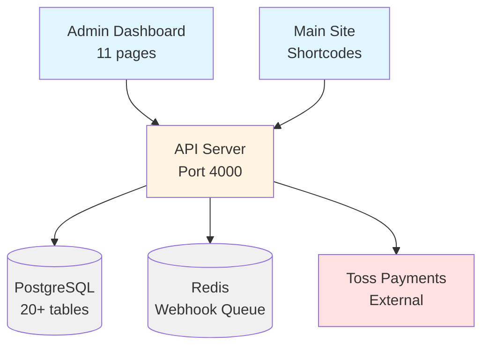
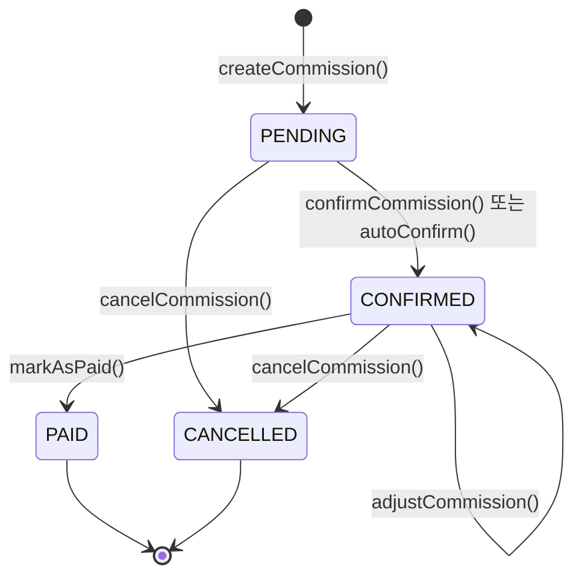
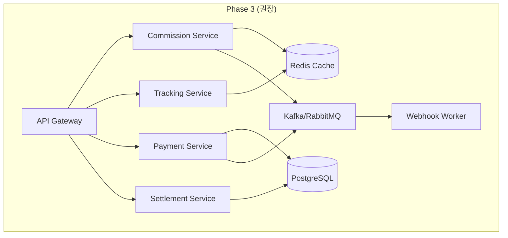

# 드랍쉬핑 도메인 코드 정비 — 사전조사 보고서

**작성일**: 2025-11-06
**조사 범위**: O4O Platform 드랍쉬핑 전반 (공급사/파트너/상품/정산/주문/재고/연동)
**목적**: 중복·하드코딩·성능 병목·계약 불일치 식별 및 정비 계획 수립

---

## 목차

1. [요약](#1-요약)
2. [조사 범위 및 방법](#2-조사-범위-및-방법)
3. [아키텍처 현황](#3-아키텍처-현황)
4. [타입/스키마/SSOT 분석](#4-타입스키마ssot-분석)
5. [서비스 레이어 분석](#5-서비스-레이어-분석)
6. [라우팅 및 API 계약](#6-라우팅-및-api-계약)
7. [결제/웹훅/멱등성](#7-결제웹훅멱등성)
8. [커미션/정산 로직](#8-커미션정산-로직)
9. [데이터베이스 스키마 및 인덱스](#9-데이터베이스-스키마-및-인덱스)
10. [프런트엔드/포털 계약](#10-프런트엔드포털-계약)
11. [성능 병목 및 핫스팟](#11-성능-병목-및-핫스팟)
12. [중복 코드 및 기술부채](#12-중복-코드-및-기술부채)
13. [위험 요소 및 우선순위](#13-위험-요소-및-우선순위)
14. [권장사항](#14-권장사항)

---

## 1. 요약

### 주요 발견사항

**✅ 강점**
- Phase 2 구현으로 커미션 자동화, 트래킹, 결제 통합 완료
- 엔티티 기반 SSOT 전환 완료 (Phase 1)
- 멱등성 키 도입으로 결제 중복 방지
- 정교한 봇 탐지 및 레이트 리미팅

**❌ 문제점 (High)**
1. **타입 중복**: CommissionPolicy, Partner, Affiliate 타입이 3곳 이상에 중복 정의
2. **API 경로 불일치**: `/api/admin/dropshipping/` vs `/admin/dropshipping/` 혼재
3. **하드코딩**: Hold period, rate limit, retry 횟수 등 매직넘버 다수
4. **N+1 쿼리**: Commission 생성, Tracking 검증 시 순차 로딩
5. **정산 로직 미완성**: PaymentSettlement 엔티티는 있으나 실제 프로세스 TODO

**⚠️  주의 (Medium)**
- 인덱스 누락 (holdUntil+status, webhookEnabled 등)
- 에러 처리 표준화 부족
- 멱등성 키 생성 로직이 일부 하드코딩

**📊 규모**
- 엔티티: 11개 (Partner, Supplier, Product, Order, Commission, Payment 등)
- 서비스: 6개 핵심 서비스
- API 라우트: 20+ 엔드포인트
- 데이터베이스 테이블: 20+ 관련 테이블
- 마이그레이션: 8개 드랍쉬핑 관련

---

## 2. 조사 범위 및 방법

### 조사 대상 모듈
- **CPT/엔티티**: Partner, Supplier, Product, CommissionPolicy, Commission, ConversionEvent, ReferralClick, Payment, PaymentSettlement, Shipment, Order
- **서비스**: CommissionEngine, TrackingService, PaymentService, WebhookService, OperationsService
- **라우트**: `/api/v1/entity/`, `/api/admin/dropshipping/`, `/api/v1/payments/`, `/api/v1/tracking/`
- **프런트엔드**: Admin Dashboard 드랍쉬핑 페이지 11개
- **데이터베이스**: 마이그레이션 파일, 인덱스 정의

### 조사 방법
1. Explore 에이전트를 통한 전체 코드베이스 스캔
2. 핵심 서비스 파일 직접 읽기 (6개 파일)
3. 타입 정의 중복 검색 (Grep 활용)
4. API 라우트 패턴 분석
5. 데이터베이스 마이그레이션 검토

---

## 3. 아키텍처 현황

### 전체 구조



### Phase 구분

| Phase | 범위 | 상태 |
|-------|------|------|
| Phase 1 | CPT → Entity 전환, SSOT 확립 | ✅ 완료 |
| Phase 2.1 | 커미션 자동화, 트래킹, 배치 작업 | ✅ 완료 |
| Phase 2.2 | 정산/지급 프로세스 | ⚠️  부분 완료 (엔티티만) |
| Phase 2.3 | 웹훅 통합, 파트너 포털 | ✅ 완료 |
| Phase 2.4 | 대시보드, 모니터링 | ✅ 완료 |

---

## 4. 타입/스키마/SSOT 분석

### 4.1 현재 타입 구조

```
packages/types/src/
├── cpt/               # CPT 기본 타입 (Post, ACF 등)
├── partner.ts         # PartnerUser, PartnerCommission, CommissionPolicy
├── affiliate.ts       # AffiliateUser, AffiliateCommission (중복!)
├── vendor-management.ts  # VendorProduct, SupplierOrderSplit
└── ecommerce.ts       # 기본 Order, Product 인터페이스
```

### 4.2 중복 타입 매트릭스

| 타입 | packages/types | api-server/entities | api-server/types | supplier-connector |
|------|----------------|---------------------|------------------|--------------------|
| **CommissionPolicy** | ✅ partner.ts:106 | ✅ CommissionPolicy.ts | ❌ | ❌ |
| **PartnerCommission** | ✅ partner.ts:78 | ✅ Commission.ts | ❌ | ❌ |
| **AffiliateCommission** | ✅ affiliate.ts | ❌ | ✅ (구조 유사) | ❌ |
| **PartnerUser** | ✅ partner.ts:6 | ✅ Partner.ts | ❌ | ❌ |
| **AffiliateUser** | ✅ affiliate.ts | ❌ | ✅ (구조 유사) | ❌ |
| **SupplierInfo** | ❌ | ✅ Supplier.ts | ✅ | ✅ |
| **BankAccount** | ✅ (2곳 정의!) | ❌ | ❌ | ❌ |

**🔴 Critical Issue**:
- `CommissionPolicy`가 `/packages/types/src/partner.ts:106`과 `/apps/api-server/src/entities/CommissionPolicy.ts`에 중복 정의
- 필드 구조가 일치하지 않음 (entity는 policyType, status 등 추가 필드 보유)

### 4.3 타입 불일치 예시

```typescript
// ❌ packages/types/src/partner.ts:106
export interface CommissionPolicy {
  id: string;
  name: string;
  defaultRate: number;  // 기본 필드만
  // ...
}

// ✅ apps/api-server/src/entities/CommissionPolicy.ts:10
@Entity('commission_policies')
export class CommissionPolicy {
  @Column({ type: 'enum', enum: PolicyType })
  policyType: PolicyType;  // ENUM 타입

  @Column({ type: 'enum', enum: PolicyStatus })
  status: PolicyStatus;  // Entity에만 존재
  // ...
}
```

**권장**: Entity 정의를 SSOT로 사용, `/packages/types`에서는 DTO만 정의

### 4.4 SSOT 체크리스트

| 항목 | 상태 | 비고 |
|------|------|------|
| CPT 타입 단일화 | ✅ | `@o4o/types/cpt` 기준 |
| Commission 타입 단일화 | ❌ | partner.ts vs Entity 중복 |
| Partner/Affiliate 통합 | ❌ | 거의 동일한 구조, 통합 필요 |
| Supplier 타입 단일화 | ❌ | 3곳 정의 (types, entities, connector) |
| 다국어/테넌트 키 | ⚠️  | 일부 엔티티에만 존재 |

---

## 5. 서비스 레이어 분석

### 5.1 핵심 서비스 목록

| 서비스 | 위치 | 역할 | 상태 | LOC |
|--------|------|------|------|-----|
| **CommissionEngine** | `/services/CommissionEngine.ts` | 커미션 생성/확정/조정 | ✅ 안정 | 685 |
| **TrackingService** | `/services/TrackingService.ts` | 클릭 추적, 봇 탐지, 레이트 리미팅 | ✅ 안정 | 676 |
| **PaymentService** | `/services/PaymentService.ts` | Toss 결제, 멱등성, 웹훅 | ✅ 안정 | 775 |
| **WebhookService** | `/services/WebhookService.ts` | BullMQ 웹훅 전송 | ✅ 안정 | ~150 |
| **OperationsService** | `/controllers/operationsController.ts` | 배치 작업 (자동확정) | ✅ 안정 | ~200 |
| **DropshippingController** | `/controllers/dropshipping/` | 레거시 CRUD | ⚠️  유지보수 | ~300 |

### 5.2 CommissionEngine 분석

**파일**: `/home/sohae21/o4o-platform/apps/api-server/src/services/CommissionEngine.ts`

**핵심 기능**:
1. `createCommission()` - 전환 이벤트 → 커미션 생성
2. `findBestMatchingPolicy()` - 정책 우선순위 매칭
3. `confirmCommission()` - PENDING → CONFIRMED 전환
4. `autoConfirmCommissions()` - 배치 작업 (Hold period 만료 처리)
5. `adjustCommission()` - 부분 환불 등 금액 조정

**정책 매칭 알고리즘** (`findBestMatchingPolicy()` lines 178-229):
```typescript
1. status = ACTIVE인 모든 정책 로드
2. 시간/사용량 제한 필터 (policy.isActive())
3. 컨텍스트 매칭 (policy.appliesTo(context))
4. 우선순위 정렬 (priority DESC)
5. 동일 우선순위 시 specificity 점수 계산
   - 파트너 특정: +100
   - 티어 특정: +80
   - 상품 특정: +90
   - 공급자 특정: +70
   - 카테고리: +60
6. 최상위 정책 반환
```

**🔴 Performance Issue**:
- Line 76-79: `conversion` 로드 시 `relations: ['partner', 'product']` 사용
- Line 91-93: 중복 체크 쿼리
- Line 180-183: 전체 정책 로드 후 메모리 필터링

**개선안**:
```typescript
// ❌ 현재 (N+1 query)
const conversion = await this.conversionRepository.findOne({
  where: { id: data.conversionId },
  relations: ['partner', 'product']  // 2번의 추가 쿼리
});

// ✅ 개선안 (단일 쿼리)
const conversion = await this.conversionRepository
  .createQueryBuilder('conversion')
  .leftJoinAndSelect('conversion.partner', 'partner')
  .leftJoinAndSelect('conversion.product', 'product')
  .where('conversion.id = :id', { id: data.conversionId })
  .getOne();
```

**🟡 Hardcoded Values**:
- Line 60: `HOLD_PERIOD_DAYS = 7` - 환경변수로 이동 필요
- Line 234-264: Specificity 점수 계산 로직 - 설정 파일로 분리

### 5.3 TrackingService 분석

**파일**: `/home/sohae21/o4o-platform/apps/api-server/src/services/TrackingService.ts`

**핵심 기능**:
1. `recordClick()` - 12단계 파이프라인 (검증 → 필터링 → 저장)
2. `detectBot()` - User-Agent 패턴 매칭
3. `checkRateLimit()` - In-memory 캐시 기반 (⚠️  Redis 전환 필요)
4. `checkDuplicate()` - 24시간 내 중복 클릭 감지
5. `anonymizeOldClicks()` - GDPR 준수

**봇 탐지 로직** (lines 201-229):
```typescript
- 빈 User-Agent → 봇
- 길이 < 20자 → 봇
- 패턴 매칭: bot, crawler, spider, curl, wget, python-requests 등
- 일반 브라우저 시그니처 부재 → 봇
```

**레이트 리미팅** (lines 54-55):
```typescript
RATE_LIMIT_WINDOW_MINUTES = 5  // 🔴 하드코딩
RATE_LIMIT_MAX_CLICKS = 10     // 🔴 하드코딩
```

**🔴 Performance Issue**:
- Line 53: `clickCache: Map<string, ...>` - In-memory, 서버 재시작 시 초기화
- Line 85-91: Partner 검증과 Product 검증이 순차 실행

**개선안**:
```typescript
// ❌ 현재
const partner = await this.partnerRepository.findOne(...);  // Query 1
if (data.productId) {
  const product = await this.productRepository.findOne(...);  // Query 2
}

// ✅ 개선안 (병렬 실행)
const [partner, product] = await Promise.all([
  this.partnerRepository.findOne(...),
  data.productId ? this.productRepository.findOne(...) : null
]);
```

**🟡 개인정보 처리**:
- Line 340-342: SHA-256 해싱 (✅ 적절)
- Line 347-369: IP 익명화 (마지막 옥텟 제거) (✅ GDPR 준수)

### 5.4 PaymentService 분석

**파일**: `/home/sohae21/o4o-platform/apps/api-server/src/services/PaymentService.ts`

**핵심 기능**:
1. `preparePayment()` - 결제 준비 (금액 검증)
2. `confirmPayment()` - Toss API 호출 + 멱등성 체크
3. `cancelPayment()` - 취소/부분취소
4. `handleWebhook()` - 웹훅 서명 검증 + 처리
5. `createSettlements()` - 정산 생성 (⚠️  미완성)

**멱등성 구현** (lines 143-168):
```typescript
const idempotencyKey = request.idempotencyKey ||
  `confirm_${request.orderId}_${request.paymentKey}`;

const existingPayment = await this.paymentRepository.findOne({
  where: { confirmIdempotencyKey: idempotencyKey }
});

if (existingPayment) {
  if (existingPayment.status === PaymentStatus.DONE) {
    return existingPayment;  // 🔐 중복 요청 방지
  }
}
```

**✅ 강점**:
- 멱등성 키 저장 후 처리 (Line 189-192)
- Transaction 사용 (Line 170-254)
- 실패 시 롤백 + 에러 기록 (Line 243-249)

**웹훅 서명 검증** (lines 362-413):
```typescript
// HMAC-SHA256 검증
const dataToVerify = `${payload}:${transmissionTime}`;
const expectedHash = crypto
  .createHmac('sha256', this.config.secretKey)
  .update(dataToVerify)
  .digest('base64');
```

**🔴 Issue**:
- Line 394: `Buffer.from(sig, 'base64').toString('base64')` - 불필요한 디코드/인코드
- Line 579-605: `calculatePartnerSettlement()` - TODO 주석, 미구현

**🟡 Hardcoded Values**:
- Line 555: `settlementDate.setDate(settlementDate.getDate() + 3)` - D+3 정산 (환경변수화)
- Line 600: `settlementDate.setDate(settlementDate.getDate() + 7)` - D+7 커미션 (환경변수화)
- Line 612: `platformFeeRate = 0.05` - 5% 플랫폼 수수료 (DB 설정으로)

### 5.5 서비스 통합 현황

| 서비스 | 레거시 존재 | 통합 완료 | 비고 |
|--------|-------------|-----------|------|
| Commission | ✅ (DropshippingController) | ✅ | CommissionEngine 사용 |
| Tracking | ❌ | ✅ | 신규 구현 (Phase 2.1) |
| Payment | ✅ (PaymentController) | ✅ | PaymentService 사용 |
| Webhook | ❌ | ✅ | 신규 구현 (BullMQ) |
| Settlement | ❌ | ⚠️  | 엔티티만 생성, 프로세스 TODO |

---

## 6. 라우팅 및 API 계약

### 6.1 API 경로 구조

```
/api/v1/entity/           # Entity CRUD (통합)
├── /suppliers
├── /partners
├── /suppliers/dashboard/stats
└── /partners/dashboard/summary

/api/admin/dropshipping/  # 관리자 전용
├── /commission-policies
├── /approvals
├── /system-status
└── /products/bulk-import

/api/v1/payments/         # 결제
├── /prepare
├── /confirm
└── /toss/webhook

/api/v1/tracking/         # 트래킹
├── /clicks
└── /conversions
```

### 6.2 라우트 중복 이슈

**🔴 Critical**: Admin 경로 불일치

```typescript
// ❌ apps/admin-dashboard/src/pages/dropshipping/Approvals.tsx
fetch('/api/admin/dropshipping/approvals')  // /api 포함

// ❌ apps/admin-dashboard/src/pages/dropshipping/SystemSetup.tsx
fetch('/api/admin/dropshipping/system-status')  // /api 포함

// ✅ apps/admin-dashboard/src/pages/dropshipping/Commissions.tsx
authClient.api.get('/admin/dropshipping/commission-policies')  // authClient 사용
```

**Impact**:
- fetch() 사용 시 baseURL 미적용 → 환경변수 하드코딩 필요
- authClient 사용 시 자동 토큰 주입, 리프레시 처리

**권장**: 모든 API 호출을 `authClient.api.{get|post|put|delete}()`로 통일

### 6.3 엔티티 라우트 분석

**파일**: `/home/sohae21/o4o-platform/apps/api-server/src/routes/entity/dropshipping-entity.routes.ts`

**Supplier Routes**:
```typescript
GET    /api/v1/entity/suppliers         # 목록 (필터/페이지네이션)
GET    /api/v1/entity/suppliers/:id     # 단일 조회
POST   /api/v1/entity/suppliers         # 생성
PUT    /api/v1/entity/suppliers/:id     # 수정
DELETE /api/v1/entity/suppliers/:id     # 삭제 (Soft)
PUT    /api/v1/entity/suppliers/:id/approve  # 승인 (Admin)
PUT    /api/v1/entity/suppliers/:id/reject   # 거부 (Admin)
```

**Partner Routes**:
```typescript
GET    /api/v1/entity/partners         # 목록
GET    /api/v1/entity/partners/:id     # 단일 조회
POST   /api/v1/entity/partners         # 생성
PUT    /api/v1/entity/partners/:id     # 수정
DELETE /api/v1/entity/partners/:id     # 삭제
PUT    /api/v1/entity/partners/:id/approve   # 승인
PUT    /api/v1/entity/partners/:id/reject    # 거부
GET    /api/v1/entity/partners/:id/referral-link  # 추천 링크 생성
```

**Dashboard Routes**:
```typescript
GET /api/v1/entity/suppliers/dashboard/stats     # 공급자 통계
GET /api/v1/entity/suppliers/dashboard/products  # 상품 목록
GET /api/v1/entity/partners/dashboard/summary    # 파트너 요약
GET /api/v1/entity/partners/dashboard/commissions  # 커미션 내역
```

**✅ 강점**:
- RESTful 네이밍
- 인증 미들웨어 전체 적용 (Line 15)
- Admin 권한 체크 (requireAdmin 미들웨어, Lines 20-29)

**🟡 개선 필요**:
- 에러 응답 표준화 (현재 각 컨트롤러마다 다름)
- 페이지네이션 메타 정보 표준화 (`{data, meta: {total, page, limit}}`)

### 6.4 Admin 라우트 분석

**파일**: `/home/sohae21/o4o-platform/apps/api-server/src/routes/admin/dropshipping.routes.ts`

```typescript
GET  /admin/dropshipping/commission-policies  # 정책 목록
GET  /admin/dropshipping/approvals            # 승인 대기 목록
POST /admin/dropshipping/approvals/:id/approve  # 승인
POST /admin/dropshipping/approvals/:id/reject   # 거부
GET  /admin/dropshipping/system-status        # 시스템 상태
POST /admin/dropshipping/initialize            # 초기화
POST /admin/dropshipping/seed                 # 샘플 데이터
POST /admin/dropshipping/products/bulk-import  # 대량 등록
```

**🟡 이슈**:
- Line 10-11: `authenticate`, `requireAdmin` 미들웨어 순서 명시
- 응답 형식이 DropshippingController에 의존

### 6.5 응답 형식 표준화 현황

| 컨트롤러 | 성공 형식 | 에러 형식 | 일관성 |
|----------|-----------|-----------|--------|
| EntityController | `{ success: true, data }` | `{ success: false, error }` | ✅ 양호 |
| DropshippingController | `{ success, data, message }` | `{ error, message }` | ⚠️  혼재 |
| PaymentController | `{ data }` 또는 `{ error }` | `{ error, code }` | ❌ 불일치 |

**권장 표준**:
```typescript
// 성공
{
  data: T,
  meta?: { total, page, limit, ... }
}

// 에러
{
  error: {
    code: string,        // ERR_NOT_FOUND, ERR_VALIDATION, ...
    message: string,
    details?: any
  }
}
```

---

## 7. 결제/웹훅/멱등성

### 7.1 Toss Payments 통합

**설정** (PaymentService.ts lines 56-61):
```typescript
TOSS_CLIENT_KEY: process.env.TOSS_CLIENT_KEY || 'test_ck_'
TOSS_SECRET_KEY: process.env.TOSS_SECRET_KEY || 'test_sk_'
TOSS_API_URL: process.env.TOSS_API_URL || 'https://api.tosspayments.com/v1'
```

**Authorization 헤더** (Line 67):
```typescript
'Authorization': `Basic ${Buffer.from(this.config.secretKey + ':').toString('base64')}`
```

**✅ 안전성**:
- Basic Auth 구현 정확
- HTTPS 통신
- 환경변수 폴백값 제공

### 7.2 멱등성 구현

**Confirm Payment** (lines 143-168):
```typescript
// 1. 멱등성 키 생성
const idempotencyKey = request.idempotencyKey ||
  `confirm_${request.orderId}_${request.paymentKey}`;

// 2. 기존 요청 확인
const existingPayment = await this.paymentRepository.findOne({
  where: { confirmIdempotencyKey: idempotencyKey }
});

// 3. 중복 요청 처리
if (existingPayment) {
  if (existingPayment.status === PaymentStatus.DONE) {
    return existingPayment;  // 성공 결과 반환
  }
  if (existingPayment.status === PaymentStatus.IN_PROGRESS) {
    throw new Error('Payment confirmation already in progress');
  }
}

// 4. 멱등성 키 저장 후 처리
payment.confirmIdempotencyKey = idempotencyKey;
payment.status = PaymentStatus.IN_PROGRESS;
await queryRunner.manager.save(Payment, payment);
```

**✅ 강점**:
- 상태 기반 처리 (DONE, IN_PROGRESS, ABORTED)
- 트랜잭션 내 멱등성 키 저장
- 자동 키 생성 (사용자 키 우선)

**🟡 개선 필요**:
- Line 144: 멱등성 키 형식 하드코딩 (`confirm_` 접두사)
- 타임스탬프 추가 권장: `confirm_${orderId}_${timestamp}`

**Cancel Payment** (lines 262-281):
```typescript
const idempotencyKey = request.idempotencyKey ||
  `cancel_${request.paymentKey}_${cancelAmount}_${Date.now()}`;
```

**✅ 개선**: 타임스탬프 포함 (`Date.now()`)

### 7.3 웹훅 서명 검증

**알고리즘** (lines 362-413):
```typescript
1. 헤더 추출: tosspayments-signature, tosspayments-webhook-transmission-time
2. 서명 형식 검증: "v1:signature1,signature2,..."
3. 검증 데이터 구성: "{payload}:{transmissionTime}"
4. HMAC-SHA256 해시 생성
5. 제공된 서명들 중 일치 여부 확인
```

**구현**:
```typescript
const signatures = signature.substring(3).split(',');
const dataToVerify = `${payload}:${transmissionTime}`;

const expectedHash = crypto
  .createHmac('sha256', this.config.secretKey)
  .update(dataToVerify)
  .digest('base64');

const isValid = signatures.some(sig => {
  const decodedSig = Buffer.from(sig, 'base64').toString('base64');
  return decodedSig === expectedHash;
});
```

**🔴 Bug**: Line 394 - `Buffer.from(sig, 'base64').toString('base64')`는 항상 원본 반환
```typescript
// ❌ 현재 (불필요한 디코드/인코드)
const decodedSig = Buffer.from(sig, 'base64').toString('base64');

// ✅ 수정안 (timing-safe 비교)
return crypto.timingSafeEqual(
  Buffer.from(sig, 'base64'),
  Buffer.from(expectedHash, 'base64')
);
```

**⚠️  Clock Skew 허용 없음**:
- transmissionTime 검증 로직 부재
- Replay Attack 방어 미비

**권장 추가**:
```typescript
const transmissionTime = parseInt(headers['tosspayments-webhook-transmission-time']);
const currentTime = Math.floor(Date.now() / 1000);
const timeDiff = Math.abs(currentTime - transmissionTime);

if (timeDiff > 300) {  // 5분 허용
  throw new Error('Webhook timestamp too old');
}
```

### 7.4 재시도 정책

**WebhookService** (webhook.queue.ts):
```typescript
{
  attempts: 5,
  backoff: {
    type: 'exponential',
    delay: 1000  // 1s → 2s → 4s → 8s → 16s
  }
}
```

**✅ 적절한 설정**:
- 최대 5회 재시도
- 지수 백오프 (총 대기시간: ~31초)

**🟡 개선 필요**:
- DLQ (Dead Letter Queue) 설정 누락
- 재시도 실패 시 알림 로직 없음

### 7.5 멱등성 체크리스트

| 엔드포인트 | 멱등성 키 도입 | 중복 요청 방어 | DLQ | 로깅 |
|------------|----------------|----------------|-----|------|
| POST /payments/confirm | ✅ | ✅ | ❌ | ✅ |
| POST /payments/cancel | ✅ | ✅ | ❌ | ✅ |
| POST /orders | ❌ | ❌ | ❌ | ⚠️  |
| POST /commissions | ⚠️  (conversion 중복 체크) | ⚠️  | ❌ | ✅ |
| POST /tracking/clicks | ⚠️  (session/fingerprint) | ⚠️  | ❌ | ✅ |

---

## 8. 커미션/정산 로직

### 8.1 커미션 상태 머신



**Hold Period**: 7일 (Line 60, CommissionEngine.ts)
- 구매 확정 대기 기간
- 환불 가능 기간 고려

**상태 전환 규칙**:
```typescript
PENDING: 생성 직후, holdUntil 설정
  ↓ holdUntil 만료 OR 수동 확정
CONFIRMED: 지급 대기
  ↓ 정산 실행
PAID: 지급 완료 (최종 상태)

PENDING/CONFIRMED → CANCELLED: 주문 취소/환불 시
```

### 8.2 정책 매칭 우선순위

**PolicyType 우선순위** (CommissionPolicy.ts):
```typescript
1. PARTNER_SPECIFIC (개별 협상)    - Priority: 100
2. PROMOTIONAL (프로모션)         - Priority: 90
3. PRODUCT_SPECIFIC (상품 특화)   - Priority: 80
4. CATEGORY (카테고리)            - Priority: 50
5. TIER_BASED (티어 기반)         - Priority: 30
6. DEFAULT (기본)                 - Priority: 0
```

**Specificity 점수** (CommissionEngine.ts lines 234-264):
```typescript
partnerId 매칭:       +100
productId 매칭:       +90
partnerTier 매칭:     +80
supplierId 매칭:      +70
category 매칭:        +60
tags 매칭:            +50
orderAmount 조건:     +40
requiresNewCustomer:  +30
PROMOTIONAL 타입:     +20
```

**매칭 알고리즘** (line 204-215):
```typescript
// 1. Priority 비교 (높은 것 우선)
const priorityDiff = (b.priority || 0) - (a.priority || 0);
if (priorityDiff !== 0) return priorityDiff;

// 2. Priority 동일 시 Specificity 비교
const specificityA = this.calculateSpecificity(a);
const specificityB = this.calculateSpecificity(b);
return specificityB - specificityA;
```

**✅ 장점**:
- 명확한 우선순위 체계
- 충돌 해결 규칙 명시
- 스택 불가능 정책 지원 (`canStackWithOtherPolicies` 필드)

**🟡 개선 필요**:
- Specificity 점수가 하드코딩 (설정 파일로 분리)
- 정책 스태킹 로직 미구현 (Line 225: TODO)

### 8.3 커미션 계산 로직

**정책별 계산 방식** (CommissionPolicy.calculateCommission()):
```typescript
switch (this.commissionType) {
  case CommissionType.PERCENTAGE:
    // 비율 방식
    commission = orderAmount * (this.commissionRate / 100);
    break;

  case CommissionType.FIXED_AMOUNT:
    // 고정 금액
    commission = this.fixedAmount * quantity;
    break;

  case CommissionType.TIERED:
    // 티어드 방식 (판매량/금액 구간별)
    commission = this.calculateTiered(orderAmount, quantity);
    break;

  case CommissionType.HYBRID:
    // 하이브리드 (기본 금액 + 비율)
    commission = this.baseAmount + (orderAmount * this.bonusRate / 100);
    break;
}

// 최소/최대값 적용
commission = Math.max(this.minCommission || 0, commission);
commission = Math.min(this.maxCommission || Infinity, commission);
```

**✅ 유연성**:
- 4가지 계산 방식 지원
- 최소/최대 금액 제한
- 반올림 정책 적용 (`roundingMethod` 필드)

### 8.4 배치 자동확정

**파일**: `/home/sohae21/o4o-platform/apps/api-server/src/jobs/commission-batch.job.ts`

**스케줄**: 매일 02:00 (Asia/Seoul)
```typescript
const schedule = process.env.COMMISSION_BATCH_SCHEDULE || '0 2 * * *';
const timezone = process.env.TZ || 'Asia/Seoul';
```

**프로세스**:
```typescript
1. holdUntil < now() AND status = PENDING인 커미션 조회
2. 각 커미션에 대해:
   - confirmCommission() 호출
   - Audit Log 생성
   - Webhook 발송 (commission.auto_confirmed)
3. 성공/실패 카운트 기록
4. 메트릭 업데이트
```

**✅ 강점**:
- 환경변수 기반 스케줄 설정
- 개별 실패 시에도 계속 진행 (Line 442-443)
- 상세 로깅

**🟡 개선 필요**:
- 대량 처리 시 메모리 사용량 (한 번에 모든 레코드 로드)
- 배치 크기 제한 없음 (페이지네이션 권장)

### 8.5 정산 프로세스 (미완성)

**PaymentSettlement Entity** (PaymentSettlement.ts):
```typescript
@Entity('payment_settlements')
export class PaymentSettlement {
  @Column({ type: 'enum', enum: RecipientType })
  recipientType: RecipientType;  // SUPPLIER, PARTNER, PLATFORM

  @Column()
  recipientId: string;

  @Column({ type: 'decimal', precision: 10, scale: 2 })
  amount: number;

  @Column({ type: 'enum', enum: SettlementStatus })
  status: SettlementStatus;  // SCHEDULED, PROCESSING, COMPLETED, FAILED

  @Column({ type: 'timestamp', nullable: true })
  scheduledAt: Date;
}
```

**정산 생성 로직** (PaymentService.ts lines 481-529):
```typescript
private async createSettlements(paymentId: string) {
  // 1. 공급자별 정산 (D+3)
  const supplierSettlements = this.calculateSupplierSettlements(order, payment);

  // 2. 파트너 커미션 정산 (D+7)
  const partnerSettlement = this.calculatePartnerSettlement(order, payment);  // ⚠️  TODO

  // 3. 플랫폼 수수료 정산 (즉시)
  const platformSettlement = this.calculatePlatformSettlement(order, payment);
}
```

**🔴 Missing Implementation**:
- Line 579-605: `calculatePartnerSettlement()` - 주석 처리, 실제 로직 없음
- 정산 실행 프로세스 (SCHEDULED → PROCESSING → COMPLETED) 미구현
- 배치 작업 없음 (예: 정기 정산 스케줄러)

**권장 구현**:
```typescript
// 정산 배치 작업 (일 1회)
async processScheduledSettlements() {
  const now = new Date();
  const settlements = await this.settlementRepository.find({
    where: {
      status: SettlementStatus.SCHEDULED,
      scheduledAt: LessThanOrEqual(now)
    }
  });

  for (const settlement of settlements) {
    try {
      await this.processSettlement(settlement);
    } catch (error) {
      settlement.status = SettlementStatus.FAILED;
      settlement.failureReason = error.message;
      await this.settlementRepository.save(settlement);
    }
  }
}
```

### 8.6 수수료 및 세금 계산

**플랫폼 수수료** (PaymentService.ts line 612):
```typescript
const platformFeeRate = 0.05;  // 🔴 5% 하드코딩
```

**공급자 정산** (lines 534-574):
```typescript
const amount = item.unitPrice * item.quantity;  // 공급가 기준
settlement.fee = 0;  // 공급자 수수료 없음
settlement.tax = 0;  // 세금 계산 미구현
settlement.netAmount = amount;
```

**🔴 Missing**:
- 세금 계산 로직 (VAT, 원천징수 등)
- 수수료 정책 DB 관리 (현재 하드코딩)
- 환율 처리 (다통화 지원 시)

---

## 9. 데이터베이스 스키마 및 인덱스

### 9.1 주요 테이블 구조

```sql
-- 파트너
CREATE TABLE partners (
  id UUID PRIMARY KEY,
  user_id UUID REFERENCES users(id),
  referral_code VARCHAR(50) UNIQUE NOT NULL,
  tier VARCHAR(20),  -- BRONZE, SILVER, GOLD, PLATINUM
  status VARCHAR(20),  -- ACTIVE, INACTIVE, SUSPENDED
  is_active BOOLEAN DEFAULT true,
  webhook_url VARCHAR(255),
  webhook_secret VARCHAR(255),
  webhook_enabled BOOLEAN DEFAULT false,
  total_clicks INT DEFAULT 0,
  total_revenue DECIMAL(10,2) DEFAULT 0,
  total_commission DECIMAL(10,2) DEFAULT 0,
  last_active_at TIMESTAMP,
  created_at TIMESTAMP DEFAULT NOW(),
  updated_at TIMESTAMP DEFAULT NOW()
);

-- 커미션 정책
CREATE TABLE commission_policies (
  id UUID PRIMARY KEY,
  policy_code VARCHAR(50) UNIQUE NOT NULL,
  name VARCHAR(100) NOT NULL,
  policy_type VARCHAR(30),  -- DEFAULT, TIER_BASED, PRODUCT_SPECIFIC, ...
  status VARCHAR(20),  -- ACTIVE, INACTIVE, ARCHIVED
  priority INT DEFAULT 0,

  -- 대상 조건
  partner_id UUID REFERENCES partners(id),
  partner_tier VARCHAR(20),
  product_id UUID,
  supplier_id UUID,
  category VARCHAR(50),
  tags TEXT[],

  -- 금액 조건
  min_order_amount DECIMAL(10,2),
  max_order_amount DECIMAL(10,2),
  requires_new_customer BOOLEAN DEFAULT false,

  -- 커미션 설정
  commission_type VARCHAR(20),  -- PERCENTAGE, FIXED_AMOUNT, TIERED, HYBRID
  commission_rate DECIMAL(5,2),  -- 비율 (%)
  fixed_amount DECIMAL(10,2),
  min_commission DECIMAL(10,2),
  max_commission DECIMAL(10,2),

  -- 정책 기간
  start_date TIMESTAMP,
  end_date TIMESTAMP,
  max_usage_count INT,
  usage_count INT DEFAULT 0,

  can_stack_with_other_policies BOOLEAN DEFAULT false,
  created_at TIMESTAMP DEFAULT NOW(),
  updated_at TIMESTAMP DEFAULT NOW()
);

-- 커미션
CREATE TABLE commissions (
  id UUID PRIMARY KEY,
  partner_id UUID NOT NULL REFERENCES partners(id),
  product_id UUID,
  seller_id UUID,
  order_id UUID,
  conversion_id UUID REFERENCES conversion_events(id),
  policy_id UUID REFERENCES commission_policies(id),
  referral_code VARCHAR(50),

  status VARCHAR(20),  -- PENDING, CONFIRMED, PAID, CANCELLED
  policy_type VARCHAR(30),
  commission_amount DECIMAL(10,2) NOT NULL,
  order_amount DECIMAL(10,2) NOT NULL,
  currency VARCHAR(3) DEFAULT 'KRW',
  commission_rate DECIMAL(5,2),

  hold_until TIMESTAMP,
  confirmed_at TIMESTAMP,
  paid_at TIMESTAMP,
  cancelled_at TIMESTAMP,

  payment_method VARCHAR(20),
  payment_reference VARCHAR(100),

  metadata JSONB,
  created_at TIMESTAMP DEFAULT NOW(),
  updated_at TIMESTAMP DEFAULT NOW()
);

-- 추천 클릭
CREATE TABLE referral_clicks (
  id UUID PRIMARY KEY,
  partner_id UUID NOT NULL REFERENCES partners(id),
  product_id UUID,
  referral_code VARCHAR(50) NOT NULL,
  referral_link TEXT,
  campaign VARCHAR(50),
  medium VARCHAR(50),
  source VARCHAR(50),

  status VARCHAR(20),  -- VALID, DUPLICATE, BOT, INTERNAL, RATE_LIMITED
  click_source VARCHAR(20),  -- WEB, MOBILE, APP, SOCIAL, EMAIL

  session_id VARCHAR(64),  -- SHA-256 해시
  fingerprint VARCHAR(64),  -- SHA-256 해시
  ip_address VARCHAR(45),  -- IPv4/IPv6 익명화
  user_agent TEXT,
  referer TEXT,

  country VARCHAR(2),
  city VARCHAR(50),
  device_type VARCHAR(20),
  os_name VARCHAR(20),
  browser_name VARCHAR(20),

  is_duplicate BOOLEAN DEFAULT false,
  original_click_id UUID,
  click_count INT DEFAULT 1,

  is_suspicious_bot BOOLEAN DEFAULT false,
  bot_detection_reason TEXT,
  is_rate_limited BOOLEAN DEFAULT false,

  has_converted BOOLEAN DEFAULT false,
  conversion_id UUID,
  converted_at TIMESTAMP,
  anonymized_at TIMESTAMP,

  created_at TIMESTAMP DEFAULT NOW()
);

-- 전환 이벤트
CREATE TABLE conversion_events (
  id UUID PRIMARY KEY,
  partner_id UUID NOT NULL REFERENCES partners(id),
  product_id UUID,
  referral_click_id UUID REFERENCES referral_clicks(id),
  order_id UUID,
  referral_code VARCHAR(50),

  status VARCHAR(20),  -- PENDING, CONFIRMED, CANCELLED
  conversion_type VARCHAR(20),  -- SIGNUP, PURCHASE, SUBSCRIPTION

  order_amount DECIMAL(10,2),
  quantity INT DEFAULT 1,
  currency VARCHAR(3) DEFAULT 'KRW',

  attribution_model VARCHAR(20),  -- LAST_TOUCH, FIRST_TOUCH, LINEAR, ...
  attribution_weight DECIMAL(3,2) DEFAULT 1.0,

  is_new_customer BOOLEAN DEFAULT false,
  customer_lifetime_value DECIMAL(10,2),

  confirmed_at TIMESTAMP,
  cancelled_at TIMESTAMP,
  created_at TIMESTAMP DEFAULT NOW()
);

-- 결제
CREATE TABLE payments (
  id UUID PRIMARY KEY,
  order_id UUID UNIQUE NOT NULL REFERENCES orders(id),
  payment_key VARCHAR(100),
  transaction_id VARCHAR(100),

  amount DECIMAL(10,2) NOT NULL,
  balance_amount DECIMAL(10,2),
  cancel_amount DECIMAL(10,2) DEFAULT 0,
  currency VARCHAR(3) DEFAULT 'KRW',

  status VARCHAR(30),  -- PENDING, IN_PROGRESS, DONE, CANCELED, ...
  method VARCHAR(30),  -- CARD, TRANSFER, VIRTUAL_ACCOUNT, ...
  method_details JSONB,

  order_name VARCHAR(255),
  customer_email VARCHAR(100),
  customer_name VARCHAR(100),
  customer_mobile_phone VARCHAR(20),

  confirm_idempotency_key VARCHAR(255),
  cancel_idempotency_key VARCHAR(255),

  success_url TEXT,
  fail_url TEXT,

  approved_at TIMESTAMP,
  canceled_at TIMESTAMP,

  cancel_reason TEXT,
  cancels JSONB,

  failure_code VARCHAR(50),
  failure_message TEXT,

  gateway_response JSONB,
  webhook_received BOOLEAN DEFAULT false,

  created_at TIMESTAMP DEFAULT NOW(),
  updated_at TIMESTAMP DEFAULT NOW()
);

-- 정산
CREATE TABLE payment_settlements (
  id UUID PRIMARY KEY,
  payment_id UUID NOT NULL REFERENCES payments(id),

  recipient_type VARCHAR(20),  -- SUPPLIER, PARTNER, PLATFORM
  recipient_id VARCHAR(100) NOT NULL,
  recipient_name VARCHAR(100),

  amount DECIMAL(10,2) NOT NULL,
  fee DECIMAL(10,2) DEFAULT 0,
  tax DECIMAL(10,2) DEFAULT 0,
  net_amount DECIMAL(10,2) NOT NULL,
  currency VARCHAR(3) DEFAULT 'KRW',

  status VARCHAR(20),  -- SCHEDULED, PROCESSING, COMPLETED, FAILED

  scheduled_at TIMESTAMP,
  processing_started_at TIMESTAMP,
  completed_at TIMESTAMP,

  settlement_method VARCHAR(20),
  settlement_reference VARCHAR(100),

  bank_account JSONB,
  failure_reason TEXT,

  created_at TIMESTAMP DEFAULT NOW(),
  updated_at TIMESTAMP DEFAULT NOW()
);
```

### 9.2 기존 인덱스

**referral_clicks**:
```sql
CREATE INDEX idx_referral_clicks_partnerId_createdAt
  ON referral_clicks(partner_id, created_at);
CREATE INDEX idx_referral_clicks_referralCode_createdAt
  ON referral_clicks(referral_code, created_at);
CREATE INDEX idx_referral_clicks_status_createdAt
  ON referral_clicks(status, created_at);
CREATE INDEX idx_referral_clicks_sessionId
  ON referral_clicks(session_id);
CREATE INDEX idx_referral_clicks_fingerprint
  ON referral_clicks(fingerprint);
```

**commissions**:
```sql
CREATE INDEX idx_commissions_partnerId_status
  ON commissions(partner_id, status);
CREATE INDEX idx_commissions_status_createdAt
  ON commissions(status, created_at);
CREATE INDEX idx_commissions_holdUntil
  ON commissions(hold_until);
CREATE INDEX idx_commissions_policyId_status
  ON commissions(policy_id, status);
```

**conversion_events**:
```sql
CREATE INDEX idx_conversion_events_partnerId_createdAt
  ON conversion_events(partner_id, created_at);
CREATE INDEX idx_conversion_events_orderId
  ON conversion_events(order_id);
CREATE INDEX idx_conversion_events_referralClickId
  ON conversion_events(referral_click_id);
CREATE INDEX idx_conversion_events_status_createdAt
  ON conversion_events(status, created_at);
```

### 9.3 누락된 인덱스 (권장)

```sql
-- 🔴 배치 작업용 복합 인덱스
CREATE INDEX idx_commissions_holdUntil_status
  ON commissions(hold_until, status)
  WHERE status = 'PENDING';  -- Partial index

-- 🔴 웹훅 발송용 인덱스
CREATE INDEX idx_partners_webhookEnabled_status
  ON partners(webhook_enabled, status)
  WHERE webhook_enabled = true;

-- 🔴 정산 배치용 인덱스
CREATE INDEX idx_payment_settlements_scheduledAt_status
  ON payment_settlements(scheduled_at, status)
  WHERE status = 'SCHEDULED';

-- 🔴 전환율 분석용 인덱스
CREATE INDEX idx_conversion_events_createdAt_status
  ON conversion_events(created_at DESC, status);

-- 🔴 클릭 중복 체크 최적화
CREATE INDEX idx_referral_clicks_sessionId_createdAt
  ON referral_clicks(session_id, created_at DESC)
  WHERE session_id IS NOT NULL;

CREATE INDEX idx_referral_clicks_fingerprint_createdAt
  ON referral_clicks(fingerprint, created_at DESC)
  WHERE fingerprint IS NOT NULL;

-- 🔴 Payment 조회 최적화
CREATE INDEX idx_payments_confirmIdempotencyKey
  ON payments(confirm_idempotency_key)
  WHERE confirm_idempotency_key IS NOT NULL;

CREATE INDEX idx_payments_cancelIdempotencyKey
  ON payments(cancel_idempotency_key)
  WHERE cancel_idempotency_key IS NOT NULL;
```

### 9.4 JSONB 인덱스 (선택적)

```sql
-- CommissionPolicy.metadata
CREATE INDEX idx_commission_policies_metadata_gin
  ON commission_policies USING GIN (metadata);

-- Payment.gatewayResponse
CREATE INDEX idx_payments_gateway_response_gin
  ON payments USING GIN (gateway_response);

-- Product.attributes (드랍쉬핑 상품 검색용)
CREATE INDEX idx_products_attributes_gin
  ON products USING GIN (attributes);
```

### 9.5 Foreign Key 관계

**🟡 주의**: 일부 관계가 주석 처리됨

```typescript
// ConversionEvent.ts lines 67-70 (주석 처리)
// @ManyToOne(() => Order, { nullable: true })
// @JoinColumn({ name: 'order_id' })
// order?: Order;
```

**이유**: Order 엔티티가 삭제되었다는 주석
**영향**: orderId는 있으나 relation 없음 → JOIN 불가

**권장**: Order 엔티티 복원 또는 orderId를 외래키로 명시

---

## 10. 프런트엔드/포털 계약

### 10.1 Admin Dashboard 페이지

| 페이지 | 파일 | API 호출 방식 | 상태 |
|--------|------|---------------|------|
| Products | `Products.tsx` | authClient | ✅ |
| Orders | `Orders.tsx` | authClient | ✅ |
| Partners | `Partners.tsx` | authClient | ✅ |
| Suppliers | `Suppliers.tsx` | authClient | ✅ |
| Sellers | `Sellers.tsx` | authClient | ✅ |
| Commissions | `Commissions.tsx` | authClient | ✅ |
| Settlements | `Settlements.tsx` | authClient | ✅ |
| Approvals | `Approvals.tsx` | **fetch()** | ❌ 수정 필요 |
| SystemSetup | `SystemSetup.tsx` | **fetch()** | ❌ 수정 필요 |
| BulkProductImport | `BulkProductImport.tsx` | authClient | ✅ |
| ProductEditor | `ProductEditor.tsx` | authClient | ✅ |

### 10.2 하드코딩 fetch() 사용 예시

**Approvals.tsx**:
```typescript
// ❌ 문제: fetch() 직접 사용, baseURL 하드코딩 필요
const response = await fetch('/api/admin/dropshipping/approvals', {
  headers: {
    'Authorization': `Bearer ${token}`,  // 토큰 수동 주입
    'Content-Type': 'application/json'
  }
});

// ✅ 개선안: authClient 사용
const response = await authClient.api.get('/admin/dropshipping/approvals');
```

**SystemSetup.tsx**:
```typescript
// ❌ 문제
fetch('/api/admin/dropshipping/system-status')

// ✅ 개선안
authClient.api.get('/admin/dropshipping/system-status')
```

**Impact**:
- 환경변수 의존 (`VITE_API_URL`)
- 토큰 갱신 수동 처리 필요
- 에러 핸들링 일관성 부족

### 10.3 Main Site Shortcodes

**파일**: `/home/sohae21/o4o-platform/apps/main-site/src/components/shortcodes/dropshippingShortcodes.tsx`

```typescript
[partner_dashboard]  // 파트너 대시보드
[supplier_dashboard]  // 공급자 대시보드
```

**통신 방식**: authClient 기반

### 10.4 API 계약 일관성

**응답 형식**:
```typescript
// Entity API
{
  success: true,
  data: [...],
  total: 100,
  page: 1,
  limit: 20
}

// Admin Dropshipping API
{
  success: true,
  data: [...],
  message?: string
}

// 불일치 발생
```

**에러 형식**:
```typescript
// Entity API
{
  success: false,
  error: "Not found"
}

// Payment API
{
  error: {
    code: "ERR_NOT_FOUND",
    message: "Payment not found"
  }
}
```

**권장**: OpenAPI/Swagger 스펙 정의 후 클라이언트 자동 생성

---

## 11. 성능 병목 및 핫스팟

### 11.1 N+1 Query 패턴

**CommissionEngine.createCommission()** (lines 76-79):
```typescript
const conversion = await this.conversionRepository.findOne({
  where: { id: data.conversionId },
  relations: ['partner', 'product']  // 🔴 Lazy loading 2회
});
```

**개선안**:
```typescript
const conversion = await this.conversionRepository
  .createQueryBuilder('conversion')
  .leftJoinAndSelect('conversion.partner', 'partner')
  .leftJoinAndSelect('conversion.product', 'product')
  .leftJoinAndSelect('product.supplier', 'supplier')
  .leftJoinAndSelect('product.category', 'category')
  .where('conversion.id = :id', { id: data.conversionId })
  .getOne();
```

**TrackingService.recordClick()** (lines 85-96):
```typescript
const partner = await this.partnerRepository.findOne(...);  // Query 1
if (data.productId) {
  const product = await this.productRepository.findOne(...);  // Query 2
}

// ✅ 개선안: Promise.all
const [partner, product] = await Promise.all([
  this.partnerRepository.findOne(...),
  data.productId ? this.productRepository.findOne(...) : null
]);
```

### 11.2 메모리 누수 위험

**TrackingService.clickCache** (line 53):
```typescript
private clickCache: Map<string, { count: number; firstClickAt: Date }> = new Map();
```

**문제**:
- In-memory 캐시, 영구 저장
- 서버 재시작 시 초기화
- 메모리 증가 (만료 로직 없음)

**개선안**: Redis 전환
```typescript
import Redis from 'ioredis';

private redis = new Redis({
  host: process.env.REDIS_HOST,
  port: parseInt(process.env.REDIS_PORT || '6379')
});

private async checkRateLimit(identifier: string, partnerId: string) {
  const cacheKey = `ratelimit:${partnerId}:${identifier}`;
  const count = await this.redis.incr(cacheKey);

  if (count === 1) {
    await this.redis.expire(cacheKey, this.RATE_LIMIT_WINDOW_MINUTES * 60);
  }

  return {
    isLimited: count > this.RATE_LIMIT_MAX_CLICKS,
    resetAt: await this.redis.ttl(cacheKey)
  };
}
```

### 11.3 배치 작업 최적화

**commission-batch.job.ts** (lines 436-443):
```typescript
const pendingCommissions = await this.commissionRepository
  .createQueryBuilder('commission')
  .where('commission.status = :status', { status: CommissionStatus.PENDING })
  .andWhere('commission.holdUntil <= :now', { now })
  .getMany();  // 🔴 메모리에 전체 로드

for (const commission of pendingCommissions) {
  await this.confirmCommission(commission.id);  // 🔴 순차 처리
}
```

**개선안**: 페이지네이션 + 배치 처리
```typescript
const BATCH_SIZE = 100;
let offset = 0;
let processed = 0;

while (true) {
  const batch = await this.commissionRepository
    .createQueryBuilder('commission')
    .where('commission.status = :status', { status: CommissionStatus.PENDING })
    .andWhere('commission.holdUntil <= :now', { now })
    .skip(offset)
    .take(BATCH_SIZE)
    .getMany();

  if (batch.length === 0) break;

  // 병렬 처리 (10개씩)
  const chunks = chunk(batch, 10);
  for (const chunk of chunks) {
    await Promise.all(
      chunk.map(c => this.confirmCommission(c.id).catch(err => {
        logger.error(`Failed to confirm commission ${c.id}:`, err);
        return null;
      }))
    );
  }

  processed += batch.length;
  offset += BATCH_SIZE;
}
```

### 11.4 인덱스 누락으로 인한 Full Table Scan

**autoConfirmCommissions()** 쿼리:
```sql
SELECT * FROM commissions
WHERE status = 'PENDING'
  AND hold_until <= NOW();
```

**현재 인덱스**:
- `idx_commissions_status_createdAt` (status, created_at)
- `idx_commissions_holdUntil` (hold_until)

**문제**: WHERE 조건이 2개 필드 → 단일 인덱스로 최적화 불가

**개선**: Composite index
```sql
CREATE INDEX idx_commissions_holdUntil_status
  ON commissions(hold_until, status)
  WHERE status = 'PENDING';
```

### 11.5 JSONB 쿼리 최적화

**Product 검색** (attributes 필드 사용 시):
```typescript
// ❌ 현재 (Full scan)
const products = await this.productRepository
  .createQueryBuilder('product')
  .where("product.attributes->>'color' = :color", { color: 'red' })
  .getMany();

// ✅ 개선 (GIN 인덱스 활용)
CREATE INDEX idx_products_attributes_gin
  ON products USING GIN (attributes);
```

### 11.6 Hot Paths (요청 빈도 높은 경로)

| 경로 | 예상 RPS | 병목 | 우선순위 |
|------|----------|------|----------|
| POST /tracking/clicks | 🔥🔥🔥 High | Bot detection, Rate limit, Duplicate check | 🔴 High |
| POST /payments/confirm | 🔥🔥 Medium | Toss API call, Transaction lock | 🔴 High |
| GET /partners/dashboard/summary | 🔥 Low-Medium | N+1 query (stats aggregation) | 🟡 Medium |
| POST /commissions | 🔥 Low | Policy matching, N+1 query | 🟡 Medium |
| GET /entity/suppliers | Low | Pagination만 있으면 OK | 🟢 Low |

---

## 12. 중복 코드 및 기술부채

### 12.1 타입 중복 (재정리)

| 중복 타입 | 위치 1 | 위치 2 | 위치 3 | 액션 |
|-----------|--------|--------|--------|------|
| CommissionPolicy | packages/types/partner.ts | entities/CommissionPolicy.ts | - | Entity를 SSOT로, types는 DTO |
| PartnerUser ≈ AffiliateUser | packages/types/partner.ts | packages/types/affiliate.ts | - | Partner로 통합 |
| PartnerCommission ≈ AffiliateCommission | packages/types/partner.ts | packages/types/affiliate.ts | - | Commission으로 통합 |
| BankAccount | packages/types/partner.ts | packages/types/affiliate.ts | - | 공통 types로 분리 |
| SupplierInfo | entities/Supplier.ts | api-server/types | supplier-connector | Entity 기준 통일 |

### 12.2 하드코딩 매직넘버

| 항목 | 현재 값 | 위치 | 환경변수명 제안 |
|------|---------|------|-----------------|
| Hold period | 7 days | CommissionEngine.ts:60 | `COMMISSION_HOLD_PERIOD_DAYS` |
| Rate limit window | 5 minutes | TrackingService.ts:54 | `RATE_LIMIT_WINDOW_MINUTES` |
| Rate limit max | 10 clicks | TrackingService.ts:55 | `RATE_LIMIT_MAX_CLICKS` |
| Webhook retry | 5 attempts | webhook.queue.ts | `WEBHOOK_MAX_RETRIES` |
| Webhook backoff | 1000ms | webhook.queue.ts | `WEBHOOK_BACKOFF_DELAY` |
| Attribution window | 30 days | ConversionEvent (암시적) | `ATTRIBUTION_WINDOW_DAYS` |
| Supplier settlement | D+3 | PaymentService.ts:555 | `SUPPLIER_SETTLEMENT_DAYS` |
| Partner settlement | D+7 | PaymentService.ts:600 | `PARTNER_SETTLEMENT_DAYS` |
| Platform fee | 5% | PaymentService.ts:612 | `PLATFORM_FEE_RATE` (DB 설정) |

### 12.3 TODO 목록

| 파일 | Line | TODO | 우선순위 |
|------|------|------|----------|
| PaymentController.ts | - | `// TODO: payment의 주문의 구매자 확인` | 🔴 High (보안) |
| webhook.queue.ts | - | `// TODO: Fetch partner webhook URL and secret from database` | 🔴 High |
| PaymentService.ts:579 | 579-605 | `calculatePartnerSettlement()` 미구현 | 🔴 High |
| CommissionEngine.ts:225 | 225 | 정책 스태킹 로직 미구현 | 🟡 Medium |
| block-data.service.ts | - | `// TODO: Implement getAllMeta method` | 🟢 Low |
| metrics.middleware.ts | - | `// TODO: Integrate with actual services` | 🟢 Low |

### 12.4 레거시 코드

| 컴포넌트 | 상태 | 사용처 | 제거 가능 여부 |
|----------|------|--------|----------------|
| DropshippingController | ⚠️  유지보수 모드 | Admin routes | ⚠️  Entity 컨트롤러로 마이그레이션 후 제거 |
| DropshippingCPTController | ⚠️  CPT 기반 | CPT routes | ⚠️  Entity 전환 완료 시 제거 |
| dropshipping-auth.ts | ✅ 사용 중 | Middleware | ✅ 유지 (역할 기반 인증) |

### 12.5 에러 처리 불일치

**Entity Controllers**:
```typescript
return res.status(403).json({
  success: false,
  error: 'Admin access required'
});
```

**Dropshipping Controller**:
```typescript
return res.status(400).json({
  error: 'Invalid request',
  message: 'Missing required fields'
});
```

**Payment Controller**:
```typescript
throw new Error('Payment not found');  // Express error handler로 전파
```

**권장**: 통일된 에러 클래스
```typescript
class ApiError extends Error {
  constructor(
    public code: string,
    public message: string,
    public statusCode: number,
    public details?: any
  ) {
    super(message);
  }
}

throw new ApiError('ERR_NOT_FOUND', 'Payment not found', 404);
```

---

## 13. 위험 요소 및 우선순위

### 13.1 Critical (즉시 조치 필요)

| 위험 | 영향 | 발생 가능성 | 조치 |
|------|------|-------------|------|
| **1. 타입 중복 불일치** | ⚠️  컴파일 에러, 런타임 버그 | 높음 | SSOT 확립 (Entity 기준) |
| **2. fetch() 하드코딩** | 🔐 토큰 갱신 실패, CORS 에러 | 중간 | authClient로 전환 |
| **3. PaymentService TODO** | 💰 파트너 정산 불가능 | 높음 | `calculatePartnerSettlement()` 구현 |
| **4. Webhook 서명 버그** | 🔐 Replay attack 가능 | 중간 | timing-safe 비교 + clock skew 검증 |
| **5. In-memory 레이트 리미팅** | ⚠️  서버 재시작 시 초기화 | 높음 | Redis 전환 |

### 13.2 High (1-2주 내 조치)

| 위험 | 영향 | 조치 |
|------|------|------|
| **6. N+1 쿼리** | 🐌 성능 저하 (수백 ms → 수초) | Eager loading + Query builder |
| **7. 인덱스 누락** | 🐌 배치 작업 지연 | Composite index 추가 |
| **8. 배치 작업 메모리** | ⚠️  대량 데이터 시 OOM | 페이지네이션 + 청크 처리 |
| **9. 하드코딩 매직넘버** | ⚙️  설정 변경 시 재배포 | 환경변수화 |
| **10. 에러 처리 불일치** | 🔍 디버깅 어려움 | ApiError 클래스 도입 |

### 13.3 Medium (1달 내 조치)

| 위험 | 조치 |
|------|------|
| **11. 정책 스태킹 미구현** | CommissionEngine 확장 |
| **12. DLQ 미설정** | BullMQ + Redis 설정 |
| **13. 세금 계산 미구현** | Tax service 개발 |
| **14. 환율 처리 부재** | Currency service 개발 (다통화 지원 시) |
| **15. OpenAPI 문서 부재** | Swagger 스펙 생성 |

### 13.4 Low (백로그)

- JSONB GIN 인덱스 최적화
- Partner/Affiliate 통합 (Breaking change)
- 레거시 컨트롤러 제거
- 모니터링 대시보드 고도화

---

## 14. 권장사항

### 14.1 즉시 조치 (This Sprint)

1. **타입 통합 (1-2일)**
   - Entity를 SSOT로 확립
   - `/packages/types`에서는 DTO만 정의
   - `npm run type-check` 실행하여 검증

2. **fetch() → authClient 전환 (0.5일)**
   ```bash
   apps/admin-dashboard/src/pages/dropshipping/Approvals.tsx
   apps/admin-dashboard/src/pages/dropshipping/SystemSetup.tsx
   ```

3. **PaymentService TODO 구현 (1일)**
   - `calculatePartnerSettlement()` 로직 작성
   - Commission 엔티티 연동
   - 단위 테스트 작성

4. **Webhook 서명 버그 수정 (0.5일)**
   - `timing-safe` 비교 적용
   - Clock skew 검증 (5분 허용)

5. **Critical 인덱스 추가 (0.5일)**
   ```sql
   CREATE INDEX idx_commissions_holdUntil_status ...
   CREATE INDEX idx_payment_settlements_scheduledAt_status ...
   ```

### 14.2 다음 스프린트 (Next 2 Weeks)

1. **N+1 쿼리 제거 (2-3일)**
   - CommissionEngine: Query builder 전환
   - TrackingService: Promise.all 병렬화
   - 성능 테스트 (Before/After 비교)

2. **Redis 레이트 리미팅 (1-2일)**
   - Redis 클라이언트 설정
   - TrackingService 리팩토링
   - 배포 후 모니터링

3. **배치 작업 최적화 (2일)**
   - 페이지네이션 도입
   - 청크 단위 병렬 처리
   - 실패 재처리 로직

4. **환경변수화 (1일)**
   - `.env.example` 업데이트
   - 문서 작성 (`ENV_VARIABLES.md`)

5. **에러 처리 표준화 (2일)**
   - `ApiError` 클래스 구현
   - 전역 에러 핸들러 업데이트
   - 컨트롤러 리팩토링

### 14.3 중장기 계획 (1-2 Months)

1. **정산 프로세스 완성 (1주)**
   - Settlement 배치 작업
   - 지급 처리 워크플로
   - 정산서 생성

2. **정책 스태킹 구현 (3일)**
   - CommissionEngine 확장
   - 스태킹 규칙 정의
   - 테스트 케이스

3. **세금 계산 서비스 (1주)**
   - TaxService 개발
   - VAT, 원천징수 로직
   - 국가별 세율 관리

4. **OpenAPI 문서 (3일)**
   - Swagger 어노테이션 추가
   - 자동 생성 스크립트
   - 클라이언트 SDK 생성

5. **모니터링 강화 (1주)**
   - Prometheus 메트릭
   - Grafana 대시보드
   - 알림 규칙 설정

### 14.4 아키텍처 개선



**마이크로서비스 후보**:
- Commission Service (독립 배포 가능)
- Tracking Service (높은 트래픽 대응)
- Settlement Service (배치 작업 분리)

**현재는 모놀리스 유지 권장** (팀 규모, 트래픽 고려)

---

## 부록

### A. 주요 파일 경로

**서비스**:
- `/home/sohae21/o4o-platform/apps/api-server/src/services/CommissionEngine.ts`
- `/home/sohae21/o4o-platform/apps/api-server/src/services/TrackingService.ts`
- `/home/sohae21/o4o-platform/apps/api-server/src/services/PaymentService.ts`
- `/home/sohae21/o4o-platform/apps/api-server/src/services/WebhookService.ts`

**라우트**:
- `/home/sohae21/o4o-platform/apps/api-server/src/routes/entity/dropshipping-entity.routes.ts`
- `/home/sohae21/o4o-platform/apps/api-server/src/routes/admin/dropshipping.routes.ts`

**엔티티**:
- `/home/sohae21/o4o-platform/apps/api-server/src/entities/Partner.ts`
- `/home/sohae21/o4o-platform/apps/api-server/src/entities/CommissionPolicy.ts`
- `/home/sohae21/o4o-platform/apps/api-server/src/entities/Commission.ts`

**타입**:
- `/home/sohae21/o4o-platform/packages/types/src/partner.ts`
- `/home/sohae21/o4o-platform/packages/types/src/affiliate.ts`

**마이그레이션**:
- `/home/sohae21/o4o-platform/apps/api-server/src/database/migrations/2000000000000-CreateTrackingAndCommissionTables.ts`

### B. 환경변수 체크리스트

```bash
# Toss Payments
TOSS_CLIENT_KEY=
TOSS_SECRET_KEY=
TOSS_API_URL=https://api.tosspayments.com/v1

# Commission
COMMISSION_HOLD_PERIOD_DAYS=7
COMMISSION_BATCH_SCHEDULE="0 2 * * *"

# Rate Limiting
RATE_LIMIT_WINDOW_MINUTES=5
RATE_LIMIT_MAX_CLICKS=10

# Webhook
WEBHOOK_MAX_RETRIES=5
WEBHOOK_BACKOFF_DELAY=1000
REDIS_HOST=localhost
REDIS_PORT=6379

# Settlement
SUPPLIER_SETTLEMENT_DAYS=3
PARTNER_SETTLEMENT_DAYS=7

# Platform (DB 설정 권장)
# PLATFORM_FEE_RATE=0.05
```

### C. 참고 문서

- [PHASE1_COMPLETION_REPORT.md](/home/sohae21/o4o-platform/PHASE1_COMPLETION_REPORT.md) - CPT → Entity 전환 보고서
- [CPT_ACF_INVESTIGATION.md](/home/sohae21/o4o-platform/docs/CPT_ACF_INVESTIGATION.md) - CPT/ACF 조사 보고서
- [SSOT_ENTITY_TRANSITION_RESULTS_REPORT.md](/home/sohae21/o4o-platform/SSOT_ENTITY_TRANSITION_RESULTS_REPORT.md) - SSOT 전환 보고서

---

**작성자**: Claude (Explore Agent + Direct Analysis)
**검토자**: (검토 후 서명)
**승인자**: (승인 후 서명)
