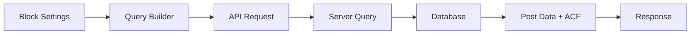
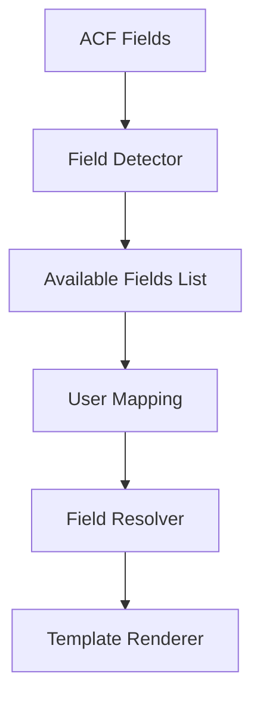
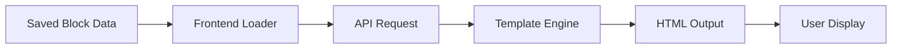

# CPT/ACF Loop Block 상세 개발 명세서

## 📋 목차
1. [프로젝트 개요](#프로젝트-개요)
2. [현재 상태 분석](#현재-상태-분석)
3. [기술 아키텍처](#기술-아키텍처)
4. [구현 계획](#구현-계획)
5. [API 설계](#api-설계)
6. [UI/UX 설계](#uiux-설계)
7. [데이터 흐름](#데이터-흐름)
8. [개발 일정](#개발-일정)

## 프로젝트 개요

### 목표
WordPress의 Query Loop 블록과 유사한 기능을 구현하되, Custom Post Types(CPT)와 Advanced Custom Fields(ACF)를 완벽하게 지원하는 블록 개발

### 핵심 기능
- 모든 CPT 타입 지원
- ACF 필드 동적 매핑
- 다양한 디스플레이 템플릿
- 실시간 프리뷰
- 고급 필터링 및 정렬
- 페이지네이션

## 현재 상태 분석

### ✅ 이미 구현된 기능

#### 1. Custom Post Types (CPT)
```typescript
// 구현 위치: /apps/api-server/src/routes/cpt.routes.ts
- GET /api/v1/cpt/types - CPT 목록 조회
- GET /api/v1/cpt/:slug/posts - CPT별 포스트 조회
- GET /api/v1/cpt/:slug/fields - CPT별 ACF 필드 조회
- POST/PUT/DELETE - CRUD 작업
```

#### 2. Advanced Custom Fields (ACF)
```typescript
// 구현 위치: /apps/api-server/src/entities/CustomField.ts
지원 필드 타입:
- 기본: text, textarea, number, email, url, password
- 선택: select, checkbox, radio, toggle
- 날짜: date, datetime_local, time
- 미디어: image, file, gallery
- 에디터: wysiwyg, code
- 특수: color, range, repeater, group
- 관계: taxonomy, post_object, page_link, user
```

#### 3. Gutenberg Editor
```typescript
// 구현 위치: /apps/admin-dashboard/src/components/editor/GutenbergEditor.tsx
- 블록 삽입기
- 드래그 앤 드롭
- 블록 툴바
- Spectra 블록 지원
```

### ❌ 구현 필요 기능

1. **Query Loop 블록 자체**
2. **쿼리 빌더 UI**
3. **템플릿 시스템**
4. **프론트엔드 렌더링**
5. **페이지네이션 UI**

## 기술 아키텍처

### 컴포넌트 구조
```
CPTLoopBlock/
├── index.tsx                 # 블록 등록
├── block.json               # 블록 메타데이터
├── edit.tsx                 # 에디터 컴포넌트
├── save.tsx                 # 저장 함수
├── inspector.tsx            # 사이드바 설정
├── components/
│   ├── QueryBuilder.tsx     # 쿼리 설정 UI
│   ├── TemplateSelector.tsx # 템플릿 선택
│   ├── PostPreview.tsx      # 실시간 프리뷰
│   ├── FieldMapper.tsx      # ACF 필드 매핑
│   └── PaginationControls.tsx
├── templates/
│   ├── default/
│   ├── grid/
│   ├── list/
│   └── card/
├── hooks/
│   ├── usePostQuery.ts
│   ├── useACFFields.ts
│   └── usePagination.ts
└── utils/
    ├── queryBuilder.ts
    └── fieldResolver.ts
```

### 데이터 모델
```typescript
interface CPTLoopBlockData {
  // 쿼리 설정
  query: {
    postType: string
    postsPerPage: number
    orderBy: string
    order: 'asc' | 'desc'
    offset: number
    // 필터
    filters: {
      categories?: string[]
      tags?: string[]
      customTaxonomies?: Record<string, string[]>
      metaQuery?: MetaQuery[]
      dateQuery?: DateQuery[]
    }
  }
  
  // 디스플레이 설정
  display: {
    template: 'default' | 'grid' | 'list' | 'card' | 'custom'
    columns?: number
    gap?: string
    imageSize?: string
    excerptLength?: number
  }
  
  // 필드 매핑
  fieldMapping: {
    title: FieldMapping
    excerpt: FieldMapping
    image: FieldMapping
    date: FieldMapping
    author: FieldMapping
    customFields: Record<string, FieldMapping>
  }
  
  // 페이지네이션
  pagination: {
    enabled: boolean
    type: 'numbers' | 'prev_next' | 'infinite'
    perPage?: number
    showTotal?: boolean
  }
  
  // 고급 설정
  advanced: {
    noResultsMessage?: string
    loadingMessage?: string
    errorMessage?: string
    cacheTime?: number
  }
}

interface FieldMapping {
  source: 'post' | 'meta' | 'acf' | 'taxonomy'
  field: string
  fallback?: string
  format?: string // 날짜, 숫자 등의 포맷
}
```

## 구현 계획

### Phase 1: 기본 구조 (Week 1)
1. **블록 등록 및 기본 설정**
   - block.json 정의
   - 블록 등록 로직
   - 기본 attribute 설정

2. **쿼리 빌더 UI**
   ```typescript
   // QueryBuilder 컴포넌트
   - Post Type 선택 (동적 로딩)
   - 정렬 옵션 (날짜, 제목, 수정일 등)
   - 포스트 개수 설정
   - 오프셋 설정
   ```

3. **기본 프리뷰**
   ```typescript
   // usePostQuery 훅
   const { posts, loading, error } = usePostQuery({
     postType: attributes.postType,
     perPage: attributes.postsPerPage,
     orderBy: attributes.orderBy,
     order: attributes.order
   })
   ```

### Phase 2: ACF 통합 (Week 2)
1. **필드 감지 시스템**
   ```typescript
   // ACF 필드 자동 감지
   const { fields } = useACFFields(postType)
   
   // 필드 타입별 렌더러
   const renderField = (field: ACFField, value: any) => {
     switch(field.type) {
       case 'image': return <ImageField {...} />
       case 'repeater': return <RepeaterField {...} />
       // ...
     }
   }
   ```

2. **필드 매핑 인터페이스**
   ```typescript
   // FieldMapper 컴포넌트
   <FieldMapper
     availableFields={acfFields}
     mapping={attributes.fieldMapping}
     onChange={updateFieldMapping}
   />
   ```

3. **조건부 로직**
   ```typescript
   // 필드 값에 따른 조건부 표시
   if (evaluateCondition(field.conditionalLogic, postData)) {
     return renderField(field, value)
   }
   ```

### Phase 3: 템플릿 시스템 (Week 3)
1. **빌트인 템플릿**
   ```typescript
   // 템플릿 레지스트리
   const templates = {
     default: DefaultTemplate,
     grid: GridTemplate,
     list: ListTemplate,
     card: CardTemplate
   }
   
   // 템플릿 인터페이스
   interface Template {
     render(posts: Post[], settings: TemplateSettings): JSX.Element
     preview(): JSX.Element
     settings: TemplateSettingSchema[]
   }
   ```

2. **반응형 설정**
   ```typescript
   // 반응형 컬럼 설정
   <ResponsiveControl
     desktop={attributes.columns}
     tablet={attributes.columnsTablet}
     mobile={attributes.columnsMobile}
     onChange={updateColumns}
   />
   ```

3. **커스텀 CSS**
   ```typescript
   // 커스텀 스타일 적용
   const blockStyles = {
     '--gap': attributes.gap,
     '--columns': attributes.columns,
     '--text-color': attributes.textColor
   }
   ```

### Phase 4: 고급 기능 (Week 4)
1. **프론트엔드 필터링**
   ```typescript
   // FilterBar 컴포넌트
   <FilterBar
     filters={availableFilters}
     activeFilters={activeFilters}
     onChange={handleFilterChange}
   />
   ```

2. **무한 스크롤**
   ```typescript
   // useInfiniteScroll 훅
   const { posts, loadMore, hasMore } = useInfiniteScroll({
     query: attributes.query,
     pageSize: attributes.postsPerPage
   })
   ```

3. **성능 최적화**
   ```typescript
   // 쿼리 캐싱
   const queryCache = new Map()
   
   // 이미지 최적화
   <LazyImage
     src={image.url}
     sizes={getSizes(attributes.columns)}
     loading="lazy"
   />
   ```

## API 설계

### 새로 필요한 엔드포인트

#### 1. 복합 쿼리 API
```typescript
POST /api/v1/blocks/cpt-loop/query
Request:
{
  postType: string
  query: QueryParams
  fields: string[] // 필요한 필드만 선택
  page?: number
  perPage?: number
}

Response:
{
  posts: Post[]
  total: number
  pages: number
  hasMore: boolean
}
```

#### 2. 템플릿 API
```typescript
GET /api/v1/blocks/cpt-loop/templates
Response:
{
  templates: Template[]
  default: string
}

GET /api/v1/blocks/cpt-loop/templates/:id
Response: Template
```

#### 3. 프리뷰 API
```typescript
POST /api/v1/blocks/cpt-loop/preview
Request: CPTLoopBlockData
Response: {
  html: string
  css?: string
  posts: Post[]
}
```

## UI/UX 설계

### Inspector 패널 구조
```
┌─ CPT Loop Settings ─────────────┐
│ ┌─ Query ─────────────────────┐ │
│ │ Post Type: [Products    ▼] │ │
│ │ Posts/Page: [12        ] │ │
│ │ Order By: [Date       ▼] │ │
│ │ Order: [● DESC ○ ASC    ] │ │
│ └─────────────────────────────┘ │
│                                  │
│ ┌─ Filters ───────────────────┐ │
│ │ Categories: [          ] │ │
│ │ Tags: [               ] │ │
│ │ [+ Add Meta Filter    ] │ │
│ └─────────────────────────────┘ │
│                                  │
│ ┌─ Display ───────────────────┐ │
│ │ Template: [Grid       ▼] │ │
│ │ Columns: [1 2 ③ 4 5 6  ] │ │
│ │ ☑ Show Featured Image    │ │
│ │ ☑ Show Excerpt          │ │
│ │ ☑ Show Author           │ │
│ │ ☑ Show Date             │ │
│ └─────────────────────────────┘ │
│                                  │
│ ┌─ Field Mapping ─────────────┐ │
│ │ Title: [post_title    ▼] │ │
│ │ Image: [_thumbnail_id ▼] │ │
│ │ Price: [price_field   ▼] │ │
│ │ [+ Map Custom Field   ] │ │
│ └─────────────────────────────┘ │
│                                  │
│ ┌─ Pagination ────────────────┐ │
│ │ ☑ Enable Pagination      │ │
│ │ Type: [Numbers       ▼] │ │
│ └─────────────────────────────┘ │
└──────────────────────────────────┘
```

### 에디터 뷰 상태
```
┌─ Loading State ─────────────────┐
│ ░░░░░░░░░░░ ░░░░░░░░░░░░░░░░░ │
│ ░░░░░░░░░░░ ░░░░░░░░░░░░░░░░░ │
│ ░░░░░░░░░░░ ░░░░░░░░░░░░░░░░░ │
└─────────────────────────────────┘

┌─ Empty State ───────────────────┐
│        No posts found           │
│   Adjust your query settings    │
│      to show posts here         │
└─────────────────────────────────┘

┌─ Error State ───────────────────┐
│      ⚠️ Error loading posts      │
│   Check your query settings     │
│        [Retry]                  │
└─────────────────────────────────┘
```

## 데이터 흐름

### 1. 블록 설정 → API 요청


### 2. 필드 매핑 흐름


### 3. 프론트엔드 렌더링


## 개발 일정

### Week 1: 기초 구현
- [ ] 블록 등록 시스템
- [ ] 기본 쿼리 빌더 UI
- [ ] API 연동
- [ ] 기본 프리뷰

### Week 2: ACF 통합
- [ ] 필드 감지 시스템
- [ ] 필드 매핑 UI
- [ ] 동적 필드 렌더링
- [ ] 조건부 로직

### Week 3: 템플릿 시스템
- [ ] 기본 템플릿 구현
- [ ] 템플릿 선택 UI
- [ ] 반응형 설정
- [ ] 스타일 커스터마이징

### Week 4: 고급 기능
- [ ] 프론트엔드 필터
- [ ] 페이지네이션
- [ ] 무한 스크롤
- [ ] 성능 최적화

### Week 5: 테스트 및 문서화
- [ ] 단위 테스트
- [ ] 통합 테스트
- [ ] 사용자 문서
- [ ] 개발자 문서

## 성공 지표

1. **기능적 완성도**
   - 모든 CPT 타입 지원 ✓
   - 모든 ACF 필드 타입 지원 ✓
   - 실시간 프리뷰 ✓
   - 프론트엔드 렌더링 ✓

2. **성능 목표**
   - 초기 로드: < 200ms
   - 쿼리 응답: < 300ms
   - 프론트엔드 렌더: < 100ms

3. **사용성**
   - 직관적인 UI
   - 풍부한 프리셋
   - 상세한 문서

4. **확장성**
   - 커스텀 템플릿 API
   - 필터/액션 훅
   - 써드파티 통합

## 참고 자료

- WordPress Query Loop Block: https://wordpress.org/support/article/query-loop-block/
- ACF Documentation: https://www.advancedcustomfields.com/resources/
- Gutenberg Block Development: https://developer.wordpress.org/block-editor/