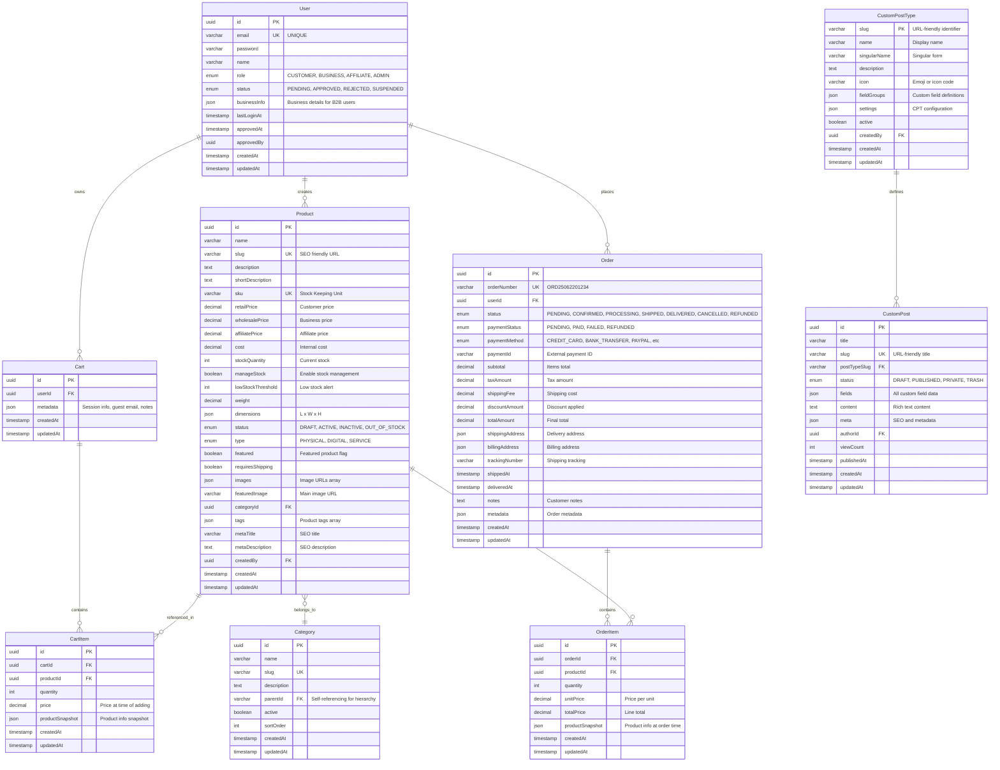
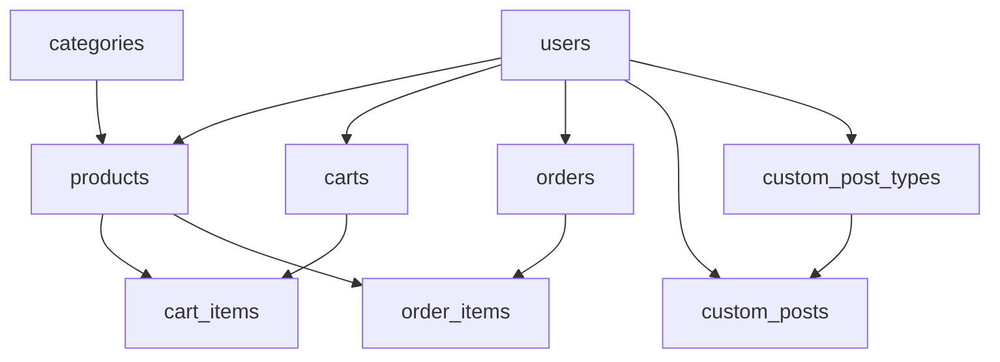

# 🗄️ O4O Platform - 데이터베이스 스키마

> **Phase 1 구현 완료** - 완전한 E-commerce 데이터 모델
> 
> **기준일**: 2025-06-22  
> **데이터베이스**: PostgreSQL 15+  
> **ORM**: TypeORM 0.3+

---

## 🎯 **개요**

O4O Platform의 데이터베이스는 **역할 기반 E-commerce 시스템**을 위해 설계된 관계형 데이터베이스입니다.

### **핵심 설계 원칙**
- **정규화**: 중복 최소화, 데이터 무결성 보장
- **확장성**: 미래 기능 확장 고려
- **성능**: 인덱스 최적화 및 쿼리 효율성
- **보안**: 민감한 데이터 보호

---

## 📊 **전체 ERD**



---

## 🏗️ **테이블 상세 스키마**

### **👤 Users 테이블**

```sql
CREATE TABLE users (
    id UUID PRIMARY KEY DEFAULT gen_random_uuid(),
    email VARCHAR(255) UNIQUE NOT NULL,
    password VARCHAR(255) NOT NULL,
    name VARCHAR(100) NOT NULL,
    role user_role DEFAULT 'customer',
    status user_status DEFAULT 'pending',
    business_info JSONB,
    last_login_at TIMESTAMP,
    approved_at TIMESTAMP,
    approved_by UUID,
    created_at TIMESTAMP DEFAULT NOW(),
    updated_at TIMESTAMP DEFAULT NOW()
);

-- Enums
CREATE TYPE user_role AS ENUM ('customer', 'business', 'affiliate', 'admin', 'manager');
CREATE TYPE user_status AS ENUM ('pending', 'approved', 'rejected', 'suspended');

-- Indexes
CREATE INDEX idx_users_email ON users(email);
CREATE INDEX idx_users_role ON users(role);
CREATE INDEX idx_users_status ON users(status);
```

#### **Business Info JSON 구조**

```typescript
{
  businessName: string;
  businessType: 'pharmacy' | 'health_store' | 'local_food' | 'retail_shop' | 'other';
  businessNumber?: string;
  address: string;
  phone: string;
}
```

### **🛍️ Products 테이블**

```sql
CREATE TABLE products (
    id UUID PRIMARY KEY DEFAULT gen_random_uuid(),
    name VARCHAR(255) NOT NULL,
    slug VARCHAR(255) UNIQUE NOT NULL,
    description TEXT,
    short_description TEXT,
    sku VARCHAR(100) UNIQUE NOT NULL,
    retail_price DECIMAL(10,2) NOT NULL,
    wholesale_price DECIMAL(10,2),
    affiliate_price DECIMAL(10,2),
    cost DECIMAL(10,2),
    stock_quantity INTEGER DEFAULT 0,
    manage_stock BOOLEAN DEFAULT false,
    low_stock_threshold INTEGER,
    weight DECIMAL(8,2),
    dimensions JSONB,
    status product_status DEFAULT 'draft',
    type product_type DEFAULT 'physical',
    featured BOOLEAN DEFAULT true,
    requires_shipping BOOLEAN DEFAULT false,
    images JSONB,
    featured_image VARCHAR(500),
    category_id UUID,
    tags JSONB,
    meta_title VARCHAR(255),
    meta_description TEXT,
    created_by UUID NOT NULL,
    created_at TIMESTAMP DEFAULT NOW(),
    updated_at TIMESTAMP DEFAULT NOW(),
    
    FOREIGN KEY (created_by) REFERENCES users(id),
    FOREIGN KEY (category_id) REFERENCES categories(id)
);

-- Enums
CREATE TYPE product_status AS ENUM ('draft', 'active', 'inactive', 'out_of_stock');
CREATE TYPE product_type AS ENUM ('physical', 'digital', 'service');

-- Indexes
CREATE INDEX idx_products_sku ON products(sku);
CREATE INDEX idx_products_status ON products(status);
CREATE INDEX idx_products_featured ON products(featured);
CREATE INDEX idx_products_category ON products(category_id);
CREATE INDEX idx_products_created_by ON products(created_by);
```

#### **Dimensions JSON 구조**

```typescript
{
  length: number;
  width: number;
  height: number;
}
```

### **📂 Categories 테이블**

```sql
CREATE TABLE categories (
    id UUID PRIMARY KEY DEFAULT gen_random_uuid(),
    name VARCHAR(100) NOT NULL,
    slug VARCHAR(100) UNIQUE NOT NULL,
    description TEXT,
    parent_id UUID,
    active BOOLEAN DEFAULT true,
    sort_order INTEGER DEFAULT 0,
    created_at TIMESTAMP DEFAULT NOW(),
    updated_at TIMESTAMP DEFAULT NOW(),
    
    FOREIGN KEY (parent_id) REFERENCES categories(id)
);

-- Indexes
CREATE INDEX idx_categories_slug ON categories(slug);
CREATE INDEX idx_categories_parent ON categories(parent_id);
CREATE INDEX idx_categories_active ON categories(active);
```

### **🛒 Carts 테이블**

```sql
CREATE TABLE carts (
    id UUID PRIMARY KEY DEFAULT gen_random_uuid(),
    user_id UUID NOT NULL,
    metadata JSONB,
    created_at TIMESTAMP DEFAULT NOW(),
    updated_at TIMESTAMP DEFAULT NOW(),
    
    FOREIGN KEY (user_id) REFERENCES users(id) ON DELETE CASCADE
);

-- Indexes
CREATE INDEX idx_carts_user_id ON carts(user_id);
```

#### **Metadata JSON 구조**

```typescript
{
  sessionId?: string;
  guestEmail?: string;
  notes?: string;
}
```

### **🛒 Cart Items 테이블**

```sql
CREATE TABLE cart_items (
    id UUID PRIMARY KEY DEFAULT gen_random_uuid(),
    cart_id UUID NOT NULL,
    product_id UUID NOT NULL,
    quantity INTEGER NOT NULL CHECK (quantity > 0),
    price DECIMAL(10,2) NOT NULL,
    product_snapshot JSONB NOT NULL,
    created_at TIMESTAMP DEFAULT NOW(),
    updated_at TIMESTAMP DEFAULT NOW(),
    
    FOREIGN KEY (cart_id) REFERENCES carts(id) ON DELETE CASCADE,
    FOREIGN KEY (product_id) REFERENCES products(id),
    UNIQUE(cart_id, product_id)
);

-- Indexes
CREATE INDEX idx_cart_items_cart_id ON cart_items(cart_id);
CREATE INDEX idx_cart_items_product_id ON cart_items(product_id);
```

#### **Product Snapshot JSON 구조**

```typescript
{
  name: string;
  image: string;
  sku: string;
}
```

### **📦 Orders 테이블**

```sql
CREATE TABLE orders (
    id UUID PRIMARY KEY DEFAULT gen_random_uuid(),
    order_number VARCHAR(50) UNIQUE NOT NULL,
    user_id UUID NOT NULL,
    status order_status DEFAULT 'pending',
    payment_status payment_status DEFAULT 'pending',
    payment_method payment_method,
    payment_id VARCHAR(255),
    subtotal DECIMAL(10,2) NOT NULL,
    tax_amount DECIMAL(10,2) DEFAULT 0,
    shipping_fee DECIMAL(10,2) DEFAULT 0,
    discount_amount DECIMAL(10,2) DEFAULT 0,
    total_amount DECIMAL(10,2) NOT NULL,
    shipping_address JSONB NOT NULL,
    billing_address JSONB,
    tracking_number VARCHAR(255),
    shipped_at TIMESTAMP,
    delivered_at TIMESTAMP,
    notes TEXT,
    metadata JSONB,
    created_at TIMESTAMP DEFAULT NOW(),
    updated_at TIMESTAMP DEFAULT NOW(),
    
    FOREIGN KEY (user_id) REFERENCES users(id)
);

-- Enums
CREATE TYPE order_status AS ENUM ('pending', 'confirmed', 'processing', 'shipped', 'delivered', 'cancelled', 'refunded');
CREATE TYPE payment_status AS ENUM ('pending', 'paid', 'failed', 'refunded');
CREATE TYPE payment_method AS ENUM ('credit_card', 'bank_transfer', 'paypal', 'kakao_pay', 'naver_pay', 'cash_on_delivery');

-- Indexes
CREATE INDEX idx_orders_order_number ON orders(order_number);
CREATE INDEX idx_orders_user_id ON orders(user_id);
CREATE INDEX idx_orders_status ON orders(status);
CREATE INDEX idx_orders_payment_status ON orders(payment_status);
CREATE INDEX idx_orders_created_at ON orders(created_at);
```

#### **Address JSON 구조**

```typescript
{
  name: string;
  phone: string;
  address: string;
  addressDetail: string;
  zipCode: string;
  city: string;
  state: string;
  country: string;
}
```

### **📦 Order Items 테이블**

```sql
CREATE TABLE order_items (
    id UUID PRIMARY KEY DEFAULT gen_random_uuid(),
    order_id UUID NOT NULL,
    product_id UUID NOT NULL,
    quantity INTEGER NOT NULL CHECK (quantity > 0),
    unit_price DECIMAL(10,2) NOT NULL,
    total_price DECIMAL(10,2) NOT NULL,
    product_snapshot JSONB NOT NULL,
    created_at TIMESTAMP DEFAULT NOW(),
    updated_at TIMESTAMP DEFAULT NOW(),
    
    FOREIGN KEY (order_id) REFERENCES orders(id) ON DELETE CASCADE,
    FOREIGN KEY (product_id) REFERENCES products(id)
);

-- Indexes
CREATE INDEX idx_order_items_order_id ON order_items(order_id);
CREATE INDEX idx_order_items_product_id ON order_items(product_id);
```

#### **Product Snapshot JSON 구조**

```typescript
{
  name: string;
  sku: string;
  image: string;
  description: string;
}
```

---

## 🎨 **CMS 시스템 테이블**

### **📝 Custom Post Types 테이블**

```sql
CREATE TABLE custom_post_types (
    slug VARCHAR(50) PRIMARY KEY,
    name VARCHAR(100) NOT NULL,
    singular_name VARCHAR(100) NOT NULL,
    description TEXT,
    icon VARCHAR(50) DEFAULT '📄',
    field_groups JSONB NOT NULL,
    settings JSONB DEFAULT '{}',
    active BOOLEAN DEFAULT true,
    created_by UUID,
    created_at TIMESTAMP DEFAULT NOW(),
    updated_at TIMESTAMP DEFAULT NOW(),
    
    FOREIGN KEY (created_by) REFERENCES users(id)
);

-- Indexes
CREATE INDEX idx_cpt_active ON custom_post_types(active);
CREATE INDEX idx_cpt_created_by ON custom_post_types(created_by);
```

### **📄 Custom Posts 테이블**

```sql
CREATE TABLE custom_posts (
    id UUID PRIMARY KEY DEFAULT gen_random_uuid(),
    title VARCHAR(200) NOT NULL,
    slug VARCHAR(200) UNIQUE NOT NULL,
    post_type_slug VARCHAR(50) NOT NULL,
    status post_status DEFAULT 'draft',
    fields JSONB DEFAULT '{}',
    content TEXT,
    meta JSONB,
    author_id UUID,
    view_count INTEGER DEFAULT 0,
    published_at TIMESTAMP,
    created_at TIMESTAMP DEFAULT NOW(),
    updated_at TIMESTAMP DEFAULT NOW(),
    
    FOREIGN KEY (post_type_slug) REFERENCES custom_post_types(slug),
    FOREIGN KEY (author_id) REFERENCES users(id)
);

-- Enums
CREATE TYPE post_status AS ENUM ('draft', 'published', 'private', 'trash');

-- Indexes
CREATE INDEX idx_custom_posts_post_type_status ON custom_posts(post_type_slug, status);
CREATE INDEX idx_custom_posts_slug ON custom_posts(slug);
CREATE INDEX idx_custom_posts_author ON custom_posts(author_id);
CREATE INDEX idx_custom_posts_published_at ON custom_posts(published_at);
```

---

## 🔧 **인덱스 전략**

### **성능 최적화 인덱스**

```sql
-- User 관련 복합 인덱스
CREATE INDEX idx_users_role_status ON users(role, status);

-- Product 검색 최적화
CREATE INDEX idx_products_status_featured ON products(status, featured);
CREATE INDEX idx_products_category_status ON products(category_id, status);

-- Cart 및 Order 성능 최적화
CREATE INDEX idx_cart_items_cart_product ON cart_items(cart_id, product_id);
CREATE INDEX idx_order_items_order_product ON order_items(order_id, product_id);

-- 텍스트 검색 인덱스 (PostgreSQL Full-Text Search)
CREATE INDEX idx_products_search ON products USING GIN(to_tsvector('korean', name || ' ' || COALESCE(description, '')));
CREATE INDEX idx_custom_posts_search ON custom_posts USING GIN(to_tsvector('korean', title || ' ' || COALESCE(content, '')));
```

### **부분 인덱스 (조건부 인덱스)**

```sql
-- 활성 상품만 인덱싱
CREATE INDEX idx_products_active_featured ON products(featured) WHERE status = 'active';

-- 공개된 게시물만 인덱싱
CREATE INDEX idx_custom_posts_published ON custom_posts(published_at) WHERE status = 'published';
```

---

## 🛡️ **제약 조건 및 트리거**

### **체크 제약 조건**

```sql
-- 가격 관련 제약
ALTER TABLE products ADD CONSTRAINT chk_prices_positive 
    CHECK (retail_price > 0 AND (wholesale_price IS NULL OR wholesale_price > 0));

-- 재고 관련 제약
ALTER TABLE products ADD CONSTRAINT chk_stock_non_negative 
    CHECK (stock_quantity >= 0);

-- 주문 금액 제약
ALTER TABLE orders ADD CONSTRAINT chk_amounts_non_negative 
    CHECK (subtotal >= 0 AND total_amount >= 0);
```

### **자동 업데이트 트리거**

```sql
-- updated_at 자동 업데이트 함수
CREATE OR REPLACE FUNCTION update_updated_at_column()
RETURNS TRIGGER AS $$
BEGIN
    NEW.updated_at = NOW();
    RETURN NEW;
END;
$$ language plpgsql;

-- 모든 테이블에 트리거 적용
CREATE TRIGGER update_users_updated_at BEFORE UPDATE ON users 
    FOR EACH ROW EXECUTE PROCEDURE update_updated_at_column();

CREATE TRIGGER update_products_updated_at BEFORE UPDATE ON products 
    FOR EACH ROW EXECUTE PROCEDURE update_updated_at_column();

-- ... (다른 테이블들도 동일)
```

---

## 📊 **데이터 통계 및 관리**

### **테이블 크기 예상**

| 테이블 | 예상 레코드 수 | 예상 크기 |
|--------|----------------|-----------|
| **users** | 10,000 | 10MB |
| **products** | 50,000 | 100MB |
| **categories** | 1,000 | 1MB |
| **orders** | 100,000 | 200MB |
| **order_items** | 500,000 | 150MB |
| **custom_posts** | 10,000 | 50MB |

### **정기 유지보수 작업**

```sql
-- 통계 정보 업데이트
ANALYZE;

-- 인덱스 재구성
REINDEX DATABASE o4o_platform;

-- 오래된 장바구니 정리 (30일 이상)
DELETE FROM carts WHERE updated_at < NOW() - INTERVAL '30 days';
```

---

## 🔗 **외래 키 관계도**



---

## 📚 **마이그레이션 스크립트**

### **초기 데이터베이스 생성**

```sql
-- 데이터베이스 생성
CREATE DATABASE o4o_platform;
CREATE USER o4o_user WITH PASSWORD 'secure_password';
GRANT ALL PRIVILEGES ON DATABASE o4o_platform TO o4o_user;

-- 확장 기능 활성화
CREATE EXTENSION IF NOT EXISTS "uuid-ossp";
CREATE EXTENSION IF NOT EXISTS "pg_trgm"; -- 텍스트 검색 향상
```

### **TypeORM 마이그레이션 명령어**

```bash
# 마이그레이션 생성
npm run typeorm:migration:generate -- -n InitialSchema

# 마이그레이션 실행
npm run typeorm:migration:run

# 마이그레이션 되돌리기
npm run typeorm:migration:revert
```

---

## 🎯 **다음 단계**

### **Phase 2 확장 계획**

1. **결제 시스템 테이블**
   - `payments`
   - `payment_methods`
   - `refunds`

2. **리뷰 시스템 테이블**
   - `product_reviews`
   - `review_images`

3. **쿠폰 시스템 테이블**
   - `coupons`
   - `coupon_usages`

4. **알림 시스템 테이블**
   - `notifications`
   - `notification_preferences`

---

**📅 최종 업데이트**: 2025-06-22  
**🏆 구현 상태**: Phase 1 완료 (100%)  
**🔗 관련 문서**: [API 명세서](ecommerce-api-specification.md), [개발 가이드](../development-guide/)
