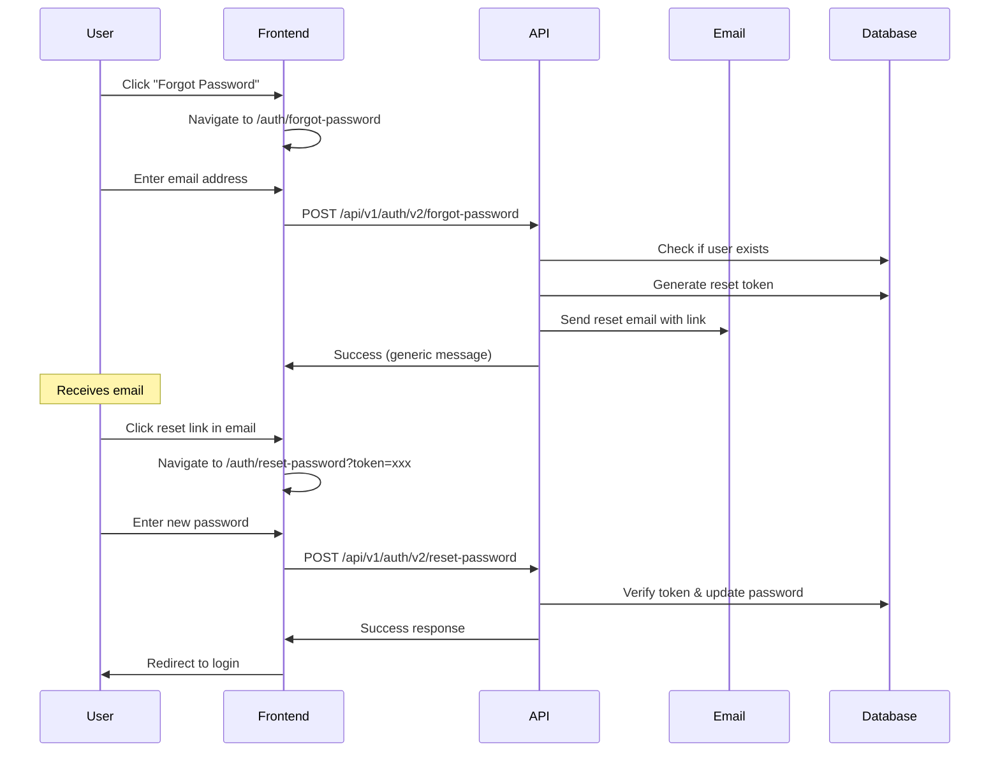

# Password Reset Implementation Guide

## Overview

This document describes the password reset functionality implementation for O4O Platform, including secure token-based reset flow.

## User Flow



## Components

### 1. ForgotPassword.tsx
- Email input form
- Success state with email confirmation
- Error handling for rate limiting
- Navigation back to login

### 2. ResetPassword.tsx
- New password form with confirmation
- Password strength requirements display
- Token validation
- Auto-redirect on success
- Error states (expired, invalid, used tokens)

## Security Features

### Token Security
- Cryptographically secure random tokens
- Limited validity period (24 hours)
- Single-use tokens
- Token stored hashed in database

### Password Requirements
- Minimum 8 characters
- At least 1 uppercase letter
- At least 1 lowercase letter
- At least 1 number
- At least 1 special character (@$!%*?&)

### Rate Limiting
- Prevents brute force attacks
- Limits password reset requests
- Returns 429 status on too many requests

### Email Enumeration Prevention
- Always returns success message
- Doesn't reveal if email exists
- Same response time for all requests

## API Endpoints

### Request Password Reset
```
POST /api/v1/auth/v2/forgot-password
Body: { email: string }
Response: {
  success: boolean,
  message: string
}
```

### Reset Password
```
POST /api/v1/auth/v2/reset-password
Body: {
  token: string,
  password: string
}
Response: {
  success: boolean,
  message: string
}
```

## UI/UX Features

### ForgotPassword Page
- Clean card-based design
- Clear instructions
- Loading states
- Success confirmation
- Email tips (check spam, wait time)

### ResetPassword Page
- Password visibility toggle
- Real-time password matching
- Clear error messages
- Password requirements display
- Auto-redirect countdown

## Error Handling

### Error Types
1. **Invalid Token**: Malformed or non-existent token
2. **Expired Token**: Token past 24-hour validity
3. **Used Token**: Token already consumed
4. **Server Error**: Generic server-side errors

### User-Friendly Messages
- 토큰 만료: "비밀번호 재설정 링크가 만료되었습니다"
- 잘못된 토큰: "유효하지 않은 비밀번호 재설정 링크입니다"
- 이미 사용됨: "이미 사용된 비밀번호 재설정 링크입니다"
- 서버 오류: "비밀번호 재설정 중 오류가 발생했습니다"

## Email Template

The reset email should include:
- Clear subject: "O4O Platform 비밀번호 재설정"
- User's name or email
- Reset link with token
- Expiration notice (24 hours)
- Security notice if not requested
- Support contact

Example:
```
안녕하세요 [사용자명]님,

O4O Platform 비밀번호 재설정을 요청하셨습니다.

아래 링크를 클릭하여 새 비밀번호를 설정하세요:
[https://platform.o4o.com/auth/reset-password?token=xxx]

이 링크는 24시간 후 만료됩니다.

만약 비밀번호 재설정을 요청하지 않으셨다면, 
이 이메일을 무시하셔도 됩니다.

문의사항이 있으시면 support@o4o.com으로 연락주세요.

감사합니다.
O4O Platform 팀
```

## Testing Checklist

- [ ] Request password reset with valid email
- [ ] Request password reset with invalid email
- [ ] Click reset link and change password
- [ ] Try expired token (after 24 hours)
- [ ] Try using same token twice
- [ ] Verify password requirements enforcement
- [ ] Test rate limiting
- [ ] Check email delivery
- [ ] Verify auto-redirect after success
- [ ] Test error states UI

## Future Enhancements

1. **Multi-factor Reset**
   - Additional verification via SMS
   - Security questions

2. **Password History**
   - Prevent reusing recent passwords
   - Configurable history length

3. **Account Recovery**
   - Alternative email/phone
   - Account recovery options

4. **Audit Trail**
   - Log all reset attempts
   - Alert on suspicious activity

5. **Customizable Expiry**
   - Admin-configurable token lifetime
   - Urgent reset options