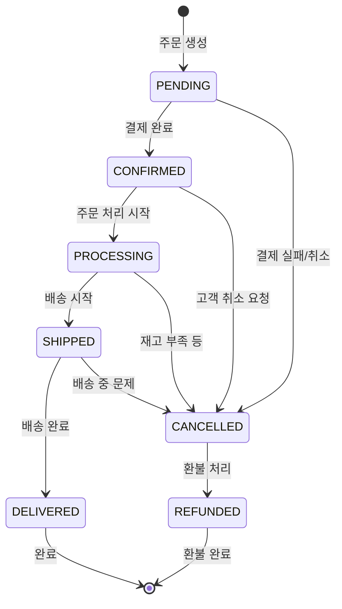

# 🛒 주문 처리 워크플로우

> **O4O Platform의 완전한 주문 생명주기 관리 가이드**
> 
> **기준일**: 2025-06-25  
> **상태**: Phase 1 구현 완료 - 트랜잭션 보장

---

## 🎯 **주문 처리 개요**

### **핵심 특징**
- **원자적 처리**: 모든 주문 단계가 트랜잭션으로 보장
- **상태 추적**: 실시간 주문 상태 업데이트
- **재고 연동**: 주문과 재고 시스템 완전 통합
- **역할별 처리**: 사용자 역할에 따른 차등 가격 자동 적용

### **주문 상태 정의**
```typescript
export enum OrderStatus {
  PENDING = 'pending',           // 주문 생성 (결제 대기)
  CONFIRMED = 'confirmed',       // 결제 완료
  PROCESSING = 'processing',     // 주문 처리 중
  SHIPPED = 'shipped',          // 배송 중
  DELIVERED = 'delivered',      // 배송 완료
  CANCELLED = 'cancelled',      // 주문 취소
  REFUNDED = 'refunded'         // 환불 완료
}
```

---

## 🗄️ **데이터 모델**

### **Order 엔티티**
```typescript
@Entity('orders')
export class Order {
  @PrimaryGeneratedColumn()
  id: number;

  @Column('uuid', { unique: true })
  orderNumber: string;

  @ManyToOne(() => User)
  user: User;

  @OneToMany(() => OrderItem, item => item.order, { cascade: true })
  items: OrderItem[];

  @Column({
    type: 'enum',
    enum: OrderStatus,
    default: OrderStatus.PENDING
  })
  status: OrderStatus;

  @Column('decimal', { precision: 10, scale: 2 })
  totalAmount: number;

  @Column('decimal', { precision: 10, scale: 2 })
  discountAmount: number;

  @Column('decimal', { precision: 10, scale: 2 })
  finalAmount: number;

  @Column('json', { nullable: true })
  shippingAddress: ShippingAddress;

  @Column('json', { nullable: true })
  billingAddress: BillingAddress;

  @Column({ nullable: true })
  paymentMethod: string;

  @Column({ nullable: true })
  paymentId: string;

  @Column('text', { nullable: true })
  notes: string;

  @CreateDateColumn()
  createdAt: Date;

  @UpdateDateColumn()
  updatedAt: Date;

  @Column('timestamp', { nullable: true })
  confirmedAt: Date;

  @Column('timestamp', { nullable: true })
  shippedAt: Date;

  @Column('timestamp', { nullable: true })
  deliveredAt: Date;
}
```

### **OrderItem 엔티티**
```typescript
@Entity('order_items')
export class OrderItem {
  @PrimaryGeneratedColumn()
  id: number;

  @ManyToOne(() => Order, order => order.items)
  order: Order;

  @ManyToOne(() => Product)
  product: Product;

  @Column('int')
  quantity: number;

  @Column('decimal', { precision: 10, scale: 2 })
  unitPrice: number; // 주문 시점의 가격 스냅샷

  @Column('decimal', { precision: 10, scale: 2 })
  totalPrice: number;

  @Column('json', { nullable: true })
  productSnapshot: ProductSnapshot; // 상품 정보 스냅샷
}
```

---

## ⚙️ **주문 처리 로직**

### **1단계: 주문 생성**
```typescript
@Service()
export class OrderService {
  async createOrder(userId: number, orderData: CreateOrderDto): Promise<Order> {
    return await this.dataSource.transaction(async manager => {
      // 1. 사용자 조회 및 권한 확인
      const user = await manager.findOne(User, { 
        where: { id: userId, status: UserStatus.APPROVED } 
      });
      
      if (!user) {
        throw new UnauthorizedException('승인된 사용자만 주문할 수 있습니다.');
      }

      // 2. 주문 번호 생성
      const orderNumber = await this.generateOrderNumber();

      // 3. 주문 생성
      const order = manager.create(Order, {
        orderNumber,
        user,
        status: OrderStatus.PENDING,
        shippingAddress: orderData.shippingAddress,
        billingAddress: orderData.billingAddress
      });

      // 4. 주문 항목 처리
      const orderItems = [];
      let totalAmount = 0;

      for (const itemData of orderData.items) {
        const orderItem = await this.processOrderItem(
          manager, order, itemData, user.role
        );
        orderItems.push(orderItem);
        totalAmount += orderItem.totalPrice;
      }

      // 5. 총액 계산 및 할인 적용
      const discountAmount = await this.calculateDiscount(user, totalAmount);
      order.totalAmount = totalAmount;
      order.discountAmount = discountAmount;
      order.finalAmount = totalAmount - discountAmount;
      order.items = orderItems;

      return await manager.save(order);
    });
  }

  private async processOrderItem(
    manager: EntityManager,
    order: Order,
    itemData: OrderItemDto,
    userRole: UserRole
  ): Promise<OrderItem> {
    // 1. 상품 조회
    const product = await manager.findOne(Product, {
      where: { id: itemData.productId },
      lock: { mode: 'pessimistic_write' }
    });

    if (!product) {
      throw new NotFoundException(`상품을 찾을 수 없습니다. ID: ${itemData.productId}`);
    }

    // 2. 재고 확인 및 예약
    const reserved = await this.inventoryService.reserveStock(
      product.id, itemData.quantity
    );

    if (!reserved) {
      throw new BadRequestException(
        `${product.name}의 재고가 부족합니다. (요청: ${itemData.quantity}개)`
      );
    }

    // 3. 역할별 가격 적용
    const unitPrice = this.pricingService.calculatePrice(product, userRole);

    // 4. 주문 항목 생성
    const orderItem = manager.create(OrderItem, {
      order,
      product,
      quantity: itemData.quantity,
      unitPrice,
      totalPrice: unitPrice * itemData.quantity,
      productSnapshot: {
        name: product.name,
        description: product.description,
        category: product.category,
        sku: product.sku
      }
    });

    return orderItem;
  }

  private async generateOrderNumber(): Promise<string> {
    const today = new Date();
    const dateStr = today.toISOString().slice(0, 10).replace(/-/g, '');
    const sequence = await this.getNextSequence(dateStr);
    return `O4O${dateStr}${sequence.toString().padStart(4, '0')}`;
  }
}
```

### **2단계: 결제 처리**
```typescript
async confirmOrder(orderId: number, paymentData: PaymentDto): Promise<Order> {
  return await this.dataSource.transaction(async manager => {
    // 1. 주문 조회
    const order = await manager.findOne(Order, {
      where: { id: orderId, status: OrderStatus.PENDING },
      relations: ['items', 'items.product', 'user'],
      lock: { mode: 'pessimistic_write' }
    });

    if (!order) {
      throw new NotFoundException('대기 중인 주문을 찾을 수 없습니다.');
    }

    try {
      // 2. 결제 처리
      const paymentResult = await this.paymentService.processPayment({
        amount: order.finalAmount,
        orderId: order.id,
        orderNumber: order.orderNumber,
        ...paymentData
      });

      // 3. 결제 성공 시 재고 확정
      for (const item of order.items) {
        await this.inventoryService.confirmStock(
          item.product.id, 
          item.quantity
        );
      }

      // 4. 주문 상태 업데이트
      order.status = OrderStatus.CONFIRMED;
      order.confirmedAt = new Date();
      order.paymentMethod = paymentData.method;
      order.paymentId = paymentResult.transactionId;

      await manager.save(order);

      // 5. 주문 확인 이벤트 발생
      await this.eventEmitter.emit('order.confirmed', order);

      return order;

    } catch (paymentError) {
      // 결제 실패 시 예약 재고 해제
      for (const item of order.items) {
        await this.inventoryService.releaseReservedStock(
          item.product.id, 
          item.quantity
        );
      }
      
      throw new PaymentFailedException(
        `결제 처리 중 오류가 발생했습니다: ${paymentError.message}`
      );
    }
  });
}
```

### **3단계: 주문 취소**
```typescript
async cancelOrder(orderId: number, reason: string): Promise<Order> {
  return await this.dataSource.transaction(async manager => {
    const order = await manager.findOne(Order, {
      where: { id: orderId },
      relations: ['items', 'items.product'],
      lock: { mode: 'pessimistic_write' }
    });

    if (!order) {
      throw new NotFoundException('주문을 찾을 수 없습니다.');
    }

    // 취소 가능한 상태 확인
    if (!this.isCancellable(order.status)) {
      throw new BadRequestException(
        `${order.status} 상태의 주문은 취소할 수 없습니다.`
      );
    }

    // 재고 복구
    for (const item of order.items) {
      if (order.status === OrderStatus.PENDING) {
        // 아직 미확정 주문인 경우 예약 재고 해제
        await this.inventoryService.releaseReservedStock(
          item.product.id, 
          item.quantity
        );
      } else {
        // 확정된 주문인 경우 실제 재고 복구
        await this.inventoryService.restoreStock(
          item.product.id, 
          item.quantity
        );
      }
    }

    // 결제된 주문인 경우 환불 처리
    if (order.status === OrderStatus.CONFIRMED && order.paymentId) {
      await this.paymentService.refund(order.paymentId, order.finalAmount);
      order.status = OrderStatus.REFUNDED;
    } else {
      order.status = OrderStatus.CANCELLED;
    }

    order.notes = (order.notes || '') + `\n취소 사유: ${reason}`;
    await manager.save(order);

    // 주문 취소 이벤트 발생
    await this.eventEmitter.emit('order.cancelled', { order, reason });

    return order;
  });
}

private isCancellable(status: OrderStatus): boolean {
  return [
    OrderStatus.PENDING,
    OrderStatus.CONFIRMED,
    OrderStatus.PROCESSING
  ].includes(status);
}
```

---

## 📊 **주문 상태 추적**

### **주문 상태 변경 워크플로우**


### **상태 변경 서비스**
```typescript
@Service()
export class OrderStatusService {
  async updateOrderStatus(
    orderId: number, 
    newStatus: OrderStatus, 
    metadata?: any
  ): Promise<Order> {
    return await this.dataSource.transaction(async manager => {
      const order = await manager.findOne(Order, { 
        where: { id: orderId },
        lock: { mode: 'pessimistic_write' }
      });

      if (!order) {
        throw new NotFoundException('주문을 찾을 수 없습니다.');
      }

      // 상태 변경 유효성 검사
      if (!this.isValidStatusTransition(order.status, newStatus)) {
        throw new BadRequestException(
          `${order.status}에서 ${newStatus}로 변경할 수 없습니다.`
        );
      }

      const oldStatus = order.status;
      order.status = newStatus;

      // 상태별 특별 처리
      switch (newStatus) {
        case OrderStatus.SHIPPED:
          order.shippedAt = new Date();
          if (metadata?.trackingNumber) {
            order.trackingNumber = metadata.trackingNumber;
          }
          break;
          
        case OrderStatus.DELIVERED:
          order.deliveredAt = new Date();
          break;
      }

      await manager.save(order);

      // 상태 변경 이벤트 발생
      await this.eventEmitter.emit('order.status.changed', {
        order,
        oldStatus,
        newStatus,
        metadata
      });

      return order;
    });
  }

  private isValidStatusTransition(from: OrderStatus, to: OrderStatus): boolean {
    const validTransitions = {
      [OrderStatus.PENDING]: [OrderStatus.CONFIRMED, OrderStatus.CANCELLED],
      [OrderStatus.CONFIRMED]: [OrderStatus.PROCESSING, OrderStatus.CANCELLED],
      [OrderStatus.PROCESSING]: [OrderStatus.SHIPPED, OrderStatus.CANCELLED],
      [OrderStatus.SHIPPED]: [OrderStatus.DELIVERED, OrderStatus.CANCELLED],
      [OrderStatus.CANCELLED]: [OrderStatus.REFUNDED],
      [OrderStatus.DELIVERED]: [], // 최종 상태
      [OrderStatus.REFUNDED]: []   // 최종 상태
    };

    return validTransitions[from]?.includes(to) || false;
  }
}
```

---

## 🔌 **주요 API 엔드포인트**

### **주문 생성**
```typescript
// POST /api/orders
@Post()
@UseGuards(JwtAuthGuard)
async createOrder(
  @CurrentUser() user: User,
  @Body() orderData: CreateOrderDto
) {
  return await this.orderService.createOrder(user.id, orderData);
}
```

### **주문 확정**
```typescript
// POST /api/orders/:id/confirm
@Post(':id/confirm')
@UseGuards(JwtAuthGuard)
async confirmOrder(
  @Param('id') orderId: number,
  @Body() paymentData: PaymentDto,
  @CurrentUser() user: User
) {
  // 주문 소유자 확인
  await this.orderService.verifyOrderOwnership(orderId, user.id);
  return await this.orderService.confirmOrder(orderId, paymentData);
}
```

### **주문 상태 업데이트 (관리자)**
```typescript
// PATCH /api/orders/:id/status
@Patch(':id/status')
@Roles(UserRole.ADMIN, UserRole.MANAGER)
async updateOrderStatus(
  @Param('id') orderId: number,
  @Body() statusData: UpdateStatusDto
) {
  return await this.orderStatusService.updateOrderStatus(
    orderId, 
    statusData.status, 
    statusData.metadata
  );
}
```

### **주문 조회**
```typescript
// GET /api/orders/:id
@Get(':id')
@UseGuards(JwtAuthGuard)
async getOrder(
  @Param('id') orderId: number,
  @CurrentUser() user: User
) {
  const order = await this.orderService.findOne(orderId, {
    relations: ['items', 'items.product', 'user']
  });

  // 권한 확인: 본인 주문이거나 관리자
  if (order.user.id !== user.id && !this.isAdmin(user.role)) {
    throw new ForbiddenException('접근 권한이 없습니다.');
  }

  return order;
}

// GET /api/orders
@Get()
@UseGuards(JwtAuthGuard)
async getOrders(
  @CurrentUser() user: User,
  @Query() query: OrderQueryDto
) {
  // 일반 사용자는 본인 주문만, 관리자는 모든 주문 조회 가능
  const filters = this.isAdmin(user.role) 
    ? query 
    : { ...query, userId: user.id };

  return await this.orderService.findMany(filters);
}
```

---

## 🎯 **주문 처리 베스트 프랙티스**

### **트랜잭션 관리**
1. **원자성**: 주문 생성, 재고 변경, 결제는 하나의 트랜잭션
2. **일관성**: 모든 비즈니스 규칙 검증 후 처리
3. **격리성**: 동시 주문 시 재고 충돌 방지
4. **지속성**: 성공한 주문은 반드시 저장

### **에러 처리 전략**
```typescript
// 재고 부족 시 상세한 에러 메시지
if (availableStock < requestedQuantity) {
  throw new InsufficientStockException(
    `${product.name}의 재고가 부족합니다. ` +
    `(요청: ${requestedQuantity}개, 가용: ${availableStock}개)`
  );
}

// 결제 실패 시 자동 복구
catch (PaymentError) {
  await this.rollbackStockReservation(orderItems);
  throw new PaymentFailedException('결제 처리 실패');
}
```

### **성능 최적화**
- **재고 락**: 필요한 상품에만 pessimistic lock 적용
- **배치 처리**: 대량 주문 시 배치 단위로 처리
- **캐싱**: 상품 정보, 가격 정보 캐싱
- **비동기 처리**: 알림, 로깅 등은 비동기로 처리

---

## 🔗 **관련 문서**

- [재고 관리 시스템](inventory-management.md)
- [가격 시스템](pricing-system.md)
- [E-commerce API 명세서](../03-api-reference/ecommerce-api-specification.md)

---

<div align="center">

**🛒 완전한 주문 처리로 신뢰할 수 있는 커머스! 🛒**

[📦 재고 관리](inventory-management.md) • [💰 가격 시스템](pricing-system.md) • [📊 현재 상황](../CURRENT-STATUS.md)

</div>
