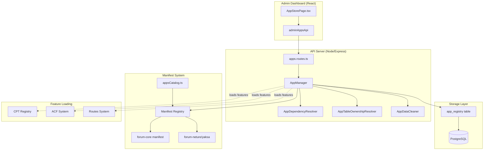
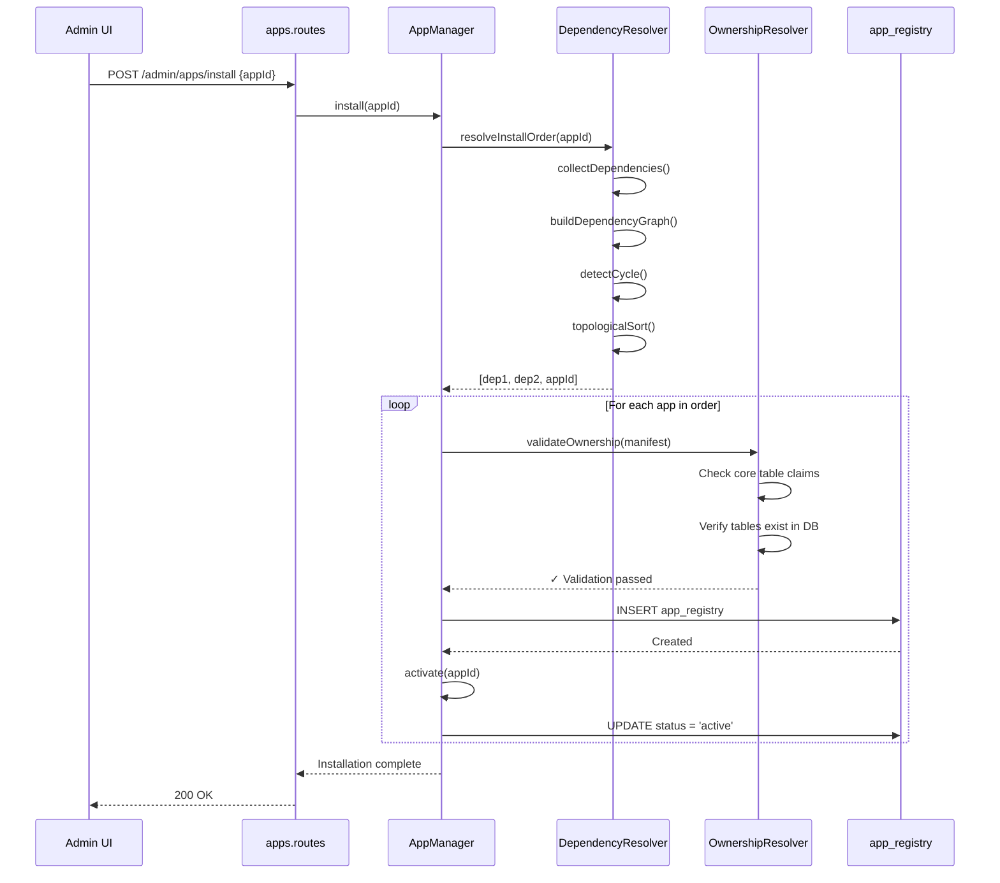
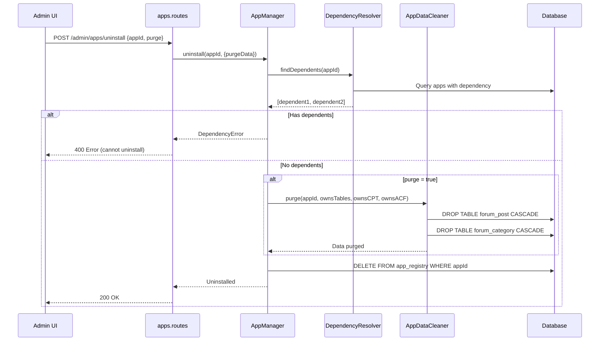

# O4O Platform App Store - Architecture Summary

**Version:** 1.1.0
**Date:** 2025-11-30
**Branch:** develop (HEAD: 77059d64a - Task A-4)
**Audit Type:** Comprehensive Architecture Review (Updated Post-Task A-4)

---

## 1. System Overview

The O4O Platform App Store is a **feature-level application management system** that enables dynamic installation, activation, and lifecycle management of modular applications. It supports a **Core/Extension pattern** allowing base applications to be extended with vertical-specific customizations.

### Key Characteristics

- **Granularity**: Feature-level apps (e.g., forum, digital signage, dropshipping)
- **Pattern**: Core/Extension architecture with dependency management
- **Storage**: PostgreSQL-backed registry (`app_registry` table)
- **Manifest-based**: Declarative configuration with ownership claims
- **Lifecycle Management**: Install → Activate → Deactivate → Uninstall → Purge

---

## 2. High-Level Architecture Diagram



---

## 3. Installation Flow



---

## 4. Uninstallation Flow



---

## 5. Core Components

### 5.1 Frontend Layer

| Component | Location | Purpose |
|-----------|----------|---------|
| **AppStorePage** | `apps/admin-dashboard/src/pages/apps/AppStorePage.tsx` | Main UI with Market/Installed tabs |
| **adminAppsApi** | `apps/admin-dashboard/src/api/admin-apps.ts` | API client wrapper |

### 5.2 Backend Layer

| Component | Location | Purpose |
|-----------|----------|---------|
| **apps.routes** | `apps/api-server/src/routes/admin/apps.routes.ts` | REST API endpoints |
| **AppManager** | `apps/api-server/src/services/AppManager.ts` | Core orchestration service |
| **AppDependencyResolver** | `apps/api-server/src/services/AppDependencyResolver.ts` | Dependency graph management |
| **AppTableOwnershipResolver** | `apps/api-server/src/services/AppTableOwnershipResolver.ts` | Ownership validation |
| **AppDataCleaner** | `apps/api-server/src/services/AppDataCleaner.ts` | Data purge operations |
| **PermissionService** | `apps/api-server/src/services/PermissionService.ts` | ✨ **NEW (Task A-4)**: App permission management |
| **ACFRegistry** | `apps/api-server/src/services/ACFRegistry.ts` | ✨ **NEW (Task A-4)**: ACF field group registry |

### 5.3 Data Layer

| Entity | Location | Purpose |
|--------|----------|---------|
| **AppRegistry** | `apps/api-server/src/entities/AppRegistry.ts` | Database entity for installed apps |
| **app_registry table** | PostgreSQL | Stores app installation state |

### 5.4 Manifest System

| Component | Location | Purpose |
|-----------|----------|---------|
| **appsCatalog** | `apps/api-server/src/app-manifests/appsCatalog.ts` | Available apps catalog |
| **Manifest Registry** | `apps/api-server/src/app-manifests/index.ts` | Manifest loader/registry |
| **AppManifest type** | `packages/types/src/app-manifest.ts` | TypeScript schema |

---

## 6. Data Flow: Install Operation

```
┌─────────────────────────────────────────────────────────────────┐
│ 1. User clicks "Install" on App Card                            │
│    → adminAppsApi.installApp('forum-neture')                    │
└────────────────────────┬────────────────────────────────────────┘
                         ▼
┌─────────────────────────────────────────────────────────────────┐
│ 2. API Route Handler                                            │
│    POST /api/admin/apps/install                                 │
│    → Extract appId from body                                    │
│    → Call AppManager.install(appId)                             │
└────────────────────────┬────────────────────────────────────────┘
                         ▼
┌─────────────────────────────────────────────────────────────────┐
│ 3. Dependency Resolution                                        │
│    → AppDependencyResolver.resolveInstallOrder('forum-neture')  │
│    → Reads manifest.dependencies: { 'forum-core': '>=1.0.0' }  │
│    → Builds graph: forum-neture → forum-core                    │
│    → Topological sort: ['forum-core', 'forum-neture']           │
└────────────────────────┬────────────────────────────────────────┘
                         ▼
┌─────────────────────────────────────────────────────────────────┐
│ 4. Install Loop (for each app)                                  │
│    For 'forum-core':                                            │
│      → Load manifest from packages/forum-app/src/manifest.ts    │
│      → Validate ownership (ownsTables, ownsCPT, ownsACF)        │
│      → Check tables exist in DB                                 │
│      → Insert into app_registry (status='installed')            │
│      → Activate (status='active')                               │
│                                                                 │
│    For 'forum-neture':                                          │
│      → Load manifest from packages/forum-neture/src/manifest.ts │
│      → Validate (extension cannot own core tables)              │
│      → Insert into app_registry                                 │
│      → Activate                                                 │
└────────────────────────┬────────────────────────────────────────┘
                         ▼
┌─────────────────────────────────────────────────────────────────┐
│ 5. Feature Loading (happens at server bootstrap)               │
│    → CPT Registry loads forum_post, forum_category, etc.        │
│    → ACF fields registered for extensions                       │
│    → Routes registered from manifest.routes                     │
└─────────────────────────────────────────────────────────────────┘
```

---

## 7. Ownership Model

### 7.1 Core Registry System

**File**: `apps/api-server/src/constants/coreTables.ts`

```typescript
export const CORE_TABLES_REGISTRY = {
  'forum-core': [
    'forum_post',
    'forum_category',
    'forum_comment',
    'forum_tag',
    'forum_like',
    'forum_bookmark',
  ]
};

export const CORE_CPT_REGISTRY = {
  'forum-core': [
    'forum_post',
    'forum_category',
    'forum_comment',
    'forum_tag',
  ]
};
```

### 7.2 Validation Rules

| Rule | Description |
|------|-------------|
| **Extension Cannot Own Core Tables** | `forum-neture` cannot claim `forum_post` |
| **Tables Must Exist** | Claimed tables must be present in PostgreSQL |
| **No Duplicate Ownership** | One table = one owner (future enhancement) |

---

## 8. Current State Assessment

### ✅ Working Features (Updated: Task A-4)

1. **App Catalog**: Static catalog in `appsCatalog.ts`
2. **Installation**: Dependency-aware installation flow
3. **Ownership Validation**: Prevents extension apps from claiming core tables
4. **Dependency Resolution**: Topological sort with cycle detection
5. **Activate/Deactivate**: Status management in registry
6. **Uninstall**: With optional data purge
7. **Update Detection**: Version comparison via semver
8. ✨ **Lifecycle Hooks**: Install/activate/deactivate/uninstall hooks executed (Task A-4)
9. ✨ **Permission Registration**: Auto-register permissions from manifests (Task A-4)
10. ✨ **ACF Registry**: In-memory ACF field group storage (Task A-4)
11. ✨ **CPT Registration**: CPTs registered to CPT Registry from manifests (Task A-4)

### ⚠️ Partial Implementation

1. **CPT Unregistration**: Logged but needs reference counting (shared CPTs)
2. **Route Registration**: Manifest declares routes but not integrated with Express router
3. **Menu Integration**: Manifest has menu structure but not dynamically loaded

### ❌ Not Implemented

1. **Remote Catalog**: Currently hardcoded, no download mechanism
2. **Migrations**: Declared in manifests but not executed
3. **Rollback**: No transaction support for failed installations
4. **Block/Shortcode Registration**: Not part of manifest system
5. **Admin UI ACF Rendering**: ACF schemas registered but not consumed by forms yet

---

## 9. Extension Pattern Example

### Core App: `forum-core`

```typescript
{
  appId: 'forum-core',
  type: 'core',
  ownsTables: ['forum_post', 'forum_category', ...],
  cpt: [{ name: 'forum_post', ... }],
  routes: ['/admin/forum', '/admin/forum/posts', ...],
}
```

### Extension App: `forum-neture`

```typescript
{
  appId: 'forum-neture',
  type: 'extension',
  dependencies: { 'forum-core': '>=1.0.0' },
  ownsTables: [], // Extensions don't own core tables
  extendsCPT: [{ name: 'forum_post', acfGroup: 'cosmetic_meta' }],
  acf: [{ groupId: 'cosmetic_meta', fields: [...] }],
  defaultConfig: { skin: 'neture', brandColor: '#8B7355' }
}
```

**How it works:**
1. Installing `forum-neture` auto-installs `forum-core` first
2. `forum-neture` adds ACF fields to `forum_post` CPT
3. UI component overrides core forum with cosmetics-specific layout
4. Data lives in core tables, metadata in `post_meta`

---

## 10. Future Dropshipping App Structure

Based on current patterns, a dropshipping app would follow:

```
dropshipping-core/
├── manifest.ts
│   ├── ownsTables: ['ds_product', 'ds_supplier', 'ds_order', ...]
│   ├── cpt: [{ name: 'ds_product', storage: 'entity' }]
│   └── routes: ['/admin/dropshipping', ...]
├── backend/
│   ├── entities/ (TypeORM entities)
│   ├── services/ (business logic)
│   └── migrations/ (SQL migrations)
└── admin-ui/
    └── pages/ (React components)

dropshipping-cosmetics/
├── manifest.ts
│   ├── type: 'extension'
│   ├── dependencies: { 'dropshipping-core': '>=1.0.0' }
│   ├── extendsCPT: [{ name: 'ds_product', acfGroup: 'cosmetic_product_meta' }]
│   └── defaultConfig: { skin: 'cosmetics', ... }
└── admin-ui/
    └── pages/ (Override core UI)
```

---

## 11. Integration Points

### 11.1 Server Bootstrap

**File**: `apps/api-server/src/main.ts` (line 326-333)

```typescript
// Initialize CPT Registry (Phase 5)
const { initializeCPT } = await import('./init/cpt.init.js');
await initializeCPT();
```

**Current Behavior:**
- CPT schemas are manually registered in `cpt.init.ts`
- **Not connected to app manifests yet**
- Apps cannot dynamically register CPTs on installation

### 11.2 CPT Registry

**File**: `packages/cpt-registry/src/registry.ts`

```typescript
export class CPTRegistry {
  private schemas = new Map<string, CPTSchema>();

  register(schema: CPTSchema): void {
    validateCPTSchema(schema);
    this.schemas.set(schema.name, schema);
  }
}
```

~~**Gap**: App manifests declare CPTs but don't register them in CPTRegistry.~~

✅ **RESOLVED (Task A-4)**: AppManager now converts manifest CPT definitions to CPTRegistry schemas and registers them during installation.

**Current Implementation**:
```typescript
// AppManager.ts - installSingleApp()
if (manifest.cpt && manifest.cpt.length > 0) {
  for (const cptDef of manifest.cpt) {
    const cptSchema = {
      name: cptDef.name,
      storage: cptDef.storage || 'entity',
      fields: [],
      metadata: { label: cptDef.label, supports: cptDef.supports, appId },
    };
    cptRegistry.register(cptSchema);
  }
}
```

---

## 12. Key Takeaways

### Strengths

1. **Well-structured dependency management** with topological sorting
2. **Ownership validation** prevents data corruption
3. **Clean separation** between core and extension apps
4. **Type-safe manifests** via TypeScript
5. ✨ **Lifecycle hook execution** (Task A-4): Apps can run custom setup/teardown logic
6. ✨ **Automated feature registration** (Task A-4): Permissions, CPT, ACF auto-loaded

### Critical Gaps (Updated: Task A-4)

1. ~~**Feature loading disconnected** from app lifecycle~~ ✅ **RESOLVED (Task A-4)**
2. ~~**No CPT/ACF registration** on app install~~ ✅ **RESOLVED (Task A-4)**
3. ~~**Lifecycle hooks** declared but not executed~~ ✅ **RESOLVED (Task A-4)**
4. **Routes not dynamically added** from manifests (still pending)
5. **ACF schemas registered but not consumed by Admin UI** (still pending)

### Scalability Concerns

1. **Static catalog** won't scale to hundreds of apps
2. **No versioning strategy** for manifest schema changes
3. ~~**No app sandboxing** or permission system~~ ⚠️ **Partially addressed (Task A-4: Permission service added)**
4. ~~**Manual registration** required in `cpt.init.ts`~~ ✅ **RESOLVED (Task A-4): Now automated**

---

**End of Architecture Summary**
