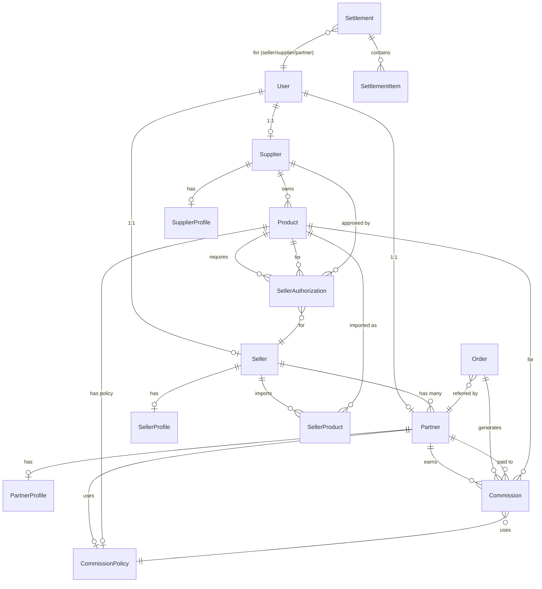

# Dropshipping App Structure Summary

**Investigation Date:** 2025-11-29
**Branch:** develop
**Investigator:** Claude (Sonnet 4.5)

---

## Executive Summary

The Dropshipping system on the develop branch is a **monolithic implementation** deeply embedded in the API server with extensive frontend dashboards in both Admin and Main Site. The system is **production-ready** but **not modularized** as a packageable app, making it challenging to separate into Core + Service-Specific Extensions.

**Key Finding:** Unlike the Forum App which was cleanly extracted into `packages/forum-app`, `packages/forum-neture`, and `packages/forum-yaksa`, the Dropshipping system currently exists as a **tightly coupled implementation** that requires significant refactoring to achieve proper separation.

---

## File Structure Overview

### Backend (API Server)

```
apps/api-server/src/
├── entities/ (18 dropshipping-related entities)
│   ├── Product.ts               (314 lines) - Core product entity
│   ├── Supplier.ts              (286 lines) - Supplier entity
│   ├── Seller.ts                (370 lines) - Seller entity
│   ├── SellerProduct.ts         (191 lines) - Seller's imported products
│   ├── SellerAuthorization.ts   (246 lines) - Product authorization
│   ├── Partner.ts               (411 lines) - Affiliate partners
│   ├── Commission.ts            (259 lines) - Commission records
│   ├── CommissionPolicy.ts      (310 lines) - Commission policies
│   ├── PartnerCommission.ts     (Tracked separately)
│   ├── Settlement.ts            (141 lines) - Settlement records
│   ├── SettlementItem.ts        (Details for settlements)
│   ├── Order.ts                 (Shared entity with referral tracking)
│   ├── PartnerProfile.ts        (Profile metadata)
│   ├── SellerProfile.ts         (Profile metadata)
│   ├── SupplierProfile.ts       (Profile metadata)
│   ├── ChannelProductLink.ts    (Multi-channel management)
│   ├── SellerChannelAccount.ts  (Channel accounts)
│   └── PaymentSettlement.ts     (Payment tracking)
│
├── services/ (13+ dropshipping services)
│   ├── SellerService.ts                 (Core seller operations)
│   ├── SellerProductService.ts          (Seller product management)
│   ├── SellerDashboardService.ts        (Seller dashboard aggregations)
│   ├── SellerAuthorizationService.ts    (Authorization workflow)
│   ├── SupplierDashboardService.ts      (Supplier dashboard)
│   ├── PartnerService.ts                (Partner management)
│   ├── CommissionEngine.ts              (Commission calculation engine)
│   ├── CommissionCalculator.ts          (Commission helpers)
│   ├── SettlementService.ts             (Settlement CRUD)
│   ├── SettlementManagementService.ts   (Settlement operations)
│   ├── SettlementReadService.ts         (Settlement queries)
│   ├── SettlementBatchService.ts        (Batch settlement generation)
│   ├── SettlementScheduler.ts           (Scheduled settlement jobs)
│   └── settlement-engine/               (Settlement engine modules)
│
├── controllers/
│   ├── dropshipping/
│   │   └── DropshippingController.ts    (Main controller)
│   ├── SellerController.ts              (Seller endpoints)
│   ├── SupplierController.ts            (Supplier endpoints)
│   └── cpt/
│       └── DropshippingCPTController.ts (CPT operations)
│
├── routes/
│   ├── v2/seller.routes.ts              (Seller API v2)
│   ├── v2/supplier.routes.ts            (Supplier API v2)
│   ├── admin/seller-authorization.routes.ts
│   ├── admin/dropshipping.routes.ts     (Admin routes)
│   └── cpt/dropshipping.routes.ts       (CPT routes)
│
├── services/cpt/
│   └── dropshipping-cpts.ts             (4 CPT definitions)
│
├── services/acf/
│   └── dropshipping-fields.ts           (859 lines - 7 ACF groups)
│
├── schemas/
│   ├── ds_supplier.schema.ts            (Validation schemas)
│   └── ds_partner.schema.ts
│
├── database/migrations/
│   ├── 1755000000000-CreateSupplierTables.ts
│   ├── 1758897000000-InitializeDropshippingCPTs.ts
│   ├── 1800000000000-CreateDropshippingEntities.ts
│   ├── 1759103000000-CreateCustomPostTypeTables.ts
│   ├── 1737115000000-CreateSettlementTables.ts
│   └── 1900000000000-BaselineDropshippingEntities.ts
│
└── types/
    └── dropshipping.ts                  (TypeScript types)
```

**Backend File Count:**
- Entities: 18 files
- Services: 13+ files
- Controllers: 3+ files
- Routes: 5+ files
- Migrations: 6+ files
- CPT/ACF: 2 files
- **Total Backend Files: ~50 files**

---

### Frontend (Admin Dashboard)

```
apps/admin-dashboard/src/
├── pages/dropshipping/
│   ├── index.tsx                  (Main dropshipping page)
│   ├── Products.tsx               (Product management)
│   ├── ProductEditor.tsx          (Product edit form)
│   ├── BulkProductImport.tsx      (Bulk import UI)
│   ├── Orders.tsx                 (Order management)
│   ├── Settlements.tsx            (Settlement management)
│   ├── Commissions.tsx            (Commission management)
│   ├── Approvals.tsx              (Approval workflows)
│   └── SystemSetup.tsx            (System configuration)
│
├── components/shortcodes/dropshipping/
│   ├── index.tsx                  (Shortcode registry)
│   ├── UserDashboard.tsx          (User role dashboard)
│   ├── RoleVerification.tsx       (Role switcher)
│   ├── seller/
│   │   ├── SellerDashboard.tsx
│   │   ├── SellerProducts.tsx
│   │   ├── SellerSettlement.tsx
│   │   └── ProductMarketplace.tsx
│   ├── supplier/
│   │   ├── SupplierProducts.tsx
│   │   └── SupplierProductEditor.tsx
│   ├── partner/
│   │   ├── PartnerDashboard.tsx
│   │   ├── PartnerProducts.tsx
│   │   ├── PartnerCommissions.tsx
│   │   └── PartnerCommissionDashboard.tsx
│   ├── affiliate/
│   │   ├── AffiliateCommissionDashboard.tsx
│   │   └── index.ts
│   └── shared/
│       ├── LinkGenerator.tsx
│       └── SharedPayoutRequests.tsx
│
└── api/
    └── dropshipping-cpt.ts        (CPT API client)
```

**Admin Dashboard File Count:**
- Pages: 9 files
- Shortcode Components: 20+ files
- API Clients: 1 file
- **Total Admin Files: ~30 files**

---

### Frontend (Main Site)

```
apps/main-site/src/
├── components/shortcodes/
│   ├── SupplierDashboard.tsx      (Supplier UI)
│   ├── PartnerDashboard.tsx       (Partner UI)
│   └── PartnerDashboardOverview.tsx
│
├── pages/dashboard/
│   ├── SellerProductCreatePage.tsx
│   └── SupplierProductAuthorizationsPage.tsx
│
├── types/
│   ├── dropshipping-authorization.ts
│   ├── supplier-product.ts
│   └── seller-product.ts
│
└── services/
    └── authorizationApi.ts
```

**Main Site File Count:**
- Components: 5 files
- Pages: 2 files
- Types: 3 files
- Services: 1 file
- **Total Main Site Files: ~11 files**

---

### Shared/Common

```
packages/
├── shortcodes/src/dropshipping/   (Reusable shortcode definitions)
└── (No dropshipping packages yet)

docs/dropshipping/                  (Documentation)
```

---

## CPT (Custom Post Types) Structure

The system uses **4 CPTs** defined in `dropshipping-cpts.ts`:

| CPT Name | Label | Storage | Description |
|----------|-------|---------|-------------|
| `ds_supplier` | 공급자 | CPT | Dropshipping suppliers |
| `ds_partner` | 파트너 | CPT | Affiliate partners |
| `ds_product` | 드롭쉬핑 상품 | CPT | Supplier products |
| `ds_commission_policy` | 수수료 정책 | CPT | Commission policies |

**Current Usage:**
- All 4 CPTs are registered in the database via migrations
- CPTs are used alongside TypeORM entities (dual storage)
- ACF fields extend CPTs with metadata

---

## ACF (Advanced Custom Fields) Structure

The system defines **7 ACF field groups** in `dropshipping-fields.ts` (859 lines):

| Group Name | Applied To | Fields | Purpose |
|------------|-----------|--------|---------|
| `ds_product_pricing` | `ds_product` | 5 fields | Cost price, MSRP, margin rate, commission |
| `ds_product_supplier` | `ds_product` | 2 fields | Supplier relationship, SKU |
| `ds_product_shipping` | `ds_product` | 3 fields | Shipping days, fees |
| `ds_supplier_info` | `ds_supplier` | 6 fields | Contact info, API keys, permissions |
| `ds_supplier_pricing_management` | `ds_product` (role: supplier) | 4 fields | Supplier price management |
| `ds_partner_info` | `ds_partner` | 4 fields | Partner type, grade, referral code |
| `ds_commission_policy_details` | `ds_commission_policy` | 7 fields | Policy details |
| `ds_seller_autonomous_pricing` | `ds_product` (role: seller) | 4 fields | Seller pricing autonomy |

**Key Features:**
- Role-based field visibility (supplier vs seller)
- Legal compliance notices (Fair Trade Act)
- Real-time price/margin calculations
- Approval workflow integration

---

## Entity Relationship Diagram



---

## API Routes Summary

### Seller Routes (`/api/v2/seller`)
- `GET /api/v2/seller/catalog` - Browse supplier products
- `POST /api/v2/seller/products` - Import product to seller catalog
- `GET /api/v2/seller/products` - Get seller's products
- `GET /api/v2/seller/products/:id` - Get seller product details
- `PUT /api/v2/seller/products/:id` - Update seller product
- `DELETE /api/v2/seller/products/:id` - Remove seller product
- `POST /api/v2/seller/products/:id/sync` - Sync with supplier price

### Supplier Routes (`/api/v2/supplier`)
- `GET /api/v2/supplier/products` - Get supplier products
- `POST /api/v2/supplier/products` - Create new product
- `PUT /api/v2/supplier/products/:id` - Update product
- `DELETE /api/v2/supplier/products/:id` - Delete product
- `GET /api/v2/supplier/authorizations` - Get authorization requests

### Admin Routes (`/api/admin/dropshipping`)
- Product management (CRUD)
- Supplier/Seller approval workflows
- Authorization management
- Settlement management
- Commission management

### CPT Routes (`/api/cpt/dropshipping`)
- CPT-based CRUD operations
- ACF field management

---

## Database Schema Summary

### Core Tables (TypeORM Entities)

| Table | Columns | Purpose |
|-------|---------|---------|
| `products` | 40+ fields | Supplier products with pricing, inventory, variants |
| `suppliers` | 30+ fields | Supplier profiles with tier pricing, policies |
| `sellers` | 35+ fields | Seller profiles with tier, branding, metrics |
| `seller_products` | 15 fields | Seller's imported products with custom pricing |
| `seller_authorizations` | 15 fields | Product authorization workflow |
| `partners` | 40+ fields | Affiliate partners with referral tracking |
| `commissions` | 15 fields | Commission records (pending → confirmed → paid) |
| `commission_policies` | 25+ fields | Commission calculation policies |
| `settlements` | 12 fields | Settlement records for payouts |
| `settlement_items` | 10 fields | Individual items in settlements |
| `orders` | 20+ fields | Orders with referral tracking |

### Metadata Storage

**Dual Storage Strategy:**
- **TypeORM Entities:** Primary data storage (relational)
- **CPT + ACF:** WordPress-compatible layer (optional)
- **JSONB Fields:** Flexible metadata (metrics, policies, branding)

---

## Core vs Extension Analysis (Preliminary)

### Clearly CORE (Common to All Services)

**Entities:**
- Product (base fields: name, description, SKU, pricing structure)
- Supplier (user relationship, tier system)
- Seller (user relationship, tier system)
- SellerProduct (seller's catalog item)
- SellerAuthorization (product access control)
- Order (with referral tracking)
- Partner (affiliate system)
- Commission (commission records)
- CommissionPolicy (commission rules)
- Settlement (payout system)
- SettlementItem

**Services:**
- SellerService (core catalog/import logic)
- SupplierDashboardService (core supplier operations)
- CommissionEngine (base commission calculation)
- SettlementService (core settlement logic)

**Routes:**
- Seller CRUD operations
- Supplier CRUD operations
- Authorization workflow
- Settlement CRUD

### Extension Points (Service-Specific)

**Product Metadata:**
- **Cosmetics:** Skin type, ingredients, beauty concerns, product categories
- **Pharmacy:** Medication type, dosage, contraindications, prescription requirements
- **Travel:** Destinations, schedules, booking info, travel type

**ACF Extensions:**
- Service-specific field groups extending `ds_product`
- Custom validation rules
- Service-specific UI components

**Business Logic Extensions:**
- Service-specific commission policies
- Custom pricing rules
- Specialized approval workflows

**UI Customizations:**
- Service-specific dashboards
- Custom product forms
- Specialized filters and search

---

## Comparison with Forum App Pattern

### Forum App Structure (Reference)

```
packages/forum-app/              (Core)
├── src/
│   ├── manifest.ts              (Core manifest)
│   ├── backend/
│   │   ├── entities/           (ForumPost, ForumCategory, etc.)
│   │   └── services/           (ForumService)
│   ├── admin-ui/               (Admin pages)
│   ├── lifecycle/              (install/uninstall)
│   └── migrations/             (Database migrations)

packages/forum-neture/           (Extension)
├── src/
│   ├── manifest.ts              (Extension manifest)
│   ├── extendsCPT: ['forum_post']
│   ├── acf: [cosmetic_meta]    (Skin type, concerns, routine)
│   └── adminRoutes: [override]

packages/forum-yaksa/            (Extension)
├── src/
│   ├── manifest.ts
│   ├── extendsCPT: ['forum_post']
│   ├── acf: [pharmacy_meta]    (Medical info)
│   └── adminRoutes: [override]
```

### Dropshipping Current State vs Forum Pattern

| Aspect | Forum App | Dropshipping (Current) |
|--------|-----------|------------------------|
| **Modularization** | ✅ Separated into packages | ❌ Monolithic in api-server |
| **Core App** | `packages/forum-app` | ❌ Not extracted |
| **Extensions** | `forum-neture`, `forum-yaksa` | ❌ Not created |
| **Manifest** | ✅ Defined | ❌ Missing |
| **Lifecycle** | ✅ Install/uninstall hooks | ❌ Missing |
| **Migrations** | ✅ Bundled with package | ❌ In api-server migrations |
| **ACF Separation** | ✅ Extension-specific ACF | ❌ All ACF in core |
| **Admin UI** | ✅ Overridable routes | ❌ Hardcoded |

---

## Separation Challenges

### High Coupling

1. **Entity Dependencies:**
   - Product → Supplier, CommissionPolicy, SellerAuthorization
   - Seller → SellerProduct, Partner, Settlement
   - Order → Partner (referral tracking)
   - Complex entity relationships make clean separation difficult

2. **Service Dependencies:**
   - SellerService depends on SellerProductService
   - CommissionEngine depends on CommissionPolicy, Product, Partner
   - SettlementService depends on Order, Commission, Seller, Supplier

3. **Shared Business Logic:**
   - Commission calculation (shared across all services)
   - Settlement generation (common payout logic)
   - Authorization workflow (common approval system)

### Migration Complexity

1. **Data Migration:**
   - Existing production data in TypeORM entities
   - Cannot break existing APIs
   - Need backward compatibility during transition

2. **Service Disruption:**
   - Dropshipping is production-critical
   - Cannot afford downtime
   - Need phased migration strategy

3. **Testing Requirements:**
   - Comprehensive test coverage needed
   - Integration tests across Core + Extensions
   - User acceptance testing for each service

---

## Recommendations

### Core/Extension Separation Strategy

**Dropshipping Core:**
- All entities (Product, Supplier, Seller, Settlement, Commission, etc.)
- Core services (SellerService, CommissionEngine, SettlementService)
- Base CPT definitions (ds_product, ds_supplier, ds_partner, ds_commission_policy)
- Base ACF groups (pricing, supplier info, partner info)
- Core migrations
- Lifecycle hooks (install/uninstall)
- Core admin UI (product CRUD, supplier/seller management, settlement UI)

**Extension Apps (Cosmetics/Pharmacy/Travel):**
- `extendsCPT: ['ds_product']`
- Service-specific ACF groups (cosmetic_meta, pharmacy_meta, travel_meta)
- Admin UI overrides (custom dashboards, product forms)
- Default configuration (categories, branding)
- Service-specific business rules (commission policies, pricing rules)

### Migration Path

**Phase 1: Extract Core**
1. Create `packages/dropshipping-core` structure
2. Move entities → `dropshipping-core/src/backend/entities`
3. Move services → `dropshipping-core/src/backend/services`
4. Move migrations → `dropshipping-core/src/migrations`
5. Create manifest.ts
6. Create lifecycle hooks

**Phase 2: Create Extensions**
1. Create `packages/dropshipping-cosmetics`
2. Define ACF extensions (skin type, ingredients, etc.)
3. Override admin routes (custom product form)
4. Add default config (categories, branding)

**Phase 3: Test & Deploy**
1. Test Core installation
2. Test Extension installation on top of Core
3. Data migration plan
4. Rollout strategy

---

## File Count Summary

| Component | Files | Lines of Code (approx) |
|-----------|-------|------------------------|
| **Backend Entities** | 18 | 5000+ |
| **Backend Services** | 13+ | 8000+ |
| **Backend Controllers** | 3+ | 2000+ |
| **Backend Routes** | 5+ | 1500+ |
| **Backend Migrations** | 6+ | 3000+ |
| **CPT/ACF Definitions** | 2 | 1000+ |
| **Admin Dashboard Pages** | 9 | 3000+ |
| **Admin Dashboard Components** | 20+ | 6000+ |
| **Main Site Components** | 5 | 2000+ |
| **Main Site Pages** | 2 | 1000+ |
| **Types/Schemas** | 5+ | 1000+ |
| **Total** | **~90 files** | **~33,000+ lines** |

---

## Next Steps

1. **Read Full Investigation Report** (`dropshipping_full_investigation_report.md`)
   - Deep dive into each entity, service, and component
   - Detailed analysis of business logic
   - Risk assessment for separation

2. **Review Core/Extension Candidate Map** (`dropshipping_core_extension_candidate_map.md`)
   - Detailed migration plan
   - Step-by-step file movements
   - Service-specific requirements matrix

3. **Create Prototype Core Package**
   - Test extraction feasibility
   - Validate manifest structure
   - Test lifecycle hooks

4. **Stakeholder Review**
   - Review separation strategy
   - Approve phased migration plan
   - Allocate resources for extraction

---

**Status:** Investigation Complete
**Confidence Level:** High
**Recommendation:** Proceed with phased Core/Extension separation following Forum App pattern
