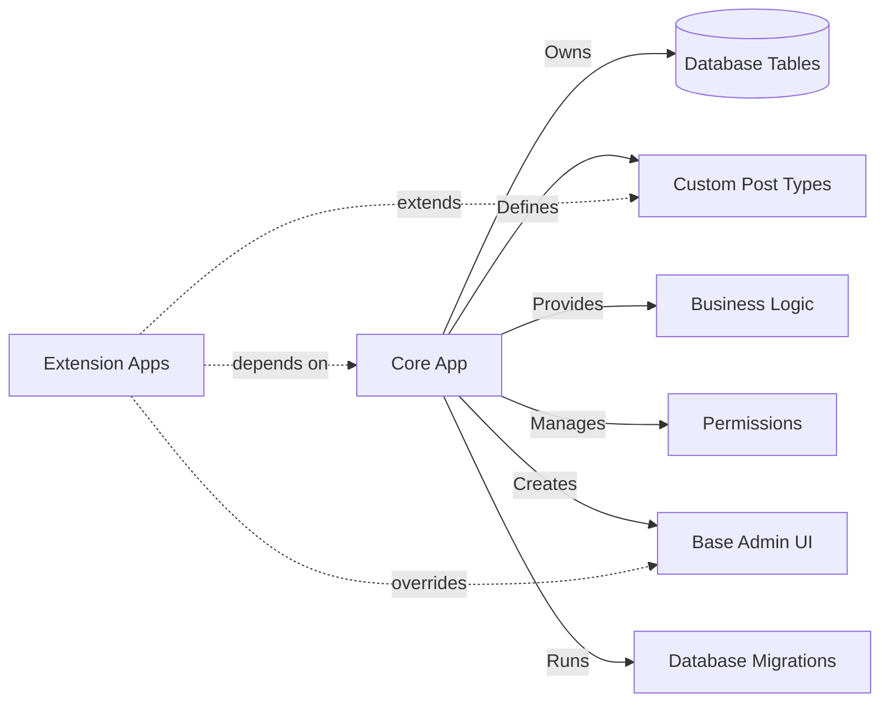
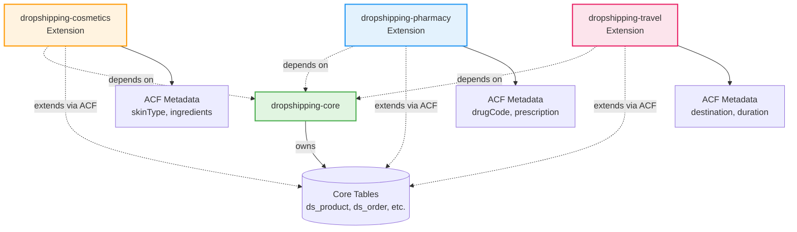

# Forum App Core/Extension Patterns

**Standard Patterns for Dropshipping Core and Derived Apps**

**Date**: 2025-11-29
**Based on**: Forum App Architecture Analysis
**For**: Dropshipping Core/Extension Development

---

## Table of Contents

1. [Core App Standard Pattern](#1-core-app-standard-pattern)
2. [Extension App Standard Pattern](#2-extension-app-standard-pattern)
3. [Dropshipping Core Implementation Guide](#3-dropshipping-core-implementation-guide)
4. [Dropshipping Extension Scenarios](#4-dropshipping-extension-scenarios)
5. [Core/Extension Separation Rules](#5-coreextension-separation-rules)
6. [Anti-Patterns to Avoid](#6-anti-patterns-to-avoid)

---

## 1. Core App Standard Pattern

### 1.1 What is a Core App?

A **Core App** is the data-owning engine that:
- Owns database tables
- Defines base entity schemas (CPT)
- Provides core business logic
- Manages core permissions
- Can be extended by extension apps

**Example**: `dropshipping-core` owns `ds_product`, `ds_order`, `ds_supplier` tables and provides base dropshipping functionality.

### 1.2 Core App Responsibilities



**MUST DO**:
- ✅ Own all base tables (declare in `ownsTables`)
- ✅ Provide complete CRUD services
- ✅ Define all CPT schemas
- ✅ Create database migrations
- ✅ Implement lifecycle hooks (install/uninstall)
- ✅ Provide base admin UI

**MUST NOT DO**:
- ❌ Depend on other apps
- ❌ Contain service-specific logic
- ❌ Hardcode service-specific categories
- ❌ Assume specific use cases

### 1.3 Core App Manifest Template

```typescript
export const dropshippingCoreManifest = {
  // ========================================
  // IDENTITY (Required)
  // ========================================
  appId: 'dropshipping-core',
  name: 'Dropshipping Core',
  type: 'core',                             // 👈 Marks as core engine
  version: '1.0.0',
  description: '드롭쉬핑 코어 엔진 (제품/주문/재고/공급사)',

  // ========================================
  // UNINSTALL POLICY (Required)
  // ========================================
  uninstallPolicy: {
    defaultMode: 'keep-data',               // 'keep-data' | 'purge-data'
    allowPurge: true,                       // Allow manual purge
    autoBackup: true                        // Create backup before purge
  },

  // ========================================
  // DATA OWNERSHIP (Critical - List ALL owned tables)
  // ========================================
  ownsTables: [
    'ds_product',                           // Product catalog
    'ds_product_variant',                   // Product variants (size, color, etc.)
    'ds_category',                          // Product categories
    'ds_supplier',                          // Supplier information
    'ds_inventory',                         // Stock levels
    'ds_order',                             // Customer orders
    'ds_order_item',                        // Order line items
    'ds_shipment',                          // Shipment tracking
    'ds_return',                            // Return requests
    'ds_price_rule'                         // Pricing rules
  ],

  // ========================================
  // CPT DEFINITIONS (Required - Define all entities)
  // ========================================
  cpt: [
    {
      name: 'ds_product',
      storage: 'entity',                    // 'entity' | 'wp_posts'
      primaryKey: 'id',
      label: '제품',
      supports: [
        'title',                            // Product name
        'description',                      // Product description
        'price',                            // Base price
        'inventory',                        // Stock tracking
        'variants',                         // Size/color variants
        'images',                           // Product images
        'supplier',                         // Supplier link
        'categories'                        // Category assignment
      ]
    },
    {
      name: 'ds_order',
      storage: 'entity',
      primaryKey: 'id',
      label: '주문',
      supports: [
        'customer',                         // Customer info
        'items',                            // Order items
        'payment',                          // Payment status
        'shipping',                         // Shipping address
        'status'                            // Order status
      ]
    },
    {
      name: 'ds_supplier',
      storage: 'entity',
      primaryKey: 'id',
      label: '공급사',
      supports: [
        'name',                             // Supplier name
        'contact',                          // Contact information
        'products',                         // Supplied products
        'terms'                             // Payment terms
      ]
    },
    {
      name: 'ds_category',
      storage: 'entity',
      primaryKey: 'id',
      label: '카테고리',
      supports: [
        'name',                             // Category name
        'hierarchy',                        // Parent/child structure
        'products'                          // Products in category
      ]
    }
  ],

  // ========================================
  // ACF GROUPS (Base - Extensions add more)
  // ========================================
  acf: [],                                  // Core provides base, extensions add

  // ========================================
  // ROUTES (Required - Define all admin routes)
  // ========================================
  routes: [
    '/admin/dropshipping',                  // Dashboard
    '/admin/dropshipping/products',         // Product list
    '/admin/dropshipping/products/:id',     // Product detail
    '/admin/dropshipping/products/:id/edit',// Product edit
    '/admin/dropshipping/products/new',     // Product create
    '/admin/dropshipping/orders',           // Order list
    '/admin/dropshipping/orders/:id',       // Order detail
    '/admin/dropshipping/suppliers',        // Supplier list
    '/admin/dropshipping/suppliers/:id',    // Supplier detail
    '/admin/dropshipping/inventory',        // Inventory management
    '/admin/dropshipping/settings'          // Settings page
  ],

  // ========================================
  // PERMISSIONS (Required - Define all permissions)
  // ========================================
  permissions: [
    'dropshipping.read',                    // View products/orders
    'dropshipping.write',                   // Create/edit products/orders
    'dropshipping.delete',                  // Delete products/orders
    'dropshipping.manage_inventory',        // Manage stock levels
    'dropshipping.manage_suppliers',        // Manage supplier relationships
    'dropshipping.manage_pricing',          // Edit prices and rules
    'dropshipping.admin'                    // Full admin access
  ],

  // ========================================
  // LIFECYCLE HOOKS (Required)
  // ========================================
  lifecycle: {
    install: './lifecycle/install.js',      // Seed permissions, adopt tables
    activate: './lifecycle/activate.js',    // Enable features
    deactivate: './lifecycle/deactivate.js',// Disable features
    uninstall: './lifecycle/uninstall.js'   // Check dependents, purge data
  },

  // ========================================
  // INSTALLATION OPTIONS (Recommended)
  // ========================================
  installOptions: {
    adoptExistingTables: true,              // Adopt pre-existing tables
    keepDataOnUninstall: true               // Default: keep data
  },

  // ========================================
  // MENU DEFINITION (Recommended)
  // ========================================
  menu: {
    id: 'dropshipping',
    label: '드롭쉬핑',
    icon: 'Package',
    path: '/dropshipping',
    position: 100,                          // Menu position (lower = higher)
    children: [
      {
        id: 'dropshipping-dashboard',
        label: '대시보드',
        icon: 'LayoutDashboard',
        path: '/dropshipping'
      },
      {
        id: 'dropshipping-products',
        label: '제품 관리',
        icon: 'ShoppingBag',
        path: '/dropshipping/products'
      },
      {
        id: 'dropshipping-orders',
        label: '주문 관리',
        icon: 'ShoppingCart',
        path: '/dropshipping/orders'
      },
      {
        id: 'dropshipping-suppliers',
        label: '공급사 관리',
        icon: 'Truck',
        path: '/dropshipping/suppliers'
      },
      {
        id: 'dropshipping-inventory',
        label: '재고 관리',
        icon: 'Archive',
        path: '/dropshipping/inventory'
      },
      {
        id: 'dropshipping-settings',
        label: '설정',
        icon: 'Settings',
        path: '/dropshipping/settings'
      }
    ]
  }
}
```

### 1.4 Core Entity Pattern

**Key Features**:
- UUID primary keys
- `metadata` JSON field for extension data
- Timestamps (createdAt, updatedAt)
- Business logic methods
- Relations with lazy loading

```typescript
import {
  Entity,
  PrimaryGeneratedColumn,
  Column,
  CreateDateColumn,
  UpdateDateColumn,
  ManyToOne,
  OneToMany,
  JoinColumn,
  Index
} from 'typeorm'

export enum ProductStatus {
  DRAFT = 'draft',
  ACTIVE = 'active',
  OUT_OF_STOCK = 'out_of_stock',
  DISCONTINUED = 'discontinued'
}

@Entity('ds_product')
@Index(['status', 'createdAt'])
@Index(['supplierId', 'status'])
export class Product {
  // ========================================
  // PRIMARY KEY
  // ========================================
  @PrimaryGeneratedColumn('uuid')
  id!: string

  // ========================================
  // CORE FIELDS
  // ========================================
  @Column({ type: 'varchar', length: 200 })
  name!: string

  @Column({ type: 'varchar', length: 250, unique: true })
  slug!: string

  @Column({ type: 'text' })
  description!: string

  @Column({ type: 'text', nullable: true })
  shortDescription?: string

  @Column({ type: 'decimal', precision: 10, scale: 2 })
  price!: number

  @Column({ type: 'decimal', precision: 10, scale: 2, nullable: true })
  compareAtPrice?: number                   // Original price for discount display

  @Column({ type: 'decimal', precision: 10, scale: 2, nullable: true })
  costPrice?: number                        // Cost from supplier

  @Column({ type: 'enum', enum: ProductStatus, default: ProductStatus.DRAFT })
  status!: ProductStatus

  @Column({ type: 'uuid' })
  supplierId!: string                       // Which supplier provides this

  @Column({ type: 'uuid', nullable: true })
  categoryId?: string

  @Column({ type: 'int', default: 0 })
  stockQuantity!: number

  @Column({ type: 'int', nullable: true })
  lowStockThreshold?: number                // Alert when stock below this

  @Column({ type: 'simple-array', nullable: true })
  images?: string[]                         // Image URLs

  @Column({ type: 'varchar', length: 100, nullable: true })
  sku?: string                              // Stock Keeping Unit

  @Column({ type: 'varchar', length: 100, nullable: true })
  barcode?: string

  // ========================================
  // METADATA (Extension Point - CRITICAL)
  // ========================================
  @Column({ type: 'json', nullable: true })
  metadata?: Record<string, unknown>        // 👈 ACF data stored here
  // Example structure:
  // {
  //   cosmetic_meta: {
  //     skinType: '건성',
  //     ingredients: ['Hyaluronic Acid', 'Vitamin C'],
  //     volume: '50ml'
  //   },
  //   pharmacy_meta: {
  //     drugCode: 'EDI123456',
  //     requiresPrescription: true
  //   }
  // }

  // ========================================
  // TIMESTAMPS
  // ========================================
  @CreateDateColumn()
  createdAt!: Date

  @UpdateDateColumn()
  updatedAt!: Date

  @Column({ type: 'timestamp', nullable: true })
  publishedAt?: Date

  // ========================================
  // RELATIONS
  // ========================================
  @ManyToOne('Supplier', { lazy: true })
  @JoinColumn({ name: 'supplierId' })
  supplier?: Promise<Supplier>

  @ManyToOne('Category', { lazy: true, nullable: true })
  @JoinColumn({ name: 'categoryId' })
  category?: Promise<Category>

  @OneToMany('ProductVariant', 'product', { lazy: true })
  variants?: Promise<ProductVariant[]>

  // ========================================
  // BUSINESS LOGIC METHODS
  // ========================================
  canUserEdit(userId: string, userRole: string): boolean {
    if (['admin', 'manager'].includes(userRole)) return true
    // Add more permission logic
    return false
  }

  canUserView(userRole: string): boolean {
    if (this.status === ProductStatus.DRAFT) {
      return ['admin', 'manager'].includes(userRole)
    }
    return true
  }

  isInStock(): boolean {
    return this.stockQuantity > 0
  }

  isLowStock(): boolean {
    if (!this.lowStockThreshold) return false
    return this.stockQuantity <= this.lowStockThreshold
  }

  calculateProfit(): number {
    if (!this.costPrice) return 0
    return this.price - this.costPrice
  }

  calculateProfitMargin(): number {
    if (!this.costPrice || this.costPrice === 0) return 0
    return ((this.price - this.costPrice) / this.costPrice) * 100
  }

  generateSlug(): string {
    return this.name
      .toLowerCase()
      .replace(/[^a-z0-9가-힣\s-]/g, '')
      .replace(/\s+/g, '-')
      .replace(/-+/g, '-')
      .replace(/^-|-$/g, '')
      .substring(0, 200)
  }

  publish(): void {
    this.status = ProductStatus.ACTIVE
    this.publishedAt = new Date()
  }

  discontinue(): void {
    this.status = ProductStatus.DISCONTINUED
  }

  decrementStock(quantity: number): void {
    this.stockQuantity = Math.max(0, this.stockQuantity - quantity)
    if (this.stockQuantity === 0) {
      this.status = ProductStatus.OUT_OF_STOCK
    }
  }

  incrementStock(quantity: number): void {
    this.stockQuantity += quantity
    if (this.status === ProductStatus.OUT_OF_STOCK) {
      this.status = ProductStatus.ACTIVE
    }
  }
}
```

---

## 2. Extension App Standard Pattern

### 2.1 What is an Extension App?

An **Extension App** is a service-specific customization that:
- Depends on a core app
- Adds metadata to core entities (via ACF)
- Can own extension-specific tables
- Overrides core UI with service-specific interface
- Provides service-specific configuration

**Example**: `dropshipping-cosmetics` extends `dropshipping-core` with cosmetics-specific metadata (skin type, ingredients) and UI.

### 2.2 Extension App Responsibilities



**MUST DO**:
- ✅ Declare dependency on core app
- ✅ Use `extendsCPT` to add metadata
- ✅ Define ACF groups for metadata
- ✅ Provide service-specific UI overrides
- ✅ Provide `defaultConfig` for categories/settings

**MUST NOT DO**:
- ❌ Own core tables
- ❌ Modify core table schemas
- ❌ Delete core data
- ❌ Bypass core business logic

### 2.3 Extension App Manifest Template

```typescript
export const dropshippingCosmeticsManifest = {
  // ========================================
  // IDENTITY (Required)
  // ========================================
  appId: 'dropshipping-cosmetics',
  name: 'Dropshipping Extension – Cosmetics',
  type: 'extension',                        // 👈 Marks as extension
  version: '1.0.0',
  description: '화장품 특화 드롭쉬핑 (피부타입, 성분, 용량)',

  // ========================================
  // CORE DEPENDENCY (Critical - MUST declare)
  // ========================================
  dependencies: {
    'dropshipping-core': '>=1.0.0'          // 👈 Requires core app
  },

  // ========================================
  // UNINSTALL POLICY (Required)
  // ========================================
  uninstallPolicy: {
    defaultMode: 'keep-data',               // Keep metadata by default
    allowPurge: true,                       // Allow manual purge
    autoBackup: false                       // Extension data less critical
  },

  // ========================================
  // EXTENSION TABLES (Optional - only if needed)
  // ========================================
  ownsTables: [
    // Most extensions should be empty
    // Only if extension needs its own tables
    // Example: cosmetic_certification, cosmetic_ingredient_db
  ],

  // ========================================
  // EXTEND CORE CPT (Required - declare which CPT to extend)
  // ========================================
  extendsCPT: [
    {
      name: 'ds_product',                   // 👈 Extend Product entity
      acfGroup: 'cosmetic_meta'             // 👈 Attach ACF group
    }
  ],

  // ========================================
  // ACF METADATA (Required - define metadata fields)
  // ========================================
  acf: [
    {
      groupId: 'cosmetic_meta',
      label: '화장품 메타데이터',
      fields: [
        {
          key: 'skinType',
          type: 'select',
          label: '피부 타입',
          options: ['건성', '지성', '복합성', '민감성'],
          required: false
        },
        {
          key: 'concerns',
          type: 'multiselect',
          label: '피부 고민',
          options: ['여드름', '주름', '미백', '모공', '탄력', '수분'],
          required: false
        },
        {
          key: 'ingredients',
          type: 'array',
          label: '주요 성분',
          description: '주요 성분 목록',
          required: false
        },
        {
          key: 'volume',
          type: 'string',
          label: '용량',
          placeholder: '예: 50ml, 100g',
          required: false
        },
        {
          key: 'expiryPeriod',
          type: 'string',
          label: '사용기한',
          placeholder: '예: 개봉 후 12개월',
          required: false
        },
        {
          key: 'certifications',
          type: 'multiselect',
          label: '인증',
          options: ['비건', '유기농', 'EWG 그린', 'FDA 승인', '피부저자극테스트완료'],
          required: false
        },
        {
          key: 'routineStep',
          type: 'select',
          label: '루틴 단계',
          options: ['클렌징', '토너', '세럼', '에센스', '크림', '선크림', '마스크'],
          required: false
        },
        {
          key: 'texture',
          type: 'select',
          label: '제형',
          options: ['크림', '젤', '로션', '세럼', '오일', '폼', '파우더'],
          required: false
        }
      ]
    }
  ],

  // ========================================
  // ADMIN UI OVERRIDE (Recommended)
  // ========================================
  adminRoutes: [
    {
      path: '/admin/dropshipping',          // 👈 Override dashboard
      component: './admin-ui/pages/CosmeticDashboard.js'
    },
    {
      path: '/admin/dropshipping/products', // 👈 Override product list
      component: './admin-ui/pages/CosmeticProductList.js'
    },
    {
      path: '/admin/dropshipping/products/:id/edit', // 👈 Override product form
      component: './admin-ui/pages/CosmeticProductForm.js'
    }
  ],

  // ========================================
  // DEFAULT CONFIGURATION (Recommended)
  // ========================================
  defaultConfig: {
    // Service-specific categories
    categories: [
      {
        name: '스킨케어',
        slug: 'skincare',
        description: '기초 화장품',
        color: '#FFB6C1',
        children: [
          { name: '클렌징', slug: 'cleansing' },
          { name: '토너', slug: 'toner' },
          { name: '세럼', slug: 'serum' },
          { name: '크림', slug: 'cream' }
        ]
      },
      {
        name: '메이크업',
        slug: 'makeup',
        description: '색조 화장품',
        color: '#FF69B4',
        children: [
          { name: '베이스', slug: 'base' },
          { name: '아이', slug: 'eye' },
          { name: '립', slug: 'lip' }
        ]
      },
      {
        name: '헤어케어',
        slug: 'haircare',
        description: '헤어 제품',
        color: '#DDA0DD'
      },
      {
        name: '바디케어',
        slug: 'bodycare',
        description: '바디 제품',
        color: '#F0E68C'
      }
    ],

    // Branding
    skin: 'cosmetics',
    brandColor: '#FF6B9D',
    accentColor: '#C44569',
    logo: '/assets/cosmetics-logo.svg',

    // Feature flags
    features: {
      ingredientSearch: true,               // Enable ingredient-based search
      skinTypeFilter: true,                 // Enable skin type filtering
      routineBuilder: true,                 // Enable routine builder
      reviewVerification: true              // Verify purchase for reviews
    },

    // Business rules
    rules: {
      requireIngredientList: true,          // Require ingredient disclosure
      allowSampleOrders: true,              // Allow sample products
      minOrderAmount: 0,                    // Minimum order (0 = no minimum)
      freeShippingThreshold: 50000          // Free shipping above this amount
    }
  },

  // ========================================
  // PERMISSIONS (Optional - inherit from core)
  // ========================================
  permissions: [],                          // Inherit from core

  // ========================================
  // MENU (Optional - use core menu)
  // ========================================
  menu: null                                // Use core menu with theme
}
```

### 2.4 Extension Service Pattern

**Extend core service with service-specific methods**:

```typescript
import { ProductService } from '@o4o-apps/dropshipping-core'
import { Product } from '@o4o-apps/dropshipping-core'

export class CosmeticProductService extends ProductService {
  // ========================================
  // QUERY BY METADATA (service-specific)
  // ========================================
  async getProductsBySkinType(skinType: string): Promise<Product[]> {
    return this.repo.createQueryBuilder('product')
      .where("product.metadata->'cosmetic_meta'->>'skinType' = :skinType", {
        skinType
      })
      .andWhere('product.status = :status', { status: 'active' })
      .orderBy('product.createdAt', 'DESC')
      .getMany()
  }

  async getProductsByConcerns(concerns: string[]): Promise<Product[]> {
    return this.repo.createQueryBuilder('product')
      .where("product.metadata->'cosmetic_meta'->'concerns' ?| array[:...concerns]", {
        concerns
      })
      .andWhere('product.status = :status', { status: 'active' })
      .orderBy('product.createdAt', 'DESC')
      .getMany()
  }

  async getProductsByIngredient(ingredient: string): Promise<Product[]> {
    return this.repo.createQueryBuilder('product')
      .where(
        "product.metadata->'cosmetic_meta'->'ingredients' @> :ingredient::jsonb",
        {
          ingredient: JSON.stringify([ingredient])
        }
      )
      .andWhere('product.status = :status', { status: 'active' })
      .orderBy('product.createdAt', 'DESC')
      .getMany()
  }

  async getProductsByRoutineStep(step: string): Promise<Product[]> {
    return this.repo.createQueryBuilder('product')
      .where("product.metadata->'cosmetic_meta'->>'routineStep' = :step", {
        step
      })
      .andWhere('product.status = :status', { status: 'active' })
      .orderBy('product.createdAt', 'DESC')
      .getMany()
  }

  // ========================================
  // VALIDATION (service-specific)
  // ========================================
  validateCosmeticMetadata(metadata: any): {
    valid: boolean
    errors: string[]
  } {
    const errors: string[] = []

    // Check if cosmetic_meta exists
    if (!metadata?.cosmetic_meta) {
      errors.push('Missing cosmetic_meta in metadata')
      return { valid: false, errors }
    }

    const cosmeticMeta = metadata.cosmetic_meta

    // Validate skin type (if provided)
    if (cosmeticMeta.skinType) {
      const validSkinTypes = ['건성', '지성', '복합성', '민감성']
      if (!validSkinTypes.includes(cosmeticMeta.skinType)) {
        errors.push(`Invalid skin type: ${cosmeticMeta.skinType}`)
      }
    }

    // Validate ingredients (if provided)
    if (cosmeticMeta.ingredients) {
      if (!Array.isArray(cosmeticMeta.ingredients)) {
        errors.push('Ingredients must be an array')
      } else if (cosmeticMeta.ingredients.length === 0) {
        errors.push('Ingredients array is empty')
      }
    }

    // Validate routine step (if provided)
    if (cosmeticMeta.routineStep) {
      const validSteps = ['클렌징', '토너', '세럼', '에센스', '크림', '선크림', '마스크']
      if (!validSteps.includes(cosmeticMeta.routineStep)) {
        errors.push(`Invalid routine step: ${cosmeticMeta.routineStep}`)
      }
    }

    return {
      valid: errors.length === 0,
      errors
    }
  }

  // ========================================
  // STATISTICS (service-specific)
  // ========================================
  async getCosmeticStatistics(): Promise<{
    bySkinType: Record<string, number>
    byConcern: Record<string, number>
    byRoutineStep: Record<string, number>
    topIngredients: Array<{ ingredient: string; count: number }>
  }> {
    // Query statistics from metadata
    const products = await this.repo.find({
      where: { status: 'active' }
    })

    const stats = {
      bySkinType: {} as Record<string, number>,
      byConcern: {} as Record<string, number>,
      byRoutineStep: {} as Record<string, number>,
      topIngredients: [] as Array<{ ingredient: string; count: number }>
    }

    // Aggregate statistics
    const ingredientCounts = new Map<string, number>()

    products.forEach(product => {
      const meta = product.metadata?.cosmetic_meta
      if (!meta) return

      // Count by skin type
      if (meta.skinType) {
        stats.bySkinType[meta.skinType] = (stats.bySkinType[meta.skinType] || 0) + 1
      }

      // Count by concerns
      if (Array.isArray(meta.concerns)) {
        meta.concerns.forEach((concern: string) => {
          stats.byConcern[concern] = (stats.byConcern[concern] || 0) + 1
        })
      }

      // Count by routine step
      if (meta.routineStep) {
        stats.byRoutineStep[meta.routineStep] =
          (stats.byRoutineStep[meta.routineStep] || 0) + 1
      }

      // Count ingredients
      if (Array.isArray(meta.ingredients)) {
        meta.ingredients.forEach((ingredient: string) => {
          ingredientCounts.set(ingredient, (ingredientCounts.get(ingredient) || 0) + 1)
        })
      }
    })

    // Sort ingredients by count
    stats.topIngredients = Array.from(ingredientCounts.entries())
      .map(([ingredient, count]) => ({ ingredient, count }))
      .sort((a, b) => b.count - a.count)
      .slice(0, 20)

    return stats
  }

  // ========================================
  // ROUTINE BUILDER (service-specific feature)
  // ========================================
  async buildRoutine(skinType: string, concerns: string[]): Promise<{
    morning: Product[]
    evening: Product[]
  }> {
    // Get products matching skin type and concerns
    const allProducts = await this.repo.createQueryBuilder('product')
      .where("product.metadata->'cosmetic_meta'->>'skinType' = :skinType", {
        skinType
      })
      .andWhere("product.metadata->'cosmetic_meta'->'concerns' ?| array[:...concerns]", {
        concerns
      })
      .andWhere('product.status = :status', { status: 'active' })
      .getMany()

    // Build routine by step
    const stepOrder = ['클렌징', '토너', '세럼', '에센스', '크림', '선크림']
    const morningRoutine: Product[] = []
    const eveningRoutine: Product[] = []

    stepOrder.forEach(step => {
      const product = allProducts.find(
        p => p.metadata?.cosmetic_meta?.routineStep === step
      )

      if (product) {
        if (step === '선크림') {
          morningRoutine.push(product)
        } else {
          morningRoutine.push(product)
          eveningRoutine.push(product)
        }
      }
    })

    return {
      morning: morningRoutine,
      evening: eveningRoutine
    }
  }
}
```

---

## 3. Dropshipping Core Implementation Guide

### 3.1 Project Structure

```
packages/dropshipping-core/
├── package.json
├── tsconfig.json
├── README.md
├── src/
│   ├── manifest.ts                         # Core manifest
│   ├── index.ts                            # Main export
│   │
│   ├── backend/
│   │   ├── entities/
│   │   │   ├── Product.ts                  # Product entity
│   │   │   ├── ProductVariant.ts           # Variant entity
│   │   │   ├── Category.ts                 # Category entity
│   │   │   ├── Supplier.ts                 # Supplier entity
│   │   │   ├── Order.ts                    # Order entity
│   │   │   ├── OrderItem.ts                # Order item entity
│   │   │   ├── Inventory.ts                # Inventory entity
│   │   │   ├── Shipment.ts                 # Shipment entity
│   │   │   ├── Return.ts                   # Return entity
│   │   │   ├── PriceRule.ts                # Price rule entity
│   │   │   └── index.ts
│   │   │
│   │   └── services/
│   │       ├── product.service.ts          # Product CRUD
│   │       ├── order.service.ts            # Order management
│   │       ├── supplier.service.ts         # Supplier management
│   │       ├── inventory.service.ts        # Inventory management
│   │       ├── shipment.service.ts         # Shipment tracking
│   │       ├── pricing.service.ts          # Pricing logic
│   │       └── index.ts
│   │
│   ├── admin-ui/
│   │   ├── api/
│   │   │   ├── productClient.ts            # API client for products
│   │   │   ├── orderClient.ts              # API client for orders
│   │   │   ├── supplierClient.ts           # API client for suppliers
│   │   │   └── index.ts
│   │   │
│   │   ├── pages/
│   │   │   ├── DropshippingDashboard.tsx   # Main dashboard
│   │   │   ├── ProductList.tsx             # Product list
│   │   │   ├── ProductDetail.tsx           # Product detail
│   │   │   ├── ProductForm.tsx             # Product create/edit
│   │   │   ├── OrderList.tsx               # Order list
│   │   │   ├── OrderDetail.tsx             # Order detail
│   │   │   ├── SupplierList.tsx            # Supplier list
│   │   │   ├── SupplierDetail.tsx          # Supplier detail
│   │   │   ├── InventoryManagement.tsx     # Inventory page
│   │   │   ├── SettingsPage.tsx            # Settings
│   │   │   └── index.ts
│   │   │
│   │   ├── components/
│   │   │   ├── ProductCard.tsx             # Product card component
│   │   │   ├── OrderStatusBadge.tsx        # Order status badge
│   │   │   ├── StockLevelIndicator.tsx     # Stock level indicator
│   │   │   └── index.ts
│   │   │
│   │   └── widgets/
│   │       ├── DropshippingStatsCard.tsx   # Stats card
│   │       ├── RecentOrdersWidget.tsx      # Recent orders
│   │       ├── LowStockAlert.tsx           # Low stock alert
│   │       └── index.ts
│   │
│   ├── lifecycle/
│   │   ├── install.ts                      # Install hook
│   │   ├── activate.ts                     # Activate hook
│   │   ├── deactivate.ts                   # Deactivate hook
│   │   └── uninstall.ts                    # Uninstall hook
│   │
│   └── migrations/
│       ├── 001-create-product-tables.ts    # Product/variant/category
│       ├── 002-create-supplier-tables.ts   # Supplier
│       ├── 003-create-order-tables.ts      # Order/order_item
│       ├── 004-create-inventory-tables.ts  # Inventory
│       └── 005-create-shipment-tables.ts   # Shipment/return
```

### 3.2 Implementation Checklist

**Phase 1: Core Entities (Week 1)**
- [ ] Define all entity schemas
- [ ] Add `metadata` JSON field to all entities
- [ ] Implement business logic methods
- [ ] Create entity indexes

**Phase 2: Services (Week 2)**
- [ ] Implement ProductService (CRUD, search, filter)
- [ ] Implement OrderService (create, update, status tracking)
- [ ] Implement SupplierService (manage suppliers)
- [ ] Implement InventoryService (stock management)
- [ ] Add cache integration

**Phase 3: Migrations (Week 3)**
- [ ] Create all database migrations
- [ ] Add foreign key constraints
- [ ] Add indexes for performance
- [ ] Test migration up/down

**Phase 4: Lifecycle Hooks (Week 3)**
- [ ] Implement install hook (seed permissions, adopt tables)
- [ ] Implement uninstall hook (check dependents, purge data)
- [ ] Implement activate/deactivate hooks

**Phase 5: Admin UI (Week 4-5)**
- [ ] Build dashboard page
- [ ] Build product list/detail/form pages
- [ ] Build order list/detail pages
- [ ] Build supplier pages
- [ ] Build inventory management page
- [ ] Create reusable components

**Phase 6: Testing & Documentation (Week 6)**
- [ ] Test installation flow
- [ ] Test uninstallation (with/without purge)
- [ ] Test with extension apps
- [ ] Write API documentation
- [ ] Write user guide

---

## 4. Dropshipping Extension Scenarios

### 4.1 Scenario 1: Cosmetics Extension

**Pure Extension - No Custom Tables**

**What it adds**:
- Skin type metadata
- Ingredient lists
- Routine builder
- Cosmetics-specific categories
- Beauty-focused UI

**Manifest Snippet**:
```typescript
{
  appId: 'dropshipping-cosmetics',
  type: 'extension',
  dependencies: { 'dropshipping-core': '>=1.0.0' },

  ownsTables: [],                           // No tables owned

  extendsCPT: [
    { name: 'ds_product', acfGroup: 'cosmetic_meta' }
  ],

  acf: [
    {
      groupId: 'cosmetic_meta',
      fields: [
        { key: 'skinType', type: 'select', options: ['건성', '지성', '복합성', '민감성'] },
        { key: 'ingredients', type: 'array' },
        { key: 'volume', type: 'string' }
      ]
    }
  ]
}
```

**Stored Data**:
```json
{
  "id": "product-uuid",
  "name": "하이알루론산 세럼",
  "price": 35000,
  "metadata": {
    "cosmetic_meta": {
      "skinType": "건성",
      "ingredients": ["Hyaluronic Acid", "Niacinamide", "Vitamin B5"],
      "volume": "30ml",
      "routineStep": "세럼"
    }
  }
}
```

### 4.2 Scenario 2: Pharmacy Extension

**Hybrid Extension - ACF + Custom Tables**

**What it adds**:
- Drug code metadata
- Prescription requirements
- Pharmacy compliance system
- Custom tables for pharmacy licenses

**Manifest Snippet**:
```typescript
{
  appId: 'dropshipping-pharmacy',
  type: 'extension',
  dependencies: { 'dropshipping-core': '>=1.0.0' },

  ownsTables: [
    'pharmacy_license',                     // Pharmacy license tracking
    'pharmacy_compliance_log'               // Compliance audit log
  ],

  extendsCPT: [
    { name: 'ds_product', acfGroup: 'pharmacy_meta' }
  ],

  acf: [
    {
      groupId: 'pharmacy_meta',
      fields: [
        { key: 'drugCode', type: 'string', label: '약물 코드 (EDI)' },
        { key: 'requiresPrescription', type: 'boolean' },
        { key: 'category', type: 'select', options: ['일반의약품', '전문의약품', '건강기능식품'] },
        { key: 'dosage', type: 'string' },
        { key: 'contraindications', type: 'array' }
      ]
    }
  ]
}
```

**Stored Data**:
```json
{
  "id": "product-uuid",
  "name": "타이레놀 500mg",
  "price": 8000,
  "metadata": {
    "pharmacy_meta": {
      "drugCode": "EDI654321",
      "requiresPrescription": false,
      "category": "일반의약품",
      "dosage": "1일 3회, 1회 1정",
      "contraindications": ["간질환", "신장질환"]
    }
  }
}
```

### 4.3 Scenario 3: Travel Extension

**Pure Extension - Service Booking Focus**

**What it adds**:
- Destination metadata
- Travel dates
- Booking management
- Travel-specific categories

**Manifest Snippet**:
```typescript
{
  appId: 'dropshipping-travel',
  type: 'extension',
  dependencies: { 'dropshipping-core': '>=1.0.0' },

  ownsTables: [],

  extendsCPT: [
    { name: 'ds_product', acfGroup: 'travel_meta' }
  ],

  acf: [
    {
      groupId: 'travel_meta',
      fields: [
        { key: 'destination', type: 'string', label: '목적지' },
        { key: 'duration', type: 'string', label: '여행 기간' },
        { key: 'departureDate', type: 'date', label: '출발일' },
        { key: 'returnDate', type: 'date', label: '귀국일' },
        { key: 'includes', type: 'array', label: '포함 사항' },
        { key: 'excludes', type: 'array', label: '불포함 사항' }
      ]
    }
  ]
}
```

**Stored Data**:
```json
{
  "id": "product-uuid",
  "name": "제주도 3박 4일 패키지",
  "price": 450000,
  "metadata": {
    "travel_meta": {
      "destination": "제주도",
      "duration": "3박 4일",
      "departureDate": "2025-12-01",
      "returnDate": "2025-12-04",
      "includes": ["항공권", "숙박", "렌터카", "조식"],
      "excludes": ["점심", "저녁", "입장료"]
    }
  }
}
```

---

## 5. Core/Extension Separation Rules

### 5.1 What Belongs in Core

**✅ Core Responsibilities**:

1. **Data Ownership**
   - All base tables (product, order, supplier, etc.)
   - Table schemas (entity definitions)
   - Database migrations

2. **Core Business Logic**
   - CRUD operations
   - Base validation
   - Generic search/filter
   - Inventory tracking
   - Order processing

3. **Base UI**
   - Dashboard (stats, recent activity)
   - Product list (generic)
   - Order list (generic)
   - Supplier management
   - Settings page

4. **Infrastructure**
   - Permissions system
   - Lifecycle hooks
   - Cache integration
   - API clients

**❌ Not in Core**:
- Service-specific metadata (skin type, drug codes, etc.)
- Service-specific categories (cosmetics, pharmacy, travel)
- Service-specific UI (routine builder, prescription checker)
- Service-specific business rules

### 5.2 What Belongs in Extensions

**✅ Extension Responsibilities**:

1. **Service-Specific Metadata**
   - ACF field definitions
   - Metadata validation
   - Metadata queries

2. **Service-Specific Tables** (optional)
   - Extension-specific entities
   - Extension migrations
   - Must NOT duplicate core tables

3. **Service-Specific UI**
   - Override core pages with service-specific interface
   - Add service-specific filters
   - Add service-specific features (routine builder, etc.)

4. **Service-Specific Configuration**
   - Categories
   - Branding (colors, logos)
   - Feature flags
   - Business rules

**❌ Not in Extensions**:
- Core table ownership
- Core table schema modifications
- Core business logic replacement
- Breaking changes to core API

### 5.3 Boundary Examples

| Scenario | Core or Extension? | Reason |
|----------|-------------------|--------|
| Product name field | ✅ Core | Universal attribute |
| Product price field | ✅ Core | Universal attribute |
| Skin type field | ❌ Extension | Cosmetics-specific |
| Drug code field | ❌ Extension | Pharmacy-specific |
| Product list page | ✅ Core | Base functionality |
| Skin type filter | ❌ Extension | Cosmetics-specific |
| CRUD operations | ✅ Core | Base functionality |
| Routine builder | ❌ Extension | Cosmetics-specific feature |
| Order status tracking | ✅ Core | Universal functionality |
| Prescription validation | ❌ Extension | Pharmacy-specific rule |

---

## 6. Anti-Patterns to Avoid

### 6.1 ❌ Extension Owning Core Tables

**WRONG**:
```typescript
// dropshipping-cosmetics manifest
{
  ownsTables: [
    'ds_product'                            // ❌ WRONG: Already owned by core
  ]
}
```

**Result**: Ownership validation error on install

**RIGHT**:
```typescript
// dropshipping-cosmetics manifest
{
  ownsTables: [],                           // ✅ No tables owned
  extendsCPT: [
    { name: 'ds_product', acfGroup: 'cosmetic_meta' }  // ✅ Extend via ACF
  ]
}
```

### 6.2 ❌ Core Containing Service-Specific Logic

**WRONG**:
```typescript
// In dropshipping-core/src/backend/entities/Product.ts
@Column({ type: 'varchar' })
skinType?: string                           // ❌ WRONG: Cosmetics-specific

@Column({ type: 'varchar' })
drugCode?: string                           // ❌ WRONG: Pharmacy-specific
```

**Result**: Core becomes bloated, breaks separation

**RIGHT**:
```typescript
// In dropshipping-core/src/backend/entities/Product.ts
@Column({ type: 'json', nullable: true })
metadata?: Record<string, unknown>          // ✅ Generic metadata field

// Extensions add via ACF:
// metadata.cosmetic_meta.skinType
// metadata.pharmacy_meta.drugCode
```

### 6.3 ❌ Extension Modifying Core Tables

**WRONG**:
```typescript
// dropshipping-cosmetics migration
export class CosmeticsMigration001 implements MigrationInterface {
  public async up(queryRunner: QueryRunner): Promise<void> {
    // ❌ WRONG: Modifying core table
    await queryRunner.query(`
      ALTER TABLE ds_product
      ADD COLUMN skin_type VARCHAR(50)
    `)
  }
}
```

**Result**: Schema conflicts, breaks other extensions

**RIGHT**:
```typescript
// Extensions should NOT have migrations that touch core tables
// Use ACF metadata instead
```

### 6.4 ❌ Hardcoding Service-Specific Categories in Core

**WRONG**:
```typescript
// dropshipping-core lifecycle/install.ts
async function seedDefaultCategories(db: any) {
  await db.save([
    { name: '스킨케어', slug: 'skincare' }, // ❌ WRONG: Cosmetics-specific
    { name: '메이크업', slug: 'makeup' }     // ❌ WRONG: Cosmetics-specific
  ])
}
```

**Result**: Core assumes specific use case

**RIGHT**:
```typescript
// dropshipping-core lifecycle/install.ts
async function seedDefaultCategories(db: any) {
  // ✅ Generic or no default categories
  await db.save([
    { name: '제품', slug: 'products' },     // ✅ Generic
    { name: '기타', slug: 'other' }         // ✅ Generic
  ])
}

// dropshipping-cosmetics defaultConfig
{
  categories: [
    { name: '스킨케어', slug: 'skincare' }, // ✅ Extension-specific
    { name: '메이크업', slug: 'makeup' }     // ✅ Extension-specific
  ]
}
```

### 6.5 ❌ Extension Bypassing Core Services

**WRONG**:
```typescript
// dropshipping-cosmetics service
export class CosmeticProductService {
  private repo = AppDataSource.getRepository(Product)

  async create(data: any): Promise<Product> {
    // ❌ WRONG: Bypassing core service, reimplementing CRUD
    return this.repo.save(data)
  }
}
```

**Result**: Duplicate logic, breaks core validation

**RIGHT**:
```typescript
// dropshipping-cosmetics service
export class CosmeticProductService extends ProductService {
  // ✅ Extend core service, add service-specific methods

  async getProductsBySkinType(skinType: string): Promise<Product[]> {
    // ✅ Service-specific query
    return this.repo.createQueryBuilder('product')
      .where("product.metadata->'cosmetic_meta'->>'skinType' = :skinType", { skinType })
      .getMany()
  }

  // ✅ Use inherited CRUD from ProductService
  // this.create(), this.update(), this.delete() all inherited
}
```

### 6.6 ❌ Extension Declaring Core Permissions

**WRONG**:
```typescript
// dropshipping-cosmetics manifest
{
  permissions: [
    'dropshipping.read',                    // ❌ WRONG: Core permission
    'dropshipping.write',                   // ❌ WRONG: Core permission
    'cosmetics.filter'                      // ✅ OK: Extension-specific
  ]
}
```

**Result**: Permission conflicts

**RIGHT**:
```typescript
// dropshipping-cosmetics manifest
{
  permissions: [],                          // ✅ Inherit core permissions

  // OR add extension-specific permissions only:
  permissions: [
    'cosmetics.filter',                     // ✅ Extension-specific
    'cosmetics.routine_builder'             // ✅ Extension-specific
  ]
}
```

---

## Summary Checklist

### For Dropshipping Core App

- [ ] Manifest declares `type: 'core'`
- [ ] All owned tables listed in `ownsTables`
- [ ] All entities have `metadata` JSON field
- [ ] No service-specific logic in entities
- [ ] Generic categories (or no default categories)
- [ ] Complete CRUD services
- [ ] Lifecycle hooks implemented
- [ ] Database migrations created
- [ ] Base admin UI provided

### For Dropshipping Extension Apps

- [ ] Manifest declares `type: 'extension'`
- [ ] Dependency on `dropshipping-core` declared
- [ ] Uses `extendsCPT` to add metadata (not table modifications)
- [ ] ACF groups defined for metadata
- [ ] Service extends core service (not replaces)
- [ ] Service-specific categories in `defaultConfig`
- [ ] UI overrides via `adminRoutes`
- [ ] No ownership of core tables
- [ ] No modifications to core table schemas

---

**This pattern ensures clean separation, extensibility, and maintainability for all Dropshipping apps.**
