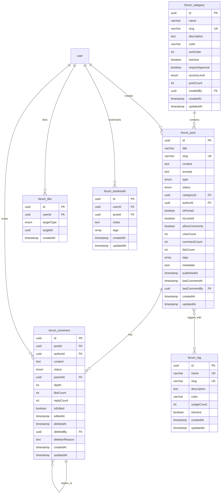
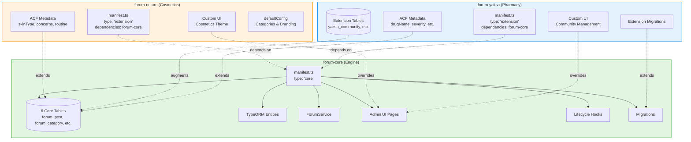
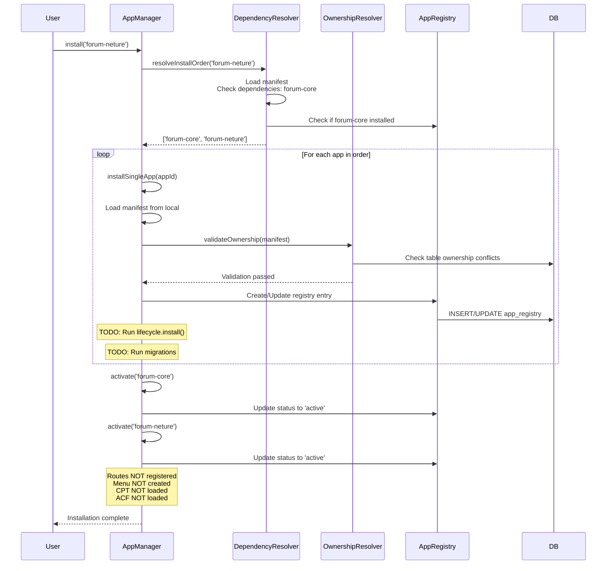

# Forum App Structure Summary

**Date**: 2025-11-29
**Investigation**: Core/Extension App Structure Audit
**Purpose**: Establish standard patterns for Dropshipping Core/Derived apps

---

## Executive Summary

The Forum app ecosystem demonstrates a **Core + Extension pattern** where:
- **forum-core**: Base engine owning all forum data tables (posts, categories, comments, tags)
- **forum-neture**: Cosmetics-specific extension adding metadata via ACF
- **forum-yaksa**: Pharmacy-specific extension with custom tables + ACF metadata

### Key Metrics

| Package | Source Files | Lines of Code | Type | Dependencies |
|---------|-------------|---------------|------|--------------|
| `forum-app` | 140 files | ~6,500 LOC | Core | none |
| `forum-neture` | 107 files | ~2,000 LOC | Extension | `forum-core >=1.0.0` |
| `forum-yaksa` | 118 files | ~3,500 LOC | Extension | `forum-core >=1.0.0` |

---

## 1. Forum Core App Structure

### Directory Tree

```
/packages/forum-app/
├── package.json                    # @o4o-apps/forum v0.1.0
├── tsconfig.json
├── src/
│   ├── manifest.ts                 # Core app manifest (135 lines)
│   ├── index.ts                    # Main export
│   │
│   ├── backend/
│   │   ├── entities/              # TypeORM entities (6 files)
│   │   │   ├── ForumPost.ts       # Post entity (162 lines)
│   │   │   ├── ForumCategory.ts   # Category entity (100 lines)
│   │   │   ├── ForumComment.ts    # Comment entity
│   │   │   ├── ForumTag.ts        # Tag entity
│   │   │   └── index.ts
│   │   │
│   │   └── services/              # Business logic (1 service)
│   │       ├── forum.service.ts   # Core service (613 lines)
│   │       └── index.ts
│   │
│   ├── admin-ui/                  # Admin interface
│   │   ├── api/
│   │   │   ├── forumClient.ts     # API client
│   │   │   └── index.ts
│   │   ├── pages/                 # 6 page components
│   │   │   ├── ForumApp.tsx       # Main dashboard (285 lines)
│   │   │   ├── ForumBoardList.tsx # Post list
│   │   │   ├── ForumPostDetail.tsx
│   │   │   ├── ForumPostForm.tsx
│   │   │   ├── ForumCategories.tsx
│   │   │   └── ForumReports.tsx
│   │   └── widgets/               # Reusable components
│   │       ├── ForumStatsCard.tsx
│   │       └── index.ts
│   │
│   ├── lifecycle/                 # Installation hooks
│   │   ├── install.ts             # Install hook (169 lines)
│   │   ├── activate.ts
│   │   ├── deactivate.ts
│   │   └── uninstall.ts           # Uninstall hook (134 lines)
│   │
│   └── migrations/                # Database migrations
│       └── 001-create-forum-tables.ts  # Creates 6 tables (554 lines)
```

### Core Tables Owned



---

## 2. Extension Pattern Structure

### Forum Neture (Cosmetics Extension)

```
/packages/forum-neture/
├── package.json                    # Depends on @o4o-apps/forum
├── src/
│   ├── manifest.ts                 # Extension manifest (104 lines)
│   ├── index.ts
│   │
│   ├── backend/
│   │   └── services/
│   │       └── NetureForumService.ts  # Extended service
│   │
│   └── admin-ui/
│       └── pages/
│           ├── ForumNetureApp.tsx     # Override main page
│           ├── NetureForumDashboard.tsx
│           ├── NetureForumPostDetail.tsx
│           └── NetureForumPostForm.tsx
```

**Extension Features**:
- No owned tables (pure extension)
- Extends `forum_post` via ACF metadata:
  - `skinType`: select (건성/지성/복합성/민감성)
  - `concerns`: multiselect (여드름/주름/미백/모공/탄력)
  - `routine`: array (routine steps)
  - `productIds`: array (related product IDs)
- Overrides admin UI with cosmetics-specific interface
- Provides `defaultConfig` with branded categories

### Forum Yaksa (Pharmacy Extension)

```
/packages/forum-yaksa/
├── package.json                    # Depends on @o4o-apps/forum
├── src/
│   ├── manifest.ts                 # Extension manifest (111 lines)
│   ├── index.ts
│   │
│   ├── backend/
│   │   ├── entities/              # Extension-specific tables
│   │   │   ├── YaksaCommunity.ts  # Community entity (67 lines)
│   │   │   └── YaksaCommunityMember.ts
│   │   └── services/
│   │       └── YaksaCommunityService.ts
│   │
│   ├── admin-ui/
│   │   └── pages/                 # 5 custom pages
│   │       ├── ForumYaksaApp.tsx
│   │       ├── YaksaCommunityDashboard.tsx
│   │       ├── YaksaCommunityDetail.tsx
│   │       ├── YaksaCommunityFeed.tsx
│   │       └── YaksaCommunityList.tsx
│   │
│   └── migrations/                # Extension migrations
│       ├── 001-create-yaksa-community-tables.ts
│       └── 002-add-require-approval-to-community.ts
```

**Extension Features**:
- Owns extension-specific tables:
  - `yaksa_forum_community`
  - `yaksa_forum_community_member`
- Extends `forum_post` via ACF metadata:
  - `drugName`: string
  - `drugCode`: string (EDI code)
  - `category`: select (복약지도/부작용/상호작용/조제)
  - `severity`: select (일반/주의/경고)
  - `caseStudy`: boolean
- Custom UI for community management
- Requires approval for posts (`requireApproval: true`)

---

## 3. Core vs Extension Relationship



---

## 4. Manifest Field Breakdown

### Core App Manifest Fields

```typescript
// forum-core/src/manifest.ts
{
  // Identity
  appId: 'forum-core',
  name: 'Forum Core',
  type: 'core',                    // Marks as core engine
  version: '1.0.0',
  description: '커뮤니티 포럼 코어 엔진',

  // Uninstall Policy
  uninstallPolicy: {
    defaultMode: 'keep-data',      // Default: preserve data
    allowPurge: true,              // Allow purge if requested
    autoBackup: true               // Create backup before uninstall
  },

  // Data Ownership (CRITICAL)
  ownsTables: [
    'forum_post',
    'forum_category',
    'forum_comment',
    'forum_tag',
    'forum_like',
    'forum_bookmark'
  ],

  // CPT Definitions
  cpt: [
    {
      name: 'forum_post',
      storage: 'entity',           // Uses TypeORM entity
      primaryKey: 'id',
      label: '포럼 게시글',
      supports: ['title', 'content', 'author', 'categories', 'tags', 'comments']
    },
    // ... 3 more CPT definitions
  ],

  // ACF Groups (core provides base)
  acf: [],                         // Empty - extensions add ACF

  // Routes
  routes: [
    '/admin/forum',
    '/admin/forum/posts',
    '/admin/forum/posts/:id',
    '/admin/forum/posts/:id/edit',
    '/admin/forum/posts/new',
    '/admin/forum/categories',
    '/admin/forum/reports'
  ],

  // Permissions
  permissions: [
    'forum.read',
    'forum.write',
    'forum.comment',
    'forum.moderate',
    'forum.admin'
  ],

  // Lifecycle Hooks
  lifecycle: {
    install: './lifecycle/install.js',
    activate: './lifecycle/activate.js',
    deactivate: './lifecycle/deactivate.js',
    uninstall: './lifecycle/uninstall.js'
  },

  // Installation Options
  installOptions: {
    adoptExistingTables: true,     // Adopt existing tables
    keepDataOnUninstall: true      // Default keep mode
  },

  // Menu Definition
  menu: {
    id: 'forum',
    label: '포럼',
    icon: 'MessageSquare',
    path: '/forum',
    position: 100,
    children: [ /* 4 menu items */ ]
  }
}
```

### Extension Manifest Fields

```typescript
// forum-neture/src/manifest.ts
{
  // Identity
  appId: 'forum-neture',
  name: 'Forum Extension – Neture Cosmetics',
  type: 'extension',               // Marks as extension
  version: '1.0.0',

  // Core Dependency (CRITICAL)
  dependencies: {
    'forum-core': '>=1.0.0'        // Requires forum-core
  },

  // Uninstall Policy
  uninstallPolicy: {
    defaultMode: 'keep-data',
    allowPurge: true,
    autoBackup: false              // Extension data less critical
  },

  // Extension Tables
  ownsTables: [],                  // No tables owned (pure extension)

  // Extend Core CPT
  extendsCPT: [
    {
      name: 'forum_post',          // Extend forum_post
      acfGroup: 'cosmetic_meta'    // Add ACF group
    }
  ],

  // ACF Metadata
  acf: [
    {
      groupId: 'cosmetic_meta',
      label: '화장품 메타데이터',
      fields: [
        { key: 'skinType', type: 'select', label: '피부 타입', options: [...] },
        { key: 'concerns', type: 'multiselect', label: '피부 고민', options: [...] },
        { key: 'routine', type: 'array', label: '루틴 단계' },
        { key: 'productIds', type: 'array', label: '관련 제품 ID' }
      ]
    }
  ],

  // Admin UI Override
  adminRoutes: [
    {
      path: '/admin/forum',
      component: './admin-ui/pages/ForumNetureApp.js'
    }
  ],

  // Default Configuration
  defaultConfig: {
    categories: [
      { name: '공지사항', slug: 'announcements', color: '#FF6B6B' },
      { name: '사용후기', slug: 'reviews', color: '#4ECDC4' },
      // ... 2 more categories
    ],
    skin: 'neture',
    brandColor: '#8B7355',
    accentColor: '#E8B4B8'
  },

  // Inherit Permissions
  permissions: [],                 // Inherit from core

  // Use Core Menu
  menu: null                       // Use core menu with theme
}
```

---

## 5. Installation Flow (Current Behavior)



---

## 6. What Works vs What Doesn't

### ✅ Currently Working

| Feature | Status | Evidence |
|---------|--------|----------|
| Dependency Resolution | ✅ Working | `AppDependencyResolver` resolves install order |
| Ownership Validation | ✅ Working | `AppTableOwnershipResolver` prevents conflicts |
| Registry Management | ✅ Working | `AppRegistry` tracks installed apps |
| Manifest Loading | ✅ Working | `loadLocalManifest()` loads manifests |
| Install/Uninstall | ✅ Working | Basic install/uninstall flow complete |
| Data Purge | ✅ Working | `AppDataCleaner` purges tables on uninstall |

### ❌ Not Working (Disconnected)

| Feature | Status | Issue |
|---------|--------|-------|
| Lifecycle Hooks | ❌ Not Executed | TODO comment in AppManager line 136, 321 |
| Migrations | ❌ Not Executed | TODO comment in AppManager line 137 |
| CPT Registration | ❌ Not Loaded | No CPT loader in AppManager |
| ACF System | ❌ Not Loaded | No ACF processor in AppManager |
| Route Registration | ❌ Hardcoded | Routes declared but not registered |
| Menu Creation | ❌ Not Created | Menu declared but not processed |
| Admin UI Loading | ❌ Not Dynamic | UI components not loaded from manifest |

---

## 7. Key Takeaways for Dropshipping Apps

### Core App Requirements

1. **Must declare `type: 'core'`**
2. **Must list ALL owned tables in `ownsTables`**
3. **Must define CPT schemas** (even if not loaded yet)
4. **Must provide lifecycle hooks** (install/activate/deactivate/uninstall)
5. **Must provide migrations** to create tables
6. **Should define permissions**
7. **Should define menu structure**

### Extension App Requirements

1. **Must declare `type: 'extension'`**
2. **Must declare dependency on core app** in `dependencies`
3. **Can own extension-specific tables** (list in `ownsTables`)
4. **Must use `extendsCPT` to add metadata** to core CPTs
5. **Must define ACF groups** for metadata fields
6. **Can override admin UI** via `adminRoutes`
7. **Should provide `defaultConfig`** for service-specific settings
8. **Should NOT duplicate core functionality**

### Critical Pattern: Separation of Concerns

```
CORE owns:
- Base tables (forum_post, forum_category, etc.)
- Core business logic (ForumService)
- Base admin UI
- Permissions
- Migrations

EXTENSION adds:
- Metadata to core tables (via ACF)
- Extension-specific tables (yaksa_community)
- Custom UI (override core pages)
- Service-specific configuration
- Extension migrations (if needed)

EXTENSION does NOT:
- Own core tables
- Modify core table schemas
- Delete core data
```

---

## Next Steps

See the detailed investigation report and patterns document for:
- Complete manifest field analysis
- Code-level implementation details
- Exact patterns for Dropshipping apps
- Installation testing scenarios
