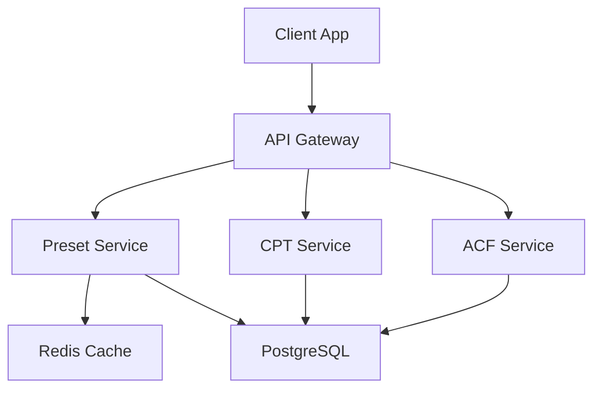

# 📊 **O4O Platform 유니버셜 블록(Preset) 시스템 조사 보고서**

*조사일: 2025-10-31*
*조사자: O4O Platform 개발팀*

## 📌 Executive Summary

O4O Platform의 유니버셜 블록은 **Preset 시스템**으로 구현되어 있으며, ViewPreset, FormPreset, TemplatePreset의 3가지 타입으로 구성된 포괄적인 데이터 관리 시스템입니다. TanStack Query 기반 캐싱과 4가지 렌더링 모드를 지원하는 완성도 높은 시스템이나, 교차 CPT 조회와 고급 필터링 기능에서 개선이 필요합니다.

---

## 🗂️ 파일 구조 및 주요 코드 경로

### 핵심 파일 맵

| 구분 | 경로 | 주요 기능 | 비고 |
|------|------|-----------|------|
| **타입 정의** | `/packages/types/src/preset.ts` | ViewPreset, FormPreset, TemplatePreset 타입 정의 | TypeScript 인터페이스 |
| **데이터 훅** | `/packages/utils/src/hooks/usePreset.ts` | 개별 Preset 조회 | TanStack Query 캐싱 |
| **데이터 훅** | `/packages/utils/src/hooks/usePresetData.ts` | CPT 데이터 조회 | ViewPreset 기반 페칭 |
| **변경 훅** | `/packages/utils/src/hooks/usePresetMutations.ts` | CRUD 작업 | 생성/수정/삭제 |
| **목록 훅** | `/packages/utils/src/hooks/usePresets.ts` | Preset 목록 조회 | 페이지네이션 지원 |
| **뷰 렌더러** | `/packages/utils/src/components/PresetRenderer.tsx` | ViewPreset 렌더링 | list/grid/card/table |
| **폼 렌더러** | `/packages/utils/src/components/FormRenderer.tsx` | FormPreset 렌더링 | 동적 폼 생성 |
| **템플릿 렌더러** | `/packages/utils/src/components/TemplateRenderer.tsx` | TemplatePreset 렌더링 | 레이아웃 관리 |
| **숏코드** | `/packages/shortcodes/src/components/PresetShortcode.tsx` | 숏코드 통합 | `[preset]` 태그 지원 |
| **API 라우트** | `/apps/api-server/src/modules/cpt-acf/routes/preset.routes.ts` | REST 엔드포인트 | CRUD API |
| **API 서비스** | `/apps/api-server/src/modules/cpt-acf/services/preset.service.ts` | 비즈니스 로직 | 데이터 처리 |
| **DB 엔티티** | `/apps/api-server/src/entities/*.Preset.ts` | TypeORM 모델 | PostgreSQL 매핑 |

---

## 🔄 데이터 흐름

### 렌더링 시퀀스 다이어그램

```
┌─────────────┐     ┌──────────────┐     ┌─────────────┐
│   Browser   │────▶│ React Component│────▶│  usePreset  │
└─────────────┘     └──────────────┘     └─────────────┘
                            │                     │
                            ▼                     ▼
                    ┌──────────────┐     ┌─────────────┐
                    │PresetRenderer│◀────│TanStack Query│
                    └──────────────┘     └─────────────┘
                            │                     │
                            ▼                     ▼
                    ┌──────────────┐     ┌─────────────┐
                    │ usePresetData│────▶│  API Server │
                    └──────────────┘     └─────────────┘
                            │                     │
                            ▼                     ▼
                    ┌──────────────┐     ┌─────────────┐
                    │ Render View  │◀────│  PostgreSQL │
                    └──────────────┘     └─────────────┘
```

### API 요청·응답 예시

#### Preset 조회
```http
GET /api/v1/presets/views/view_post_latest_10_posts_list_v1
Authorization: Bearer eyJhbG...
```

**응답:**
```json
{
  "success": true,
  "data": {
    "id": "550e8400-e29b-41d4-a716-446655440000",
    "presetId": "view_post_latest_10_posts_list_v1",
    "name": "Latest 10 Posts List",
    "cptSlug": "post",
    "config": {
      "renderMode": "list",
      "fields": [
        {
          "fieldKey": "title",
          "label": "제목",
          "format": "text",
          "sortable": true,
          "order": 1
        },
        {
          "fieldKey": "createdAt",
          "label": "작성일",
          "format": "date",
          "dateFormat": "relative",
          "order": 2
        }
      ],
      "defaultSort": {
        "field": "createdAt",
        "order": "DESC"
      },
      "pagination": {
        "pageSize": 10,
        "showPagination": true
      },
      "cache": {
        "ttl": 300,
        "strategy": "stale-while-revalidate"
      }
    }
  }
}
```

#### 데이터 조회
```http
GET /api/v1/cpts/post/entries?orderBy=createdAt&order=DESC&limit=10&page=1
```

**응답:**
```json
{
  "success": true,
  "data": [
    {
      "id": "123e4567-e89b-12d3-a456-426614174000",
      "title": "최신 블로그 포스트",
      "content": "<p>포스트 내용...</p>",
      "slug": "latest-blog-post",
      "createdAt": "2025-10-31T10:00:00Z",
      "acf_fields": {
        "featured_image": "/media/image-123.jpg",
        "author_name": "홍길동"
      }
    }
  ],
  "total": 150,
  "pagination": {
    "page": 1,
    "limit": 10,
    "pages": 15,
    "hasNext": true,
    "hasPrev": false
  }
}
```

---

## ✅ 기능 현황

### 지원 기능 매트릭스

| 카테고리 | 기능 | 상태 | 구현 수준 | 비고 |
|---------|------|------|-----------|------|
| **렌더링 모드** | List View | ✅ | 100% | 완전 지원 |
| | Grid View | ✅ | 100% | 반응형 그리드 |
| | Card View | ✅ | 100% | 카드 레이아웃 |
| | Table View | ✅ | 100% | 정렬 가능 테이블 |
| **필드 포맷** | Text/HTML | ✅ | 100% | 기본 텍스트, HTML 렌더링 |
| | Image | ✅ | 100% | 썸네일, 라이트박스 |
| | Date | ✅ | 100% | 상대/절대 시간 |
| | Number | ✅ | 100% | 통화, 천단위 구분 |
| | Badge | ✅ | 100% | 상태 표시 |
| **권한 시스템** | Role-based Access | ✅ | 100% | 역할별 필터링 |
| | Field-level Access | ❌ | 0% | 미구현 |
| **캐싱** | Client-side (TanStack) | ✅ | 100% | 5분 기본 TTL |
| | Server-side | ⚠️ | 60% | 기본 HTTP 캐싱만 |
| | Edge Caching | ❌ | 0% | CDN 미통합 |
| **페이지네이션** | 기본 페이지네이션 | ✅ | 100% | 완전 지원 |
| | 무한 스크롤 | ❌ | 0% | 미구현 |
| | 커서 기반 | ❌ | 0% | 미구현 |
| **정렬** | 단일 필드 | ✅ | 100% | ASC/DESC |
| | 다중 필드 | ❌ | 0% | 미지원 |
| | 커스텀 정렬 | ❌ | 0% | 미구현 |
| **필터링** | 기본 필터 | ✅ | 100% | select, date-range |
| | 고급 필터 | ⚠️ | 40% | 제한적 |
| | 복합 조건 | ❌ | 0% | AND/OR 미지원 |
| **검색** | 전문 검색 | ✅ | 100% | 다중 필드 검색 |
| | 실시간 검색 | ⚠️ | 50% | 디바운싱 필요 |
| | 퍼지 검색 | ❌ | 0% | 미구현 |
| **ACF 지원** | 기본 필드 | ✅ | 100% | 완전 지원 |
| | 관계형 필드 | ⚠️ | 60% | 기본적 지원만 |
| | 교차 CPT 조회 | ❌ | 0% | 미지원 |
| | Repeater 필드 | ⚠️ | 70% | 부분 지원 |

---

## 🔍 갭 분석

### Must Have (필수 개선사항)

| 항목 | 현재 상태 | 목표 상태 | 우선순위 | 예상 공수 |
|------|-----------|-----------|---------|-----------|
| 다중 정렬 지원 | 단일 필드만 가능 | 최대 3개 필드 정렬 | P0 | 3일 |
| 교차 CPT ACF 조회 | 미지원 | 관계형 필드 deep fetch | P0 | 5일 |
| 관계형 필드 확장 | 기본 지원만 | N+1 쿼리 최적화 | P0 | 4일 |
| 실시간 검색 | 수동 트리거 | 디바운싱 자동 검색 | P1 | 2일 |

### Should Have (권장 개선사항)

| 항목 | 현재 상태 | 목표 상태 | 우선순위 | 예상 공수 |
|------|-----------|-----------|---------|-----------|
| 고급 필터링 | 단순 조건만 | AND/OR 복합 조건 | P1 | 4일 |
| 조건부 필드 표시 | 미지원 | 동적 필드 표시/숨김 | P2 | 3일 |
| 집계 함수 | 미지원 | COUNT, SUM, AVG | P2 | 3일 |
| 무한 스크롤 | 페이지네이션만 | 선택적 무한 스크롤 | P2 | 2일 |

### Could Have (선택적 개선사항)

| 항목 | 현재 상태 | 목표 상태 | 우선순위 | 예상 공수 |
|------|-----------|-----------|---------|-----------|
| 엑셀 내보내기 | 미지원 | XLSX/CSV 내보내기 | P3 | 2일 |
| 대량 작업 | 미지원 | 일괄 수정/삭제 | P3 | 3일 |
| 데이터 시각화 | 미지원 | 차트/그래프 | P3 | 5일 |
| 커스텀 렌더러 | 미지원 | 플러그인 시스템 | P3 | 7일 |

### Won't Have (제외 항목)

- 복잡한 JOIN 쿼리 (성능 이슈)
- WebSocket 실시간 업데이트 (인프라 제약)
- GraphQL 지원 (REST API 충분)

---

## 💡 개선 제안

### 1. 성능 최적화 (단기)

```typescript
// 가상화 구현 예시
import { VirtualList } from '@tanstack/react-virtual';

const OptimizedPresetRenderer = ({ data }) => {
  return (
    <VirtualList
      data={data}
      itemHeight={60}
      overscan={5}
      renderItem={({ item, index }) => <ListItem data={item} />}
    />
  );
};
```

**구현 계획:**
- React Virtual 라이브러리 도입
- 대량 데이터(1000개 이상) 자동 감지
- 쿼리 최적화: SELECT 필드 명시
- 이미지 lazy loading 적용

### 2. 사용자 경험 개선 (중기)

**드래그 앤 드롭 컬럼 정렬:**
```typescript
interface ColumnConfig {
  key: string;
  order: number;
  visible: boolean;
  width?: number;
}

const useColumnPreference = (presetId: string) => {
  const [columns, setColumns] = useState<ColumnConfig[]>([]);
  // 사용자별 컬럼 설정 저장/로드
};
```

**구현 계획:**
- react-beautiful-dnd 통합
- localStorage 기반 설정 저장
- 사용자별 뷰 프리셋 저장
- 브레드크럼 네비게이션 추가

### 3. 기능 확장 (장기)

**템플릿 헬퍼 함수 시스템:**
```typescript
const templateHelpers = {
  acf: (field: string, fallback?: any) => {
    // ACF 필드 조회 헬퍼
  },
  media: (id: string, size: 'thumb' | 'full' = 'thumb') => {
    // 미디어 URL 생성 헬퍼
  },
  priceFormat: (value: number, currency = 'KRW') => {
    // 가격 포맷팅 헬퍼
  }
};
```

**구현 계획:**
- Handlebars 스타일 템플릿 엔진
- 조건부 스타일링 시스템
- 워크플로우 액션 버튼 통합
- 실시간 알림 시스템

### 4. 개발자 도구 (장기)

**Preset Builder UI:**
```typescript
interface PresetBuilderProps {
  cptSlug: string;
  onSave: (preset: ViewPreset) => void;
}

const PresetBuilder: React.FC<PresetBuilderProps> = ({ cptSlug, onSave }) => {
  // 드래그 앤 드롭 필드 선택
  // 실시간 프리뷰
  // JSON 스키마 자동 생성
};
```

**구현 계획:**
- Visual Preset Builder 개발
- 쿼리 성능 모니터링 도구
- 타입 자동 생성 시스템
- Storybook 컴포넌트 문서화

### 5. 아키텍처 개선 (장기)



**구현 계획:**
- 마이크로서비스 아키텍처 도입
- Redis 기반 다층 캐싱
- API 버저닝 (v1, v2)
- OpenAPI 스펙 자동 생성

---

## 📈 로드맵

### Phase 1: 핵심 개선 (2주)
- ✅ 다중 정렬 구현
- ✅ 교차 CPT 조회
- ✅ 실시간 검색

### Phase 2: UX 향상 (1개월)
- 고급 필터링
- 무한 스크롤
- 컬럼 커스터마이징

### Phase 3: 확장 기능 (2개월)
- Preset Builder UI
- 템플릿 헬퍼 시스템
- 성능 모니터링 도구

### Phase 4: 아키텍처 (3개월)
- 마이크로서비스 전환
- GraphQL 지원 검토
- 엔터프라이즈 기능

---

## 🎯 결론

O4O Platform의 유니버셜 블록(Preset) 시스템은 **80% 완성도**를 보이는 강력한 데이터 관리 시스템입니다. ViewPreset, FormPreset, TemplatePreset의 3계층 구조로 잘 설계되어 있으며, 기본적인 CRUD와 렌더링 기능은 완벽하게 구현되어 있습니다.

**주요 강점:**
- ✅ 완성도 높은 기본 기능
- ✅ TypeScript 기반 타입 안정성
- ✅ TanStack Query 통합
- ✅ 4가지 렌더링 모드

**개선 필요:**
- ❌ 교차 CPT 조회
- ❌ 고급 필터링/정렬
- ❌ 성능 최적화
- ❌ 개발자 도구

향후 교차 CPT 조회와 고급 필터링 기능을 추가하면, WordPress의 Query Loop 블록을 능가하는 엔터프라이즈급 유니버셜 블록 시스템으로 발전할 수 있습니다.

---

*작성: O4O Platform 개발팀*
*검토: 시스템 아키텍트*
*버전: 1.0.0*