# 사용자 관리 데이터 모델

**작성일**: 2025-11-08
**작성자**: Claude Code
**목적**: 사용자 관리 시스템의 데이터베이스 스키마 및 엔티티 구조 문서화

---

## 1. ERD 개요

### 1.1 핵심 테이블 관계도 (Mermaid)

```mermaid
erDiagram
    users ||--o{ user_roles : "has many"
    users ||--o{ refresh_tokens : "has many"
    users ||--o{ password_reset_tokens : "has many"
    users ||--o{ email_verification_tokens : "has many"
    users ||--o{ linked_accounts : "has many"
    users ||--o{ linking_sessions : "has many"
    users ||--o{ account_activities : "has many"
    users ||--o{ user_activity_logs : "has many"
    users ||--o{ approval_logs : "has (user)"
    users ||--o{ approval_logs : "performed by (admin)"
    users ||--o{ audit_logs : "performed by"
    users ||--o{ login_attempts : "attempted by"
    users }o--|| roles : "active role"

    roles ||--o{ user_roles : "assigned to"
    roles ||--o{ role_permissions : "has many"
    permissions ||--o{ role_permissions : "granted to"

    users {
        uuid id PK
        varchar email UK
        varchar password
        varchar firstName
        varchar lastName
        varchar name
        varchar avatar
        enum status
        json businessInfo
        enum role "legacy single role"
        simple-array roles "legacy multiple roles"
        uuid active_role_id FK
        json permissions "direct permissions"
        boolean isActive
        boolean isEmailVerified
        varchar refreshTokenFamily
        timestamp lastLoginAt
        varchar lastLoginIp
        integer loginAttempts
        timestamp lockedUntil
        varchar betaUserId
        varchar domain
        timestamp approvedAt
        varchar approvedBy
        varchar provider "OAuth provider"
        varchar provider_id "OAuth ID"
        varchar reset_password_token
        timestamp reset_password_expires
        timestamp createdAt
        timestamp updatedAt
    }

    roles {
        uuid id PK
        varchar name UK
        varchar displayName
        text description
        boolean isActive
        boolean isSystem
        timestamp createdAt
        timestamp updatedAt
    }

    permissions {
        uuid id PK
        varchar key UK
        varchar description
        varchar category
        boolean isActive
        timestamp createdAt
        timestamp updatedAt
    }

    user_roles {
        uuid user_id FK
        uuid role_id FK
    }

    role_permissions {
        uuid role_id FK
        uuid permission_id FK
    }

    refresh_tokens {
        uuid id PK
        varchar token UK
        uuid userId FK
        timestamp expiresAt
        varchar deviceId
        varchar userAgent
        varchar ipAddress
        boolean revoked
        timestamp revokedAt
        varchar revokedReason
        timestamp createdAt
        timestamp updatedAt
    }

    password_reset_tokens {
        uuid id PK
        varchar token UK
        uuid userId FK
        timestamp expiresAt
        varchar email
        timestamp usedAt
        timestamp createdAt
    }

    email_verification_tokens {
        uuid id PK
        varchar token UK
        uuid userId FK
        timestamp expiresAt
        varchar email
        timestamp usedAt
        timestamp createdAt
    }

    linked_accounts {
        uuid id PK
        uuid userId FK
        enum provider
        varchar providerId
        varchar email
        varchar displayName
        varchar profileImage
        boolean isVerified
        boolean isPrimary
        json providerData
        timestamp lastUsedAt
        timestamp linkedAt
        timestamp updatedAt
    }

    linking_sessions {
        uuid id PK
        uuid userId FK
        enum provider
        enum status
        varchar verificationToken UK
        timestamp expiresAt
        json metadata
        timestamp createdAt
    }

    account_activities {
        uuid id PK
        uuid userId FK
        enum action
        enum provider
        varchar ipAddress
        varchar userAgent
        json metadata
        timestamp createdAt
    }

    user_activity_logs {
        uuid id PK
        uuid userId FK
        enum activityType
        enum activityCategory
        varchar title
        text description
        varchar ipAddress
        text userAgent
        json metadata
        boolean isSystemGenerated
        uuid performedByUserId FK
        timestamp createdAt
    }

    approval_logs {
        uuid id PK
        uuid user_id FK
        uuid admin_id FK
        enum action
        varchar previous_status
        varchar new_status
        text notes
        jsonb metadata
        timestamp created_at
        timestamp updated_at
    }

    audit_logs {
        uuid id PK
        varchar entityType
        uuid entityId
        varchar action
        uuid userId FK
        jsonb changes
        text reason
        varchar ipAddress
        text userAgent
        timestamp createdAt
    }

    login_attempts {
        uuid id PK
        varchar email
        varchar ipAddress
        varchar userAgent
        boolean successful
        varchar failureReason
        varchar deviceId
        varchar location
        timestamp attemptedAt
    }
```



### 1.2 핵심 관계 요약

- **Users ↔ Roles**: ManyToMany (user_roles 조인 테이블)
- **Roles ↔ Permissions**: ManyToMany (role_permissions 조인 테이블)
- **Users → Active Role**: ManyToOne (active_role_id FK)
- **Users → Tokens**: OneToMany (CASCADE DELETE)
- **Users → Accounts**: OneToMany (CASCADE DELETE)
- **Users → Logs**: OneToMany (일부 SET NULL)

---

## 2. 테이블 상세

### 2.1 users 테이블

**목적**: 시스템의 핵심 사용자 정보 저장

#### 컬럼 목록

| 컬럼명 | 타입 | NULL | 기본값 | 설명 |
|--------|------|------|--------|------|
| id | uuid | NO | uuid_generate_v4() | 기본 키 |
| email | varchar(255) | NO | - | 이메일 (유니크) |
| password | varchar(255) | NO | - | bcrypt 해시 비밀번호 |
| firstName | varchar(100) | YES | NULL | 이름 |
| lastName | varchar(100) | YES | NULL | 성 |
| name | varchar(200) | YES | NULL | 전체 이름 |
| avatar | varchar(500) | YES | NULL | 프로필 이미지 URL |
| status | enum | NO | 'pending' | 계정 상태 (active, inactive, pending, approved, suspended, rejected) |
| businessInfo | json | YES | NULL | 비즈니스 정보 (companyName, taxId, address 등) |
| role | enum | NO | 'customer' | 레거시 단일 역할 |
| roles | simple-array | NO | 'customer' | 레거시 다중 역할 배열 |
| active_role_id | uuid | YES | NULL | 현재 활성 역할 FK (roles.id) |
| permissions | json | NO | '[]' | 직접 부여된 권한 배열 |
| isActive | boolean | NO | true | 활성 상태 |
| isEmailVerified | boolean | NO | false | 이메일 인증 여부 |
| refreshTokenFamily | varchar(255) | YES | NULL | 토큰 계열 관리 |
| lastLoginAt | timestamp | YES | NULL | 마지막 로그인 시각 |
| lastLoginIp | varchar(50) | YES | NULL | 마지막 로그인 IP |
| loginAttempts | integer | NO | 0 | 로그인 시도 횟수 |
| lockedUntil | timestamp | YES | NULL | 계정 잠금 해제 시각 |
| betaUserId | varchar(255) | YES | NULL | 베타 기능용 사용자 ID |
| domain | varchar(255) | YES | NULL | 멀티테넌트 도메인 |
| approvedAt | timestamp | YES | NULL | 승인 시각 |
| approvedBy | varchar(255) | YES | NULL | 승인 관리자 ID |
| provider | varchar(100) | YES | NULL | OAuth 제공자 (local, google, kakao) |
| provider_id | varchar(255) | YES | NULL | OAuth 제공자 사용자 ID |
| reset_password_token | varchar(255) | YES | NULL | 비밀번호 재설정 토큰 |
| reset_password_expires | timestamp | YES | NULL | 토큰 만료 시각 |
| createdAt | timestamp | NO | CURRENT_TIMESTAMP | 생성 시각 |
| updatedAt | timestamp | NO | CURRENT_TIMESTAMP | 수정 시각 |

#### 인덱스

```sql
-- 유니크 인덱스
CREATE UNIQUE INDEX ON users(email);

-- 일반 인덱스
CREATE INDEX ON users(role);
CREATE INDEX ON users(isActive);
CREATE INDEX ON users(active_role_id);
```

#### 제약조건

- **PK**: `id` (uuid)
- **UK**: `email` (varchar)
- **FK**: `active_role_id` → `roles(id)` ON DELETE SET NULL
- **ENUM**:
  - `role`: super_admin, admin, vendor, seller, customer, business, moderator, partner, supplier, manager
  - `status`: active, inactive, pending, approved, suspended, rejected

#### 관련 엔티티 파일

- `/home/sohae21/o4o-platform/apps/api-server/src/entities/User.ts`
- `/home/sohae21/o4o-platform/apps/api-server/src/types/auth.ts`

#### 비즈니스 로직

- **비밀번호 해싱**: `@BeforeInsert`, `@BeforeUpdate`에서 bcrypt 자동 해싱
- **계정 잠금**: 15분 내 5회 실패 시 15분~1시간 잠금 (LoginAttempt 엔티티 로직)
- **권한 계산**: `getAllPermissions()` - dbRoles + direct permissions 병합
- **역할 확인**: 레거시(role, roles) + 신규(dbRoles, activeRole) 병행 지원

---

### 2.2 roles 테이블

**목적**: 역할 기반 접근 제어 (RBAC) 역할 정의

#### 컬럼 목록

| 컬럼명 | 타입 | NULL | 기본값 | 설명 |
|--------|------|------|--------|------|
| id | uuid | NO | uuid_generate_v4() | 기본 키 |
| name | varchar(50) | NO | - | 역할 이름 (유니크, 예: admin, seller) |
| displayName | varchar(100) | NO | - | UI 표시용 이름 |
| description | text | YES | NULL | 역할 설명 |
| isActive | boolean | NO | true | 활성 상태 |
| isSystem | boolean | NO | false | 시스템 역할 (삭제 불가) |
| createdAt | timestamp | NO | CURRENT_TIMESTAMP | 생성 시각 |
| updatedAt | timestamp | NO | CURRENT_TIMESTAMP | 수정 시각 |

#### 인덱스

```sql
CREATE UNIQUE INDEX ON roles(name);
CREATE INDEX ON roles(isActive);
```

#### 제약조건

- **PK**: `id` (uuid)
- **UK**: `name` (varchar)

#### 관련 엔티티 파일

- `/home/sohae21/o4o-platform/apps/api-server/src/entities/Role.ts`

#### 비즈니스 로직

- **권한 확인**: `hasPermission(key)`, `hasAnyPermission(keys)`, `hasAllPermissions(keys)`
- **활성 권한**: `getActivePermissions()` - isActive=true 필터링
- **시스템 역할 보호**: isSystem=true 역할은 삭제 불가

---

### 2.3 permissions 테이블

**목적**: 세분화된 권한 정의 (users.view, content.create 등)

#### 컬럼 목록

| 컬럼명 | 타입 | NULL | 기본값 | 설명 |
|--------|------|------|--------|------|
| id | uuid | NO | uuid_generate_v4() | 기본 키 |
| key | varchar(100) | NO | - | 권한 키 (유니크, 예: users.create) |
| description | varchar(255) | NO | - | 권한 설명 |
| category | varchar(50) | NO | - | 카테고리 (users, content, admin 등) |
| isActive | boolean | NO | true | 활성 상태 |
| createdAt | timestamp | NO | CURRENT_TIMESTAMP | 생성 시각 |
| updatedAt | timestamp | NO | CURRENT_TIMESTAMP | 수정 시각 |

#### 인덱스

```sql
CREATE UNIQUE INDEX ON permissions(key);
CREATE INDEX ON permissions(category);
CREATE INDEX ON permissions(isActive);
```

#### 제약조건

- **PK**: `id` (uuid)
- **UK**: `key` (varchar)

#### 관련 엔티티 파일

- `/home/sohae21/o4o-platform/apps/api-server/src/entities/Permission.ts`

#### 비즈니스 로직

- **키 파싱**: `parseKey(key)` - "category.action" 형식 분리
- **권한 명명 규칙**: `{resource}.{action}` (예: users.view, content.create)

---

### 2.4 user_roles 테이블

**목적**: Users ↔ Roles 다대다 관계 조인 테이블

#### 컬럼 목록

| 컬럼명 | 타입 | NULL | 기본값 | 설명 |
|--------|------|------|--------|------|
| user_id | uuid | NO | - | 사용자 FK |
| role_id | uuid | NO | - | 역할 FK |

#### 인덱스

```sql
CREATE INDEX ON user_roles(user_id);
CREATE INDEX ON user_roles(role_id);
CREATE UNIQUE INDEX ON user_roles(user_id, role_id);
```

#### 제약조건

- **PK**: (user_id, role_id) 복합 키
- **FK**:
  - `user_id` → `users(id)` ON DELETE CASCADE
  - `role_id` → `roles(id)` ON DELETE CASCADE

#### 마이그레이션

- `/home/sohae21/o4o-platform/apps/api-server/src/migrations/1735000000000-AddUserRolesAndApprovalLogs.ts`

---

### 2.5 role_permissions 테이블

**목적**: Roles ↔ Permissions 다대다 관계 조인 테이블

#### 컬럼 목록

| 컬럼명 | 타입 | NULL | 기본값 | 설명 |
|--------|------|------|--------|------|
| role_id | uuid | NO | - | 역할 FK |
| permission_id | uuid | NO | - | 권한 FK |

#### 인덱스

```sql
CREATE INDEX ON role_permissions(role_id);
CREATE INDEX ON role_permissions(permission_id);
CREATE UNIQUE INDEX ON role_permissions(role_id, permission_id);
```

#### 제약조건

- **PK**: (role_id, permission_id) 복합 키
- **FK**:
  - `role_id` → `roles(id)` ON DELETE CASCADE
  - `permission_id` → `permissions(id)` ON DELETE CASCADE

---

### 2.6 refresh_tokens 테이블

**목적**: JWT 리프레시 토큰 관리 및 토큰 계열 추적

#### 컬럼 목록

| 컬럼명 | 타입 | NULL | 기본값 | 설명 |
|--------|------|------|--------|------|
| id | uuid | NO | uuid_generate_v4() | 기본 키 |
| token | varchar | NO | - | 리프레시 토큰 (유니크) |
| userId | uuid | NO | - | 사용자 FK |
| expiresAt | timestamp | NO | - | 토큰 만료 시각 |
| deviceId | varchar | YES | NULL | 디바이스 식별자 |
| userAgent | varchar | YES | NULL | 사용자 에이전트 |
| ipAddress | varchar | YES | NULL | IP 주소 |
| revoked | boolean | NO | false | 취소 여부 |
| revokedAt | timestamp | YES | NULL | 취소 시각 |
| revokedReason | varchar | YES | NULL | 취소 사유 |
| createdAt | timestamp | NO | CURRENT_TIMESTAMP | 생성 시각 |
| updatedAt | timestamp | NO | CURRENT_TIMESTAMP | 수정 시각 |

#### 인덱스

```sql
CREATE UNIQUE INDEX ON refresh_tokens(token);
CREATE INDEX ON refresh_tokens(userId, family);
```

#### 제약조건

- **PK**: `id` (uuid)
- **UK**: `token` (varchar)
- **FK**: `userId` → `users(id)` ON DELETE CASCADE

#### 관련 엔티티 파일

- `/home/sohae21/o4o-platform/apps/api-server/src/entities/RefreshToken.ts`
- 마이그레이션: `create-refresh-tokens-table.ts`

#### 비즈니스 로직

- **토큰 검증**: `isValid()` - 만료되지 않고 취소되지 않은 토큰
- **토큰 계열 보호**: 토큰 재사용 감지 시 전체 계열 무효화

---

### 2.7 password_reset_tokens 테이블

**목적**: 비밀번호 재설정 토큰 관리

#### 컬럼 목록

| 컬럼명 | 타입 | NULL | 기본값 | 설명 |
|--------|------|------|--------|------|
| id | uuid | NO | uuid_generate_v4() | 기본 키 |
| token | varchar | NO | - | 재설정 토큰 (유니크) |
| userId | uuid | NO | - | 사용자 FK |
| expiresAt | timestamp | NO | - | 토큰 만료 시각 |
| email | varchar | NO | - | 이메일 주소 |
| usedAt | timestamp | YES | NULL | 사용 시각 |
| createdAt | timestamp | NO | CURRENT_TIMESTAMP | 생성 시각 |

#### 인덱스

```sql
CREATE UNIQUE INDEX ON password_reset_tokens(token);
CREATE INDEX ON password_reset_tokens(userId, createdAt);
```

#### 제약조건

- **PK**: `id` (uuid)
- **UK**: `token` (varchar)
- **FK**: `userId` → `users(id)` ON DELETE CASCADE

#### 관련 엔티티 파일

- `/home/sohae21/o4o-platform/apps/api-server/src/entities/PasswordResetToken.ts`
- 마이그레이션: `create-email-tokens-tables.ts`

---

### 2.8 email_verification_tokens 테이블

**목적**: 이메일 인증 토큰 관리

#### 컬럼 목록

| 컬럼명 | 타입 | NULL | 기본값 | 설명 |
|--------|------|------|--------|------|
| id | uuid | NO | uuid_generate_v4() | 기본 키 |
| token | varchar | NO | - | 인증 토큰 (유니크) |
| userId | uuid | NO | - | 사용자 FK |
| expiresAt | timestamp | NO | - | 토큰 만료 시각 |
| email | varchar | NO | - | 이메일 주소 |
| usedAt | timestamp | YES | NULL | 사용 시각 |
| createdAt | timestamp | NO | CURRENT_TIMESTAMP | 생성 시각 |

#### 인덱스

```sql
CREATE UNIQUE INDEX ON email_verification_tokens(token);
CREATE INDEX ON email_verification_tokens(userId, createdAt);
```

#### 제약조건

- **PK**: `id` (uuid)
- **UK**: `token` (varchar)
- **FK**: `userId` → `users(id)` ON DELETE CASCADE

#### 관련 엔티티 파일

- `/home/sohae21/o4o-platform/apps/api-server/src/entities/EmailVerificationToken.ts`
- 마이그레이션: `create-email-tokens-tables.ts`

---

### 2.9 linked_accounts 테이블

**목적**: 소셜 로그인 계정 연결 관리

#### 컬럼 목록

| 컬럼명 | 타입 | NULL | 기본값 | 설명 |
|--------|------|------|--------|------|
| id | uuid | NO | uuid_generate_v4() | 기본 키 |
| userId | uuid | NO | - | 사용자 FK |
| provider | enum | NO | - | OAuth 제공자 (email, google, kakao, naver) |
| providerId | varchar(255) | YES | NULL | 제공자 사용자 ID |
| email | varchar(255) | NO | - | 계정 이메일 |
| displayName | varchar(255) | YES | NULL | 표시 이름 |
| profileImage | varchar(500) | YES | NULL | 프로필 이미지 URL |
| isVerified | boolean | NO | false | 인증 여부 |
| isPrimary | boolean | NO | false | 주 계정 여부 |
| providerData | jsonb | YES | NULL | 제공자 추가 데이터 |
| lastUsedAt | timestamp | YES | NULL | 마지막 사용 시각 |
| linkedAt | timestamp | NO | CURRENT_TIMESTAMP | 연결 시각 |
| updatedAt | timestamp | NO | CURRENT_TIMESTAMP | 수정 시각 |

#### 인덱스

```sql
CREATE INDEX ON linked_accounts(userId);
CREATE INDEX ON linked_accounts(provider, providerId);
CREATE INDEX ON linked_accounts(email);
CREATE UNIQUE INDEX ON linked_accounts(userId, provider, providerId);
```

#### 제약조건

- **PK**: `id` (uuid)
- **UK**: (userId, provider, providerId)
- **FK**: `userId` → `users(id)` ON DELETE CASCADE
- **ENUM**: provider (email, google, kakao, naver)

#### 관련 엔티티 파일

- `/home/sohae21/o4o-platform/apps/api-server/src/entities/LinkedAccount.ts`
- 마이그레이션: `1738000000000-CreateAccountLinkingTables.ts`

---

### 2.10 linking_sessions 테이블

**목적**: 계정 연결 세션 임시 저장

#### 컬럼 목록

| 컬럼명 | 타입 | NULL | 기본값 | 설명 |
|--------|------|------|--------|------|
| id | uuid | NO | uuid_generate_v4() | 기본 키 |
| userId | uuid | NO | - | 사용자 FK |
| provider | enum | NO | - | OAuth 제공자 |
| status | enum | NO | 'pending' | 상태 (pending, verified, expired, failed) |
| verificationToken | varchar(255) | YES | NULL | 인증 토큰 (유니크) |
| expiresAt | timestamp | NO | - | 만료 시각 |
| metadata | jsonb | YES | NULL | 메타데이터 |
| createdAt | timestamp | NO | CURRENT_TIMESTAMP | 생성 시각 |

#### 인덱스

```sql
CREATE INDEX ON linking_sessions(userId, status);
CREATE UNIQUE INDEX ON linking_sessions(verificationToken);
```

#### 제약조건

- **PK**: `id` (uuid)
- **UK**: `verificationToken` (varchar)
- **FK**: `userId` → `users(id)` ON DELETE CASCADE
- **ENUM**:
  - provider (email, google, kakao, naver)
  - status (pending, verified, expired, failed)

#### 관련 엔티티 파일

- `/home/sohae21/o4o-platform/apps/api-server/src/entities/LinkingSession.ts`
- 마이그레이션: `1738000000000-CreateAccountLinkingTables.ts`

---

### 2.11 account_activities 테이블

**목적**: 계정 연결/해제 활동 로그

#### 컬럼 목록

| 컬럼명 | 타입 | NULL | 기본값 | 설명 |
|--------|------|------|--------|------|
| id | uuid | NO | uuid_generate_v4() | 기본 키 |
| userId | uuid | NO | - | 사용자 FK |
| action | enum | NO | - | 활동 (linked, unlinked, merged, login, failed_link) |
| provider | enum | NO | - | OAuth 제공자 |
| ipAddress | varchar(45) | NO | - | IP 주소 |
| userAgent | varchar(500) | NO | - | 사용자 에이전트 |
| metadata | jsonb | YES | NULL | 메타데이터 |
| createdAt | timestamp | NO | CURRENT_TIMESTAMP | 생성 시각 |

#### 인덱스

```sql
CREATE INDEX ON account_activities(userId, createdAt);
CREATE INDEX ON account_activities(action, provider);
```

#### 제약조건

- **PK**: `id` (uuid)
- **FK**: `userId` → `users(id)` ON DELETE CASCADE
- **ENUM**:
  - action (linked, unlinked, merged, login, failed_link)
  - provider (email, google, kakao, naver)

#### 관련 엔티티 파일

- `/home/sohae21/o4o-platform/apps/api-server/src/entities/AccountActivity.ts`
- 마이그레이션: `1738000000000-CreateAccountLinkingTables.ts`

---

### 2.12 user_activity_logs 테이블

**목적**: 사용자 활동 상세 로그 (로그인, 프로필 변경, 역할 변경 등)

#### 컬럼 목록

| 컬럼명 | 타입 | NULL | 기본값 | 설명 |
|--------|------|------|--------|------|
| id | uuid | NO | uuid_generate_v4() | 기본 키 |
| userId | uuid | NO | - | 대상 사용자 FK |
| activityType | enum | NO | - | 활동 유형 (login, logout, profile_update, role_change 등) |
| activityCategory | enum | NO | - | 카테고리 (authentication, profile, security, admin, system) |
| title | varchar(255) | NO | - | 활동 제목 |
| description | text | YES | NULL | 활동 설명 |
| ipAddress | varchar(45) | YES | NULL | IP 주소 |
| userAgent | text | YES | NULL | 사용자 에이전트 |
| metadata | json | YES | NULL | 메타데이터 (변경 필드, 이전/새 값 등) |
| isSystemGenerated | boolean | NO | false | 시스템 자동 생성 여부 |
| performedByUserId | uuid | YES | NULL | 수행자 FK (관리자 작업 시) |
| createdAt | timestamp | NO | CURRENT_TIMESTAMP | 생성 시각 |

#### 인덱스

```sql
CREATE INDEX ON user_activity_logs(userId, activityType, createdAt);
CREATE INDEX ON user_activity_logs(activityCategory, createdAt);
CREATE INDEX ON user_activity_logs(createdAt);
```

#### 제약조건

- **PK**: `id` (uuid)
- **FK**:
  - `userId` → `users(id)` ON DELETE CASCADE
  - `performedByUserId` → `users(id)` ON DELETE SET NULL
- **ENUM**:
  - activityType: login, logout, password_change, profile_update, role_change, account_activation, admin_approval 등 (총 30+ 타입)
  - activityCategory: authentication, profile, security, admin, system

#### 관련 엔티티 파일

- `/home/sohae21/o4o-platform/apps/api-server/src/entities/UserActivityLog.ts`

#### 비즈니스 로직

- **헬퍼 메서드**:
  - `createLoginActivity()`, `createProfileUpdateActivity()`, `createRoleChangeActivity()` 등
  - 활동별 표준화된 로그 생성
- **보안 관련 활동**: `isSecurityRelated()` - 로그인, 비밀번호 변경, 2FA 등
- **관리자 활동**: `isAdminAction()` - 승인, 역할 변경 등

---

### 2.13 approval_logs 테이블

**목적**: 사용자 승인/거부 이력 추적

#### 컬럼 목록

| 컬럼명 | 타입 | NULL | 기본값 | 설명 |
|--------|------|------|--------|------|
| id | uuid | NO | uuid_generate_v4() | 기본 키 |
| user_id | uuid | NO | - | 대상 사용자 FK |
| admin_id | uuid | NO | - | 관리자 FK |
| action | enum | NO | - | 활동 (approved, rejected, status_changed, pending) |
| previous_status | varchar(50) | YES | NULL | 이전 상태 |
| new_status | varchar(50) | NO | - | 새 상태 |
| notes | text | YES | NULL | 메모 |
| metadata | jsonb | YES | NULL | 메타데이터 (ip_address, user_agent 등) |
| created_at | timestamp | NO | CURRENT_TIMESTAMP | 생성 시각 |
| updated_at | timestamp | YES | NULL | 수정 시각 |

#### 인덱스

```sql
CREATE INDEX ON approval_logs(user_id, created_at);
```

#### 제약조건

- **PK**: `id` (uuid)
- **FK**:
  - `user_id` → `users(id)` ON DELETE CASCADE
  - `admin_id` → `users(id)` ON DELETE CASCADE
- **ENUM**: action (approved, rejected, status_changed, pending)

#### 관련 엔티티 파일

- `/home/sohae21/o4o-platform/apps/api-server/src/entities/ApprovalLog.ts`
- 마이그레이션: `1735000000000-AddUserRolesAndApprovalLogs.ts`

---

### 2.14 audit_logs 테이블

**목적**: 시스템 전체 감사 로그 (엔티티 변경 추적)

#### 컬럼 목록

| 컬럼명 | 타입 | NULL | 기본값 | 설명 |
|--------|------|------|--------|------|
| id | uuid | NO | uuid_generate_v4() | 기본 키 |
| entityType | varchar(100) | NO | - | 엔티티 타입 (commission, user, partner 등) |
| entityId | uuid | NO | - | 엔티티 ID |
| action | varchar(50) | NO | - | 작업 (created, updated, deleted, adjusted 등) |
| userId | uuid | YES | NULL | 수행자 FK |
| changes | jsonb | YES | NULL | 변경 내역 [{field, oldValue, newValue}] |
| reason | text | YES | NULL | 사유 |
| ipAddress | varchar(50) | YES | NULL | IP 주소 |
| userAgent | text | YES | NULL | 사용자 에이전트 |
| createdAt | timestamp | NO | CURRENT_TIMESTAMP | 생성 시각 |

#### 인덱스

```sql
CREATE INDEX ON audit_logs(entityType, entityId);
CREATE INDEX ON audit_logs(userId);
CREATE INDEX ON audit_logs(createdAt);
```

#### 제약조건

- **PK**: `id` (uuid)
- **FK**: `userId` → `users(id)` ON DELETE SET NULL

#### 관련 엔티티 파일

- `/home/sohae21/o4o-platform/apps/api-server/src/entities/AuditLog.ts`

#### 비즈니스 로직

- **변경 포맷팅**: `getFormattedChanges()` - "field: oldVal → newVal" 형식
- **검증**: `validate()` - entityType, entityId, action 필수값 체크

---

### 2.15 login_attempts 테이블

**목적**: 로그인 시도 추적 및 보안 강화

#### 컬럼 목록

| 컬럼명 | 타입 | NULL | 기본값 | 설명 |
|--------|------|------|--------|------|
| id | uuid | NO | uuid_generate_v4() | 기본 키 |
| email | varchar | NO | - | 시도 이메일 |
| ipAddress | varchar | NO | - | IP 주소 |
| userAgent | varchar | YES | NULL | 사용자 에이전트 |
| successful | boolean | NO | false | 성공 여부 |
| failureReason | varchar | YES | NULL | 실패 사유 |
| deviceId | varchar | YES | NULL | 디바이스 ID |
| location | varchar | YES | NULL | 위치 정보 |
| attemptedAt | timestamp | NO | CURRENT_TIMESTAMP | 시도 시각 |

#### 인덱스

```sql
CREATE INDEX ON login_attempts(email, ipAddress);
```

#### 제약조건

- **PK**: `id` (uuid)

#### 관련 엔티티 파일

- `/home/sohae21/o4o-platform/apps/api-server/src/entities/LoginAttempt.ts`

#### 비즈니스 로직

- **계정 잠금 판단**: `shouldLockAccount(attempts)` - 15분 내 5회 실패
- **잠금 시간 계산**: `getLockDuration(failedAttempts)` - 5~15회: 15분, 15회+: 1시간

---

### 2.16 user_sessions 테이블

**목적**: 베타 사용자 세션 추적 (별도 베타 기능)

#### 컬럼 목록

| 컬럼명 | 타입 | NULL | 기본값 | 설명 |
|--------|------|------|--------|------|
| id | uuid | NO | uuid_generate_v4() | 기본 키 |
| betaUserId | uuid | NO | - | 베타 사용자 FK |
| sessionId | varchar(255) | NO | - | 세션 ID |
| ipAddress | varchar(45) | NO | - | IP 주소 |
| userAgent | text | NO | - | 사용자 에이전트 |
| deviceType | enum | NO | 'unknown' | 디바이스 타입 (desktop, tablet, mobile, unknown) |
| browser | varchar(100) | YES | NULL | 브라우저 |
| operatingSystem | varchar(50) | YES | NULL | OS |
| screenResolution | varchar(50) | YES | NULL | 화면 해상도 |
| status | enum | NO | 'active' | 상태 (active, inactive, expired) |
| lastActivityAt | timestamp | YES | NULL | 마지막 활동 시각 |
| endedAt | timestamp | YES | NULL | 종료 시각 |
| durationMinutes | int | NO | 0 | 세션 시간 (분) |
| pageViews | int | NO | 0 | 페이지 뷰 수 |
| actions | int | NO | 0 | 액션 수 |
| feedbackSubmitted | int | NO | 0 | 피드백 제출 수 |
| contentViewed | int | NO | 0 | 콘텐츠 조회 수 |
| errorsEncountered | int | NO | 0 | 오류 발생 수 |
| country | varchar(10) | YES | NULL | 국가 |
| city | varchar(100) | YES | NULL | 도시 |
| timezone | varchar(10) | YES | NULL | 타임존 |
| referrer | text | YES | NULL | 리퍼러 |
| utmSource | varchar(100) | YES | NULL | UTM 소스 |
| utmMedium | varchar(100) | YES | NULL | UTM 미디엄 |
| utmCampaign | varchar(100) | YES | NULL | UTM 캠페인 |
| performanceMetrics | json | YES | NULL | 성능 메트릭 |
| createdAt | timestamp | NO | CURRENT_TIMESTAMP | 생성 시각 |
| updatedAt | timestamp | NO | CURRENT_TIMESTAMP | 수정 시각 |

#### 인덱스

```sql
CREATE INDEX ON user_sessions(betaUserId, status, createdAt);
CREATE INDEX ON user_sessions(status, endedAt);
CREATE INDEX ON user_sessions(deviceType, createdAt);
```

#### 제약조건

- **PK**: `id` (uuid)
- **FK**: `betaUserId` → `beta_users(id)` (별도 베타 테이블)

#### 관련 엔티티 파일

- `/home/sohae21/o4o-platform/apps/api-server/src/entities/UserSession.ts`

---

## 3. 마이그레이션 이력

### 3.1 주요 스키마 변경

| 날짜 | 마이그레이션 파일 | 변경 내용 |
|------|-------------------|-----------|
| 2025-01-07 | `1800000000000-Phase9-SellerAuthorization.ts` | seller_authorizations 테이블 생성 (판매자 승인 시스템) |
| 2025-?-? | `1749876543210-AddActiveRoleToUsers.ts` | users 테이블에 active_role_id 컬럼 추가 |
| 2025-?-? | `1738000000000-CreateAccountLinkingTables.ts` | linked_accounts, linking_sessions, account_activities 테이블 생성 |
| 2024-12-26 | `1735000000000-AddUserRolesAndApprovalLogs.ts` | users.roles 컬럼 추가, approval_logs 테이블 생성, 역할 ENUM 확장 |
| 2024-?-? | `create-email-tokens-tables.ts` | password_reset_tokens, email_verification_tokens 테이블 생성 |
| 2024-?-? | `create-refresh-tokens-table.ts` | refresh_tokens 테이블 생성 |
| 초기 | - | users, roles, permissions 테이블 생성 |

### 3.2 역할(Role) ENUM 변경 이력

**초기**: `customer`, `admin`, `seller`, `supplier`, `manager`

**확장 후** (1735000000000):
- `super_admin`, `admin`, `vendor`, `seller`, `customer`
- `business`, `moderator`, `partner`, `supplier`, `manager`

**현재** (auth.ts):
- `super_admin`, `admin`, `vendor`, `vendor_manager`, `seller`, `customer`
- `business`, `moderator`, `partner`, `beta_user`, `supplier`, `affiliate`, `manager`

### 3.3 마이그레이션 파일 경로

- `/home/sohae21/o4o-platform/apps/api-server/src/migrations/`
  - `1735000000000-AddUserRolesAndApprovalLogs.ts`
  - `1738000000000-CreateAccountLinkingTables.ts`
  - `1749876543210-AddActiveRoleToUsers.ts`
  - `1800000000000-Phase9-SellerAuthorization.ts`
  - `create-refresh-tokens-table.ts`
  - `create-email-tokens-tables.ts`

---

## 4. 성능/최적화 이슈

### 4.1 인덱스 분석

#### 양호한 인덱스 설계
- **users**: email(UK), role, isActive, active_role_id - 주요 조회 패턴 커버
- **roles**: name(UK), isActive - 역할 조회 최적화
- **permissions**: key(UK), category, isActive - 권한 검색 효율적
- **refresh_tokens**: token(UK), (userId, family) - 토큰 검증 최적화
- **user_activity_logs**: (userId, activityType, createdAt), (activityCategory, createdAt), createdAt - 로그 조회 최적화

#### 잠재적 인덱스 누락
- **audit_logs**: (entityType, entityId, createdAt) 복합 인덱스 권장
  - 현재: (entityType, entityId) 있으나 시간 필터 시 별도 인덱스 스캔 필요
- **login_attempts**: (email, attemptedAt) 복합 인덱스 권장
  - 계정 잠금 로직에서 15분 내 실패 횟수 조회 시 성능 향상
- **user_roles**: (user_id, role_id) 유니크 복합 인덱스 필요
  - 중복 역할 할당 방지
- **role_permissions**: (role_id, permission_id) 유니크 복합 인덱스 필요
  - 중복 권한 할당 방지

### 4.2 N+1 쿼리 위험 구간

#### 고위험 영역
1. **User → Roles → Permissions 조회**
   - `User.dbRoles` (eager: true) + `Role.permissions` (eager: true)
   - **권장**: JOIN 쿼리로 한 번에 로드 또는 DataLoader 패턴 사용

2. **User → RefreshTokens 조회**
   - `User.refreshTokens` (lazy loaded)
   - 사용자 목록 조회 시 각 사용자별 토큰 조회 발생 가능
   - **권장**: 필요 시에만 로드 또는 배치 로딩

3. **UserActivityLog → performedBy User 조회**
   - 활동 로그 목록 조회 시 각 로그별 사용자 조회
   - **권장**: JOIN 또는 DataLoader

4. **ApprovalLog → user + admin 조회**
   - 승인 로그 목록에서 대상 사용자 + 관리자 정보 조회
   - **권장**: JOIN으로 한 번에 로드

#### 완화 전략
- **Eager Loading 제한**: 필수 관계만 eager: true 설정
- **QueryBuilder 활용**: 복잡한 조회 시 JOIN 명시
- **DataLoader 패턴**: GraphQL API에서 배치 로딩
- **Pagination**: 로그 테이블 조회 시 필수

### 4.3 대용량 데이터 처리 고려사항

#### 로그 테이블 증가 속도
- **user_activity_logs**: 로그인당 1건, 프로필 변경당 1건 → 일 1만 건 예상
- **login_attempts**: 로그인 시도당 1건 → 일 5천 건 예상
- **audit_logs**: 엔티티 변경당 1건 → 일 수백~수천 건
- **account_activities**: 계정 연결/로그인당 1건 → 일 수백 건

#### 권장 조치
1. **Partitioning**: 로그 테이블을 월/분기 단위로 파티셔닝
   - `user_activity_logs_2025_01`, `user_activity_logs_2025_02` 등
2. **보관 정책**: 90일 이후 로그는 아카이브 테이블로 이동 또는 삭제
3. **별도 분석 DB**: 로그 분석은 읽기 전용 복제본에서 수행
4. **배치 삽입**: 로그 삽입 시 큐 활용 (Redis + Worker)

#### 토큰 테이블 최적화
- **refresh_tokens**: 만료 토큰 자동 삭제 배치 작업
  - `DELETE FROM refresh_tokens WHERE expiresAt < NOW() AND revoked = false`
  - 일 1회 실행 권장
- **password_reset_tokens, email_verification_tokens**: 사용 완료 또는 만료 토큰 삭제

---

## 5. 데이터 무결성

### 5.1 FK 제약 현황

#### CASCADE DELETE (자동 삭제)
- `refresh_tokens.userId` → `users.id`
- `password_reset_tokens.userId` → `users.id`
- `email_verification_tokens.userId` → `users.id`
- `linked_accounts.userId` → `users.id`
- `linking_sessions.userId` → `users.id`
- `account_activities.userId` → `users.id`
- `user_activity_logs.userId` → `users.id`
- `approval_logs.user_id` → `users.id`
- `approval_logs.admin_id` → `users.id`
- `user_roles.user_id` → `users.id`
- `user_roles.role_id` → `roles.id`
- `role_permissions.role_id` → `roles.id`
- `role_permissions.permission_id` → `permissions.id`

#### SET NULL (참조 해제)
- `users.active_role_id` → `roles.id` ON DELETE SET NULL
- `audit_logs.userId` → `users.id` ON DELETE SET NULL
- `user_activity_logs.performedByUserId` → `users.id` ON DELETE SET NULL

#### 무결성 보장 수준
- **강함**: 토큰, 계정 연결, 역할 할당 - CASCADE DELETE로 고아 레코드 방지
- **약함**: 감사 로그 - SET NULL로 삭제 사용자 추적 불가능 (trade-off: 로그 보존 vs 무결성)

### 5.2 고아 레코드 가능성

#### 낮은 위험
- **토큰 테이블**: CASCADE DELETE로 사용자 삭제 시 자동 정리
- **user_roles, role_permissions**: CASCADE DELETE로 관계 자동 정리

#### 중간 위험
- **approval_logs**: admin_id가 CASCADE DELETE이므로 관리자 삭제 시 로그도 삭제
  - **개선**: admin_id를 SET NULL로 변경하고 admin_email 컬럼 추가 권장
- **user_activity_logs**: performedByUserId가 SET NULL이므로 삭제된 관리자 추적 불가
  - **개선**: performedByEmail, performedByName 비정규화 권장

#### 고위험
- **login_attempts**: userId FK 없음 - email만으로 연결
  - 사용자 삭제 후에도 로그인 시도 기록 남음 (의도된 설계로 보임)
  - **현황**: 문제 없음 (보안 로그 보존 목적)

### 5.3 데이터 일관성 이슈

#### 역할 시스템 복잡도
- **3가지 역할 저장 방식 공존**:
  1. `users.role` (enum, 레거시)
  2. `users.roles` (simple-array, 레거시)
  3. `user_roles` + `dbRoles` (정식 ManyToMany)
- **문제점**:
  - 역할 변경 시 3곳 모두 동기화 필요
  - `hasRole()` 메서드가 3곳 모두 확인 → 성능 저하
- **권장**:
  - 레거시 필드(`role`, `roles`) 제거 마이그레이션 계획
  - 단일 역할 시스템(user_roles)으로 통합

#### 권한 시스템 중복
- **2가지 권한 저장 방식**:
  1. `users.permissions` (json, 직접 부여)
  2. `dbRoles → role_permissions → permissions` (역할 기반)
- **현황**: `getAllPermissions()`에서 병합하여 처리
- **문제점**:
  - 관리자(super_admin, admin)는 하드코딩된 전체 권한 반환
  - Permission 테이블 변경 시 코드 수정 필요
- **권장**:
  - 관리자 권한도 DB에서 관리
  - Permission 시드 데이터와 코드 동기화 자동화

#### 토큰 계열(Token Family) 관리
- **refresh_tokens 테이블**: `family` 컬럼 존재
- **users 테이블**: `refreshTokenFamily` 컬럼 존재
- **문제점**: 두 컬럼의 동기화 로직 불명확
  - refresh_tokens.family는 마이그레이션에서 NOT NULL로 정의되었으나 엔티티에는 없음
  - users.refreshTokenFamily는 엔티티에 있으나 마이그레이션에서 명시 없음
- **권장**:
  - 토큰 계열 관리 정책 명확화
  - 불필요한 중복 필드 제거

#### 이메일 중복 가능성
- **users.email**: UNIQUE 제약 존재
- **linked_accounts.email**: UNIQUE 제약 없음
  - 동일 이메일로 여러 제공자(google, kakao) 연결 가능
  - **문제점**: 제공자별 이메일 다를 경우 계정 병합 로직 복잡
- **현황**: (userId, provider, providerId) 복합 유니크로 충돌 방지
- **개선**: linked_accounts.email에 대한 정책 문서화 필요

---

## 6. 보안 고려사항

### 6.1 비밀번호 보안

- **해싱 알고리즘**: bcrypt (cost factor 10)
- **자동 해싱**: `@BeforeInsert`, `@BeforeUpdate` 훅
- **재해싱 방지**: `password.startsWith('$2')` 체크
- **권장**:
  - Cost factor를 12로 상향 (보안 강화)
  - 비밀번호 복잡도 정책 DB 검증 추가

### 6.2 토큰 보안

- **리프레시 토큰**:
  - 유니크 제약으로 중복 방지
  - revoked 플래그로 즉시 무효화 가능
  - deviceId, ipAddress로 디바이스 추적
- **비밀번호 재설정 토큰**:
  - 일회용 (usedAt 체크)
  - 만료 시간 제한 (expiresAt)
- **이메일 인증 토큰**:
  - 일회용 (usedAt 체크)
  - 만료 시간 제한 (expiresAt)
- **권장**:
  - 토큰 생성 시 암호화된 랜덤 값 사용 (crypto.randomBytes)
  - 토큰 만료 정책 환경변수화

### 6.3 계정 보호

- **계정 잠금**:
  - 15분 내 5회 실패 → 15분 잠금
  - 10회 실패 → 30분 잠금
  - 15회 이상 → 1시간 잠금
- **로그인 시도 추적**: login_attempts 테이블
- **권장**:
  - CAPTCHA 연동 (3회 실패 후)
  - 의심 활동 알림 (새 IP, 새 디바이스)
  - 2FA 지원 (현재 컬럼 없음)

### 6.4 민감 정보 노출 방지

- **toPublicData()**: 민감 정보(password, refreshTokenFamily, reset_password_token) 제외
- **API 응답**: toPublicData() 사용 권장
- **로그 마스킹**:
  - 비밀번호, 토큰은 로그에서 마스킹 필요
  - metadata에 포함된 민감 정보 주의
- **권장**:
  - PII(개인식별정보) 필드 암호화 (businessInfo.taxId, address 등)
  - GDPR 준수 - 삭제 요청 시 개인정보 완전 삭제

---

## 7. 개선 권장사항

### 7.1 단기 개선 (1개월 이내)

1. **인덱스 추가**
   - `audit_logs`: (entityType, entityId, createdAt)
   - `login_attempts`: (email, attemptedAt)
   - `user_roles`, `role_permissions`: UNIQUE 복합 인덱스

2. **FK 제약 수정**
   - `approval_logs.admin_id`: CASCADE DELETE → SET NULL
   - admin_email, admin_name 컬럼 추가 (비정규화)

3. **역할 시스템 정리**
   - 레거시 필드(`users.role`, `users.roles`) 사용 중단 계획
   - 모든 역할 조회를 `dbRoles`로 통일

4. **토큰 정리 배치 작업**
   - 만료된 refresh_tokens 삭제 (일 1회)
   - 사용 완료된 password_reset_tokens, email_verification_tokens 삭제

### 7.2 중기 개선 (3개월 이내)

1. **로그 테이블 파티셔닝**
   - user_activity_logs, login_attempts, audit_logs
   - 월 단위 파티션 생성

2. **권한 시스템 DB화**
   - 관리자 권한을 DB(role_permissions)로 이동
   - User.getAllPermissions() 하드코딩 제거

3. **2FA 지원**
   - two_factor_secrets 테이블 생성
   - users.isTwoFactorEnabled 컬럼 추가
   - UserActivityLog에 TWO_FACTOR_ENABLE/DISABLE 추가

4. **PII 암호화**
   - businessInfo.taxId 암호화
   - 민감 정보 필드 at-rest 암호화 적용

### 7.3 장기 개선 (6개월 이내)

1. **역할 시스템 완전 전환**
   - `users.role`, `users.roles` 컬럼 제거
   - 레거시 코드 제거

2. **읽기 전용 복제본**
   - 로그 조회용 별도 DB
   - 분석 쿼리 성능 향상

3. **GDPR 완전 준수**
   - 사용자 삭제 시 모든 개인정보 완전 삭제
   - 로그에서 PII 마스킹 자동화
   - 데이터 보관 정책 자동화 (90일 후 아카이브)

4. **감사 로그 개선**
   - 모든 엔티티 변경 자동 추적 (TypeORM Subscriber)
   - 변경 전/후 값 자동 기록
   - 민감 필드(password) 로그 제외

---

## 8. 참고 자료

### 8.1 엔티티 파일 경로

- **User 관련**: `/home/sohae21/o4o-platform/apps/api-server/src/entities/`
  - User.ts, Role.ts, Permission.ts
  - RefreshToken.ts, PasswordResetToken.ts, EmailVerificationToken.ts
  - LinkedAccount.ts, LinkingSession.ts, AccountActivity.ts
  - UserActivityLog.ts, ApprovalLog.ts, AuditLog.ts, LoginAttempt.ts, UserSession.ts

- **타입 정의**: `/home/sohae21/o4o-platform/apps/api-server/src/types/`
  - auth.ts, user.ts, account-linking.ts

### 8.2 마이그레이션 파일 경로

- `/home/sohae21/o4o-platform/apps/api-server/src/migrations/`
  - `1735000000000-AddUserRolesAndApprovalLogs.ts`
  - `1738000000000-CreateAccountLinkingTables.ts`
  - `1749876543210-AddActiveRoleToUsers.ts`
  - `1800000000000-Phase9-SellerAuthorization.ts`
  - `create-refresh-tokens-table.ts`
  - `create-email-tokens-tables.ts`

### 8.3 관련 문서

- RBAC 설계: (링크 추가 필요)
- API 인증 가이드: (링크 추가 필요)
- OAuth 통합 가이드: (링크 추가 필요)

---

## 9. 변경 이력

| 날짜 | 작성자 | 변경 내용 |
|------|--------|-----------|
| 2025-11-08 | Claude Code | 초기 작성 - 전체 사용자 관리 데이터 모델 문서화 |

---

**문서 끝**
