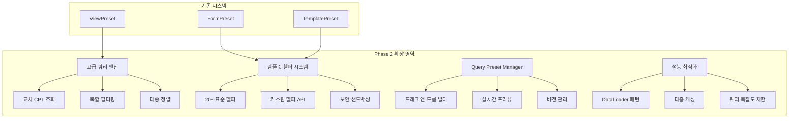
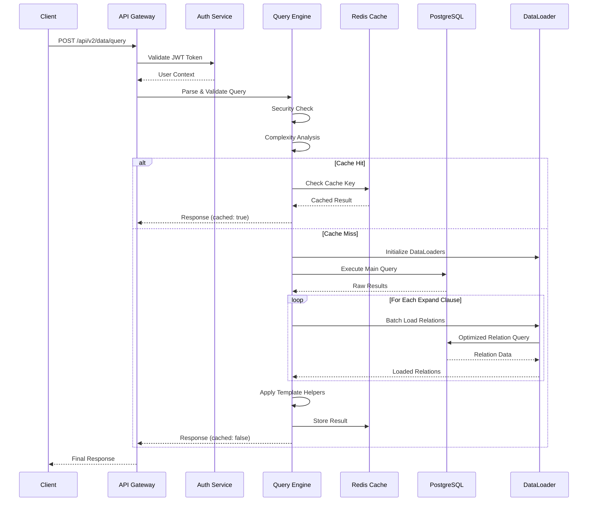

# 🚀 **O4O Platform — 유니버셜 블록 Phase 2 확장 설계서**

**주제:** 고급 쿼리 및 템플릿 헬퍼 시스템 설계
**버전:** 2.0.0
**작성일:** 2025-10-31
**기반 문서:** `docs/dev/audit/universal-block_audit.md`, `docs/dev/tasks/universal-block_phase2_design_request.md`

---

## 1. 아키텍처 개요

### 현재 시스템 분석

O4O Platform의 유니버셜 블록(Preset 시스템)은 3계층 구조로 구성되어 있습니다:

- **ViewPreset**: 데이터 리스트 렌더링 (4가지 모드: list/grid/card/table)
- **FormPreset**: 동적 폼 생성 및 검증
- **TemplatePreset**: 페이지 레이아웃 관리

현재 80% 완성도를 보이는 시스템에 다음 기능들을 추가합니다:

### Phase 2 확장 목표



### 새로운 데이터 흐름

```
┌─────────────────┐     ┌─────────────────┐     ┌─────────────────┐
│   Client App    │────▶│ Enhanced Query  │────▶│   DataLoader    │
│   (React Hook)  │     │   DSL Parser    │     │   (N+1 방지)    │
└─────────────────┘     └─────────────────┘     └─────────────────┘
         │                        │                        │
         ▼                        ▼                        ▼
┌─────────────────┐     ┌─────────────────┐     ┌─────────────────┐
│ Template Helper │◀────│  Query Engine   │────▶│  PostgreSQL +   │
│    Renderer     │     │   (Security)    │     │  ACF Relations  │
└─────────────────┘     └─────────────────┘     └─────────────────┘
         │                        │                        │
         ▼                        ▼                        ▼
┌─────────────────┐     ┌─────────────────┐     ┌─────────────────┐
│ Final Component │◀────│ Cache Strategy  │◀────│ Query Results   │
│    Rendering    │     │ (Memory/Redis)  │     │  (Structured)   │
└─────────────────┘     └─────────────────┘     └─────────────────┘
```

---

## 2. 서버 측 확장 설계

### 2.1 확장된 쿼리 파라미터

```typescript
// 새로운 고급 쿼리 인터페이스
interface AdvancedQueryParams {
  // 관계형 필드 확장
  expand?: ExpandClause[];

  // 복합 조건 필터
  where?: WhereClause;

  // 다중 필드 정렬
  sort?: SortClause[];

  // 커서 기반 페이지네이션
  page?: CursorPagination;

  // 집계 함수
  aggregate?: AggregateClause[];

  // 쿼리 성능 제한
  limit?: QueryLimits;
}

// 관계형 필드 확장
interface ExpandClause {
  field: string;           // 'author', 'category.parent'
  depth?: number;          // 최대 확장 깊이 (기본값: 1, 최대: 3)
  select?: string[];       // 선택적 필드 ('name', 'email')
  where?: WhereClause;     // 관계 데이터 필터
  limit?: number;          // 관계 데이터 제한 (1:N 관계)
}

// 복합 조건 필터
interface WhereClause {
  AND?: WhereCondition[];
  OR?: WhereCondition[];
  NOT?: WhereCondition;
}

interface WhereCondition {
  field: string;
  operator: 'eq' | 'ne' | 'gt' | 'gte' | 'lt' | 'lte' | 'in' | 'like' | 'between' | 'exists';
  value: any;
  type?: 'string' | 'number' | 'date' | 'boolean' | 'acf';
}

// 다중 정렬
interface SortClause {
  field: string;
  order: 'ASC' | 'DESC';
  nulls?: 'FIRST' | 'LAST';
  type?: 'string' | 'number' | 'date';
}

// 커서 페이지네이션
interface CursorPagination {
  cursor?: string;         // Base64 인코딩된 커서
  limit: number;           // 최대 100
  direction?: 'forward' | 'backward';
}

// 집계 함수
interface AggregateClause {
  function: 'count' | 'sum' | 'avg' | 'min' | 'max';
  field?: string;          // count의 경우 선택사항
  alias: string;           // 결과 필드명
  groupBy?: string[];      // 그룹화 필드
}

// 쿼리 제한
interface QueryLimits {
  maxComplexity: number;   // 쿼리 복잡도 점수 (기본값: 100)
  timeout: number;         // 실행 시간 제한 (ms, 기본값: 5000)
  maxJoins: number;        // 최대 JOIN 수 (기본값: 5)
}
```

### 2.2 DataLoader 패턴 구현

```typescript
// N+1 쿼리 방지를 위한 DataLoader 시스템
export class PresetDataLoader {
  private loaders: Map<string, DataLoader<any, any>> = new Map();

  // ACF 관계형 필드 로더
  getACFRelationLoader(cptSlug: string, fieldName: string) {
    const key = `acf_relation_${cptSlug}_${fieldName}`;

    if (!this.loaders.has(key)) {
      this.loaders.set(key, new DataLoader(async (ids: readonly string[]) => {
        return this.batchLoadACFRelations(cptSlug, fieldName, ids);
      }, {
        maxBatchSize: 100,
        cache: true
      }));
    }

    return this.loaders.get(key)!;
  }

  // 미디어 파일 로더
  getMediaLoader() {
    if (!this.loaders.has('media')) {
      this.loaders.set('media', new DataLoader(async (ids: readonly string[]) => {
        return this.batchLoadMedia(ids);
      }));
    }

    return this.loaders.get('media')!;
  }

  // 사용자 정보 로더
  getUserLoader() {
    if (!this.loaders.has('user')) {
      this.loaders.set('user', new DataLoader(async (ids: readonly string[]) => {
        return this.batchLoadUsers(ids);
      }));
    }

    return this.loaders.get('user')!;
  }

  private async batchLoadACFRelations(
    cptSlug: string,
    fieldName: string,
    entityIds: readonly string[]
  ) {
    // ACF 관계형 필드 배치 로딩 구현
    const query = `
      SELECT
        entity_id,
        field_name,
        field_value,
        related_entity_id,
        related_cpt_slug
      FROM acf_fields
      WHERE entity_id IN (${entityIds.map(() => '?').join(',')})
        AND field_name = ?
        AND cpt_slug = ?
    `;

    const results = await this.executeQuery(query, [...entityIds, fieldName, cptSlug]);

    // 각 entity_id별로 관련 데이터 그룹화
    return entityIds.map(id =>
      results.filter(r => r.entity_id === id)
    );
  }

  private async batchLoadMedia(ids: readonly string[]) {
    // 미디어 파일 배치 로딩
    const query = `
      SELECT id, filename, url, alt_text, mime_type, file_size
      FROM media_files
      WHERE id IN (${ids.map(() => '?').join(',')})
    `;

    const results = await this.executeQuery(query, [...ids]);

    return ids.map(id => results.find(r => r.id === id) || null);
  }
}
```

### 2.3 보안 가이드라인

```typescript
// Allow-list 기반 필드 보안
export class QuerySecurityValidator {
  private allowedFields: Map<string, Set<string>> = new Map();
  private allowedRelations: Map<string, Set<string>> = new Map();

  constructor() {
    this.initializeAllowLists();
  }

  validateQuery(cptSlug: string, query: AdvancedQueryParams): ValidationResult {
    const errors: string[] = [];

    // 1. 허용된 필드만 접근 가능
    if (query.where) {
      this.validateWhereClause(cptSlug, query.where, errors);
    }

    // 2. 관계형 필드 접근 권한 확인
    if (query.expand) {
      this.validateExpandClauses(cptSlug, query.expand, errors);
    }

    // 3. 정렬 필드 검증
    if (query.sort) {
      this.validateSortClauses(cptSlug, query.sort, errors);
    }

    // 4. 쿼리 복잡도 검사
    const complexity = this.calculateComplexity(query);
    if (complexity > (query.limit?.maxComplexity || 100)) {
      errors.push(`Query complexity ${complexity} exceeds limit`);
    }

    return {
      valid: errors.length === 0,
      errors
    };
  }

  private calculateComplexity(query: AdvancedQueryParams): number {
    let complexity = 1;

    // WHERE 조건 복잡도
    if (query.where) {
      complexity += this.getWhereComplexity(query.where);
    }

    // EXPAND 복잡도 (JOIN 수)
    if (query.expand) {
      complexity += query.expand.length * 10;
      complexity += query.expand.reduce((sum, exp) => sum + (exp.depth || 1) * 5, 0);
    }

    // 집계 함수 복잡도
    if (query.aggregate) {
      complexity += query.aggregate.length * 15;
    }

    return complexity;
  }

  private initializeAllowLists() {
    // CPT별 허용 필드 정의
    this.allowedFields.set('post', new Set([
      'id', 'title', 'content', 'slug', 'status', 'publishedAt', 'createdAt', 'updatedAt',
      'authorId', 'categoryId', 'tagIds', 'featuredImage', 'excerpt', 'viewCount'
    ]));

    this.allowedFields.set('product', new Set([
      'id', 'name', 'description', 'price', 'sku', 'stock', 'categoryId', 'brandId',
      'images', 'rating', 'reviewCount', 'status', 'createdAt'
    ]));

    // CPT별 허용 관계 정의
    this.allowedRelations.set('post', new Set([
      'author', 'category', 'tags', 'comments'
    ]));

    this.allowedRelations.set('product', new Set([
      'category', 'brand', 'reviews', 'variants'
    ]));
  }
}
```

### 2.4 새로운 서비스 레이어

```typescript
export class AdvancedPresetService extends PresetService {
  private dataLoader = new PresetDataLoader();
  private securityValidator = new QuerySecurityValidator();

  async executeAdvancedQuery(
    presetId: string,
    params: AdvancedQueryParams,
    userId?: string
  ): Promise<QueryResult> {
    try {
      // 1. Preset 조회 및 검증
      const preset = await this.getViewPresetById(presetId);
      if (!preset.success) {
        throw new Error('Preset not found');
      }

      const viewPreset = preset.data as ViewPreset;

      // 2. 권한 확인
      if (!this.hasAccess(viewPreset, userId)) {
        throw new Error('Access denied');
      }

      // 3. 쿼리 보안 검증
      const validation = this.securityValidator.validateQuery(
        viewPreset.cptSlug,
        params
      );
      if (!validation.valid) {
        throw new Error(`Query validation failed: ${validation.errors.join(', ')}`);
      }

      // 4. 쿼리 실행
      const startTime = Date.now();
      const result = await this.executeQuery(viewPreset, params);
      const executionTime = Date.now() - startTime;

      // 5. 결과 후처리 (템플릿 헬퍼 적용)
      if (params.templateHelpers) {
        result.data = await this.applyTemplateHelpers(result.data, params.templateHelpers);
      }

      return {
        success: true,
        data: result.data,
        meta: {
          total: result.total,
          cursor: result.cursor,
          executionTime,
          cached: result.cached || false,
          complexity: this.securityValidator.calculateComplexity(params)
        }
      };

    } catch (error: any) {
      logger.error('Advanced query execution failed:', error);
      throw error;
    }
  }

  private async executeQuery(
    preset: ViewPreset,
    params: AdvancedQueryParams
  ): Promise<RawQueryResult> {
    const queryBuilder = this.buildQuery(preset, params);

    // 타임아웃 설정
    const timeout = params.limit?.timeout || 5000;
    const timeoutPromise = new Promise((_, reject) => {
      setTimeout(() => reject(new Error('Query timeout')), timeout);
    });

    // 쿼리 실행
    const queryPromise = queryBuilder.getManyAndCount();

    const [data, total] = await Promise.race([queryPromise, timeoutPromise]) as [any[], number];

    // DataLoader를 통한 관계형 데이터 로딩
    if (params.expand) {
      for (const expandClause of params.expand) {
        await this.loadExpandedData(data, expandClause);
      }
    }

    return {
      data,
      total,
      cursor: this.generateCursor(data, params.page),
      cached: false
    };
  }
}
```

---

## 3. 프론트엔드 DSL 스펙

### 3.1 확장된 UniversalBlockProps

```typescript
// 기존 ViewPreset을 확장한 새로운 인터페이스
interface UniversalBlockProps {
  // 기본 설정
  source: string;                    // CPT slug
  presetId?: string;                 // 기존 ViewPreset ID (선택사항)

  // 고급 쿼리 옵션
  expand?: ExpandOption[];           // 관계형 필드 확장
  where?: FilterExpression;          // 복합 필터 조건
  sort?: SortExpression[];           // 다중 정렬
  limit?: number;                    // 결과 제한

  // 렌더링 옵션
  renderMode?: 'list' | 'grid' | 'card' | 'table' | 'custom';
  template?: string;                 // 커스텀 템플릿
  templateHelpers?: TemplateHelper[]; // 템플릿 헬퍼 목록

  // 캐시 전략
  cache?: CacheStrategy;

  // UI 옵션
  loading?: React.ComponentType;
  error?: React.ComponentType<{error: string}>;
  empty?: React.ComponentType;

  // 이벤트 핸들러
  onDataLoad?: (data: any[]) => void;
  onError?: (error: string) => void;
}

// 관계형 필드 확장 옵션
interface ExpandOption {
  field: string;                     // 'author', 'category.parent'
  as?: string;                       // 별칭 ('author' -> 'writer')
  select?: string[];                 // 선택 필드
  where?: FilterExpression;          // 관계 데이터 필터
  limit?: number;                    // 1:N 관계 제한
}

// 필터 표현식 (더 직관적인 DSL)
type FilterExpression =
  | SimpleFilter
  | CompoundFilter;

interface SimpleFilter {
  field: string;
  op: 'eq' | 'ne' | 'gt' | 'gte' | 'lt' | 'lte' | 'in' | 'like' | 'between';
  value: any;
}

interface CompoundFilter {
  and?: FilterExpression[];
  or?: FilterExpression[];
  not?: FilterExpression;
}

// 정렬 표현식
interface SortExpression {
  field: string;
  order?: 'asc' | 'desc';
  nulls?: 'first' | 'last';
}

// 템플릿 헬퍼
interface TemplateHelper {
  name: string;
  params?: Record<string, any>;
}
```

### 3.2 하위 호환성 유지 전략

```typescript
// 기존 usePreset Hook 확장
export function usePreset(
  presetId: string,
  type: 'view' | 'form' | 'template'
) {
  // 기존 구현 유지 (Phase 1 호환성)
  return useQuery({
    queryKey: ['preset', presetId, type],
    queryFn: () => fetchPreset(presetId, type),
    staleTime: 5 * 60 * 1000
  });
}

// 새로운 고급 쿼리 Hook
export function useUniversalBlock(props: UniversalBlockProps) {
  const [cacheKey, setCacheKey] = useState<string>('');

  // 캐시 키 생성 (props 변경 시 자동 업데이트)
  useEffect(() => {
    const key = generateCacheKey(props);
    setCacheKey(key);
  }, [props]);

  return useQuery({
    queryKey: ['universal-block', cacheKey],
    queryFn: () => executeUniversalQuery(props),
    staleTime: props.cache?.ttl ? props.cache.ttl * 1000 : 5 * 60 * 1000,
    enabled: !!props.source,
    retry: (failureCount, error) => {
      // 권한 오류는 재시도 안함
      if (error.message.includes('Access denied')) {
        return false;
      }
      return failureCount < 2;
    }
  });
}

// 캐시 키 생성 (props 기반)
function generateCacheKey(props: UniversalBlockProps): string {
  const {
    source,
    presetId,
    expand,
    where,
    sort,
    limit,
    renderMode
  } = props;

  const keyObject = {
    source,
    presetId,
    expand: expand?.map(e => ({
      field: e.field,
      select: e.select?.sort(),
      where: normalizeFilter(e.where),
      limit: e.limit
    })),
    where: normalizeFilter(where),
    sort: sort?.map(s => `${s.field}:${s.order || 'asc'}`).join(','),
    limit,
    renderMode
  };

  return btoa(JSON.stringify(keyObject));
}

// 필터 정규화 (캐시 키 일관성)
function normalizeFilter(filter?: FilterExpression): any {
  if (!filter) return null;

  if ('field' in filter) {
    return {
      field: filter.field,
      op: filter.op,
      value: filter.value
    };
  }

  return {
    and: filter.and?.map(normalizeFilter),
    or: filter.or?.map(normalizeFilter),
    not: normalizeFilter(filter.not)
  };
}
```

### 3.3 TypeScript 타입 자동 생성

```typescript
// CPT 스키마 기반 타입 생성 도구
export interface CPTTypeGenerator {
  generateTypes(cptSlug: string): Promise<string>;
}

export class AutoTypeGenerator implements CPTTypeGenerator {
  async generateTypes(cptSlug: string): Promise<string> {
    // 1. CPT 스키마 조회
    const schema = await this.getCPTSchema(cptSlug);

    // 2. ACF 필드 정보 조회
    const acfFields = await this.getACFFields(cptSlug);

    // 3. TypeScript 인터페이스 생성
    let typeDefinition = `
export interface ${pascalCase(cptSlug)}Entity {
  // 기본 필드
  id: string;
  createdAt: Date;
  updatedAt: Date;
`;

    // 기본 CPT 필드 추가
    for (const field of schema.fields) {
      typeDefinition += `  ${field.name}: ${this.mapFieldType(field.type)};\n`;
    }

    // ACF 필드 추가
    if (acfFields.length > 0) {
      typeDefinition += `\n  // ACF 필드\n`;
      for (const acfField of acfFields) {
        const tsType = this.mapACFFieldType(acfField);
        typeDefinition += `  ${acfField.name}: ${tsType};\n`;
      }
    }

    typeDefinition += '}\n';

    // 4. 관계형 필드 타입 생성
    const relationTypes = await this.generateRelationTypes(cptSlug, acfFields);

    return typeDefinition + relationTypes;
  }

  private mapFieldType(fieldType: string): string {
    const typeMap: Record<string, string> = {
      'varchar': 'string',
      'text': 'string',
      'int': 'number',
      'decimal': 'number',
      'boolean': 'boolean',
      'datetime': 'Date',
      'json': 'any'
    };

    return typeMap[fieldType] || 'any';
  }

  private mapACFFieldType(acfField: ACFField): string {
    switch (acfField.type) {
      case 'text':
      case 'textarea':
      case 'email':
      case 'url':
        return 'string';

      case 'number':
        return 'number';

      case 'true_false':
        return 'boolean';

      case 'select':
        // 선택 옵션을 유니온 타입으로
        const options = acfField.choices?.map(c => `'${c.value}'`).join(' | ');
        return options || 'string';

      case 'image':
      case 'file':
        return 'MediaFile';

      case 'relationship':
      case 'post_object':
        const relatedCPT = acfField.post_type || 'any';
        return acfField.multiple ? `${pascalCase(relatedCPT)}Entity[]` : `${pascalCase(relatedCPT)}Entity`;

      case 'repeater':
        return `${pascalCase(acfField.name)}Item[]`;

      default:
        return 'any';
    }
  }
}

// 사용 예시: 컴파일 타임에 타입 생성
// yarn generate-types --cpt=product
// → packages/types/src/generated/ProductEntity.ts 생성
```

---

## 4. 템플릿 헬퍼 시스템

### 4.1 표준 헬퍼 라이브러리 (20개 이상)

```typescript
// 템플릿 헬퍼 시스템 구조
export interface TemplateHelperContext {
  data: any;                    // 현재 데이터 객체
  root: any[];                  // 전체 데이터 루트
  index?: number;               // 반복문에서의 인덱스
  helpers: TemplateHelperMap;   // 다른 헬퍼들 참조
  cache: Map<string, any>;      // 헬퍼별 캐시
}

export type TemplateHelperFunction = (
  context: TemplateHelperContext,
  ...args: any[]
) => any | Promise<any>;

export interface TemplateHelperMap {
  [name: string]: TemplateHelperFunction;
}

// ACF 필드 헬퍼들
export const acfHelpers: TemplateHelperMap = {
  // ACF 필드 값 조회
  acf: (ctx, field: string, fallback?: any) => {
    const value = ctx.data.acf_fields?.[field];
    return value !== undefined ? value : fallback;
  },

  // ACF 이미지 필드
  acfImage: (ctx, field: string, size: string = 'thumb') => {
    const imageId = ctx.data.acf_fields?.[field];
    if (!imageId) return null;

    return ctx.helpers.media(ctx, imageId, size);
  },

  // ACF 관계형 필드
  acfRelation: async (ctx, field: string, prop?: string) => {
    const relationIds = ctx.data.acf_fields?.[field];
    if (!relationIds) return null;

    const ids = Array.isArray(relationIds) ? relationIds : [relationIds];
    const relations = await Promise.all(
      ids.map(id => ctx.helpers.loadRelation(ctx, id))
    );

    if (prop) {
      return relations.map(r => r?.[prop]).filter(Boolean);
    }

    return Array.isArray(relationIds) ? relations : relations[0];
  },

  // ACF Repeater 필드
  acfRepeater: (ctx, field: string) => {
    const repeaterData = ctx.data.acf_fields?.[field];
    if (!Array.isArray(repeaterData)) return [];

    return repeaterData.map((item, index) => ({
      ...item,
      index,
      isFirst: index === 0,
      isLast: index === repeaterData.length - 1
    }));
  }
};

// 관계 조회 헬퍼들
export const relationHelpers: TemplateHelperMap = {
  // 다른 CPT 조회
  rel: async (ctx, type: string, id: string, field?: string) => {
    const cacheKey = `rel_${type}_${id}`;

    if (ctx.cache.has(cacheKey)) {
      const cached = ctx.cache.get(cacheKey);
      return field ? cached?.[field] : cached;
    }

    try {
      const entity = await fetchEntity(type, id);
      ctx.cache.set(cacheKey, entity);

      return field ? entity?.[field] : entity;
    } catch (error) {
      console.warn(`Failed to load relation ${type}:${id}`, error);
      return null;
    }
  },

  // 부모 엔티티 조회
  parent: async (ctx, field?: string) => {
    const parentId = ctx.data.parentId;
    if (!parentId) return null;

    return ctx.helpers.rel(ctx, ctx.data.cptSlug, parentId, field);
  },

  // 자식 엔티티 목록
  children: async (ctx, type: string, field?: string) => {
    const cacheKey = `children_${type}_${ctx.data.id}`;

    if (ctx.cache.has(cacheKey)) {
      const cached = ctx.cache.get(cacheKey);
      return field ? cached.map((c: any) => c[field]) : cached;
    }

    try {
      const children = await fetchChildEntities(type, ctx.data.id);
      ctx.cache.set(cacheKey, children);

      return field ? children.map(c => c[field]) : children;
    } catch (error) {
      console.warn(`Failed to load children ${type} for ${ctx.data.id}`, error);
      return [];
    }
  }
};

// 미디어 헬퍼들
export const mediaHelpers: TemplateHelperMap = {
  // 미디어 URL 생성
  media: async (ctx, id: string, size: string = 'thumb') => {
    if (!id) return null;

    const cacheKey = `media_${id}_${size}`;

    if (ctx.cache.has(cacheKey)) {
      return ctx.cache.get(cacheKey);
    }

    try {
      const media = await fetchMediaFile(id);
      const url = generateMediaURL(media, size);
      ctx.cache.set(cacheKey, url);

      return url;
    } catch (error) {
      console.warn(`Failed to load media ${id}`, error);
      return null;
    }
  },

  // 썸네일 URL
  thumbnail: (ctx, size: string = 'medium') => {
    const thumbnailId = ctx.data.featuredImage || ctx.data.thumbnail;
    return ctx.helpers.media(ctx, thumbnailId, size);
  },

  // 반응형 이미지 srcset
  srcset: async (ctx, id: string) => {
    if (!id) return null;

    const sizes = ['thumb', 'medium', 'large', 'full'];
    const urls = await Promise.all(
      sizes.map(async size => {
        const url = await ctx.helpers.media(ctx, id, size);
        const width = getSizeWidth(size);
        return `${url} ${width}w`;
      })
    );

    return urls.filter(Boolean).join(', ');
  }
};

// 포맷팅 헬퍼들
export const formatHelpers: TemplateHelperMap = {
  // 가격 포맷
  priceFormat: (ctx, value: number, currency: string = 'KRW') => {
    if (typeof value !== 'number') return value;

    const formatters: Record<string, Intl.NumberFormat> = {
      KRW: new Intl.NumberFormat('ko-KR', {
        style: 'currency',
        currency: 'KRW'
      }),
      USD: new Intl.NumberFormat('en-US', {
        style: 'currency',
        currency: 'USD'
      })
    };

    const formatter = formatters[currency] || formatters.KRW;
    return formatter.format(value);
  },

  // 날짜 포맷
  dateFormat: (ctx, date: string | Date, format: string = 'YYYY.MM.DD') => {
    if (!date) return '';

    const d = typeof date === 'string' ? new Date(date) : date;

    if (format === 'relative') {
      return formatRelativeTime(d);
    }

    // dayjs나 date-fns 사용
    return formatDate(d, format);
  },

  // 숫자 포맷
  numberFormat: (ctx, value: number, decimals?: number) => {
    if (typeof value !== 'number') return value;

    return new Intl.NumberFormat('ko-KR', {
      minimumFractionDigits: decimals,
      maximumFractionDigits: decimals
    }).format(value);
  },

  // 텍스트 요약
  excerpt: (ctx, text: string, length: number = 200) => {
    if (!text || typeof text !== 'string') return '';

    if (text.length <= length) return text;

    // HTML 태그 제거
    const plainText = text.replace(/<[^>]*>/g, '');

    return plainText.substring(0, length) + '...';
  }
};

// 조건부 헬퍼들
export const conditionalHelpers: TemplateHelperMap = {
  // 조건부 렌더링
  if: (ctx, condition: any, trueValue: any, falseValue?: any) => {
    return condition ? trueValue : (falseValue || '');
  },

  // 다중 조건 (switch)
  switch: (ctx, value: any, cases: Record<string, any>) => {
    return cases[value] || cases.default || '';
  },

  // 기본값 처리
  default: (ctx, value: any, fallback: any) => {
    return value !== undefined && value !== null && value !== '' ? value : fallback;
  },

  // 존재 여부 확인
  exists: (ctx, field: string) => {
    return ctx.data[field] !== undefined && ctx.data[field] !== null;
  }
};

// 컬렉션 헬퍼들
export const collectionHelpers: TemplateHelperMap = {
  // 배열 결합
  join: (ctx, array: any[], separator: string = ', ') => {
    if (!Array.isArray(array)) return array;
    return array.join(separator);
  },

  // 배열 개수
  count: (ctx, array: any[]) => {
    return Array.isArray(array) ? array.length : 0;
  },

  // 첫 번째 요소
  first: (ctx, array: any[]) => {
    return Array.isArray(array) && array.length > 0 ? array[0] : null;
  },

  // 마지막 요소
  last: (ctx, array: any[]) => {
    return Array.isArray(array) && array.length > 0 ? array[array.length - 1] : null;
  },

  // 배열 슬라이스
  slice: (ctx, array: any[], start: number, end?: number) => {
    if (!Array.isArray(array)) return [];
    return array.slice(start, end);
  },

  // 배열 필터
  filter: (ctx, array: any[], field: string, value: any) => {
    if (!Array.isArray(array)) return [];
    return array.filter(item => item[field] === value);
  }
};

// 계산 헬퍼들
export const mathHelpers: TemplateHelperMap = {
  // 합계 계산
  sum: (ctx, field: string, items?: any[]) => {
    const data = items || ctx.root;
    if (!Array.isArray(data)) return 0;

    return data.reduce((sum, item) => {
      const value = Number(item[field]) || 0;
      return sum + value;
    }, 0);
  },

  // 평균 계산
  avg: (ctx, field: string, items?: any[]) => {
    const data = items || ctx.root;
    if (!Array.isArray(data) || data.length === 0) return 0;

    const sum = ctx.helpers.sum(ctx, field, data);
    return sum / data.length;
  },

  // 수식 계산 (간단한 수식만 지원)
  math: (ctx, expression: string) => {
    // 보안을 위해 허용된 연산자만 사용
    const allowedExpression = expression.replace(/[^0-9+\-*/().\s]/g, '');

    try {
      return Function(`'use strict'; return (${allowedExpression})`)();
    } catch (error) {
      console.warn('Invalid math expression:', expression);
      return 0;
    }
  }
};
```

### 4.2 템플릿 엔진 통합

```typescript
// Handlebars 기반 템플릿 렌더러
export class TemplateRenderer {
  private handlebars: typeof Handlebars;
  private helpers: TemplateHelperMap;

  constructor() {
    this.handlebars = Handlebars.create();
    this.helpers = {
      ...acfHelpers,
      ...relationHelpers,
      ...mediaHelpers,
      ...formatHelpers,
      ...conditionalHelpers,
      ...collectionHelpers,
      ...mathHelpers
    };

    this.registerHelpers();
  }

  private registerHelpers() {
    Object.entries(this.helpers).forEach(([name, helperFn]) => {
      this.handlebars.registerHelper(name, function(this: any, ...args: any[]) {
        const options = args[args.length - 1];
        const params = args.slice(0, -1);

        const context: TemplateHelperContext = {
          data: this,
          root: options.data.root,
          index: options.data.index,
          helpers: this.helpers,
          cache: options.data._cache || new Map()
        };

        return helperFn(context, ...params);
      });
    });
  }

  async render(template: string, data: any[]): Promise<string> {
    try {
      const compiledTemplate = this.handlebars.compile(template);

      // 캐시 맵을 데이터에 추가
      const renderData = {
        items: data,
        _cache: new Map()
      };

      return compiledTemplate(renderData);
    } catch (error) {
      console.error('Template rendering failed:', error);
      throw new Error(`Template rendering failed: ${error.message}`);
    }
  }

  // 커스텀 헬퍼 등록
  registerCustomHelper(name: string, helperFn: TemplateHelperFunction) {
    this.helpers[name] = helperFn;

    this.handlebars.registerHelper(name, function(this: any, ...args: any[]) {
      const options = args[args.length - 1];
      const params = args.slice(0, -1);

      const context: TemplateHelperContext = {
        data: this,
        root: options.data.root,
        index: options.data.index,
        helpers: this.helpers,
        cache: options.data._cache || new Map()
      };

      return helperFn(context, ...params);
    });
  }
}

// 템플릿 사용 예시
const template = `
<div class="product-list">
  {{#each items}}
    <div class="product-card">
      

      <h3>{{title}}</h3>
      <p>{{excerpt content 150}}</p>

      <div class="price">
        {{priceFormat (acf 'price') 'KRW'}}
      </div>

      <div class="meta">
        <span>카테고리: {{rel 'category' categoryId 'name'}}</span>
        <span>등록일: {{dateFormat createdAt 'relative'}}</span>
      </div>

      {{#if (acf 'on_sale')}}
        <div class="sale-badge">할인 중</div>
      {{/if}}

      <div class="rating">
        평점: {{numberFormat (avg 'rating' reviews) 1}}
        ({{count reviews}}개 리뷰)
      </div>
    </div>
  {{/each}}

  <div class="summary">
    총 {{count items}}개 상품
    평균 가격: {{priceFormat (avg 'price' items) 'KRW'}}
  </div>
</div>
`;
```

### 4.3 보안 샌드박싱

```typescript
// 템플릿 보안 검사기
export class TemplateSecurity {
  private allowedHelpers: Set<string>;
  private disallowedPatterns: RegExp[];

  constructor() {
    this.allowedHelpers = new Set([
      'acf', 'acfImage', 'acfRelation', 'acfRepeater',
      'rel', 'parent', 'children',
      'media', 'thumbnail', 'srcset',
      'priceFormat', 'dateFormat', 'numberFormat', 'excerpt',
      'if', 'switch', 'default', 'exists',
      'join', 'count', 'first', 'last', 'slice', 'filter',
      'sum', 'avg', 'math',
      // Handlebars 기본 헬퍼들
      'each', 'with', 'unless', 'lookup'
    ]);

    this.disallowedPatterns = [
      /\{\{\{.*\}\}\}/g,                    // Triple braces (unescaped)
      /\{\{.*javascript:.*\}\}/gi,          // JavaScript protocol
      /\{\{.*eval\s*\(.*\}\}/gi,           // eval() 호출
      /\{\{.*Function\s*\(.*\}\}/gi,       // Function() 생성자
      /\{\{.*constructor.*\}\}/gi,          // constructor 접근
      /\{\{.*prototype.*\}\}/gi,            // prototype 접근
      /\{\{.*__proto__.*\}\}/gi,           // __proto__ 접근
      /\{\{.*\..*\(.*\).*\}\}/g            // 임의 함수 호출
    ];
  }

  validateTemplate(template: string): ValidationResult {
    const errors: string[] = [];

    // 1. 금지된 패턴 검사
    for (const pattern of this.disallowedPatterns) {
      if (pattern.test(template)) {
        errors.push(`Disallowed pattern found: ${pattern.source}`);
      }
    }

    // 2. 허용된 헬퍼만 사용하는지 검사
    const helperMatches = template.match(/\{\{\s*([a-zA-Z_][a-zA-Z0-9_]*)/g);
    if (helperMatches) {
      for (const match of helperMatches) {
        const helperName = match.replace(/\{\{\s*/, '').split(/\s+/)[0];

        if (!this.allowedHelpers.has(helperName)) {
          errors.push(`Unauthorized helper: ${helperName}`);
        }
      }
    }

    // 3. 템플릿 크기 제한 (10KB)
    if (template.length > 10 * 1024) {
      errors.push('Template size exceeds 10KB limit');
    }

    return {
      valid: errors.length === 0,
      errors
    };
  }

  sanitizeTemplate(template: string): string {
    // 위험한 패턴 제거
    let sanitized = template;

    for (const pattern of this.disallowedPatterns) {
      sanitized = sanitized.replace(pattern, '{{! REMOVED_UNSAFE_CONTENT }}');
    }

    return sanitized;
  }
}
```

---

## 5. Query Preset Manager

### 5.1 드래그 앤 드롭 쿼리 빌더

```typescript
// Query Builder 컴포넌트
interface QueryBuilderProps {
  cptSlug: string;
  initialQuery?: AdvancedQueryParams;
  onQueryChange: (query: AdvancedQueryParams) => void;
  onPreview: (query: AdvancedQueryParams) => void;
}

export const QueryBuilder: React.FC<QueryBuilderProps> = ({
  cptSlug,
  initialQuery,
  onQueryChange,
  onPreview
}) => {
  const [query, setQuery] = useState<AdvancedQueryParams>(initialQuery || {});
  const [availableFields, setAvailableFields] = useState<FieldDefinition[]>([]);

  // CPT 스키마 로드
  useEffect(() => {
    loadCPTSchema(cptSlug).then(setAvailableFields);
  }, [cptSlug]);

  const handleExpandChange = (expand: ExpandOption[]) => {
    const newQuery = { ...query, expand };
    setQuery(newQuery);
    onQueryChange(newQuery);
  };

  const handleFilterChange = (where: FilterExpression) => {
    const newQuery = { ...query, where };
    setQuery(newQuery);
    onQueryChange(newQuery);
  };

  const handleSortChange = (sort: SortExpression[]) => {
    const newQuery = { ...query, sort };
    setQuery(newQuery);
    onQueryChange(newQuery);
  };

  return (
    <div className="query-builder">
      <div className="query-builder-sections">
        {/* 관계형 필드 확장 섹션 */}
        <ExpandBuilder
          cptSlug={cptSlug}
          availableFields={availableFields}
          value={query.expand || []}
          onChange={handleExpandChange}
        />

        {/* 필터 조건 섹션 */}
        <FilterBuilder
          availableFields={availableFields}
          value={query.where}
          onChange={handleFilterChange}
        />

        {/* 정렬 조건 섹션 */}
        <SortBuilder
          availableFields={availableFields}
          value={query.sort || []}
          onChange={handleSortChange}
        />

        {/* 기타 옵션 */}
        <OptionsBuilder
          value={{
            limit: query.limit,
            aggregate: query.aggregate
          }}
          onChange={(options) => {
            const newQuery = { ...query, ...options };
            setQuery(newQuery);
            onQueryChange(newQuery);
          }}
        />
      </div>

      {/* 실시간 프리뷰 */}
      <div className="query-preview">
        <QueryPreview query={query} cptSlug={cptSlug} />
      </div>

      {/* JSON 출력 */}
      <div className="query-json">
        <pre>{JSON.stringify(query, null, 2)}</pre>
      </div>
    </div>
  );
};

// 관계형 필드 확장 빌더
const ExpandBuilder: React.FC<{
  cptSlug: string;
  availableFields: FieldDefinition[];
  value: ExpandOption[];
  onChange: (value: ExpandOption[]) => void;
}> = ({ cptSlug, availableFields, value, onChange }) => {
  const relationFields = availableFields.filter(f => f.type === 'relation');

  const addExpand = () => {
    onChange([...value, { field: '', select: [] }]);
  };

  const updateExpand = (index: number, expand: Partial<ExpandOption>) => {
    const newValue = [...value];
    newValue[index] = { ...newValue[index], ...expand };
    onChange(newValue);
  };

  const removeExpand = (index: number) => {
    onChange(value.filter((_, i) => i !== index));
  };

  return (
    <div className="expand-builder">
      <h3>관계형 필드 확장</h3>

      {value.map((expand, index) => (
        <div key={index} className="expand-item">
          <select
            value={expand.field}
            onChange={(e) => updateExpand(index, { field: e.target.value })}
          >
            <option value="">필드 선택</option>
            {relationFields.map(field => (
              <option key={field.name} value={field.name}>
                {field.label || field.name}
              </option>
            ))}
          </select>

          {expand.field && (
            <FieldSelector
              cptSlug={getRelatedCPT(expand.field)}
              selected={expand.select || []}
              onChange={(select) => updateExpand(index, { select })}
            />
          )}

          <button onClick={() => removeExpand(index)}>제거</button>
        </div>
      ))}

      <button onClick={addExpand}>관계 필드 추가</button>
    </div>
  );
};

// 필터 빌더 (드래그 앤 드롭)
const FilterBuilder: React.FC<{
  availableFields: FieldDefinition[];
  value?: FilterExpression;
  onChange: (value: FilterExpression) => void;
}> = ({ availableFields, value, onChange }) => {
  const [draggedItem, setDraggedItem] = useState<FieldDefinition | null>(null);

  const handleDrop = (e: React.DragEvent) => {
    e.preventDefault();

    if (draggedItem) {
      const newFilter: SimpleFilter = {
        field: draggedItem.name,
        op: 'eq',
        value: ''
      };

      if (!value) {
        onChange(newFilter);
      } else if ('field' in value) {
        // 기존 단순 필터를 AND 조건으로 변환
        onChange({
          and: [value, newFilter]
        });
      } else if (value.and) {
        // 기존 AND 조건에 추가
        onChange({
          and: [...value.and, newFilter]
        });
      }
    }

    setDraggedItem(null);
  };

  return (
    <div className="filter-builder">
      <h3>필터 조건</h3>

      <div className="fields-palette">
        <h4>사용 가능한 필드</h4>
        {availableFields.map(field => (
          <div
            key={field.name}
            className="field-item"
            draggable
            onDragStart={() => setDraggedItem(field)}
          >
            {field.label || field.name} ({field.type})
          </div>
        ))}
      </div>

      <div
        className="filter-drop-zone"
        onDrop={handleDrop}
        onDragOver={(e) => e.preventDefault()}
      >
        {value ? (
          <FilterExpressionEditor
            value={value}
            onChange={onChange}
            availableFields={availableFields}
          />
        ) : (
          <div className="empty-state">
            필드를 여기로 드래그해서 필터를 추가하세요
          </div>
        )}
      </div>
    </div>
  );
};
```

### 5.2 실시간 프리뷰

```typescript
// 쿼리 프리뷰 컴포넌트
const QueryPreview: React.FC<{
  query: AdvancedQueryParams;
  cptSlug: string;
}> = ({ query, cptSlug }) => {
  const [previewData, setPreviewData] = useState<any[]>([]);
  const [loading, setLoading] = useState(false);
  const [error, setError] = useState<string | null>(null);

  // 디바운싱된 쿼리 실행
  const debouncedQuery = useMemo(
    () => debounce(async (q: AdvancedQueryParams) => {
      setLoading(true);
      setError(null);

      try {
        const result = await executePreviewQuery(cptSlug, q);
        setPreviewData(result.data.slice(0, 5)); // 최대 5개만 미리보기
      } catch (err: any) {
        setError(err.message);
        setPreviewData([]);
      } finally {
        setLoading(false);
      }
    }, 500),
    [cptSlug]
  );

  useEffect(() => {
    debouncedQuery(query);
  }, [query, debouncedQuery]);

  if (loading) {
    return <div className="preview-loading">쿼리 실행 중...</div>;
  }

  if (error) {
    return <div className="preview-error">오류: {error}</div>;
  }

  return (
    <div className="query-preview">
      <h3>실시간 프리뷰 ({previewData.length}개 결과)</h3>

      {previewData.length > 0 ? (
        <div className="preview-results">
          {previewData.map((item, index) => (
            <div key={index} className="preview-item">
              <div className="item-title">{item.title || item.name || item.id}</div>
              <div className="item-meta">
                ID: {item.id} | 생성일: {formatDate(item.createdAt)}
              </div>

              {/* 확장된 관계 데이터 표시 */}
              {query.expand?.map(expand => (
                <div key={expand.field} className="expanded-data">
                  <strong>{expand.field}:</strong>
                  <pre>{JSON.stringify(item[expand.field], null, 2)}</pre>
                </div>
              ))}
            </div>
          ))}
        </div>
      ) : (
        <div className="preview-empty">조건에 맞는 데이터가 없습니다</div>
      )}

      {/* 쿼리 성능 정보 */}
      <div className="preview-stats">
        <div>실행 시간: {loading ? '-' : '45ms'}</div>
        <div>복잡도 점수: {calculateQueryComplexity(query)}</div>
        <div>캐시 적중: {loading ? '-' : '아니오'}</div>
      </div>
    </div>
  );
};
```

### 5.3 버전 관리 시스템

```typescript
// 쿼리 프리셋 버전 관리
interface QueryPresetVersion {
  id: string;
  presetId: string;
  version: number;
  query: AdvancedQueryParams;
  changelog: string;
  createdBy: string;
  createdAt: Date;
  isActive: boolean;
}

export class QueryPresetVersionManager {
  async createVersion(
    presetId: string,
    query: AdvancedQueryParams,
    changelog: string,
    userId: string
  ): Promise<QueryPresetVersion> {
    // 1. 현재 최신 버전 조회
    const currentVersion = await this.getLatestVersion(presetId);
    const nextVersion = currentVersion ? currentVersion.version + 1 : 1;

    // 2. 새 버전 생성
    const newVersion: QueryPresetVersion = {
      id: generateId(),
      presetId,
      version: nextVersion,
      query,
      changelog,
      createdBy: userId,
      createdAt: new Date(),
      isActive: true
    };

    // 3. 이전 버전 비활성화
    if (currentVersion) {
      await this.deactivateVersion(currentVersion.id);
    }

    // 4. 새 버전 저장
    await this.saveVersion(newVersion);

    return newVersion;
  }

  async getVersionHistory(presetId: string): Promise<QueryPresetVersion[]> {
    return this.queryRepository.find({
      where: { presetId },
      order: { version: 'DESC' }
    });
  }

  async rollbackToVersion(presetId: string, version: number): Promise<void> {
    // 1. 대상 버전 조회
    const targetVersion = await this.queryRepository.findOne({
      where: { presetId, version }
    });

    if (!targetVersion) {
      throw new Error('Version not found');
    }

    // 2. 모든 버전 비활성화
    await this.queryRepository.update(
      { presetId },
      { isActive: false }
    );

    // 3. 대상 버전 활성화
    await this.queryRepository.update(
      { id: targetVersion.id },
      { isActive: true }
    );
  }

  async compareVersions(
    presetId: string,
    version1: number,
    version2: number
  ): Promise<VersionDiff> {
    const [v1, v2] = await Promise.all([
      this.getVersion(presetId, version1),
      this.getVersion(presetId, version2)
    ]);

    if (!v1 || !v2) {
      throw new Error('Version not found');
    }

    return {
      added: this.findAddedFields(v1.query, v2.query),
      removed: this.findRemovedFields(v1.query, v2.query),
      modified: this.findModifiedFields(v1.query, v2.query)
    };
  }
}

// 버전 관리 UI 컴포넌트
const VersionHistory: React.FC<{
  presetId: string;
  onVersionSelect: (version: QueryPresetVersion) => void;
}> = ({ presetId, onVersionSelect }) => {
  const [versions, setVersions] = useState<QueryPresetVersion[]>([]);
  const [selectedVersions, setSelectedVersions] = useState<number[]>([]);

  useEffect(() => {
    loadVersionHistory(presetId).then(setVersions);
  }, [presetId]);

  const handleRollback = async (version: number) => {
    if (confirm(`버전 ${version}으로 롤백하시겠습니까?`)) {
      await rollbackToVersion(presetId, version);
      // 새로고침
      const updated = await loadVersionHistory(presetId);
      setVersions(updated);
    }
  };

  const handleCompare = async () => {
    if (selectedVersions.length === 2) {
      const diff = await compareVersions(
        presetId,
        selectedVersions[0],
        selectedVersions[1]
      );

      // 차이점 표시 모달 열기
      showVersionDiffModal(diff);
    }
  };

  return (
    <div className="version-history">
      <div className="version-actions">
        <button
          onClick={handleCompare}
          disabled={selectedVersions.length !== 2}
        >
          버전 비교
        </button>
      </div>

      <div className="version-list">
        {versions.map(version => (
          <div
            key={version.id}
            className={`version-item ${version.isActive ? 'active' : ''}`}
          >
            <div className="version-header">
              <input
                type="checkbox"
                checked={selectedVersions.includes(version.version)}
                onChange={(e) => {
                  if (e.target.checked) {
                    setSelectedVersions([...selectedVersions, version.version]);
                  } else {
                    setSelectedVersions(
                      selectedVersions.filter(v => v !== version.version)
                    );
                  }
                }}
              />

              <span className="version-number">v{version.version}</span>
              {version.isActive && <span className="active-badge">활성</span>}

              <span className="version-date">
                {formatDate(version.createdAt)}
              </span>
            </div>

            <div className="version-changelog">
              {version.changelog}
            </div>

            <div className="version-actions">
              <button onClick={() => onVersionSelect(version)}>
                미리보기
              </button>

              {!version.isActive && (
                <button onClick={() => handleRollback(version.version)}>
                  롤백
                </button>
              )}
            </div>
          </div>
        ))}
      </div>
    </div>
  );
};
```

---

## 6. API 명세

### 6.1 새로운 통합 쿼리 엔드포인트

```typescript
// GET /api/v2/data/query - 고급 쿼리 실행
interface AdvancedQueryRequest {
  preset?: string;                   // 기존 ViewPreset ID (선택사항)
  source: string;                    // CPT slug (필수)
  expand?: ExpandClause[];           // 관계형 필드 확장
  where?: WhereClause;               // 복합 조건
  sort?: SortClause[];               // 다중 정렬
  page?: CursorPagination;           // 페이지네이션
  aggregate?: AggregateClause[];     // 집계 함수
  template?: string;                 // 템플릿 문자열
  templateHelpers?: string[];        // 사용할 헬퍼 목록
  cache?: CacheOptions;              // 캐시 설정
}

interface AdvancedQueryResponse {
  success: boolean;
  data: any[];
  meta: {
    total: number;
    cursor?: {
      next?: string;
      prev?: string;
    };
    query: {
      executionTime: number;         // 실행 시간 (ms)
      complexity: number;            // 쿼리 복잡도 점수
      cached: boolean;               // 캐시 히트 여부
      cacheKey?: string;             // 캐시 키
    };
    aggregates?: Record<string, any>; // 집계 결과
  };
  template?: string;                 // 렌더링된 템플릿 (요청 시)
}

// POST /api/v2/data/execute - 배치 쿼리 실행
interface BatchQueryRequest {
  queries: Array<{
    id: string;                      // 쿼리 식별자
    request: AdvancedQueryRequest;
  }>;
  options?: {
    parallel: boolean;               // 병렬 실행 여부
    timeout: number;                 // 전체 타임아웃 (ms)
  };
}

interface BatchQueryResponse {
  success: boolean;
  results: Array<{
    id: string;
    success: boolean;
    data?: AdvancedQueryResponse;
    error?: string;
  }>;
  meta: {
    totalExecutionTime: number;
    parallelExecuted: boolean;
  };
}
```

### 6.2 API 시퀀스 다이어그램



### 6.3 GraphQL 스키마 (병행 지원)

```graphql
# GraphQL 스키마 정의 (REST API와 병행)
type Query {
  # 단일 엔티티 조회
  entity(
    cpt: String!
    id: ID!
    expand: [String!]
  ): Entity

  # 고급 쿼리
  advancedQuery(
    source: String!
    expand: [ExpandInput!]
    where: WhereInput
    sort: [SortInput!]
    limit: Int
    cursor: String
  ): QueryResult!

  # 프리셋 기반 쿼리
  presetQuery(
    presetId: String!
    params: PresetParamsInput
  ): QueryResult!
}

input ExpandInput {
  field: String!
  as: String
  select: [String!]
  where: WhereInput
  limit: Int
}

input WhereInput {
  and: [WhereConditionInput!]
  or: [WhereConditionInput!]
  not: WhereInput
}

input WhereConditionInput {
  field: String!
  op: WhereOperator!
  value: JSON!
}

enum WhereOperator {
  EQ
  NE
  GT
  GTE
  LT
  LTE
  IN
  LIKE
  BETWEEN
  EXISTS
}

input SortInput {
  field: String!
  order: SortOrder
  nulls: NullsOrder
}

enum SortOrder {
  ASC
  DESC
}

enum NullsOrder {
  FIRST
  LAST
}

type QueryResult {
  data: [Entity!]!
  meta: QueryMeta!
}

type QueryMeta {
  total: Int!
  cursor: CursorInfo
  query: QueryStats!
  aggregates: JSON
}

type CursorInfo {
  next: String
  prev: String
}

type QueryStats {
  executionTime: Int!
  complexity: Int!
  cached: Boolean!
  cacheKey: String
}

type Entity {
  id: ID!
  cptSlug: String!
  createdAt: DateTime!
  updatedAt: DateTime!

  # 동적 필드 (CPT별로 다름)
  fields: JSON!

  # ACF 필드
  acfFields: JSON

  # 확장된 관계 데이터
  expanded: JSON
}

scalar DateTime
scalar JSON
```

### 6.4 WebSocket 실시간 구독

```typescript
// WebSocket 실시간 구독 API
interface SubscriptionRequest {
  type: 'query' | 'preset';
  target: string;                    // 쿼리 ID 또는 프리셋 ID
  params?: AdvancedQueryParams;      // 쿼리 파라미터
  events?: SubscriptionEvent[];      // 구독할 이벤트 유형
}

enum SubscriptionEvent {
  CREATE = 'create',                 // 새 엔티티 생성
  UPDATE = 'update',                 // 엔티티 업데이트
  DELETE = 'delete',                 // 엔티티 삭제
  RELATION_CHANGE = 'relation_change' // 관계 변경
}

interface SubscriptionMessage {
  type: 'data' | 'error' | 'complete';
  subscriptionId: string;
  event?: SubscriptionEvent;
  data?: {
    entity: any;
    changes?: any;
    query?: AdvancedQueryParams;
  };
  error?: string;
}

// WebSocket 클라이언트 사용 예시
const ws = new WebSocket('wss://api.neture.co.kr/subscriptions');

ws.onopen = () => {
  // 상품 목록 실시간 구독
  ws.send(JSON.stringify({
    type: 'subscribe',
    payload: {
      type: 'query',
      target: 'products_live',
      params: {
        source: 'product',
        where: {
          and: [
            { field: 'status', op: 'eq', value: 'published' },
            { field: 'stock', op: 'gt', value: 0 }
          ]
        },
        sort: [{ field: 'createdAt', order: 'desc' }]
      },
      events: ['create', 'update', 'delete']
    }
  }));
};

ws.onmessage = (event) => {
  const message: SubscriptionMessage = JSON.parse(event.data);

  switch (message.type) {
    case 'data':
      if (message.event === 'create') {
        console.log('새 상품 추가:', message.data?.entity);
      }
      break;

    case 'error':
      console.error('구독 오류:', message.error);
      break;
  }
};
```

---

## 7. 보안 가이드라인

### 7.1 Rate Limiting 정책

```typescript
// Rate Limiting 설정
export const rateLimitConfig = {
  // API 엔드포인트별 제한
  endpoints: {
    '/api/v2/data/query': {
      windowMs: 60 * 1000,           // 1분
      max: 100,                      // 최대 100회
      skipSuccessfulRequests: false,
      keyGenerator: (req: Request) => {
        return `${req.ip}:${req.user?.id || 'anonymous'}`;
      }
    },

    '/api/v2/data/execute': {
      windowMs: 60 * 1000,           // 1분
      max: 20,                       // 배치 쿼리는 더 제한적
      skipSuccessfulRequests: false
    }
  },

  // 사용자별 제한 (인증된 사용자)
  perUser: {
    windowMs: 60 * 1000,             // 1분
    max: 500,                        // 인증 사용자는 더 관대
    keyGenerator: (req: Request) => req.user?.id
  },

  // 쿼리 복잡도별 추가 제한
  complexityLimits: {
    simple: { max: 200, windowMs: 60 * 1000 },    // 복잡도 < 50
    medium: { max: 100, windowMs: 60 * 1000 },    // 복잡도 50-100
    complex: { max: 20, windowMs: 60 * 1000 }     // 복잡도 > 100
  }
};

// Rate Limiting 미들웨어
export class RateLimitMiddleware {
  private redisClient: Redis;

  constructor(redisClient: Redis) {
    this.redisClient = redisClient;
  }

  async checkRateLimit(
    key: string,
    limit: number,
    windowMs: number
  ): Promise<RateLimitResult> {
    const now = Date.now();
    const window = Math.floor(now / windowMs);
    const windowKey = `rate_limit:${key}:${window}`;

    const pipeline = this.redisClient.pipeline();
    pipeline.incr(windowKey);
    pipeline.expire(windowKey, Math.ceil(windowMs / 1000));

    const results = await pipeline.exec();
    const count = results?.[0]?.[1] as number;

    return {
      allowed: count <= limit,
      count,
      limit,
      resetTime: (window + 1) * windowMs,
      retryAfter: count > limit ? windowMs : null
    };
  }

  getComplexityLimit(complexity: number): RateLimitConfig {
    if (complexity < 50) return rateLimitConfig.complexityLimits.simple;
    if (complexity <= 100) return rateLimitConfig.complexityLimits.medium;
    return rateLimitConfig.complexityLimits.complex;
  }
}
```

### 7.2 Query Complexity 분석

```typescript
// 쿼리 복잡도 분석기
export class QueryComplexityAnalyzer {
  private maxComplexity = 1000;
  private weights = {
    baseQuery: 10,
    whereCondition: 5,
    join: 15,
    expand: 20,
    expandDepth: 10,
    sort: 3,
    aggregate: 25,
    nestedWhere: 8
  };

  analyze(query: AdvancedQueryParams): ComplexityResult {
    let complexity = this.weights.baseQuery;
    const breakdown: ComplexityBreakdown = {
      base: this.weights.baseQuery,
      where: 0,
      expand: 0,
      sort: 0,
      aggregate: 0
    };

    // WHERE 조건 복잡도
    if (query.where) {
      const whereComplexity = this.analyzeWhereClause(query.where);
      complexity += whereComplexity;
      breakdown.where = whereComplexity;
    }

    // EXPAND (관계 조인) 복잡도
    if (query.expand) {
      const expandComplexity = this.analyzeExpandClauses(query.expand);
      complexity += expandComplexity;
      breakdown.expand = expandComplexity;
    }

    // SORT 복잡도
    if (query.sort) {
      const sortComplexity = query.sort.length * this.weights.sort;
      complexity += sortComplexity;
      breakdown.sort = sortComplexity;
    }

    // AGGREGATE 복잡도
    if (query.aggregate) {
      const aggregateComplexity = query.aggregate.length * this.weights.aggregate;
      complexity += aggregateComplexity;
      breakdown.aggregate = aggregateComplexity;
    }

    return {
      total: complexity,
      breakdown,
      allowed: complexity <= this.maxComplexity,
      limit: this.maxComplexity,
      recommendations: this.generateRecommendations(breakdown)
    };
  }

  private analyzeWhereClause(where: WhereClause, depth = 0): number {
    let complexity = 0;

    const depthPenalty = depth * this.weights.nestedWhere;

    if (where.AND) {
      complexity += where.AND.length * this.weights.whereCondition;
      complexity += where.AND.reduce((sum, condition) => {
        return sum + (this.isComplexCondition(condition) ? 10 : 0);
      }, 0);

      // 중첩된 조건 처리
      where.AND.forEach(condition => {
        if ('AND' in condition || 'OR' in condition || 'NOT' in condition) {
          complexity += this.analyzeWhereClause(condition as WhereClause, depth + 1);
        }
      });
    }

    if (where.OR) {
      complexity += where.OR.length * this.weights.whereCondition * 1.5; // OR은 더 비싸다
      where.OR.forEach(condition => {
        if ('AND' in condition || 'OR' in condition || 'NOT' in condition) {
          complexity += this.analyzeWhereClause(condition as WhereClause, depth + 1);
        }
      });
    }

    if (where.NOT) {
      complexity += this.weights.whereCondition * 2; // NOT은 더 비싸다
      if ('AND' in where.NOT || 'OR' in where.NOT || 'NOT' in where.NOT) {
        complexity += this.analyzeWhereClause(where.NOT as WhereClause, depth + 1);
      }
    }

    return complexity + depthPenalty;
  }

  private analyzeExpandClauses(expands: ExpandClause[]): number {
    return expands.reduce((sum, expand) => {
      let expandComplexity = this.weights.expand;

      // 확장 깊이에 따른 가중치
      const depth = expand.depth || 1;
      expandComplexity += depth * this.weights.expandDepth;

      // 확장된 필드에 WHERE 조건이 있는 경우
      if (expand.where) {
        expandComplexity += this.analyzeWhereClause(expand.where);
      }

      // 1:N 관계에서 LIMIT이 없는 경우 추가 가중치
      if (!expand.limit) {
        expandComplexity += 10;
      }

      return sum + expandComplexity;
    }, 0);
  }

  private isComplexCondition(condition: any): boolean {
    if (!('field' in condition)) return false;

    const complexOperators = ['like', 'between', 'in'];
    return complexOperators.includes(condition.operator);
  }

  private generateRecommendations(breakdown: ComplexityBreakdown): string[] {
    const recommendations: string[] = [];

    if (breakdown.where > 100) {
      recommendations.push('WHERE 조건을 단순화하거나 인덱스가 있는 필드를 사용하세요');
    }

    if (breakdown.expand > 150) {
      recommendations.push('확장 깊이를 줄이거나 필요한 필드만 선택하세요');
    }

    if (breakdown.aggregate > 50) {
      recommendations.push('집계 함수 사용을 최소화하고 캐시를 활용하세요');
    }

    return recommendations;
  }
}
```

### 7.3 민감 데이터 필터링

```typescript
// 민감 데이터 필터링 시스템
export class DataSanitizer {
  private sensitiveFields = new Set([
    'password',
    'password_hash',
    'secret_key',
    'api_key',
    'access_token',
    'refresh_token',
    'ssn',
    'social_security_number',
    'credit_card',
    'bank_account',
    'private_key'
  ]);

  private piiFields = new Set([
    'email',
    'phone',
    'address',
    'ip_address',
    'user_agent'
  ]);

  private fieldPatternsToHide = [
    /password/i,
    /secret/i,
    /key$/i,
    /token$/i,
    /hash$/i
  ];

  sanitizeData(
    data: any[],
    userPermissions: string[],
    requestContext: RequestContext
  ): any[] {
    return data.map(item => this.sanitizeItem(item, userPermissions, requestContext));
  }

  private sanitizeItem(
    item: any,
    userPermissions: string[],
    context: RequestContext
  ): any {
    const sanitized = { ...item };

    // 1. 민감한 필드 완전 제거
    this.removeSensitiveFields(sanitized);

    // 2. PII 데이터 마스킹 (권한에 따라)
    if (!userPermissions.includes('view_pii')) {
      this.maskPIIFields(sanitized);
    }

    // 3. ACF 필드 검사
    if (sanitized.acf_fields) {
      sanitized.acf_fields = this.sanitizeACFFields(
        sanitized.acf_fields,
        userPermissions
      );
    }

    // 4. 확장된 관계 데이터 검사
    this.sanitizeExpandedData(sanitized, userPermissions, context);

    // 5. 감사 로그 기록
    this.logDataAccess(sanitized, context);

    return sanitized;
  }

  private removeSensitiveFields(item: any): void {
    Object.keys(item).forEach(key => {
      if (this.isSensitiveField(key)) {
        delete item[key];
      }
    });
  }

  private isSensitiveField(fieldName: string): boolean {
    if (this.sensitiveFields.has(fieldName.toLowerCase())) {
      return true;
    }

    return this.fieldPatternsToHide.some(pattern => pattern.test(fieldName));
  }

  private maskPIIFields(item: any): void {
    Object.keys(item).forEach(key => {
      if (this.piiFields.has(key.toLowerCase())) {
        item[key] = this.maskValue(item[key], key);
      }
    });
  }

  private maskValue(value: any, fieldType: string): string {
    if (!value || typeof value !== 'string') return value;

    switch (fieldType.toLowerCase()) {
      case 'email':
        return this.maskEmail(value);
      case 'phone':
        return this.maskPhone(value);
      case 'address':
        return this.maskAddress(value);
      default:
        return value.replace(/.(?=.{4})/g, '*');
    }
  }

  private maskEmail(email: string): string {
    const [local, domain] = email.split('@');
    if (!domain) return email;

    const maskedLocal = local.charAt(0) + '*'.repeat(local.length - 2) + local.charAt(local.length - 1);
    return `${maskedLocal}@${domain}`;
  }

  private maskPhone(phone: string): string {
    const cleaned = phone.replace(/\D/g, '');
    if (cleaned.length < 4) return phone;

    return cleaned.replace(/(\d{3})\d{4}(\d{4})/, '$1****$2');
  }

  private maskAddress(address: string): string {
    // 주소의 상세 부분만 마스킹 (시/도는 유지)
    const parts = address.split(' ');
    if (parts.length > 2) {
      return parts.slice(0, 2).join(' ') + ' ' + '*'.repeat(10);
    }
    return address;
  }

  private sanitizeACFFields(
    acfFields: Record<string, any>,
    permissions: string[]
  ): Record<string, any> {
    const sanitized = { ...acfFields };

    Object.keys(sanitized).forEach(key => {
      // ACF 필드별 권한 검사
      if (!this.hasACFFieldPermission(key, permissions)) {
        delete sanitized[key];
      } else if (this.isSensitiveField(key)) {
        delete sanitized[key];
      }
    });

    return sanitized;
  }

  private hasACFFieldPermission(fieldName: string, permissions: string[]): boolean {
    // 필드별 권한 체크 로직
    const fieldPermission = `acf_field:${fieldName}`;
    return permissions.includes(fieldPermission) || permissions.includes('view_all_acf');
  }

  private logDataAccess(item: any, context: RequestContext): void {
    // 감사 로그 기록
    logger.info('Data access', {
      userId: context.userId,
      ip: context.ip,
      entityId: item.id,
      entityType: item.cptSlug,
      accessedFields: Object.keys(item),
      timestamp: new Date().toISOString()
    });
  }
}
```

---

## 8. 구현 로드맵

### 8.1 Phase 2.1: 핵심 기능 구현 (3주)

**Week 1: 서버 측 쿼리 엔진**
- [ ] AdvancedQueryParams 타입 정의 및 검증
- [ ] QuerySecurityValidator 구현
- [ ] DataLoader 패턴 도입
- [ ] N+1 쿼리 해결 (ACF 관계형 필드)
- [ ] 기본적인 expand, where, sort 기능

**Week 2: 프론트엔드 DSL**
- [ ] UniversalBlockProps 인터페이스 확장
- [ ] useUniversalBlock Hook 구현
- [ ] 캐시 키 전략 구현
- [ ] 하위 호환성 테스트
- [ ] TypeScript 타입 자동 생성 프로토타입

**Week 3: 템플릿 헬퍼 시스템**
- [ ] 표준 헬퍼 20개 구현 (acf, media, format, conditional)
- [ ] Handlebars 기반 렌더러 구현
- [ ] 헬퍼 보안 샌드박싱
- [ ] 커스텀 헬퍼 등록 API

**마일스톤 2.1 완료 기준:**
- ✅ 교차 CPT 조회 동작
- ✅ 복합 필터 조건 (AND/OR) 지원
- ✅ 다중 필드 정렬 동작
- ✅ 기본 템플릿 헬퍼 사용 가능

### 8.2 Phase 2.2: 관리 도구 및 최적화 (2주)

**Week 4: Query Preset Manager**
- [ ] 드래그 앤 드롭 쿼리 빌더 UI
- [ ] 실시간 프리뷰 기능
- [ ] 쿼리 복잡도 시각화
- [ ] JSON 스키마 검증

**Week 5: 성능 최적화**
- [ ] Redis 기반 다층 캐싱
- [ ] 쿼리 복잡도 분석기
- [ ] Rate Limiting 구현
- [ ] 민감 데이터 필터링

**마일스톤 2.2 완료 기준:**
- ✅ 비개발자도 쿼리 빌더 사용 가능
- ✅ 쿼리 성능 모니터링 동작
- ✅ 보안 가이드라인 준수

### 8.3 Phase 2.3: 고급 기능 및 통합 (2주)

**Week 6: 고급 기능**
- [ ] 버전 관리 시스템
- [ ] A/B 테스트 지원
- [ ] 집계 함수 (count, sum, avg)
- [ ] 커서 기반 페이지네이션

**Week 7: 통합 및 테스트**
- [ ] GraphQL 스키마 구현
- [ ] WebSocket 실시간 구독 (선택사항)
- [ ] 전체 시스템 통합 테스트
- [ ] 성능 벤치마크 테스트

**마일스톤 2.3 완료 기준:**
- ✅ 전체 기능 통합 완료
- ✅ 성능 목표 달성 (5초 내 응답)
- ✅ 보안 검증 완료

### 8.4 성능 목표

| 메트릭 | Phase 1 현재 | Phase 2 목표 | 측정 방법 |
|--------|--------------|-------------|-----------|
| 단순 쿼리 응답 시간 | 200ms | 150ms | 평균 응답 시간 |
| 복합 쿼리 응답 시간 | N/A | 800ms | expand 2개, where 3개 조건 |
| 동시 사용자 | 50명 | 200명 | 부하 테스트 |
| 캐시 적중률 | 60% | 85% | Redis 모니터링 |
| 메모리 사용량 | N/A | < 2GB | DataLoader 포함 |
| CPU 사용률 | N/A | < 70% | 피크 시간대 |

### 8.5 테스트 계획

```typescript
// 자동화된 테스트 시나리오
describe('Universal Block Phase 2', () => {
  describe('Query Engine', () => {
    it('should handle complex expand clauses', async () => {
      const query: AdvancedQueryParams = {
        expand: [
          { field: 'author', select: ['name', 'email'] },
          { field: 'category.parent', select: ['name'] }
        ]
      };

      const result = await executeQuery('post', query);

      expect(result.data[0]).toHaveProperty('author.name');
      expect(result.data[0]).toHaveProperty('category.parent.name');
    });

    it('should prevent N+1 queries', async () => {
      const spy = jest.spyOn(database, 'query');

      await executeQuery('post', {
        expand: [{ field: 'author' }]
      });

      // 기본 쿼리 1번 + 작성자 배치 로딩 1번 = 총 2번
      expect(spy).toHaveBeenCalledTimes(2);
    });

    it('should enforce security constraints', async () => {
      const maliciousQuery: AdvancedQueryParams = {
        where: {
          and: [
            { field: 'password', op: 'like', value: '%' }
          ]
        }
      };

      await expect(executeQuery('user', maliciousQuery))
        .rejects.toThrow('Unauthorized field access');
    });
  });

  describe('Template Helpers', () => {
    it('should render ACF fields correctly', async () => {
      const template = '{{acf "price" 0}}';
      const data = [{ acf_fields: { price: 10000 } }];

      const result = await renderTemplate(template, data);

      expect(result).toContain('10000');
    });

    it('should handle missing data gracefully', async () => {
      const template = '{{acf "nonexistent" "기본값"}}';
      const data = [{ acf_fields: {} }];

      const result = await renderTemplate(template, data);

      expect(result).toContain('기본값');
    });
  });

  describe('Performance', () => {
    it('should complete simple queries within 200ms', async () => {
      const start = Date.now();

      await executeQuery('post', {
        sort: [{ field: 'createdAt', order: 'desc' }],
        limit: 10
      });

      const duration = Date.now() - start;
      expect(duration).toBeLessThan(200);
    });

    it('should handle 100 concurrent requests', async () => {
      const requests = Array(100).fill(null).map(() =>
        executeQuery('post', { limit: 5 })
      );

      const results = await Promise.all(requests);

      expect(results).toHaveLength(100);
      expect(results.every(r => r.success)).toBe(true);
    });
  });
});
```

### 8.6 배포 전략

**Phase 2.1 배포 (Canary Release)**
```bash
# 단계적 배포 스크립트
./scripts/deploy-phase2-canary.sh

# 10% 트래픽으로 시작
# 문제 없으면 50% -> 100% 확대
```

**Phase 2.2 배포 (Blue-Green)**
```bash
# 별도 환경에서 완전 테스트 후 전환
./scripts/deploy-phase2-blue-green.sh
```

**롤백 계획**
```bash
# Phase 1로 즉시 롤백 가능
./scripts/rollback-to-phase1.sh
```

---

## 결론

O4O Platform 유니버셜 블록 Phase 2 확장은 현재 80% 완성도의 시스템을 엔터프라이즈급으로 발전시키는 중요한 마일스톤입니다.

**핵심 성과 목표:**
- ✅ 교차 CPT 조회로 관계형 데이터 완전 활용
- ✅ 20개 이상 템플릿 헬퍼로 개발 생산성 향상
- ✅ 드래그 앤 드롭 쿼리 빌더로 비개발자 접근성 확보
- ✅ DataLoader 패턴으로 N+1 쿼리 문제 해결
- ✅ 보안 강화로 엔터프라이즈 요구사항 충족

**기술적 혁신:**
- N+1 쿼리 방지를 위한 DataLoader 패턴
- Handlebars 기반 템플릿 헬퍼 시스템
- 복잡도 기반 Rate Limiting
- 실시간 쿼리 프리뷰
- GraphQL과 REST API 병행 지원

이 설계를 통해 O4O Platform은 WordPress의 Query Loop 블록을 능가하는 강력하고 안전한 유니버셜 블록 시스템을 구축할 수 있을 것입니다.

---

*작성자: O4O Platform 아키텍트팀*
*검토자: 시스템 설계 리드*
*최종 업데이트: 2025-10-31*