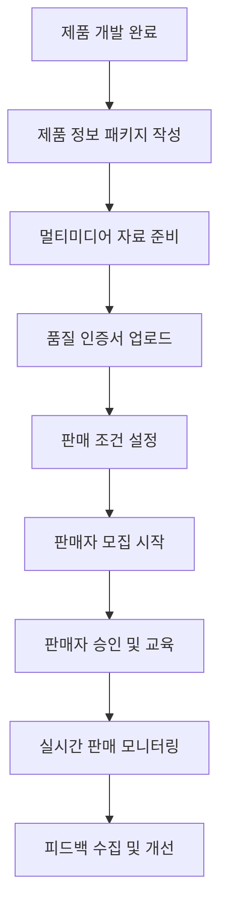
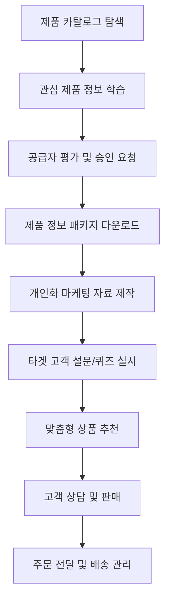
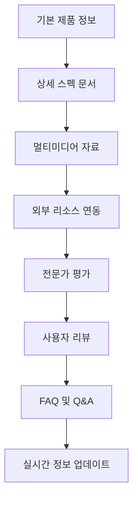

# 드랍쉬핑 모듈 UI/UX 설계 가이드

## 📋 모듈 개요

o4o-platform의 **드랍쉬핑 모듈**은 **B2B2C + 파트너 모델**을 기반으로 공급자(Supplier), 판매자(Reseller), 파트너(Partner)를 연결하고, 정보 중심의 다품종 소량판매 상품을 효율적으로 관리할 수 있는 통합 플랫폼입니다.

### 핵심 가치 제안
- **"정보가 곧 경쟁력"** - 풍부한 제품 정보로 신뢰도 기반 판매
- **"4-Way 생태계"** - 공급자-판매자-파트너-구매자 간 시너지 극대화
- **"법적 준수 기반 파트너십"** - 한국 법 규정 준수하는 건전한 파트너 시스템

### 비즈니스 모델 구조
```
공급자 (Supplier) → 판매자 (Reseller) → B2C/B2B 구매자
    ↓                   ↑              ↑
제품 개발/정보 제공    마케팅/고객 관리   등급별 혜택
품질 보증/배송       수수료율 요청      신뢰도 기반 구매
    ↓                   ↑              ↑
파트너 (Partner) ───────┘              ↑
추천/홍보 활동 ─────────────────────────┘
(법적 한도 내 수수료, 단일 계층만)
```

---

## 🎯 사용자 페르소나

### **주요 페르소나 1: 전문 공급자 "김제조" (45세, 제조업체 대표)**

**배경:**
- 건강기능식품/의료기기 제조 15년 경력
- 품질 좋은 제품 생산하지만 마케팅/유통 어려움
- 다수의 판매 파트너 관리 필요
- 제품 정보 전달과 신뢰도 구축이 핵심 관심사

**Goals:**
- 제품 정보의 체계적 관리 및 전달
- 신뢰할 수 있는 판매 파트너 네트워크 구축
- 브랜드 가치 보호 및 품질 유지
- 시장 피드백 수집을 통한 제품 개선
- **적정 파트너 수수료율 설정 및 관리**

**Pain Points:**
- 복잡한 제품 정보 전달 과정
- 판매자별 다른 정보 전달 품질
- 브랜드 일관성 유지의 어려움
- 고객 피드백 수집의 한계
- **파트너 수수료율 결정의 어려움**

**Success Metrics:**
- 제품 정보 완성도 > 90%
- 판매자 만족도 > 85%
- 브랜드 일관성 유지율 > 95%
- 월 신규 판매자 확보 > 10명
- **파트너 추천 전환율 > 5%**

### **주요 페르소나 2: 스마트 판매자 "이리셀" (34세, 온라인 쇼핑몰 운영)**

**배경:**
- 온라인 마케팅 7년 경력
- 다양한 채널 (자체몰, 쇼핑몰, SNS) 운영
- 고객과의 직접 소통 및 관계 관리 전문
- 정보 기반 신뢰 판매 추구

**Goals:**
- 차별화된 제품 포트폴리오 구성
- 고객별 맞춤 상품 추천 및 판매
- 제품 전문성 기반 신뢰도 구축
- 효율적인 다품종 소량 재고 관리
- **파트너와의 협력을 통한 매출 확대**

**Pain Points:**
- 제품 전문 지식 습득의 어려움
- 고객 문의 대응을 위한 정보 부족
- 많은 제품군 관리의 복잡성
- 공급자와의 소통 한계

**Success Metrics:**
- 제품 전문성 평가 > 80점
- 고객 문의 응답률 > 95%
- 월 신규 제품 온보딩 > 20개
- 고객 재구매율 > 60%
- **파트너 협력 매출 비중 > 30%**

### **주요 페르소나 3: 콘텐츠 파트너 "박인플루" (29세, 건강 유튜버)**

**배경:**
- 건강/웰니스 분야 유튜브 채널 운영 (구독자 15만명)
- 인스타그램, 블로그 등 멀티 플랫폼 활동
- 제품 리뷰 및 건강 정보 콘텐츠 제작 전문
- 팔로워들과의 신뢰 관계 중시

**Goals:**
- 팔로워에게 도움이 되는 제품만 추천
- 신뢰할 수 있는 브랜드와의 장기 파트너십
- 안정적인 추천 수수료 수익 확보
- 전문성 향상을 위한 제품 교육 참여

**Pain Points:**
- 제품 품질과 효과에 대한 불확실성
- 팔로워 신뢰도 손상 우려
- 마케팅 소재 제작의 시간/비용 부담
- **법적 규정 준수의 복잡성**

**Success Metrics:**
- 추천 제품 만족도 > 90%
- 월 추천 수수료 > 200만원
- 팔로워 증가율 > 5% (월간)
- 브랜드 협업 만족도 > 85%
- **법적 준수율 100% 유지**

### **보조 페르소나: B2B 구매자 "박매니저" (41세, 병원/약국 구매담당)**

**Goals:**
- 검증된 품질의 의료/건강 제품 조달
- 합리적 가격의 대량 구매 (기업 할인)
- 신속하고 정확한 배송 서비스
- 전문적인 제품 지원 및 교육

**Pain Points:**
- 제품 품질 검증의 어려움
- 복잡한 B2B 구매 프로세스
- 충분하지 않은 제품 교육 자료
- **기업 등급별 혜택의 복잡성**

---

## 🚀 핵심 사용자 플로우

### **공급자 플로우: 제품 등록부터 판매자 관리까지**



### **판매자 플로우: 제품 발굴부터 고객 판매까지**



### **정보 중심 제품 관리 플로우**



#### **세부 단계별 UI 요구사항:**

**1단계: 통합 제품 정보 허브**
```
┌─ 제품 정보 완성도 체크 ──────────────────┐
│ 기본 정보: ████████████████████ 100%  │
│ 멀티미디어: ████████████████░░░░ 80%   │
│ 외부 리소스: ████████░░░░░░░░░░░ 40%   │
│ 인증/검증: ████████████████████ 100%  │
│ 사용자 콘텐츠: ████████░░░░░░░░░ 60%   │
│                                    │
│ [부족한 정보 보완하기] [AI 제안 받기]    │
└──────────────────────────────────────┘
```

**2단계: 외부 리소스 통합 관리**
```
┌─ 연결된 외부 리소스 ─────────────────┐
│ 🎬 유튜브 영상 (5개)                │
│   ├─ 제품 소개 영상 (조회수: 1.2K)   │
│   ├─ 사용법 튜토리얼 (조회수: 890)   │
│   └─ 고객 후기 영상 (조회수: 1.5K)   │
│                                   │
│ 📝 블로그/기사 (12개)               │
│   ├─ 전문가 리뷰 (네이버 블로그)     │
│   ├─ 성분 분석 (다음 카페)          │
│   └─ 효과 검증 (의학 저널)          │
│                                   │
│ 📱 SNS 콘텐츠 (15개)               │
│   ├─ 인스타그램 체험 후기           │
│   ├─ 틱톡 사용법 영상              │
│   └─ 페이스북 커뮤니티 토론         │
│                                   │
│ [새 리소스 추가] [자동 수집 설정]    │
└─────────────────────────────────────┘
```

**3단계: 스마트 타겟 마케팅**
```
┌─ 고객 프로파일링 퀴즈 ─────────────────┐
│ "당신에게 맞는 건강기능식품 찾기"        │
│                                      │
│ Q1. 주요 관심 건강 분야는? (복수선택)    │
│ □ 면역력 강화  □ 소화 건강            │
│ □ 관절 건강   □ 피부 미용            │
│ □ 피로 회복   □ 수면 개선            │
│                                      │
│ Q2. 현재 복용 중인 영양제가 있나요?     │
│ ○ 없음  ○ 1-2개  ○ 3-5개  ○ 5개 이상 │
│                                      │
│ Q3. 월 건강기능식품 예산은?            │
│ ○ 5만원 미만  ○ 5-10만원            │
│ ○ 10-20만원  ○ 20만원 이상          │
│                                      │
│ [결과 보기 및 맞춤 상품 추천]           │
└────────────────────────────────────┘
```

---

## 🎨 비주얼 디자인 시스템

### **컬러 팔레트 (카테고리별)**

#### **건강기능식품/의료기기**
```css
--health-primary: #2563EB;    /* 신뢰의 블루 */
--health-secondary: #1E40AF;  /* 깊은 블루 */
--health-accent: #10B981;     /* 성장의 그린 */
--health-background: #F8FAFC; /* 클린 화이트 */
```

#### **화장품/뷰티**
```css
--beauty-primary: #EC4899;    /* 활기찬 핑크 */
--beauty-secondary: #BE185D;  /* 깊은 핑크 */
--beauty-accent: #F59E0B;     /* 럭셔리 골드 */
--beauty-background: #FEF7FF; /* 소프트 핑크 화이트 */
```

#### **일반 상품**
```css
--general-primary: #6366F1;   /* 모던 바이올렛 */
--general-secondary: #4F46E5; /* 깊은 바이올렛 */
--general-accent: #06B6D4;    /* 생동감 있는 시안 */
--general-background: #FAFAFA; /* 뉴트럴 그레이 */
```

### **타이포그래피 스케일**

#### **상품 관리 화면**
```css
.product-title {
  font-size: 1.5rem;
  font-weight: 600;
  line-height: 1.4;
}

.product-description {
  font-size: 1rem;
  font-weight: 400;
  line-height: 1.6;
  color: var(--text-secondary);
}

.price-display {
  font-size: 1.25rem;
  font-weight: 700;
  color: var(--success-color);
}
```

---

## 🧩 핵심 컴포넌트 설계

### **1. ProductInfoHub 컴포넌트 (정보 허브)**

#### **기능 요구사항:**
- 체계적인 제품 정보 관리
- 외부 리소스 자동 수집 및 검증
- 정보 완성도 실시간 체크
- 다국어 정보 지원
- 버전 관리 및 업데이트 추적
- **파트너용 마케팅 가이드 생성**

#### **UI 구조:**
```jsx
<ProductInfoHub>
  <InfoCompletionMeter>
    <BasicInfoProgress />
    <MediaProgress />
    <ExternalResourceProgress />
    <CertificationProgress />
    <UserContentProgress />
    <PartnerContentProgress />
  </InfoCompletionMeter>
  
  <InfoTabs>
    <BasicInfoTab>
      <ProductSpecs />
      <PricingInfo />
      <InventoryStatus />
      <CommissionSettings />
    </BasicInfoTab>
    
    <MediaTab>
      <ImageGallery />
      <VideoLibrary />
      <DocumentCenter />
      <PartnerMarketingAssets />
    </MediaTab>
    
    <ExternalResourceTab>
      <YouTubeIntegration />
      <BlogConnector />
      <SNSContentAggregator />
      <ExpertReviewCollector />
    </ExternalResourceTab>
    
    <PartnerTab>
      <MarketingGuideGenerator />
      <ComplianceChecker />
      <PerformanceAnalytics />
      <LegalGuidelines />
    </PartnerTab>
  </InfoTabs>
</ProductInfoHub>
```

### **2. CommissionManagementSystem 컴포넌트 (수수료 관리 시스템)**

#### **수수료율 요청 및 승인 워크플로우:**
```
┌─ 수수료율 요청 관리 ──────────────────────┐
│                                        │
│ 📋 요청 현황                            │
│ ┌─ 대기 중인 요청 (3건) ──────────────┐ │
│ │ • 건강식품 카테고리: 25% → 검토 중   │ │
│ │ • 화장품 라인: 30% → 승인 권장       │ │
│ │ • 의료기기: 35% → 법적 검토 필요     │ │
│ └────────────────────────────────────┘ │
│                                        │
│ ⚖️ 법적 준수 체크                       │
│ ├─ 최대 한도: 35% 미만 ✅              │
│ ├─ 단일 계층: 다단계 금지 ✅            │
│ ├─ 투명성: 수수료 공개 ✅              │
│ └─ 모니터링: 실시간 감시 활성화 ✅       │
│                                        │
│ 🎯 자동 추천 수수료율                   │
│ 카테고리별 평균: 건강식품 18%, 화장품 22%│
│ 경쟁력 분석: 시장 대비 +3% 권장         │
│                                        │
│ [승인] [조건부 승인] [거절] [상세 검토]  │
└────────────────────────────────────────┘
```

#### **UI 구조:**
```jsx
<CommissionManagementSystem>
  <RequestQueue>
    <PendingRequests />
    <RequestDetails />
    <LegalComplianceCheck />
    <MarketAnalysis />
  </RequestQueue>
  
  <ApprovalWorkflow>
    <ReviewInterface />
    <DecisionMatrix />
    <FeedbackSystem />
    <NotificationManager />
  </ApprovalWorkflow>
  
  <MonitoringDashboard>
    <RealTimeCompliance />
    <PerformanceMetrics />
    <AlertSystem />
    <AuditTrail />
  </MonitoringDashboard>
</CommissionManagementSystem>
```

### **3. PartnerDashboard 컴포넌트 (파트너 전용 대시보드)**

#### **파트너 성과 및 수수료 추적:**
```
┌─ 파트너 성과 대시보드 ────────────────────┐
│                                         │
│ 👤 박인플루 (골드 파트너)                │
│ 🏆 등급: 골드 | 수수료율: 8-25%          │
│                                         │
│ 💰 이번 달 수익 현황                     │
│ ├─ 추천 수수료: ₩1,850,000              │
│ ├─ 성과 보너스: ₩150,000                │
│ ├─ 신규 가입: ₩50,000                   │
│ └─ 총 수익: ₩2,050,000                  │
│                                         │
│ 📊 성과 지표                            │
│ ├─ 클릭 수: 12,547 (전월 대비 +15%)     │
│ ├─ 전환율: 4.8% (목표 5% 달성 예정)      │
│ ├─ 평균 주문액: ₩127,000                │
│ └─ 고객 만족도: 4.7/5.0                 │
│                                         │
│ 🎯 이번 달 목표                         │
│ ├─ 추천 매출: ₩15,000,000 (진행률 67%)  │
│ ├─ 신규 고객: 50명 (달성 35명)           │
│ └─ 플래티넘 승급까지: ₩8,150,000 남음    │
│                                         │
│ ⚖️ 법적 준수 현황                       │
│ ├─ 수수료율 준수: ✅ 35% 미만 유지       │
│ ├─ 마케팅 가이드: ✅ 준수               │
│ ├─ 다단계 금지: ✅ 위반 사항 없음        │
│ └─ 교육 이수: ✅ 최신 교육 완료          │
│                                         │
│ [마케팅 소재] [성과 분석] [교육 센터]     │
└─────────────────────────────────────────┘
```

### **4. CustomerTierManager 컴포넌트 (고객 등급 관리)**

#### **B2C/B2B 등급별 차등 서비스 제공:**
```
┌─ 고객 등급 관리 시스템 ──────────────────┐
│                                         │
│ 🏪 B2C 고객 등급 현황                    │
│ ┌─ VIP Member: 김○○ ──────────────────┐ │
│ │ 연간 구매액: ₩3,200,000              │ │
│ │ 할인 혜택: 15% (파트너 추천 +5%)      │ │
│ │ 적립률: 3% | 무료배송: 항상           │ │
│ │ 전담 상담사: 이○○ 매니저             │ │
│ │ 접근 가능: VIP 독점 제품 127개        │ │
│ │ [등급 혜택 상세] [개인화 서비스]       │ │
│ └─────────────────────────────────────┘ │
│                                         │
│ 🏢 B2B 기업 등급 현황                    │
│ ┌─ Enterprise VIP: 서울대병원 ────────┐ │
│ │ 연간 구매액: ₩280,000,000            │ │
│ │ 기업 할인: 25% (대량 구매 +10%)       │ │
│ │ 결제 조건: NET 60일                  │ │
│ │ 전담 매니저: 박○○ 이사               │ │
│ │ 특별 혜택: OEM 개발, 독점 공급        │ │
│ │ [계약 관리] [맞춤 서비스]             │ │
│ └─────────────────────────────────────┘ │
│                                         │
│ 🎯 등급 승급 예측 (AI 기반)              │
│ ├─ Premium 승급 후보: 47명 (3개월 내)    │
│ ├─ VIP 승급 후보: 12명 (6개월 내)       │
│ ├─ 기업 등급 상향: 3곳 (분기 내)        │
│ └─ 이탈 위험 고객: 8명 (즉시 관리 필요)  │
└─────────────────────────────────────────┘
```

### **5. MallIntegrationHub 컴포넌트 (몰 통합 연동 허브)**

#### **B2C/B2B 몰 분리 관리:**
```jsx
<MallIntegrationHub>
  <MallSelector>
    <B2CMallSwitch />
    <B2BMallSwitch />
    <CrossMallAnalytics />
  </MallSelector>
  
  <B2CMallInterface>
    <IndividualCustomerView />
    <EmotionalPurchaseOptimization />
    <SocialProofIntegration />
    <MobileFirstDesign />
  </B2CMallInterface>
  
  <B2BMallInterface>
    <CorporatePurchaseWorkflow />
    <BulkOrderManagement />
    <ContractBasedPricing />
    <EnterpriseFeatures />
  </B2BMallInterface>
  
  <TierBasedServices>
    <DynamicPricing />
    <AccessControlManager />
    <PersonalizationEngine />
    <LoyaltyProgramManager />
  </TierBasedServices>
</MallIntegrationHub>
```

### **6. LegalComplianceMonitor 컴포넌트 (법적 준수 모니터링)**

#### **실시간 법적 규정 준수 감시:**
```
┌─ 법적 준수 모니터링 시스템 ──────────────┐
│                                         │
│ ⚖️ 실시간 준수 현황                      │
│ ├─ 수수료율 체크: ✅ 모든 제품 35% 미만   │
│ ├─ 단일 계층 검증: ✅ 다단계 모집 0건     │
│ ├─ 투명성 준수: ✅ 수수료 정보 100% 공개  │
│ └─ 마케팅 규정: ⚠️ 과대광고 의심 2건     │
│                                         │
│ 🚨 알림 및 조치 사항                     │
│ ├─ 즉시 조치: 과대광고 콘텐츠 검토 필요   │
│ ├─ 정기 점검: 월간 법적 준수 감사 예정    │
│ ├─ 교육 알림: 신규 파트너 교육 3건 대기   │
│ └─ 업데이트: 법령 변경 사항 2건 검토     │
│                                         │
│ 📋 준수 교육 프로그램                    │
│ ├─ 기본 과정: 파트너 마케팅 윤리 (필수)   │
│ ├─ 심화 과정: 법적 리스크 관리 (권장)     │
│ ├─ 업데이트: 최신 법령 변경 사항 (월간)   │
│ └─ 테스트: 준수 이해도 평가 (분기별)      │
│                                         │
│ [상세 보고서] [조치 계획] [교육 관리]      │
└─────────────────────────────────────────┘
```

### **2. SurveyQuizEngine 컴포넌트 (타겟 마케팅 핵심!)**

#### **기능 요구사항:**
- 동적 설문/퀴즈 생성
- 실시간 결과 분석
- 개인화 추천 연동
- A/B 테스트 지원
- 다양한 질문 타입 지원

#### **UI 구조:**
```jsx
<SurveyQuizEngine>
  <QuestionBuilder>
    <QuestionTypes>
      <MultipleChoice />
      <Rating />
      <Slider />
      <TextInput />
      <ImageSelection />
      <VideoResponse />
    </QuestionTypes>
    
    <ConditionalLogic>
      <BranchingRules />
      <SkipLogic />
      <PersonalizationTriggers />
    </ConditionalLogic>
  </QuestionBuilder>
  
  <ResponseCollector>
    <UserInterface>
      <ProgressIndicator />
      <QuestionDisplay />
      <ResponseCapture />
      <NavigationControls />
    </UserInterface>
    
    <DataValidation>
      <InputValidation />
      <LogicConsistency />
      <CompletionChecks />
    </DataValidation>
  </ResponseCollector>
  
  <AnalyticsEngine>
    <RealTimeResults />
    <SegmentAnalysis />
    <RecommendationGeneration />
    <InsightExtraction />
  </AnalyticsEngine>
</SurveyQuizEngine>
```

### **3. B2BOrderManager 컴포넌트 (B2B 구매 최적화)**

#### **대량 주문 및 기업 구매 최적화:**
```
┌─ B2B 전용 주문 인터페이스 ─────────────┐
│ 구매 유형: ○ 정기 주문  ○ 일회성 주문  │
│ 수량: [    ] (최소 주문량: 100개)    │
│ 배송지: [복수 배송지 관리]            │
│ 결제: ○ 월말 정산  ○ 즉시 결제       │
│                                    │
│ 💰 수량별 할인                      │
│ 100-499개: 5% 할인                │
│ 500-999개: 10% 할인               │
│ 1000개 이상: 15% 할인              │
│                                    │
│ 📋 필수 서류                       │
│ ☑ 사업자등록증                     │
│ ☑ 구매 권한 증명서                 │
│ □ 의료기기 취급 허가증 (해당시)      │
│                                    │
│ [견적서 요청] [즉시 주문]            │
└──────────────────────────────────┘
```

### **4. TrustScoreCalculator 컴포넌트 (신뢰도 시각화)**

#### **종합 신뢰도 점수 산출:**
```
┌─ 제품 신뢰도 점수: 87점 ─────────────┐
│ ⭐⭐⭐⭐⭐ (4.3/5.0)                │
│                                    │
│ 📊 세부 평가                       │
│ 품질 인증: ████████████████░░ 90%  │
│ 전문가 평가: ████████████░░░░ 85%  │
│ 사용자 만족: ████████████████░░ 88%│
│ 정보 완성도: ████████████░░░░ 82%  │
│ 공급자 신뢰: ████████████████░░ 92%│
│                                    │
│ 🏆 인증 마크                       │
│ [GMP] [FDA승인] [ISO9001] [유기농]  │
│                                    │
│ 📝 신뢰도 향상 제안                │
│ • 사용자 리뷰 15개 더 필요          │
│ • 제품 시연 영상 추가 권장          │
└──────────────────────────────────┘
```

### **5. SupplierResellerBridge 컴포넌트 (공급자-판매자 연결)**

#### **양방향 소통 및 협업 도구:**
```jsx
<SupplierResellerBridge>
  <CommunicationHub>
    <MessagingSystem />
    <VideoConferencing />
    <DocumentSharing />
    <NotificationCenter />
  </CommunicationHub>
  
  <CollaborationTools>
    <ProductInfoSharing />
    <MarketingMaterialLibrary />
    <TrainingContentDelivery />
    <FeedbackCollection />
  </CollaborationTools>
  
  <PerformanceTracking>
    <SalesMetrics />
    <CustomerSatisfaction />
    <PartnershipScore />
    <ImprovementSuggestions />
  </PerformanceTracking>
</SupplierResellerBridge>
```

### **2. ProductGrid 컴포넌트**

#### **카드 구조:**
```
┌─────────────────┐
│   [제품 이미지]    │
├─────────────────┤
│ 제품명            │
│ 공급업체: ABC     │
│ 원가: ₩15,000    │
│ 권장가: ₩45,000   │
│ 예상수익: ₩30,000 │
│ [커스터마이즈] 버튼 │
└─────────────────┘
```

#### **상호작용:**
- **Hover**: 제품 정보 오버레이 표시
- **Click**: 상세 페이지 이동
- **Quick Action**: 빠른 커스터마이즈 버튼

### **3. Dashboard 컴포넌트**

#### **레이아웃 구성:**
```
┌─ 매출 요약 ─┬─ 주문 현황 ─┬─ 인기 상품 ─┐
│ 이번달: ₩2M │ 신규: 15    │ 1. 비타민C  │
│ 증감: +15%  │ 처리중: 8   │ 2. 콜라겐   │
└────────────┴────────────┴────────────┘

┌─────── 최근 활동 ──────────────────────┐
│ • 15분 전: 새 주문 접수 (#1234)         │
│ • 1시간 전: "프로틴" 상품 승인 완료      │
│ • 3시간 전: 고객 문의 1건               │
└──────────────────────────────────────┘
```

---

## 📱 반응형 디자인 전략

### **Mobile (320-768px)**

#### **우선순위:**
1. **상품 탐색** - 스와이프 기반 카드 인터페이스
2. **간단한 커스터마이징** - 핵심 기능만 노출
3. **주문 관리** - 알림 중심 인터페이스

#### **UI 적응:**
```css
/* Mobile First Approach */
.product-grid {
  display: grid;
  grid-template-columns: 1fr;
  gap: 1rem;
}

.customizer-panel {
  position: fixed;
  bottom: 0;
  height: 60vh;
  transform: translateY(100%);
  transition: transform 0.3s ease;
}

.customizer-panel.active {
  transform: translateY(0);
}
```

### **Tablet (768-1024px)**

#### **UI 개선사항:**
- 2열 상품 그리드
- 사이드바 내비게이션
- 분할 화면 커스터마이저

### **Desktop (1024px+)**

#### **생산성 향상:**
- 3-4열 상품 그리드
- 멀티윈도우 상품 관리
- 고급 필터링 및 정렬
- 배치 작업 인터페이스

---

## 🔧 고급 기능 및 최적화

### **스마트 추천 시스템**

#### **상품 추천 알고리즘:**
```javascript
// 사용자 행동 기반 추천
const recommendations = {
  trending: '현재 인기 급상승 상품',
  seasonal: '계절별 추천 상품',
  profitable: '고수익 상품',
  quickWin: '빠른 판매 가능 상품'
};
```

#### **UI 표현:**
```
┌─ 김비즈님을 위한 추천 ─┐
│ 🔥 지금 핫한 상품      │
│ 💰 고수익 상품         │  
│ ⚡ 빠른 판매 상품      │
│ 🎯 맞춤 상품          │
└─────────────────────┘
```

### **A/B 테스트 기반 최적화**

#### **테스트 대상:**
1. **CTA 버튼 텍스트**: "커스터마이즈" vs "내 브랜드 만들기"
2. **상품 카드 레이아웃**: 정보 위치 및 크기
3. **가격 표시 방식**: 원가 표시 여부
4. **커스터마이저 플로우**: 단계별 vs 한 페이지

### **성능 최적화**

#### **핵심 최적화 포인트:**
```javascript
// 이미지 최적화
const imageOptimization = {
  webp: '차세대 포맷 지원',
  lazyLoading: '뷰포트 진입 시 로드',
  responsive: '디바이스별 적절한 해상도',
  cdn: 'CloudFront 캐싱'
};

// 상태 관리 최적화  
const stateOptimization = {
  virtualization: '대량 상품 리스트 가상화',
  caching: 'React Query로 서버 상태 캐싱',
  debouncing: '검색/필터 디바운싱',
  memo: '컴포넌트 메모이제이션'
};
```

---

## 📊 성공 지표 및 측정

### **사용성 KPI**

#### **핵심 지표:**
- **Time to First Product**: 첫 상품 등록까지 시간 < 10분
- **Customization Completion Rate**: 커스터마이징 완료율 > 85%
- **Product Launch Rate**: 등록 후 실제 판매 시작률 > 70%

#### **비즈니스 지표:**
- **Average Revenue per User (ARPU)**: 월평균 사용자당 수익
- **Customer Lifetime Value (CLV)**: 고객 생애 가치
- **Monthly Recurring Revenue (MRR)**: 월 반복 수익

### **데이터 수집 포인트**

```javascript
// 사용자 행동 추적
const trackingEvents = {
  'product_view': { productId, category, duration },
  'customization_start': { productId, timestamp },
  'customization_complete': { productId, changes, duration },
  'product_launch': { productId, pricing, category },
  'search_query': { query, results, clicked }
};
```

---

## 🎯 개발 우선순위 및 로드맵

### **MVP (Minimum Viable Product) - 6주**
1. **기본 상품 탐색** - 그리드 뷰, 기본 필터
2. **간단한 커스터마이징** - 텍스트, 로고 변경
3. **가격 계산** - 기본 마진 설정
4. **상품 등록** - 기본 정보 입력
5. **기본 파트너 등록** - 단순 추천 링크 생성
6. **법적 준수 기반 구조** - 35% 한도, 단일 계층 검증

### **V1.0 - 10주** 
1. **고급 커스터마이징** - 3D 미리보기, 색상 변경
2. **통합 대시보드** - 공급자/판매자/파트너별 분리 인터페이스
3. **수수료 관리 시스템** - 요청/승인 워크플로우
4. **등급별 차등 서비스** - B2C/B2B 몰 분리, 회원 등급 시스템
5. **파트너 마케팅 허브** - 소재 제공, 성과 추적
6. **법적 준수 모니터링** - 실시간 감시, 자동 알림

### **V1.5 - 14주**
1. **스마트 추천** - AI 기반 상품 추천
2. **고급 분석** - 매출 트렌드, 상품 성과, 파트너 성과
3. **배치 관리** - 대량 상품 처리
4. **B2B 전용 기능** - 기업 주문, 계약 관리, 전담 서비스
5. **파트너 교육 시스템** - 법적 준수 교육, 마케팅 트레이닝
6. **크로스 몰 연동** - B2C/B2B 몰 데이터 통합 분석

### **V2.0 - 18주**
1. **AI 기반 수수료 최적화** - 시장 분석 기반 추천 수수료율
2. **고급 파트너 관리** - 성과 예측, 개인화 지원
3. **국제화 지원** - 다국가 법령 준수, 다국어 파트너 교육
4. **통합 CRM** - 고객 생애 가치 분석, 등급 승급 예측
5. **API 통합** - 외부 쇼핑몰 연동
6. **블록체인 투명성** - 수수료 지급 투명성, 스마트 계약

---

## 🔄 다른 모듈과의 연계점

### **크라우드펀딩 모듈 연계**
- 드랍쉬핑 상품 → 펀딩 캠페인 전환 (신뢰도 데이터 활용)
- 펀딩 성공 시 → 자동 드랍쉬핑 상품 등록 (검증된 수요 기반)
- **정보 패키지 공유**: 펀딩용 상세 설명 → 드랍쉬핑 제품 정보
- **파트너 크로스 프로모션**: 펀딩 캠페인 → 파트너 추천 연동

### **포럼 모듈 연계**  
- **제품별 전문 커뮤니티** 자동 생성
- **4-Way 소통 지원**: 공급자-판매자-파트너-구매자 간 소통
- **Q&A 시스템**: 기술적 문의, 사용법, 효과 검증
- **전문가 상담 연결**: 의료진, 영양사, 전문가 직접 상담
- **파트너 교육 포럼**: 법적 준수, 마케팅 기법 공유

### **디지털 사이니지 연계**
- **타겟 마케팅 데이터** 활용한 맞춤형 사이니지 콘텐츠
- **B2B 매장용 디스플레이**: 제품 정보, 인증서, 사용법 안내
- **실시간 재고/가격 정보** 자동 업데이트
- **설문 결과 기반** 개인화 광고 콘텐츠
- **파트너 성과 데이터** 기반 최적 광고 타이밍

### **새로운 통합 기능**

#### **4-Way 통합 고객 여정 관리**
```
발견 → 학습 → 검증 → 구매 → 사용 → 재구매 → 추천
  ↓      ↓      ↓      ↓      ↓       ↓       ↓
퀴즈   정보허브  리뷰   결제   지원   커뮤니티  파트너활동
```

#### **법적 준수 크로스 모듈 관리**
```
수수료 모니터링 → 전체 모듈 파트너 활동 감시
     ↓              ↓           ↓
교육 시스템    → 포럼 가이드 → 사이니지 규정
     ↓              ↓           ↓
법적 업데이트  → 펀딩 규정   → 실시간 알림
```

#### **통합 성과 분석**
```
파트너 성과 → 제품별 추천 효과 → 최적 수수료율 도출
     ↓           ↓                    ↓
고객 등급   → 구매 패턴 분석    → 개인화 서비스
     ↓           ↓                    ↓  
매출 예측   → 재고 최적화      → 공급자 계획 지원
```

---

*이 가이드는 법적 준수를 기반으로 한 건전한 파트너 생태계 구축과 함께 o4o-platform 드랍쉬핑 모듈의 성공적인 구현을 위한 상세 청사진입니다.*

---

*이 가이드는 o4o-platform 드랍쉬핑 모듈의 성공적인 구현을 위한 상세 청사진으로, 개발팀과 디자인팀의 협업 기준점이 됩니다.*
