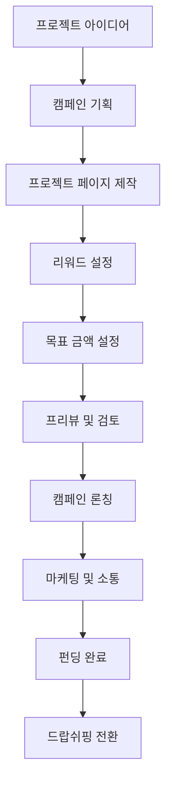
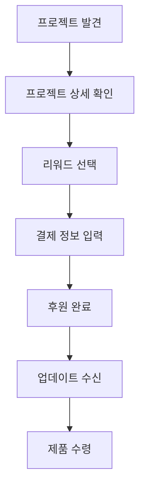

# 크라우드펀딩 모듈 UI/UX 설계 가이드

## 📋 모듈 개요

o4o-platform의 **크라우드펀딩 모듈**은 정보 중심 제품의 특성을 살려 **신뢰도 기반 펀딩**을 지원하는 플랫폼입니다. 단순한 자금 조달을 넘어 제품 정보의 투명성과 검증 가능성을 통해 후원자의 신뢰를 얻고, **파트너와의 크로스 프로모션**을 통한 확산 효과, 성공 후 드랍쉬핑으로의 완벽한 연계를 제공합니다.

### 핵심 가치 제안
- **"투명성이 곧 신뢰도"** - 모든 제품 정보의 검증 가능한 공개
- **"정보 기반 의사결정"** - 충분한 정보 제공을 통한 현명한 후원
- **"파트너 협력 확산"** - 전문 파트너를 통한 신뢰도 있는 홍보
- **"펀딩 후 지속가능성"** - 드랍쉬핑 연동으로 지속적 제품 공급

### 확장된 펀딩 모델 (4-Way 생태계)
```
제품 개발 → 정보 패키지 구축 → 전문가 검증 → 투명 공개 → 신뢰 기반 펀딩
    ↓           ↓              ↓           ↓           ↓
기술 검증   사용자 매뉴얼     제3자 평가   모든 정보    후원자 확신
품질 보증   안전성 데이터     인증 획득     실시간 공개   파트너 추천
    ↓           ↓              ↓           ↓           ↓
파트너 교육 → 전문가 리뷰 → 크로스 홍보 → 신뢰 확산 → 목표 달성
```

---

## 🎯 사용자 페르소나

### **주요 페르소나 1: 정보 투명 창업자 "박트루스트" (35세, 의료기기 개발자)**

**배경:**
- 의료기기/건강 제품 개발 10년 경력
- 기술력은 뛰어나지만 마케팅 자금 부족
- 제품의 과학적 근거와 안전성에 대한 강한 확신
- 투명한 정보 공개를 통한 신뢰 구축 지향

**Goals:**
- 제품의 과학적 우수성을 명확히 전달
- 충분한 검증 자료를 통한 후원자 신뢰 확보
- **전문 파트너와의 협력을 통한 확산 효과**
- 펀딩 성공 후 지속가능한 사업 모델 구축
- 전문가 네트워크와의 협력 관계 형성

**Pain Points:**
- 복잡한 기술 정보의 일반인 이해도 문제
- 검증 비용과 시간의 부담
- 경쟁 제품 대비 차별화 어려움
- 펀딩 후 생산 및 유통 체계 구축
- **파트너 관리 및 수수료 정책 결정**

**Success Metrics:**
- 정보 투명성 지수 > 95%
- 전문가 추천율 > 80%
- 목표 달성률 > 150%
- 펀딩 후 드랍쉬핑 전환률 > 90%
- **파트너 추천 기여도 > 30%**

### **주요 페르소나 2: 신중한 후원자 "최검증" (42세, 의료진)**

**배경:**
- 간호사 15년 경력, 의료 제품에 대한 전문적 이해
- 가족 건강을 위한 제품에 관심 많음
- 근거 없는 과대광고에 대한 거부감 강함
- 투자보다는 실용성 중심의 후원

**Goals:**
- 과학적으로 검증된 제품에만 후원
- 가족과 환자에게 추천할 수 있는 신뢰성
- 합리적 가격의 얼리버드 혜택
- 지속적인 제품 개선 과정 참여
- **신뢰할 수 있는 파트너의 추천 정보 활용**

**Pain Points:**
- 과장된 광고와 실제 효과의 차이
- 부족한 임상 데이터나 검증 자료
- 펀딩 후 제품 품질 변화 우려
- 의료진으로서의 책임감과 후원 결정의 딜레마
- **파트너 추천의 신뢰성 판단 어려움**

### **주요 페르소나 3: 펀딩 전문 파트너 "이크라우드" (38세, 펀딩 전문 마케터)**

**배경:**
- 크라우드펀딩 마케팅 전문가 7년 경력
- 다수의 성공 펀딩 프로젝트 경험 보유
- 블로그, 유튜브를 통한 펀딩 프로젝트 소개 전문
- **법적 준수를 기반으로 한 건전한 마케팅 추구**

**Goals:**
- 정말 좋은 프로젝트만 선별하여 추천
- 팔로워들에게 실질적 도움이 되는 펀딩 소개
- **법적 한도 내에서 안정적인 추천 수수료 확보**
- 장기적 신뢰 관계 기반 파트너십 구축

**Pain Points:**
- 프로젝트 품질과 성공 가능성 판단의 어려움
- 팔로워 신뢰도 유지와 수익성 균형
- **법적 규정 준수의 복잡성 (35% 미만, 단일계층)**
- 펀딩 실패 시 팔로워 신뢰도 손상 우려

**Success Metrics:**
- 추천 프로젝트 성공률 > 80%
- 팔로워 만족도 > 90%
- **월 추천 수수료 > 300만원 (법적 한도 내)**
- **법적 준수율 100% 유지**

---

## 🚀 핵심 사용자 플로우

### **창업자 플로우: 프로젝트 생성부터 펀딩 완료까지**



### **후원자 플로우: 발견부터 후원까지**



---

## 🎨 비주얼 디자인 시스템

### **컬러 팔레트**

#### **신뢰와 혁신을 표현하는 컬러 시스템**
```css
--crowdfunding-primary: #FF6B35;     /* 열정의 오렌지 */
--crowdfunding-secondary: #004E89;   /* 신뢰의 네이비 */
--crowdfunding-accent: #00A8CC;      /* 혁신의 시안 */
--crowdfunding-success: #10B981;     /* 성공 그린 */
--crowdfunding-warning: #F59E0B;     /* 주의 오렌지 */
--crowdfunding-neutral: #6B7280;     /* 정보 그레이 */
```

#### **펀딩 상태별 컬러**
```css
--funding-preparing: #8B5CF6;       /* 준비 중 */
--funding-active: #10B981;          /* 진행 중 */
--funding-success: #059669;         /* 성공 */
--funding-failed: #DC2626;          /* 실패 */
--funding-delivered: #374151;       /* 배송 완료 */
```

### **타이포그래피**

#### **감성적 스토리텔링 중심**
```css
.project-hero-title {
  font-size: 3rem;         /* 48px */
  font-weight: 800;
  line-height: 1.1;
  letter-spacing: -0.02em;
}

.project-subtitle {
  font-size: 1.25rem;      /* 20px */
  font-weight: 400;
  line-height: 1.5;
  color: var(--crowdfunding-neutral);
}

.funding-amount {
  font-size: 2rem;         /* 32px */
  font-weight: 700;
  color: var(--crowdfunding-primary);
}

.reward-title {
  font-size: 1.125rem;     /* 18px */
  font-weight: 600;
  line-height: 1.4;
}
```

---

## 🧩 핵심 컴포넌트 설계

### **1. TransparencyHub 컴포넌트 (투명성 허브 고도화)**

#### **기능 요구사항:**
- 모든 제품 정보의 체계적 공개
- 실시간 검증 상태 표시
- 외부 검증 기관 연동
- 투명성 점수 자동 계산
- 정보 업데이트 이력 추적
- **파트너 추천 근거 투명 공개**
- **수수료 구조 명시 (법적 준수)**

#### **UI 구조:**
```jsx
<TransparencyHub>
  <TransparencyMeter>
    <OverallScore />
    <CategoryBreakdown />
    <PartnerEndorsements />
    <ImprovementSuggestions />
  </TransparencyMeter>
  
  <VerificationCenter>
    <TechnicalSpecs>
      <DetailedSpecifications />
      <TestResults />
      <QualityAssurance />
    </TechnicalSpecs>
    
    <SafetyDocumentation>
      <SafetyTestReports />
      <RegulatoryApprovals />
      <RiskAssessments />
    </SafetyDocumentation>
    
    <ExpertValidation>
      <ProfessionalReviews />
      <ThirdPartyAssessments />
      <AcademicEndorsements />
      <PartnerExpertOpinions />
    </ExpertValidation>
    
    <PartnerTransparency>
      <PartnerCredentials />
      <RecommendationBasis />
      <CommissionStructure />
      <LegalCompliance />
    </PartnerTransparency>
  </VerificationCenter>
</TransparencyHub>
```

### **2. PartnerCrossPromotionEngine 컴포넌트 (신규 핵심!)**

#### **파트너 크로스 프로모션 관리:**
```
┌─ 파트너 크로스 프로모션 허브 ─────────────┐
│                                         │
│ 🤝 참여 파트너 현황 (15명)               │
│ ┌─ 골드 파트너: 이크라우드 ─────────────┐ │
│ │ 전문 분야: 헬스케어 크라우드펀딩       │ │
│ │ 팔로워: 125K | 평균 후원 유도: 8.5%   │ │
│ │ 추천 예정일: 2024-07-20              │ │
│ │ 예상 추천 수수료: ₩2,400,000         │ │
│ │ [협업 세부사항] [콘텐츠 승인]         │ │
│ └─────────────────────────────────────┘ │
│                                         │
│ 📊 크로스 프로모션 성과 예측             │
│ ├─ 예상 추가 후원자: 450명              │
│ ├─ 예상 추가 펀딩: ₩18,500,000         │
│ ├─ 파트너 수수료 총액: ₩6,200,000       │ │
│ └─ 순 증대 효과: ₩12,300,000           │
│                                         │
│ ⚖️ 법적 준수 체크                       │
│ ├─ 모든 파트너 수수료 < 35%             │
│ ├─ 단일 계층 구조 유지                 │
│ ├─ 투명한 수수료 공개                  │
│ └─ 과대광고 방지 가이드라인 준수        │
│                                         │
│ [파트너 모집] [일정 관리] [성과 분석]    │
└─────────────────────────────────────────┘
```

#### **UI 구조:**
```jsx
<PartnerCrossPromotionEngine>
  <PartnerRecrutment>
    <PartnerScouting />
    <QualificationCheck />
    <LegalComplianceVerification />
    <ContractManagement />
  </PartnerRecrutment>
  
  <CollaborationManager>
    <ContentCoordination />
    <ScheduleManagement />
    <PerformanceTracking />
    <CommissionCalculator />
  </CollaborationManager>
  
  <CrossPromotionAnalytics>
    <ReachAnalysis />
    <ConversionPrediction />
    <ROI_Calculator />
    <PartnerContribution />
  </CrossPromotionAnalytics>
  
  <ComplianceMonitor>
    <AutoLegalCheck />
    <CommissionLimitEnforcer />
    <ContentApprovalWorkflow />
    <TransparencyReporting />
  </ComplianceMonitor>
</PartnerCrossPromotionEngine>
```

### **3. CommunityBackerTierManager 컴포넌트 (신규!)**

#### **후원자 등급별 차등 혜택 관리:**
```
┌─ 후원자 등급별 혜택 시스템 ─────────────┐
│                                         │
│ 🏆 VIP 후원자 전용 혜택                  │
│ ┌─ 최우선 얼리버드 접근 ───────────────┐ │
│ │ • 일반 공개 24시간 전 우선 후원       │ │
│ │ • VIP 전용 20% 추가 할인             │ │
│ │ • 제품 개발 과정 실시간 공유          │ │
│ │ • 창업자 직접 1:1 상담 기회           │ │
│ └─────────────────────────────────────┘ │
│                                         │
│ 🥈 Premium 후원자 혜택                   │
│ ├─ 얼리버드 12시간 전 우선 접근         │
│ ├─ 10% 추가 할인                       │
│ ├─ 주간 개발 업데이트 수신              │
│ └─ 베타 테스터 우선 선발                │
│                                         │
│ 🥉 일반 후원자 혜택                      │
│ ├─ 기본 얼리버드 할인                  │
│ ├─ 월간 개발 보고서 수신                │
│ └─ 완성품 우선 배송                    │
│                                         │
│ 🎯 파트너 추천 후원자 특별 혜택          │
│ ├─ 추천 파트너별 특별 할인 쿠폰         │
│ ├─ 파트너 전용 Q&A 세션 참여            │
│ └─ 파트너 추천 제품 번들 할인           │
└─────────────────────────────────────────┘
```

### **4. FundingToDropshippingConverter 컴포넌트 (연계 강화)**

#### **펀딩 성공 후 드랍쉬핑 자동 전환:**
```
┌─ 펀딩-드랍쉬핑 전환 자동화 ─────────────┐
│                                         │
│ 🎉 펀딩 성공! 드랍쉬핑 전환 준비         │
│ 목표 달성률: 152% (₩76,000,000)         │
│                                         │
│ 🔄 자동 전환 프로세스                    │
│ ┌─ 1단계: 제품 정보 이전 ──────────────┐ │
│ │ ✅ 펀딩 페이지 → 상품 상세 페이지     │ │
│ │ ✅ 후원자 리뷰 → 고객 리뷰           │ │
│ │ ✅ 개발 과정 → 제품 스토리           │ │
│ │ ✅ 검증 자료 → 신뢰도 데이터         │ │
│ └─────────────────────────────────────┘ │
│                                         │
│ ┌─ 2단계: 파트너 네트워크 연동 ────────┐ │
│ │ ✅ 펀딩 추천 파트너 → 판매 파트너     │ │
│ │ ✅ 기존 수수료 구조 유지              │ │
│ │ ✅ 추천 성과 데이터 이전              │ │
│ │ ✅ 법적 준수 설정 자동 적용           │ │
│ └─────────────────────────────────────┘ │
│                                         │
│ ┌─ 3단계: 고객 등급 시스템 연동 ───────┐ │
│ │ ✅ VIP 후원자 → VIP 고객 자동 전환    │ │
│ │ ✅ 후원 이력 → 구매 이력으로 연계     │ │
│ │ ✅ 특별 혜택 → 지속적 혜택으로 전환   │ │
│ └─────────────────────────────────────┘ │
│                                         │
│ 📊 전환 예상 성과                       │
│ • 후원자 → 고객 전환율: 85% 예상         │
│ • 첫 달 예상 매출: ₩25,000,000          │
│ • 파트너 지속 협력률: 90%               │
│                                         │
│ [전환 시작] [설정 수정] [미리보기]       │
└─────────────────────────────────────────┘
```

### **5. LegalComplianceDashboard 컴포넌트 (법적 준수 강화)**

#### **크라우드펀딩 특화 법적 준수 관리:**
```jsx
<LegalComplianceDashboard>
  <CrowdfundingRegulations>
    <SecuritiesLawCompliance />
    <ConsumerProtectionRules />
    <AdvertisingStandards />
    <TaxImplications />
  </CrowdfundingRegulations>
  
  <PartnerComplianceMonitor>
    <CommissionLimitTracker />
    <SingleTierVerification />
    <ContentApprovalQueue />
    <TransparencyReporting />
  </PartnerComplianceMonitor>
  
  <RealTimeAlerts>
    <RegulatoryChanges />
    <ComplianceViolations />
    <PartnerActivities />
    <ContentFlags />
  </RealTimeAlerts>
  
  <EducationCenter>
    <LegalUpdates />
    <BestPractices />
    <PartnerTraining />
    <ComplianceTemplates />
  </EducationCenter>
</LegalComplianceDashboard>
```

### **6. ProjectShowcase 컴포넌트 (파트너 연동 강화)**

#### **파트너 추천 정보 통합 표시:**
```
┌─ 프로젝트 헤더 ──────────────────────────┐
│ [대형 프로젝트 이미지/비디오]             │
│                                        │
│ 혁신적인 스마트 워치 3.0                │
│ 건강 관리의 새로운 패러다임              │
│                                        │
│ by 박트루스트 팀 | 전자기기 | 서울      │
│ 🤝 5명의 전문 파트너가 추천 중           │
└──────────────────────────────────────┘

┌─ 펀딩 현황 ─────┬─ 파트너 추천 현황 ──┐
│ ₩76,000,000    │ 🏆 골드파트너 3명    │
│ 달성률: 152%    │ 📈 추천 기여도: 40%  │
│                │ ⭐ 평균 평점: 4.8/5  │
│ 1,847명 후원    │                    │
│                │ 🔍 추천 근거 보기    │
│ 8일 남음        │ ⚖️ 수수료 투명공개   │
│ [프로젝트 후원]  │ [파트너 상세정보]   │
└───────────────┴──────────────────────┘

┌─ 파트너 추천 섹션 ─────────────────────┐
│ 🎯 전문가들이 추천하는 이유             │
│                                       │
│ 👨‍⚕️ 의사 김○○ (의료기기 전문 파트너)    │
│ "10년 연구 끝에 나온 혁신적 기술.       │
│  임상 데이터가 매우 인상적입니다."      │
│ 추천 수수료: 판매가의 28%              │
│                                       │
│ 📱 테크리뷰어 이○○ (IT 전문 파트너)     │
│ "사용자 경험이 기존 제품과 차원이 다름"  │
│ 추천 수수료: 판매가의 25%              │
│                                       │
│ [전체 파트너 추천 보기] [추천 근거 상세] │
└─────────────────────────────────────────┘
```

### **2. ExpertVerificationSystem 컴포넌트 (전문가 검증 시스템)**

#### **다단계 전문가 검증 프로세스:**
```
┌─ 전문가 검증 현황 ─────────────────────┐
│                                       │
│ 1단계: 기술 검토 ✅ 완료               │
│ 검토자: 김박사 (서울대 의공학과)        │
│ 평가: "기술적 타당성 높음" (95점)       │
│                                       │
│ 2단계: 안전성 평가 🟡 진행중           │
│ 검토자: 이교수 (연세대 약학과)          │
│ 예상 완료: 2024-07-15                 │
│                                       │
│ 3단계: 임상 검증 ⏳ 대기중             │
│ 검토자: 박원장 (삼성서울병원)           │
│ 예상 시작: 2024-07-20                 │
│                                       │
│ 종합 평가: 대기중                      │
│ [검증 세부사항 보기] [전문가 연락처]     │
└─────────────────────────────────────┘
```

### **3. EvidencePresenter 컴포넌트 (근거 자료 제시)**

#### **과학적 근거 체계적 제시:**
```
┌─ 과학적 근거 자료 ─────────────────────┐
│                                       │
│ 📊 임상 시험 결과                      │
│ • 피험자 수: 200명 (6개월 추적)        │
│ • 효과 크기: 78% 개선 (p<0.001)       │
│ • 부작용: 경미한 부작용 2.5%           │
│ [상세 보고서 다운로드]                  │
│                                       │
│ 🧪 성분 분석                          │
│ • 주성분: 특허받은 XXX 추출물 85%      │
│ • 보조성분: 천연 첨가물 15%            │
│ • 중금속 검사: 기준치 이하 확인         │
│ [성분 인증서 보기]                     │
│                                       │
│ 📜 관련 논문                          │
│ • Nature Medicine (2023): 효능 검증    │
│ • JAMA (2024): 안전성 확인           │
│ • 국내 논문 5편: 추가 근거             │
│ [논문 링크 모음]                       │
│                                       │
│ 🏆 수상 및 인증                       │
│ • FDA 승인 (2024.03)                  │
│ • ISO 13485 인증                      │
│ • 혁신의료기기 지정                    │
│ [인증서 갤러리]                        │
└─────────────────────────────────────┘
```

### **4. CommunityEducationCenter 컴포넌트 (커뮤니티 교육 센터)**

#### **정보 교육 및 이해도 향상:**
```jsx
<CommunityEducationCenter>
  <LearningModules>
    <ProductEducation>
      <HowItWorks />
      <BenefitsExplained />
      <UsageInstructions />
      <SafetyGuidelines />
    </ProductEducation>
    
    <ScienceEducation>
      <BasicConcepts />
      <ResearchMethodology />
      <DataInterpretation />
      <CriticalThinking />
    </ScienceEducation>
    
    <IndustryEducation>
      <MarketContext />
      <CompetitiveAnalysis />
      <RegulatoryLandscape />
      <FutureTrends />
    </IndustryEducation>
  </LearningModules>
  
  <InteractiveContent>
    <QuizSystem />
    <VideoTutorials />
    <VirtualDemonstrations />
    <ExpertQA />
  </InteractiveContent>
  
  <ProgressTracking>
    <LearningPath />
    <CompletionStatus />
    <CertificationSystem />
    <RecommendedNext />
  </ProgressTracking>
</CommunityEducationCenter>
```

### **5. TrustSignalAggregator 컴포넌트 (신뢰 신호 통합)**

#### **종합적 신뢰도 표시:**
```
┌─ 종합 신뢰도 평가 ─────────────────────┐
│                                       │
│        🏆 신뢰도 점수: 94/100         │
│                                       │
│ 📋 평가 세부사항                       │
│ ┌─ 기술적 타당성: 96점 ──────────────┐ │
│ │ ✅ 특허 등록 완료                  │ │
│ │ ✅ 기술 검증 통과                  │ │
│ │ ✅ 프로토타입 시연 성공             │ │
│ └─────────────────────────────────┘ │
│                                       │
│ ┌─ 안전성 확인: 92점 ──────────────┐ │
│ │ ✅ 임상시험 완료                   │ │
│ │ ✅ 부작용 테스트 통과              │ │
│ │ ⚠️ 장기 추적 연구 진행중            │ │
│ └─────────────────────────────────┘ │
│                                       │
│ ┌─ 제조 신뢰성: 95점 ─────────────┐ │
│ │ ✅ GMP 인증 제조사               │ │
│ │ ✅ 품질관리 시스템 완비            │ │
│ │ ✅ 공급망 투명 공개               │ │
│ └─────────────────────────────────┘ │
│                                       │
│ ┌─ 팀 신뢰도: 93점 ──────────────┐ │
│ │ ✅ 관련 분야 전문가 팀 구성        │ │
│ │ ✅ 이전 성공 프로젝트 경험         │ │
│ │ ✅ 투명한 이력 공개               │ │
│ └─────────────────────────────────┘ │
│                                       │
│ [상세 평가 리포트] [신뢰도 개선 제안]   │
└─────────────────────────────────────┘
```

### **2. ProjectShowcase 컴포넌트**

#### **Kickstarter 스타일 프로젝트 페이지:**
```
┌─ 프로젝트 헤더 ──────────────────────────┐
│ [대형 프로젝트 이미지/비디오]             │
│                                        │
│ 혁신적인 스마트 워치 3.0                │
│ 건강 관리의 새로운 패러다임              │
│                                        │
│ by 박이노베이터 팀 | 전자기기 | 서울      │
└──────────────────────────────────────┘

┌─ 펀딩 현황 ─────┬─ 리워드 선택 ────────┐
│ ₩45,680,000    │ ₩79,000 얼리버드    │
│ 달성률: 152%    │ ■■■■■■■■□□       │
│                │ 한정 100개 (23개 남음) │
│ 1,234명 후원    │ [선택하기]           │
│                │                    │
│ 15일 남음       │ ₩99,000 일반 후원   │
│ [프로젝트 후원]  │ ■■■■■□□□□□       │
└───────────────┴──────────────────────┘
```

#### **UI 구조:**
```jsx
<ProjectShowcase>
  <ProjectHeader>
    <HeroMedia />
    <ProjectInfo>
      <Title />
      <Subtitle />
      <CreatorInfo />
      <CategoryTags />
    </ProjectInfo>
  </ProjectHeader>
  
  <FundingProgress>
    <AmountRaised />
    <ProgressBar />
    <BackerCount />
    <TimeRemaining />
    <BackProjectButton />
  </FundingProgress>
  
  <ProjectContent>
    <StorySection />
    <UpdatesSection />
    <CommentsSection />
    <FAQSection />
  </ProjectContent>
  
  <RewardSidebar>
    <RewardTiers />
    <ShippingInfo />
    <BackingOptions />
  </RewardSidebar>
</ProjectShowcase>
```

### **3. BackerDashboard 컴포넌트**

#### **후원자 전용 대시보드:**
```
┌─ 내 후원 프로젝트 ────────────────────┐
│                                     │
│ 🟢 진행중 (3)  ✅ 완료 (12)  ❌ 실패 (1) │
│                                     │
│ ┌─ 스마트 워치 3.0 ─────────────────┐ │
│ │ 상태: 제품 생산 중 (80% 완료)      │ │
│ │ 예상 배송: 2024년 8월             │ │
│ │ 최근 업데이트: 3일 전              │ │
│ │ [업데이트 보기] [문의하기]         │ │
│ └─────────────────────────────────┘ │
│                                     │
│ ┌─ 친환경 텀블러 ─────────────────── │ │
│ │ 상태: 펀딩 성공! 생산 준비 중      │ │
│ │ 예상 배송: 2024년 7월             │ │
│ └─────────────────────────────────┘ │
└─────────────────────────────────────┘
```

---

## 📱 반응형 디자인 전략

### **Multi-Device 경험 최적화**

#### **Desktop (1024px+) - 몰입형 경험**
```css
.project-layout {
  display: grid;
  grid-template-columns: 2fr 1fr;
  gap: 2rem;
  max-width: 1200px;
  margin: 0 auto;
}

.project-content {
  /* 왼쪽: 스토리, 업데이트, 댓글 */
}

.funding-sidebar {
  /* 오른쪽: 펀딩 현황, 리워드 */
  position: sticky;
  top: 2rem;
  height: fit-content;
}
```

#### **Mobile (320-768px) - 소셜 최적화**
```css
.mobile-project {
  /* 세로 스크롤 기반 */
  display: flex;
  flex-direction: column;
}

.mobile-funding-bar {
  /* 하단 고정 펀딩 바 */
  position: fixed;
  bottom: 0;
  width: 100%;
  background: white;
  padding: 1rem;
  box-shadow: 0 -2px 10px rgba(0,0,0,0.1);
}

.quick-share {
  /* 모바일에서 소셜 공유 강화 */
  display: flex;
  gap: 0.5rem;
  margin-top: 1rem;
}
```

---

## 🔧 고급 기능 및 최적화

### **소셜 마케팅 통합**

#### **바이럴 확산 도구:**
```javascript
const socialFeatures = {
  shareIncentives: {
    referralBonus: '친구 초대 시 5% 할인',
    socialGoals: '100명 공유 시 스트레치 골 달성',
    milestoneRewards: '단계별 달성 시 추가 혜택'
  },
  
  socialProof: {
    recentBackers: '실시간 후원자 현황',
    friendActivity: '친구들의 후원 활동',
    mediaFeatures: '언론 보도 자료',
    expertEndorsements: '전문가 추천'
  }
};
```

#### **UI 표현:**
```
┌─ 소셜 증명 ─────────────────────────┐
│ 🔥 지난 1시간 동안 23명이 후원했어요   │
│ 📰 테크크런치에서 소개되었습니다       │
│ 👥 페이스북 친구 12명이 관심 표시     │
│ ⭐ 전자기기 전문가 김○○ 추천         │
└───────────────────────────────────┘
```

### **동적 가격 최적화**

#### **얼리버드 자동 관리:**
```javascript
const dynamicPricing = {
  tierManagement: {
    autoProgress: '1단계 완료 시 자동으로 2단계 오픈',
    urgencyCreation: '마감 3일 전 limited 표시',
    priceEscalation: '단계별 가격 인상',
    lastChance: '마지막 기회 알림'
  },
  
  demandResponse: {
    hotProject: '인기 급상승 시 추가 티어 생성',
    slowStart: '저조한 시작 시 얼리버드 연장',
    viralMoment: '바이럴 타이밍 포착 시 특별 혜택'
  }
};
```

### **AI 기반 캠페인 최적화**

#### **스마트 제안 시스템:**
```
┌─ AI 캠페인 어시스턴트 ─────────────────┐
│ 💡 제안: 스토리에 제품 시연 영상을 추가하면│
│    후원 전환율이 평균 35% 증가합니다      │
│                                        │
│ 📊 분석: 현재 이탈률이 높은 구간은       │
│    리워드 선택 페이지입니다             │
│    → 리워드 설명을 더 간결하게 정리해보세요│
│                                        │
│ 🎯 추천: 비슷한 프로젝트 대비 목표 금액이 │
│    20% 높습니다. 조정을 고려해보세요     │
└──────────────────────────────────────┘
```

---

## 🔗 다른 모듈과의 연계

### **드랍쉬핑 모듈 연계**

#### **펀딩-판매 완벽 연동:**
```
┌─ 펀딩 성공 후 자동 전환 플로우 ─────────┐
│                                        │
│ [펀딩 완료] → [제품 검증] → [드랍쉬핑 등록]│
│                                        │
│ • 펀딩 페이지 → 상품 상세 페이지        │
│ • 후원자 → 첫 고객                     │
│ • 리워드 → 상품 라인업                 │
│ • 캠페인 이미지 → 마케팅 소재           │
└──────────────────────────────────────┘
```

#### **연동 설정 UI:**
```
┌─ 드랍쉬핑 전환 설정 ─────────────────┐
│ ✅ 펀딩 완료 시 자동으로 상품 등록     │
│ ✅ 후원자에게 구매 링크 자동 전송      │
│ ✅ 펀딩 가격 기준 드랍쉬핑 가격 설정   │
│ □ 추가 리워드를 상품 옵션으로 전환     │
│                                     │
│ 예상 전환 수익: ₩125,000,000         │
│ [설정 저장] [미리보기]                │
└───────────────────────────────────┘
```

### **포럼 모듈 연계**

#### **프로젝트별 커뮤니티 자동 생성:**
```
┌─ 스마트 워치 3.0 커뮤니티 ────────────┐
│                                     │
│ 📌 고정글: 프로젝트 업데이트           │
│ 💬 Q&A: 제품 문의사항                │
│ 🛠️ 피드백: 개선 제안                 │
│ 📦 후기: 제품 수령 후기               │
│                                     │
│ 👥 멤버: 1,234명 (후원자 + 관심자)     │
│ [새 글 작성] [알림 설정]              │
└───────────────────────────────────┘
```

### **디지털 사이니지 연계**

#### **오프라인 마케팅 연동:**
```
┌─ 매장용 펀딩 현황 디스플레이 ─────────┐
│                                     │
│        🚀 현재 진행 중!              │
│     혁신적인 스마트 워치 3.0          │
│                                     │
│     달성률: ████████░░ 152%         │
│     후원자: 1,234명                 │
│     남은 기간: 15일                 │
│                                     │
│   [QR코드로 후원하기]                │
└───────────────────────────────────┘
```

---

## 📊 성공 지표 및 측정

### **펀딩 성과 KPI**

#### **프로젝트 성공률:**
- **Launch Success Rate**: 론칭 성공률 > 95%
- **Funding Success Rate**: 목표 달성률 > 70%
- **Average Funding Amount**: 평균 펀딩 금액 증가
- **Backer Retention**: 후원자 재방문률 > 40%

#### **플랫폼 성장 지표:**
- **Project Growth**: 월간 신규 프로젝트 수
- **GMV Growth**: 총 거래액 성장률
- **Creator Retention**: 창업자 재사용률
- **Cross-Module Usage**: 다른 모듈 전환율

### **사용자 경험 KPI**

#### **창업자 만족도:**
- **Time to Launch**: 프로젝트 론칭까지 소요 시간 < 1주
- **Page Creation Time**: 페이지 제작 시간 < 4시간
- **Support Response**: 지원 응답 시간 < 24시간
- **Creator NPS**: 창업자 순추천지수 > 60

#### **후원자 만족도:**
- **Conversion Rate**: 방문자 대비 후원율 > 3%
- **Average Backing**: 평균 후원 금액
- **Delivery Satisfaction**: 배송 만족도 > 90%
- **Backer NPS**: 후원자 순추천지수 > 50

### **데이터 분석 대시보드**

```javascript
const analyticsMetrics = {
  projectAnalytics: {
    viewToBackConversion: '조회수 대비 후원 전환율',
    fundingVelocity: '일별 펀딩 속도',
    socialShareImpact: '소셜 공유의 펀딩 기여도',
    updateEngagement: '업데이트 글 참여도'
  },
  
  creatorInsights: {
    campaignOptimization: '캠페인 최적화 제안',
    audienceAnalysis: '타겟 오디언스 분석',
    competitorBenchmark: '경쟁 프로젝트 벤치마킹',
    revenueProjection: '예상 수익 시뮬레이션'
  },
  
  platformHealth: {
    fraudDetection: '사기 프로젝트 탐지',
    qualityScore: '프로젝트 품질 점수',
    riskAssessment: '위험도 평가',
    complianceCheck: '규정 준수 체크'
  }
};
```

---

## 🎯 개발 로드맵

### **Phase 1: 기본 펀딩 기능 (8주)**
1. **프로젝트 생성 위저드** - 단계별 가이드
2. **펀딩 페이지** - Kickstarter 스타일 레이아웃
3. **결제 시스템** - 안전한 결제 처리
4. **기본 대시보드** - 창업자/후원자 관리

### **Phase 2: 고급 기능 (6주)**
1. **소셜 마케팅 도구** - 공유, 추천 시스템
2. **실시간 알림** - 펀딩 현황 푸시 알림
3. **모바일 최적화** - 모바일 앱 수준 UX
4. **분석 도구** - 상세 성과 분석

### **Phase 3: 플랫폼 통합 (4주)**
1. **드랍쉬핑 연동** - 펀딩 후 자동 전환
2. **포럼 통합** - 프로젝트별 커뮤니티
3. **사이니지 연동** - 오프라인 마케팅
4. **AI 최적화** - 스마트 제안 시스템

### **Phase 4: 글로벌 확장 (추가)**
1. **다국어 지원** - 영어, 일본어, 중국어
2. **현지화** - 지역별 결제 수단
3. **규제 준수** - 각국 크라우드펀딩 법률
4. **글로벌 물류** - 국제 배송 연동

---

## 🛡️ 신뢰성 및 보안

### **프로젝트 검증 시스템**

#### **3단계 검증 프로세스:**
```
1단계: 자동 검증
├─ 프로젝트 정보 완성도
├─ 이미지/영상 품질 체크
├─ 금융 정보 유효성
└─ 스팸/중복 프로젝트 필터링

2단계: 전문가 리뷰
├─ 제품 실현 가능성 평가
├─ 마케팅 콘텐츠 품질 검토
├─ 법적 이슈 사전 체크
└─ 리워드 적절성 판단

3단계: 커뮤니티 검증
├─ 베타 테스터 피드백
├─ 관련 업계 전문가 의견
├─ 잠재 후원자 관심도
└─ 최종 승인/거부 결정
```

### **후원자 보호 정책**

```
┌─ 후원자 보호 약속 ─────────────────────┐
│ 🛡️ 프로젝트 검증: 엄격한 사전 심사      │
│ 💳 결제 보안: PCI DSS 레벨 1 준수      │
│ 📋 투명성: 실시간 진행 상황 공개        │
│ ⚖️ 분쟁 해결: 전담 중재 시스템         │
│ 💰 환불 정책: 명확한 환불 기준         │
└─────────────────────────────────────┘
```

---

*이 가이드는 o4o-platform 크라우드펀딩 모듈이 창업자와 후원자 모두에게 신뢰받는 플랫폼으로 성장하기 위한 포괄적인 설계 문서입니다.*
