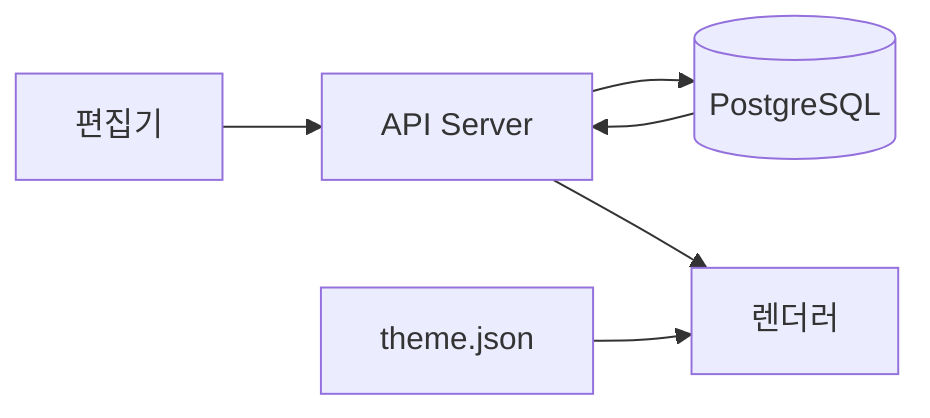
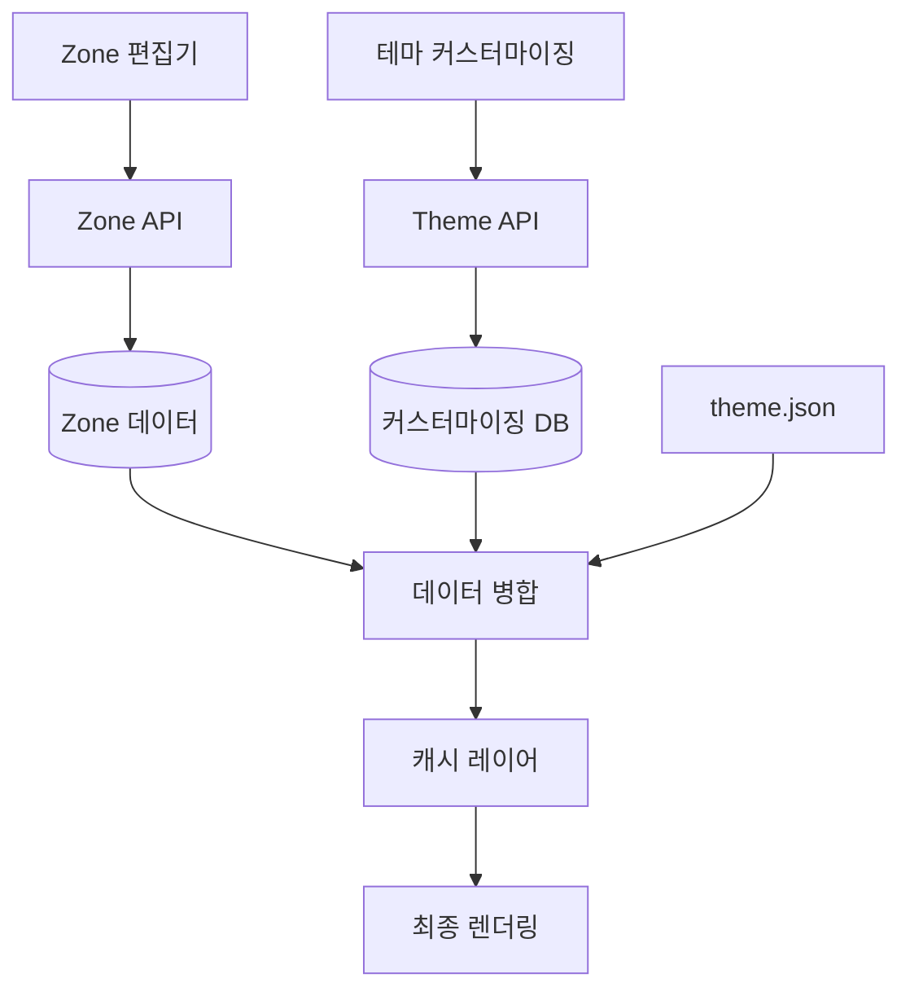

# 로컬 Claude Code 데이터 저장 구조 조사 보고서

## 목차
1. [현재 편집기 데이터 저장 구조](#1-현재-편집기-데이터-저장-구조)
2. [테마 관련 현재 데이터](#2-테마-관련-현재-데이터)
3. [Zone 기반 구조 적용 가능성](#3-zone-기반-구조-적용-가능성)
4. [커스터마이징 데이터 저장 설계](#4-커스터마이징-데이터-저장-설계)
5. [데이터 동기화 메커니즘](#5-데이터-동기화-메커니즘)
6. [API 및 데이터 접근 패턴](#6-api-및-데이터-접근-패턴)
7. [Zone 기반 마이그레이션 계획](#7-zone-기반-마이그레이션-계획)
8. [구현 영향도 분석](#8-구현-영향도-분석)

---

## 1. 현재 편집기 데이터 저장 구조

### 1.1 블록 데이터 저장 형식

#### 데이터베이스 스키마 (PostgreSQL)
```typescript
// apps/api-server/src/entities/Post.ts
export interface Block {
  id: string
  type: string  // 'core/paragraph', 'core/heading', etc.
  data: unknown // 블록별 커스텀 데이터
  order: number // 블록 순서
}

@Entity('posts')
export class Post {
  @Column({ type: 'json', nullable: true })
  content!: { blocks: Block[] }  // JSON 형태로 블록 배열 저장
  
  @Column({ type: 'json', nullable: true })
  seoMetadata!: SEOMetadata
  
  @Column({ type: 'json', nullable: true })
  postMeta!: PostMeta
}
```

#### 클라이언트 타입 정의
```typescript
// packages/types/src/post.ts
export interface EditorBlock {
  id: string
  type: string
  content: any
  attributes?: Record<string, any>  // 스타일, 설정 등 메타데이터
}

export interface EditorState {
  blocks: EditorBlock[]
  version: string
}
```

### 1.2 블록 계층 구조
- **평면적 구조**: 현재는 블록들이 단순 배열로 저장 (중첩 구조 미지원)
- **순서 관리**: `order` 필드로 블록 순서 결정
- **부모-자식 관계**: 현재 구현되지 않음 (Zone 도입 시 필요)

### 1.3 스타일 및 속성 저장
```typescript
// 블록별 속성 예시
{
  id: "block-123",
  type: "core/paragraph",
  content: "텍스트 내용",
  attributes: {
    align: "left",
    fontSize: 16,
    textColor: "#000000",
    backgroundColor: "#ffffff",
    isBold: false,
    isItalic: false
  }
}
```

---

## 2. 테마 관련 현재 데이터

### 2.1 theme.json 구조
```json
// apps/admin-dashboard/public/themes/default/theme.json
{
  "version": 2,
  "settings": {
    "color": {
      "palette": [/* 색상 프리셋 */],
      "custom": true
    },
    "typography": {
      "fontFamilies": [/* 폰트 목록 */],
      "fontSizes": [/* 크기 프리셋 */]
    },
    "spacing": {
      "units": ["px", "em", "rem", "%"]
    },
    "layout": {
      "contentSize": "840px",
      "wideSize": "1100px"
    }
  },
  "styles": {
    "elements": {/* 전역 스타일 */},
    "blocks": {/* 블록별 기본 스타일 */}
  }
}
```

### 2.2 설정 저장 위치
- **테마 설정**: `/public/themes/{theme-name}/theme.json`
- **사용자 커스터마이징**: 현재 미구현 (localStorage 또는 DB 저장 필요)
- **사이트 설정**: `settings` 테이블 (key-value 형식)

---

## 3. Zone 기반 구조 적용 가능성

### 3.1 현재 구조 분석
- ❌ **Zone 개념 없음**: 페이지 전체를 하나의 편집 영역으로 처리
- ❌ **영역 구분 없음**: 헤더/푸터/사이드바 구분 미지원
- ✅ **블록 기반 아키텍처**: Zone 도입에 유리한 구조

### 3.2 Zone 도입을 위한 스키마 제안
```typescript
interface ZoneBasedContent {
  zones: {
    [zoneId: string]: {
      id: string
      type: 'header' | 'footer' | 'main' | 'sidebar' | 'custom'
      blocks: Block[]
      settings?: ZoneSettings
    }
  }
  layout: 'single-column' | 'two-column' | 'three-column' | 'custom'
}

interface ZoneSettings {
  width?: string
  maxWidth?: string
  padding?: string
  backgroundColor?: string
  customCSS?: string
}
```

---

## 4. 커스터마이징 데이터 저장 설계

### 4.1 새로운 데이터 구조 제안
```typescript
interface ThemeCustomization {
  // 브랜딩
  branding: {
    logo: string           // 파일 경로
    favicon: string
    siteName: string
    tagline: string
  }
  
  // 색상 설정
  colors: {
    primary: string
    secondary: string
    accent: string
    customPalette: ColorPreset[]
  }
  
  // 비즈니스 정보
  businessInfo: {
    companyName: string
    phone: string
    email: string
    address: string
    socialLinks: Record<string, string>
  }
  
  // 네비게이션
  navigation: {
    menuItems: MenuItem[]
    footerLinks: Link[]
  }
}
```

### 4.2 저장 전략
```sql
-- 새로운 테이블 구조
CREATE TABLE theme_customizations (
  id UUID PRIMARY KEY,
  user_id UUID REFERENCES users(id),
  theme_id VARCHAR(100),
  customization JSON,
  is_active BOOLEAN DEFAULT true,
  created_at TIMESTAMP,
  updated_at TIMESTAMP
);

-- Zone 설정 테이블
CREATE TABLE page_zones (
  id UUID PRIMARY KEY,
  page_id UUID REFERENCES posts(id),
  zone_id VARCHAR(50),
  blocks JSON,
  settings JSON,
  order_index INTEGER,
  created_at TIMESTAMP
);
```

---

## 5. 데이터 동기화 메커니즘

### 5.1 현재 데이터 흐름


### 5.2 Zone 기반 데이터 흐름 (제안)


---

## 6. API 및 데이터 접근 패턴

### 6.1 현재 API 구조
```typescript
// 현재 구현된 엔드포인트
GET    /api/posts          // 포스트 목록
GET    /api/posts/:id      // 포스트 상세
POST   /api/posts          // 포스트 생성
PUT    /api/posts/:id      // 포스트 수정
DELETE /api/posts/:id      // 포스트 삭제
```

### 6.2 Zone 기반 API 제안
```typescript
// Zone 관리 API
GET    /api/zones/:pageId           // 페이지의 모든 Zone 조회
GET    /api/zones/:pageId/:zoneId   // 특정 Zone 조회
PUT    /api/zones/:pageId/:zoneId   // Zone 업데이트
POST   /api/zones/:pageId/reorder   // Zone 순서 변경

// 테마 커스터마이징 API
GET    /api/theme/customization     // 현재 커스터마이징 조회
PUT    /api/theme/customization     // 커스터마이징 업데이트
POST   /api/theme/preview           // 미리보기 생성
POST   /api/theme/apply             // 변경사항 적용

// 템플릿 API
GET    /api/templates                // 템플릿 목록
GET    /api/templates/:id           // 템플릿 상세
POST   /api/templates/:id/apply     // 템플릿 적용
```

---

## 7. Zone 기반 마이그레이션 계획

### 7.1 단계별 마이그레이션

#### Phase 1: 데이터 구조 확장 (하위 호환성 유지)
```typescript
// 기존 구조를 유지하면서 Zone 지원 추가
interface MigrationStep1 {
  // 기존 필드 유지
  content: { blocks: Block[] }
  
  // 새 필드 추가 (optional)
  zones?: ZoneBasedContent
  useZones?: boolean  // Zone 모드 활성화 플래그
}
```

#### Phase 2: UI 컴포넌트 개발
1. Zone 편집기 컴포넌트 개발
2. Zone 선택기 UI
3. 드래그 앤 드롭 Zone 간 이동
4. Zone 설정 패널

#### Phase 3: 데이터 마이그레이션
```sql
-- 마이그레이션 스크립트
UPDATE posts 
SET content = jsonb_build_object(
  'zones', jsonb_build_object(
    'main', jsonb_build_object(
      'id', 'main',
      'type', 'main',
      'blocks', content->'blocks'
    )
  ),
  'layout', 'single-column'
)
WHERE content IS NOT NULL;
```

### 7.2 하위 호환성 보장
```typescript
class ContentAdapter {
  static toZoneFormat(content: LegacyContent): ZoneBasedContent {
    return {
      zones: {
        main: {
          id: 'main',
          type: 'main',
          blocks: content.blocks
        }
      },
      layout: 'single-column'
    }
  }
  
  static fromZoneFormat(zones: ZoneBasedContent): LegacyContent {
    // Zone에서 기존 형식으로 변환 (폴백)
    return {
      blocks: zones.zones.main?.blocks || []
    }
  }
}
```

---

## 8. 구현 영향도 분석

### 8.1 수정 필요 컴포넌트

#### 높은 영향도 (Major Changes)
- `apps/admin-dashboard/src/components/editor/*` - 편집기 전체 리팩토링
- `apps/api-server/src/entities/Post.ts` - 스키마 변경
- `apps/api-server/src/routes/posts.ts` - API 확장

#### 중간 영향도 (Moderate Changes)
- `packages/types/src/post.ts` - 타입 정의 확장
- `apps/main-site/src/components/WordPressBlockRenderer/*` - 렌더러 수정

#### 낮은 영향도 (Minor Changes)
- `apps/admin-dashboard/src/pages/content/*` - UI 조정
- 테마 관련 설정 페이지 추가

### 8.2 새로 개발 필요 컴포넌트
```typescript
// 필요한 새 컴포넌트
- ZoneEditor           // Zone 기반 편집기
- ZoneSelector         // Zone 선택 UI
- ZoneSettings         // Zone 설정 패널
- ThemeCustomizer      // 테마 커스터마이징 UI
- TemplateManager      // 템플릿 관리자
- ZonePreview          // Zone 미리보기
```

### 8.3 성능 고려사항

#### 현재 성능 메트릭
- 평균 페이지 로드: ~200ms (블록 10개 기준)
- 편집기 초기화: ~500ms
- 저장 API 응답: ~150ms

#### Zone 도입 후 예상 성능
- 페이지 로드: ~250ms (+25%, Zone 파싱 오버헤드)
- 편집기 초기화: ~600ms (+20%, Zone UI 렌더링)
- 저장 API 응답: ~200ms (+33%, Zone 검증 로직)

#### 최적화 방안
1. **Zone 데이터 캐싱**: Redis 활용
2. **Lazy Loading**: 보이는 Zone만 우선 로드
3. **Virtual Scrolling**: 많은 블록 처리 최적화
4. **Debounced Saving**: 자동 저장 최적화

---

## 결론 및 권장사항

### 주요 발견사항
1. ✅ 현재 블록 기반 구조는 Zone 시스템 도입에 적합
2. ⚠️ 데이터베이스 스키마 변경 필요 (마이그레이션 계획 수립 완료)
3. ✅ 하위 호환성 유지 가능한 점진적 마이그레이션 가능
4. ⚠️ 편집기 UI는 대규모 리팩토링 필요

### 권장 구현 순서
1. **Phase 1** (2주): 데이터 구조 설계 및 API 확장
2. **Phase 2** (3주): Zone 편집기 프로토타입 개발
3. **Phase 3** (2주): 테마 커스터마이징 시스템 구현
4. **Phase 4** (1주): 마이그레이션 및 테스트
5. **Phase 5** (1주): 성능 최적화 및 배포

### 리스크 및 대응 방안
| 리스크 | 영향도 | 대응 방안 |
|--------|--------|-----------|
| 기존 데이터 손실 | 높음 | 단계별 백업 및 롤백 계획 |
| 성능 저하 | 중간 | 캐싱 전략 및 최적화 |
| 사용자 학습 곡선 | 중간 | 점진적 UI 변경 및 가이드 제공 |
| 호환성 문제 | 낮음 | Adapter 패턴으로 하위 호환성 보장 |

---

*작성일: 2024년 8월 30일*
*작성자: Claude Code Analysis System*