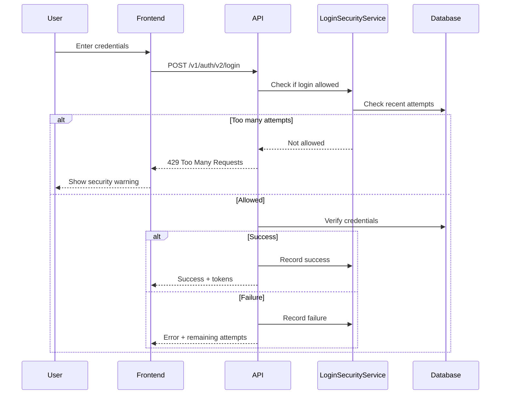

# Login Security Implementation Guide

## Overview

This document describes the comprehensive login security system implementation for O4O Platform, including rate limiting, account locking, and security monitoring.

## Security Features

### 1. Rate Limiting
- **Per IP Address**: Maximum 10 login attempts per 15 minutes
- **Per Email**: Maximum 5 login attempts per 15 minutes
- **Configurable via environment variables**

### 2. Account Locking
- **Automatic Lock**: After 5 failed attempts, account locks for 30 minutes
- **Manual Lock**: Admins can lock/unlock accounts via admin panel
- **Lock Duration**: Configurable (default 30 minutes)

### 3. Login Attempt Tracking
- **Comprehensive Logging**: All login attempts recorded with metadata
- **IP Tracking**: Source IP address for each attempt
- **User Agent**: Browser/client information
- **Failure Reasons**: Specific reason codes for failures

### 4. Security Monitoring
- **Real-time Metrics**: Dashboard for security team
- **Suspicious Activity Detection**: Automated alerts
- **Top Failed IPs/Emails**: Identify attack patterns

## Architecture



## Components

### Backend Services

#### LoginSecurityService
- Rate limiting logic
- Account locking mechanisms
- Security metrics collection
- Suspicious activity detection

```typescript
// Check if login allowed
const loginCheck = await LoginSecurityService.isLoginAllowed(email, ipAddress);
if (!loginCheck.allowed) {
  // Handle rate limiting or account lock
}

// Record login attempt
await LoginSecurityService.recordLoginAttempt({
  email,
  ipAddress,
  userAgent,
  success: false,
  failureReason: 'invalid_password'
});
```

#### LoginAttempt Entity
- Stores all login attempts
- Indexed for efficient queries
- Automatic cleanup after 30 days

### Frontend Components

#### LoginSecurityStatus
- Shows remaining attempts
- Displays account lock status
- Security warnings

```tsx
<LoginSecurityStatus 
  remainingAttempts={3}
  lockedUntil={lockedDate}
  error={errorMessage}
/>
```

## API Endpoints

### Admin Security Management

#### Get Security Metrics
```
GET /api/admin/security/metrics?hours=24
Response: {
  totalAttempts: 1234,
  failedAttempts: 45,
  uniqueIps: 789,
  lockedAccounts: 3,
  topFailedEmails: [...],
  topFailedIps: [...]
}
```

#### Get Login Attempts
```
GET /api/admin/security/login-attempts/:email?limit=50
GET /api/admin/security/login-attempts-by-ip/:ip?hours=24
```

#### Account Management
```
POST /api/admin/security/unlock-account
Body: { email: string }

POST /api/admin/security/lock-account
Body: { email: string, minutes?: number }

POST /api/admin/security/reset-login-attempts
Body: { email: string }
```

#### Maintenance
```
GET /api/admin/security/locked-accounts
POST /api/admin/security/clean-login-attempts
Body: { daysToKeep?: number }
```

## Configuration

### Environment Variables
```bash
# Security Configuration
MAX_LOGIN_ATTEMPTS_PER_IP=10      # Max attempts from single IP
MAX_LOGIN_ATTEMPTS_PER_EMAIL=5    # Max attempts for single email
LOCKOUT_DURATION_MINUTES=30       # Account lock duration
LOGIN_CHECK_WINDOW_MINUTES=15     # Time window for rate limiting
SUSPICIOUS_IP_THRESHOLD=20        # Threshold for suspicious activity
LOGIN_ATTEMPTS_RETENTION_DAYS=30  # How long to keep attempt records
```

### Database Migration
The system requires the following database changes:
- `login_attempts` table for tracking all attempts
- `lockedUntil` field in users table
- `loginAttempts` counter in users table

## Security Best Practices

### 1. Response Time Consistency
- Same response time for valid/invalid users
- Prevents user enumeration attacks

### 2. Generic Error Messages
- Don't reveal if email exists
- Use generic "Invalid credentials" message

### 3. Progressive Security
- Warning at 3 attempts remaining
- Clear communication about lockout

### 4. Automated Cleanup
- Daily job removes old login attempts
- Prevents database bloat

### 5. Admin Monitoring
- Regular review of security metrics
- Alert on suspicious patterns

## User Experience

### Login Flow
1. Normal login - no security indicators
2. After 2 failed attempts - warning appears
3. 3-4 failed attempts - shows remaining attempts
4. 5 failed attempts - account locked for 30 minutes

### Security Messages
- **Korean**: 
  - "남은 로그인 시도 횟수: 3회"
  - "계정이 일시적으로 잠겼습니다"
  - "15분 후에 다시 시도해주세요"
- **English**: 
  - "3 login attempts remaining"
  - "Account temporarily locked"
  - "Please try again in 15 minutes"

## Testing Scenarios

### Rate Limiting Tests
- [ ] Test IP-based rate limiting (10 attempts)
- [ ] Test email-based rate limiting (5 attempts)
- [ ] Verify rate limit reset after time window

### Account Locking Tests
- [ ] Test automatic lock after 5 failures
- [ ] Verify lock duration (30 minutes)
- [ ] Test manual lock/unlock by admin

### Security Monitoring Tests
- [ ] Verify login attempts are recorded
- [ ] Check security metrics accuracy
- [ ] Test suspicious activity detection

### Frontend Tests
- [ ] Security status component displays correctly
- [ ] Remaining attempts shown accurately
- [ ] Lock status and countdown work

## Troubleshooting

### Common Issues

1. **Account Locked Unnecessarily**
   - Check `LOCKOUT_DURATION_MINUTES` setting
   - Review login attempt history
   - Use admin panel to unlock

2. **Rate Limiting Too Strict**
   - Adjust `MAX_LOGIN_ATTEMPTS_*` values
   - Check `LOGIN_CHECK_WINDOW_MINUTES`

3. **Database Performance**
   - Ensure indexes are created
   - Run cleanup job regularly
   - Monitor table size

### Debug Commands
```sql
-- View recent login attempts
SELECT * FROM login_attempts 
WHERE email = 'user@example.com' 
ORDER BY "createdAt" DESC 
LIMIT 10;

-- Check locked accounts
SELECT email, "lockedUntil", "loginAttempts" 
FROM users 
WHERE "lockedUntil" > NOW();

-- Manual unlock
UPDATE users 
SET "lockedUntil" = NULL, "loginAttempts" = 0 
WHERE email = 'user@example.com';
```

## Future Enhancements

1. **Geolocation**
   - Add country/city to login attempts
   - Alert on unusual locations

2. **Device Fingerprinting**
   - Track trusted devices
   - Require additional verification for new devices

3. **CAPTCHA Integration**
   - Add CAPTCHA after 3 failed attempts
   - Prevent automated attacks

4. **2FA Integration**
   - Require 2FA for accounts with many failed attempts
   - Enhanced security for sensitive accounts

5. **Machine Learning**
   - Detect attack patterns
   - Predictive blocking of suspicious IPs