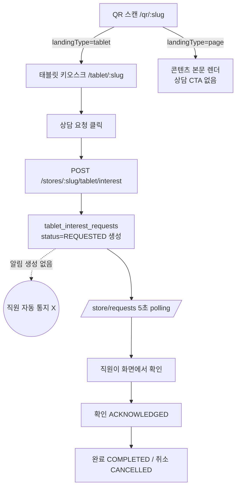

# IR-O4O-KPA-STORE-CONSULTATION-REQUESTS-NOTIFICATION-REPLACEMENT-AUDIT-V1

> 조사 대상: KPA 매장 `상담 요청` (`/store/requests`)의 실제 용도 및 알림 대체 가능성
> 유형: **READ-ONLY 조사 (코드 변경 없음, 수정은 별도 WO)**
> 조사일: 2026-06-25 / 범위: KPA 우선 (GP/KCos parity 포함)

---

## 1. 요약 결론

**판정: B안 — 알림은 시스템상 가능하지만 (요청 생성 시 알림 미생성 + 알림→처리 동선 미완성) 으로 인해 메뉴 삭제 전 보완이 필요하다.**

근거 요지:

- `/store/requests`(`TabletRequestsPage`)는 `tablet_interest_requests`(**LIVE** 테이블)를 조회하고 **확인/완료/취소** 상태 처리를 수행하는 **현재 유일한 처리 화면**이다.
- 요청 생성(`POST /stores/:slug/tablet/interest`) 시점에 **알림(Notification)이 전혀 생성되지 않는다.** 매장 직원은 이 화면을 5초 polling 으로 직접 봐야만 요청을 인지한다.
- O4O 알림 인프라(`Notification` 엔티티 / `NotificationService.createNotification` / `metadata.targetUrl`)는 존재하고 다른 도메인(약국 개설신청·문의)에서 사용되지만, **상담 요청 도메인에는 연결돼 있지 않다.** 또한 프론트 알림 클릭 → `targetUrl` 이동 동선이 미완성이다.

따라서 지금 메뉴를 삭제하면 **요청 인지/처리 수단이 완전히 사라진다.** 알림 생성 + 알림→처리 동선을 먼저 보완해야 메뉴를 안전하게 정리할 수 있다. **요청 기록 테이블(`tablet_interest_requests`)은 삭제 대상이 아니다.**

> 참고: WO 선택지 기준으로는 현재 상태가 C안(핵심 처리 화면 유지 필요)에 가깝고, 보완 후 도달할 목표 상태가 B안(알림으로 정리)이다. 즉시 삭제 가능한 A/D안은 아니다.

---

## 2. 코드 근거

| 영역 | 파일 | 확인 내용 |
|---|---|---|
| 메뉴(SSOT) | `packages/store-ui-core/src/config/storeMenuConfig.ts:292-296` | KPA 채널 그룹에 `{ key:'requests', label:'상담 요청', subPath:'/requests' }` 등록 |
| 라우트 | `services/web-kpa-society/src/App.tsx:1010` | `<Route path="requests" element={<TabletRequestsPage />} />` |
| 페이지 | `services/web-kpa-society/src/pages/pharmacy/TabletRequestsPage.tsx` | 상담 요청 목록 + 확인/완료/취소(단건·일괄). 상태 배지(NEW/5분+/10분+/확인됨), 5초 polling |
| 페이지 API 클라 | `services/web-kpa-society/src/api/tabletStaff.ts:47-62` | `GET /api/v1/store/interest/recent`, `PATCH /api/v1/store/interest/{id}/{acknowledge|complete|cancel}` |
| 진입 링크(추가) | `services/web-kpa-society/src/pages/pharmacy/StoreChannelsPage.tsx:1530,1561`, `StoreHomePage.tsx` | 채널 페이지 "대기 상담 요청" 카드/"상담 요청 확인" 버튼, 홈 바로가기 → `/store/requests` (메뉴 삭제 시 함께 정리 필요) |
| 백엔드 API | `apps/api-server/src/routes/platform/store-tablet.routes.ts:715-928` | interest pending-count/recent/stats + acknowledge/complete/cancel 전이(`handleInterestTransition`) |
| DB/Entity | `apps/api-server/src/routes/platform/entities/tablet-interest-request.entity.ts` / 마이그레이션 `20260301400000-TabletInterestRequests.ts` | `tablet_interest_requests`: id, organization_id, master_id, product_name, customer_name?, customer_note?, status(REQUESTED/ACKNOWLEDGED/COMPLETED/CANCELLED), 타임스탬프. **source 컬럼 없음** |
| 요청 생성(공개) | `apps/api-server/src/routes/platform/store-public/store-public-tablet.handler.ts:84-142` | `POST /api/v1/stores/:slug/tablet/interest` → REQUESTED 생성. **알림 생성 없음** |
| 알림 엔티티 | `apps/api-server/src/entities/Notification.ts` | userId, type(NotificationType), title, message, metadata(jsonb), channel(in_app), serviceKey, organizationId, actorId, priority, isRead, readAt |
| 알림 서비스 | `apps/api-server/src/services/NotificationService.ts` | `createNotification(DTO)` — in_app 저장 + SSE emit |
| 알림 사용 예시 | `apps/api-server/src/routes/kpa/controllers/pharmacy-request.controller.ts:98-391`, `contact-request.controller.ts:87-114` | 약국 개설신청/문의는 운영자(role_assignments)에게 알림 생성 + `metadata.targetUrl`. **상담 요청에는 없음** |
| 알림 클릭 동선 | `apps/admin-dashboard/src/components/layout/NotificationList.tsx:89-93` | 클릭 시 읽음 처리만, `metadata.targetUrl` navigate **미구현** |
| QR 공개 landing | `apps/api-server/src/routes/o4o-store/controllers/store-qr-landing.controller.ts:107-296` | `GET /qr/public/:slug` — landingType product/promotion/page/link/video. page=`kpa_contents`(ready/published) body inline / store_execution_assets html |
| QR landing 프론트 | `services/web-kpa-society/src/pages/qr/QrLandingPage.tsx:24-173` | `landingType='tablet'` = "상담 요청하기" → `/tablet/{slug}?from=qr`. **page 타입 본문 하단 상담 CTA 없음** |
| QR 엔티티 | `apps/api-server/src/routes/platform/entities/store-qr-code.entity.ts` | `store_qr_codes`: type, landingType, landingTargetId, slug 등. **consultationCtaEnabled 류 설정 컬럼 없음** |
| 태블릿 공개 | `services/web-kpa-society/src/pages/tablet/TabletStorePage.tsx`, `api/tablet.ts:71-84` | `/tablet/:slug` → `submitTabletInterest` → 동일 생성 API |

---

## 3. 현재 흐름도

핵심: **요청 생성 → (알림 없음) → /store/requests 화면을 직접 봐야 인지** 구조. 알림이 흐름에 끼어 있지 않다.

---

## 4. 문제점

- **중복 메뉴**: 채널 그룹에 `태블릿` + `상담 요청` 공존. 상담 요청은 태블릿 요청의 처리 큐로, 기능적으로 태블릿 운영의 일부.
- **알림 누락**: 요청 생성/상태 변경 시 알림이 전혀 없음 → 직원은 화면 polling 의존. (알림 인프라는 존재하나 미연결)
- **요청 상태 처리 동선 부재**: 확인/완료/취소가 `/store/requests` 외 어디에도 없음. 알림 클릭 → 처리로 가는 동선도 미완성(프론트 navigate 미구현).
- **QR/태블릿 source 불일치**: KPA `tablet_interest_requests` 에 source 구분 컬럼이 없어 QR발 요청과 태블릿발 요청을 구분 못함. (참고: GP `glycopharm_customer_requests` 는 `source_type`(qr/tablet/web/signage/print) + `purpose` 보유 — 더 일반적 모델)
- **QR page 상담 동선 단절**: page 콘텐츠 본문 하단에 상담 CTA가 없어, 콘텐츠를 본 고객이 상담으로 이어지지 못함. (현재는 별도 landingType=tablet QR만 상담 가능)
- **legacy/dead 의심**: `tablet_service_requests` 는 키워드상 등장하나 본 조사에서 KPA live 참조는 `tablet_interest_requests` 로 확인됨. `tablet_service_requests` 실참조 여부는 **수정 WO 전 별도 grep 확인 권장**(현 조사 범위에서는 live 경로 미확인).
- **삭제 시 깨질 지점**: `/store/requests` 메뉴 제거 시 `StoreChannelsPage`(2개 링크) + `StoreHomePage`(바로가기) 가 dead link 가 됨. route 자체도 동시 정리 필요.

---

## 5. 알림 대체 가능성 (핵심 판단)

| 항목 | 현황 | 판단 |
|---|---|---|
| 매장 사용자 대상 알림 생성 가능? | ✅ 인프라 존재(createNotification, role_assignments 대상). 단 **상담 요청엔 미연결** | 보완 시 가능 |
| metadata(requestId/storeId/source/target) 저장 가능? | ✅ `metadata` jsonb + `targetUrl` 패턴 존재 | 가능 |
| 알림 클릭 → 처리 화면 이동? | ⚠️ `targetUrl` 저장은 되나 프론트 navigate 미구현 | **보완 필요** |
| 알림에서 직접 처리(상태 변경) 액션? | ❌ 인라인 액션 없음(도착 알림 + targetUrl 이동만) | 처리 동선은 화면 필요 |
| `/store/requests` 없이 후속 처리 가능? | ❌ 현재 불가(처리 화면이 여기뿐) | **보완 전 삭제 불가** |

> 판단 기준 적용: 알림이 단순 "도착 알림"만 가능하고 상태 처리는 화면 의존 → **즉시 삭제 금지(B안).** 알림 생성 + 알림→처리 화면 동선을 만든 뒤, 메뉴는 "알림에서 진입하는 처리 패널/뷰"로 대체할 수 있다. 요청 기록 테이블은 유지.

---

## 6. 수정 제안 (별도 WO 대상)

### Phase 1 — 알림 연결 및 메뉴 정리

1. **요청 생성 시 매장 사용자 알림 생성**: `POST /stores/:slug/tablet/interest` 핸들러에서 매장 경영자/직원(organizationId + store role) 대상으로 `createNotification` 호출. type 예: `store.consultation_requested`, `metadata: { requestId, storeId, source:'tablet'|'qr', targetType, targetId, targetUrl:'/store/requests' }`.
2. **알림 클릭 → 처리 동선**: 매장 측 알림 센터에서 `metadata.targetUrl` navigate 구현(프론트 미완성분 보완). 처리(확인/완료/취소)는 기존 화면/패널 재사용.
3. **메뉴 정리**: 알림 동선 검증 후 `상담 요청` 메뉴를 제거하거나 "알림에서 진입하는 처리 뷰"로 강등. `/store/requests` route 는 즉시 삭제하지 말고 **임시 redirect 또는 hidden route 로 유지**(StoreChannelsPage/StoreHomePage 링크 동시 정리).
4. **요청 테이블 보존**: `tablet_interest_requests` 는 업무 기록이므로 유지.

### Phase 2 — QR 콘텐츠 상담 CTA 옵션(설정값 방식)

1. **HTML 직접 삽입 금지**: 같은 콘텐츠가 자료실/태블릿/POP/블로그/QR로 재사용되므로 본문 HTML 에 버튼을 박지 않는다.
2. **설정값 도입**: `store_qr_codes` 에 `consultation_cta_enabled` / `consultation_cta_label` / `consultation_cta_placement` 컬럼 추가 → `GET /qr/public/:slug` 응답 포함 → `QrLandingPage` 의 page 렌더 **하단에 조건부 버튼** 렌더.
3. **공통 상담 요청 API**: 버튼 클릭 시 공통 생성 API 호출. `source='qr'`, `targetType='content|page|video|product'`, `targetId` 저장.
4. **source 구분 도입 검토**: KPA `tablet_interest_requests` 에 `source` 컬럼 추가 또는 GP의 `customer_requests`(sourceType+purpose) 모델로의 통합을 별도 IR에서 판단. 태블릿/QR 상담 API 통합 권장.

---

## 7. GP/KCos parity (참고)

| 서비스 | route | 페이지 | 메뉴 등록 | 테이블 |
|---|---|---|---|---|
| KPA | `/store/requests` | `TabletRequestsPage` | ✅ 채널 그룹 | `tablet_interest_requests` (source 없음) |
| GlycoPharm | `/store/requests` | `CustomerRequestsPage` | ❌ 메뉴 미등록(숨은 route) | `glycopharm_customer_requests` (source_type+purpose, action_logs) |
| K-Cosmetics | `/store/interest-requests` | `InterestRequestsPage` | ❌ 메뉴 미등록 | (별도 확인 필요) |

→ 메뉴 노출은 **KPA 만 활성.** GP/KCos 는 route 만 존재(숨김). 메뉴 정리는 KPA 한정으로 진행 가능하나, **요청 모델 통합(source/purpose) 방향은 GP의 `customer_requests` 가 참고 모델**이다.

---

## 8. 주의사항 / 후속

- 요청 기록 테이블(`tablet_interest_requests`)은 삭제 금지 — 알림은 전달 수단, 레코드는 업무 기록.
- `/store/requests` **메뉴 삭제 ≠ 요청 기능 삭제** 를 구분.
- QR 콘텐츠 본문 HTML 직접 버튼 삽입 회피, 설정값+렌더러 방식.
- 태블릿/QR 상담 요청 API 통합 권장(source 구분).
- `tablet_service_requests` 실참조 여부는 수정 WO 착수 전 grep 재확인(현 조사에서 KPA live 경로 미확인).
- 본 문서는 read-only 조사로 종료. 코드 변경은 Phase 1/2 별도 WO 에서 진행.
