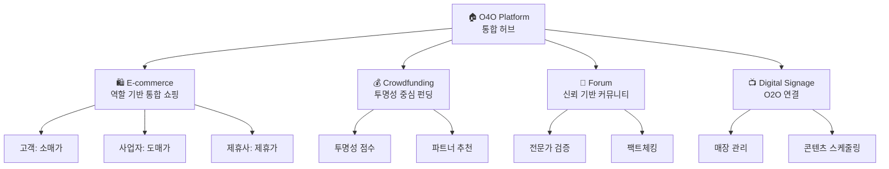

# 💼 O4O Platform 비즈니스 모델

> **최종 업데이트**: 2025년 6월 30일  
> **버전**: v0.1.0

---

## 🎯 플랫폼 비전

### 미션
**투명하고 신뢰할 수 있는 헬스/웰니스 통합 플랫폼**을 통해 소비자에게 검증된 정보와 제품을 제공하고, 비즈니스 파트너들에게는 효율적인 판매 채널을 제공합니다.

### 핵심 가치
- **투명성**: 모든 프로세스와 수수료 구조 공개
- **신뢰성**: 전문가 검증을 통한 정보와 제품의 신뢰도 보장
- **통합성**: 여러 비즈니스 모델을 하나의 플랫폼에서 제공
- **혁신성**: 기존 방식을 뛰어넘는 새로운 접근법

---

## 🏗️ 통합 비즈니스 아키텍처

### 7개 서비스 통합 모델



---

## 💰 수익 모델

### 1. E-commerce 수익원

#### 거래 수수료 (Transaction Fees)
- **일반 거래**: 2-3%
- **도매 거래**: 1-2%
- **제휴 거래**: 특별 요율 협상

#### 역할별 차별화 수익
```typescript
// 수익 구조
interface RevenueModel {
  customer: {
    margin: '소매가 기준',
    volume: '높은 거래량',
    loyalty: '리텐션 중심'
  }
  business: {
    margin: '도매가 기준 (낮은 마진)',
    volume: '대량 주문',
    value: '높은 거래액'
  }
  affiliate: {
    commission: '성과 기반 수수료',
    referral: '추천 보상',
    partnership: '장기 파트너십'
  }
}
```

### 2. Crowdfunding 수익원

#### 플랫폼 수수료
- **성공 프로젝트**: 5-8% 플랫폼 수수료
- **결제 처리**: 2-3% 결제 수수료
- **프리미엄 서비스**: 추가 마케팅 지원

#### 혁신적인 투명성 모델
- **파트너 추천 수수료**: 완전 공개
- **전문가 검증 서비스**: 유료 검증 옵션
- **후원자 선택권**: 제품 vs 환불+수수료 모델

### 3. Forum 수익원

#### 전문가 상담 서비스
- **유료 전문가 상담**: 시간당 요율제
- **프리미엄 콘텐츠**: 검증된 전문가 콘텐츠
- **기업 팩트체킹**: B2B 검증 서비스

#### 신뢰 기반 광고
- **검증된 제품 광고**: 높은 신뢰도 기반 프리미엄 광고
- **전문가 추천 제품**: 추천 기반 수익 분배

### 4. Digital Signage 수익원

#### SaaS 구독 모델
- **매장별 월 구독료**: $29-99/월
- **콘텐츠 관리 서비스**: 추가 요금
- **프리미엄 분석**: 고급 분석 대시보드

#### 광고 수익
- **매장 네트워크 광고**: 지역별 타겟 광고
- **브랜드 콘텐츠**: 스폰서 콘텐츠

---

## 🎯 고객 세분화

### B2C 고객

#### 일반 소비자 (CUSTOMER)
- **특징**: 개인 구매, 소량 주문
- **가격**: 소매가
- **서비스**: 기본 쇼핑, 커뮤니티 참여
- **수익성**: 높은 마진, 높은 거래 빈도

#### 웰니스 애호가
- **특징**: 건강 의식 높음, 정보 탐색 활발
- **서비스**: 전문가 상담, 펀딩 참여
- **수익성**: 높은 LTV, 프리미엄 서비스 이용

### B2B 고객

#### 사업자 (BUSINESS)
- **특징**: 대량 구매, 재판매 목적
- **가격**: 도매가 (할인가)
- **서비스**: 대량 주문, 전용 지원
- **수익성**: 낮은 마진, 높은 거래액

#### 제휴 파트너 (AFFILIATE)
- **특징**: 마케팅 및 판매 지원
- **수익**: 성과 기반 수수료
- **서비스**: 마케팅 도구, 분석 대시보드
- **수익성**: 성과 연동, 확장 가능

### B2B2C 고객

#### 매장 운영자 (MANAGER)
- **서비스**: 디지털 사이니지 솔루션
- **수익**: 월 구독료, 광고 수익 분배
- **특징**: O2O 연결, 지역 마케팅

---

## 🚀 성장 전략

### Phase 1: 기반 구축 (현재)
- **E-commerce 플랫폼** 완성
- **신뢰 시스템** 구축 (Forum)
- **초기 사용자** 확보

### Phase 2: 서비스 확장 (6개월)
- **Crowdfunding 플랫폼** 런칭
- **Digital Signage** 상용화
- **파트너 네트워크** 확장

### Phase 3: 시장 지배 (1년)
- **모바일 앱** 출시
- **AI 개인화** 도입
- **해외 진출** 준비

### Phase 4: 글로벌 확장 (2년)
- **다국가 진출**
- **현지화** 서비스
- **전략적 파트너십**

---

## 📊 시장 기회

### 시장 규모
- **한국 E-commerce**: 200조원 (2024)
- **헬스케어 시장**: 50조원
- **크라우드펀딩**: 1조원
- **디지털 사이니지**: 5천억원

### 경쟁 우위
1. **통합 플랫폼**: 여러 서비스를 하나로 통합
2. **투명성**: 업계 최초 완전 투명 공개
3. **전문가 검증**: 신뢰할 수 있는 정보
4. **혁신적 UX**: 역할 기반 차별화 경험

### 차별화 포인트
- **신뢰 중심**: 모든 정보의 전문가 검증
- **투명성**: 수수료 및 프로세스 완전 공개
- **통합성**: 7개 서비스 단일 플랫폼
- **혁신성**: 기존에 없던 새로운 모델

---

## 💡 핵심 혁신 요소

### 1. 역할 기반 통합 E-commerce
기존의 B2B/B2C 분리 방식을 뛰어넘어 **단일 플랫폼에서 모든 고객 유형**을 통합 서비스

### 2. 투명성 중심 Crowdfunding
**모든 수수료와 파트너 관계를 완전 공개**하고, 후원자에게 **보상 선택권** 제공

### 3. 신뢰 기반 Community
**전문가 검증과 팩트체킹**을 통해 정보의 신뢰성을 보장하고, **유료 전문가 상담** 서비스 제공

### 4. O2O 연결 Digital Signage
**온라인과 오프라인을 연결**하여 매장의 디지털 전환을 지원하고 **지역 마케팅** 활성화

---

## 🎯 비즈니스 KPI

### 수익 지표
- **GMV (Gross Merchandise Value)**: 월 거래액
- **Take Rate**: 평균 수수료율
- **ARPU (Average Revenue Per User)**: 사용자당 평균 수익

### 성장 지표
- **MAU (Monthly Active Users)**: 월 활성 사용자
- **Retention Rate**: 사용자 리텐션율
- **NPS (Net Promoter Score)**: 고객 만족도

### 서비스별 지표
- **E-commerce**: 전환율, 평균 주문액
- **Crowdfunding**: 성공률, 평균 펀딩액
- **Forum**: 전문가 활동, 상담 건수
- **Signage**: 구독자 수, 광고 수익

---

## 🔮 미래 비전

### 5년 후 목표
- **한국 헬스/웰니스 분야 1위** 플랫폼
- **연 거래액 1조원** 달성
- **해외 3개국 진출** 완료
- **AI 기반 개인화** 서비스 완성

### 장기 비전
**전 세계 사람들이 신뢰할 수 있는 헬스/웰니스 정보와 제품을 쉽게 찾고, 안전하게 거래할 수 있는 글로벌 플랫폼**이 되는 것입니다.

---

*이 비즈니스 모델은 O4O Platform의 핵심 전략과 방향성을 제시합니다. 시장 상황에 따라 지속적으로 업데이트됩니다.*