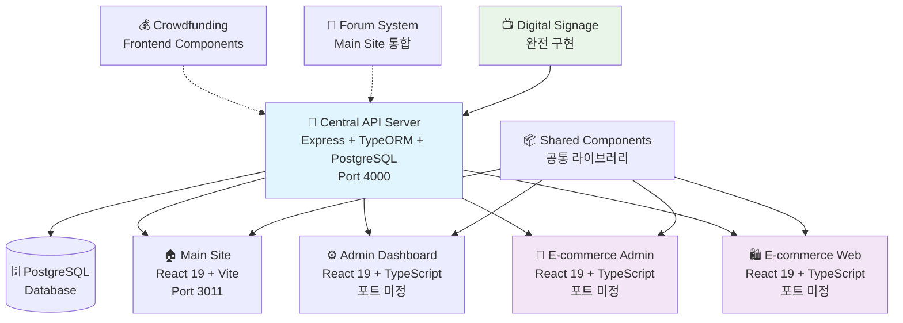

# 🗺️ O4O Platform 서비스 맵

> **최종 업데이트**: 2025년 6월 30일  
> **버전**: v0.1.0

---

## 🏗️ 전체 서비스 구조



---

## 📋 서비스 목록

### 🔐 Core Infrastructure

#### Central API Server
- **역할**: 모든 서비스의 중앙 API 허브
- **기술**: Express.js + TypeORM + PostgreSQL
- **포트**: 4000
- **상태**: ✅ 완전 구현

#### Shared Components
- **역할**: 공통 UI/UX 컴포넌트 라이브러리
- **기술**: React + TypeScript
- **상태**: ✅ 완전 구현

### 🏠 Frontend Services

#### 1. Main Site (허브 서비스)
- **역할**: 플랫폼 통합 진입점 및 오케스트레이터
- **기술**: React 19 + Vite + TailwindCSS
- **포트**: 3011
- **상태**: ✅ 고도로 구현됨
- **특징**: 멀티 서비스 라우팅, 역할 기반 접근 제어

#### 2. Admin Dashboard
- **역할**: 통합 관리자 패널 (WordPress 스타일)
- **기술**: React 19 + TypeScript
- **상태**: 🟡 API 완성, UI 개발 중
- **특징**: 346줄의 포괄적 E-commerce API 클라이언트

#### 3. E-commerce Admin
- **역할**: 전자상거래 관리자 인터페이스
- **기술**: React 19 + TypeScript
- **상태**: 🟡 부분 구현
- **특징**: 상품/주문/사용자 관리

#### 4. E-commerce Web
- **역할**: 고객용 쇼핑몰
- **기술**: React 19 + TypeScript
- **상태**: 🟡 부분 구현
- **특징**: 역할 기반 가격 차별화

### 🌟 Specialized Services

#### 5. Digital Signage
- **역할**: 매장 디지털 사이니지 관리
- **기술**: Express.js + Socket.IO + React
- **상태**: ✅ 백엔드 완전 구현 (20개 API)
- **특징**: 실시간 콘텐츠 제어, 스케줄링

#### 6. Crowdfunding
- **역할**: 투명한 크라우드펀딩 플랫폼
- **기술**: React 18 + TypeScript
- **상태**: 🟡 프론트엔드 부분 구현
- **특징**: 투명성 점수, 파트너 추천 시스템

#### 7. Forum
- **역할**: 신뢰 중심 커뮤니티 플랫폼
- **기술**: 계획 중 (Express.js + React)
- **상태**: ❌ 백엔드 미구현
- **특징**: 전문가 검증, 팩트체킹

---

## 🔗 서비스 간 연동 구조

### 인증 시스템
```
Central API Server → JWT Tokens → All Frontend Services
```

### 데이터 흐름
```
Frontend Services → API Requests → Central API Server → PostgreSQL Database
```

### 실시간 통신
```
Socket.IO Server → Real-time Updates → Frontend Services
```

---

## 🎯 역할 기반 사용자 경험

### 👤 사용자 역할
- **CUSTOMER**: 일반 고객 (소매가)
- **BUSINESS**: 사업자 고객 (도매가)
- **AFFILIATE**: 제휴 파트너 (제휴가)
- **MANAGER**: 매장 관리자 (사이니지)
- **ADMIN**: 플랫폼 관리자

### 🚪 서비스 접근 권한
| 서비스 | CUSTOMER | BUSINESS | AFFILIATE | MANAGER | ADMIN |
|--------|----------|----------|-----------|---------|-------|
| Main Site | ✅ | ✅ | ✅ | ✅ | ✅ |
| E-commerce Web | ✅ | ✅ | ✅ | ❌ | ✅ |
| Admin Dashboard | ❌ | ❌ | ❌ | ❌ | ✅ |
| E-commerce Admin | ❌ | ❌ | ❌ | ❌ | ✅ |
| Digital Signage | ❌ | ❌ | ❌ | ✅ | ✅ |
| Crowdfunding | ✅ | ✅ | ✅ | ❌ | ✅ |
| Forum | ✅ | ✅ | ✅ | ❌ | ✅ |

---

## 📊 개발 우선순위

### 🔥 즉시 조치 필요
1. **Crowdfunding API 구현**: 프론트엔드는 완성, 백엔드 API 필요
2. **Forum API 구현**: 신뢰 시스템과 E-commerce 연동 API
3. **Admin Dashboard UI**: API는 완성, 실제 관리 인터페이스 구현

### ⚡ 중기 개발 목표
1. **E-commerce API 연동**: 목 데이터에서 실제 API로 전환
2. **실시간 알림 시스템**: Socket.IO 기반 크로스 서비스 알림
3. **Digital Signage Frontend**: 완전한 관리자 대시보드

### 🎯 장기 발전 방향
1. **모바일 앱**: React Native 기반 모바일 애플리케이션
2. **AI 통합**: 추천 시스템, 자동화 기능
3. **글로벌 확장**: 다국어 지원, 국제 결제

---

## 🔧 기술 스택 요약

| 구분 | 기술 | 버전 | 용도 |
|------|------|------|------|
| **Backend** | Node.js + Express.js | 20.x | API 서버 |
| **Database** | PostgreSQL + TypeORM | 15+ | 데이터 저장 |
| **Frontend** | React + TypeScript | 19.x | 사용자 인터페이스 |
| **Build** | Vite | 6.x | 빌드 도구 |
| **Styling** | TailwindCSS | 4.x | 스타일링 |
| **State** | Zustand | 5.x | 상태 관리 |
| **Real-time** | Socket.IO | - | 실시간 통신 |
| **Deployment** | AWS Lightsail | - | 클라우드 호스팅 |

---

## 🌐 서비스 접속 정보

### 프로덕션 환경
- **도메인**: neture.co.kr
- **API 서버**: API endpoints via main domain
- **웹 서버**: AWS Lightsail (13.125.144.8)

### 개발 환경
- **Main Site**: http://localhost:3011
- **API Server**: http://localhost:4000
- **기타 서비스**: 포트 미정 (개발 중)

---

*이 서비스 맵은 O4O Platform의 전체 구조를 한눈에 보여줍니다. 지속적으로 업데이트되며 최신 정보를 반영합니다.*