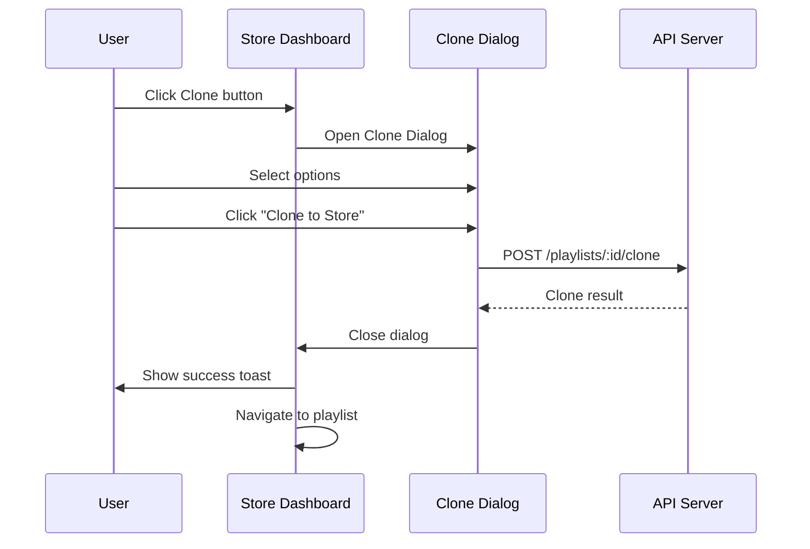
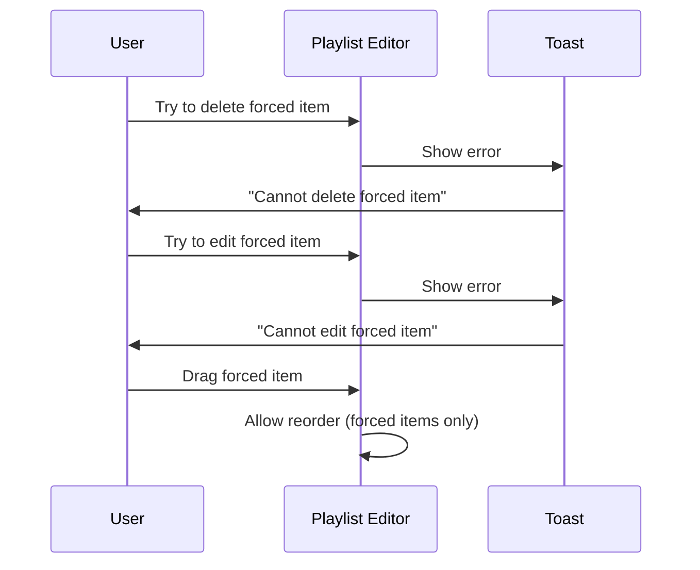

# Global Content Flow V2

> Phase 2 Refinement (R-2)
> Version: 2.0
> Date: 2026-01-17
> Status: Active

---

## 1. 개요

Global Content는 HQ, Supplier, Community에서 생성된 콘텐츠가 매장으로 전달되는 흐름을 정의합니다.

### 콘텐츠 소스 (source)

| Source | 설명 | 생성 권한 |
|--------|------|----------|
| `hq` | 본부 운영자 콘텐츠 | Operator |
| `supplier` | 공급업체 콘텐츠 | Supplier (Admin 승인) |
| `community` | 커뮤니티 공유 콘텐츠 | Store (Operator 승인) |
| `store` | 매장 자체 콘텐츠 | Store |

### 콘텐츠 범위 (scope)

| Scope | 설명 | 접근 범위 |
|-------|------|----------|
| `global` | 모든 매장에 공개 | 전체 서비스 |
| `store` | 해당 매장에만 | 단일 매장 |

---

## 2. 콘텐츠 생성 흐름

### 2.1 HQ 콘텐츠 생성

```
┌──────────────┐     ┌──────────────┐     ┌──────────────┐
│   Operator   │────▶│   HQ API     │────▶│   Database   │
│  (Frontend)  │     │              │     │              │
└──────────────┘     └──────────────┘     └──────────────┘
       │                    │                    │
       │  1. Create         │  2. Save           │  source: 'hq'
       │     Playlist       │     with           │  scope: 'global'
       │                    │     global scope   │  orgId: null
       └────────────────────┴────────────────────┘
```

#### API 호출

```typescript
POST /api/signage/:serviceKey/hq/playlists
{
  "name": "Summer Sale 2026",
  "description": "Summer promotion playlist",
  "status": "active"
}

// 서버에서 자동 설정:
// source: 'hq'
// scope: 'global'
// organizationId: null
```

### 2.2 Supplier 콘텐츠 생성

```
┌──────────────┐     ┌──────────────┐     ┌──────────────┐
│   Supplier   │────▶│ Supplier API │────▶│   Pending    │
│  (Portal)    │     │              │     │   Queue      │
└──────────────┘     └──────────────┘     └──────────────┘
       │                                         │
       │                                         ▼
       │                              ┌──────────────────┐
       │                              │  Admin Approval  │
       │                              └──────────────────┘
       │                                         │
       │                                         ▼
       │                              ┌──────────────────┐
       │                              │ Published Global │
       └──────────────────────────────┴──────────────────┘
```

### 2.3 Community 콘텐츠 공유

```
┌──────────────┐     ┌──────────────┐     ┌──────────────┐
│    Store     │────▶│  Submit to   │────▶│   Pending    │
│  (Dashboard) │     │  Community   │     │   Review     │
└──────────────┘     └──────────────┘     └──────────────┘
       │                                         │
       │                                         ▼
       │                              ┌──────────────────┐
       │                              │ Operator Review  │
       │                              └──────────────────┘
       │                                         │
       │                                         ▼
       │                              ┌──────────────────┐
       │                              │  Approved Global │
       └──────────────────────────────┴──────────────────┘
```

---

## 3. 콘텐츠 수신 흐름 (Clone)

### 3.1 Clone 프로세스

```
┌──────────────┐     ┌──────────────┐     ┌──────────────┐
│    Store     │────▶│  Clone API   │────▶│   Database   │
│  (Dashboard) │     │              │     │              │
└──────────────┘     └──────────────┘     └──────────────┘
       │                    │                    │
       │  1. Request        │  2. Create         │  source: 'store'
       │     Clone          │     Copy with      │  scope: 'store'
       │                    │     parent link    │  parentId: {original}
       └────────────────────┴────────────────────┘
```

### 3.2 Clone 옵션

| 옵션 | 설명 | 기본값 |
|------|------|--------|
| `includeItems` | 플레이리스트 아이템 포함 | true |
| `cloneMedia` | 미디어 파일 복제 (vs 참조) | false |
| `targetOrganizationId` | 대상 매장 ID | 현재 매장 |

### 3.3 Clone 후 데이터 구조

```typescript
// 원본 (HQ)
{
  id: "playlist-001",
  name: "Summer Sale 2026",
  source: "hq",
  scope: "global",
  organizationId: null,
  parentPlaylistId: null
}

// Clone (Store)
{
  id: "playlist-002",
  name: "Copy of Summer Sale 2026",
  source: "store",
  scope: "store",
  organizationId: "org-123",
  parentPlaylistId: "playlist-001"  // 원본 링크
}
```

---

## 4. 강제 콘텐츠 (Forced Items)

### 4.1 강제 항목 지정

HQ 운영자가 플레이리스트 아이템에 `isForced: true`를 설정합니다.

```typescript
// 플레이리스트 아이템
{
  id: "item-001",
  playlistId: "playlist-001",
  mediaId: "media-001",
  sortOrder: 1,
  isForced: true,  // 강제 항목
  isActive: true
}
```

### 4.2 Clone 시 강제 항목 처리

```
원본 (HQ)                          Clone (Store)
┌─────────────────┐               ┌─────────────────┐
│ Item 1 (Forced) │──────────────▶│ Item 1 (Forced) │ 🔒
│ Item 2 (Normal) │──────────────▶│ Item 2 (Normal) │
│ Item 3 (Forced) │──────────────▶│ Item 3 (Forced) │ 🔒
└─────────────────┘               └─────────────────┘
```

### 4.3 강제 항목 제한

| 작업 | 일반 항목 | 강제 항목 |
|------|----------|----------|
| 삭제 | O | X |
| 수정 (콘텐츠) | O | X |
| 순서 변경 | O | O (강제 항목끼리만) |
| 비활성화 | O | X |

---

## 5. 콘텐츠 동기화

### 5.1 참조 미디어 (cloneMedia: false)

```
원본 미디어 변경               Store 플레이리스트
┌─────────────────┐           ┌─────────────────┐
│ Media Updated   │──────────▶│ Auto Reflected  │
│ (HQ)            │           │ (No action)     │
└─────────────────┘           └─────────────────┘
```

### 5.2 복제 미디어 (cloneMedia: true)

```
원본 미디어 변경               Store 미디어
┌─────────────────┐           ┌─────────────────┐
│ Media Updated   │     ✗     │ Independent     │
│ (HQ)            │──────────▶│ (No sync)       │
└─────────────────┘           └─────────────────┘
```

### 5.3 강제 항목 업데이트

향후 기능:

```
HQ 강제 항목 업데이트
┌─────────────────┐
│ Forced Item     │
│ Updated         │
└────────┬────────┘
         │
         ▼
┌─────────────────┐     ┌─────────────────┐
│ Store A Clone   │     │ Store B Clone   │
│ (Auto Sync)     │     │ (Auto Sync)     │
└─────────────────┘     └─────────────────┘
```

---

## 6. API 상세

### 6.1 글로벌 콘텐츠 조회

```typescript
GET /api/signage/:serviceKey/global/playlists

Query Parameters:
- source: 'hq' | 'supplier' | 'community'
- page: number (default: 1)
- limit: number (default: 20)
- search: string
- category: string
- sortBy: 'name' | 'createdAt' | 'likeCount' | 'downloadCount'
- sortOrder: 'asc' | 'desc'

Response:
{
  data: GlobalPlaylistResponseDto[],
  meta: {
    page: number,
    limit: number,
    total: number,
    totalPages: number,
    hasNext: boolean,
    hasPrev: boolean
  }
}
```

### 6.2 플레이리스트 Clone

```typescript
POST /api/signage/:serviceKey/playlists/:id/clone

Request Body:
{
  name?: string,
  targetOrganizationId?: string,
  includeItems?: boolean,  // default: true
  cloneMedia?: boolean     // default: false
}

Response:
{
  data: {
    playlist: GlobalPlaylistResponseDto,
    itemsCloned: number,
    mediaCloned: number
  }
}
```

### 6.3 미디어 Clone

```typescript
POST /api/signage/:serviceKey/media/:id/clone

Request Body:
{
  name?: string,
  targetOrganizationId?: string
}

Response:
{
  data: {
    media: GlobalMediaResponseDto
  }
}
```

---

## 7. UI 인터랙션

### 7.1 Clone 버튼 클릭



### 7.2 강제 항목 편집 시도



---

## 8. 데이터 모델

### 8.1 Entity 필드

```typescript
// SignagePlaylist
@Entity()
class SignagePlaylist {
  @Column({ type: 'varchar', length: 20, default: 'store' })
  source: 'hq' | 'supplier' | 'community' | 'store';

  @Column({ type: 'varchar', length: 20, default: 'store' })
  scope: 'global' | 'store';

  @Column({ type: 'uuid', nullable: true })
  parentPlaylistId: string | null;

  // ... other fields
}

// SignageMedia
@Entity()
class SignageMedia {
  @Column({ type: 'varchar', length: 20, default: 'store' })
  source: 'hq' | 'supplier' | 'community' | 'store';

  @Column({ type: 'varchar', length: 20, default: 'store' })
  scope: 'global' | 'store';

  @Column({ type: 'uuid', nullable: true })
  parentMediaId: string | null;

  // ... other fields
}

// SignagePlaylistItem
@Entity()
class SignagePlaylistItem {
  @Column({ type: 'boolean', default: false })
  isForced: boolean;

  // ... other fields
}
```

---

## 9. 관련 문서

- [Role Structure V2](./ROLE-STRUCTURE-V2.md)
- [Store Dashboard V2 Spec](./STORE-DASHBOARD-V2-SPEC.md)
- [Forced Content Spec](./FORCED-CONTENT-SPEC-V1.md)

---

*Last Updated: 2026-01-17*
