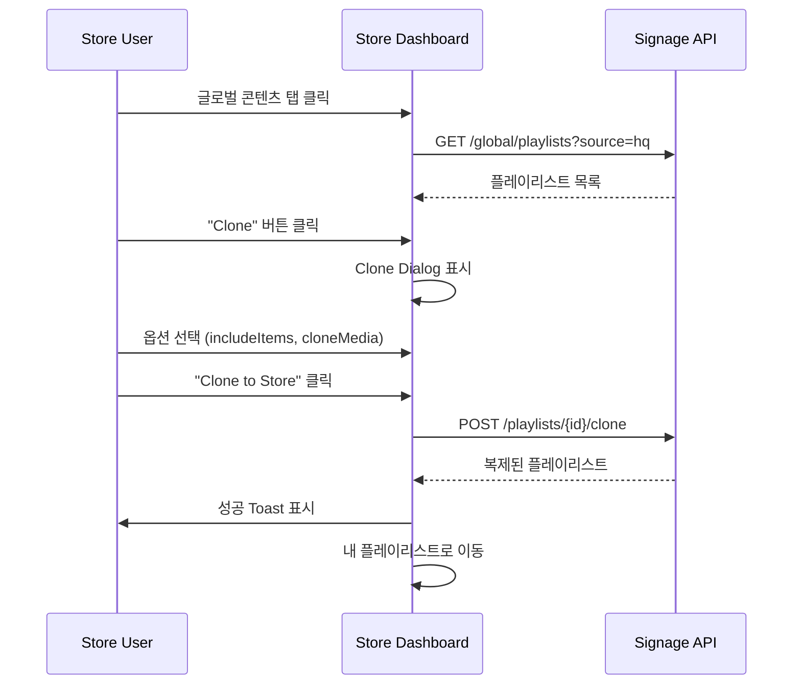
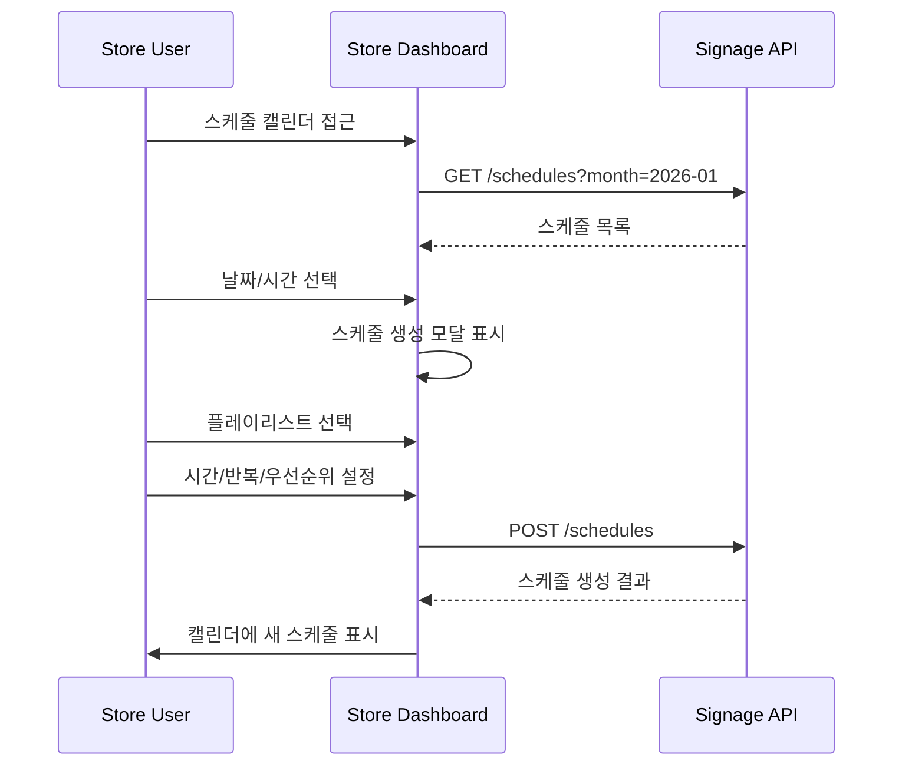

# Store Dashboard V2 Specification

> Phase 2 Refinement (R-2)
> Version: 2.0
> Date: 2026-01-17
> Status: Active

---

## 1. 개요

Store Dashboard V2는 매장 운영자를 위한 통합 사이니지 관리 인터페이스입니다.

### 주요 기능

1. **내 콘텐츠 관리**: 매장 자체 플레이리스트/미디어 관리
2. **글로벌 콘텐츠 브라우저**: HQ/Supplier/Community 콘텐츠 탐색 및 복제
3. **스케줄 관리**: 콘텐츠 재생 스케줄 설정
4. **디바이스 관리**: 디스플레이 및 채널 관리

---

## 2. 정보 아키텍처

```
Store Dashboard
├── 대시보드 (/)
│   ├── 오늘의 스케줄
│   ├── 디스플레이 상태
│   ├── 최근 활동
│   └── 빠른 작업
│
├── 내 콘텐츠 (/playlists)
│   ├── 플레이리스트 목록
│   │   ├── 내가 만든 항목
│   │   └── 복제한 항목 (원본 표시)
│   ├── 플레이리스트 편집기
│   │   ├── 드래그앤드롭 정렬
│   │   ├── 강제 항목 표시 (수정 불가)
│   │   └── 재생 시간 자동 계산
│   └── 플레이리스트 생성
│
├── 글로벌 콘텐츠 (/global)
│   ├── HQ 콘텐츠 (/global/hq)
│   │   ├── 강제 콘텐츠 (필수 수신)
│   │   └── 선택 콘텐츠 (복제 가능)
│   ├── 공급자 콘텐츠 (/global/supplier)
│   └── 커뮤니티 콘텐츠 (/global/community)
│
├── 스케줄 (/schedules)
│   ├── 캘린더 뷰 (일/주/월)
│   ├── 스케줄 생성/편집
│   ├── 충돌 감지
│   └── 우선순위 관리
│
├── 미디어 (/media)
│   ├── 미디어 라이브러리
│   │   ├── 내 미디어
│   │   └── 복제된 미디어
│   ├── 업로드
│   └── URL 미디어 추가
│
└── 디바이스 (/devices)
    ├── 디스플레이 목록
    ├── 디스플레이 등록
    ├── 채널 관리
    └── 디스플레이 상태 모니터링
```

---

## 3. 화면 상세 명세

### 3.1 대시보드

#### 3.1.1 레이아웃

```
┌──────────────────────────────────────────────────────────────┐
│                     Store Signage Dashboard                   │
├──────────────────────────────────────────────────────────────┤
│  ┌─────────────┐ ┌─────────────┐ ┌─────────────┐ ┌──────────┐│
│  │ Active      │ │ Scheduled   │ │ Displays    │ │ New HQ   ││
│  │ Displays    │ │ Today       │ │ Online      │ │ Content  ││
│  │    3/4      │ │    12       │ │    4/4      │ │    5     ││
│  └─────────────┘ └─────────────┘ └─────────────┘ └──────────┘│
├──────────────────────────────────────────────────────────────┤
│  Today's Schedule                                Quick Actions│
│  ┌─────────────────────────────────────┐  ┌────────────────┐ │
│  │ 09:00 - Morning Promo (HQ)         │  │ + New Playlist │ │
│  │ 12:00 - Lunch Special (Store)       │  │ + Upload Media │ │
│  │ 18:00 - Evening Sale (Supplier)     │  │ + New Schedule │ │
│  └─────────────────────────────────────┘  └────────────────┘ │
├──────────────────────────────────────────────────────────────┤
│  Recent Activity                         New from HQ          │
│  ┌───────────────────────────┐  ┌────────────────────────────┐│
│  │ • Playlist updated (2h)   │  │ Summer Sale 2026 ★ NEW     ││
│  │ • Schedule created (5h)   │  │ Brand Guidelines v3        ││
│  │ • Display registered (1d) │  │ Holiday Promo Pack         ││
│  └───────────────────────────┘  └────────────────────────────┘│
└──────────────────────────────────────────────────────────────┘
```

#### 3.1.2 컴포넌트

| 컴포넌트 | 설명 | 데이터 소스 |
|---------|------|------------|
| Stats Cards | 주요 지표 표시 | API: /stats |
| Today's Schedule | 오늘 예정된 스케줄 | API: /schedules?date=today |
| Recent Activity | 최근 변경 이력 | API: /activity |
| New from HQ | 신규 HQ 콘텐츠 | API: /global/playlists?source=hq&new=true |
| Quick Actions | 빠른 작업 버튼 | 내부 네비게이션 |

### 3.2 글로벌 콘텐츠 브라우저

#### 3.2.1 레이아웃

```
┌──────────────────────────────────────────────────────────────┐
│  Global Content Library                    [Playlists ▼]      │
│  Browse and clone content from HQ, suppliers, and community  │
├──────────────────────────────────────────────────────────────┤
│  ┌────────────┐ ┌────────────┐ ┌────────────┐                │
│  │  🏢 HQ     │ │  👥 Community│ │ 🚚 Supplier │               │
│  │  Content   │ │             │ │            │               │
│  └────────────┘ └────────────┘ └────────────┘               │
├──────────────────────────────────────────────────────────────┤
│  🔍 Search...                             [Sort: Recent ▼]   │
├──────────────────────────────────────────────────────────────┤
│  ┌─────────────────┐ ┌─────────────────┐ ┌─────────────────┐ │
│  │ Summer Sale     │ │ Brand Promo     │ │ New Products    │ │
│  │ ★ FORCED        │ │ 🏢 HQ           │ │ 🏢 HQ           │ │
│  │ 12 items • 5min │ │ 8 items • 3min  │ │ 5 items • 2min  │ │
│  │ ❤ 45  ⬇ 234    │ │ ❤ 23  ⬇ 156    │ │ ❤ 12  ⬇ 89     │ │
│  │ [Preview][Clone]│ │ [Preview][Clone]│ │ [Preview][Clone]│ │
│  └─────────────────┘ └─────────────────┘ └─────────────────┘ │
│  ┌─────────────────┐ ┌─────────────────┐ ┌─────────────────┐ │
│  │ Store Tips      │ │ Weekend Deals   │ │ ...             │ │
│  │ ...             │ │ ...             │ │                 │ │
│  └─────────────────┘ └─────────────────┘ └─────────────────┘ │
├──────────────────────────────────────────────────────────────┤
│                    Page 1 of 5  [<] [>]                       │
└──────────────────────────────────────────────────────────────┘
```

#### 3.2.2 탭별 기능

| 탭 | 설명 | 특수 기능 |
|---|------|----------|
| HQ | 본부 운영자 콘텐츠 | 강제 콘텐츠 표시, 필수 수신 알림 |
| Community | 다른 매장이 공유한 콘텐츠 | 인기도 정렬, 리뷰/평점 |
| Supplier | 공급업체 프로모션 | 브랜드별 필터 |

#### 3.2.3 Clone Dialog

```
┌──────────────────────────────────────────────────────────────┐
│  Clone Playlist                                          [X] │
├──────────────────────────────────────────────────────────────┤
│  Clone "Summer Sale 2026" to your store                      │
│                                                              │
│  ☑ Include playlist items (12 items)                         │
│  ☐ Clone media files (creates copies, not references)        │
│                                                              │
│  ℹ️ Media files will be referenced. Changes to original will  │
│     reflect in your playlist.                                │
│                                                              │
│  ⚠️ This playlist contains 3 forced items that will remain    │
│     locked in your copy.                                     │
│                                                              │
├──────────────────────────────────────────────────────────────┤
│                              [Cancel]  [Clone to Store]       │
└──────────────────────────────────────────────────────────────┘
```

### 3.3 플레이리스트 편집기

#### 3.3.1 레이아웃

```
┌──────────────────────────────────────────────────────────────┐
│  ← Back   My Playlist: Morning Rotation    [Save] [Publish]  │
├──────────────────────────────────────────────────────────────┤
│  ┌─────────────────────────┐ ┌───────────────────────────────┤
│  │ Playlist Items          │ │ Properties                    │
│  │ Total: 8 items • 4:30   │ │ Name: Morning Rotation        │
│  ├─────────────────────────┤ │ Status: Draft                 │
│  │ ≡ 1. Brand Intro 🔒     │ │ Loop: ✓ Enabled               │
│  │    (HQ Forced, 0:15)    │ │ Default Duration: 10s         │
│  ├─────────────────────────┤ │ Transition: Fade              │
│  │ ≡ 2. Today's Special    │ ├───────────────────────────────┤
│  │    (Store, 0:30)        │ │ Preview                       │
│  ├─────────────────────────┤ │ ┌───────────────────────────┐ │
│  │ ≡ 3. Product Showcase   │ │ │                           │ │
│  │    (Store, 1:00)        │ │ │    [▶️ Play Preview]       │ │
│  ├─────────────────────────┤ │ │                           │ │
│  │ ≡ 4. Summer Sale 🔒     │ │ └───────────────────────────┘ │
│  │    (HQ Forced, 0:20)    │ ├───────────────────────────────┤
│  └─────────────────────────┘ │ Clone Info                    │
│  [+ Add from Library]       │ │ Original: HQ > Summer Pack   │
│  [+ Add from Global]        │ │ Cloned: 2026-01-15           │
│                             │ └───────────────────────────────┤
└─────────────────────────────────────────────────────────────┘
```

#### 3.3.2 강제 항목 처리

| 항목 상태 | UI 표시 | 허용 작업 |
|----------|---------|----------|
| `isForced: true` | 🔒 아이콘 + "HQ Forced" 라벨 | 순서 변경만 (다른 강제 항목과) |
| `isForced: false` | 일반 표시 | 모든 작업 허용 |

### 3.4 스케줄 캘린더

#### 3.4.1 레이아웃

```
┌──────────────────────────────────────────────────────────────┐
│  Schedule Calendar          [Day] [Week] [Month]   [+ New]   │
├──────────────────────────────────────────────────────────────┤
│  ◄ January 2026 ►                                            │
├────┬────┬────┬────┬────┬────┬────────────────────────────────┤
│ SUN│ MON│ TUE│ WED│ THU│ FRI│ SAT                            │
├────┼────┼────┼────┼────┼────┼────────────────────────────────┤
│    │    │    │  1 │  2 │  3 │  4                             │
│    │    │    │    │    │ 🟦 │                                │
├────┼────┼────┼────┼────┼────┼────────────────────────────────┤
│  5 │  6 │  7 │  8 │  9 │ 10 │ 11                             │
│    │ 🟨 │ 🟨 │ 🟨 │ 🟨 │ 🟨 │                                │
├────┼────┼────┼────┼────┼────┼────────────────────────────────┤
│ 12 │ 13 │ 14 │ 15 │ 16 │ 17 │ 18                             │
│    │ 🟥 │ 🟥 │ 🟥 │ 🟥 │ 🟥 │ 🟥                              │
└────┴────┴────┴────┴────┴────┴────────────────────────────────┘
│ Legend: 🟥 High Priority  🟨 Normal  🟦 Low                   │
└──────────────────────────────────────────────────────────────┘
```

---

## 4. API 연동

### 4.1 Store Dashboard API

| 엔드포인트 | 메서드 | 설명 |
|-----------|--------|------|
| `/api/signage/:serviceKey/store/stats` | GET | 대시보드 통계 |
| `/api/signage/:serviceKey/store/activity` | GET | 최근 활동 |
| `/api/signage/:serviceKey/playlists` | GET | 플레이리스트 목록 |
| `/api/signage/:serviceKey/playlists` | POST | 플레이리스트 생성 |
| `/api/signage/:serviceKey/playlists/:id` | GET | 플레이리스트 상세 |
| `/api/signage/:serviceKey/playlists/:id` | PATCH | 플레이리스트 수정 |
| `/api/signage/:serviceKey/playlists/:id` | DELETE | 플레이리스트 삭제 |
| `/api/signage/:serviceKey/playlists/:id/clone` | POST | 플레이리스트 복제 |

### 4.2 Global Content API

| 엔드포인트 | 메서드 | 설명 |
|-----------|--------|------|
| `/api/signage/:serviceKey/global/playlists` | GET | 글로벌 플레이리스트 |
| `/api/signage/:serviceKey/global/playlists/:source` | GET | 소스별 필터 |
| `/api/signage/:serviceKey/global/media` | GET | 글로벌 미디어 |
| `/api/signage/:serviceKey/global/media/:source` | GET | 소스별 필터 |

---

## 5. 사용자 플로우

### 5.1 글로벌 콘텐츠 복제 플로우



### 5.2 스케줄 생성 플로우



---

## 6. 컴포넌트 목록

### 6.1 공통 컴포넌트

| 컴포넌트 | 파일 | 설명 |
|---------|------|------|
| StoreDashboardLayout | `StoreDashboardLayout.tsx` | 레이아웃 래퍼 |
| StoreNav | `StoreNav.tsx` | 사이드 네비게이션 |
| StatsCard | `StatsCard.tsx` | 통계 카드 |
| ActivityFeed | `ActivityFeed.tsx` | 활동 피드 |

### 6.2 글로벌 콘텐츠 컴포넌트

| 컴포넌트 | 파일 | 설명 |
|---------|------|------|
| GlobalContentBrowser | `GlobalContentBrowser.tsx` | 메인 브라우저 |
| ContentTab | `ContentTab.tsx` | 탭 콘텐츠 |
| PlaylistCard | `PlaylistCard.tsx` | 플레이리스트 카드 |
| MediaCard | `MediaCard.tsx` | 미디어 카드 |
| ClonePlaylistDialog | `ClonePlaylistDialog.tsx` | 복제 다이얼로그 |

### 6.3 플레이리스트 컴포넌트

| 컴포넌트 | 파일 | 설명 |
|---------|------|------|
| PlaylistList | `PlaylistList.tsx` | 목록 화면 |
| PlaylistEditor | `PlaylistEditor.tsx` | 편집기 |
| PlaylistItemList | `PlaylistItemList.tsx` | 항목 드래그앤드롭 |
| PlaylistItemCard | `PlaylistItemCard.tsx` | 항목 카드 |
| ForcedItemBadge | `ForcedItemBadge.tsx` | 강제 항목 표시 |

### 6.4 스케줄 컴포넌트

| 컴포넌트 | 파일 | 설명 |
|---------|------|------|
| ScheduleCalendar | `ScheduleCalendar.tsx` | 캘린더 뷰 |
| ScheduleEditor | `ScheduleEditor.tsx` | 편집기 |
| ScheduleConflictAlert | `ScheduleConflictAlert.tsx` | 충돌 알림 |

---

## 7. 관련 문서

- [Role Structure V2](./ROLE-STRUCTURE-V2.md)
- [Signage Routing Map V2](./SIGNAGE-ROUTING-MAP-V2.md)
- [Global Content Flow](./GLOBAL-CONTENT-FLOW-V2.md)

---

*Last Updated: 2026-01-17*
