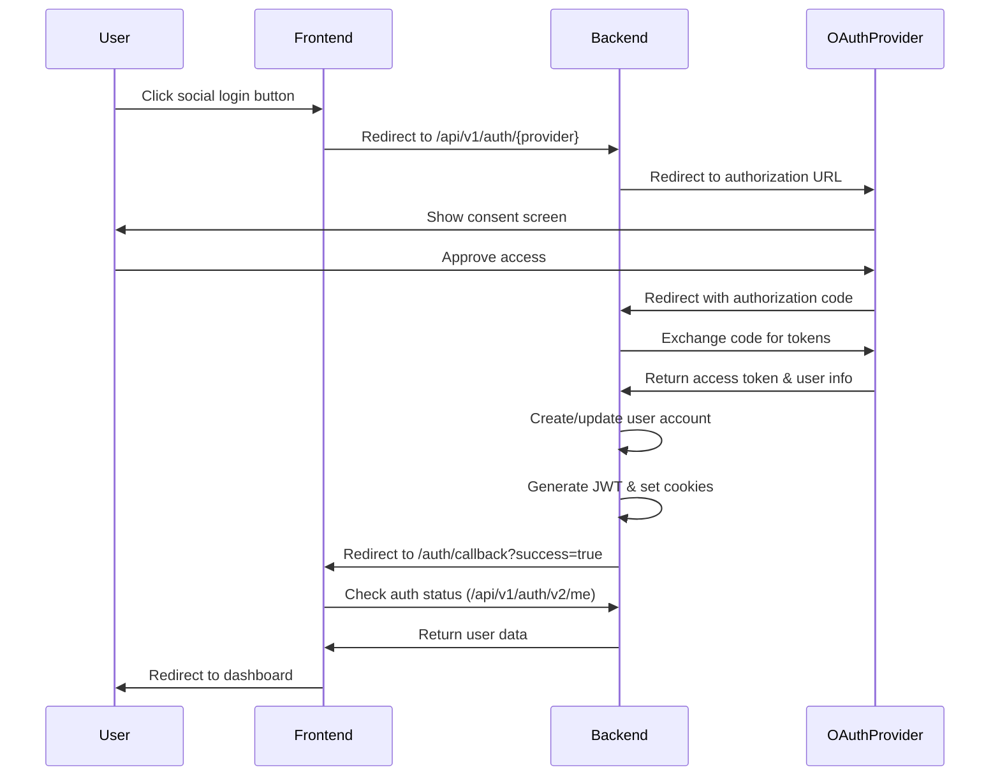

# OAuth Integration Guide

## Overview

This guide documents the OAuth integration implementation for O4O Platform, supporting Google, Kakao, and Naver social login.

## Architecture

### Frontend Components

1. **SocialLoginButtons.tsx** / **SocialLoginButtonsV2.tsx**
   - Displays social login buttons
   - Dynamically shows/hides providers based on backend configuration
   - Redirects to backend OAuth endpoints

2. **LoginFormWithSocial.tsx**
   - Complete login form with email/password and social options
   - Handles both traditional and OAuth login flows

3. **AuthCallbackV2.tsx**
   - Handles OAuth callback after provider authentication
   - Processes success/error parameters from backend
   - Manages user session initialization

4. **OAuthCallback.tsx**
   - Alternative OAuth callback handler for provider-specific routes
   - Handles authorization code exchange
   - Error handling for various OAuth scenarios

### Backend Routes

1. **`/api/v1/auth/{provider}`** - Initiates OAuth flow
   - Redirects to provider's authorization page
   - Providers: google, kakao, naver

2. **`/api/v1/auth/{provider}/callback`** - Provider callbacks
   - Exchanges authorization code for tokens
   - Creates/updates user account
   - Sets httpOnly cookies for authentication

3. **`/api/settings/oauth`** - OAuth configuration management
   - Admin-only endpoint for configuring OAuth providers
   - Stores encrypted client secrets

4. **`/api/settings/oauth/providers`** - Public endpoint
   - Returns enabled status for each provider
   - Used by frontend to show/hide login buttons

## OAuth Flow



## Configuration

### Environment Variables

```env
# Backend (.env)
FRONTEND_URL=http://localhost:3000
COOKIE_DOMAIN=.yourdomain.com  # For SSO across subdomains

# Frontend (.env)
VITE_API_URL=http://localhost:4000/api
```

### OAuth Provider Setup

1. **Google OAuth**
   - Console: https://console.cloud.google.com
   - Redirect URI: `http://your-api-domain/api/v1/auth/google/callback`
   - Required scopes: profile, email

2. **Kakao OAuth**
   - Console: https://developers.kakao.com
   - Redirect URI: `http://your-api-domain/api/v1/auth/kakao/callback`
   - Required scopes: profile_nickname, account_email

3. **Naver OAuth**
   - Console: https://developers.naver.com
   - Redirect URI: `http://your-api-domain/api/v1/auth/naver/callback`
   - Required scopes: Basic profile

## Security Considerations

1. **Client Secrets**: Stored encrypted in database
2. **CSRF Protection**: Using state parameter in OAuth flow
3. **Secure Cookies**: httpOnly, secure (in production), sameSite
4. **Token Storage**: No tokens in localStorage, only secure cookies

## Error Handling

### Common OAuth Errors

1. **access_denied**: User cancelled authorization
2. **invalid_request**: Malformed request
3. **server_error**: Provider server error
4. **temporarily_unavailable**: Provider temporarily down

### Frontend Error Messages (Korean)

- 로그인을 취소하셨습니다
- 잘못된 요청입니다
- 서버 오류가 발생했습니다
- 일시적으로 서비스를 이용할 수 없습니다

## Testing

### Manual Testing

1. Enable OAuth provider in admin panel
2. Click social login button
3. Complete provider authorization
4. Verify redirect and login success
5. Check user profile data

### Common Issues

1. **Redirect URI mismatch**
   - Ensure callback URLs match exactly in provider console
   - Check for trailing slashes

2. **Cookie not set**
   - Verify COOKIE_DOMAIN setting
   - Check sameSite policy for cross-domain

3. **Provider not showing**
   - Check admin panel OAuth settings
   - Verify provider is enabled
   - Check browser console for API errors

## Implementation Checklist

- [x] OAuth provider configuration UI (admin panel)
- [x] Social login buttons component
- [x] OAuth callback handling
- [x] User account creation/linking
- [x] Session management with cookies
- [x] Error handling and user feedback
- [x] Dynamic provider enable/disable
- [x] Secure token storage
- [x] Korean language support
- [x] TypeScript type safety

## Future Enhancements

1. **Additional Providers**
   - Apple Sign In
   - GitHub
   - Facebook

2. **Account Linking**
   - Link multiple social accounts
   - Merge existing accounts

3. **OAuth Scope Management**
   - Request additional permissions
   - Progressive authorization

4. **Security Enhancements**
   - PKCE flow implementation
   - Token rotation
   - Audit logging