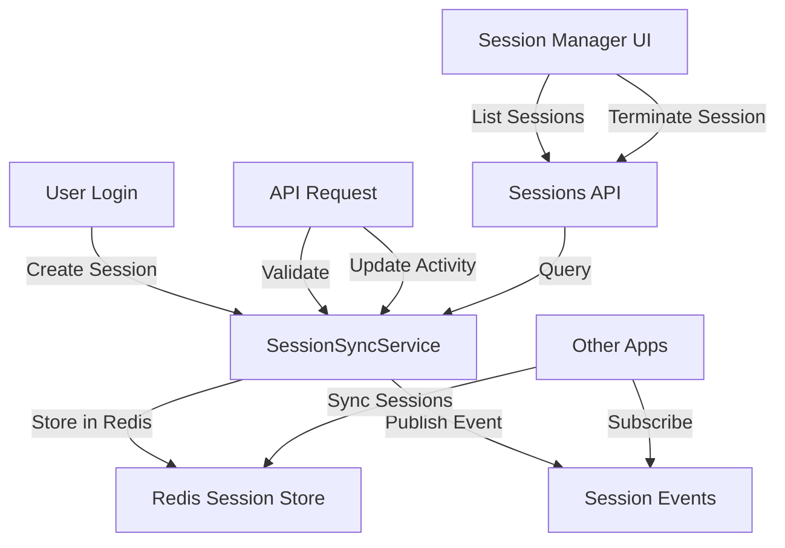

# Session Management Implementation Guide

## Overview

This document describes the enhanced session management system for O4O Platform, providing multi-device session control, activity tracking, and concurrent session limits.

## Features

### 1. Multi-Device Session Support
- Track all active sessions across devices
- Device type detection (desktop, mobile, tablet)
- Browser and platform identification
- IP address tracking for security

### 2. Session Activity Tracking
- Last activity timestamp
- Automatic activity updates on API calls
- Session expiration after inactivity

### 3. Concurrent Session Control
- Configurable session limits per user
- Automatic removal of oldest sessions
- Real-time session count validation

### 4. Session Security
- Secure session ID generation (crypto.randomBytes)
- Session validation on each request
- Automatic cleanup of expired sessions

## Architecture



## Implementation Components

### Backend Services

#### SessionSyncService Enhanced
```typescript
interface SessionData {
  userId: string;
  email: string;
  role: string;
  status: string;
  loginAt: Date;
  expiresAt: Date;
  deviceInfo?: DeviceInfo;
  ipAddress?: string;
  lastActivity?: Date;
}

// New methods added:
- checkConcurrentSessions()
- enforceSessionLimit()
- updateSessionActivity()
- parseDeviceInfo()
```

#### Session Middleware
```typescript
// Update activity on each request
export const updateSessionActivity

// Validate session before processing
export const validateSession
```

### API Endpoints

#### Get User Sessions
```
GET /api/v1/sessions/my-sessions
Response: {
  sessions: [{
    sessionId: string,
    deviceInfo: {...},
    loginAt: Date,
    lastActivity: Date,
    isCurrent: boolean
  }],
  count: number
}
```

#### Terminate Session
```
POST /api/v1/sessions/logout/:sessionId
Response: { success: true, message: string }
```

#### Logout All Devices
```
POST /api/v1/sessions/logout-all
Response: { success: true, message: string }
```

#### Session Statistics
```
GET /api/v1/sessions/stats
Response: {
  totalSessions: number,
  deviceTypes: {...},
  browsers: {...},
  lastActivity: Date
}
```

### Frontend Components

#### SessionManager Component
- Display all active sessions
- Show device/browser information
- Allow termination of sessions
- Highlight current session
- Confirm dialog for actions

```tsx
<SessionManager />
// Features:
- Real-time session list
- Device icons and info
- One-click logout
- Security warnings
```

## Configuration

### Environment Variables
```bash
# Session Configuration
SESSION_TTL=604800          # 7 days in seconds
MAX_CONCURRENT_SESSIONS=5   # Max sessions per user
SESSION_CLEANUP_INTERVAL=3600000  # 1 hour
```

### Redis Configuration
```typescript
// Session storage structure
session:{sessionId} -> SessionData (JSON)
user_sessions:{userId} -> Set of sessionIds
```

## Security Features

### 1. Session Validation
- Validate session on each protected route
- Check expiration timestamps
- Verify session belongs to user

### 2. Activity Monitoring
- Track last activity per session
- Automatic session expiration
- Suspicious activity detection

### 3. Device Fingerprinting
- User agent parsing
- Platform detection
- Browser identification

### 4. Concurrent Session Limits
- Prevent session hijacking
- Limit active sessions per user
- Remove oldest sessions automatically

## User Experience

### Session List View
- **Current Session**: Highlighted in blue
- **Device Icons**: Visual device type indication
- **Activity Status**: "Last active X minutes ago"
- **Quick Actions**: One-click logout per session

### Security Notifications
- Warning when approaching session limit
- Alert on new device login
- Confirmation for logout actions

## Integration with Auth System

### Login Flow
```typescript
// During login in AuthServiceV2
1. Check concurrent sessions
2. Enforce session limit if needed
3. Generate secure session ID
4. Create session with device info
5. Store in Redis with TTL
```

### Logout Flow
```typescript
// During logout
1. Remove session from Redis
2. Clear user session set
3. Publish logout event
4. Clear auth cookies
```

## Monitoring and Maintenance

### Automatic Cleanup
- Expired sessions removed on access
- Background cleanup job (optional)
- Activity-based expiration

### Session Events
```typescript
// Published events for cross-app sync
- session:created
- session:removed
- session:logout_all
- session:updated
```

### Metrics and Analytics
- Active sessions per user
- Device type distribution
- Average session duration
- Peak concurrent sessions

## Testing Checklist

- [ ] Login creates new session
- [ ] Session appears in manager
- [ ] Activity updates on API calls
- [ ] Session limit enforcement
- [ ] Logout removes session
- [ ] Logout all clears all sessions
- [ ] Expired sessions cleaned up
- [ ] Device detection works
- [ ] Current session highlighted
- [ ] Cross-device sync works

## Troubleshooting

### Common Issues

1. **Sessions Not Appearing**
   - Check Redis connection
   - Verify session creation on login
   - Check session ID in cookies

2. **Activity Not Updating**
   - Ensure middleware is applied
   - Check Redis write permissions
   - Verify session ID format

3. **Device Info Missing**
   - Check User-Agent header
   - Verify parsing logic
   - Test with different browsers

### Debug Commands
```bash
# Check Redis sessions
redis-cli KEYS "session:*"
redis-cli SMEMBERS "user_sessions:{userId}"

# Monitor session events
redis-cli SUBSCRIBE "session:events"
```

## Future Enhancements

1. **Geographic Location**
   - Add location to sessions
   - Alert on location changes

2. **Session History**
   - Keep terminated session logs
   - Security audit trail

3. **Advanced Device Detection**
   - More detailed device info
   - OS version detection

4. **Session Sharing**
   - Temporary session sharing
   - Guest session support

5. **2FA Per Session**
   - Require 2FA for new devices
   - Trust device options