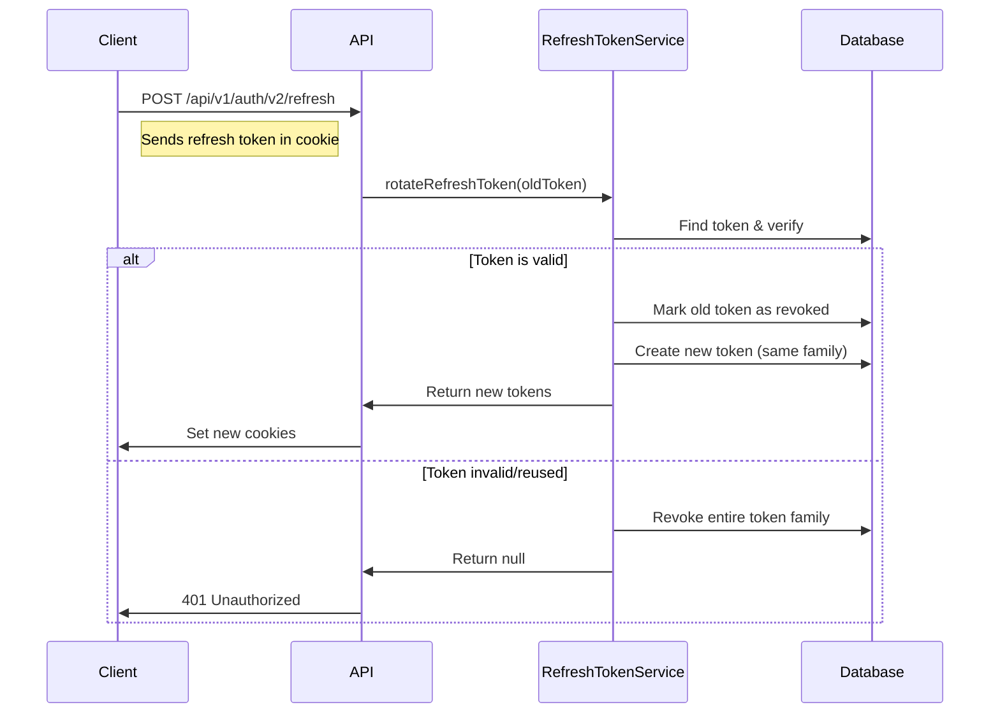

# Refresh Token Implementation Guide

## Overview

This document describes the refresh token implementation for O4O Platform, including token rotation for enhanced security.

## Architecture

### Services Refactoring

The original `AuthService` (418 lines) has been split into:

1. **RefreshTokenService** - Handles all refresh token operations
2. **UserService** - Manages user-related operations
3. **AuthServiceV2** - Streamlined authentication service

### Database Schema

```sql
CREATE TABLE refresh_tokens (
  id UUID PRIMARY KEY DEFAULT uuid_generate_v4(),
  token TEXT NOT NULL,
  userId UUID NOT NULL REFERENCES users(id) ON DELETE CASCADE,
  family VARCHAR(255) NOT NULL,
  expiresAt TIMESTAMP NOT NULL,
  isRevoked BOOLEAN DEFAULT false,
  userAgent TEXT,
  ipAddress VARCHAR(45),
  createdAt TIMESTAMP DEFAULT CURRENT_TIMESTAMP,
  updatedAt TIMESTAMP DEFAULT CURRENT_TIMESTAMP
);

CREATE UNIQUE INDEX IDX_refresh_tokens_token ON refresh_tokens(token);
CREATE INDEX IDX_refresh_tokens_userId_family ON refresh_tokens(userId, family);
CREATE INDEX IDX_refresh_tokens_family ON refresh_tokens(family);
CREATE INDEX IDX_refresh_tokens_expiresAt ON refresh_tokens(expiresAt);
```

## Token Rotation Flow



## Security Features

### 1. Token Rotation
- Each refresh creates a new token and revokes the old one
- Prevents token reuse attacks
- Token families track related tokens

### 2. Automatic Revocation
- If a revoked token is reused, entire family is revoked
- Detects potential token theft
- Forces re-authentication

### 3. Token Limits
- Maximum 5 active refresh tokens per user
- Prevents token accumulation
- Oldest tokens auto-revoked

### 4. HttpOnly Cookies
- Tokens stored in httpOnly cookies
- Prevents XSS attacks
- Automatic inclusion in requests

## Implementation Details

### Backend Changes

1. **RefreshTokenService Methods**:
   - `generateRefreshToken()` - Creates new token
   - `rotateRefreshToken()` - Implements rotation
   - `verifyRefreshToken()` - Validates token
   - `revokeTokenFamily()` - Security breach handling
   - `cleanupExpiredTokens()` - Maintenance

2. **AuthServiceV2 Methods**:
   - `login()` - User authentication
   - `generateTokens()` - Token pair creation
   - `refreshTokens()` - Token refresh flow
   - `setAuthCookies()` - Cookie management

3. **UserService Methods**:
   - User CRUD operations
   - Password management
   - Login attempt tracking
   - Account locking

### Frontend Changes

1. **Auth Interceptor**:
   ```typescript
   // Automatic token refresh on 401
   if (error.response?.status === 401) {
     await apiClient.post('/v1/auth/v2/refresh');
     return apiClient(originalRequest);
   }
   ```

2. **Request Queue**:
   - Queues requests during refresh
   - Prevents multiple refresh calls
   - Retries after refresh

## API Endpoints

### Login
```
POST /api/v1/auth/v2/login
Body: { email, password }
Response: { user, success }
Cookies: accessToken, refreshToken, sessionId
```

### Refresh Token
```
POST /api/v1/auth/v2/refresh
Cookies: refreshToken (required)
Response: { success }
Cookies: new accessToken, refreshToken
```

### Logout
```
POST /api/v1/auth/v2/logout
Cookies: accessToken
Response: { success }
Effect: Revokes all user tokens
```

## Configuration

### Environment Variables
```env
JWT_SECRET=your-jwt-secret
JWT_REFRESH_SECRET=your-refresh-secret
BCRYPT_ROUNDS=12
NODE_ENV=production
COOKIE_DOMAIN=.yourdomain.com
```

### Token Expiry
- Access Token: 15 minutes
- Refresh Token: 7 days
- Max Tokens per User: 5

## Migration

Run the migration to create refresh_tokens table:
```bash
npm run typeorm migration:run
```

## Testing

### Manual Testing
1. Login and receive tokens
2. Wait for access token expiry (15 min)
3. Make authenticated request
4. Verify automatic refresh
5. Check new tokens in cookies

### Security Testing
1. Reuse old refresh token
2. Verify token family revocation
3. Check all sessions terminated
4. Require new login

## Monitoring

### Metrics to Track
- Token refresh rate
- Failed refresh attempts
- Token family revocations
- Average tokens per user

### Cleanup Job
```typescript
// Run daily
await RefreshTokenService.cleanupExpiredTokens();
```

## Common Issues

### 1. Refresh Loop
- **Cause**: Invalid refresh token
- **Solution**: Clear cookies and re-login

### 2. Token Not Refreshing
- **Cause**: httpOnly cookie not sent
- **Solution**: Check CORS and cookie settings

### 3. Multiple Devices
- **Cause**: Token limit reached
- **Solution**: Increase MAX_TOKENS_PER_USER

## Security Best Practices

1. **Never** expose tokens in response body
2. **Always** use httpOnly cookies
3. **Implement** token rotation
4. **Monitor** unusual refresh patterns
5. **Revoke** on suspicious activity

## Future Enhancements

1. **Device Management**
   - Show active sessions
   - Allow selective revocation
   
2. **Refresh Token Binding**
   - Bind to device fingerprint
   - Enhance security

3. **Sliding Sessions**
   - Extend on activity
   - Better UX

4. **Audit Logging**
   - Track all token operations
   - Security analysis