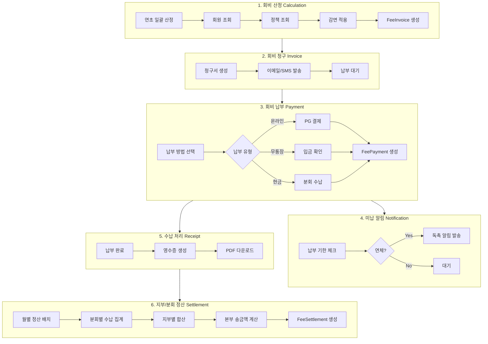

# AnnualFee-Yaksa Phase 0 조사 보고서

> 작성일: 2025-12-12
> 작성자: Claude (AI Agent)
> 브랜치: feature/yaksa-service

---

## 1. 조사 요약

AnnualFee-Yaksa는 약사회 연회비/회비 관리 시스템으로, Membership-Yaksa의 회원 정보와 Organization의 조직 구조를 기반으로 회비 산정, 청구, 납부, 정산을 처리하는 Extension App입니다.

### 1.1 조사 범위

- Membership-Yaksa 엔티티 및 서비스 구조
- Organization-Core 조직 계층 구조
- LMS-Yaksa 연수교육 이수 연계 가능성
- Reporting-Yaksa 신상신고 연동 구조
- 기존 MembershipYear 엔티티 분석

### 1.2 핵심 발견사항

1. **MembershipYear 엔티티 존재**: 기본적인 연회비 납부 이력 관리 구조가 이미 존재
2. **MemberCategory 연회비 필드**: `requiresAnnualFee`, `annualFeeAmount` 필드 활용 가능
3. **조직 계층 구조**: national → division(지부) → branch(분회) 3단계 구조
4. **회원 분류 필드**: pharmacistType, officialRole, workplaceType 등 회비 차등 기준 활용 가능
5. **StatsService의 feeStats**: 이미 기본적인 회비 통계 로직 구현됨

---

## 2. Step 0-1: Existing Structure Inventory (기존 구조 조사)

### 2.1 Membership-Yaksa 핵심 엔티티

#### Member Entity (`yaksa_members`)
| 필드 | 타입 | 회비 정책 활용 |
|------|------|--------------|
| `pharmacistType` | PharmacistType | 직능별 차등 회비 |
| `officialRole` | OfficialRole | 임원 면제/차등 |
| `workplaceType` | WorkplaceType | 근무지별 차등 |
| `categoryId` | UUID → MemberCategory | 회원 유형별 차등 |
| `isVerified` | boolean | 검증된 회원만 청구 |
| `isActive` | boolean | 활성 회원만 청구 |
| `organizationId` | UUID | 소속 조직 (분회) |

**PharmacistType 값:**
- `working` (근무약사)
- `owner` (개설약사)
- `hospital` (병원약사)
- `public` (공직약사)
- `industry` (산업약사)
- `retired` (퇴직약사)
- `other` (기타)

**OfficialRole 값:**
- `president`, `vice_president`, `general_manager`, `auditor`
- `director`, `branch_head`, `district_head`, `none`

#### MemberCategory Entity (`yaksa_member_categories`)
| 필드 | 타입 | 설명 |
|------|------|------|
| `requiresAnnualFee` | boolean | 연회비 적용 여부 |
| `annualFeeAmount` | integer | 기본 연회비 금액 |

**예상 카테고리:**
- 정회원 (연회비 적용)
- 준회원 (감면 적용)
- 휴업약사 (면제)
- 명예회원 (면제)

#### MembershipYear Entity (`yaksa_membership_years`)
| 필드 | 타입 | 설명 |
|------|------|------|
| `memberId` | UUID | 회원 FK |
| `year` | integer | 연도 (YYYY) |
| `paid` | boolean | 납부 완료 여부 |
| `paidAt` | timestamp | 납부 일시 |
| `amount` | integer | 납부 금액 |
| `paymentMethod` | varchar(50) | 결제 수단 |
| `transactionId` | varchar(255) | 거래 ID |
| `receiptUrl` | text | 영수증 URL |
| `metadata` | jsonb | 확장 데이터 (할인 정보 등) |

**Helper Method:**
- `isOverdue()`: 매년 3월 31일 기준 연체 확인
- `markAsPaid()`: 납부 처리

#### Affiliation Entity (`yaksa_member_affiliations`)
| 필드 | 타입 | 설명 |
|------|------|------|
| `memberId` | UUID | 회원 FK |
| `organizationId` | UUID | 조직 FK |
| `position` | varchar(100) | 조직 내 직책 |
| `isPrimary` | boolean | 주 소속 여부 |

### 2.2 Organization-Core 구조

#### Organization Entity (`organizations`)
| 필드 | 타입 | 설명 |
|------|------|------|
| `type` | enum | national/division/branch |
| `level` | integer | 0(본부)/1(지부)/2(분회) |
| `path` | text | 계층 경로 |
| `parentId` | UUID | 상위 조직 |

**계층 구조 예시:**
```
대한약사회 (national, level=0, path="/national")
├── 서울지부 (division, level=1, path="/national/seoul")
│   ├── 강남분회 (branch, level=2, path="/national/seoul/gangnam")
│   └── 강서분회 (branch, level=2, path="/national/seoul/gangseo")
└── 부산지부 (division, level=1, path="/national/busan")
    └── 해운대분회 (branch, level=2, path="/national/busan/haeundae")
```

### 2.3 LMS-Yaksa 연계 구조

#### CreditRecord Entity (`lms_yaksa_credit_records`)
- 연수교육 이수 학점 기록
- `userId`, `creditYear`, `creditsEarned` 필드
- 연간 필수 학점 이수 여부 → 회비 감면 연계 가능

#### RequiredCoursePolicy Entity
- 조직별 필수 교육 정책
- `targetPharmacistTypes`: 약사 유형별 정책 적용

### 2.4 Reporting-Yaksa 연계 구조

#### AnnualReport Entity (`yaksa_annual_reports`)
- 신상신고서 제출/승인 상태 관리
- `status`: draft → submitted → approved
- `syncedToMembership`: 승인 후 회원 정보 동기화 완료 여부
- **회비 부과 조건으로 활용 가능**: 신상신고 미완료 시 회비 청구 보류

### 2.5 기존 통계 서비스 (StatsService)

`StatsService.getFeeStats()` 이미 구현됨:
- `paidCount`: 납부 완료 회원 수
- `unpaidCount`: 미납 회원 수
- `exemptCount`: 면제 회원 수
- `totalCollected`: 총 수금액
- `collectionRate`: 수금율(%)

---

## 3. Step 0-2: 회비 정책 요구사항 조사

### 3.1 회비 정책 Matrix

| 조건 | 정책 유형 | 우선순위 | 설명 |
|------|----------|---------|------|
| MemberCategory | 기본 정책 | 1 | 회원 유형별 기본 회비 |
| PharmacistType | 직능별 차등 | 2 | 근무/개설/병원/공직/산업 |
| OfficialRole | 임원 감면 | 3 | 임원직 면제 또는 감면 |
| Organization | 지부/분회 차등 | 4 | 조직별 추가 분담금 |
| Age/Seniority | 고령/원로 감면 | 5 | 고령 회원 감면 |
| LMS Credit | 연수이수 인센티브 | 6 | 필수 학점 이수 시 할인 |
| Report Status | 신상신고 연계 | 7 | 미신고 시 청구 보류 |

### 3.2 회비 구성 요소 (예상)

```
총 회비 = 본회비 + 지부비 + 분회비 - 감면액
```

| 구성 요소 | 수혜 조직 | 금액 결정자 |
|----------|----------|------------|
| 본회비 | 대한약사회 (national) | 전국 동일 |
| 지부비 | 지부 (division) | 지부별 결정 |
| 분회비 | 분회 (branch) | 분회별 결정 |

### 3.3 감면 규정 (예상)

| 감면 사유 | 감면율 | 적용 조건 |
|----------|-------|----------|
| 명예회원 | 100% | MemberCategory = '명예회원' |
| 휴업약사 | 100% | MemberCategory = '휴업약사' |
| 고령회원 | 50% | birthdate 기준 70세 이상 |
| 신규입회 | 50% | 입회 첫해 |
| 연수이수 우수 | 10% | 연간 필수 학점 150% 이상 이수 |
| 조기납부 | 5% | 1월 31일 이전 납부 |

### 3.4 분배 구조

```
회원 납부 → 분회 수납 → 지부 송금 → 본부 송금
```

| 단계 | 비율 | 설명 |
|------|------|------|
| 분회 수납 | 100% | 회원 직접 납부 |
| 지부 송금 | 지부비+본회비 | 분회에서 지부로 |
| 본부 송금 | 본회비 | 지부에서 본부로 |

---

## 4. Step 0-3: 회비 기능 Flow 조사

### 4.1 연회비 흐름도 (Mermaid)



### 4.2 데이터 입력/계산 시점

| 단계 | 트리거 | 자동화 |
|------|--------|--------|
| 회비 산정 | 연초 배치 (1월 1일) | 자동 |
| 청구서 발송 | 산정 완료 후 | 자동 |
| 납부 처리 | 결제 완료 webhook | 자동 |
| 연체 알림 | 납부 기한 도래 (3월) | 자동 |
| 정산 집계 | 월말 배치 | 자동 |

### 4.3 AutoSync 포인트

| 연동 시스템 | 동기화 내용 | 방향 |
|------------|-----------|------|
| Membership-Yaksa | 회원 정보 변경 → 회비 재산정 | → |
| Reporting-Yaksa | 신상신고 승인 → 회비 청구 활성화 | → |
| LMS-Yaksa | 학점 이수 완료 → 감면 적용 | → |
| MembershipYear | 납부 완료 → 기존 테이블 업데이트 | ← |

---

## 5. Step 0-4: 엔티티 설계 후보 조사

### 5.1 신규 엔티티 후보

#### 1. FeePolicy (회비 정책)

```typescript
@Entity('yaksa_fee_policies')
export class FeePolicy {
  id: string;                    // PK
  name: string;                  // 정책명
  organizationId?: string;       // 적용 조직 (null=전체)
  year: number;                  // 적용 연도
  type: 'base' | 'org_addon' | 'exemption' | 'discount';

  // 적용 조건
  targetCategories?: string[];   // 적용 회원 카테고리
  targetPharmacistTypes?: string[];
  targetOfficialRoles?: string[];
  ageThreshold?: number;         // 고령 감면 기준 나이

  // 금액/비율
  amount: number;                // 금액 (원)
  rate?: number;                 // 비율 (%)

  priority: number;              // 적용 우선순위
  isActive: boolean;
  validFrom: Date;
  validUntil?: Date;

  metadata?: Record<string, any>;
  createdAt: Date;
  updatedAt: Date;
}
```

#### 2. FeeInvoice (회비 청구)

```typescript
@Entity('yaksa_fee_invoices')
export class FeeInvoice {
  id: string;                    // PK
  memberId: string;              // FK → yaksa_members
  organizationId: string;        // 납부 시점 소속 조직
  year: number;                  // 청구 연도

  // 금액 상세
  baseAmount: number;            // 본회비
  divisionAmount: number;        // 지부비
  branchAmount: number;          // 분회비
  discountAmount: number;        // 감면액
  totalAmount: number;           // 최종 청구액

  // 감면 내역
  appliedPolicies: string[];     // 적용된 정책 IDs
  discountDetails?: Record<string, { reason: string; amount: number }>;

  // 상태
  status: 'pending' | 'partial' | 'paid' | 'overdue' | 'cancelled' | 'exempted';
  issuedAt: Date;
  dueDate: Date;

  // 납부 정보 (summary)
  paidAmount: number;
  paidAt?: Date;

  metadata?: Record<string, any>;
  createdAt: Date;
  updatedAt: Date;
}
```

#### 3. FeePayment (납부 내역)

```typescript
@Entity('yaksa_fee_payments')
export class FeePayment {
  id: string;                    // PK
  invoiceId: string;             // FK → yaksa_fee_invoices
  memberId: string;              // FK → yaksa_members

  amount: number;                // 납부 금액
  paymentMethod: 'card' | 'bank_transfer' | 'cash' | 'virtual_account';

  // 결제 정보
  transactionId?: string;        // PG 거래 ID
  pgProvider?: string;           // PG사 (toss, nice 등)
  approvalNumber?: string;       // 승인번호

  // 수납 정보 (현금/무통장)
  collectorId?: string;          // 수납자 (분회 담당자)
  collectorName?: string;
  collectedAt?: Date;

  status: 'pending' | 'completed' | 'failed' | 'refunded' | 'cancelled';

  receiptUrl?: string;
  note?: string;
  metadata?: Record<string, any>;

  createdAt: Date;
  updatedAt: Date;
}
```

#### 4. FeeExemption (감면 규정)

```typescript
@Entity('yaksa_fee_exemptions')
export class FeeExemption {
  id: string;                    // PK
  memberId: string;              // FK → yaksa_members
  year: number;                  // 적용 연도

  exemptionType: 'full' | 'partial';
  exemptionRate: number;         // 0-100 (%)
  exemptionAmount?: number;      // 또는 고정 금액

  reason: string;                // 감면 사유
  category: 'age' | 'category' | 'role' | 'special' | 'manual';

  approvedBy?: string;           // 승인자
  approvedAt?: Date;

  validFrom: Date;
  validUntil?: Date;

  note?: string;
  metadata?: Record<string, any>;

  createdAt: Date;
  updatedAt: Date;
}
```

#### 5. FeeSettlement (지부/분회 정산)

```typescript
@Entity('yaksa_fee_settlements')
export class FeeSettlement {
  id: string;                    // PK
  organizationId: string;        // FK → organizations
  organizationType: 'branch' | 'division' | 'national';

  year: number;
  month: number;                 // 정산 월

  // 수납 집계
  totalCollected: number;        // 총 수납액
  memberCount: number;           // 납부 회원 수

  // 분배 금액
  retainedAmount: number;        // 자체 보유액
  remittedAmount: number;        // 상위 조직 송금액
  remittedToId?: string;         // 송금 대상 조직

  status: 'pending' | 'confirmed' | 'remitted';
  confirmedAt?: Date;
  confirmedBy?: string;
  remittedAt?: Date;

  metadata?: Record<string, any>;
  createdAt: Date;
  updatedAt: Date;
}
```

#### 6. FeeLog (수정/취소/환불 로그)

```typescript
@Entity('yaksa_fee_logs')
export class FeeLog {
  id: string;                    // PK

  entityType: 'invoice' | 'payment' | 'settlement' | 'exemption';
  entityId: string;              // 대상 엔티티 ID

  action: 'created' | 'updated' | 'cancelled' | 'refunded' | 'approved' | 'rejected';

  previousState?: Record<string, any>;
  newState?: Record<string, any>;
  changedFields?: string[];

  performedBy: string;           // 작업자 ID
  performedByName?: string;
  reason?: string;

  ipAddress?: string;
  userAgent?: string;

  createdAt: Date;
}
```

### 5.2 MembershipYear 통합 여부 결정

**결론: 분리 유지 + 동기화**

| 항목 | MembershipYear | FeeInvoice + FeePayment |
|------|---------------|-------------------------|
| 역할 | 간단한 납부 이력 | 상세 청구/납부 관리 |
| 복잡도 | 낮음 | 높음 |
| 기존 연동 | Member.isPaidForYear() 등 | 새 API 필요 |

**동기화 전략:**
- FeePayment 완료 시 → MembershipYear 자동 업데이트
- 기존 코드 호환성 유지
- 점진적 마이그레이션 가능

---

## 6. Step 0-5: External System 조사

### 6.1 결제(PG) 연동

| 항목 | 상태 | 비고 |
|------|------|------|
| PG 연동 필요 | Phase 2+ | 초기에는 무통장/현금 수납 위주 |
| 추천 PG | Toss Payments | 가상계좌, 카드 지원 |
| 대안 | Nice Pay, KG이니시스 | |

**Phase 1에서는 PG 미연동:**
- 분회에서 현금/무통장 수납 후 수동 처리
- 관리자가 납부 확인 후 상태 변경

### 6.2 알림 시스템

| 채널 | 용도 | 구현 수준 |
|------|------|----------|
| 이메일 | 청구서, 영수증, 독촉 | Phase 1 (기존 NotificationService 활용) |
| SMS | 납부 기한 알림 | Phase 2 (외부 서비스 연동) |
| 앱 푸시 | 실시간 알림 | Phase 3 |

### 6.3 PDF 생성

| 문서 유형 | 필요성 | 구현 시점 |
|----------|--------|----------|
| 청구서 | 필수 | Phase 1 |
| 영수증 | 필수 | Phase 1 |
| 정산 보고서 | 선택 | Phase 2 |

**추천 라이브러리:**
- `pdfmake` (Node.js)
- `@react-pdf/renderer` (프론트엔드)

### 6.4 Phase별 기능 분리

| 기능 | Phase 1 | Phase 2 | Phase 3 |
|------|---------|---------|---------|
| 회비 산정 | O | | |
| 청구서 생성 | O | | |
| 수동 납부 처리 | O | | |
| 이메일 알림 | O | | |
| PDF 청구서/영수증 | O | | |
| 지부/분회 정산 | O | | |
| PG 결제 연동 | | O | |
| SMS 알림 | | O | |
| 자동이체 | | | O |
| 앱 푸시 알림 | | | O |

---

## 7. Step 0-6: Phase 1 개발 정의

### 7.1 Phase 1 구현 범위

#### Backend Entities
1. `FeePolicy` - 회비 정책 관리
2. `FeeInvoice` - 회비 청구서
3. `FeePayment` - 납부 내역
4. `FeeExemption` - 감면 내역
5. `FeeSettlement` - 월별 정산
6. `FeeLog` - 변경 이력

#### Backend Services
1. `FeePolicyService` - 정책 CRUD, 회비 계산 엔진
2. `FeeInvoiceService` - 청구서 생성, 일괄 생성
3. `FeePaymentService` - 납부 처리, 환불
4. `FeeExemptionService` - 감면 신청/승인
5. `FeeSettlementService` - 월별 정산 집계
6. `FeeCalculationEngine` - 회비 산정 핵심 로직
7. `FeeSyncService` - MembershipYear 동기화

#### Backend Controllers/Routes
1. `FeePolicyController` - 정책 관리 API
2. `FeeInvoiceController` - 청구 관리 API
3. `FeePaymentController` - 납부 관리 API
4. `FeeSettlementController` - 정산 관리 API
5. `FeeAdminController` - 관리자 종합 API

#### Frontend (Admin)
1. **회비 정책 관리** - 정책 목록, 생성, 수정
2. **회비 청구 관리** - 일괄 생성, 청구 목록, 상태 변경
3. **납부 현황** - 납부/미납 목록, 수동 납부 처리
4. **정산 관리** - 월별 정산 현황, 지부/분회별 집계
5. **회비 대시보드** - 수금율, 미납 현황 차트

#### Frontend (Member - main-site)
1. **내 회비 현황** - 청구 내역, 납부 이력
2. **납부 안내** - 납부 방법 안내
3. **영수증 다운로드** - PDF 영수증

### 7.2 API 설계 초안

#### 정책 관리
```
GET    /api/fee/policies                    # 정책 목록
POST   /api/fee/policies                    # 정책 생성
GET    /api/fee/policies/:id                # 정책 상세
PUT    /api/fee/policies/:id                # 정책 수정
DELETE /api/fee/policies/:id                # 정책 삭제
```

#### 청구 관리
```
GET    /api/fee/invoices                    # 청구 목록
POST   /api/fee/invoices/generate           # 일괄 청구 생성
GET    /api/fee/invoices/:id                # 청구 상세
PUT    /api/fee/invoices/:id/cancel         # 청구 취소
GET    /api/fee/invoices/member/:memberId   # 회원별 청구
```

#### 납부 관리
```
GET    /api/fee/payments                    # 납부 목록
POST   /api/fee/payments                    # 납부 처리 (수동)
GET    /api/fee/payments/:id                # 납부 상세
PUT    /api/fee/payments/:id/refund         # 환불 처리
```

#### 정산 관리
```
GET    /api/fee/settlements                 # 정산 목록
POST   /api/fee/settlements/generate        # 월별 정산 생성
GET    /api/fee/settlements/:id             # 정산 상세
PUT    /api/fee/settlements/:id/confirm     # 정산 확정
```

#### 회원용
```
GET    /api/fee/my/invoices                 # 내 청구 목록
GET    /api/fee/my/payments                 # 내 납부 이력
GET    /api/fee/my/receipt/:paymentId       # 영수증 다운로드
```

### 7.3 화면 구조 초안

#### Admin Dashboard
```
/admin/fee
├── /dashboard          # 회비 대시보드
├── /policies           # 정책 관리
│   ├── /new           # 정책 생성
│   └── /:id           # 정책 상세/수정
├── /invoices           # 청구 관리
│   ├── /generate      # 일괄 생성
│   └── /:id           # 청구 상세
├── /payments           # 납부 관리
│   └── /:id           # 납부 상세
└── /settlements        # 정산 관리
    ├── /generate      # 정산 생성
    └── /:id           # 정산 상세
```

#### Member (main-site)
```
/mypage/fee
├── /                   # 회비 현황 (청구/납부)
├── /history            # 납부 이력
└── /receipt/:id        # 영수증 보기/다운로드
```

---

## 8. 위험 요소 및 고려사항

### 8.1 기술적 위험

| 위험 | 영향 | 대응 방안 |
|------|------|----------|
| MembershipYear 동기화 실패 | 데이터 불일치 | 트랜잭션 처리, 롤백 로직 |
| 회비 계산 복잡도 | 성능 저하 | 캐싱, 배치 처리 |
| 정산 금액 불일치 | 재무 문제 | 이중 검증, 감사 로그 |

### 8.2 비즈니스 위험

| 위험 | 영향 | 대응 방안 |
|------|------|----------|
| 정책 변경 빈번 | 유지보수 부담 | 유연한 정책 엔진 설계 |
| 조직별 예외 처리 | 코드 복잡화 | 정책 기반 설계 |
| 기존 데이터 마이그레이션 | 초기 데이터 오류 | 마이그레이션 스크립트, 검증 |

### 8.3 고려사항

1. **회계 연도 기준**: 약사회 회계 연도가 캘린더 연도와 동일한지 확인 필요
2. **세금계산서**: 회비에 대한 세금계산서 발행 필요 여부
3. **환불 정책**: 탈퇴/이전 시 납부 회비 환불 규정
4. **소급 적용**: 정책 변경 시 소급 적용 여부
5. **다년도 납부**: 미납 회비 일괄 납부 처리

---

## 9. 다음 단계 (Phase 1 작업 목록)

### Phase 1-1: Backend 기반 구축
1. [ ] 엔티티 생성 (FeePolicy, FeeInvoice, FeePayment, FeeExemption, FeeSettlement, FeeLog)
2. [ ] Migration 생성 및 실행
3. [ ] manifest.ts 작성

### Phase 1-2: 핵심 서비스 구현
4. [ ] FeeCalculationEngine 구현 (회비 산정 로직)
5. [ ] FeePolicyService 구현
6. [ ] FeeInvoiceService 구현
7. [ ] FeePaymentService 구현
8. [ ] FeeSyncService 구현 (MembershipYear 연동)

### Phase 1-3: API 구현
9. [ ] Routes 생성
10. [ ] Controllers 구현
11. [ ] API 테스트

### Phase 1-4: Admin Frontend
12. [ ] 회비 정책 관리 페이지
13. [ ] 청구 관리 페이지
14. [ ] 납부 관리 페이지
15. [ ] 정산 관리 페이지
16. [ ] 회비 대시보드

### Phase 1-5: Member Frontend
17. [ ] 회비 현황 페이지 (main-site)
18. [ ] 영수증 다운로드

### Phase 1-6: 마무리
19. [ ] 통합 테스트
20. [ ] 문서화
21. [ ] 배포

---

## 10. 결론

AnnualFee-Yaksa는 Membership-Yaksa, Organization-Core와 긴밀하게 연동되는 Extension App으로,
기존 MembershipYear 구조를 활용하면서 더 정교한 회비 관리 기능을 제공합니다.

Phase 1에서는 PG 연동 없이 수동 납부 처리 중심으로 구현하고,
Phase 2에서 PG 연동 및 자동화를 추가하는 것이 적절합니다.

핵심 성공 요소:
1. **유연한 정책 엔진**: 다양한 회비 규정 변화에 대응
2. **MembershipYear 호환성**: 기존 코드와의 원활한 연동
3. **정확한 정산 로직**: 분회 → 지부 → 본부 자금 흐름 관리
4. **투명한 감사 로그**: 모든 변경사항 추적

---

*이 보고서는 Phase 1 개발 착수를 위한 기초 자료입니다.*
