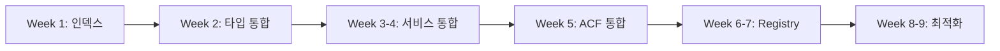

# CPT/ACF 코드 정비 계획서

**작성일:** 2025-11-06
**대상:** o4o-platform CPT/ACF 시스템
**목표:** 단계적 코드 정비를 통한 안정성·성능·유지보수성 향상

---

## 🎯 정비 목표

1. **SSOT(Single Source of Truth) 확립** - 타입 정의 일원화
2. **성능 최적화** - JSONB 인덱싱 및 쿼리 개선
3. **코드 통합** - 중복 제거 및 서비스 레이어 정리
4. **확장성 확보** - 중앙 등록 시스템 구축

---

## 📅 단계별 실행 계획

### Phase 1: 긴급 조치 및 타입 통합 (2주)

#### Week 1: 성능 긴급 조치
```sql
-- 1. JSONB GIN 인덱스 추가 (즉시 실행)
CREATE INDEX CONCURRENTLY idx_post_meta_value_gin
ON post_meta USING gin (meta_value);

-- 2. 복합 인덱스 추가
CREATE INDEX CONCURRENTLY idx_post_meta_post_key
ON post_meta(post_id, meta_key);
```

**작업 항목:**
- [ ] DBA와 인덱스 추가 일정 조율
- [ ] 인덱스 추가 후 쿼리 성능 측정
- [ ] 모니터링 대시보드 설정

#### Week 2: 타입 정의 통합
```typescript
// packages/types/src/cpt/index.ts
export * from './post.types'
export * from './acf.types'
export * from './meta.types'

// 모든 앱에서 import
import { Post, ACFField, PostMeta } from '@o4o/types/cpt'
```

**작업 항목:**
- [ ] packages/types에 통합 타입 정의 생성
- [ ] 각 앱의 로컬 타입을 패키지 참조로 변경
- [ ] 타입 불일치 수정 및 테스트

**예상 변경 파일:** ~50개
**위험도:** 🟡 중간 (컴파일 타임 체크 가능)

---

### Phase 2: 서비스 레이어 통합 (3주)

#### Week 3-4: 레거시 서비스 마이그레이션

```typescript
// 통합 전
post.service.ts (레거시)
post-meta.service.ts (레거시)
unified-post.service.ts (신규)

// 통합 후
cpt.service.ts (통합 서비스)
└── modules/
    ├── post.module.ts
    ├── meta.module.ts
    └── acf.module.ts
```

**마이그레이션 전략:**
1. 신규 통합 서비스에 레거시 메서드 포팅
2. 기존 라우트를 통합 서비스로 점진적 전환
3. Feature flag로 롤백 가능하도록 구성
4. 레거시 서비스 제거

**작업 항목:**
- [ ] 통합 서비스 아키텍처 설계
- [ ] 레거시 메서드 목록화 및 매핑
- [ ] 단위 테스트 작성
- [ ] Feature flag 시스템 구현
- [ ] 점진적 마이그레이션 실행

#### Week 5: ACF 컴포넌트 통합

```typescript
// packages/acf-components/src/index.ts
export { TextField } from './fields/TextField'
export { SelectField } from './fields/SelectField'
export { RepeaterField } from './fields/RepeaterField'
export { DynamicFieldRenderer } from './renderer/DynamicFieldRenderer'
```

**작업 항목:**
- [ ] ACF 컴포넌트 패키지 생성
- [ ] 중복 컴포넌트 통합
- [ ] Storybook 설정 및 문서화
- [ ] Admin Dashboard 마이그레이션

**예상 변경 파일:** ~30개
**위험도:** 🟢 낮음 (UI 컴포넌트, 독립적)

---

### Phase 3: 스키마 시스템 구축 (4주)

#### Week 6-7: 중앙 등록 시스템

```typescript
// packages/cpt-registry/src/registry.ts
class CPTRegistry {
  private schemas: Map<string, CPTSchema> = new Map()

  register(schema: CPTSchema) {
    this.validateSchema(schema)
    this.schemas.set(schema.name, schema)
    this.syncWithDatabase(schema)
  }

  getSchema(name: string): CPTSchema {
    return this.schemas.get(name)
  }
}

// apps/api-server/src/init/cpt.init.ts
import { registry } from '@o4o/cpt-registry'
import * as schemas from '../schemas'

export function initializeCPT() {
  Object.values(schemas).forEach(schema => {
    registry.register(schema)
  })
}
```

**작업 항목:**
- [ ] CPT Registry 패키지 개발
- [ ] 스키마 검증 로직 구현
- [ ] DB 동기화 메커니즘 구축
- [ ] 자동 로드 시스템 구현
- [ ] 마이그레이션 도구 개발

#### Week 8-9: 데이터 구조 최적화

```typescript
// Before: 과도한 중첩
{
  "acf": {
    "fields": {
      "group": {
        "subfield": "value"
      }
    }
  }
}

// After: 평탄화
{
  "acf_group_subfield": "value"
}
```

**작업 항목:**
- [ ] 데이터 구조 평탄화 전략 수립
- [ ] 마이그레이션 스크립트 작성
- [ ] 하위 호환성 레이어 구현
- [ ] 점진적 마이그레이션 실행

**예상 영향:**
- DB 쿼리 성능 30-50% 개선 예상
- 스토리지 사용량 20% 감소 예상

---

## 🚨 위험 관리

### 위험 요소 및 대응 방안

| 위험 요소 | 발생 가능성 | 영향도 | 대응 방안 |
|---------|-----------|--------|----------|
| 타입 변경으로 인한 런타임 에러 | 중 | 높음 | 단계적 마이그레이션, 충분한 테스트 |
| 인덱스 추가 중 DB 락 | 낮음 | 높음 | CONCURRENTLY 옵션, 트래픽 낮은 시간 실행 |
| 레거시 코드 의존성 | 높음 | 중간 | Feature flag, 점진적 전환 |
| 데이터 마이그레이션 실패 | 낮음 | 높음 | 백업, 롤백 계획, 단계적 실행 |

### 롤백 계획

각 Phase별 롤백 전략:
1. **Phase 1**: Git revert, 타입 alias 사용
2. **Phase 2**: Feature flag OFF, 레거시 서비스 유지
3. **Phase 3**: 이전 스키마로 복원, 데이터 백업 활용

---

## 📊 성과 지표

### 정량적 지표
- [ ] JSONB 쿼리 응답시간 50% 단축
- [ ] 코드 중복 70% 감소
- [ ] 타입 에러 0건
- [ ] 빌드 시간 20% 단축

### 정성적 지표
- [ ] 개발자 만족도 향상
- [ ] 신규 CPT 추가 시간 단축
- [ ] 유지보수 복잡도 감소

---

## 🔄 실행 순서 요약



---

## ✅ 실행 체크리스트

### 사전 준비
- [ ] 이해관계자 동의 확보
- [ ] 백업 및 롤백 계획 수립
- [ ] 테스트 환경 준비
- [ ] 모니터링 도구 설정

### Phase 1 (Week 1-2)
- [ ] JSONB 인덱스 추가
- [ ] packages/types 타입 통합
- [ ] 타입 참조 변경
- [ ] 단위 테스트 통과

### Phase 2 (Week 3-5)
- [ ] 서비스 레이어 통합
- [ ] Feature flag 구현
- [ ] ACF 컴포넌트 패키지화
- [ ] 통합 테스트 통과

### Phase 3 (Week 6-9)
- [ ] CPT Registry 구축
- [ ] 스키마 자동 로드
- [ ] 데이터 구조 최적화
- [ ] 성능 테스트 통과

### 완료 후
- [ ] 문서 업데이트
- [ ] 팀 교육 실시
- [ ] 성과 측정 및 보고
- [ ] 레거시 코드 제거

---

## 📝 참고사항

- 각 Phase는 독립적으로 실행 가능하도록 설계
- 우선순위에 따라 Phase 순서 조정 가능
- 정기적인 진행상황 리뷰 권장 (주 1회)
- 예상치 못한 이슈 발생 시 계획 조정 필요

---

## 🎯 최종 목표 상태

정비 완료 후 달성할 구조:

```
packages/
├── @o4o/types          # 모든 타입 정의 (SSOT)
├── @o4o/cpt-registry   # CPT 등록/관리 시스템
├── @o4o/acf-components # 통합 ACF 컴포넌트
└── @o4o/cpt-service    # 통합 서비스 레이어

apps/
├── api-server/
│   └── uses: @o4o/types, @o4o/cpt-service
├── admin-dashboard/
│   └── uses: @o4o/types, @o4o/acf-components
└── main-site/
    └── uses: @o4o/types
```

**기대 효과:**
- 개발 속도 30% 향상
- 버그 발생률 50% 감소
- 신규 기능 추가 시간 40% 단축
- 유지보수 비용 35% 절감

---

*계획 수립: 2025-11-06*
*예상 완료: 2025-02-10 (9주)*