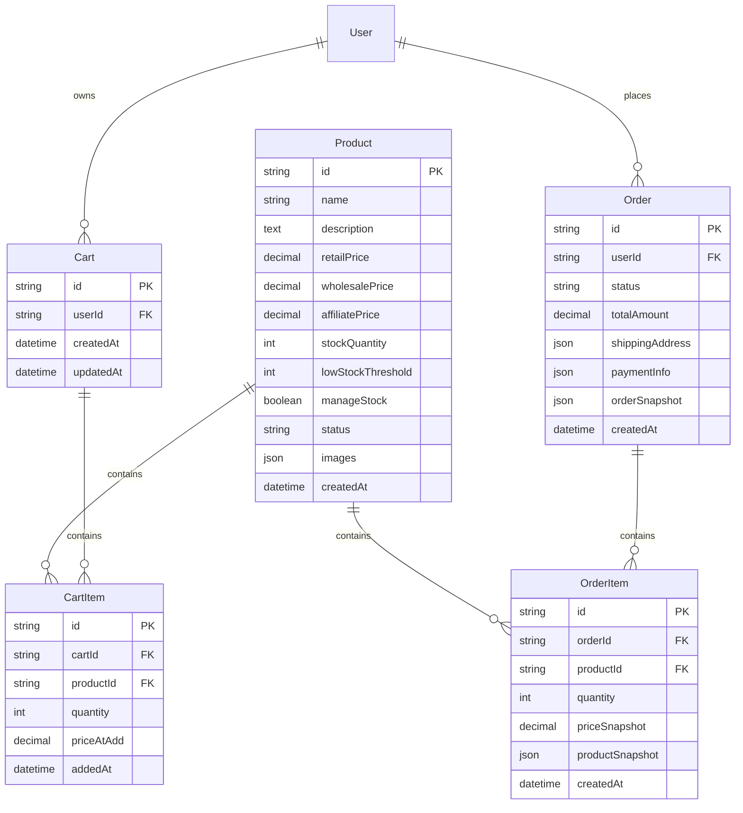

# 🛍️ E-commerce 서비스 기술 문서

> **서비스 이름**: E-commerce (통합 전자상거래)  
> **포트**: 3001 (Web), 3002 (Admin)  
> **상태**: 🟡 부분 구현 (API 완성, UI 개발 중)

---

## 📋 서비스 개요

O4O Platform의 **핵심 비즈니스 로직**을 담당하는 통합 전자상거래 서비스입니다. 전통적인 B2B/B2C 분리 방식 대신 **역할 기반 통합 시스템**으로 모든 고객 유형을 단일 플랫폼에서 처리합니다.

### 🎯 핵심 혁신
- **역할 기반 가격 차별화**: CUSTOMER → BUSINESS → AFFILIATE → ADMIN
- **ACID 트랜잭션**: 모든 주문 프로세스의 원자성 보장
- **실시간 재고 관리**: 동시성 제어로 재고 부족 방지
- **스냅샷 기반 주문**: 가격 변동과 무관한 주문 데이터 무결성

---

## 🏗️ 아키텍처

### 서비스 구조

```
services/ecommerce/
├── admin/                  # 관리자 패널 (React 19)
│   ├── src/
│   │   ├── components/     # 관리자 UI 컴포넌트
│   │   ├── pages/         # 상품/주문/사용자 관리
│   │   └── api.ts         # API 클라이언트
│   └── package.json
├── web/                   # 고객 쇼핑몰 (React 19)
│   ├── src/
│   │   ├── components/    # 쇼핑 UI 컴포넌트
│   │   ├── pages/        # 상품/장바구니/주문 페이지
│   │   └── store/        # Zustand 상태 관리
│   └── package.json
└── README.md
```

### 기술 스택

| 구분 | 기술 | 버전 |
|------|------|------|
| **Frontend** | React + TypeScript | 19.1.0 |
| **Build Tool** | Vite | 6.3.5 |
| **Styling** | TailwindCSS | 4.1.7 |
| **State Management** | Zustand | 최신 |
| **HTTP Client** | Axios | - |
| **Routing** | React Router | 7.6.0 |

---

## 💰 비즈니스 로직

### 역할 기반 가격 시스템

```typescript
// 🎭 사용자 역할 정의
enum UserRole {
  CUSTOMER = 'customer',    // 일반 소매가 (100%)
  BUSINESS = 'business',    // 도매가 (80-90%)
  AFFILIATE = 'affiliate', // 제휴가 (85-95%)
  ADMIN = 'admin'          // 관리자 가격
}

// 💸 동적 가격 계산
class Product {
  retailPrice: number      // 소매가 (기준가)
  wholesalePrice: number   // 도매가 (BUSINESS용)
  affiliatePrice: number   // 제휴가 (AFFILIATE용)
  
  getPriceForUser(userRole: UserRole): number {
    switch (userRole) {
      case 'business':
        return this.wholesalePrice || this.retailPrice
      case 'affiliate':
        return this.affiliatePrice || this.retailPrice
      default:
        return this.retailPrice
    }
  }
}
```

### 주문 프로세스 (ACID Transaction)

```typescript
// 🔒 원자적 주문 처리
async function createOrder(cartItems: CartItem[], userId: string): Promise<Order> {
  const transaction = await database.beginTransaction()
  
  try {
    // 1. 주문 생성
    const order = await Order.create({
      userId,
      status: 'PENDING',
      items: cartItems.map(item => ({
        ...item,
        // 📸 스냅샷: 주문 시점 가격/상품정보 보존
        priceSnapshot: item.product.getPriceForUser(user.role),
        productSnapshot: { ...item.product }
      }))
    })
    
    // 2. 재고 차감
    for (const item of cartItems) {
      await Product.updateStock(item.productId, -item.quantity)
    }
    
    // 3. 장바구니 초기화
    await Cart.clearByUserId(userId)
    
    // 4. 모든 작업 성공 시 커밋
    await transaction.commit()
    return order
    
  } catch (error) {
    // 5. 오류 발생 시 전체 롤백
    await transaction.rollback()
    throw error
  }
}
```

### 재고 관리 시스템

```typescript
// 📦 실시간 재고 추적
interface InventoryManagement {
  // 동시성 제어 (Optimistic Locking)
  async updateStock(productId: string, quantity: number): Promise<void> {
    const product = await Product.findById(productId)
    
    if (product.stockQuantity + quantity < 0) {
      throw new Error('재고 부족')
    }
    
    // 버전 체크로 동시 수정 방지
    await Product.update({
      id: productId,
      stockQuantity: product.stockQuantity + quantity,
      version: product.version + 1
    }, {
      where: { id: productId, version: product.version }
    })
  }
  
  // 재고 부족 알림
  checkLowStock(): Product[] {
    return Product.findAll({
      where: {
        stockQuantity: { $lte: lowStockThreshold },
        manageStock: true
      }
    })
  }
}
```

---

## 🗄️ 데이터 모델

### 핵심 엔티티



### 주요 비즈니스 메서드

```typescript
// 🛒 Cart 엔티티
class Cart {
  getTotalItems(): number
  getTotalPrice(userRole: UserRole): number
  isEmpty(): boolean
  
  // 장바구니 아이템 추가 시 역할별 가격 적용
  async addItem(productId: string, quantity: number, userRole: UserRole): Promise<void>
}

// 📦 Order 엔티티  
class Order {
  canCancel(): boolean
  canRefund(): boolean
  getTotalItems(): number
  
  // 주문 상태 전환 규칙
  async updateStatus(newStatus: OrderStatus): Promise<void>
}

// 🏷️ Product 엔티티
class Product {
  isInStock(): boolean
  isLowStock(): boolean
  getPriceForUser(role: UserRole): number
  
  // 재고 관리
  async reserveStock(quantity: number): Promise<void>
  async releaseStock(quantity: number): Promise<void>
}
```

---

## 🔌 API 엔드포인트

### 인증 및 사용자 관리

```typescript
// 🔐 Authentication
POST   /api/auth/register
POST   /api/auth/login
GET    /api/auth/profile
PUT    /api/auth/profile
POST   /api/auth/logout
```

### 상품 관리

```typescript
// 🏷️ Products (공개 접근)
GET    /api/ecommerce/products                 // 필터링, 페이징, 역할별 가격
GET    /api/ecommerce/products/:id            // 상품 상세 + 사용자별 가격
GET    /api/ecommerce/products/featured       // 추천 상품
GET    /api/ecommerce/products/search?q=      // 검색

// 🏷️ Products (관리자 전용)
POST   /api/ecommerce/products                // 상품 등록
PUT    /api/ecommerce/products/:id           // 상품 수정
DELETE /api/ecommerce/products/:id           // 상품 삭제
PATCH  /api/ecommerce/products/:id/stock     // 재고 조정
```

### 장바구니 관리

```typescript
// 🛒 Cart (인증 필요)
GET    /api/ecommerce/cart                    // 장바구니 조회 + 총액
POST   /api/ecommerce/cart/items              // 아이템 추가
PUT    /api/ecommerce/cart/items/:id          // 수량 변경
DELETE /api/ecommerce/cart/items/:id          // 아이템 삭제
DELETE /api/ecommerce/cart                    // 장바구니 비우기
```

### 주문 관리

```typescript
// 📦 Orders (인증 필요)
GET    /api/ecommerce/orders                  // 주문 내역
GET    /api/ecommerce/orders/:id             // 주문 상세
POST   /api/ecommerce/orders                 // 주문 생성 (트랜잭션)
POST   /api/ecommerce/orders/:id/cancel      // 주문 취소
POST   /api/ecommerce/orders/:id/refund      // 환불 요청 (관리자)

// 📦 Orders (관리자 전용)
GET    /api/ecommerce/admin/orders           // 전체 주문 관리
PATCH  /api/ecommerce/admin/orders/:id       // 주문 상태 변경
```

---

## 🎨 프론트엔드 구조

### Web (고객용 쇼핑몰)

```typescript
// 📄 주요 페이지
pages/
├── Shop.tsx                    // 상품 목록 + 필터링
├── ProductDetail.tsx           // 상품 상세 + 리뷰
├── Cart.tsx                   // 장바구니
├── Checkout.tsx               // 주문/결제
├── Orders.tsx                 // 주문 내역
├── OrderDetail.tsx            // 주문 상세
├── Profile.tsx                // 프로필 관리
└── Login.tsx                  // 로그인/회원가입

// 🧩 핵심 컴포넌트
components/
├── ProductCard.tsx            // 상품 카드 (역할별 가격 표시)
├── Cart.tsx                  // 장바구니 컴포넌트
├── Checkout.tsx              // 체크아웃 폼
├── ProtectedRoute.tsx        // 인증 라우트 보호
└── AuthContext.tsx           // 인증 컨텍스트
```

### Admin (관리자 패널)

```typescript
// 📄 관리자 페이지
pages/
├── AdminDashboard.tsx         // 대시보드 + 통계
├── AdminProductList.tsx       // 상품 목록 관리
├── AdminProductEdit.tsx       // 상품 등록/수정
├── AdminOrders.tsx           // 주문 관리
├── AdminUserList.tsx         // 사용자 관리
└── AdminLogin.tsx            // 관리자 로그인

// 🧩 관리자 컴포넌트
components/
├── AdminAuthContext.tsx      // 관리자 인증
├── AdminProtectedRoute.tsx   // 관리자 권한 확인
├── ProductForm.tsx          // 상품 등록/수정 폼
└── OrderContext.tsx         // 주문 관리 컨텍스트
```

### 상태 관리 (Zustand)

```typescript
// 🏪 상태 스토어들
store/
├── authStore.ts              // 사용자 인증 상태
├── cartStore.ts              // 장바구니 상태
├── adminAuthStore.ts         // 관리자 인증
└── partnerStore.ts           // 제휴 파트너 (Affiliate)

// 💾 authStore 예시
interface AuthStore {
  user: User | null
  role: UserRole
  isAuthenticated: boolean
  
  login: (credentials: LoginCredentials) => Promise<void>
  logout: () => void
  updateProfile: (profile: UserProfile) => Promise<void>
  
  // 역할별 권한 체크
  hasPermission: (action: string) => boolean
}

// 🛒 cartStore 예시
interface CartStore {
  items: CartItem[]
  totalItems: number
  totalPrice: number
  
  addItem: (productId: string, quantity: number) => Promise<void>
  updateQuantity: (itemId: string, quantity: number) => Promise<void>
  removeItem: (itemId: string) => Promise<void>
  clearCart: () => Promise<void>
  
  // 체크아웃
  checkout: (paymentInfo: PaymentInfo) => Promise<Order>
}
```

---

## 🔒 보안 및 인증

### JWT 기반 인증

```typescript
// 🎫 토큰 구조
interface JWTPayload {
  userId: string
  email: string
  role: UserRole
  iat: number      // 발급 시간
  exp: number      // 만료 시간 (7일)
}

// 🛡️ 권한 미들웨어
const authenticateToken = (req: Request, res: Response, next: NextFunction) => {
  const token = req.headers.authorization?.split(' ')[1]
  
  if (!token) {
    return res.status(401).json({ error: 'Access token required' })
  }
  
  try {
    const decoded = jwt.verify(token, JWT_SECRET) as JWTPayload
    req.user = decoded
    next()
  } catch (error) {
    return res.status(403).json({ error: 'Invalid token' })
  }
}

// 🔐 역할 기반 접근 제어
const requireRole = (allowedRoles: UserRole[]) => {
  return (req: Request, res: Response, next: NextFunction) => {
    if (!allowedRoles.includes(req.user.role)) {
      return res.status(403).json({ error: 'Insufficient permissions' })
    }
    next()
  }
}
```

### 데이터 검증

```typescript
// ✅ 입력 검증 (Joi/Yup)
const productSchema = {
  name: Joi.string().min(2).max(100).required(),
  description: Joi.string().max(1000),
  retailPrice: Joi.number().positive().required(),
  wholesalePrice: Joi.number().positive(),
  stockQuantity: Joi.number().integer().min(0),
  categoryId: Joi.string().uuid()
}

// 🔒 SQL Injection 방지 (TypeORM)
// TypeORM의 Query Builder 사용 시 자동으로 파라미터화됨
const products = await Product.createQueryBuilder('product')
  .where('product.name LIKE :name', { name: `%${searchTerm}%` })
  .andWhere('product.price BETWEEN :minPrice AND :maxPrice', {
    minPrice, maxPrice
  })
  .getMany()
```

---

## 📈 성능 최적화

### 데이터베이스 최적화

```sql
-- 🚀 인덱스 설정
CREATE INDEX idx_products_status_category ON products(status, category_id);
CREATE INDEX idx_orders_user_status ON orders(user_id, status);
CREATE INDEX idx_cart_items_cart_id ON cart_items(cart_id);

-- 📊 복합 인덱스 (검색 최적화)
CREATE INDEX idx_products_search ON products 
  USING gin(to_tsvector('korean', name || ' ' || description));
```

### 프론트엔드 최적화

```typescript
// ⚡ React Query로 캐싱
const useProducts = (filters: ProductFilters) => {
  return useQuery({
    queryKey: ['products', filters],
    queryFn: () => fetchProducts(filters),
    staleTime: 5 * 60 * 1000,    // 5분 캐시
    cacheTime: 10 * 60 * 1000    // 10분 메모리 보관
  })
}

// 🖼️ 이미지 최적화
const ProductImage = ({ src, alt }: ImageProps) => (
  
)

// 📦 코드 분할
const AdminPanel = lazy(() => import('./pages/AdminPanel'))
const ProductDetail = lazy(() => import('./pages/ProductDetail'))
```

---

## 🧪 테스트 전략

### 단위 테스트

```typescript
// 🧪 비즈니스 로직 테스트
describe('Product Price Calculation', () => {
  test('should return retail price for customer', () => {
    const product = new Product({
      retailPrice: 10000,
      wholesalePrice: 8000,
      affiliatePrice: 9000
    })
    
    expect(product.getPriceForUser('customer')).toBe(10000)
    expect(product.getPriceForUser('business')).toBe(8000)
    expect(product.getPriceForUser('affiliate')).toBe(9000)
  })
})

// 🔒 인증 테스트
describe('Authentication', () => {
  test('should reject invalid JWT token', async () => {
    const response = await request(app)
      .get('/api/ecommerce/cart')
      .set('Authorization', 'Bearer invalid_token')
    
    expect(response.status).toBe(403)
  })
})
```

### 통합 테스트

```typescript
// 🔄 주문 프로세스 통합 테스트
describe('Order Process', () => {
  test('should create order and update stock atomically', async () => {
    // Given: 사용자와 상품, 장바구니 준비
    const user = await createTestUser({ role: 'customer' })
    const product = await createTestProduct({ stockQuantity: 10 })
    await addToCart(user.id, product.id, 2)
    
    // When: 주문 생성
    const order = await createOrder(user.id)
    
    // Then: 주문 생성 & 재고 감소 확인
    expect(order.status).toBe('PENDING')
    expect(order.items).toHaveLength(1)
    
    const updatedProduct = await Product.findById(product.id)
    expect(updatedProduct.stockQuantity).toBe(8)
    
    const cart = await Cart.findByUserId(user.id)
    expect(cart.items).toHaveLength(0) // 장바구니 비워짐
  })
})
```

---

## 🚀 배포 및 모니터링

### 환경 설정

```env
# 🌍 개발 환경 (.env.development)
NODE_ENV=development
API_URL=http://localhost:4000
DB_HOST=localhost
DB_PORT=5432
JWT_SECRET=dev_secret_key

# 🏭 프로덕션 환경 (.env.production)
NODE_ENV=production
API_URL=https://api.neture.co.kr
DB_HOST=your_production_db_host
JWT_SECRET=your_production_secret
```

### Docker 컨테이너 (선택사항)

```dockerfile
# 🐳 Dockerfile (Web)
FROM node:20-alpine
WORKDIR /app
COPY package*.json ./
RUN npm ci --only=production
COPY . .
RUN npm run build
EXPOSE 3001
CMD ["npm", "run", "preview"]

# 🐳 Dockerfile (Admin)  
FROM node:20-alpine
WORKDIR /app
COPY package*.json ./
RUN npm ci --only=production
COPY . .
RUN npm run build
EXPOSE 3002
CMD ["npm", "run", "preview"]
```

---

## 📊 현재 개발 상태

### ✅ 완료된 기능

- **데이터 모델**: TypeORM 엔티티 완성
- **API 엔드포인트**: RESTful API 20개 이상 구현
- **인증 시스템**: JWT + 역할 기반 인증 완성
- **비즈니스 로직**: 가격 계산, 재고 관리, 주문 처리
- **Admin API**: 346줄의 포괄적 관리자 API 클라이언트

### 🟡 진행 중인 기능

- **Admin UI**: API는 완성되었으나 실제 관리자 인터페이스 구현 중
- **Web UI**: 기본 컴포넌트 존재, 완전한 쇼핑 경험 구현 중
- **결제 연동**: 구조는 완성, 실제 PG사 연동 진행 중

### ❌ 미구현 기능 

- **실시간 알림**: Socket.IO 기반 재고/주문 알림
- **고급 검색**: Elasticsearch 연동
- **추천 시스템**: 개인화 상품 추천
- **리뷰 시스템**: 상품 평점/리뷰 기능

---

## 🎯 개발 로드맵

### Phase 1: 기본 기능 완성 (1-2개월)
- [ ] Admin Dashboard UI 완성
- [ ] Web 쇼핑몰 UI 완성  
- [ ] 결제 게이트웨이 연동
- [ ] 기본 테스트 스위트 완성

### Phase 2: 고급 기능 (2-3개월)
- [ ] 실시간 알림 시스템
- [ ] 고급 검색 및 필터링
- [ ] 상품 리뷰 및 평점 시스템
- [ ] 모바일 반응형 최적화

### Phase 3: 확장 기능 (3-4개월) 
- [ ] 개인화 추천 시스템
- [ ] 다국어 지원 (i18n)
- [ ] PWA (Progressive Web App)
- [ ] 고급 분석 대시보드

---

*📄 이 문서는 O4O Platform E-commerce 서비스의 기술적 세부사항을 포괄적으로 다룹니다.*