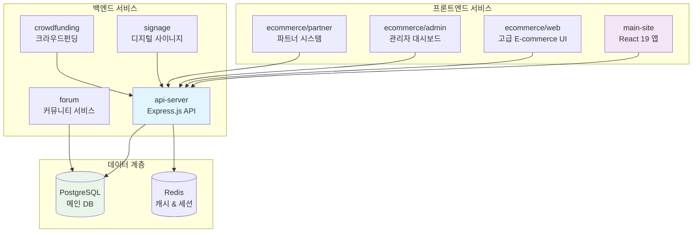
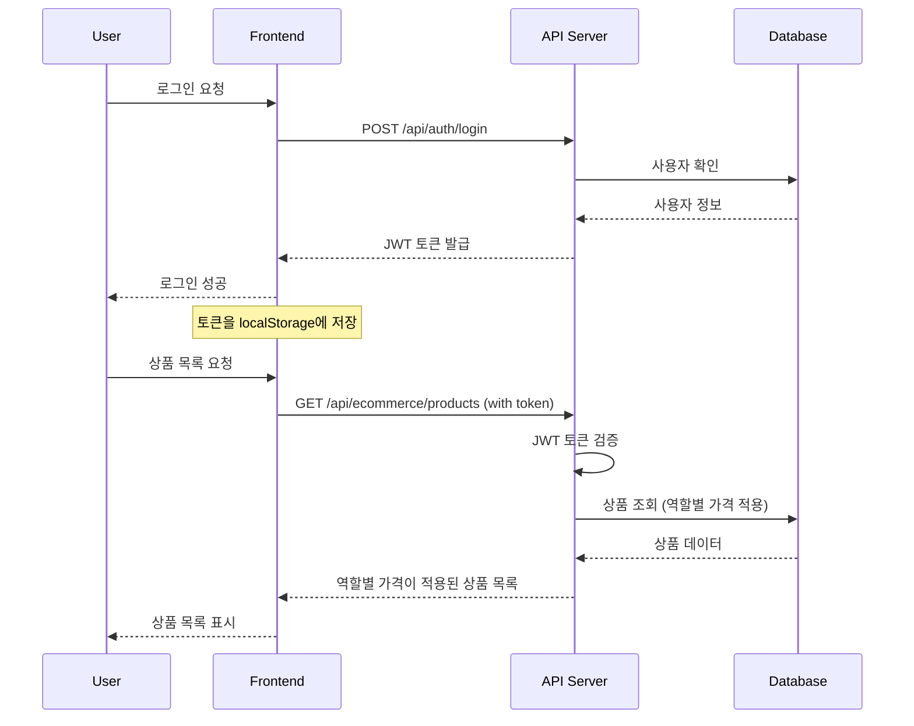
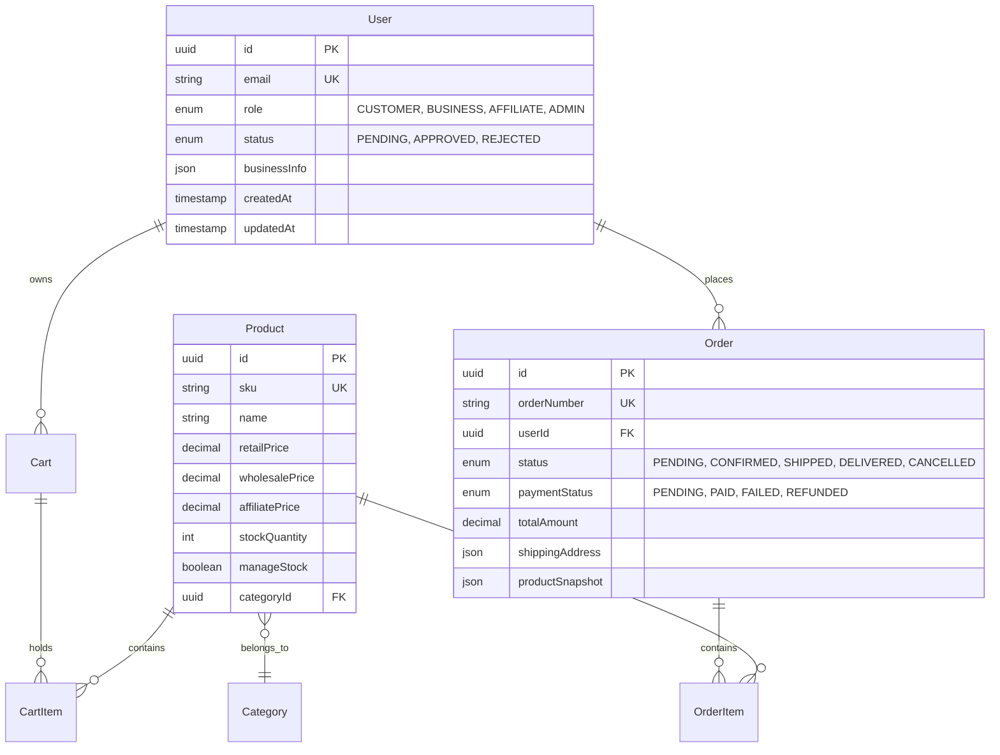

# ⚙️ 서비스 구조

> **마이크로서비스 아키텍처** - 확장 가능한 서비스 분리 설계
> 
> **API 서버** | **프론트엔드** | **전문 서비스** | **독립적 배포**

O4O Platform의 마이크로서비스 구조와 각 서비스 간의 관계를 설명합니다.

---

## 🏗️ **전체 서비스 아키텍처**

### **📊 서비스 맵**


---

## 🔗 **API 서버 (Core Service)**

### **📁 디렉토리 구조**
```
services/api-server/
├── 📁 src/
│   ├── 🎯 main.ts                    # 애플리케이션 진입점
│   ├── 📁 controllers/               # 비즈니스 로직 처리
│   │   ├── AuthController.ts         # 인증/권한
│   │   ├── ProductController.ts      # 상품 관리
│   │   ├── CartController.ts         # 장바구니
│   │   ├── OrderController.ts        # 주문 처리
│   │   └── UserController.ts         # 사용자 관리
│   ├── 📁 entities/                  # TypeORM 엔티티
│   │   ├── User.ts                   # 사용자 엔티티
│   │   ├── Product.ts                # 상품 엔티티
│   │   ├── Order.ts                  # 주문 엔티티
│   │   ├── Cart.ts                   # 장바구니 엔티티
│   │   └── ...                       # 총 9개 엔티티
│   ├── 📁 routes/                    # API 라우팅
│   │   ├── auth.ts                   # /api/auth/*
│   │   ├── ecommerce.ts              # /api/ecommerce/*
│   │   ├── users.ts                  # /api/users/*
│   │   └── index.ts                  # 라우트 통합
│   ├── 📁 middleware/                # 미들웨어
│   │   ├── auth.ts                   # JWT 인증
│   │   ├── validation.ts             # 입력 검증
│   │   ├── cors.ts                   # CORS 설정
│   │   └── errorHandler.ts           # 에러 처리
│   ├── 📁 services/                  # 서비스 계층
│   │   ├── UserService.ts            # 사용자 비즈니스 로직
│   │   ├── ProductService.ts         # 상품 비즈니스 로직
│   │   ├── OrderService.ts           # 주문 비즈니스 로직
│   │   └── EmailService.ts           # 이메일 서비스
│   ├── 📁 database/                  # 데이터베이스 설정
│   │   ├── connection.ts             # TypeORM 연결
│   │   ├── migrations/               # DB 마이그레이션
│   │   └── seeds/                    # 초기 데이터
│   ├── 📁 utils/                     # 유틸리티
│   │   ├── logger.ts                 # 로깅 시스템
│   │   ├── validators.ts             # 검증 함수
│   │   └── helpers.ts                # 헬퍼 함수
│   └── 📁 types/                     # TypeScript 타입
│       ├── auth.ts                   # 인증 관련 타입
│       ├── ecommerce.ts              # E-commerce 타입
│       └── common.ts                 # 공통 타입
├── 📄 package.json                   # 의존성 관리
├── 📄 tsconfig.json                  # TypeScript 설정
├── 📄 .env                           # 환경 변수
└── 📄 README.md                      # 서비스 문서
```

### **🎯 주요 역할**
- **API 게이트웨이**: 모든 클라이언트 요청의 중앙 처리
- **인증 & 권한**: JWT 기반 사용자 인증 및 권한 관리
- **비즈니스 로직**: 핵심 E-commerce 로직 구현
- **데이터 관리**: PostgreSQL과의 ORM 기반 데이터 처리

### **🔌 API 엔드포인트 그룹**
```typescript
// 현재 구현된 API 그룹
const apiGroups = {
  auth: '/api/auth/*',           // 인증 (4개 엔드포인트)
  ecommerce: '/api/ecommerce/*', // E-commerce (14개 엔드포인트)
  users: '/api/users/*',         // 사용자 관리 (구현 예정)
  admin: '/api/admin/*',         // 관리자 API (구현 예정)
  partner: '/api/partner/*'      // 파트너 API (구현 예정)
};
```

---

## 🎨 **메인 사이트 (Primary Frontend)**

### **📁 디렉토리 구조**
```
services/main-site/
├── 📁 src/
│   ├── 🎯 main.tsx                   # React 앱 진입점
│   ├── 🎨 App.tsx                    # 메인 앱 컴포넌트
│   ├── 📁 components/                # 재사용 컴포넌트
│   │   ├── 🧭 layout/                # 레이아웃 컴포넌트
│   │   │   ├── Header.tsx            # 헤더/네비게이션
│   │   │   ├── Footer.tsx            # 푸터
│   │   │   └── Layout.tsx            # 전체 레이아웃
│   │   ├── 🛍️ ecommerce/             # E-commerce UI
│   │   │   ├── ProductCard.tsx       # 상품 카드
│   │   │   ├── CartItem.tsx          # 장바구니 아이템
│   │   │   └── OrderSummary.tsx      # 주문 요약
│   │   ├── 🔐 auth/                  # 인증 컴포넌트
│   │   │   ├── LoginForm.tsx         # 로그인 폼
│   │   │   ├── RegisterForm.tsx      # 회원가입 폼
│   │   │   └── UserProfile.tsx       # 사용자 프로필
│   │   └── 🎛️ ui/                    # 기본 UI 컴포넌트
│   │       ├── Button.tsx            # 버튼
│   │       ├── Input.tsx             # 입력 필드
│   │       └── Modal.tsx             # 모달
│   ├── 📁 pages/                     # 페이지 컴포넌트
│   │   ├── HomePage.tsx              # 홈페이지
│   │   ├── ProductsPage.tsx          # 상품 목록
│   │   ├── ProductDetailPage.tsx     # 상품 상세
│   │   ├── CartPage.tsx              # 장바구니
│   │   └── CheckoutPage.tsx          # 결제
│   ├── 📁 hooks/                     # 커스텀 훅
│   │   ├── useApi.ts                 # API 통신
│   │   ├── useAuth.ts                # 인증 상태
│   │   └── useCart.ts                # 장바구니 상태
│   ├── 📁 services/                  # API 서비스
│   │   ├── api.ts                    # API 클라이언트
│   │   ├── authService.ts            # 인증 API
│   │   ├── productService.ts         # 상품 API
│   │   └── orderService.ts           # 주문 API
│   ├── 📁 types/                     # TypeScript 타입
│   │   ├── api.ts                    # API 응답 타입
│   │   ├── user.ts                   # 사용자 타입
│   │   └── product.ts                # 상품 타입
│   └── 📁 utils/                     # 유틸리티
│       ├── constants.ts              # 상수
│       ├── helpers.ts                # 헬퍼 함수
│       └── formatters.ts             # 포맷터
├── 📄 package.json                   # 의존성 관리
├── 📄 vite.config.ts                 # Vite 설정
├── 📄 tailwind.config.js             # Tailwind CSS
└── 📄 README.md                      # 서비스 문서
```

### **🎯 주요 역할**
- **사용자 인터페이스**: 일반 사용자용 웹 애플리케이션
- **E-commerce UI**: 상품 검색, 장바구니, 주문 인터페이스
- **반응형 디자인**: 모바일/태블릿/데스크톱 지원
- **PWA 준비**: 앱과 같은 사용자 경험

---

## 🛍️ **E-commerce 전문 서비스**

### **🎯 서비스 분리 전략**
```
services/ecommerce/
├── 📁 admin/                         # 관리자 대시보드
├── 📁 partner-system/                # 파트너 관리 시스템
└── 📁 web/                           # 고급 E-commerce 웹
```

#### **📊 Admin Dashboard**
```typescript
// 관리자 전용 기능
const adminFeatures = {
  dashboard: {
    sales: '매출 분석 대시보드',
    inventory: '재고 현황 모니터링',
    users: '사용자 관리',
    orders: '주문 관리 및 처리'
  },
  analytics: {
    reports: '상세 분석 리포트',
    trends: '매출 트렌드 분석',
    conversion: '전환율 추적'
  },
  management: {
    products: '대량 상품 관리',
    categories: '카테고리 계층 관리',
    pricing: '가격 정책 관리'
  }
};
```

#### **🤝 Partner System**
```typescript
// 파트너 관리 기능
const partnerFeatures = {
  dashboard: {
    performance: '파트너 성과 대시보드',
    commission: '수수료 정산 관리',
    orders: '파트너 주문 추적'
  },
  integration: {
    api: 'API 연동 관리',
    webhook: '웹훅 설정',
    sync: '데이터 동기화'
  },
  analytics: {
    sales: '파트너별 매출 분석',
    conversion: '전환 성과 추적',
    roi: 'ROI 계산 및 보고'
  }
};
```

#### **🌐 Advanced Web**
```typescript
// 고급 E-commerce 기능
const advancedFeatures = {
  personalization: {
    recommendations: 'AI 기반 상품 추천',
    customization: '개인화 쇼핑 경험',
    wishlist: '위시리스트 관리'
  },
  social: {
    reviews: '상품 리뷰 시스템',
    sharing: '소셜 미디어 연동',
    community: '커뮤니티 기능'
  },
  advanced: {
    comparison: '상품 비교 기능',
    bundling: '상품 번들링',
    subscription: '구독 서비스'
  }
};
```

---

## 🎪 **추가 서비스들**

### **💬 Forum Service**
```
services/forum/
├── 📁 src/
│   ├── community/      # 커뮤니티 기능
│   ├── posts/          # 게시글 관리
│   ├── comments/       # 댓글 시스템
│   └── moderation/     # 콘텐츠 관리
└── README.md
```

### **📺 Signage Service**
```
services/signage/
├── 📁 src/
│   ├── display/        # 디스플레이 관리
│   ├── content/        # 콘텐츠 관리
│   ├── scheduling/     # 스케줄링
│   └── monitoring/     # 모니터링
└── README.md
```

### **💰 Crowdfunding Service**
```
services/crowdfunding/
├── 📁 src/
│   ├── campaigns/      # 캠페인 관리
│   ├── funding/        # 펀딩 처리
│   ├── rewards/        # 리워드 관리
│   └── analytics/      # 성과 분석
└── README.md
```

---

## 🔄 **서비스 간 통신**

### **📡 API 통신 패턴**
```typescript
// 서비스 간 API 호출 예시
class ServiceCommunication {
  // 메인 사이트 → API 서버
  async getProducts(filters: ProductFilters) {
    return await apiClient.get('/api/ecommerce/products', { params: filters });
  }
  
  // 관리자 → API 서버
  async getAnalytics(period: string) {
    return await adminApiClient.get('/api/admin/analytics', { 
      params: { period },
      headers: { Authorization: `Bearer ${adminToken}` }
    });
  }
  
  // 파트너 시스템 → API 서버
  async getPartnerData(partnerId: string) {
    return await partnerApiClient.get(`/api/partner/${partnerId}/data`);
  }
}
```

### **🔐 인증 플로우**


---

## 📊 **데이터 플로우**

### **🗄️ 데이터베이스 설계**


### **💾 캐싱 전략**
```typescript
// Redis 캐싱 계층
const cacheStrategy = {
  // 자주 조회되는 데이터
  products: {
    key: 'products:list',
    ttl: 3600, // 1시간
    strategy: 'cache-aside'
  },
  
  // 사용자 세션
  sessions: {
    key: 'session:${userId}',
    ttl: 86400, // 24시간
    strategy: 'write-through'
  },
  
  // 장바구니 데이터
  cart: {
    key: 'cart:${userId}',
    ttl: 7200, // 2시간
    strategy: 'write-back'
  }
};
```

---

## 🔧 **배포 및 확장성**

### **🚀 개별 배포 전략**
```yaml
# 서비스별 독립 배포
services:
  api-server:
    image: o4o/api-server:latest
    ports: ["4000:4000"]
    environment:
      - NODE_ENV=production
      - DATABASE_URL=${DATABASE_URL}
    
  main-site:
    image: o4o/main-site:latest
    ports: ["3000:3000"]
    environment:
      - VITE_API_BASE_URL=${API_BASE_URL}
    
  admin-dashboard:
    image: o4o/admin:latest
    ports: ["3001:3000"]
    environment:
      - VITE_API_BASE_URL=${API_BASE_URL}
      - VITE_ADMIN_MODE=true
```

### **📈 확장성 고려사항**
```typescript
// 수평 확장을 위한 설계
const scalabilityPatterns = {
  // 로드 밸런싱
  loadBalancing: {
    type: 'round-robin',
    healthCheck: '/api/health',
    instances: ['api-1', 'api-2', 'api-3']
  },
  
  // 데이터베이스 샤딩
  sharding: {
    strategy: 'user-based',
    shards: ['shard-1', 'shard-2', 'shard-3']
  },
  
  // 캐시 클러스터
  caching: {
    redis: {
      cluster: true,
      nodes: ['redis-1', 'redis-2', 'redis-3']
    }
  }
};
```

---

## 🔗 **관련 문서**

- **🏗️ [전체 아키텍처](overview.md)** - 시스템 전체 설계
- **🗄️ [데이터 모델](data-model.md)** - 데이터베이스 스키마
- **🔗 [API 서버](../../services/api-server/README.md)** - API 서버 상세
- **🎨 [메인 사이트](../../services/main-site/README.md)** - 프론트엔드 상세

---

<div align="center">

**⚙️ 확장 가능한 마이크로서비스 아키텍처! ⚙️**

[🏗️ 아키텍처](overview.md) • [🗄️ 데이터 모델](data-model.md) • [📚 전체 문서](../README.md)

**독립적 배포 • 수평 확장 • 모듈화 설계 ✨**

</div>
