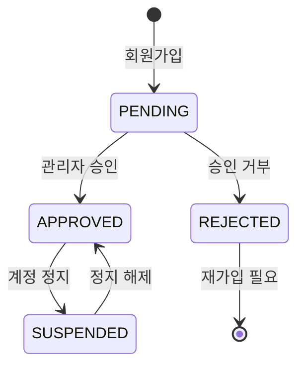
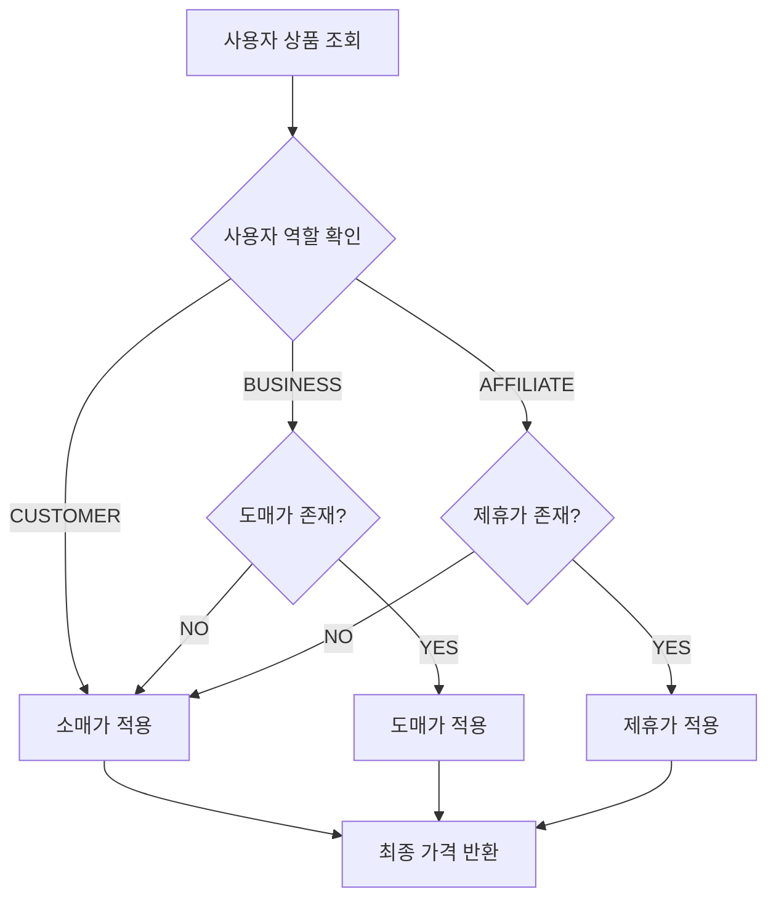
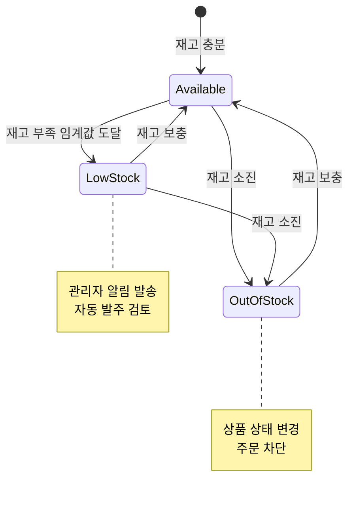
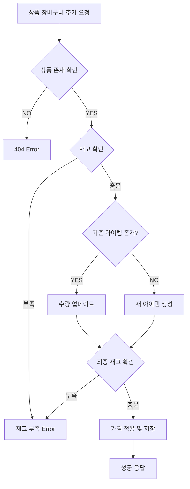
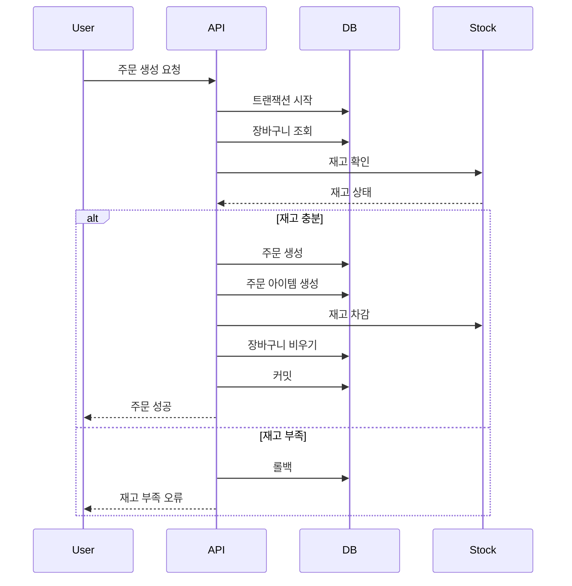
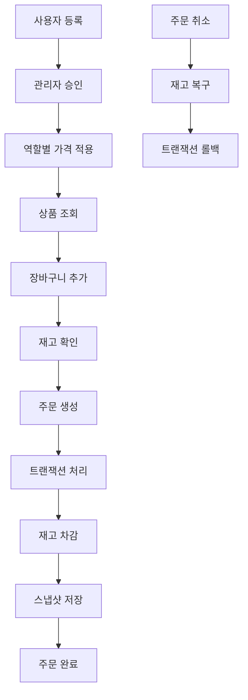

# 💼 O4O Platform - 비즈니스 로직 가이드

> **Phase 1 구현 완료** - 역할별 차등가격, 재고관리, 트랜잭션 처리 완전 구현
> 
> **기준일**: 2025-06-22  
> **상태**: 핵심 비즈니스 로직 100% 구현 완료

---

## 🎯 **개요**

O4O Platform의 비즈니스 로직은 **"복잡성 제거, 단순화"** 철학을 바탕으로 설계되었습니다. B2B/B2C 분리 대신 **역할 기반 통합 시스템**으로 구현되어 있습니다.

### **핵심 비즈니스 규칙**
- **역할별 차등가격**: 사용자 역할에 따른 자동 가격 적용
- **실시간 재고관리**: 주문 시 즉시 재고 차감/복구
- **트랜잭션 보장**: 데이터 무결성 완전 보장
- **스냅샷 시스템**: 주문 시점 데이터 보존

---

## 👥 **사용자 역할 시스템**

### **역할 정의 및 권한**

```typescript
export enum UserRole {
  CUSTOMER = 'customer',      // B2C 고객
  BUSINESS = 'business',      // B2B 고객  
  AFFILIATE = 'affiliate',    // 제휴 파트너
  ADMIN = 'admin',           // 관리자
  MANAGER = 'manager'        // 매니저
}
```

| 역할 | 설명 | 가격 적용 | 특별 권한 |
|------|------|-----------|-----------|
| **CUSTOMER** | 일반 소비자 | 소매가 (`retailPrice`) | 일반 구매만 |
| **BUSINESS** | 사업자/도매업체 | 도매가 (`wholesalePrice`) | 대량 구매 할인 |
| **AFFILIATE** | 제휴 파트너 | 제휴가 (`affiliatePrice`) | 특별 할인가 |
| **ADMIN** | 시스템 관리자 | 모든 가격 확인 가능 | 전체 관리 권한 |
| **MANAGER** | 운영 매니저 | 관리자와 동일 | 제한적 관리 권한 |

### **승인 프로세스**



#### **승인 상태별 동작**

```typescript
export enum UserStatus {
  PENDING = 'pending',      // 승인 대기
  APPROVED = 'approved',    // 승인 완료
  REJECTED = 'rejected',    // 승인 거부
  SUSPENDED = 'suspended'   // 계정 정지
}
```

- **PENDING**: 로그인 불가, 승인 대기 메시지 표시
- **APPROVED**: 정상 서비스 이용 가능
- **REJECTED**: 로그인 불가, 재가입 안내
- **SUSPENDED**: 일시적 서비스 중단

---

## 💰 **역할별 차등가격 시스템**

### **가격 적용 로직**

```typescript
// Product 엔티티의 getPriceForUser 메서드
getPriceForUser(userRole: string): number {
  switch (userRole) {
    case 'business':
      return this.wholesalePrice || this.retailPrice;
    case 'affiliate':
      return this.affiliatePrice || this.retailPrice;
    default:
      return this.retailPrice;
  }
}
```

### **가격 구조**

```typescript
interface ProductPricing {
  retailPrice: number;      // 소매가 (일반 고객)
  wholesalePrice?: number;  // 도매가 (사업자, 20-30% 할인)
  affiliatePrice?: number;  // 제휴가 (제휴사, 10-15% 할인)
  cost?: number;           // 원가 (관리자만 확인)
}
```

### **가격 적용 예시**

| 상품명 | 소매가 | 도매가 | 제휴가 | 할인율 |
|--------|--------|--------|--------|--------|
| 비타민 D | ₩30,000 | ₩24,000 | ₩27,000 | 20% / 10% |
| 프로틴 파우더 | ₩50,000 | ₩40,000 | ₩45,000 | 20% / 10% |
| 건강식품 세트 | ₩100,000 | ₩75,000 | ₩85,000 | 25% / 15% |

### **가격 자동 적용 프로세스**



---

## 📦 **재고 관리 시스템**

### **재고 상태 판정**

```typescript
// Product 엔티티의 재고 관리 메서드들
isInStock(): boolean {
  if (!this.manageStock) return true;
  return this.stockQuantity > 0;
}

isLowStock(): boolean {
  if (!this.manageStock || !this.lowStockThreshold) return false;
  return this.stockQuantity <= this.lowStockThreshold;
}
```

### **재고 설정 옵션**

| 설정 | 타입 | 설명 | 기본값 |
|------|------|------|--------|
| `manageStock` | boolean | 재고 관리 여부 | false |
| `stockQuantity` | number | 현재 재고 수량 | 0 |
| `lowStockThreshold` | number | 부족 재고 기준 | null |

### **재고 처리 시나리오**

#### **1. 장바구니 추가 시**

```typescript
// 재고 확인 로직
if (!product.isInStock()) {
  return res.status(400).json({
    success: false,
    error: 'Product is out of stock'
  });
}

if (product.manageStock && product.stockQuantity < quantity) {
  return res.status(400).json({
    success: false,
    error: `Only ${product.stockQuantity} items available`
  });
}
```

#### **2. 주문 생성 시 (트랜잭션)**

```typescript
// 트랜잭션 내에서 재고 차감
const queryRunner = AppDataSource.createQueryRunner();
await queryRunner.startTransaction();

try {
  // 재고 차감
  if (cartItem.product.manageStock) {
    await queryRunner.manager.update(Product, cartItem.productId, {
      stockQuantity: cartItem.product.stockQuantity - cartItem.quantity
    });
  }
  
  await queryRunner.commitTransaction();
} catch (error) {
  await queryRunner.rollbackTransaction();
  throw error;
}
```

#### **3. 주문 취소 시 (재고 복구)**

```typescript
// 재고 복구 트랜잭션
for (const orderItem of order.items) {
  if (orderItem.product.manageStock) {
    await queryRunner.manager.update(Product, orderItem.productId, {
      stockQuantity: orderItem.product.stockQuantity + orderItem.quantity
    });
  }
}
```

### **재고 상태별 처리**



---

## 🛒 **장바구니 비즈니스 로직**

### **장바구니 계산 메서드**

```typescript
// Cart 엔티티의 계산 메서드들
getTotalItems(): number {
  return this.items?.reduce((total, item) => total + item.quantity, 0) || 0;
}

getTotalPrice(): number {
  return this.items?.reduce((total, item) => total + (item.price * item.quantity), 0) || 0;
}

isEmpty(): boolean {
  return !this.items || this.items.length === 0;
}
```

### **장바구니 추가 프로세스**



### **가격 스냅샷 시스템**

장바구니에 상품 추가 시 **현재 시점의 가격을 저장**하여 가격 변동에 대응합니다:

```typescript
const cartItem = this.cartItemRepository.create({
  cartId: cart.id,
  productId,
  quantity,
  price: priceForUser, // 현재 시점 가격 저장
  productSnapshot: {
    name: product.name,
    image: product.featuredImage || '',
    sku: product.sku
  }
});
```

---

## 📦 **주문 처리 시스템**

### **주문 생성 프로세스**



### **주문 번호 생성 로직**

```typescript
// Order 엔티티의 주문 번호 생성 메서드
generateOrderNumber(): string {
  const date = new Date();
  const year = date.getFullYear().toString().slice(-2);
  const month = (date.getMonth() + 1).toString().padStart(2, '0');
  const day = date.getDate().toString().padStart(2, '0');
  const random = Math.floor(Math.random() * 10000).toString().padStart(4, '0');
  return `ORD${year}${month}${day}${random}`;
}
```

**예시**: `ORD25062201234` (2025년 6월 22일 + 랜덤 4자리)

### **주문 상태 관리**

```typescript
export enum OrderStatus {
  PENDING = 'pending',        // 주문 대기
  CONFIRMED = 'confirmed',    // 주문 확인
  PROCESSING = 'processing',  // 처리 중
  SHIPPED = 'shipped',        // 배송 중
  DELIVERED = 'delivered',    // 배송 완료
  CANCELLED = 'cancelled',    // 주문 취소
  REFUNDED = 'refunded'      // 환불 완료
}
```

### **주문 취소 가능 여부**

```typescript
// Order 엔티티의 취소 가능 여부 확인
canCancel(): boolean {
  return [OrderStatus.PENDING, OrderStatus.CONFIRMED].includes(this.status);
}

canRefund(): boolean {
  return [OrderStatus.DELIVERED].includes(this.status) && 
         this.paymentStatus === PaymentStatus.PAID;
}
```

---

## 📸 **스냅샷 시스템**

### **제품 정보 스냅샷**

주문 시점의 상품 정보를 보존하여 향후 상품 정보 변경에도 주문 내역을 정확히 유지합니다:

```typescript
interface ProductSnapshot {
  name: string;        // 상품명
  sku: string;         // SKU 코드
  image: string;       // 상품 이미지 URL
  description: string; // 상품 설명
}
```

### **스냅샷 생성 시점**

1. **장바구니 추가 시**: 기본 정보 스냅샷
2. **주문 생성 시**: 상세 정보 스냅샷
3. **결제 완료 시**: 최종 정보 고정

---

## 🔄 **트랜잭션 관리**

### **ACID 원칙 적용**

- **Atomicity**: 모든 작업이 성공하거나 모두 실패
- **Consistency**: 데이터 무결성 보장
- **Isolation**: 동시 트랜잭션 간섭 방지
- **Durability**: 커밋된 데이터 영구 보존

### **트랜잭션 적용 시나리오**

#### **1. 주문 생성 트랜잭션**

```typescript
const queryRunner = AppDataSource.createQueryRunner();
await queryRunner.connect();
await queryRunner.startTransaction();

try {
  // 1. 주문 생성
  const savedOrder = await queryRunner.manager.save(order);
  
  // 2. 주문 아이템 생성
  for (const cartItem of cart.items) {
    const orderItem = new OrderItem();
    // ... 아이템 설정
    await queryRunner.manager.save(orderItem);
    
    // 3. 재고 차감
    if (cartItem.product.manageStock) {
      await queryRunner.manager.update(Product, cartItem.productId, {
        stockQuantity: cartItem.product.stockQuantity - cartItem.quantity
      });
    }
  }
  
  // 4. 장바구니 비우기
  await queryRunner.manager.remove(cart.items);
  
  await queryRunner.commitTransaction();
} catch (error) {
  await queryRunner.rollbackTransaction();
  throw error;
} finally {
  await queryRunner.release();
}
```

#### **2. 주문 취소 트랜잭션**

```typescript
try {
  // 재고 복구
  for (const orderItem of order.items) {
    if (orderItem.product.manageStock) {
      await queryRunner.manager.update(Product, orderItem.productId, {
        stockQuantity: orderItem.product.stockQuantity + orderItem.quantity
      });
    }
  }
  
  // 주문 상태 변경
  await queryRunner.manager.update(Order, id, {
    status: OrderStatus.CANCELLED
  });
  
  await queryRunner.commitTransaction();
} catch (error) {
  await queryRunner.rollbackTransaction();
  throw error;
}
```

---

## 🎯 **비즈니스 규칙 검증**

### **상품 생성 규칙**

```typescript
// 가격 유효성 검증
if (retailPrice <= 0) {
  throw new Error('소매가는 0보다 커야 합니다');
}

if (wholesalePrice && wholesalePrice >= retailPrice) {
  throw new Error('도매가는 소매가보다 낮아야 합니다');
}

// SKU 중복 확인
const existingProduct = await productRepository.findOne({
  where: { sku: productData.sku }
});

if (existingProduct) {
  throw new Error('이미 존재하는 SKU입니다');
}
```

### **주문 생성 규칙**

```typescript
// 장바구니 유효성 검증
if (cart.isEmpty()) {
  throw new Error('장바구니가 비어있습니다');
}

// 사용자 상태 확인
if (user.status !== UserStatus.APPROVED) {
  throw new Error('승인된 사용자만 주문할 수 있습니다');
}

// 배송 주소 필수 확인
if (!shippingAddress) {
  throw new Error('배송 주소는 필수입니다');
}
```

---

## 📊 **성능 최적화 로직**

### **재고 확인 최적화**

```typescript
// 대량 재고 확인 시 한 번에 처리
const productIds = cartItems.map(item => item.productId);
const products = await productRepository.find({
  where: { id: In(productIds) },
  select: ['id', 'stockQuantity', 'manageStock']
});

// Map으로 빠른 조회
const productMap = new Map(products.map(p => [p.id, p]));
```

### **가격 계산 캐싱**

```typescript
// 사용자별 가격 캐시 (메모리 캐시)
const priceCache = new Map<string, number>();
const cacheKey = `${productId}-${userRole}`;

if (priceCache.has(cacheKey)) {
  return priceCache.get(cacheKey);
}

const price = product.getPriceForUser(userRole);
priceCache.set(cacheKey, price);
return price;
```

---

## 🔍 **비즈니스 로직 테스트**

### **단위 테스트 예시**

```typescript
describe('Product Pricing Logic', () => {
  it('should return retail price for customer', () => {
    const product = new Product();
    product.retailPrice = 10000;
    product.wholesalePrice = 8000;
    
    expect(product.getPriceForUser('customer')).toBe(10000);
  });
  
  it('should return wholesale price for business', () => {
    const product = new Product();
    product.retailPrice = 10000;
    product.wholesalePrice = 8000;
    
    expect(product.getPriceForUser('business')).toBe(8000);
  });
});
```

---

## 🎪 **고급 비즈니스 시나리오**

### **동시 주문 처리**

```typescript
// 동시성 제어를 위한 비관적 락
const product = await productRepository.findOne({
  where: { id: productId },
  lock: { mode: 'pessimistic_write' }
});

if (product.stockQuantity < quantity) {
  throw new Error('재고 부족');
}

product.stockQuantity -= quantity;
await productRepository.save(product);
```

### **대량 주문 처리**

```typescript
// 배치 처리로 성능 최적화
const orderItems = cartItems.map(item => ({
  orderId: order.id,
  productId: item.productId,
  quantity: item.quantity,
  unitPrice: item.price,
  totalPrice: item.price * item.quantity
}));

await orderItemRepository.insert(orderItems);
```

---

## 🔗 **통합 워크플로우**



---

**📅 최종 업데이트**: 2025-06-22  
**🏆 구현 상태**: Phase 1 완료 (100%)  
**🔗 관련 문서**: [API 명세서](ecommerce-api-specification.md), [데이터베이스 스키마](database-schema.md)
