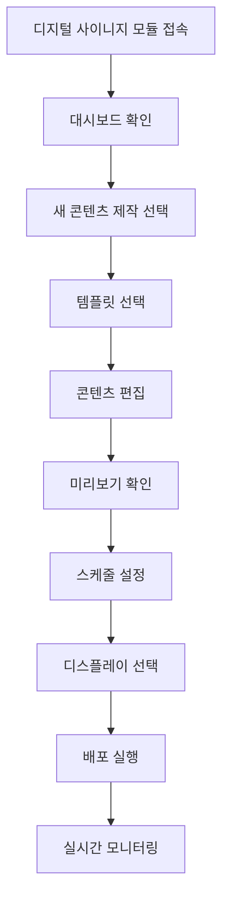

# 디지털 사이니지 모듈 UI/UX 설계 가이드

## 📋 모듈 개요

o4o-platform의 **디지털 사이니지 모듈**은 비즈니스 환경에서 동적 콘텐츠를 관리하고 배포하는 통합 솔루션입니다. 드랍쉬핑 제품 프로모션부터 일반적인 정보 전달까지, 사용자가 쉽게 콘텐츠를 제작하고 스케줄링할 수 있는 직관적인 환경을 제공합니다.

### 핵심 가치 제안
- **"드래그 앤 드롭으로 5분 안에 전문가급 디스플레이"**
- **실시간 원격 관리로 언제 어디서나 콘텐츠 업데이트**
- **o4o 플랫폼 연동으로 제품/펀딩 정보 자동 디스플레이**

---

## 🎯 사용자 페르소나

### **주요 페르소나: 스마트 매장 운영자 "이매니저" (35세, 매장 관리자)**

**배경:**
- 중소형 매장/사무실 여러 곳 운영
- 기술에 친숙하지만 디자인 전문가는 아님
- 효율적인 고객 소통과 매출 증대가 목표

**Goals:**
- 고객 대기시간 동안 효과적인 정보 전달
- 프로모션 정보 실시간 업데이트
- 여러 지점 콘텐츠 중앙 관리
- 브랜드 일관성 유지

**Pain Points:**
- 복잡한 디지털 사이니지 솔루션
- 높은 콘텐츠 제작 비용
- 실시간 업데이트의 어려움
- 기술적 장애 대응

**Success Metrics:**
- 콘텐츠 제작 시간 80% 단축
- 고객 정보 인지도 60% 향상
- 매장별 맞춤 콘텐츠 자동화 90%

---

## 🚀 핵심 사용자 플로우

### **주요 Happy Path: 콘텐츠 제작부터 배포까지**



#### **세부 단계별 UI 요구사항:**

**1단계: 통합 대시보드**
```
┌─ 활성 디스플레이 현황 ─┬─ 오늘의 스케줄 ─┐
│ 총 8개 / 정상 7개     │ 09:00 프로모션A │
│ 오프라인: 1개 (알림)   │ 12:00 점심메뉴  │
└─────────────────────┴───────────────┘

┌─ 빠른 액션 ─────────────────────────┐
│ [새 콘텐츠] [템플릿] [스케줄] [설정] │
└───────────────────────────────────┘

┌─ 실시간 통계 ─┬─ 최근 활동 ─────────┐
│ 오늘 조회: 1.2K│ 5분 전: 매장A 업데이트│
│ 클릭: 89      │ 1시간 전: 새 콘텐츠  │
└──────────────┴──────────────────────┘
```

**2단계: 템플릿 갤러리**
```
┌─── 카테고리 필터 ───┐
│ 전체 │ 프로모션     │
│ 메뉴 │ 공지사항     │
│ 이벤트│ 브랜딩      │
└──────────────────┘

┌─ 프로모션 │ 메뉴보드 │ 이벤트 ─┐
│  [템플릿1] │ [템플릿2] │ [템플릿3] │
│  [템플릿4] │ [템플릿5] │ [템플릿6] │
└─ [사용자정의 템플릿] ──────────┘
```

**3단계: 드래그 앤 드롭 에디터**
```
┌─ 툴바 ──────────────────────────────┐
│ [텍스트] [이미지] [도형] [차트] [QR] │
└────────────────────────────────────┘

┌─ 레이어 ─┐ ┌─ 캔버스 ─┐ ┌─ 속성 ─┐
│ 배경      │ │          │ │ 폰트:   │
│ 제목 텍스트│ │   편집   │ │ 크기:   │
│ 가격      │ │   영역   │ │ 색상:   │
│ 로고      │ │          │ │ 효과:   │
└──────────┘ └──────────┘ └────────┘
```

---

## 🎨 비주얼 디자인 시스템

### **컬러 팔레트**

#### **메인 브랜드 컬러**
```css
--signage-primary: #1E293B;     /* 프로페셔널 다크 */
--signage-secondary: #475569;   /* 미디엄 그레이 */
--signage-accent: #3B82F6;      /* 액션 블루 */
--signage-success: #10B981;     /* 온라인 상태 */
--signage-warning: #F59E0B;     /* 주의사항 */
--signage-error: #EF4444;       /* 오프라인/오류 */
```

#### **콘텐츠 템플릿 컬러**
```css
--template-primary: #000000;    /* 고대비 텍스트 */
--template-secondary: #FFFFFF;  /* 배경/반전 텍스트 */
--template-accent: #FF6B35;     /* 강조 포인트 */
--template-muted: #6B7280;      /* 보조 정보 */
```

### **타이포그래피 (디스플레이 최적화)**

#### **원거리 가독성 중심**
```css
/* 디지털 사이니지 전용 폰트 스케일 */
.display-hero {
  font-size: 4rem;      /* 64px - 메인 헤딩 */
  font-weight: 800;
  line-height: 1.1;
}

.display-title {
  font-size: 2.5rem;    /* 40px - 서브 헤딩 */
  font-weight: 700;
  line-height: 1.2;
}

.display-body {
  font-size: 1.5rem;    /* 24px - 본문 */
  font-weight: 500;
  line-height: 1.4;
}

.display-caption {
  font-size: 1.125rem;  /* 18px - 캡션 */
  font-weight: 400;
  line-height: 1.3;
}
```

---

## 🧩 핵심 컴포넌트 설계

### **1. ContentEditor 컴포넌트**

#### **기능 요구사항:**
- 드래그 앤 드롭 인터페이스
- 실시간 미리보기
- 레이어 관리 시스템
- 다양한 미디어 타입 지원
- 템플릿 기반 빠른 편집

#### **UI 구조:**
```jsx
<ContentEditor>
  <Toolbar>
    <TextTool />
    <ImageTool />
    <ShapeTool />
    <ChartTool />
    <QRCodeTool />
    <UndoRedoControls />
  </Toolbar>
  
  <EditorLayout>
    <LayerPanel>
      <LayerList />
      <LayerControls />
    </LayerPanel>
    
    <Canvas>
      <EditableContent />
      <GridOverlay />
      <SelectionHandles />
    </Canvas>
    
    <PropertyPanel>
      <StyleControls />
      <AnimationControls />
      <TimingControls />
    </PropertyPanel>
  </EditorLayout>
  
  <PreviewBar>
    <DevicePreview />
    <PlayButton />
    <TimelineControl />
  </PreviewBar>
</ContentEditor>
```

### **2. SchedulingSystem 컴포넌트**

#### **캘린더 기반 스케줄링:**
```
┌─ 2024년 6월 ─────────────────────┐
│ 월  화  수  목  금  토  일         │
│ 1   2   3   4   5   6   7        │
│         [A] [B] [A]             │
│ 8   9   10  11  12  13  14       │
│ [C] [A] [D] [B] [A] [휴무]       │
└─────────────────────────────────┘

┌─ 시간별 상세 스케줄 (6월 5일) ─────┐
│ 09:00-12:00 │ 모닝 프로모션 (A)   │
│ 12:00-14:00 │ 점심 메뉴 (B)      │
│ 14:00-17:00 │ 오후 이벤트 (C)    │
│ 17:00-21:00 │ 저녁 프로모션 (A)   │
└─────────────────────────────────┘
```

#### **UI 구조:**
```jsx
<SchedulingSystem>
  <CalendarView>
    <MonthSelector />
    <WeekView />
    <DaySlots />
  </CalendarView>
  
  <TimelineEditor>
    <TimeSlotGrid />
    <ContentAssignment />
    <ConflictResolution />
  </TimelineEditor>
  
  <ScheduleActions>
    <QuickSchedule />
    <BulkActions />
    <TemplateSchedule />
  </ScheduleActions>
</SchedulingSystem>
```

### **3. DisplayManager 컴포넌트**

#### **디스플레이 상태 모니터링:**
```
┌─ 매장 A (강남점) ──────────────┐
│ 상태: 🟢 온라인               │
│ 현재 콘텐츠: 여름 프로모션     │
│ 남은 시간: 1시간 23분         │
│ 마지막 업데이트: 5분 전       │
│ [즉시 변경] [스케줄 수정]     │
└─────────────────────────────┘

┌─ 매장 B (홍대점) ──────────────┐
│ 상태: 🔴 오프라인             │
│ 마지막 연결: 30분 전          │
│ 문제: 네트워크 연결 오류       │
│ [문제 해결] [기술 지원]       │
└─────────────────────────────┘
```

---

## 📱 반응형 디자인 전략

### **Desktop First Approach** 
디지털 사이니지는 주로 관리자가 데스크톱에서 복잡한 콘텐츠를 제작하므로, 데스크톱 우선 설계

#### **Desktop (1024px+) - 주요 타겟**
```css
.editor-layout {
  display: grid;
  grid-template-columns: 200px 1fr 300px;
  grid-template-rows: 60px 1fr 80px;
  gap: 1rem;
  height: 100vh;
}

.toolbar { grid-area: 1 / 1 / 2 / 4; }
.layer-panel { grid-area: 2 / 1 / 3 / 2; }
.canvas { grid-area: 2 / 2 / 3 / 3; }
.property-panel { grid-area: 2 / 3 / 3 / 4; }
.preview-bar { grid-area: 3 / 1 / 4 / 4; }
```

#### **Tablet (768-1024px)**
```css
.editor-layout {
  grid-template-columns: 180px 1fr 250px;
}

.layer-panel, .property-panel {
  /* 축소된 사이드 패널 */
  font-size: 0.875rem;
}
```

#### **Mobile (320-768px) - 모니터링 중심**
```css
.mobile-dashboard {
  /* 콘텐츠 제작보다는 모니터링과 간단한 수정에 집중 */
  display: flex;
  flex-direction: column;
}

.quick-actions {
  position: sticky;
  bottom: 0;
  background: white;
  padding: 1rem;
  border-top: 1px solid #e5e7eb;
}
```

---

## 🔧 고급 기능 및 최적화

### **실시간 협업 시스템**

#### **멀티 유저 편집:**
```javascript
// 실시간 협업 상태 관리
const collaborationState = {
  activeUsers: [
    { id: 'user1', name: '김매니저', cursor: { x: 100, y: 150 }, color: '#3B82F6' },
    { id: 'user2', name: '이디자이너', selection: 'text-layer-1', color: '#10B981' }
  ],
  locks: {
    'text-layer-1': 'user2',
    'image-layer-2': null
  }
};
```

#### **UI 표현:**
```
┌─ 현재 편집 중인 사용자 ─────────┐
│ 👤 김매니저 (나)             │
│ 👤 이디자이너 🟢 (텍스트 편집중)│
└─────────────────────────────┘
```

### **AI 기반 콘텐츠 최적화**

#### **스마트 제안 시스템:**
```javascript
const aiSuggestions = {
  contentOptimization: {
    readability: '글자 크기를 20% 키우는 것을 권장합니다',
    contrast: '배경 대비를 개선하여 가독성을 높이세요',
    layout: '이미지를 왼쪽으로 이동하면 시선 흐름이 개선됩니다'
  },
  autoGeneration: {
    productPromo: 'o4o 드랍쉬핑 베스트셀러 자동 배너 생성',
    weatherAdaptive: '날씨에 따른 제품 추천 콘텐츠',
    timeBasedContent: '시간대별 맞춤 메시지'
  }
};
```

### **성능 최적화**

#### **콘텐츠 전송 최적화:**
```javascript
const performanceOptimization = {
  contentDelivery: {
    compression: 'WebP, AVIF 이미지 포맷',
    caching: 'CDN 기반 글로벌 캐싱',
    streaming: '대용량 비디오 스트리밍',
    preloading: '다음 콘텐츠 사전 로딩'
  },
  editorPerformance: {
    virtualCanvas: '대형 캔버스 가상화',
    layerOptimization: '레이어 렌더링 최적화',
    undoRedo: '효율적인 히스토리 관리',
    autoSave: '자동 저장 및 복구'
  }
};
```

---

## 🔗 다른 모듈과의 연계

### **드랍쉬핑 모듈 연계**

#### **자동 상품 프로모션:**
```
┌─ 연계 설정 ─────────────────────┐
│ ✅ 신제품 출시 시 자동 배너 생성  │
│ ✅ 베스트셀러 상품 실시간 표시   │
│ ✅ 재고 부족 시 대체 상품 표시   │
│ ✅ 할인 이벤트 자동 업데이트     │
└───────────────────────────────┘

[자동 생성된 배너 예시]
┌─────────────────────────────────┐
│        🏆 이달의 베스트         │
│     ○○○ 건강기능식품          │
│      정가 45,000원 → 30% 할인   │
│        지금 주문하세요!        │
└─────────────────────────────────┘
```

### **크라우드펀딩 모듈 연계**

#### **펀딩 현황 실시간 표시:**
```
┌─ 펀딩 현황 위젯 ─────────────────┐
│ 프로젝트: 스마트 워치 2.0       │
│ 달성률: ████████░░ 85%         │
│ 남은 시간: 7일                 │
│ 후원자: 1,234명                │
│ [지금 후원하기] QR코드          │
└───────────────────────────────┘
```

### **포럼 모듈 연계**

#### **커뮤니티 콘텐츠 활용:**
```
┌─ 고객 후기 스크롤 ───────────────┐
│ "정말 만족합니다!" - 김○○님     │
│ "배송이 빨라요" - 이○○님        │
│ "품질이 좋네요" - 박○○님        │
└───────────────────────────────┘
```

---

## 📊 성공 지표 및 측정

### **운영 효율성 KPI**

#### **콘텐츠 제작 효율성:**
- **Creation Time**: 콘텐츠 제작 시간 < 15분
- **Template Usage**: 템플릿 활용률 > 80%
- **Revision Count**: 평균 수정 횟수 < 3회
- **Approval Time**: 승인 프로세스 < 24시간

#### **시스템 안정성:**
- **Uptime**: 서비스 가동률 > 99.5%
- **Content Sync**: 콘텐츠 동기화 성공률 > 99%
- **Load Time**: 콘텐츠 로딩 시간 < 3초
- **Error Rate**: 오류 발생률 < 1%

### **비즈니스 임팩트 KPI**

#### **마케팅 효과성:**
- **Engagement Rate**: 디스플레이 상호작용률 > 5%
- **Conversion Rate**: QR코드 스캔율 > 8%
- **Brand Recall**: 브랜드 인지도 향상 > 25%
- **ROI**: 투자 대비 수익률 > 300%

### **데이터 수집 및 분석**

```javascript
// 실시간 분석 데이터
const analyticsData = {
  contentPerformance: {
    viewCount: '실시간 조회수',
    engagement: '상호작용 수',
    dwellTime: '평균 체류 시간',
    conversion: '전환율 추적'
  },
  systemMetrics: {
    uptime: '시스템 가동률',
    syncStatus: '동기화 상태',
    errorLogs: '오류 로그',
    performance: '성능 지표'
  },
  userBehavior: {
    creationPatterns: '콘텐츠 제작 패턴',
    templateUsage: '템플릿 사용 현황',
    featureAdoption: '기능 채택률',
    supportRequests: '지원 요청 현황'
  }
};
```

---

## 🎯 개발 로드맵

### **Phase 1: 기본 기능 (6주)**
1. **콘텐츠 에디터** - 기본 텍스트/이미지 편집
2. **템플릿 시스템** - 사전 제작 템플릿 20개
3. **스케줄링** - 기본 날짜/시간 설정
4. **디스플레이 관리** - 단일 화면 관리

### **Phase 2: 고급 기능 (8주)**
1. **드래그 앤 드롭 에디터** - 고급 편집 도구
2. **실시간 모니터링** - 상태 대시보드
3. **멀티 디스플레이** - 여러 화면 동시 관리
4. **자동화 기능** - 조건부 콘텐츠 전환

### **Phase 3: 통합 및 최적화 (4주)**
1. **o4o 플랫폼 연동** - 드랍쉬핑/펀딩 연계
2. **AI 기능** - 스마트 콘텐츠 제안
3. **성능 최적화** - 대용량 콘텐츠 처리
4. **모바일 앱** - 원격 모니터링 앱

---

*이 가이드는 o4o-platform 디지털 사이니지 모듈이 사용자에게 직관적이고 강력한 콘텐츠 관리 솔루션을 제공하기 위한 상세 설계 문서입니다.*
