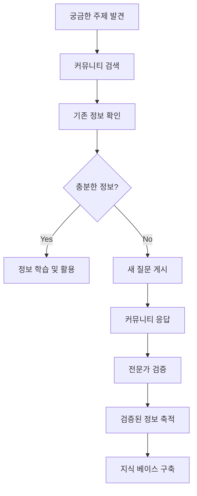
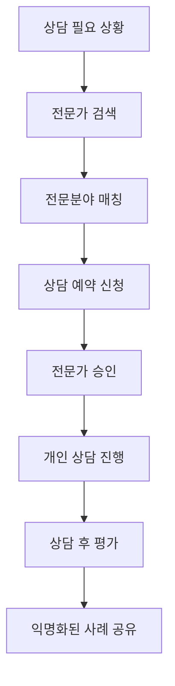

# 포럼 모듈 UI/UX 설계 가이드

## 📋 모듈 개요

o4o-platform의 **포럼 모듈**은 정보 중심 제품의 특성에 맞춰 **지식 공유와 전문가 상담**을 중심으로 한 커뮤니티 플랫폼입니다. 단순한 게시판을 넘어 공급자, 판매자, 구매자, 전문가가 모두 참여하는 **신뢰도 기반 정보 생태계**를 구축합니다.

### 핵심 가치 제안
- **"정보가 지식이 되고, 지식이 신뢰가 되는 공간"**
- **전문가 검증 정보와 실사용자 경험의 균형**
- **타겟 마케팅 연동으로 개인화된 정보 제공**

### 정보 생태계 모델
```
전문가 → 검증된 정보 → 커뮤니티 학습 → 신뢰도 향상
  ↓         ↓            ↓            ↓
공급자 → 제품 정보 → 판매자 교육 → 고객 만족
  ↓         ↓            ↓            ↓
사용자 → 실사용 후기 → 개선 피드백 → 제품 발전
```

---

## 🎯 사용자 페르소나

### **주요 페르소나 1: 전문가 멘토 "닥터김" (48세, 의사)**

**배경:**
- 가정의학과 전문의 20년 경력
- 건강 정보의 정확성에 대한 사명감
- 온라인 건강 정보 확산에 관심
- 환자 교육 및 상담 경험 풍부

**Goals:**
- 올바른 건강 정보 확산
- 잘못된 정보 교정 및 검증
- 의료진으로서의 사회적 책임 실현
- 환자들의 건강 의식 향상

**Pain Points:**
- 너무 많은 잘못된 건강 정보
- 시간 부족으로 인한 제한적 참여
- 의료진 책임과 자유로운 소통의 균형

### **주요 페르소나 2: 정보 탐구자 "이러너" (35세, 직장인)**

**배경:**
- 건강에 관심 많은 직장인
- 가족 건강 관리 책임감
- 정보 검색 및 비교 분석 선호
- 커뮤니티 활동을 통한 학습 추구

**Goals:**
- 신뢰할 수 있는 건강 정보 획득
- 제품 구매 전 충분한 검증
- 비슷한 관심사를 가진 사람들과 교류
- 전문가로부터 직접 조언 받기

**Pain Points:**
- 정보의 신뢰성 판단 어려움
- 개인 상황에 맞는 맞춤 정보 부족
- 전문가와의 직접 소통 기회 제한

---

## 🚀 핵심 사용자 플로우

### **정보 검증 및 공유 플로우**



### **전문가 상담 플로우**



---

## 🧩 핵심 컴포넌트 설계

### **1. KnowledgeHub 컴포넌트 (지식 허브)**

#### **체계적 정보 분류 및 검색:**
```
┌─ 지식 카테고리 ─────────────────────────┐
│                                       │
│ 🏥 의료/건강 (1,245개 토픽)            │
│ ├─ 내과 질환 (432)                    │
│ ├─ 영양/보충제 (298)                   │
│ ├─ 운동/피트니스 (187)                 │
│ └─ 정신건강 (128)                     │
│                                       │
│ 💄 뷰티/화장품 (892개 토픽)             │
│ ├─ 스킨케어 (341)                     │
│ ├─ 메이크업 (267)                     │
│ ├─ 헤어케어 (198)                     │
│ └─ 향수/바디케어 (86)                  │
│                                       │
│ 🔬 과학/기술 (567개 토픽)              │
│ ├─ 생명과학 (234)                     │
│ ├─ 화학/성분 (189)                    │
│ ├─ 기술혁신 (144)                     │
│                                       │
│ [전체 검색] [인기 토픽] [전문가 추천]    │
└─────────────────────────────────────┘
```

#### **UI 구조:**
```jsx
<KnowledgeHub>
  <CategoryNavigation>
    <MainCategories />
    <SubCategories />
    <TagCloud />
  </CategoryNavigation>
  
  <SearchInterface>
    <SmartSearch />
    <FilterOptions />
    <SortControls />
    <SavedSearches />
  </SearchInterface>
  
  <ContentDisplay>
    <TopicList />
    <FeaturedContent />
    <TrendingTopics />
    <ExpertPicks />
  </ContentDisplay>
  
  <PersonalizationEngine>
    <InterestProfile />
    <RecommendationEngine />
    <LearningPath />
    <ProgressTracker />
  </PersonalizationEngine>
</KnowledgeHub>
```

### **2. ExpertConsultationSystem 컴포넌트 (전문가 상담 시스템)**

#### **전문가 매칭 및 상담 관리:**
```
┌─ 전문가 프로필 ─────────────────────────┐
│                                       │
│ 👨‍⚕️ 김○○ 의사                         │
│ 전문분야: 가정의학과, 영양학               │
│ 경력: 15년 | 평점: ⭐⭐⭐⭐⭐ (4.9/5)    │
│ 상담 완료: 1,247건 | 만족도: 98%        │
│                                       │
│ 📋 전문 영역                           │
│ • 건강기능식품 효과 검증                │
│ • 개인별 영양 상담                     │
│ • 만성질환 관리 조언                   │
│ • 의료기기 사용법 안내                 │
│                                       │
│ 💬 최근 상담 주제                      │
│ • "비타민D 보충제 복용법"               │
│ • "당뇨 환자 영양제 선택"               │
│ • "혈압계 정확한 사용법"                │
│                                       │
│ ⏰ 상담 가능 시간                      │
│ 월-금: 19:00-22:00                    │
│ 토: 14:00-18:00                       │
│                                       │
│ [즉시 상담 신청] [예약 상담] [프로필 상세] │
└─────────────────────────────────────┘
```

### **3. CommunityQA 컴포넌트 (커뮤니티 Q&A)**

#### **계층화된 답변 시스템:**
```
┌─ Q&A 스레드 ──────────────────────────┐
│                                       │
│ ❓ 질문: "프로바이오틱스 언제 먹는게 좋나요?" │
│ 작성자: 건강러버 | 2시간 전              │
│ 👀 조회 47 | 💬 답변 3 | 👍 좋아요 12    │
│                                       │
│ ┌─ 💡 전문가 답변 (검증됨) ─────────────┐ │
│ │ 👨‍⚕️ 박○○ 약사                       │ │
│ │ "식후 30분이 가장 효과적입니다.       │ │
│ │  위산의 영향을 최소화하면서..."       │ │
│ │ 👍 89 | 💬 답글 12 | ⭐ 채택됨        │ │
│ └─────────────────────────────────────┘ │
│                                       │
│ ┌─ 💬 일반 답변 ─────────────────────┐ │
│ │ 👤 영양덕후                        │ │
│ │ "저는 아침 공복에 먹고 있어요.      │ │
│ │  개인적으로는 효과 좋았습니다!"      │ │
│ │ 👍 23 | 💬 답글 5                   │ │
│ └─────────────────────────────────────┘ │
│                                       │
│ [답변 작성] [전문가 호출] [북마크]       │
└─────────────────────────────────────┘
```

### **4. SmartSurveyIntegration 컴포넌트 (스마트 설문 통합)**

#### **타겟 마케팅과 연동된 설문 시스템:**
```jsx
<SmartSurveyIntegration>
  <SurveyTriggers>
    <TopicBasedTriggers />
    <BehaviorBasedTriggers />
    <TimeBasedTriggers />
    <ExpertRecommendedSurveys />
  </SurveyTriggers>
  
  <ContextualSurveys>
    <ProductInterestSurvey />
    <HealthAssessmentQuiz />
    <LifestyleSurvey />
    <PreferenceMatcher />
  </ContextualSurveys>
  
  <ResultsIntegration>
    <PersonalizationEngine />
    <RecommendationSystem />
    <TargetingDataExport />
    <CommunityInsights />
  </ResultsIntegration>
</SmartSurveyIntegration>
```

#### **설문 예시:**
```
┌─ 건강 관심사 파악 설문 ──────────────────┐
│                                       │
│ "더 나은 건강 정보를 위한 5분 설문"       │
│                                       │
│ Q1. 현재 가장 관심 있는 건강 분야는?     │
│ ☑ 면역력 강화    ☑ 소화 건강           │
│ □ 심혈관 건강    □ 뇌 건강             │
│ □ 관절 건강      □ 피부 건강           │
│                                       │
│ Q2. 건강 정보를 주로 어디서 얻나요?      │
│ ○ 의료진 상담    ○ 온라인 검색         │
│ ○ 지인 추천      ○ 미디어/TV           │
│ ○ 커뮤니티      ○ 전문 서적           │
│                                       │
│ Q3. 건강기능식품 구매 시 가장 중요한 것은? │
│ ○ 효과          ○ 안전성             │
│ ○ 가격          ○ 브랜드 신뢰도        │
│ ○ 전문가 추천    ○ 사용자 후기         │
│                                       │
│ [다음 질문] 진행률: ███░░ 60%           │
└─────────────────────────────────────┘
```

### **5. TrustVerificationSystem 컴포넌트 (신뢰도 검증 시스템)**

#### **정보 신뢰도 시각화:**
```
┌─ 게시물 신뢰도 ─────────────────────────┐
│                                       │
│ 📝 "비타민C 메가도스 요법의 효과"        │
│                                       │
│ 🏆 신뢰도 점수: 85/100                 │
│ ┌─ 세부 평가 ─────────────────────────┐ │
│ │ ✅ 전문가 검증: 있음 (의사 2명)       │ │
│ │ ✅ 근거 자료: 충분 (논문 3편)        │ │
│ │ ⚠️ 편향성: 약간 있음                 │ │
│ │ ✅ 최신성: 최신 정보 (6개월 이내)     │ │
│ │ ✅ 완성도: 높음 (상세 설명)          │ │
│ └─────────────────────────────────────┘ │
│                                       │
│ 👥 커뮤니티 평가                       │
│ 도움됨: 👍 124 | 👎 12                │
│ 정확함: ⭐⭐⭐⭐⭐ (4.2/5)             │
│                                       │
│ 🔍 팩트체크 결과                       │
│ • 주장 1: ✅ 검증됨                   │
│ • 주장 2: ⚠️ 부분적 근거               │
│ • 주장 3: ❌ 근거 불충분               │
│                                       │
│ [상세 검증 보고서] [오류 신고]          │
└─────────────────────────────────────┘
```

---

## 📱 반응형 디자인 전략

### **Mobile First 접근** 
포럼은 언제 어디서나 접근하는 특성상 모바일 우선 설계

#### **Mobile (320-768px) - 최우선 최적화**
```css
.forum-mobile {
  /* 스와이프 기반 네비게이션 */
  display: flex;
  flex-direction: column;
}

.topic-card {
  /* 카드 기반 토픽 표시 */
  margin-bottom: 1rem;
  padding: 1rem;
  border-radius: 8px;
  background: white;
}

.quick-actions {
  /* 하단 고정 빠른 액션 바 */
  position: fixed;
  bottom: 0;
  width: 100%;
  display: flex;
  justify-content: space-around;
}
```

#### **Tablet (768-1024px)**
```css
.forum-tablet {
  /* 2열 레이아웃 */
  display: grid;
  grid-template-columns: 1fr 1fr;
  gap: 1rem;
}

.expert-sidebar {
  /* 전문가 정보 사이드바 */
  position: sticky;
  top: 1rem;
}
```

#### **Desktop (1024px+)**
```css
.forum-desktop {
  /* 3열 레이아웃 */
  display: grid;
  grid-template-columns: 250px 1fr 300px;
  gap: 2rem;
}

.category-sidebar { grid-area: 1; }
.main-content { grid-area: 2; }
.expert-panel { grid-area: 3; }
```

---

## 🔗 다른 모듈과의 연계

### **드랍쉬핑 모듈 연계**
- **제품별 전용 커뮤니티** 자동 생성
- **공급자-판매자-구매자** 삼각 소통 지원
- **제품 Q&A 통합 관리** (기술적 문의, 사용법)
- **사용자 리뷰 품질 관리** (가짜 리뷰 필터링)

### **크라우드펀딩 모듈 연계**
- **프로젝트별 토론 공간** 제공
- **펀딩 관련 Q&A 통합** 관리
- **후원자 커뮤니티** 형성
- **전문가 평가 의견** 수집 및 공개

### **디지털 사이니지 연계**
- **인기 토픽** 사이니지 콘텐츠 활용
- **전문가 조언** 디스플레이 콘텐츠
- **커뮤니티 이벤트** 홍보
- **설문 결과** 시각화 표시

---

## 📊 성공 지표 및 측정

### **커뮤니티 건강성 KPI**

#### **참여도 지표:**
- **Daily Active Users**: 일일 활성 사용자 수
- **Post Quality Score**: 게시물 평균 품질 점수
- **Expert Participation**: 전문가 참여율
- **Answer Rate**: 질문 대비 답변률 > 85%

#### **정보 품질 지표:**
- **Verified Content Ratio**: 검증된 콘텐츠 비율 > 70%
- **Misinformation Rate**: 잘못된 정보 비율 < 5%
- **User Satisfaction**: 정보 만족도 > 4.5/5
- **Expert Endorsement**: 전문가 추천율 > 80%

### **비즈니스 임팩트 KPI**

#### **전환 및 참여:**
- **Community to Purchase**: 커뮤니티 참여 후 구매 전환율
- **Expert Consultation Rate**: 전문가 상담 이용률
- **Survey Completion Rate**: 설문 완료율 > 60%
- **Cross-Module Usage**: 다른 모듈 이용률 > 40%

---

## 🎯 개발 로드맵

### **Phase 1: 기본 커뮤니티 (6주)**
1. **기본 Q&A 시스템** - 질문, 답변, 투표
2. **카테고리 관리** - 제품/분야별 분류
3. **사용자 프로필** - 기본 정보, 관심사
4. **검색 기능** - 키워드, 필터 검색

### **Phase 2: 전문가 시스템 (8주)**
1. **전문가 인증** - 자격 검증, 프로필 관리
2. **상담 예약 시스템** - 개인 상담, 그룹 상담
3. **신뢰도 검증** - 정보 품질 평가
4. **전문가 대시보드** - 상담 관리, 통계

### **Phase 3: 스마트 기능 (6주)**
1. **설문/퀴즈 통합** - 타겟 마케팅 연동
2. **개인화 추천** - AI 기반 콘텐츠 추천
3. **실시간 알림** - 관심 토픽, 전문가 답변
4. **모바일 앱** - 네이티브 모바일 경험

### **Phase 4: 고급 분석 (4주)**
1. **커뮤니티 분석** - 참여 패턴, 트렌드 분석
2. **정보 품질 관리** - 자동 팩트체크, 편향 탐지
3. **크로스 플랫폼 연동** - 다른 모듈과의 완전 통합
4. **국제화** - 다국어 지원, 글로벌 전문가 네트워크

---

*이 가이드는 o4o-platform 포럼 모듈이 신뢰할 수 있는 정보 생태계를 구축하고, 사용자들이 올바른 정보를 기반으로 현명한 결정을 내릴 수 있도록 지원하는 상세 설계 문서입니다.*