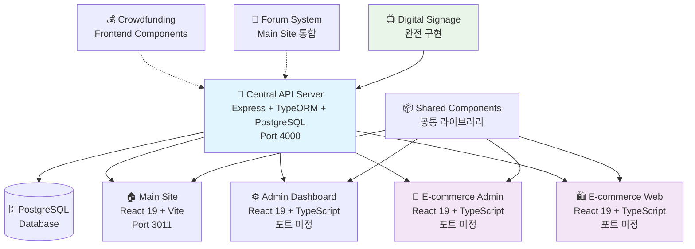
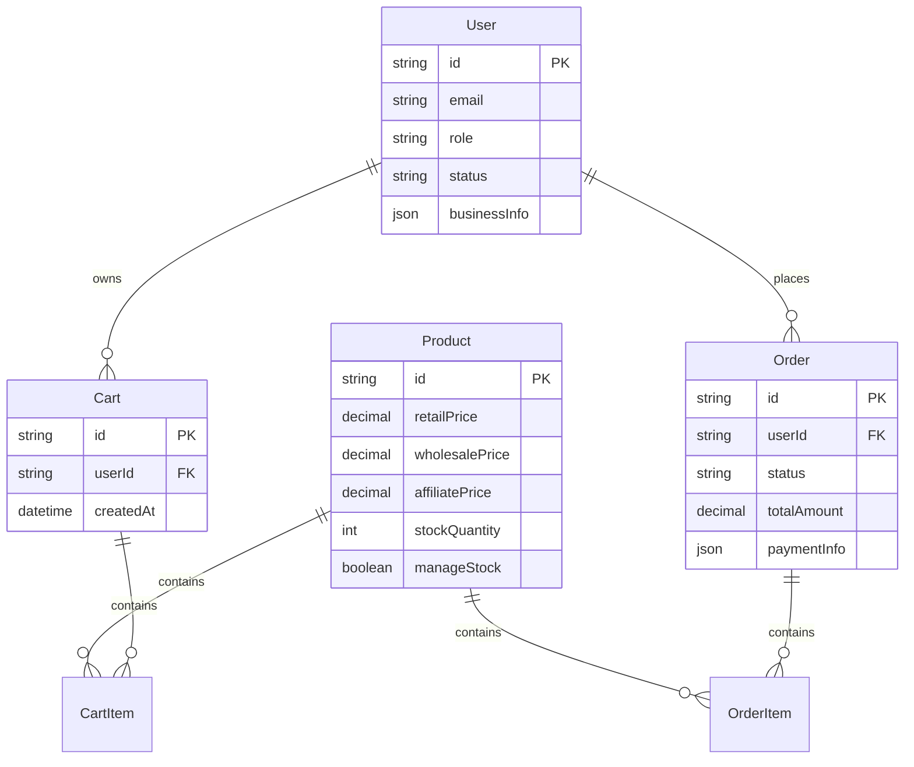
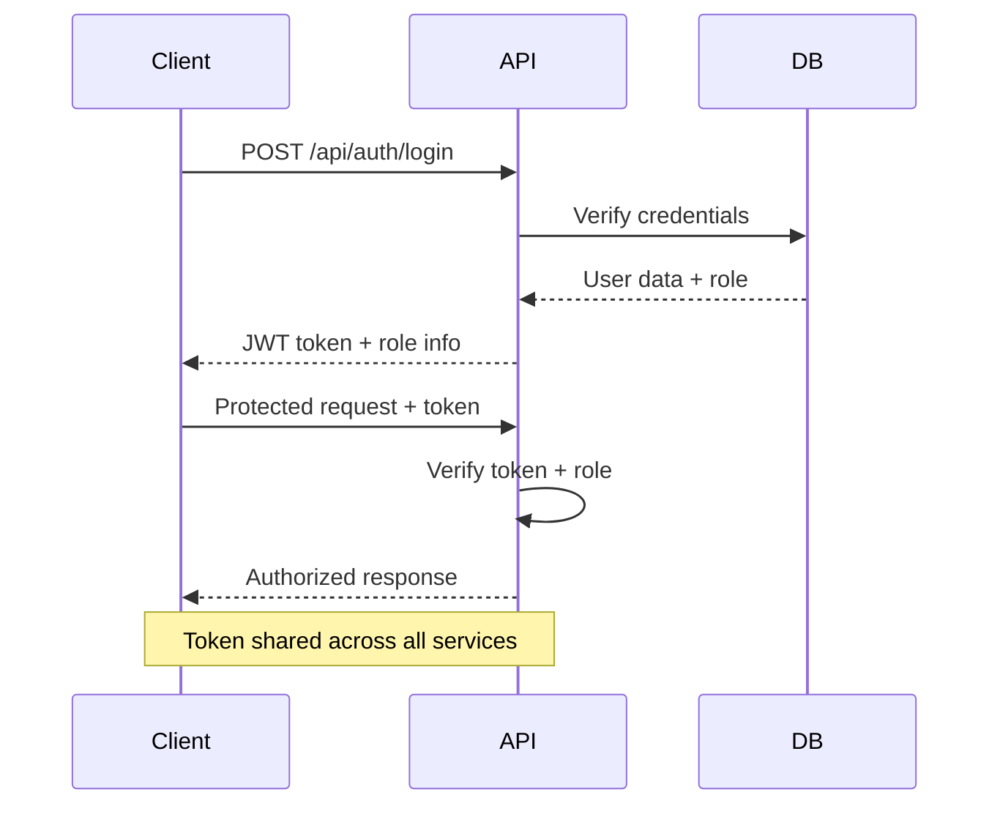
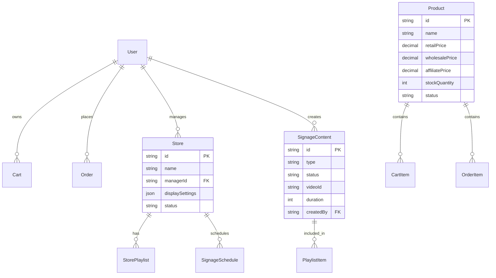

# 🚀 O4O Platform 기술 문서

> **최종 업데이트**: 2025년 6월 30일  
> **문서 버전**: v1.0  
> **분석 범위**: 7개 마이크로서비스 통합 분석

---

## 📋 문서 개요

O4O Platform은 **ecommerce를 중심**으로 한 **통합 마이크로서비스 아키텍처**를 채택한 플랫폼입니다. 단일 API 서버를 통해 7개의 전문 서비스가 연동되어 **역할 기반 통합 사용자 경험**을 제공합니다.

### 🎯 핵심 설계 철학
- **통합 접근 방식**: B2B/B2C 분리 대신 역할 기반 통합 시스템
- **중앙 집중식 API**: 단일 Express.js 서버로 모든 비즈니스 로직 처리  
- **역할 기반 차별화**: CUSTOMER → BUSINESS → AFFILIATE → ADMIN 권한 계층
- **실시간 동기화**: Socket.IO 기반 크로스 서비스 실시간 업데이트

---

## 🏗️ 플랫폼 전체 구조

### 서비스 맵 및 연동 구조



### 공통 기술 스택

| 영역 | 기술 스택 | 버전 |
|------|-----------|------|
| **Backend** | Node.js + Express.js + TypeORM | Node 20.x |
| **Database** | PostgreSQL (AWS Lightsail) | 15+ |
| **Frontend** | React + TypeScript + Vite | React 19.x |
| **Styling** | TailwindCSS | 4.1.7 |
| **State Management** | Zustand | 최신 |
| **Authentication** | JWT + Role-based Access Control | - |
| **Real-time** | Socket.IO | - |
| **Infrastructure** | AWS Lightsail (neture.co.kr) | - |

### 데이터 플로우

```
🔥 인증 플로우:
Client → JWT Token → API Server → Role Check → Service Access

🔄 데이터 동기화:
API Server → Database → Real-time Updates → Multiple Frontends

📊 비즈니스 로직:
User Role → Price Calculation → Permission Check → Action Execution
```

---

## 🛍️ Ecommerce 서비스 (핵심)

### 비즈니스 로직

#### 혁신적인 통합 역할 시스템
기존의 B2B/B2C 분리 방식 대신 **단일 시스템 내 역할 기반 차별화**:

```typescript
enum UserRole {
  CUSTOMER = 'customer',    // 일반 소매가
  BUSINESS = 'business',    // 도매가 (bulk discount)
  AFFILIATE = 'affiliate',  // 제휴가 + 수수료
  ADMIN = 'admin'           // 전체 관리 권한
}

// 💰 핵심 가격 로직
getPriceForUser(userRole: string): number {
  switch (userRole) {
    case 'business':   return this.wholesalePrice || this.retailPrice;
    case 'affiliate':  return this.affiliatePrice || this.retailPrice;
    default:          return this.retailPrice;
  }
}
```

#### 거래 안전성 (ACID Transaction)
모든 주문 연산은 **원자성** 보장:
1. 주문 생성
2. 재고 차감  
3. 장바구니 초기화
4. **전체 성공** 또는 **전체 롤백**

### 데이터 모델

#### 핵심 엔티티 관계도



#### 스냅샷 기반 데이터 무결성
- **주문 시점 상품 정보 보존**: 가격/재고 변경과 무관하게 주문 데이터 유지
- **재고 추적**: 실시간 재고 변동 이력 관리
- **감사 추적**: 모든 관리자 액션 로깅

### API 구조

#### RESTful 엔드포인트 설계

```typescript
// 🔐 인증 (Auth)
POST   /api/auth/register     // 역할 기반 회원가입
POST   /api/auth/login        // JWT 토큰 발급
GET    /api/auth/profile      // 사용자 프로필 (권한 필요)

// 🛒 상품 (Products)  
GET    /api/ecommerce/products                    // 역할별 가격으로 목록
GET    /api/ecommerce/products/:id               // 사용자별 맞춤 가격
POST   /api/ecommerce/products                   // 상품 등록 (관리자 전용)
PUT    /api/ecommerce/products/:id               // 상품 수정 (관리자 전용)
DELETE /api/ecommerce/products/:id               // 상품 삭제 (관리자 전용)

// 🛒 장바구니 (Cart)
GET    /api/ecommerce/cart                       // 사용자 장바구니 + 계산된 총액
POST   /api/ecommerce/cart/items                 // 장바구니 아이템 추가
PUT    /api/ecommerce/cart/items/:id             // 수량 변경
DELETE /api/ecommerce/cart/items/:id             // 아이템 제거

// 📦 주문 (Orders)
POST   /api/ecommerce/orders                     // 주문 생성 (트랜잭션 처리)
GET    /api/ecommerce/orders                     // 사용자 주문 내역
GET    /api/ecommerce/orders/:id                 // 주문 상세 정보
POST   /api/ecommerce/orders/:id/cancel          // 주문 취소
```

### 외부 연동

#### 결제 게이트웨이 지원
- **KAKAO_PAY**: 카카오페이 연동
- **NAVER_PAY**: 네이버페이 연동  
- **CARD**: 신용카드 직접 결제
- **BANK_TRANSFER**: 계좌이체

#### 배송업체 연동 (예정)
- 택배사 API 연동
- 실시간 배송 추적
- 자동 배송 상태 업데이트

---

## 🔗 연동 서비스들

### Admin Dashboard ↔ Ecommerce

#### 통합 관리 시스템
- **파일**: `services/admin-dashboard/src/api/ecommerceApi.ts` (346줄)
- **기능**: 전체 E-commerce 시스템 통합 관리

```typescript
class EcommerceApi {
  // 상품 관리
  async getProducts(filters: ProductFilters): Promise<Product[]>
  async createProduct(product: CreateProductRequest): Promise<Product>
  async bulkUpdateProducts(products: Product[]): Promise<void>
  
  // 주문 관리  
  async getOrders(filters: OrderFilters): Promise<Order[]>
  async updateOrderStatus(orderId: string, status: OrderStatus): Promise<void>
  async processRefund(orderId: string, amount: number): Promise<void>
  
  // 고객 관리
  async getCustomers(): Promise<Customer[]>
  async updateCustomerRole(customerId: string, role: UserRole): Promise<void>
  
  // 분석 데이터
  async getDashboardStats(): Promise<DashboardStats>
  async getSalesReport(dateRange: DateRange): Promise<SalesReport>
}
```

#### 현재 상태
- ✅ **API 계층**: 완전 구현됨
- ❌ **UI 구현**: 플레이스홀더 상태 ("상품 관리 페이지는 개발 중입니다")
- 🔧 **개발 필요**: 실제 관리자 인터페이스 구현

### Main Site ↔ Ecommerce

#### Zustand 상태 관리 아키텍처

```typescript
// 🛒 상품 스토어
interface ProductStore {
  products: Product[]
  currentProduct: Product | null
  filters: ProductFilters
  // 역할별 가격 계산 로직 포함
  getPriceForCurrentUser: (product: Product) => number
}

// 📦 주문 스토어  
interface OrderStore {
  orders: Order[]
  cart: CartItem[]
  // 주문 프로세스 관리
  createOrder: (cartItems: CartItem[]) => Promise<Order>
  clearCart: () => void
}

// 🔐 인증 스토어
interface AuthStore {
  user: User | null
  role: UserRole
  // 중앙 API 서버와 연동
  login: (credentials: LoginCredentials) => Promise<void>
  updateProfile: (profile: UserProfile) => Promise<void>
}
```

#### 현재 상태
- ✅ **아키텍처**: 잘 구조화된 상태 관리
- ⚠️ **구현**: 현재 모크 데이터 사용
- 🔧 **개발 필요**: 실제 API 연동 완료

### Crowdfunding ↔ Ecommerce

#### 혁신적인 보상 선택 시스템

```typescript
interface ProjectBacking {
  rewardChoice: 'product' | 'refund'  // 🎯 독특한 기능
  amount: number
  transparencyScore: number           // 신뢰도 기반 시스템
  partnerEndorsements: PartnerEndorsement[]
}

// 크라우드펀딩 → 이커머스 파이프라인
interface CrowdfundingToEcommerce {
  // 성공한 프로젝트 → 정규 상품 전환
  convertToProduct: (project: Project) => Promise<Product>
  
  // 후원자 → 고객 전환
  convertBackerToCustomer: (backer: Backer) => Promise<Customer>
  
  // 제휴 파트너 투명성
  showPartnerCommissions: (project: Project) => CommissionDisclosure[]
}
```

#### 현재 상태
- ✅ **프론트엔드**: 완성된 컴포넌트들
- ❌ **백엔드 API**: 미구현 상태
- 🔧 **개발 필요**: API 서버에 크라우드펀딩 라우트 추가

### Forum ↔ Ecommerce  

#### 신뢰 기반 커뮤니티 시스템

```typescript
interface TrustIntegration {
  // 포럼 신뢰 점수 → 상품 신뢰도
  contentVerification: {
    trustScore: number
    verificationStatus: 'verified' | 'pending' | 'disputed'
    expertEndorsements: number
  }
  
  // 전문가 상담 → 이커머스 서비스
  expertConsultation: {
    consultationPrice: number        // 💰 유료 상담
    expertCredibility: number
    specialty: string
  }
}
```

#### 현재 상태
- ✅ **컴포넌트**: TrustVerificationSystem, ExpertConsultationSystem 완성
- ❌ **API 백엔드**: 미구현
- 🔧 **개발 필요**: 신뢰 점수 시스템과 이커머스 통합

### Signage ↔ Ecommerce

#### 완전 구현된 디지털 사이니지 시스템

```typescript
// 🏪 매장 관리
interface Store {
  id: string
  name: string
  managerId: string  // User 엔티티와 연결
  displaySettings: DisplaySettings
  playlists: StorePlaylist[]
}

// 📺 콘텐츠 관리
interface SignageContent {
  type: 'youtube' | 'vimeo'
  status: 'pending' | 'approved' | 'rejected'
  duration: number
  createdBy: string
  approvedBy?: string
}

// ⏰ 스케줄 관리
interface SignageSchedule {
  storeId: string
  playlistId: string
  startTime: string
  endTime: string
  priority: number
}
```

#### API 엔드포인트 (20개 이상 완전 구현)

```typescript
// 콘텐츠 관리
GET    /api/signage/contents
POST   /api/signage/contents
PATCH  /api/signage/contents/:id/approval

// 매장 관리
GET    /api/signage/stores
POST   /api/signage/stores
PUT    /api/signage/stores/:id

// 플레이리스트 및 스케줄링
GET    /api/signage/stores/:storeId/playlists
POST   /api/signage/stores/:storeId/schedules

// 실시간 제어
POST   /api/signage/stores/:storeId/playback/control
GET    /api/signage/stores/:storeId/playback/status

// 분석
GET    /api/signage/analytics/content-usage
GET    /api/signage/analytics/store-performance
```

#### 이커머스 연동 가능성
- **상품 광고**: 매장별 상품 프로모션 콘텐츠
- **재고 표시**: 실시간 재고 현황 디스플레이
- **매출 연동**: 사이니지 광고 효과 → 매출 분석

#### 현재 상태
- ✅ **백엔드 API**: 완전 구현
- ✅ **데이터베이스**: 전체 엔티티 관계 완성
- ⚠️ **프론트엔드**: 기본 컴포넌트만 존재
- 🔧 **개발 필요**: 완전한 관리자 대시보드

---

## 🔧 공통 인프라

### 인증/권한 시스템

#### 통합 사용자 역할 아키텍처

```typescript
// 🎭 확장된 역할 시스템
enum UserRole {
  CUSTOMER = 'customer',      // 기본 이커머스
  BUSINESS = 'business',      // 도매 접근
  AFFILIATE = 'affiliate',    // 수수료 기반
  MANAGER = 'manager',        // 매장 관리 (사이니지)
  CREATOR = 'creator',        // 크라우드펀딩 프로젝트
  EXPERT = 'expert',          // 포럼 전문가
  ADMIN = 'admin'             // 플랫폼 관리
}

// 🔐 크로스 서비스 인증
interface AuthFlow {
  // JWT 토큰 공유
  tokenSharing: 'localStorage' | 'sessionStorage'
  
  // 서비스별 권한 체크
  servicePermissions: {
    [service: string]: UserRole[]
  }
  
  // 자동 토큰 갱신
  tokenRefresh: boolean
}
```

#### 인증 플로우



### 데이터베이스 설계

#### 핵심 엔티티 관계



#### 데이터 일관성 전략
- **스냅샷 패턴**: 주문/결제 시점 데이터 보존
- **이벤트 소싱**: 중요 비즈니스 이벤트 추적
- **참조 무결성**: 외래키 제약조건으로 데이터 일관성 보장

### 공통 라이브러리

#### Shared Components Architecture

```typescript
// 📦 /shared/types/
interface ApiResponse<T> {
  success: boolean
  data: T
  message?: string
  error?: string
}

interface User {
  id: string
  email: string
  role: UserRole
  status: UserStatus
  profile: UserProfile
}

// 📦 /shared/lib/api/client.ts
class ApiClient {
  private baseURL: string
  private token: string | null
  
  // 🔐 통합 인증
  async authenticate(credentials: LoginCredentials): Promise<AuthResponse>
  
  // 🔄 자동 토큰 갱신
  private async refreshToken(): Promise<void>
  
  // 📡 표준화된 API 호출
  async request<T>(endpoint: string, options: RequestOptions): Promise<T>
}

// 📦 /shared/components/
// 공통 UI 컴포넌트들
export { Button, Input, Modal, Table, Pagination }
```

---

## 📈 개발 우선순위 및 권장사항

### 🔥 즉시 조치 필요

#### 1. 크라우드펀딩 API 완성
```typescript
// 미구현 엔드포인트들
POST   /api/crowdfunding/projects
GET    /api/crowdfunding/projects/:id
POST   /api/crowdfunding/projects/:id/back
POST   /api/crowdfunding/rewards/:id/claim
```

#### 2. 포럼 API 구현
```typescript
// 필요한 엔드포인트들
POST   /api/forum/posts
GET    /api/forum/posts/:id/verify
POST   /api/forum/experts/consultations
GET    /api/forum/trust-scores/:userId
```

#### 3. Admin Dashboard UI 완성
- API 연동 완료 (ecommerceApi.ts)
- 실제 관리자 인터페이스 구현 필요

### ⚡ 전략적 통합 기회

#### 1. 신뢰-커머스 파이프라인
```
포럼 신뢰 점수 → 상품 신뢰도 평가
전문가 추천 → 프리미엄 상품 배지  
커뮤니티 리뷰 → 이커머스 상품 리뷰
```

#### 2. 크라우드펀딩-커머스 연속성
```
성공한 크라우드펀딩 → 이커머스 상품 출시
후원자 보상 → 로열티 프로그램 혜택
크리에이터 도구 → 판매자 온보딩
```

#### 3. 사이니지-커머스 시너지
```
실시간 재고 표시 → 매장 디스플레이
동적 가격 업데이트 → 가격 표시
위치 기반 추천 → 매장별 프로모션
```

---

## 🎯 아키텍처 강점 및 개선사항

### ✅ 현재 강점

1. **통합 설계 철학**: B2B/B2C 분리 대신 역할 기반 통합
2. **중앙 집중식 API**: 단일 Express.js 서버로 모든 비즈니스 로직 처리
3. **포괄적 인증 시스템**: JWT + 역할 기반 액세스 제어  
4. **실시간 기능**: Socket.IO 기반 라이브 업데이트
5. **완전한 사이니지 시스템**: 20개 이상 API 엔드포인트 완성
6. **모던 기술 스택**: React 19, TypeScript 5.8, Node.js 20

### 🔧 개선 필요 영역

#### 1. 서비스 격리
- **현재**: 단일 API 서버
- **개선**: 대규모 배포를 위한 마이크로서비스 API 분리 고려

#### 2. 프론트엔드 연합
- **현재**: 개별 React 앱들
- **개선**: Module Federation으로 독립적 프론트엔드 배포

#### 3. 데이터 일관성
- **현재**: 단일 데이터베이스
- **개선**: 크로스 서비스 데이터 동기화를 위한 이벤트 소싱

#### 4. API 문서화
- **현재**: 코드 내 TypeScript 타입
- **개선**: OpenAPI 스펙으로 더 나은 통합 지원

#### 5. 테스팅 전략
- **현재**: 기본적인 단위 테스트
- **개선**: 포괄적인 서비스 간 통합 테스트

---

## 📊 결론

O4O Platform은 **이커머스 중심의 통합 마이크로서비스 아키텍처**를 통해 혁신적인 사용자 경험을 제공하는 잘 설계된 플랫폼입니다.

### 🏆 핵심 혁신 포인트

1. **역할 기반 통합 시스템**: 기존 B2B/B2C 분리 방식을 뛰어넘는 통합 접근
2. **크로스 서비스 사용자 여정**: 크라우드펀딩 → 포럼 → 이커머스 → 사이니지 연계
3. **신뢰 기반 생태계**: 전문가 검증 → 커뮤니티 신뢰 → 상품 신뢰도 연결
4. **실시간 통합 관리**: Socket.IO 기반 모든 서비스 실시간 동기화

### 📈 비즈니스 가치

- **고객 생애 가치 극대화**: 단일 플랫폼에서 다양한 서비스 경험
- **신뢰 기반 거래**: 포럼 전문가 시스템 → 상품 신뢰도 증대  
- **효율적 운영**: 통합 관리 시스템으로 운영 비용 절감
- **확장성**: 모듈화된 아키텍처로 새로운 서비스 추가 용이

현재 플랫폼은 **견고한 기반 아키텍처**를 갖추고 있으며, 몇 가지 미완성 부분의 구현을 통해 **차별화된 종합 서비스 플랫폼**으로 발전할 수 있는 잠재력을 보유하고 있습니다.

---

*📄 이 문서는 O4O Platform의 7개 서비스에 대한 종합적인 기술 분석을 바탕으로 작성되었습니다.*