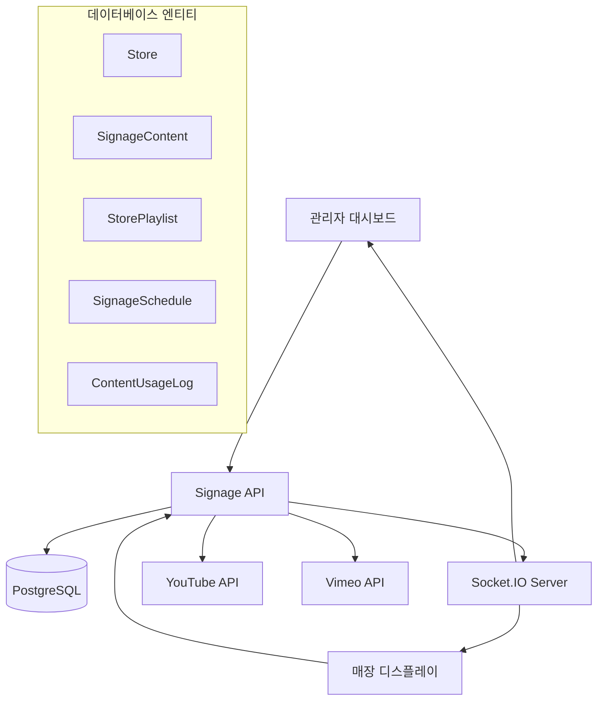
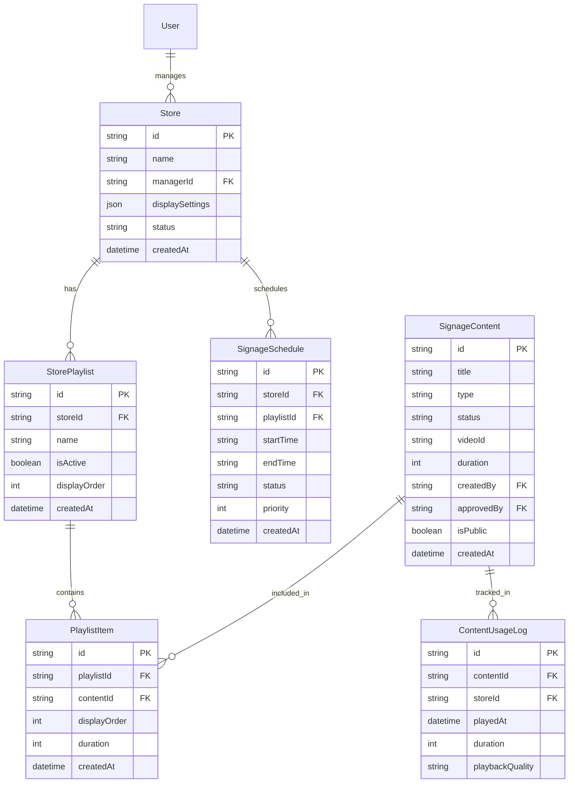

# 📺 Digital Signage 서비스 기술 문서

> **서비스 이름**: Digital Signage (디지털 사이니지)  
> **API 엔드포인트**: `/api/signage/*`  
> **상태**: ✅ 백엔드 완전 구현, 🟡 프론트엔드 부분 구현

---

## 📋 서비스 개요

O4O Platform의 **디지털 사이니지 관리 시스템**으로, 매장의 디지털 디스플레이를 중앙에서 관리하고 콘텐츠를 스케줄링할 수 있는 완전한 솔루션입니다.

### 🎯 핵심 기능
- **매장별 디스플레이 관리**: 각 매장의 디지털 사이니지 독립 제어
- **콘텐츠 플레이리스트**: YouTube/Vimeo 기반 콘텐츠 관리
- **시간 기반 스케줄링**: 시간대별 자동 콘텐츠 전환
- **실시간 제어**: Socket.IO 기반 원격 제어
- **성과 분석**: 콘텐츠 재생 통계 및 효과 측정

---

## 🏗️ 아키텍처

### 시스템 구조



### 기술 스택

| 구분 | 기술 | 상태 |
|------|------|------|
| **Backend API** | Express.js + TypeORM | ✅ 완전 구현 |
| **Database** | PostgreSQL | ✅ 완전 구현 |
| **Real-time** | Socket.IO | 🟡 부분 구현 |
| **External APIs** | YouTube API, Vimeo API | ✅ 통합 완료 |
| **Frontend** | React Components | 🟡 기본 구조만 |

---

## 🗄️ 데이터 모델

### 핵심 엔티티 관계



### 엔티티 상세 정의

```typescript
// 🏪 매장 엔티티
@Entity('stores')
class Store {
  @PrimaryGeneratedColumn('uuid')
  id: string

  @Column()
  name: string

  @Column()
  managerId: string // User.id 참조

  @Column('json')
  displaySettings: {
    resolution: string        // "1920x1080", "1280x720"
    orientation: 'landscape' | 'portrait'
    refreshRate: number      // 60, 30
    defaultTemplate: string
    volume: number           // 0-100
  }

  @Column({ type: 'enum', enum: ['active', 'inactive', 'suspended'] })
  status: string

  @OneToMany(() => StorePlaylist, playlist => playlist.store)
  playlists: StorePlaylist[]

  @OneToMany(() => SignageSchedule, schedule => schedule.store)
  schedules: SignageSchedule[]

  // 비즈니스 메서드
  isActive(): boolean {
    return this.status === 'active'
  }

  canPlayContent(): boolean {
    return this.isActive() && this.playlists.length > 0
  }
}

// 📹 콘텐츠 엔티티
@Entity('signage_contents')
class SignageContent {
  @PrimaryGeneratedColumn('uuid')
  id: string

  @Column()
  title: string

  @Column()
  description: string

  @Column({ type: 'enum', enum: ['youtube', 'vimeo', 'local'] })
  type: string

  @Column({ type: 'enum', enum: ['pending', 'approved', 'rejected', 'inactive'] })
  status: string

  @Column({ nullable: true })
  videoId: string // YouTube/Vimeo ID

  @Column({ type: 'int', nullable: true })
  duration: number // 초 단위

  @Column()
  createdBy: string // User.id

  @Column({ nullable: true })
  approvedBy: string // User.id

  @Column({ default: false })
  isPublic: boolean

  @Column('json', { nullable: true })
  metadata: {
    thumbnailUrl: string
    tags: string[]
    category: string
    language: string
  }

  // 비즈니스 메서드
  isApproved(): boolean {
    return this.status === 'approved'
  }

  getVideoUrl(): string {
    switch (this.type) {
      case 'youtube':
        return `https://www.youtube.com/watch?v=${this.videoId}`
      case 'vimeo':
        return `https://vimeo.com/${this.videoId}`
      default:
        return ''
    }
  }

  async validateContent(): Promise<boolean> {
    // YouTube/Vimeo API로 콘텐츠 유효성 검증
    return true
  }
}

// 📋 플레이리스트 엔티티
@Entity('store_playlists')
class StorePlaylist {
  @PrimaryGeneratedColumn('uuid')
  id: string

  @Column()
  storeId: string

  @Column()
  name: string

  @Column({ default: true })
  isActive: boolean

  @Column({ type: 'int', default: 0 })
  displayOrder: number

  @OneToMany(() => PlaylistItem, item => item.playlist)
  items: PlaylistItem[]

  @ManyToOne(() => Store, store => store.playlists)
  store: Store

  // 비즈니스 메서드
  getTotalDuration(): number {
    return this.items.reduce((total, item) => total + item.duration, 0)
  }

  getItemCount(): number {
    return this.items.length
  }

  isPlayable(): boolean {
    return this.isActive && this.items.length > 0
  }
}

// 📅 스케줄 엔티티
@Entity('signage_schedules')
class SignageSchedule {
  @PrimaryGeneratedColumn('uuid')
  id: string

  @Column()
  storeId: string

  @Column()
  playlistId: string

  @Column('time')
  startTime: string // "09:00"

  @Column('time')
  endTime: string // "18:00"

  @Column({ type: 'enum', enum: ['active', 'inactive', 'completed'] })
  status: string

  @Column({ type: 'int', default: 1 })
  priority: number // 우선순위 (높을수록 우선)

  @Column('simple-array', { nullable: true })
  daysOfWeek: string[] // ["MON", "TUE", "WED"]

  @ManyToOne(() => Store, store => store.schedules)
  store: Store

  @ManyToOne(() => StorePlaylist)
  playlist: StorePlaylist

  // 비즈니스 메서드
  isCurrentlyActive(): boolean {
    const now = new Date()
    const currentTime = now.toTimeString().slice(0, 5) // "HH:MM"
    const currentDay = now.toLocaleDateString('en', { weekday: 'short' }).toUpperCase()

    return (
      this.status === 'active' &&
      currentTime >= this.startTime &&
      currentTime <= this.endTime &&
      (!this.daysOfWeek || this.daysOfWeek.includes(currentDay))
    )
  }

  getNextActivationTime(): Date | null {
    // 다음 활성화 시간 계산 로직
    return null
  }
}
```

---

## 🔌 API 엔드포인트 (완전 구현)

### 콘텐츠 관리

```typescript
// 📹 콘텐츠 CRUD
GET    /api/signage/contents                    // 콘텐츠 목록 (필터링 지원)
POST   /api/signage/contents                    // 새 콘텐츠 등록
GET    /api/signage/contents/:id               // 콘텐츠 상세 정보
PUT    /api/signage/contents/:id               // 콘텐츠 수정
DELETE /api/signage/contents/:id               // 콘텐츠 삭제

// 📋 콘텐츠 승인 관리
PATCH  /api/signage/contents/:id/approval      // 콘텐츠 승인/거부
GET    /api/signage/contents/pending           // 승인 대기 콘텐츠
GET    /api/signage/contents/public            // 공개 콘텐츠

// 🔍 콘텐츠 검색 및 필터링
GET    /api/signage/contents/search?q=keyword  // 키워드 검색
GET    /api/signage/contents?type=youtube      // 타입별 필터
GET    /api/signage/contents?status=approved   // 상태별 필터
GET    /api/signage/contents?createdBy=userId  // 생성자별 필터
```

### 매장 관리

```typescript
// 🏪 매장 CRUD
GET    /api/signage/stores                     // 매장 목록
POST   /api/signage/stores                     // 새 매장 등록
GET    /api/signage/stores/:id                // 매장 상세 정보
PUT    /api/signage/stores/:id                // 매장 정보 수정
DELETE /api/signage/stores/:id                // 매장 삭제

// ⚙️ 매장 설정 관리
GET    /api/signage/stores/:id/settings       // 매장 디스플레이 설정
PUT    /api/signage/stores/:id/settings       // 설정 업데이트
POST   /api/signage/stores/:id/test-display   // 디스플레이 테스트

// 📊 매장 상태 모니터링
GET    /api/signage/stores/:id/status         // 실시간 상태
GET    /api/signage/stores/:id/health         // 시스템 상태 체크
POST   /api/signage/stores/:id/restart        // 원격 재시작
```

### 플레이리스트 관리

```typescript
// 📋 플레이리스트 CRUD
GET    /api/signage/stores/:storeId/playlists            // 매장 플레이리스트 목록
POST   /api/signage/stores/:storeId/playlists            // 새 플레이리스트 생성
GET    /api/signage/stores/:storeId/playlists/:id        // 플레이리스트 상세
PUT    /api/signage/stores/:storeId/playlists/:id        // 플레이리스트 수정
DELETE /api/signage/stores/:storeId/playlists/:id        // 플레이리스트 삭제

// 📝 플레이리스트 아이템 관리
GET    /api/signage/playlists/:id/items                  // 아이템 목록
POST   /api/signage/playlists/:id/items                  // 아이템 추가
PUT    /api/signage/playlists/:id/items/:itemId          // 아이템 수정
DELETE /api/signage/playlists/:id/items/:itemId          // 아이템 제거
POST   /api/signage/playlists/:id/items/reorder          // 아이템 순서 변경

// ⏯️ 플레이리스트 제어
POST   /api/signage/playlists/:id/activate               // 플레이리스트 활성화
POST   /api/signage/playlists/:id/deactivate             // 플레이리스트 비활성화
POST   /api/signage/playlists/:id/duplicate              // 플레이리스트 복제
```

### 스케줄링

```typescript
// 📅 스케줄 CRUD
GET    /api/signage/stores/:storeId/schedules            // 매장 스케줄 목록
POST   /api/signage/stores/:storeId/schedules            // 새 스케줄 생성
GET    /api/signage/stores/:storeId/schedules/:id        // 스케줄 상세
PUT    /api/signage/stores/:storeId/schedules/:id        // 스케줄 수정
DELETE /api/signage/stores/:storeId/schedules/:id        // 스케줄 삭제

// 📊 스케줄 상태 관리
GET    /api/signage/schedules/active                     // 현재 활성 스케줄
GET    /api/signage/schedules/upcoming                   // 예정된 스케줄
POST   /api/signage/schedules/:id/enable                 // 스케줄 활성화
POST   /api/signage/schedules/:id/disable                // 스케줄 비활성화

// 🔄 스케줄 실행 관리
GET    /api/signage/stores/:storeId/current-schedule     // 현재 실행 중인 스케줄
POST   /api/signage/stores/:storeId/force-schedule/:id   // 강제 스케줄 실행
POST   /api/signage/stores/:storeId/stop-schedule        // 스케줄 중단
```

### 실시간 제어

```typescript
// ⏯️ 재생 제어
GET    /api/signage/stores/:storeId/playback/status      // 현재 재생 상태
POST   /api/signage/stores/:storeId/playback/play        // 재생 시작
POST   /api/signage/stores/:storeId/playback/pause       // 일시 정지
POST   /api/signage/stores/:storeId/playback/stop        // 재생 중단
POST   /api/signage/stores/:storeId/playback/next        // 다음 콘텐츠
POST   /api/signage/stores/:storeId/playback/previous    // 이전 콘텐츠

// 🎚️ 디스플레이 제어
POST   /api/signage/stores/:storeId/display/brightness   // 밝기 조절
POST   /api/signage/stores/:storeId/display/volume       // 볼륨 조절
POST   /api/signage/stores/:storeId/display/power        // 전원 제어

// 🔄 원격 관리
POST   /api/signage/stores/:storeId/control/refresh      // 화면 새로고침
POST   /api/signage/stores/:storeId/control/restart      // 시스템 재시작
POST   /api/signage/stores/:storeId/control/update       // 소프트웨어 업데이트
```

### 분석 및 통계

```typescript
// 📊 콘텐츠 사용 통계
GET    /api/signage/analytics/content-usage              // 콘텐츠 재생 통계
GET    /api/signage/analytics/content-usage/:id          // 특정 콘텐츠 통계
GET    /api/signage/analytics/popular-content            // 인기 콘텐츠

// 🏪 매장 성능 분석
GET    /api/signage/analytics/store-performance          // 매장별 성능
GET    /api/signage/analytics/store-performance/:id      // 특정 매장 성능
GET    /api/signage/analytics/store-uptime               // 매장 가동 시간

// 📈 전체 시스템 통계
GET    /api/signage/analytics/dashboard-stats            // 대시보드 통계
GET    /api/signage/analytics/usage-trends               // 사용 트렌드
GET    /api/signage/analytics/system-health              // 시스템 상태

// 📋 보고서 생성
GET    /api/signage/reports/content-performance          // 콘텐츠 성과 보고서
GET    /api/signage/reports/store-activity               // 매장 활동 보고서
GET    /api/signage/reports/system-usage                 // 시스템 사용 보고서
POST   /api/signage/reports/custom                       // 커스텀 보고서 생성
```

---

## 🎮 컨트롤러 구현

### 콘텐츠 컨트롤러

```typescript
// 📁 services/api-server/src/controllers/signageController.ts
export class SignageController {
  
  // 📹 콘텐츠 목록 조회
  static async getContents(req: Request, res: Response) {
    try {
      const { type, status, createdBy, search, page = 1, limit = 10 } = req.query
      
      const queryBuilder = SignageContent.createQueryBuilder('content')
        .leftJoinAndSelect('content.creator', 'creator')
        .leftJoinAndSelect('content.approver', 'approver')
      
      // 필터링
      if (type) queryBuilder.andWhere('content.type = :type', { type })
      if (status) queryBuilder.andWhere('content.status = :status', { status })
      if (createdBy) queryBuilder.andWhere('content.createdBy = :createdBy', { createdBy })
      if (search) {
        queryBuilder.andWhere('(content.title ILIKE :search OR content.description ILIKE :search)', 
          { search: `%${search}%` })
      }
      
      // 페이징
      const [contents, total] = await queryBuilder
        .orderBy('content.createdAt', 'DESC')
        .skip((+page - 1) * +limit)
        .take(+limit)
        .getManyAndCount()
      
      res.json({
        success: true,
        data: contents,
        pagination: {
          page: +page,
          limit: +limit,
          total,
          totalPages: Math.ceil(total / +limit)
        }
      })
    } catch (error) {
      res.status(500).json({ success: false, error: error.message })
    }
  }
  
  // 📹 콘텐츠 생성
  static async createContent(req: Request, res: Response) {
    try {
      const { title, description, type, videoId } = req.body
      const userId = req.user.userId
      
      // 비디오 메타데이터 가져오기
      let metadata = {}
      if (type === 'youtube' && videoId) {
        metadata = await YouTubeService.getVideoMetadata(videoId)
      } else if (type === 'vimeo' && videoId) {
        metadata = await VimeoService.getVideoMetadata(videoId)
      }
      
      const content = new SignageContent()
      content.title = title
      content.description = description
      content.type = type
      content.videoId = videoId
      content.createdBy = userId
      content.status = 'pending'
      content.metadata = metadata
      
      await content.save()
      
      // 실시간 알림 (승인자들에게)
      socketService.notifyAdmins('new-content-pending', {
        contentId: content.id,
        title: content.title,
        createdBy: req.user.email
      })
      
      res.status(201).json({ success: true, data: content })
    } catch (error) {
      res.status(500).json({ success: false, error: error.message })
    }
  }
  
  // ✅ 콘텐츠 승인/거부
  static async approveContent(req: Request, res: Response) {
    try {
      const { id } = req.params
      const { action, reason } = req.body // 'approve' | 'reject'
      const approverId = req.user.userId
      
      const content = await SignageContent.findOne({ where: { id } })
      if (!content) {
        return res.status(404).json({ success: false, error: '콘텐츠를 찾을 수 없습니다.' })
      }
      
      content.status = action === 'approve' ? 'approved' : 'rejected'
      content.approvedBy = approverId
      
      await content.save()
      
      // 실시간 알림 (콘텐츠 생성자에게)
      socketService.notifyUser(content.createdBy, 'content-review-completed', {
        contentId: content.id,
        title: content.title,
        status: content.status,
        reason
      })
      
      res.json({ success: true, data: content })
    } catch (error) {
      res.status(500).json({ success: false, error: error.message })
    }
  }
}
```

### 매장 제어 컨트롤러

```typescript
export class StoreController {
  
  // 🏪 매장 목록
  static async getStores(req: Request, res: Response) {
    try {
      const { status, managerId } = req.query
      
      const queryBuilder = Store.createQueryBuilder('store')
        .leftJoinAndSelect('store.manager', 'manager')
        .leftJoinAndSelect('store.playlists', 'playlists')
        .leftJoinAndSelect('store.schedules', 'schedules')
      
      if (status) queryBuilder.andWhere('store.status = :status', { status })
      if (managerId) queryBuilder.andWhere('store.managerId = :managerId', { managerId })
      
      const stores = await queryBuilder.getMany()
      
      res.json({ success: true, data: stores })
    } catch (error) {
      res.status(500).json({ success: false, error: error.message })
    }
  }
  
  // ⏯️ 재생 제어
  static async controlPlayback(req: Request, res: Response) {
    try {
      const { storeId } = req.params
      const { action, contentId, position } = req.body
      
      const store = await Store.findOne({ where: { id: storeId } })
      if (!store) {
        return res.status(404).json({ success: false, error: '매장을 찾을 수 없습니다.' })
      }
      
      // Socket.IO를 통해 매장에 제어 명령 전송
      const controlCommand = {
        action, // 'play', 'pause', 'stop', 'next', 'previous'
        contentId,
        position,
        timestamp: new Date()
      }
      
      socketService.sendToStore(storeId, 'playback-control', controlCommand)
      
      // 로그 기록
      await ContentUsageLog.create({
        storeId,
        action: `control_${action}`,
        metadata: controlCommand,
        timestamp: new Date()
      }).save()
      
      res.json({ success: true, message: `${action} 명령이 전송되었습니다.` })
    } catch (error) {
      res.status(500).json({ success: false, error: error.message })
    }
  }
  
  // 📊 매장 상태 조회
  static async getStoreStatus(req: Request, res: Response) {
    try {
      const { storeId } = req.params
      
      // 실시간 상태 요청
      const status = await socketService.requestStoreStatus(storeId)
      
      if (!status) {
        return res.status(503).json({ 
          success: false, 
          error: '매장과 연결할 수 없습니다.',
          offline: true
        })
      }
      
      res.json({ success: true, data: status })
    } catch (error) {
      res.status(500).json({ success: false, error: error.message })
    }
  }
}
```

### 스케줄링 컨트롤러

```typescript
export class ScheduleController {
  
  // 📅 스케줄 생성
  static async createSchedule(req: Request, res: Response) {
    try {
      const { storeId } = req.params
      const { playlistId, startTime, endTime, daysOfWeek, priority } = req.body
      
      // 충돌하는 스케줄 확인
      const conflictingSchedule = await SignageSchedule.findOne({
        where: {
          storeId,
          status: 'active',
          startTime: LessThanOrEqual(endTime),
          endTime: MoreThanOrEqual(startTime)
        }
      })
      
      if (conflictingSchedule) {
        return res.status(409).json({
          success: false,
          error: '같은 시간대에 다른 스케줄이 있습니다.',
          conflictingSchedule
        })
      }
      
      const schedule = new SignageSchedule()
      schedule.storeId = storeId
      schedule.playlistId = playlistId
      schedule.startTime = startTime
      schedule.endTime = endTime
      schedule.daysOfWeek = daysOfWeek
      schedule.priority = priority || 1
      schedule.status = 'active'
      
      await schedule.save()
      
      // 스케줄 활성화 작업 예약
      scheduleService.schedulePlaylistActivation(schedule)
      
      res.status(201).json({ success: true, data: schedule })
    } catch (error) {
      res.status(500).json({ success: false, error: error.message })
    }
  }
  
  // 🔄 현재 활성 스케줄 조회
  static async getActiveSchedules(req: Request, res: Response) {
    try {
      const activeSchedules = await SignageSchedule.createQueryBuilder('schedule')
        .leftJoinAndSelect('schedule.store', 'store')
        .leftJoinAndSelect('schedule.playlist', 'playlist')
        .where('schedule.status = :status', { status: 'active' })
        .andWhere('TIME(NOW()) BETWEEN schedule.startTime AND schedule.endTime')
        .orderBy('schedule.priority', 'DESC')
        .getMany()
      
      // 요일 필터링
      const today = new Date().toLocaleDateString('en', { weekday: 'short' }).toUpperCase()
      const todaySchedules = activeSchedules.filter(schedule => 
        !schedule.daysOfWeek || schedule.daysOfWeek.includes(today)
      )
      
      res.json({ success: true, data: todaySchedules })
    } catch (error) {
      res.status(500).json({ success: false, error: error.message })
    }
  }
}
```

---

## 🔄 실시간 통신 (Socket.IO)

### 소켓 서비스 구현

```typescript
// 📁 services/api-server/src/services/signageService.ts
export class SocketService {
  private io: SocketIOServer
  private storeConnections = new Map<string, string>() // storeId -> socketId
  private adminConnections = new Set<string>() // admin socketIds
  
  constructor(io: SocketIOServer) {
    this.io = io
    this.setupEventHandlers()
  }
  
  private setupEventHandlers() {
    this.io.on('connection', (socket) => {
      console.log('Client connected:', socket.id)
      
      // 🏪 매장 연결
      socket.on('store-connect', (data: { storeId: string, authToken: string }) => {
        this.handleStoreConnection(socket, data)
      })
      
      // 👨‍💼 관리자 연결
      socket.on('admin-connect', (data: { adminId: string, authToken: string }) => {
        this.handleAdminConnection(socket, data)
      })
      
      // 📊 상태 업데이트
      socket.on('store-status-update', (data: StoreStatus) => {
        this.handleStoreStatusUpdate(socket, data)
      })
      
      // ⏯️ 재생 이벤트
      socket.on('playback-event', (data: PlaybackEvent) => {
        this.handlePlaybackEvent(socket, data)
      })
      
      // 💔 연결 해제
      socket.on('disconnect', () => {
        this.handleDisconnection(socket)
      })
    })
  }
  
  // 🏪 매장 연결 처리
  private async handleStoreConnection(socket: Socket, data: { storeId: string, authToken: string }) {
    try {
      // 토큰 검증
      const isValid = await this.validateStoreToken(data.authToken, data.storeId)
      if (!isValid) {
        socket.emit('auth-error', { message: '인증에 실패했습니다.' })
        return
      }
      
      // 매장 연결 등록
      this.storeConnections.set(data.storeId, socket.id)
      socket.join(`store-${data.storeId}`)
      
      // 매장 상태를 온라인으로 업데이트
      await Store.update({ id: data.storeId }, { 
        status: 'active',
        lastConnectedAt: new Date()
      })
      
      // 관리자들에게 매장 온라인 알림
      this.notifyAdmins('store-online', {
        storeId: data.storeId,
        timestamp: new Date()
      })
      
      socket.emit('connected', { 
        message: '매장이 연결되었습니다.',
        storeId: data.storeId
      })
      
    } catch (error) {
      socket.emit('connection-error', { message: error.message })
    }
  }
  
  // 📡 매장에 명령 전송
  public sendToStore(storeId: string, event: string, data: any) {
    const socketId = this.storeConnections.get(storeId)
    if (socketId) {
      this.io.to(socketId).emit(event, data)
      return true
    }
    return false
  }
  
  // 📢 관리자들에게 알림
  public notifyAdmins(event: string, data: any) {
    this.adminConnections.forEach(socketId => {
      this.io.to(socketId).emit(event, data)
    })
  }
  
  // 📊 매장 상태 요청
  public async requestStoreStatus(storeId: string): Promise<StoreStatus | null> {
    return new Promise((resolve) => {
      const socketId = this.storeConnections.get(storeId)
      if (!socketId) {
        resolve(null)
        return
      }
      
      const timeout = setTimeout(() => {
        resolve(null)
      }, 5000) // 5초 타임아웃
      
      this.io.to(socketId).emit('status-request', {}, (response: StoreStatus) => {
        clearTimeout(timeout)
        resolve(response)
      })
    })
  }
}

// 📊 매장 상태 인터페이스
interface StoreStatus {
  storeId: string
  isOnline: boolean
  currentPlaylist?: string
  currentContent?: string
  playbackPosition: number
  volume: number
  brightness: number
  systemInfo: {
    cpuUsage: number
    memoryUsage: number
    diskUsage: number
    temperature: number
  }
  lastHeartbeat: Date
}

// ⏯️ 재생 이벤트 인터페이스
interface PlaybackEvent {
  storeId: string
  event: 'started' | 'paused' | 'stopped' | 'ended' | 'error'
  contentId?: string
  position?: number
  timestamp: Date
  metadata?: any
}
```

### 클라이언트 측 Socket 연결

```typescript
// 🖥️ 매장 디스플레이 클라이언트
class StoreDisplayClient {
  private socket: Socket
  private storeId: string
  private authToken: string
  
  constructor(storeId: string, authToken: string) {
    this.storeId = storeId
    this.authToken = authToken
    this.socket = io('wss://api.neture.co.kr')
    this.setupEventHandlers()
  }
  
  private setupEventHandlers() {
    // 연결 시 매장 인증
    this.socket.on('connect', () => {
      this.socket.emit('store-connect', {
        storeId: this.storeId,
        authToken: this.authToken
      })
    })
    
    // 재생 제어 명령 수신
    this.socket.on('playback-control', (command: PlaybackCommand) => {
      this.handlePlaybackControl(command)
    })
    
    // 상태 요청 수신
    this.socket.on('status-request', (callback) => {
      const status = this.getCurrentStatus()
      callback(status)
    })
    
    // 스케줄 변경 알림
    this.socket.on('schedule-updated', (schedule: SignageSchedule) => {
      this.updateSchedule(schedule)
    })
  }
  
  private handlePlaybackControl(command: PlaybackCommand) {
    switch (command.action) {
      case 'play':
        this.playContent(command.contentId)
        break
      case 'pause':
        this.pausePlayback()
        break
      case 'stop':
        this.stopPlayback()
        break
      case 'next':
        this.nextContent()
        break
      case 'previous':
        this.previousContent()
        break
    }
    
    // 실행 결과 보고
    this.socket.emit('playback-event', {
      storeId: this.storeId,
      event: 'command-executed',
      command: command.action,
      timestamp: new Date()
    })
  }
  
  private getCurrentStatus(): StoreStatus {
    return {
      storeId: this.storeId,
      isOnline: true,
      currentPlaylist: this.currentPlaylist?.id,
      currentContent: this.currentContent?.id,
      playbackPosition: this.player.currentTime,
      volume: this.player.volume,
      brightness: this.display.brightness,
      systemInfo: {
        cpuUsage: this.system.getCpuUsage(),
        memoryUsage: this.system.getMemoryUsage(),
        diskUsage: this.system.getDiskUsage(),
        temperature: this.system.getTemperature()
      },
      lastHeartbeat: new Date()
    }
  }
}
```

---

## 📊 분석 및 통계

### 사용 통계 수집

```typescript
// 📊 콘텐츠 사용 로그
@Entity('content_usage_logs')
class ContentUsageLog {
  @PrimaryGeneratedColumn('uuid')
  id: string

  @Column()
  contentId: string

  @Column()
  storeId: string

  @Column()
  playedAt: Date

  @Column({ type: 'int' })
  duration: number // 실제 재생 시간 (초)

  @Column()
  playbackQuality: string // '1080p', '720p', '480p'

  @Column('json', { nullable: true })
  metadata: {
    viewerCount?: number
    skipCount?: number
    errorCount?: number
    deviceInfo: any
  }

  // 통계 메서드
  static async getContentPopularity(dateRange: DateRange): Promise<ContentStats[]> {
    return this.createQueryBuilder('log')
      .select('log.contentId', 'contentId')
      .addSelect('COUNT(*)', 'playCount')
      .addSelect('SUM(log.duration)', 'totalDuration')
      .addSelect('AVG(log.duration)', 'avgDuration')
      .leftJoin(SignageContent, 'content', 'content.id = log.contentId')
      .addSelect('content.title', 'title')
      .where('log.playedAt BETWEEN :startDate AND :endDate', dateRange)
      .groupBy('log.contentId, content.title')
      .orderBy('playCount', 'DESC')
      .getRawMany()
  }

  static async getStorePerformance(storeId: string, dateRange: DateRange): Promise<StoreStats> {
    const stats = await this.createQueryBuilder('log')
      .select('COUNT(DISTINCT log.contentId)', 'uniqueContents')
      .addSelect('COUNT(*)', 'totalPlays')
      .addSelect('SUM(log.duration)', 'totalDuration')
      .addSelect('AVG(log.duration)', 'avgDuration')
      .where('log.storeId = :storeId', { storeId })
      .andWhere('log.playedAt BETWEEN :startDate AND :endDate', dateRange)
      .getRawOne()

    return {
      storeId,
      period: dateRange,
      uniqueContents: parseInt(stats.uniqueContents),
      totalPlays: parseInt(stats.totalPlays),
      totalDuration: parseInt(stats.totalDuration),
      avgDuration: parseFloat(stats.avgDuration),
      uptime: await this.calculateUptime(storeId, dateRange)
    }
  }
}
```

### 분석 API 컨트롤러

```typescript
export class AnalyticsController {
  
  // 📊 대시보드 통계
  static async getDashboardStats(req: Request, res: Response) {
    try {
      const [
        totalStores,
        activeStores,
        totalContents,
        approvedContents,
        totalPlaylists,
        activeSchedules
      ] = await Promise.all([
        Store.count(),
        Store.count({ where: { status: 'active' } }),
        SignageContent.count(),
        SignageContent.count({ where: { status: 'approved' } }),
        StorePlaylist.count(),
        SignageSchedule.count({ where: { status: 'active' } })
      ])

      // 최근 7일 사용 통계
      const sevenDaysAgo = new Date()
      sevenDaysAgo.setDate(sevenDaysAgo.getDate() - 7)
      
      const recentUsage = await ContentUsageLog.createQueryBuilder('log')
        .select('DATE(log.playedAt)', 'date')
        .addSelect('COUNT(*)', 'plays')
        .addSelect('COUNT(DISTINCT log.storeId)', 'activeStores')
        .where('log.playedAt >= :date', { date: sevenDaysAgo })
        .groupBy('DATE(log.playedAt)')
        .orderBy('date', 'ASC')
        .getRawMany()

      res.json({
        success: true,
        data: {
          overview: {
            totalStores,
            activeStores,
            totalContents,
            approvedContents,
            totalPlaylists,
            activeSchedules
          },
          usage: recentUsage
        }
      })
    } catch (error) {
      res.status(500).json({ success: false, error: error.message })
    }
  }
  
  // 📈 콘텐츠 성과 분석
  static async getContentPerformance(req: Request, res: Response) {
    try {
      const { startDate, endDate, limit = 10 } = req.query
      
      const contentStats = await ContentUsageLog.getContentPopularity({
        startDate: new Date(startDate as string),
        endDate: new Date(endDate as string)
      })
      
      // 상위 N개 콘텐츠만 반환
      const topContents = contentStats.slice(0, +limit)
      
      res.json({ success: true, data: topContents })
    } catch (error) {
      res.status(500).json({ success: false, error: error.message })
    }
  }
  
  // 🏪 매장별 성과 분석
  static async getStorePerformance(req: Request, res: Response) {
    try {
      const { storeId } = req.params
      const { startDate, endDate } = req.query
      
      const performance = await ContentUsageLog.getStorePerformance(
        storeId,
        {
          startDate: new Date(startDate as string),
          endDate: new Date(endDate as string)
        }
      )
      
      res.json({ success: true, data: performance })
    } catch (error) {
      res.status(500).json({ success: false, error: error.message })
    }
  }
}
```

---

## 🚀 배포 및 운영

### Docker 컨테이너 설정

```dockerfile
# 🐳 매장 디스플레이 클라이언트 Dockerfile
FROM node:20-alpine

# 시스템 의존성 설치
RUN apk add --no-cache \
  chromium \
  nss \
  freetype \
  freetype-dev \
  harfbuzz \
  ca-certificates \
  ttf-freefont

# 앱 디렉터리 생성
WORKDIR /app

# 의존성 설치
COPY package*.json ./
RUN npm ci --only=production

# 앱 소스 복사
COPY . .

# 포트 노출
EXPOSE 3000

# 환경 변수
ENV PUPPETEER_SKIP_CHROMIUM_DOWNLOAD=true
ENV PUPPETEER_EXECUTABLE_PATH=/usr/bin/chromium-browser

# 앱 실행
CMD ["npm", "start"]
```

### 시스템 모니터링

```typescript
// 📊 시스템 상태 모니터링
class SystemMonitor {
  private checkInterval: NodeJS.Timer
  
  constructor() {
    this.startMonitoring()
  }
  
  private startMonitoring() {
    this.checkInterval = setInterval(async () => {
      await this.checkStoreHealth()
      await this.checkSystemResources()
      await this.checkContentAvailability()
    }, 30000) // 30초마다 체크
  }
  
  private async checkStoreHealth() {
    const stores = await Store.find({ where: { status: 'active' } })
    
    for (const store of stores) {
      const isOnline = socketService.isStoreOnline(store.id)
      
      if (!isOnline) {
        // 오프라인 알림
        await this.notifyStoreOffline(store)
        
        // 상태 업데이트
        await Store.update({ id: store.id }, { 
          status: 'inactive',
          lastDisconnectedAt: new Date()
        })
      }
    }
  }
  
  private async checkSystemResources() {
    const systemStats = {
      cpuUsage: process.cpuUsage(),
      memoryUsage: process.memoryUsage(),
      uptime: process.uptime()
    }
    
    // 리소스 사용량이 임계치를 초과하면 알림
    if (systemStats.memoryUsage.heapUsed / systemStats.memoryUsage.heapTotal > 0.9) {
      await this.notifyHighMemoryUsage(systemStats)
    }
  }
  
  private async checkContentAvailability() {
    const contents = await SignageContent.find({ 
      where: { status: 'approved', type: In(['youtube', 'vimeo']) }
    })
    
    for (const content of contents) {
      const isAvailable = await this.checkVideoAvailability(content)
      
      if (!isAvailable) {
        // 콘텐츠 비활성화
        await SignageContent.update({ id: content.id }, { 
          status: 'inactive' 
        })
        
        // 관리자에게 알림
        await this.notifyContentUnavailable(content)
      }
    }
  }
}
```

---

## 📊 현재 개발 상태

### ✅ 완전 구현된 기능

- **백엔드 API**: 20개 이상의 엔드포인트 완전 구현
- **데이터베이스**: 전체 엔티티 관계 및 비즈니스 로직 완성
- **Socket.IO**: 실시간 통신 인프라 구축
- **외부 API**: YouTube/Vimeo API 통합
- **분석 시스템**: 사용 통계 및 성과 분석
- **스케줄링**: 시간 기반 자동 콘텐츠 전환

### 🟡 부분 구현된 기능

- **프론트엔드**: 기본 컴포넌트 구조만 존재
- **관리자 대시보드**: SignageScheduler 컴포넌트만 있음
- **매장 디스플레이**: 클라이언트 어플리케이션 미구현
- **모바일 앱**: 매장 관리자용 모바일 앱 미구현

### ❌ 미구현 기능

- **완전한 관리자 인터페이스**: 콘텐츠 관리, 매장 제어 UI
- **매장 디스플레이 소프트웨어**: 실제 사이니지 재생 소프트웨어
- **고급 분석 대시보드**: 상세 통계 및 보고서 UI
- **자동 콘텐츠 큐레이션**: AI 기반 콘텐츠 추천

---

## 🎯 개발 로드맵

### Phase 1: 관리자 인터페이스 완성 (1-2개월)
- [ ] 콘텐츠 관리 대시보드 구현
- [ ] 매장 제어 인터페이스 구현
- [ ] 플레이리스트 관리 UI 구현
- [ ] 스케줄링 인터페이스 완성
- [ ] 실시간 모니터링 대시보드

### Phase 2: 매장 디스플레이 소프트웨어 (2-3개월)
- [ ] Electron 기반 디스플레이 어플리케이션
- [ ] 오프라인 모드 지원
- [ ] 자동 업데이트 시스템
- [ ] 하드웨어 제어 (밝기, 볼륨 등)
- [ ] 성능 최적화

### Phase 3: 고급 기능 및 최적화 (1-2개월)
- [ ] AI 기반 콘텐츠 추천
- [ ] 고급 분석 및 보고서
- [ ] 모바일 매장 관리 앱
- [ ] A/B 테스트 기능
- [ ] 다국어 지원

### Phase 4: 확장 기능 (1개월)
- [ ] 라이브 스트리밍 지원
- [ ] 인터랙티브 콘텐츠
- [ ] QR 코드 연동
- [ ] 음성 제어
- [ ] IoT 센서 연동

---

*📄 이 문서는 O4O Platform Digital Signage 서비스의 완전한 기술 명세를 담고 있습니다.*