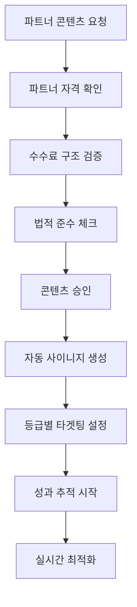
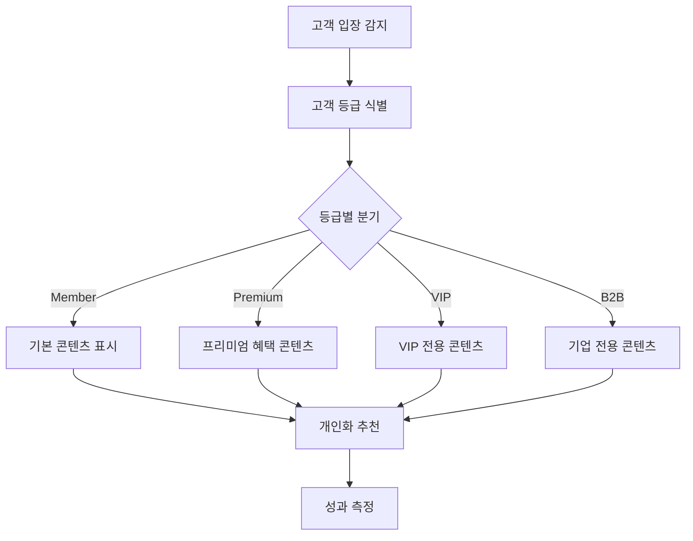

# 디지털 사이니지 모듈 UI/UX 설계 가이드 (파트너 시스템 통합)

## 📋 모듈 개요

o4o-platform의 **디지털 사이니지 모듈**은 비즈니스 환경에서 동적 콘텐츠를 관리하고 배포하는 통합 솔루션입니다. **4-Way 생태계**(공급자-판매자-파트너-구매자)를 지원하며, **파트너 성과 데이터**와 **B2C/B2B 등급별 타겟팅**을 통한 개인화된 디스플레이 콘텐츠를 제공합니다.

### 핵심 가치 제안
- **"드래그 앤 드롭으로 5분 안에 전문가급 디스플레이"**
- **실시간 원격 관리로 언제 어디서나 콘텐츠 업데이트**
- **파트너 성과 기반 타겟팅으로 개인화된 콘텐츠 표시**
- **B2C/B2B 등급별 차별화된 정보 제공**
- **o4o 플랫폼 연동으로 제품/펀딩 정보 자동 디스플레이**

### 확장된 비즈니스 모델 구조
```
공급자 → 판매자 → B2C/B2B 구매자 (등급별 차등 서비스)
   ↓        ↑           ↑
파트너 ──────┘           ↑
(마케팅 콘텐츠 제작)      ↑
   ↓                   ↑
사이니지 콘텐츠 ─────────┘
(개인화된 타겟 디스플레이)
```

---

## 🎯 확장된 사용자 페르소나

### **주요 페르소나 1: 스마트 매장 운영자 "이매니저" (35세, 매장 관리자)**

**배경:**
- 중소형 매장/사무실 여러 곳 운영
- 기술에 친숙하지만 디자인 전문가는 아님
- 효율적인 고객 소통과 매출 증대가 목표
- **파트너와의 협력을 통한 마케팅 효과 극대화 추구**

**Goals:**
- 고객 대기시간 동안 효과적인 정보 전달
- 프로모션 정보 실시간 업데이트
- 여러 지점 콘텐츠 중앙 관리
- 브랜드 일관성 유지
- **파트너 추천 제품의 타겟팅 디스플레이**
- **B2C/B2B 고객 등급별 맞춤 콘텐츠 제공**

**Pain Points:**
- 복잡한 디지털 사이니지 솔루션
- 높은 콘텐츠 제작 비용
- 실시간 업데이트의 어려움
- 기술적 장애 대응
- **파트너별 성과 추적의 어려움**
- **등급별 고객에게 적절한 콘텐츠 선별 복잡성**

**Success Metrics:**
- 콘텐츠 제작 시간 80% 단축
- 고객 정보 인지도 60% 향상
- 매장별 맞춤 콘텐츠 자동화 90%
- **파트너 추천 제품 전환율 25% 향상**
- **등급별 타겟 콘텐츠 효과성 40% 개선**

### **신규 페르소나 2: 파트너 협력 매장 "박파트너" (42세, 파트너 콘텐츠 매니저)**

**배경:**
- 여러 파트너와 협력하는 매장 체인 운영
- 파트너 추천 제품의 매장 내 홍보 전담
- 파트너별 성과 데이터 분석 및 최적화 담당
- **법적 준수를 기반으로 한 투명한 파트너십 관리**

**Goals:**
- 파트너 추천 제품의 효과적인 매장 내 디스플레이
- 파트너별 성과 데이터 실시간 추적
- **파트너 수수료 투명성 확보** (35% 미만 준수)
- 고객 등급별 차별화된 파트너 콘텐츠 제공
- **법적 규정 준수하는 건전한 파트너 협력**

**Pain Points:**
- 다수 파트너 콘텐츠 관리의 복잡성
- 파트너별 성과 측정의 어려움
- **수수료 투명성 관리 부담**
- 등급별 고객에게 적절한 콘텐츠 매칭
- **법적 준수 요구사항 복잡성**

**Success Metrics:**
- 파트너 콘텐츠 관리 효율성 70% 향상
- **파트너 수수료 투명성 100% 달성**
- 등급별 타겟팅 정확도 85% 이상
- **법적 준수율 100% 유지**

---

## 🚀 확장된 핵심 사용자 플로우

### **파트너 연동 콘텐츠 생성 플로우**



### **등급별 개인화 콘텐츠 플로우**



---

## 🧩 확장된 핵심 컴포넌트 설계

### **1. PartnerContentManager 컴포넌트 (신규 핵심!)**

#### **파트너 콘텐츠 통합 관리:**
```
┌─ 파트너 콘텐츠 관리 허브 ────────────────┐
│                                         │
│ 🤝 활성 파트너 (12개)                    │
│ ┌─ 골드 파트너: 건강유튜버김○○ ────────┐ │
│ │ 전문분야: 건강기능식품                │ │
│ │ 수수료율: 28% (법적 한도 내)          │ │
│ │ 이번 달 성과: 47% 증가               │ │
│ │ 콘텐츠 상태: ✅ 승인 완료 (3개)       │ │
│ │ [콘텐츠 미리보기] [성과 상세]         │ │
│ └─────────────────────────────────────┘ │
│                                         │
│ 📊 파트너 콘텐츠 성과 요약                │
│ ├─ 총 노출수: 1,234,567회               │
│ ├─ 클릭률: 5.8% (평균 대비 +23%)        │
│ ├─ 전환율: 3.2% (목표 3% 달성)          │
│ └─ 수수료 총액: ₩8,450,000 (월간)       │
│                                         │
│ ⚖️ 법적 준수 모니터링                   │
│ ├─ 수수료 한도: ✅ 모든 파트너 35% 미만   │
│ ├─ 투명성 공개: ✅ 100% 공개            │
│ ├─ 과대광고 체크: ⚠️ 1건 검토 중        │
│ └─ 모니터링: 🟢 실시간 감시 활성화       │
│                                         │
│ [파트너 등록] [성과 분석] [법적 보고서]   │
└─────────────────────────────────────────┘
```

#### **UI 구조:**
```jsx
<PartnerContentManager>
  <PartnerRegistry>
    <PartnerVerification />
    <CommissionStructureManager />
    <LegalComplianceChecker />
    <PerformanceTracker />
  </PartnerRegistry>
  
  <ContentApprovalWorkflow>
    <ContentReview />
    <LegalScreening />
    <BrandComplianceCheck />
    <AutomatedApproval />
  </ContentApprovalWorkflow>
  
  <PerformanceAnalytics>
    <RealTimeMetrics />
    <PartnerROI />
    <CommissionCalculator />
    <ComplianceReporting />
  </PerformanceAnalytics>
  
  <ContentDistribution>
    <TargetingEngine />
    <ScheduleOptimization />
    <A_B_Testing />
    <AutoOptimization />
  </ContentDistribution>
</PartnerContentManager>
```

### **2. TierBasedContentEngine 컴포넌트 (신규 핵심!)**

#### **등급별 개인화 콘텐츠 엔진:**
```
┌─ 등급별 콘텐츠 자동 선별 시스템 ──────────┐
│                                         │
│ 🎯 현재 타겟: VIP Member 김○○님          │
│ 감지 방법: NFC 태그 스캔                 │
│ 등급 혜택: 20% 할인, 무료배송, 전담상담   │
│                                         │
│ 📺 VIP 전용 콘텐츠 (현재 표시 중)         │
│ ┌─ VIP 독점 신제품 프리뷰 ─────────────┐ │
│ │   "출시 전 미리 만나보세요!"          │ │
│ │   🌟 VIP 전용 30% 얼리버드 할인       │ │
│ │   📞 전담 상담사 직통 연결            │ │
│ │   🚛 당일 배송 서비스                │ │
│ │   [VIP 라운지 예약] [개인 맞춤 상담]   │ │
│ └─────────────────────────────────────┘ │
│                                         │
│ 🎨 자동 개인화 설정                      │
│ ├─ 구매 이력 기반: 건강기능식품 관심      │
│ ├─ 파트너 추천: 의사 박○○ 추천 제품      │
│ ├─ 시간대 최적화: 점심시간 → 간편식 추천  │
│ └─ 날씨 연동: 비오는 날 → 면역력 제품     │
│                                         │
│ [등급별 콘텐츠 관리] [개인화 설정]        │
└─────────────────────────────────────────┘
```

#### **B2B 기업 고객 전용 디스플레이:**
```
┌─ B2B Enterprise VIP: 서울대병원 ─────────┐
│                                         │
│ 🏥 기업 전용 서비스                      │
│ 계약 혜택: 25% 기업 할인                │
│ 결제 조건: NET 60일                     │
│ 전담 매니저: 이○○ 이사                  │
│                                         │
│ 📋 이달의 대량 구매 추천                 │
│ ┌─ 의료용 소독제 (병원 전용) ──────────┐ │
│ │ 대량가: ₩1,200/개 (개당 400원 절약)   │ │
│ │ 최소주문: 1,000개                    │ │
│ │ 납기: 3일 이내                       │ │
│ │ 인증: FDA, CE, KC 모두 보유           │ │
│ │ [견적서 요청] [샘플 신청]             │ │
│ └─────────────────────────────────────┘ │
│                                         │
│ 🎁 기업 전용 혜택                       │
│ • 맞춤 OEM 개발 서비스                  │
│ • 전용 물류센터 직접 배송               │
│ • 24시간 기술 지원 핫라인               │
│ • 분기별 기업 전용 세미나 초대           │
│                                         │
│ [기업 카탈로그] [전담 매니저 연결]        │
└─────────────────────────────────────────┘
```

### **3. SmartTargetingEngine 컴포넌트 (강화!)**

#### **파트너 성과 + 등급 기반 타겟팅:**
```jsx
<SmartTargetingEngine>
  <CustomerIdentification>
    <NFCTagReader />
    <QRCodeScanner />
    <FaceRecognition />
    <MobileAppIntegration />
  </CustomerIdentification>
  
  <TierBasedLogic>
    <B2CMemberLogic />
    <B2CPremiumLogic />
    <B2CVIPLogic />
    <B2BCorporateLogic />
    <B2BEnterpriseLogic />
  </TierBasedLogic>
  
  <PartnerContentOptimization>
    <PartnerPerformanceData />
    <CommissionOptimization />
    <LegalComplianceFilter />
    <ContentQualityScoring />
  </PartnerContentOptimization>
  
  <PersonalizationEngine>
    <PurchaseHistoryAnalysis />
    <BehaviorPatternLearning />
    <WeatherContextual />
    <TimeBasedOptimization />
  </PersonalizationEngine>
</SmartTargetingEngine>
```

### **4. CommissionTransparencyDisplay 컴포넌트 (신규!)**

#### **수수료 투명성 보장 디스플레이:**
```
┌─ 파트너 추천 제품 투명성 공개 ────────────┐
│                                         │
│ 🤝 이 제품은 파트너가 추천한 제품입니다    │
│                                         │
│ 👨‍⚕️ 추천 파트너: 의사 김○○ 박사          │
│ 전문분야: 가정의학과, 영양학              │
│ 자격 인증: ✅ 의사면허 확인               │
│                                         │
│ 💰 수수료 정보 (투명 공개)               │
│ ├─ 추천 수수료율: 25%                   │
│ ├─ 법적 한도: ✅ 35% 미만 준수           │
│ ├─ 수수료 구조: 단일 계층만              │
│ └─ 지급 기준: 실제 구매 완료 시           │
│                                         │
│ 📝 추천 근거                           │
│ "10년 임상 경험을 바탕으로 한 추천.      │
│  환자분들께 실제로 처방하는 제품과       │
│  동일한 성분과 품질을 보장합니다."       │
│                                         │
│ ⚖️ 법적 준수 인증                       │
│ • 과대광고 없음 ✅                      │
│ • 의료법 준수 ✅                       │
│ • 공정거래법 준수 ✅                    │
│                                         │
│ [상세 정보] [다른 전문가 의견] [신고하기] │
└─────────────────────────────────────────┘
```

---

## 🔗 다른 모듈과의 강화된 연계

### **드랍쉬핑 모듈 연계 (파트너 시스템 통합)**

#### **파트너 성과 기반 자동 콘텐츠 생성:**
```
┌─ 드랍쉬핑-사이니지 파트너 연동 ──────────┐
│                                         │
│ 📊 파트너 성과 데이터 실시간 연동         │
│ ├─ 이번 주 최고 성과 파트너: 건강유튜버A   │
│ ├─ 추천 전환율: 8.5% (평균 대비 +150%)   │
│ ├─ 주력 제품: 프리미엄 비타민D            │
│ └─ 자동 추천: 해당 제품 사이니지 우선 표시 │
│                                         │
│ 🎯 등급별 자동 매칭                      │
│ VIP 고객 감지 → 파트너 추천 VIP 전용 제품 │
│ 기업 고객 → 대량 구매 파트너 제품 우선    │
│ 일반 고객 → 기본 파트너 추천 제품        │
│                                         │
│ 💰 수수료 연동 최적화                    │
│ • 수수료율 높은 제품 우선 표시 (한도 내)  │
│ • 파트너별 성과 기반 가중치 적용          │
│ • 법적 준수 상태 실시간 체크              │
│                                         │
│ [연동 설정] [성과 분석] [최적화 제안]     │
└─────────────────────────────────────────┘
```

---

## 📊 확장된 성공 지표 및 측정

### **파트너 연동 성과 KPI**

#### **파트너 콘텐츠 효과성:**
- **Partner Content CTR**: 파트너 콘텐츠 클릭률 > 6%
- **Commission Transparency Score**: 수수료 투명성 점수 > 95%
- **Legal Compliance Rate**: 법적 준수율 100% 유지
- **Partner Satisfaction**: 파트너 만족도 > 85%

#### **등급별 타겟팅 성과:**
- **Tier Accuracy**: 등급 인식 정확도 > 98%
- **Tier-Specific CTR**: 등급별 맞춤 콘텐츠 클릭률
  - VIP: > 12%, Premium: > 8%, Member: > 5%
- **Tier Conversion Rate**: 등급별 전환율 향상도
  - VIP: +40%, Premium: +25%, Member: +15%

---

*이 가이드는 o4o-platform 디지털 사이니지 모듈이 파트너 시스템과 등급별 차등 서비스를 통해 개인화되고 효과적인 콘텐츠 관리 솔루션을 제공하기 위한 종합 설계 문서입니다.*