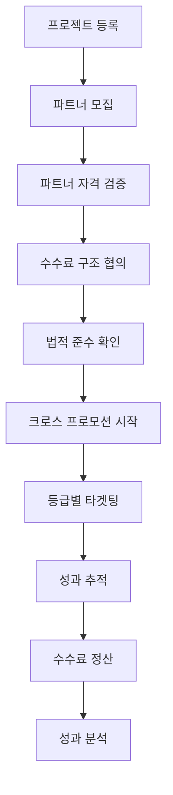
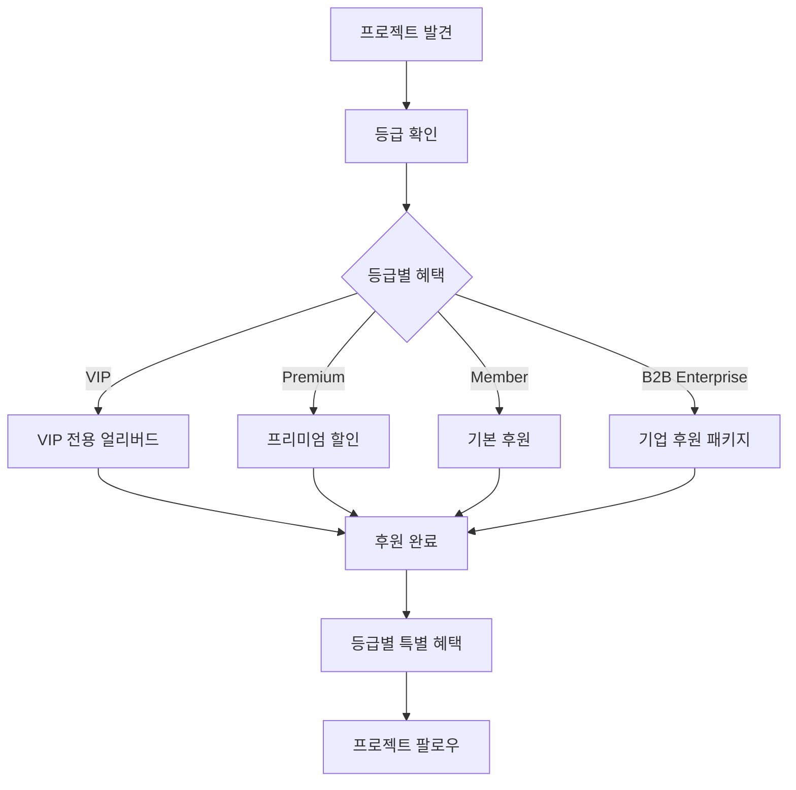

# 크라우드펀딩 모듈 UI/UX 설계 가이드 (파트너 시스템 통합)

## 📋 모듈 개요

o4o-platform의 **크라우드펀딩 모듈**은 정보 중심 제품의 특성을 살려 **신뢰도 기반 펀딩**을 지원하는 플랫폼입니다. **4-Way 생태계**(공급자-판매자-파트너-구매자)를 기반으로, **파트너와의 크로스 프로모션**을 통한 확산 효과와 **등급별 차별화된 후원 혜택**을 제공하며, 성공 후 드랍쉬핑으로의 완벽한 연계를 지원합니다.

### 핵심 가치 제안
- **"투명성이 곧 신뢰도"** - 모든 제품 정보의 검증 가능한 공개
- **"정보 기반 의사결정"** - 충분한 정보 제공을 통한 현명한 후원
- **"파트너 협력 확산"** - 전문 파트너를 통한 신뢰도 있는 홍보
- **"등급별 차별 혜택"** - 후원자 등급에 따른 맞춤형 혜택 제공
- **"펀딩 후 지속가능성"** - 드랍쉬핑 연동으로 지속적 제품 공급

### 확장된 펀딩 모델 (4-Way + 등급별 생태계)
```
제품 개발 → 정보 패키지 구축 → 전문가 검증 → 투명 공개 → 신뢰 기반 펀딩
    ↓           ↓              ↓           ↓           ↓
기술 검증   사용자 매뉴얼     제3자 평가   모든 정보    등급별 후원
품질 보증   안전성 데이터     인증 획득     실시간 공개   차별 혜택
    ↓           ↓              ↓           ↓           ↓
파트너 교육 → 전문가 리뷰 → 크로스 홍보 → 신뢰 확산 → 목표 달성
    ↓           ↓              ↓           ↓           ↓
법적 준수   수수료 투명     성과 추적     등급 관리   드랍쉬핑 전환
(35% 미만)   공개 의무      실시간 데이터  VIP/기업    자동 연계
```

---

## 🎯 확장된 사용자 페르소나

### **주요 페르소나 1: 정보 투명 창업자 "박트루스트" (35세, 의료기기 개발자)**

**배경:**
- 의료기기/건강 제품 개발 10년 경력
- 기술력은 뛰어나지만 마케팅 자금 부족
- 제품의 과학적 근거와 안전성에 대한 강한 확신
- 투명한 정보 공개를 통한 신뢰 구축 지향

**Goals:**
- 제품의 과학적 우수성을 명확히 전달
- 충분한 검증 자료를 통한 후원자 신뢰 확보
- **전문 파트너와의 협력을 통한 확산 효과**
- **등급별 후원자에게 차별화된 혜택 제공**
- 펀딩 성공 후 지속가능한 사업 모델 구축
- 전문가 네트워크와의 협력 관계 형성

**Pain Points:**
- 복잡한 기술 정보의 일반인 이해도 문제
- 검증 비용과 시간의 부담
- 경쟁 제품 대비 차별화 어려움
- 펀딩 후 생산 및 유통 체계 구축
- **파트너 관리 및 수수료 정책 결정**
- **등급별 혜택 차별화의 복잡성**

**Success Metrics:**
- 정보 투명성 지수 > 95%
- 전문가 추천율 > 80%
- 목표 달성률 > 150%
- 펀딩 후 드랍쉬핑 전환률 > 90%
- **파트너 추천 기여도 > 40%**
- **VIP 후원자 만족도 > 95%**

### **주요 페르소나 2: 등급별 후원자 "최검증" (42세, 의료진 / VIP Member)**

**배경:**
- 간호사 15년 경력, 의료 제품에 대한 전문적 이해
- **o4o 플랫폼 VIP Member** (연 구매액 500만원 이상)
- 가족 건강을 위한 제품에 관심 많음
- 근거 없는 과대광고에 대한 거부감 강함
- **VIP 혜택을 통한 얼리버드 우선 접근 선호**

**Goals:**
- 과학적으로 검증된 제품에만 후원
- 가족과 환자에게 추천할 수 있는 신뢰성
- **VIP 전용 할인 및 우선 혜택 활용**
- 지속적인 제품 개선 과정 참여
- **신뢰할 수 있는 파트너의 추천 정보 활용**

**Pain Points:**
- 과장된 광고와 실제 효과의 차이
- 부족한 임상 데이터나 검증 자료
- 펀딩 후 제품 품질 변화 우려
- 의료진으로서의 책임감과 후원 결정의 딜레마
- **파트너 추천의 신뢰성 판단 어려움**
- **등급별 혜택의 복잡성**

**Success Metrics:**
- 후원 프로젝트 성공률 > 90%
- **VIP 혜택 활용도 > 80%**
- 추천 제품 재구매율 > 70%
- **파트너 추천 만족도 > 85%**

### **주요 페르소나 3: 펀딩 전문 파트너 "이크라우드" (38세, 펀딩 전문 마케터)**

**배경:**
- 크라우드펀딩 마케팅 전문가 7년 경력
- 다수의 성공 펀딩 프로젝트 경험 보유
- 블로그, 유튜브를 통한 펀딩 프로젝트 소개 전문
- **법적 준수를 기반으로 한 건전한 마케팅 추구**

**Goals:**
- 정말 좋은 프로젝트만 선별하여 추천
- 팔로워들에게 실질적 도움이 되는 펀딩 소개
- **법적 한도 내에서 안정적인 추천 수수료 확보** (35% 미만)
- 장기적 신뢰 관계 기반 파트너십 구축
- **등급별 후원자에게 맞춤형 혜택 제공**

**Pain Points:**
- 프로젝트 품질과 성공 가능성 판단의 어려움
- 팔로워 신뢰도 유지와 수익성 균형
- **법적 규정 준수의 복잡성** (35% 미만, 단일계층)
- 펀딩 실패 시 팔로워 신뢰도 손상 우려
- **등급별 혜택 관리의 복잡성**

**Success Metrics:**
- 추천 프로젝트 성공률 > 85%
- 팔로워 만족도 > 90%
- **월 추천 수수료 > 400만원 (법적 한도 내)**
- **법적 준수율 100% 유지**
- **등급별 추천 전환율: VIP 15%, Premium 10%, Member 5%**

---

## 🚀 확장된 핵심 사용자 플로우

### **파트너 크로스 프로모션 플로우**



### **등급별 후원자 플로우**



---

## 🧩 확장된 핵심 컴포넌트 설계

### **1. PartnerCrossPromotionEngine 컴포넌트 (신규 핵심!)**

#### **파트너 크로스 프로모션 통합 관리:**
```
┌─ 파트너 크로스 프로모션 허브 ─────────────┐
│                                         │
│ 🤝 참여 파트너 현황 (18명)               │
│ ┌─ 플래티넘 파트너: 이크라우드 ─────────┐ │
│ │ 전문 분야: 헬스케어 크라우드펀딩       │ │
│ │ 팔로워: 185K | 평균 후원 유도: 12.5%  │ │
│ │ 수수료율: 32% (법적 한도 내)          │ │
│ │ 추천 예정일: 2024-07-25              │ │
│ │ 예상 추천 수수료: ₩3,800,000         │ │
│ │ [협업 세부사항] [콘텐츠 승인]         │ │
│ └─────────────────────────────────────┘ │
│                                         │
│ 📊 크로스 프로모션 성과 예측             │
│ ├─ 예상 추가 후원자: 680명              │
│ ├─ 예상 추가 펀딩: ₩28,500,000         │
│ ├─ 파트너 수수료 총액: ₩9,800,000       │
│ └─ 순 증대 효과: ₩18,700,000           │
│                                         │
│ 🎯 등급별 타겟팅 전략                    │
│ ├─ VIP 타겟: 고급 제품 집중 홍보         │
│ ├─ Premium: 가성비 강조 마케팅           │
│ ├─ Member: 기본 혜택 중심               │
│ └─ B2B: 기업 구매 혜택 강조              │
│                                         │
│ ⚖️ 법적 준수 체크                       │
│ ├─ 모든 파트너 수수료 < 35%             │
│ ├─ 단일 계층 구조 유지                 │
│ ├─ 투명한 수수료 공개                  │
│ └─ 과대광고 방지 가이드라인 준수        │
│                                         │
│ [파트너 모집] [일정 관리] [성과 분석]    │
└─────────────────────────────────────────┘
```

#### **UI 구조:**
```jsx
<PartnerCrossPromotionEngine>
  <PartnerRecruitment>
    <PartnerScouting />
    <QualificationAssessment />
    <LegalComplianceVerification />
    <TierTargetingCapability />
  </PartnerRecruitment>
  
  <CollaborationManager>
    <ContentCoordination />
    <ScheduleManagement />
    <TierSpecificCampaigns />
    <PerformanceTracking />
    <CommissionCalculator />
  </CollaborationManager>
  
  <CrossPromotionAnalytics>
    <ReachAnalysis />
    <TierBasedConversion />
    <ROI_Calculator />
    <PartnerContribution />
    <CompetitiveAnalysis />
  </CrossPromotionAnalytics>
  
  <ComplianceMonitor>
    <AutoLegalCheck />
    <CommissionLimitEnforcer />
    <ContentApprovalWorkflow />
    <TransparencyReporting />
    <TierBenefitCompliance />
  </ComplianceMonitor>
</PartnerCrossPromotionEngine>
```

### **2. TierBasedRewardSystem 컴포넌트 (신규 핵심!)**

#### **등급별 차별화된 후원 혜택 시스템:**
```
┌─ 등급별 후원 혜택 시스템 ─────────────────┐
│                                         │
│ 🏆 VIP Member 전용 혜택 (김○○님)         │
│ ┌─ VIP 최우선 얼리버드 접근 ───────────┐ │
│ │ • 일반 공개 48시간 전 우선 후원       │ │
│ │ • VIP 전용 40% 추가 할인             │ │
│ │ • 제품 개발 과정 실시간 공유          │ │
│ │ • 창업자 직접 1:1 상담 기회           │ │
│ │ • VIP 전용 제품 커스터마이징          │ │
│ │ • 우선 배송 + 프리미엄 포장           │ │
│ └─────────────────────────────────────┘ │
│                                         │
│ 🥈 Premium Member 혜택                   │
│ ├─ 얼리버드 24시간 전 우선 접근         │
│ ├─ 25% 추가 할인                       │
│ ├─ 주간 개발 업데이트 수신              │
│ ├─ 베타 테스터 우선 선발                │
│ └─ 프리미엄 고객 지원                   │
│                                         │
│ 🥉 일반 Member 혜택                      │
│ ├─ 기본 얼리버드 할인                  │
│ ├─ 월간 개발 보고서 수신                │
│ ├─ 완성품 우선 배송                    │
│ └─ 커뮤니티 참여 권한                   │
│                                         │
│ 🏢 B2B Enterprise 전용 혜택              │
│ ├─ 대량 후원 할인 (50개 이상 30%)       │
│ ├─ 기업 맞춤 제품 개발 참여              │
│ ├─ 전담 계정 관리자 배정                │
│ ├─ 기업 로고 제품 커스터마이징           │
│ └─ 분할 납품 및 장기 계약 가능           │
│                                         │
│ 🎯 파트너 추천 후원자 특별 혜택          │
│ ├─ 추천 파트너별 특별 할인 쿠폰         │
│ ├─ 파트너 전용 Q&A 세션 참여            │
│ ├─ 파트너 추천 제품 번들 할인           │
│ └─ 파트너와의 직접 소통 기회             │
└─────────────────────────────────────────┘
```

#### **UI 구조:**
```jsx
<TierBasedRewardSystem>
  <TierIdentification>
    <MembershipVerification />
    <B2BStatusCheck />
    <PartnerReferralTracking />
    <TierBenefitCalculator />
  </TierIdentification>
  
  <RewardManagement>
    <VIPExclusiveRewards />
    <PremiumBenefits />
    <MemberBasicRewards />
    <B2BEnterprisePackages />
    <PartnerSpecialOffers />
  </RewardManagement>
  
  <DynamicPricing>
    <TierBasedDiscounts />
    <EarlyBirdTiming />
    <VolumeDiscounts />
    <PartnerCommissionIntegration />
  </DynamicPricing>
  
  <RewardDelivery>
    <AutoBenefitApplication />
    <ExclusiveContentAccess />
    <PrioritySupport />
    <CustomizationOptions />
  </RewardDelivery>
</TierBasedRewardSystem>
```

### **3. ProjectShowcase 컴포넌트 (파트너 + 등급 통합 강화)**

#### **파트너 추천 + 등급별 혜택 통합 표시:**
```
┌─ 프로젝트 헤더 ──────────────────────────┐
│ [대형 프로젝트 이미지/비디오]             │
│                                        │
│ 혁신적인 스마트 워치 3.0                │
│ 건강 관리의 새로운 패러다임              │
│                                        │
│ by 박트루스트 팀 | 전자기기 | 서울      │
│ 🤝 8명의 전문 파트너가 추천 중           │
│ 🏆 VIP 회원님을 위한 특별 혜택 준비됨     │
└──────────────────────────────────────┘

┌─ 펀딩 현황 ─────┬─ VIP 전용 혜택 ─────┐
│ ₩126,000,000   │ 🌟 VIP 우선 접근     │
│ 달성률: 168%    │ 40% 특별 할인       │
│                │ ⏰ 48시간 먼저 후원   │
│ 2,347명 후원    │                    │
│                │ 🎁 VIP 추가 혜택     │
│ 12일 남음       │ • 개발자 직접 상담   │
│ [VIP 우선 후원]  │ • 맞춤 커스터마이징  │
└───────────────┴──────────────────────┘

┌─ 파트너 추천 섹션 ─────────────────────┐
│ 🎯 전문가들이 추천하는 이유             │
│                                       │
│ 👨‍⚕️ 의사 김○○ (의료기기 전문 파트너)    │
│ "10년 연구 끝에 나온 혁신적 기술.       │
│  임상 데이터가 매우 인상적입니다."      │
│ 추천 수수료: 30% (법적 한도 내)        │
│                                       │
│ 📱 테크리뷰어 이○○ (IT 전문 파트너)     │
│ "사용자 경험이 기존 제품과 차원이 다름"  │
│ 추천 수수료: 28%                      │
│                                       │
│ 💪 피트니스 트레이너 박○○               │
│ "운동 효과를 확실히 높여주는 제품"      │
│ 추천 수수료: 25%                      │
│                                       │
│ [전체 파트너 추천 보기] [추천 근거 상세] │
└─────────────────────────────────────────┘

┌─ 등급별 후원 혜택 비교 ─────────────────┐
│ 🏆 VIP: 40% 할인 + 48시간 우선 + 맞춤형  │
│ 🥈 Premium: 25% 할인 + 24시간 우선      │
│ 🥉 Member: 15% 할인 + 기본 혜택         │
│ 🏢 B2B: 30% 대량할인 + 기업 맞춤 서비스  │
│                                       │
│ [등급별 혜택 상세] [등급 업그레이드]     │
└─────────────────────────────────────────┘
```

### **4. FundingToDropshippingConverter 컴포넌트 (등급 연동 강화)**

#### **펀딩 성공 후 등급 기반 드랍쉬핑 자동 전환:**
```
┌─ 펀딩-드랍쉬핑 전환 자동화 (등급 연동) ──┐
│                                         │
│ 🎉 펀딩 성공! 드랍쉬핑 전환 준비         │
│ 목표 달성률: 168% (₩126,000,000)        │
│ 파트너 기여도: 42% (₩53,000,000)        │
│                                         │
│ 🔄 등급별 자동 전환 프로세스             │
│ ┌─ 1단계: 후원자 등급별 분류 ──────────┐ │
│ │ ✅ VIP 후원자 247명 → VIP 고객       │ │
│ │ ✅ Premium 후원자 521명 → Premium 고객│ │
│ │ ✅ Member 후원자 1,456명 → 일반 고객  │ │
│ │ ✅ B2B 후원자 18곳 → 기업 고객        │ │
│ └─────────────────────────────────────┘ │
│                                         │
│ ┌─ 2단계: 등급별 혜택 자동 적용 ───────┐ │
│ │ ✅ VIP: 20% 평생할인 + 무료배송       │ │
│ │ ✅ Premium: 10% 할인 + 우선 고객지원  │ │
│ │ ✅ Member: 5% 할인 + 기본 서비스      │ │
│ │ ✅ B2B: 대량할인 + 전담 매니저        │ │
│ └─────────────────────────────────────┘ │
│                                         │
│ ┌─ 3단계: 파트너 네트워크 연동 ────────┐ │
│ │ ✅ 펀딩 추천 파트너 → 판매 파트너     │ │
│ │ ✅ 기존 수수료 구조 유지 (법적 준수)   │ │
│ │ ✅ 추천 성과 데이터 이전              │ │
│ │ ✅ 등급별 타겟팅 데이터 연동          │ │
│ └─────────────────────────────────────┘ │
│                                         │
│ 📊 전환 예상 성과                       │
│ • VIP 후원자 → 고객 전환율: 95% 예상     │
│ • Premium 후원자 → 고객 전환율: 85%     │
│ • Member 후원자 → 고객 전환율: 75%      │
│ • B2B 후원자 → 기업고객 전환율: 90%     │
│ • 첫 달 예상 매출: ₩45,000,000          │
│ • 파트너 지속 협력률: 95%               │
│                                         │
│ [등급별 전환 시작] [설정 수정] [미리보기] │
└─────────────────────────────────────────┘
```

### **5. LegalComplianceDashboard 컴포넌트 (파트너 + 등급 특화)**

#### **크라우드펀딩 특화 법적 준수 관리:**
```jsx
<LegalComplianceDashboard>
  <CrowdfundingRegulations>
    <SecuritiesLawCompliance />
    <ConsumerProtectionRules />
    <AdvertisingStandards />
    <TaxImplications />
    <TierBasedBenefitLegal />
  </CrowdfundingRegulations>
  
  <PartnerComplianceMonitor>
    <CommissionLimitTracker />
    <SingleTierVerification />
    <TierTargetingCompliance />
    <ContentApprovalQueue />
    <TransparencyReporting />
  </PartnerComplianceMonitor>
  
  <TierSystemCompliance>
    <BenefitDisclosureRequirements />
    <DiscriminationPrevention />
    <FairTradingPractices />
    <TierTransparency />
  </TierSystemCompliance>
  
  <RealTimeAlerts>
    <RegulatoryChanges />
    <ComplianceViolations />
    <PartnerActivities />
    <TierBenefitIssues />
    <ContentFlags />
  </RealTimeAlerts>
</LegalComplianceDashboard>
```

### **6. CommunityBackerTierManager 컴포넌트 (확장)**

#### **후원자 등급별 커뮤니티 관리:**
```
┌─ 후원자 등급별 커뮤니티 허브 ────────────┐
│                                         │
│ 🏆 VIP 후원자 전용 라운지 (247명)        │
│ ┌─ 개발자 직접 소통 채널 ─────────────┐ │
│ │ 💬 실시간 Q&A (매주 화요일 8PM)      │ │
│ │ 📹 개발 과정 라이브 스트리밍         │ │
│ │ 🎯 제품 개선 아이디어 우선 반영       │ │
│ │ 🎁 VIP 전용 이벤트 및 선물           │ │
│ └─────────────────────────────────────┘ │
│                                         │
│ 🥈 Premium 후원자 클럽 (521명)           │
│ ├─ 주간 개발 업데이트 독점 공개          │
│ ├─ 베타 테스터 우선 선발                │
│ ├─ Premium 회원 전용 할인 혜택          │
│ └─ 제품 출시 알림 24시간 우선 수신       │
│                                         │
│ 🥉 일반 후원자 커뮤니티 (1,456명)        │
│ ├─ 월간 개발 리포트 공유                │
│ ├─ 후원자 전용 FAQ                     │
│ ├─ 출시 소식 및 배송 안내               │
│ └─ 일반 커뮤니티 참여 권한               │
│                                         │
│ 🏢 B2B 기업 후원자 전용 (18곳)           │
│ ├─ 기업 맞춤 개발 진행 상황 보고         │
│ ├─ 대량 주문 특별 할인 안내              │
│ ├─ 전담 계정 관리자 직접 소통            │
│ └─ 기업용 커스터마이징 옵션 제공         │
│                                         │
│ 🤝 파트너 추천 후원자 그룹 (987명)       │
│ ├─ 추천 파트너별 특별 혜택 안내          │
│ ├─ 파트너와의 직접 Q&A 세션              │
│ ├─ 파트너 추천 제품 번들 정보            │
│ └─ 파트너 추천 할인 코드 우선 제공       │
│                                         │
│ [등급별 혜택 관리] [커뮤니티 운영]       │
└─────────────────────────────────────────┘
```

---

## 📱 반응형 디자인 전략 (등급별 최적화)

### **Desktop (1024px+) - VIP/기업 고객 중심**
```css
.vip-project-layout {
  display: grid;
  grid-template-columns: 2fr 1fr;
  gap: 2rem;
  max-width: 1400px;
  margin: 0 auto;
}

.vip-exclusive-sidebar {
  position: sticky;
  top: 2rem;
  height: fit-content;
  background: linear-gradient(135deg, #FFD700, #FFA500);
  border-radius: 12px;
  padding: 2rem;
}

.enterprise-dashboard {
  background: linear-gradient(135deg, #2C3E50, #3498DB);
  color: white;
}
```

### **Mobile (320-768px) - 모든 등급 접근성**
```css
.mobile-tier-interface {
  display: flex;
  flex-direction: column;
}

.tier-indicator {
  position: fixed;
  top: 0;
  width: 100%;
  height: 4px;
  background: var(--tier-color);
  z-index: 1000;
}

.tier-benefits-modal {
  position: fixed;
  bottom: 0;
  width: 100%;
  max-height: 80vh;
  overflow-y: auto;
  background: white;
  border-radius: 20px 20px 0 0;
}
```

---

## 🔗 강화된 다른 모듈과의 연계

### **드랍쉬핑 모듈 연계 (등급 + 파트너 통합)**

#### **펀딩-판매 완벽 연동 + 등급 유지:**
```
┌─ 펀딩-드랍쉬핑 등급별 전환 플로우 ───────┐
│                                         │
│ [VIP 펀딩 완료] → [VIP 드랍쉬핑 고객]    │
│ • 펀딩 40% 할인 → 드랍쉬핑 20% 평생할인  │
│ • VIP 우선 접근 → VIP 신제품 우선 구매   │
│ • 개발자 소통 → 전담 고객 상담사         │
│ • 맞춤 제품 → 개인화 추천 서비스         │
│                                         │
│ [B2B 펀딩 완료] → [B2B 기업 고객]       │
│ • 기업 맞춤 개발 → OEM/ODM 서비스       │
│ • 대량 할인 → 기업 전용 가격 정책        │
│ • 전담 매니저 → 계속 전담 서비스         │
│ • 분할 납품 → 정기 주문 시스템           │
│                                         │
│ [파트너 네트워크] → [판매 파트너 전환]   │
│ • 펀딩 추천 실적 → 판매 파트너 등급      │
│ • 수수료 구조 유지 (법적 한도 내)        │
│ • 펀딩 팔로워 → 드랍쉬핑 고객 유도       │
│ • 신뢰도 데이터 → 판매 신뢰성 강화       │
└─────────────────────────────────────────┘
```

### **포럼 모듈 연계 (등급별 커뮤니티)**

#### **프로젝트별 등급 커뮤니티 자동 생성:**
```
┌─ 스마트 워치 3.0 등급별 커뮤니티 ────────┐
│                                         │
│ 🏆 VIP 라운지 (247명)                   │
│ • 개발자 직접 Q&A                       │
│ • 기술 세부사항 심화 토론                │
│ • VIP 전용 베타 테스트 피드백            │
│ • 개인 맞춤 설정 상담                   │
│                                         │
│ 🥈 Premium 클럽 (521명)                 │
│ • 주간 개발 업데이트 토론                │
│ • 기능 개선 제안 투표                   │
│ • Premium 회원 체험단 운영              │
│                                         │
│ 🥉 일반 커뮤니티 (1,456명)              │
│ • 기본 사용법 Q&A                      │
│ • 후원자 간 정보 공유                   │
│ • 출시 소식 및 업데이트                 │
│                                         │
│ 🏢 B2B 전용 채널 (18곳)                 │
│ • 기업 도입 사례 공유                   │
│ • 대량 구매 협의                       │
│ • 기업 맞춤 개발 논의                   │
│                                         │
│ 🤝 파트너 협력 포럼                      │
│ • 파트너 마케팅 전략 공유               │
│ • 성과 데이터 분석                      │
│ • 법적 준수 가이드라인                  │
│                                         │
│ [등급별 입장] [통합 검색] [알림 설정]    │
└─────────────────────────────────────────┘
```

### **디지털 사이니지 연계 (등급별 타겟팅)**

#### **오프라인 등급별 마케팅 연동:**
```
┌─ 매장용 등급별 펀딩 현황 디스플레이 ─────┐
│                                         │
│ 🚀 지금 펀딩 진행 중! (고객 등급 감지됨)  │
│     혁신적인 스마트 워치 3.0             │
│                                         │
│ 🏆 VIP 회원님 특별 혜택                  │
│     달성률: ████████████░░ 168%         │
│     VIP 전용: 40% 할인 + 48시간 우선     │
│     남은 기간: 12일                     │
│                                         │
│ 🤝 전문가 8명이 추천 중                  │
│ 👨‍⚕️ 의사 김○○: "임상 데이터 우수"       │
│ 📱 테크 리뷰어: "혁신적 기술"            │
│                                         │
│   [VIP 우선 후원 QR코드]                │
│   [파트너 상세정보 QR코드]               │
└─────────────────────────────────────────┘
```

---

## 📊 확장된 성공 지표 및 측정

### **파트너 크로스 프로모션 KPI**

#### **파트너 성과 지표:**
- **Partner Acquisition Rate**: 파트너 모집 성공률 > 70%
- **Cross-Promotion ROI**: 파트너 프로모션 투자 대비 수익률 > 500%
- **Partner Retention Rate**: 파트너 재협력율 > 85%
- **Legal Compliance Score**: 법적 준수 점수 100% 유지

#### **등급별 성과 지표:**
- **VIP Conversion Premium**: VIP 후원 전환율 > 25%
- **Tier Satisfaction Scores**: 
  - VIP: > 95%, Premium: > 90%, Member: > 85%, B2B: > 92%
- **Tier Benefit Utilization**: 등급별 혜택 활용률 > 80%
- **Cross-Tier Upgrade Rate**: 등급 상향 전환율 > 15%

### **통합 비즈니스 KPI**

#### **전체 플랫폼 성과:**
- **4-Way Ecosystem Value**: 4-Way 생태계 총 가치 창출
- **Partner-Driven Funding**: 파트너 기여 펀딩 비중 > 40%
- **Tier-Based Revenue**: 등급별 매출 기여도 최적화
- **Cross-Module Synergy**: 모듈 간 시너지 효과 > 60%

### **고급 분석 대시보드 (확장)**

```javascript
const advancedAnalyticsData = {
  partnerCrossPromotion: {
    partnerROI: '파트너별 투자 대비 수익률',
    tierTargetingEffectiveness: '등급별 타겟팅 효과성',
    commissionOptimization: '수수료 최적화 분석',
    legalComplianceTracking: '법적 준수 추적'
  },
  
  tierBasedAnalytics: {
    tierDistribution: '등급별 후원자 분포',
    tierConversionFunnel: '등급별 후원 전환 퍼널',
    tierLTV: '등급별 고객 생애가치',
    tierChurnAnalysis: '등급별 이탈 분석'
  },
  
  crossModuleImpact: {
    fundingToDropshipping: '펀딩-드랍쉬핑 전환 성과',
    communityEngagement: '커뮤니티 참여도 분석',
    signageEffectiveness: '사이니지 마케팅 효과',
    partnerNetworkGrowth: '파트너 네트워크 성장'
  },
  
  predictiveAnalytics: {
    successPrediction: '프로젝트 성공 예측 모델',
    partnerPerformanceForecast: '파트너 성과 예측',
    tierUpgradePrediction: '등급 상향 예측',
    marketTrendAnalysis: '시장 트렌드 분석'
  }
};
```

---

## 🎯 확장된 개발 로드맵

### **Phase 1: 기본 펀딩 + 파트너 기초 (10주)**
1. **프로젝트 생성 위저드** - 단계별 가이드
2. **펀딩 페이지** - Kickstarter 스타일 레이아웃
3. **결제 시스템** - 안전한 결제 처리
4. **기본 대시보드** - 창업자/후원자 관리
5. **파트너 기본 등록** - 파트너 정보 관리, 기본 수수료 설정
6. **등급 인식 시스템** - B2C/B2B 등급 확인 및 혜택 적용

### **Phase 2: 고급 기능 + 크로스 프로모션 (12주)**
1. **파트너 크로스 프로모션 엔진** - 다중 파트너 협력 관리
2. **등급별 차별화 시스템** - VIP/Premium/Member/B2B 혜택
3. **실시간 알림** - 펀딩 현황 푸시 알림
4. **모바일 최적화** - 모바일 앱 수준 UX
5. **분석 도구** - 상세 성과 분석
6. **법적 준수 시스템** - 수수료 한도, 투명성 보장

### **Phase 3: 플랫폼 통합 + 고급 등급 관리 (8주)**
1. **드랍쉬핑 연동** - 펀딩 후 자동 전환, 등급 유지
2. **포럼 통합** - 프로젝트별 등급 커뮤니티
3. **사이니지 연동** - 오프라인 등급별 마케팅
4. **AI 최적화** - 스마트 제안 시스템
5. **등급 자동 관리** - AI 기반 등급 승급 예측
6. **파트너 성과 예측** - 머신러닝 기반 최적화

### **Phase 4: 글로벌 확장 + 고도화 (추가)**
1. **다국어 지원** - 영어, 일본어, 중국어
2. **현지화** - 지역별 결제 수단, 등급 정책
3. **규제 준수** - 각국 크라우드펀딩 법률
4. **글로벌 파트너 네트워크** - 국제 파트너 관리
5. **글로벌 물류** - 국제 배송 연동
6. **고급 AI 분석** - 글로벌 트렌드 예측

---

*이 가이드는 o4o-platform 크라우드펀딩 모듈이 파트너 시스템과 등급별 차별화 서비스를 통해 창업자와 후원자 모두에게 최적화된 가치를 제공하는 포괄적인 설계 문서입니다.*