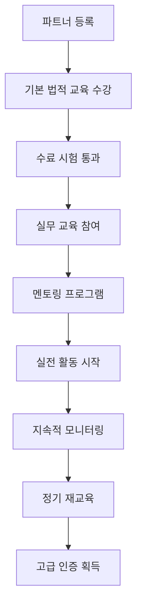
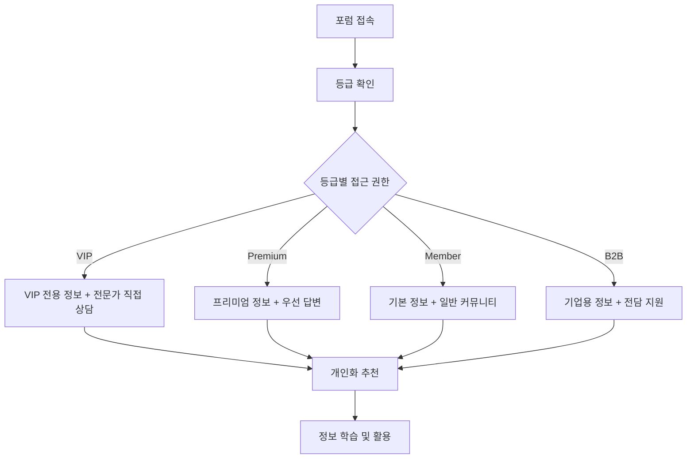

# 포럼 모듈 UI/UX 설계 가이드 (파트너 시스템 통합)

## 📋 모듈 개요

o4o-platform의 **포럼 모듈**은 정보 중심 제품의 특성에 맞춰 **지식 공유와 전문가 상담**을 중심으로 한 커뮤니티 플랫폼입니다. **4-Way 생태계**(공급자-판매자-파트너-구매자)를 지원하며, **파트너 교육 시스템**과 **등급별 차별화된 커뮤니티 서비스**를 통해 **신뢰도 기반 정보 생태계**를 구축합니다.

### 핵심 가치 제안
- **"정보가 지식이 되고, 지식이 신뢰가 되는 공간"**
- **전문가 검증 정보와 실사용자 경험의 균형**
- **파트너 교육을 통한 법적 준수 문화 확산**
- **등급별 차별화된 정보 접근 및 서비스 제공**
- **타겟 마케팅 연동으로 개인화된 정보 제공**

### 확장된 정보 생태계 모델 (4-Way + 등급별)
```
전문가 → 검증된 정보 → 등급별 커뮤니티 학습 → 신뢰도 향상
  ↓         ↓              ↓                    ↓
공급자 → 제품 정보 → 판매자 교육 → 등급별 고객 만족
  ↓         ↓              ↓                    ↓
파트너 → 법적 준수 교육 → 건전한 마케팅 → 투명한 추천
  ↓         ↓              ↓                    ↓
사용자 → 실사용 후기 → 등급별 혜택 → 제품 발전
(VIP/Premium/Member/B2B)
```

---

## 🎯 확장된 사용자 페르소나

### **주요 페르소나 1: 전문가 멘토 "닥터김" (48세, 의사 / 파트너)**

**배경:**
- 가정의학과 전문의 20년 경력
- 건강 정보의 정확성에 대한 사명감
- 온라인 건강 정보 확산에 관심
- 환자 교육 및 상담 경험 풍부
- **o4o 플랫폼 골드 파트너** (수수료율 30%, 법적 한도 내)

**Goals:**
- 올바른 건강 정보 확산
- 잘못된 정보 교정 및 검증
- 의료진으로서의 사회적 책임 실현
- 환자들의 건강 의식 향상
- **파트너로서 법적 준수하는 건전한 추천 활동**
- **등급별 환자에게 맞춤형 조언 제공**

**Pain Points:**
- 너무 많은 잘못된 건강 정보
- 시간 부족으로 인한 제한적 참여
- 의료진 책임과 자유로운 소통의 균형
- **파트너 활동의 법적 준수 요구사항**
- **등급별 환자 대응의 복잡성**

**Success Metrics:**
- 정보 검증 기여도 > 85%
- **파트너 법적 준수율 100% 유지**
- 등급별 상담 만족도 > 90%
- **월 추천 수수료 > 250만원 (법적 한도 내)**

### **주요 페르소나 2: 정보 탐구자 "이러너" (35세, 직장인 / Premium Member)**

**배경:**
- 건강에 관심 많은 직장인
- **o4o 플랫폼 Premium Member** (연 구매액 150만원)
- 가족 건강 관리 책임감
- 정보 검색 및 비교 분석 선호
- 커뮤니티 활동을 통한 학습 추구

**Goals:**
- 신뢰할 수 있는 건강 정보 획득
- 제품 구매 전 충분한 검증
- 비슷한 관심사를 가진 사람들과 교류
- 전문가로부터 직접 조언 받기
- **Premium 등급 혜택을 통한 우선 정보 접근**
- **파트너 추천 제품의 신뢰성 확인**

**Pain Points:**
- 정보의 신뢰성 판단 어려움
- 개인 상황에 맞는 맞춤 정보 부족
- 전문가와의 직접 소통 기회 제한
- **파트너 추천 정보의 편향성 우려**
- **등급별 혜택의 복잡성**

### **신규 페르소나 3: 파트너 교육 담당자 "박에듀" (41세, 법무팀장)**

**배경:**
- 법무 전문가 15년 경력
- o4o 플랫폼 파트너 교육 프로그램 총괄
- 마케팅 관련 법률 전문
- **파트너들의 법적 준수 교육 및 관리 담당**

**Goals:**
- 모든 파트너의 법적 준수 교육 완료
- 건전한 파트너 마케팅 문화 조성
- 수수료 투명성 및 한도 준수 관리
- 과대광고 방지 교육 실시
- **실시간 모니터링을 통한 위반 사전 방지**

**Pain Points:**
- 파트너들의 법적 이해도 차이
- 지속적인 교육 필요성
- 실시간 모니터링의 어려움
- 새로운 법규 변경에 대한 빠른 대응

---

## 🚀 확장된 핵심 사용자 플로우

### **파트너 교육 플로우**



### **등급별 정보 접근 플로우**



---

## 🧩 확장된 핵심 컴포넌트 설계

### **1. PartnerEducationCenter 컴포넌트 (신규 핵심!)**

#### **파트너 법적 준수 교육 통합 시스템:**
```
┌─ 파트너 교육 센터 ─────────────────────────┐
│                                         │
│ 📚 필수 교육 과정 (모든 파트너 의무)        │
│ ┌─ 1단계: 기본 법률 교육 ─────────────────┐ │
│ │ ✅ 제휴 마케팅 관련 법률 (4시간)        │ │
│ │ ✅ 수수료 한도 및 투명성 (2시간)        │ │
│ │ ✅ 과대광고 방지 가이드 (3시간)         │ │
│ │ ✅ 소비자 보호법 준수 (2시간)           │ │
│ │ 진도율: ████████████████████ 100%     │ │
│ │ [수료증 다운로드] [재수강]              │ │
│ └─────────────────────────────────────────┘ │
│                                         │
│ 📖 심화 교육 과정 (등급별 차별화)          │
│ ┌─ 골드 파트너 전용 ─────────────────────┐ │
│ │ 🏆 고급 마케팅 윤리 (6시간)            │ │
│ │ 🏆 브랜드 협력 전략 (4시간)            │ │
│ │ 🏆 위기 관리 및 대응 (3시간)           │ │
│ │ 수강 자격: 기본 과정 이수 + 성과 달성    │ │
│ └─────────────────────────────────────────┘ │
│                                         │
│ ⚖️ 실시간 법적 준수 모니터링              │
│ ├─ 콘텐츠 사전 검토: AI + 전문가 2단계    │
│ ├─ 수수료율 자동 체크: 35% 한도 준수      │
│ ├─ 투명성 점검: 공개 의무사항 확인        │
│ └─ 위반 시 즉시 알림 + 교정 교육 제공     │
│                                         │
│ 📊 파트너별 준수 현황                    │
│ • 김○○ (의사): ✅ 완벽 준수 (100점)      │
│ • 이○○ (유튜버): ⚠️ 주의 필요 (85점)     │
│ • 박○○ (블로거): ✅ 우수 (92점)          │
│                                         │
│ [교육 진행 현황] [위반 사례 분석] [Q&A]   │
└─────────────────────────────────────────┘
```

#### **UI 구조:**
```jsx
<PartnerEducationCenter>
  <EducationCurriculum>
    <MandatoryBasicCourse />
    <AdvancedSpecializationCourse />
    <TierSpecificTraining />
    <ContinuousLearningPath />
  </EducationCurriculum>
  
  <ComplianceMonitoring>
    <RealTimeContentReview />
    <CommissionLimitChecker />
    <TransparencyValidator />
    <AutomatedAlerts />
  </ComplianceMonitoring>
  
  <EducationDelivery>
    <InteractiveLearning />
    <VideoTutorials />
    <LiveWebinars />
    <MentorshipProgram />
  </EducationDelivery>
  
  <AssessmentSystem>
    <ProgressTracking />
    <CertificationTests />
    <PerformanceEvaluation />
    <ContinuousAssessment />
  </AssessmentSystem>
</PartnerEducationCenter>
```

### **2. TierBasedCommunityHub 컴포넌트 (신규 핵심!)**

#### **등급별 차별화된 커뮤니티 서비스:**
```
┌─ 등급별 커뮤니티 허브 ─────────────────────┐
│                                         │
│ 🏆 VIP Member 전용 라운지 (1,247명)       │
│ ┌─ VIP 독점 혜택 ─────────────────────────┐ │
│ │ 💎 전문가 1:1 직접 상담 (무제한)        │ │
│ │ 🎯 개인 맞춤 건강 계획 수립              │ │
│ │ 📱 VIP 전용 모바일 핫라인               │ │
│ │ 🏥 제휴병원 특별 할인 (20%)             │ │
│ │ 📊 개인 건강 데이터 분석 서비스          │ │
│ │ [VIP 라운지 입장] [전담 상담 예약]       │ │
│ └─────────────────────────────────────────┘ │
│                                         │
│ 🥈 Premium Member 클럽 (3,521명)          │
│ ├─ 전문가 그룹 상담 (월 2회)             │
│ ├─ 프리미엄 건강 정보 우선 접근           │
│ ├─ 신제품 베타 테스터 우선 선발           │
│ ├─ Premium 회원 전용 할인 혜택            │
│ └─ 24시간 이내 전문가 답변 보장           │
│                                         │
│ 🥉 일반 Member 커뮤니티 (12,456명)        │
│ ├─ 일반 Q&A 및 정보 공유                │
│ ├─ 주간 전문가 강의 참여                 │
│ ├─ 기본 건강 정보 접근                  │
│ └─ 커뮤니티 이벤트 참여                  │
│                                         │
│ 🏢 B2B Enterprise 전용 (156곳)           │
│ ├─ 기업 건강 관리 컨설팅                 │
│ ├─ 대량 구매 전문 상담                  │
│ ├─ 직원 건강 교육 프로그램               │
│ ├─ 기업 맞춤 솔루션 개발                 │
│ └─ 전담 계정 관리자 배정                 │
│                                         │
│ 🤝 파트너 전용 교육 포럼 (89명)           │
│ ├─ 법적 준수 교육 및 토론                │
│ ├─ 마케팅 윤리 사례 공유                 │
│ ├─ 성공 사례 및 노하우 전수              │
│ ├─ 실시간 법률 업데이트                 │
│ └─ 멘토-멘티 매칭 프로그램               │
│                                         │
│ [등급별 입장] [통합 검색] [등급 혜택 안내] │
└─────────────────────────────────────────┘
```

### **3. ExpertConsultationSystem 컴포넌트 (등급별 차별화 강화)**

#### **등급별 전문가 상담 서비스:**
```
┌─ 등급별 전문가 상담 시스템 ──────────────┐
│                                         │
│ 👨‍⚕️ 김○○ 의사 (파트너 + 전문가)         │
│ 전문분야: 가정의학과, 영양학              │
│ 파트너 등급: 골드 (수수료율 30%)          │
│ 상담 완료: 2,547건 | 만족도: 98.5%       │
│                                         │
│ 🎯 등급별 상담 서비스                    │
│ ┌─ VIP 전용 서비스 ──────────────────────┐ │
│ │ 💎 1:1 맞춤 상담 (월 무제한)           │ │
│ │ 📱 24시간 응급 핫라인                  │ │
│ │ 📊 개인 맞춤 건강 계획 수립             │ │
│ │ 🏥 전문병원 VIP 연계 서비스            │ │
│ │ 상담료: 무료 (VIP 혜택)                │ │
│ └─────────────────────────────────────────┘ │
│                                         │
│ ┌─ Premium 서비스 ───────────────────────┐ │
│ │ 🥈 그룹 상담 + 개별 팔로업 (월 2회)     │ │
│ │ ⏰ 24시간 이내 답변 보장               │ │
│ │ 📋 기본 건강 체크리스트 제공            │ │
│ │ 상담료: 50% 할인                      │ │
│ └─────────────────────────────────────────┘ │
│                                         │
│ ┌─ 일반 Member 서비스 ───────────────────┐ │
│ │ 🥉 그룹 상담 참여 (월 1회)             │ │
│ │ ⏳ 72시간 이내 답변                   │ │
│ │ 📚 기본 건강 정보 제공                 │ │
│ │ 상담료: 일반 요금                     │ │
│ └─────────────────────────────────────────┘ │
│                                         │
│ ┌─ B2B Enterprise 서비스 ───────────────┐ │
│ │ 🏢 기업 전담 건강 컨설팅               │ │
│ │ 👥 직원 집단 건강 상담                 │ │
│ │ 📈 기업 건강 지표 분석                 │ │
│ │ 💼 전담 매니저 + 의료진 팀 구성         │ │
│ └─────────────────────────────────────────┘ │
│                                         │
│ ⚖️ 파트너 투명성 보장                    │
│ • 추천 수수료: 30% (법적 한도 내 공개)   │
│ • 전문가 자격: ✅ 의사면허 확인          │
│ • 추천 근거: 10년 임상경험 기반          │
│ • 이해관계: 투명하게 공개               │
│                                         │
│ [등급별 상담 신청] [전문가 프로필] [후기] │
└─────────────────────────────────────────┘
```

### **4. SmartSurveyIntegration 컴포넌트 (등급별 맞춤화)**

#### **등급별 개인화된 설문 및 추천 시스템:**
```jsx
<SmartSurveyIntegration>
  <TierBasedSurveyTriggers>
    <VIPPersonalizedSurveys />
    <PremiumTargetedQuizzes />
    <MemberBasicAssessments />
    <B2BOrganizationSurveys />
    <PartnerPerformanceSurveys />
  </TierBasedSurveyTriggers>
  
  <AdaptiveSurveyContent>
    <DynamicQuestionGeneration />
    <TierSpecificOptions />
    <PartnerInfluenceTracking />
    <PersonalizedRecommendations />
  </AdaptiveSurveyContent>
  
  <ResultsPersonalization>
    <TierBasedRecommendations />
    <PartnerProductMatching />
    <ExpertConsultationSuggestions />
    <CommunityConnectionRecommendations />
  </ResultsPersonalization>
</SmartSurveyIntegration>
```

#### **VIP 전용 개인화 설문 예시:**
```
┌─ VIP 전용 개인 맞춤 건강 설문 ─────────────┐
│                                         │
│ "김○○님만을 위한 맞춤 건강 솔루션 설계"    │
│                                         │
│ Q1. 현재 가장 우선적으로 개선하고 싶은    │
│     건강 분야는? (VIP 전용 상세 옵션)      │
│ ☑ 심혈관 건강 (고급 검사 포함)           │
│ ☑ 뇌 건강 및 인지 기능                  │
│ □ 호르몬 균형 (개별 검사 연계)           │
│ □ 항노화 및 세포 건강                   │
│ □ 스트레스 관리 (VIP 전용 프로그램)      │
│                                         │
│ Q2. VIP 전용 검사 및 서비스 중 관심 있는  │
│     것은? (무료 제공)                    │
│ ☑ 유전자 분석 기반 맞춤 영양 설계        │
│ □ 고급 혈액 검사 (30개 항목)            │
│ □ 체성분 정밀 분석                      │
│ □ 수면 패턴 분석 (웨어러블 연동)         │
│                                         │
│ Q3. 선호하는 전문가 상담 방식은?          │
│ ○ 1:1 대면 상담 (VIP 라운지)            │
│ ○ 화상 상담 (24시간 예약 가능)          │
│ ○ 전화 상담 (즉시 연결)                 │
│                                         │
│ 🎁 완료 시 VIP 전용 혜택                 │
│ • 맞춤 건강 계획서 (30페이지)            │
│ • 전문가 1:1 상담 (2시간)               │
│ • VIP 전용 제품 추천 + 40% 할인          │
│                                         │
│ [다음 질문] 진행률: ████████░░ 80%       │
└─────────────────────────────────────────┘
```

### **5. CommunityQA 컴포넌트 (등급별 우선순위 강화)**

#### **등급별 차등 Q&A 서비스:**
```
┌─ Q&A 스레드 (등급별 우선 표시) ───────────┐
│                                         │
│ ❓ 질문: "프로바이오틱스 언제 먹는게 좋나요?" │
│ 작성자: Premium회원 건강러버 | 2시간 전    │
│ 👀 조회 247 | 💬 답변 5 | 👍 좋아요 28     │
│ 🏷️ 태그: #프로바이오틱스 #복용법 #소화건강   │
│                                         │
│ ┌─ 💎 VIP 전문가 답변 (최우선 표시) ─────┐ │
│ │ 👨‍⚕️ 박○○ 약사 (골드 파트너)           │ │
│ │ "Premium 회원님께 맞춤 답변드립니다.    │ │
│ │  개인 건강 상태를 고려한 세부 조언:     │ │
│ │  식후 30분이 가장 효과적이며,         │ │
│ │  님의 소화 패턴상 아침 식후를 권장..." │ │
│ │ 👍 156 | 💬 답글 24 | ⭐ VIP 채택됨     │ │
│ │ 💰 파트너 수수료: 28% (투명 공개)      │ │
│ └─────────────────────────────────────────┘ │
│                                         │
│ ┌─ 🥈 Premium 전문가 답변 ───────────────┐ │
│ │ 👨‍⚕️ 이○○ 의사                        │ │
│ │ "일반적으로는 식후 30분이 좋으나,      │ │
│ │  개인차가 있으니 체질에 맞게..."       │ │
│ │ 👍 89 | 💬 답글 12 | 🥈 전문가 인증     │ │
│ └─────────────────────────────────────────┘ │
│                                         │
│ ┌─ 💬 일반 Community 답변 ──────────────┐ │
│ │ 👤 영양덕후 (Member)                  │ │
│ │ "저는 아침 공복에 먹고 있어요.         │ │
│ │  개인적으로는 효과 좋았습니다!"        │ │
│ │ 👍 23 | 💬 답글 5                     │ │
│ └─────────────────────────────────────────┘ │
│                                         │
│ 🎯 등급별 추가 혜택                      │
│ • VIP: 개인 맞춤 추천 + 1:1 상담 연결    │
│ • Premium: 관련 제품 20% 할인           │ │
│ • Member: 기본 정보 + 커뮤니티 참여     │
│                                         │
│ [등급별 답변 작성] [전문가 호출] [북마크]  │
└─────────────────────────────────────────┘
```

### **6. PartnerPerformanceAnalytics 컴포넌트 (신규!)**

#### **파트너 성과 및 커뮤니티 기여도 분석:**
```
┌─ 파트너 커뮤니티 기여도 분석 ─────────────┐
│                                         │
│ 🤝 파트너별 커뮤니티 활동 현황            │
│ ┌─ 의사 김○○ (골드 파트너) ─────────────┐ │
│ │ 전문 답변: 247건 (이번 달)            │ │
│ │ 답변 만족도: ⭐⭐⭐⭐⭐ (4.9/5)        │ │
│ │ 추천 제품 클릭: 1,247회               │ │
│ │ 추천 전환율: 8.5% (목표 대비 +42%)    │ │
│ │ 법적 준수 점수: 100점 (완벽)           │ │
│ │ 커뮤니티 기여 점수: 94점               │ │
│ └─────────────────────────────────────────┘ │
│                                         │
│ 📊 등급별 파트너 추천 성과                │
│ ├─ VIP 대상 추천: 전환율 15.2%           │
│ ├─ Premium 대상: 전환율 12.8%            │
│ ├─ Member 대상: 전환율 7.3%              │
│ └─ B2B 대상: 전환율 18.5%                │
│                                         │
│ ⚖️ 법적 준수 모니터링 결과                │
│ ├─ 수수료 공개: ✅ 100% 준수             │
│ ├─ 과대광고 체크: ✅ 위반 없음            │
│ ├─ 투명성 점수: ✅ 95점 (우수)           │
│ └─ 교육 이수: ✅ 최신 과정 완료           │
│                                         │
│ 💰 이번 달 예상 수수료                   │
│ • 추천 수수료: ₩2,850,000               │
│ • 커뮤니티 보너스: ₩450,000             │
│ • 교육 참여 보너스: ₩200,000            │
│ • 총 수수료: ₩3,500,000                 │
│                                         │
│ [상세 분석 보고서] [개선 제안] [성과 비교] │
└─────────────────────────────────────────┘
```

---

## 📱 반응형 디자인 전략 (등급별 최적화)

### **Mobile First Approach + 등급별 차별화**

#### **Mobile (320-768px) - 등급별 UI 차별화**
```css
.mobile-tier-indicator {
  position: fixed;
  top: 0;
  width: 100%;
  height: 3px;
  z-index: 1000;
}

.tier-vip { background: linear-gradient(90deg, #FFD700, #FF6B35); }
.tier-premium { background: linear-gradient(90deg, #C0C0C0, #4A90E2); }
.tier-member { background: #95A5A6; }
.tier-b2b { background: linear-gradient(90deg, #2C3E50, #3498DB); }

.mobile-forum {
  display: flex;
  flex-direction: column;
  padding-top: 3px; /* tier indicator 공간 */
}

.tier-benefits-floating-btn {
  position: fixed;
  bottom: 80px;
  right: 20px;
  width: 60px;
  height: 60px;
  border-radius: 50%;
  background: var(--tier-color);
  display: flex;
  align-items: center;
  justify-content: center;
  box-shadow: 0 4px 12px rgba(0,0,0,0.3);
}
```

#### **Tablet (768-1024px) - 등급별 사이드바**
```css
.tablet-forum {
  display: grid;
  grid-template-columns: 250px 1fr;
  gap: 1rem;
}

.tier-sidebar {
  position: sticky;
  top: 1rem;
  height: fit-content;
  background: var(--tier-gradient);
  border-radius: 12px;
  padding: 1.5rem;
}

.expert-consultation-panel {
  background: rgba(255,255,255,0.95);
  backdrop-filter: blur(10px);
  border-radius: 8px;
  padding: 1rem;
  margin-top: 1rem;
}
```

#### **Desktop (1024px+) - 완전한 등급별 경험**
```css
.desktop-forum {
  display: grid;
  grid-template-columns: 280px 1fr 320px;
  gap: 2rem;
  max-width: 1400px;
  margin: 0 auto;
}

.tier-navigation { grid-area: 1; }
.main-content { grid-area: 2; }
.tier-benefits-panel { grid-area: 3; }

.vip-exclusive-features {
  background: linear-gradient(135deg, #FFD700, #FF6B35);
  color: white;
  border-radius: 12px;
  padding: 2rem;
  margin-bottom: 2rem;
}

.partner-education-widget {
  background: linear-gradient(135deg, #667eea, #764ba2);
  color: white;
  border-radius: 12px;
  padding: 1.5rem;
}
```

---

## 🔗 강화된 다른 모듈과의 연계

### **드랍쉬핑 모듈 연계 (파트너 교육 통합)**

#### **제품별 파트너 교육 커뮤니티:**
```
┌─ 제품별 파트너 교육 통합 관리 ────────────┐
│                                         │
│ 🏥 의료기기 카테고리 파트너 교육          │
│ ┌─ 필수 교육 과정 ─────────────────────┐ │
│ │ ✅ 의료기기법 준수 교육 (8시간)        │ │
│ │ ✅ 의료광고 심의 가이드 (4시간)        │ │
│ │ ✅ 허가사항 정확 전달 (3시간)          │ │
│ │ ⏳ 부작용 신고 의무 (진행중)           │ │
│ └─────────────────────────────────────────┘ │
│                                         │
│ 💊 건강기능식품 카테고리 파트너 교육       │
│ ┌─ 전문 과정 ───────────────────────────┐ │
│ │ ✅ 건강기능식품법 교육 (6시간)          │ │
│ │ ✅ 기능성 표시 가이드 (4시간)          │ │
│ │ ✅ 섭취 주의사항 안내 (2시간)          │ │
│ │ ✅ 상호작용 정보 전달 (3시간)          │ │
│ └─────────────────────────────────────────┘ │
│                                         │
│ 🎯 등급별 고객 대응 교육                  │
│ ├─ VIP 고객 상담 스킬 (고급 과정)        │
│ ├─ Premium 고객 케어 (중급 과정)         │
│ ├─ 일반 고객 응대 (기본 과정)            │
│ └─ B2B 기업 제안 (전문 과정)             │
│                                         │
│ ⚖️ 실시간 준수 체크                      │
│ • 제품 설명 정확성: AI 자동 검증          │
│ • 과대 표현 방지: 실시간 알림             │
│ • 의료법 준수: 전문가 사전 검토           │
│                                         │
│ [카테고리별 교육] [진도 관리] [인증 현황]  │
└─────────────────────────────────────────┘
```

### **크라우드펀딩 모듈 연계 (등급별 프로젝트 커뮤니티)**

#### **프로젝트별 등급 커뮤니티 통합 관리:**
```
┌─ 스마트 워치 3.0 등급별 커뮤니티 ────────┐
│                                         │
│ 🏆 VIP 후원자 라운지 (247명)             │
│ ├─ 개발자 주간 라이브 Q&A (목요일 8PM)   │
│ ├─ VIP 전용 기능 투표 및 의견 수렴        │
│ ├─ 프로토타입 체험 우선 신청              │
│ ├─ 개인 맞춤 설정 사전 상담               │
│ └─ VIP 한정 컬러/옵션 사전 예약           │
│                                         │
│ 🥈 Premium 후원자 클럽 (521명)           │
│ ├─ 개발 진행 상황 독점 공개              │
│ ├─ 베타 테스터 우선 선발                 │
│ ├─ Premium 회원 전용 Q&A                │
│ └─ 기능 개선 제안 우선 검토               │
│                                         │
│ 🥉 일반 후원자 커뮤니티 (1,456명)        │
│ ├─ 월간 개발 리포트 공유                 │
│ ├─ 일반 Q&A 및 정보 교환                │
│ ├─ 출시 소식 및 배송 안내                │
│ └─ 후원자 간 기대평 공유                 │
│                                         │
│ 🤝 파트너 추천 후원자 그룹 (987명)       │
│ ├─ 추천 파트너별 전용 채널               │
│ ├─ 파트너와의 직접 Q&A 세션              │
│ ├─ 파트너 추천 제품 정보 공유            │
│ └─ 추천 근거 및 전문가 의견 제공         │
│                                         │
│ [등급별 참여] [프로젝트 업데이트] [투표]  │
└─────────────────────────────────────────┘
```

### **디지털 사이니지 연계 (커뮤니티 콘텐츠 활용)**

#### **인기 토픽 및 전문가 조언 디스플레이:**
```
┌─ 매장용 커뮤니티 인사이트 디스플레이 ─────┐
│                                         │
│ 📈 이번 주 HOT 토픽                      │
│ "비타민D 겨울철 복용법"                  │
│ 💬 1,247개 댓글 | 👨‍⚕️ 전문가 8명 참여    │
│                                         │
│ 🏆 VIP 회원들이 가장 관심 있는 제품       │
│ 1위: 프리미엄 오메가3 (VIP 40% 할인)     │
│ 2위: 고급 멀티비타민 (VIP 전용 상담)     │
│                                         │
│ 👨‍⚕️ 전문가 추천 (파트너)                │
│ 의사 김○○: "겨울철 면역력 관리는..."    │
│ 약사 이○○: "비타민D 흡수율을 높이려면.." │
│                                         │
│ 🎯 고객님 등급별 혜택                    │
│ VIP: 전문가 1:1 상담 + 40% 할인         │
│ Premium: 우선 상담 + 20% 할인           │
│ Member: 기본 상담 + 10% 할인            │
│                                         │
│ [QR코드: 커뮤니티 참여] [QR코드: 등급 혜택]│
└─────────────────────────────────────────┘
```

---

## 📊 확장된 성공 지표 및 측정

### **파트너 교육 성과 KPI**

#### **교육 효과성 지표:**
- **Education Completion Rate**: 파트너 교육 완료율 > 95%
- **Legal Compliance Score**: 법적 준수 점수 > 98%
- **Partner Knowledge Test**: 파트너 지식 평가 점수 > 85점
- **Violation Prevention Rate**: 위반 사전 방지율 > 99%

#### **등급별 커뮤니티 성과:**
- **Tier Engagement Rates**: 
  - VIP: > 80%, Premium: > 65%, Member: > 45%, B2B: > 70%
- **Tier Satisfaction Scores**:
  - VIP: > 95%, Premium: > 90%, Member: > 85%, B2B: > 92%
- **Expert Response Quality**: 전문가 답변 품질 점수 > 90점
- **Tier Upgrade Rate**: 등급 상향 전환율 > 12%

### **커뮤니티 건강성 KPI (확장)**

#### **참여도 및 품질 지표:**
- **Daily Active Users by Tier**: 등급별 일일 활성 사용자
- **Expert Participation Rate**: 전문가 참여율 > 85%
- **Partner Education Effectiveness**: 파트너 교육 효과성 > 90%
- **Community Trust Score**: 커뮤니티 신뢰도 점수 > 92점

### **고급 분석 대시보드 (확장)**

```javascript
const expandedCommunityAnalytics = {
  partnerEducationMetrics: {
    courseCompletionRates: '과정별 완료율',
    knowledgeRetentionScore: '지식 보유율 점수',
    practicalApplicationRate: '실무 적용율',
    continuousLearningScore: '지속 학습 점수'
  },
  
  tierBasedEngagement: {
    tierSpecificContentViews: '등급별 콘텐츠 조회',
    tierCrossInteraction: '등급 간 상호작용',
    tierUpgradeMotivation: '등급 상향 동기',
    tierRetentionFactors: '등급 유지 요인'
  },
  
  expertParticipationAnalysis: {
    responseQualityMetrics: '답변 품질 측정',
    expertSpecializationMatch: '전문분야 매칭도',
    expertPartnerPerformance: '전문가-파트너 성과',
    expertInfluenceScore: '전문가 영향력 점수'
  },
  
  crossModuleImpact: {
    communityToSalesConversion: '커뮤니티-판매 전환',
    educationToComplianceRate: '교육-준수율 연관성',
    tierBasedCrossModuleUsage: '등급별 모듈 교차 이용',
    partnerEducationROI: '파트너 교육 투자수익률'
  }
};
```

---

## 🎯 확장된 개발 로드맵

### **Phase 1: 기본 커뮤니티 + 파트너 교육 (8주)**
1. **기본 Q&A 시스템** - 질문, 답변, 투표
2. **등급별 접근 제어** - VIP/Premium/Member/B2B 차별화
3. **파트너 교육 기초** - 기본 법적 준수 교육 시스템
4. **전문가 인증 시스템** - 자격 검증, 파트너 등록

### **Phase 2: 고급 등급 시스템 + 교육 강화 (10주)**
1. **등급별 차별화 서비스** - 각 등급 전용 혜택 및 기능
2. **파트너 교육 고도화** - 카테고리별, 단계별 세분화 교육
3. **실시간 준수 모니터링** - AI 기반 자동 검증 시스템
4. **전문가 상담 시스템** - 등급별 차별화된 상담 서비스
5. **커뮤니티 관리 도구** - 등급별 커뮤니티 운영 최적화

### **Phase 3: 스마트 기능 + 크로스 연동 (8주)**
1. **설문/퀴즈 통합** - 등급별 개인화된 타겟 마케팅 연동
2. **AI 기반 추천** - 등급 및 행동 패턴 기반 콘텐츠 추천
3. **크로스 모듈 연동** - 드랍쉬핑, 펀딩, 사이니지 완전 통합
4. **파트너 성과 분석** - 고급 분석 및 예측 시스템
5. **모바일 앱 최적화** - 등급별 차별화된 모바일 경험

### **Phase 4: 고급 분석 + 글로벌 확장 (6주)**
1. **예측 분석 시스템** - AI 기반 등급 상향 예측, 이탈 방지
2. **글로벌 파트너 교육** - 다국가 법률 대응 교육 시스템
3. **고급 커뮤니티 관리** - 자동 조절, 품질 관리 AI
4. **국제화 지원** - 다국어, 다문화 커뮤니티 지원
5. **통합 CRM** - 전 모듈 연동 고객 관계 관리

---

## 🛡️ 강화된 신뢰성 및 보안

### **파트너 교육 보안 체계**

#### **3단계 교육 보안 검증:**
```
1단계: 신원 확인
├─ 전문가 자격 검증 (의사면허 등)
├─ 신용도 및 경력 확인
├─ 법적 준수 의지 평가
└─ 교육 이수 능력 테스트

2단계: 지속적 모니터링
├─ 실시간 콘텐츠 검토
├─ 법적 준수 상태 추적
├─ 커뮤니티 기여도 평가
└─ 동료 평가 시스템

3단계: 정기 재검증
├─ 분기별 지식 업데이트 테스트
├─ 법률 변경사항 적응도 평가
├─ 실무 적용 사례 검토
└─ 지속적 개선 계획 수립
```

### **등급별 데이터 보호 정책**

```
┌─ 등급별 개인정보 보호 수준 ──────────────┐
│ 🏆 VIP: 최고 수준 보안 + 개인 전담 관리  │
│ 🥈 Premium: 강화 보안 + 우선 지원       │
│ 🥉 Member: 표준 보안 + 기본 지원        │
│ 🏢 B2B: 기업급 보안 + 전담 관리자       │
│                                       │
│ 🔒 공통 보안 원칙                      │
│ • 최소한의 정보만 수집                 │
│ • 등급 판단용 데이터 익명화 처리         │
│ • 개인식별정보 암호화 저장              │
│ • GDPR/개인정보보호법 완전 준수         │
│ • 정기적 보안 감사 및 업데이트          │
└─────────────────────────────────────┘
```

---

*이 가이드는 o4o-platform 포럼 모듈이 파트너 교육 시스템과 등급별 차별화 서비스를 통해 신뢰할 수 있는 정보 생태계를 구축하고, 모든 참여자가 법적 준수를 기반으로 건전한 활동을 할 수 있도록 지원하는 종합 설계 문서입니다.*